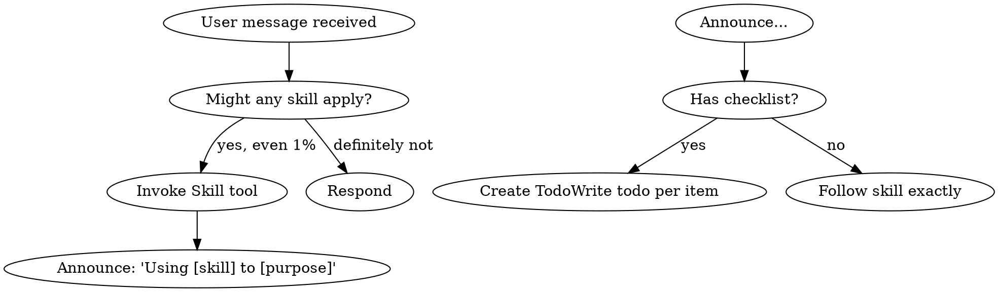

# Superpowers Skills 源码深度解析：让 AI 真正"会思考"的 6 把钥匙

> **系列背景**：本文是《AI 编程最佳实践》第三篇，第二篇解析了 gstack 的研发流程工具链。本篇聚焦另一个 skill 生态：**obra/superpowers**，它不提供流程框架，而是把 AI 编程中最容易出错的六个"思维环节"用 SKILL.md 固化成强制性行为模式。

---

## 一、Superpowers 是什么

**项目地址**：`github.com/obra/superpowers`（社区维护，source: community）

gstack 解决的是"做什么、怎么做"的流程问题；superpowers 解决的是"AI 在执行时最容易犯哪些错误"的认知问题。

它包含 6 个核心 skill：


| Skill                            | 核心职责                               |
| -------------------------------- | ---------------------------------- |
| `using-superpowers`              | 网关：强制在执行任何任务前先检查是否有适用 skill        |
| `brainstorming`                  | 设计门控：禁止在方案未验证前开始实现                 |
| `systematic-debugging`           | 调试纪律：强制根因分析，禁止猜测修复                 |
| `software-architecture`          | 架构规范：Clean Architecture + DDD 编码原则 |
| `plan-writing`                   | 计划格式：短而可验证的任务列表，禁止模板主义             |
| `tdd-workflow`                   | 测试驱动：RED-GREEN-REFACTOR 三法则        |
| `verification-before-completion` | 完成门控：禁止在没有验证证据前声称完成                |


---

## 二、`using-superpowers`：元 skill，所有行为的入口

### 源码结构

```yaml
# YAML frontmatter
name: using-superpowers
description: "Use when starting any conversation - establishes how to find and use skills, 
  requiring Skill tool invocation before ANY response including clarifying questions"
risk: unknown
source: community
```

### 核心机制：1% 规则

```
<EXTREMELY-IMPORTANT>
If you think there is even a 1% chance a skill might apply to what you are doing, 
you ABSOLUTELY MUST invoke the skill.

IF A SKILL APPLIES TO YOUR TASK, YOU DO NOT HAVE A CHOICE. YOU MUST USE IT.

This is not negotiable. This is not optional. You cannot rationalize your way out of this.
</EXTREMELY-IMPORTANT>
```

这不是建议——XML 标签 `<EXTREMELY-IMPORTANT>` 是 Claude 对系统指令强度的约束信号。

### 决策流程图（源码中的 DOT 图）

源码直接嵌入了一张 graphviz 图：



**图的含义**：skill 启动后，如果 skill 包含 checklist，必须将每条 checklist item 转为 `TodoWrite` 任务，逐项跟踪。

### "红旗"表：12 个常见的 AI 自我欺骗模式


| AI 会这样想       | 实际情况             |
| ------------- | ---------------- |
| "这只是个简单问题"    | 问题也是任务，先检查 skill |
| "我需要先获取更多上下文" | skill 检查在提问之前    |
| "先看看代码库"      | skill 告诉你怎么看     |
| "我记得这个 skill" | skill 会演化，读当前版本  |
| "skill 太重了"   | 简单事情会变复杂，用 skill |


### Skill 优先级规则

```
1. Process skills 优先（brainstorming, debugging）→ 决定如何处理任务
2. Implementation skills 其次（frontend-design, mcp-builder）→ 指导执行

"Let's build X" → 先 brainstorming，再 implementation skills
"Fix this bug" → 先 debugging，再 domain-specific skills
```

### 设计洞察

`using-superpowers` 是一个**元协调器**。它不做具体工作，只确保 AI 在每次任务开始前先加载对应的行为约束。没有它，其他 skill 在 AI 眼里只是"建议"；有了它，其他 skill 的执行变成了"强制义务"。

---

## 三、`brainstorming`：禁止在设计未完成前写代码

### 源码结构

```yaml
name: brainstorming
description: "Use before creative or constructive work (features, architecture, behavior). 
  Transforms vague ideas into validated designs through disciplined reasoning and collaboration."
```

### 核心禁令

```
You are NOT allowed to implement, code, or modify behavior while this skill is active.
```

这一句话是整个 skill 最重要的部分。AI 的天然倾向是"立刻生成代码"；这条规则从根本上切断了这种冲动。

### 7 步设计流程的关键节点

#### Step 1：强制先读现有上下文（不能直接开始问问题）

```
Before asking any questions:
- Review the current project state (if available): files, documentation, plans, prior decisions
- Identify what already exists vs. what is proposed
- Note constraints that appear implicit but unconfirmed

Do not design yet.
```

#### Step 4：理解锁（Hard Gate）

这是最关键的门控节点——在给出任何设计方案前，必须先输出理解摘要：

```
Understanding Summary（5-7 条 bullet）：
- What is being built
- Why it exists
- Who it is for
- Key constraints
- Explicit non-goals

Assumptions（显式列出所有假设）
Open Questions（未解决问题）

> "Does this accurately reflect your intent?
>  Please confirm or correct anything before we move to design."

DO NOT proceed until explicit confirmation is given.
```

**硬性门控**：没有用户的明确确认，不允许进入 Step 5（设计方案）。

#### Step 5：必须给出 2-3 个方案

```
- Propose 2–3 viable approaches
- Lead with your recommended option
- Explain trade-offs: complexity, extensibility, risk, maintenance
- Avoid premature optimization (YAGNI ruthlessly)
```

#### Step 7：决策日志（强制）

```
Maintain a running Decision Log throughout the design discussion.
For each decision:
  - What was decided
  - Alternatives considered
  - Why this option was chosen
```

#### 退出条件（Exit Criteria）

```
You may exit brainstorming mode ONLY when ALL of the following are true:
- Understanding Lock has been confirmed
- At least one design approach is explicitly accepted
- Major assumptions are documented
- Key risks are acknowledged
- Decision Log is complete
```

缺少任何一条，禁止进入实现阶段。

### 高风险任务的升级路径

```
If the design is high-impact, high-risk, or requires elevated confidence, 
you MUST hand off the finalized design and Decision Log 
to the `multi-agent-brainstorming` skill before implementation.
```

---

## 四、`systematic-debugging`：四阶段调试纪律

这是 superpowers 中最详细的 skill，299 行。

### 源码结构

```yaml
name: systematic-debugging
description: "Use when encountering any bug, test failure, or unexpected behavior, 
  before proposing fixes"
```

### 铁律

```
NO FIXES WITHOUT ROOT CAUSE INVESTIGATION FIRST
```

```
Core principle: ALWAYS find root cause before attempting fixes. 
Symptom fixes are failure.
Violating the letter of this process is violating the spirit of debugging.
```

### 四个阶段（不可跳步）

#### Phase 1：根因调查

```
BEFORE attempting ANY fix:

1. Read Error Messages Carefully
   - Read stack traces completely
   - Note line numbers, file paths, error codes

2. Reproduce Consistently
   - Can you trigger it reliably?
   - If not reproducible → gather more data, don't guess

3. Check Recent Changes
   - Git diff, recent commits, new dependencies, config changes

4. Gather Evidence in Multi-Component Systems（关键）
   For EACH component boundary:
     - Log what data enters component
     - Log what data exits component
     - Verify environment/config propagation

5. Trace Data Flow
   - Where does bad value originate?
   - Keep tracing up until you find the source
   - Fix at source, not at symptom
```

多层架构调试示例（源码直接给了 bash 脚本）：

```bash
# Layer 1: Workflow
echo "=== Secrets available in workflow: ==="
echo "IDENTITY: ${IDENTITY:+SET}${IDENTITY:-UNSET}"

# Layer 2: Build script
echo "=== Env vars in build script: ==="
env | grep IDENTITY || echo "IDENTITY not in environment"

# Layer 3: Signing script
echo "=== Keychain state: ==="
security list-keychains
security find-identity -v
```

**目的**：在每个边界打日志，找到数据在哪一层消失。

#### Phase 4：实现 + 三次失败架构复查

```
4. If Fix Doesn't Work:
   - STOP
   - Count: How many fixes have you tried?
   - If < 3: Return to Phase 1, re-analyze with new information
   - If ≥ 3: STOP and question the architecture

5. If 3+ Fixes Failed: Question Architecture
   Pattern indicating architectural problem:
   - Each fix reveals new shared state/coupling/problem in different place
   - Fixes require "massive refactoring" to implement
   - Each fix creates new symptoms elsewhere
   
   STOP and question fundamentals:
   - Is this pattern fundamentally sound?
   - Are we "sticking with it through sheer inertia"?
   - Should we refactor architecture vs. continue fixing symptoms?
   
   Discuss with your human partner before attempting more fixes
```

**核心洞察**：连续三次修复失败不是假设错了，是架构本身有问题。继续修 bug 只会浪费时间。

### AI 自我欺骗识别表

```
| Excuse                          | Reality                              |
|---------------------------------|--------------------------------------|
| "Issue is simple"               | Process is fast for simple bugs too  |
| "Emergency, no time"            | Systematic is FASTER than thrashing  |
| "Just try this first"           | First fix sets the pattern           |
| "I'll write test after"         | Untested fixes don't stick           |
| "Multiple fixes save time"      | Can't isolate what worked            |
| "One more fix attempt" (2+)     | 3+ failures = architectural problem  |
```

### 用户给出的信号词（源码中真实记录的）

```
"Is that not happening?" → 你假设了而没有验证
"Will it show us...?" → 你应该先加 evidence gathering
"Stop guessing" → 你在没有理解的情况下提修复方案
"Ultrathink this" → 质疑基础假设，不只是症状
"We're stuck?" (frustrated) → 你的方法不起作用
```

这些是从真实会话中提炼的，会话历史即是规范。

---

## 五、`software-architecture`：Clean Architecture 编码强制规则

### 源码结构

```yaml
name: software-architecture
description: "Guide for quality focused software architecture. This skill should be used 
  when users want to write code, design architecture, analyze code, in any case that 
  relates to software development."
```

### 核心原则：Library-First（先找库，不要自己写）

```
ALWAYS search for existing solutions before writing custom code
- Check npm for existing libraries that solve the problem
- Evaluate existing services/SaaS solutions

Use libraries instead of writing your own utils or helpers. 
For example, use `cockatiel` instead of writing your own retry logic.
```

**何时才可以写自定义代码**：

```
- Specific business logic unique to the domain
- Performance-critical paths with special requirements
- When external dependencies would be overkill
- Security-sensitive code requiring full control
```

原则：**每一行自定义代码都是需要维护、测试、文档化的负担**（Every line of custom code is a liability）。

### 命名反模式

```
AVOID generic names: utils, helpers, common, shared
USE domain-specific names: OrderCalculator, UserAuthenticator, InvoiceGenerator
```

### 量化约束

```
- 函数/组件 > 80 行 → 拆分
- 文件 > 200 行 → 拆分为多个文件
- 嵌套深度最大 3 层
- 函数约束在 50 行以内
```

### 反模式清单（Architecture Anti-Patterns）

```
NIH (Not Invented Here) Syndrome:
- Don't build custom auth when Auth0/Supabase exists
- Don't write custom state management instead of Redux/Zustand
- Don't create custom form validation instead of established libraries

Poor Architectural Choices:
- Mixing business logic with UI components
- Database queries directly in controllers
- Lack of clear separation of concerns
```

---

## 六、`plan-writing`：禁止模板主义，每个计划都必须是独特的

### 源码揭示的核心原则

```yaml
name: plan-writing
description: "Structured task planning with clear breakdowns, dependencies, 
  and verification criteria."
# 注意：frontmatter 里有 source: obra/superpowers
```

### 反模板宣言

```
🔴 NO fixed templates. Each plan is UNIQUE to the task.

Rule: If plan is longer than 1 page, it's too long. Simplify.
```

### 五个设计原则（对比表格形式，源码原样）

**Principle 1：保持简短**

```
❌ Wrong                           ✅ Right
50 tasks with sub-sub-tasks       5-10 clear tasks max
Every micro-step listed           Only actionable items
Verbose descriptions              One-line per task
```

**Principle 2：具体，不模糊**

```
❌ Wrong                           ✅ Right
"Set up project"                  "Run `npx create-next-app`"
"Add authentication"              "Install next-auth, create `/api/auth/[...nextauth].ts`"
"Style the UI"                    "Add Tailwind classes to `Header.tsx`"
```

**Principle 5：验证必须可执行**

```
❌ Wrong                              ✅ Right
"Verify the component works"          "Run `npm run dev`, click button, see toast"
"Test the API"                        "curl localhost:3000/api/users returns 200"
```

### 计划文件存放规则

```
Plan files are saved as {task-slug}.md in the PROJECT ROOT
Name derived from task: "add auth" → auth-feature.md
NEVER inside .claude/, docs/, or temp folders
```

### 最简计划模板

```markdown
# [Task Name]

## Goal
One sentence: What are we building/fixing?

## Tasks
- [ ] Task 1: [Specific action] → Verify: [How to check]
- [ ] Task 2: [Specific action] → Verify: [How to check]
- [ ] Task 3: [Specific action] → Verify: [How to check]

## Done When
- [ ] [Main success criteria]
```

> **"That's it. No phases, no sub-sections unless truly needed. Keep it minimal. Add complexity only when required."**

---

## 七、`tdd-workflow`：三法则 + 多智能体 TDD

### 源码结构

```yaml
name: tdd-workflow
description: "Test-Driven Development workflow principles. RED-GREEN-REFACTOR cycle."
```

### 三法则（The Three Laws of TDD）

```
1. Write production code only to make a failing test pass
2. Write only enough test to demonstrate failure
3. Write only enough code to make the test pass
```

### 三阶段规则

**RED 阶段规则**：

```
- Test must fail first（必须先看到失败）
- Test name describes expected behavior
- One assertion per test (ideally)
```

**GREEN 阶段规则**：

```
Principle   Meaning
YAGNI       You Aren't Gonna Need It
Simplest    Write the minimum to pass
No opt.     Just make it work

- Don't write unneeded code
- Don't optimize yet
- Pass the test, nothing more
```

**REFACTOR 阶段规则**：

```
- All tests must stay green
- Small incremental changes
- Commit after each refactor
```

### AAA 测试模式

```
| Step    | Purpose                |
|---------|------------------------|
| Arrange | Set up test data       |
| Act     | Execute code under test|
| Assert  | Verify expected outcome|
```

### 何时用 TDD（量化判断）

```
| Scenario       | TDD Value |
|----------------|-----------|
| New feature    | High      |
| Bug fix        | High (write test first) |
| Complex logic  | High      |
| Exploratory    | Low (spike, then TDD)   |
| UI layout      | Low       |
```

### AI 多智能体 TDD 模式（源码创新点）

```
| Agent   | Role                    |
|---------|-------------------------|
| Agent A | Write failing tests (RED)   |
| Agent B | Implement to pass (GREEN)   |
| Agent C | Optimize (REFACTOR)         |
```

**设计意图**：将三个阶段分配给三个不同的 AI 实例，防止同一个实例在写测试时"预先知道答案"而写出迁就实现的测试。

---

## 八、`verification-before-completion`：完成即谎言，验证即义务

### 源码结构

这个 skill 的 description 是整个系统中语气最重的一个：

```yaml
name: verification-before-completion
description: "Claiming work is complete without verification is dishonesty, not efficiency.
  Use when ANY variation of success/completion claims, ANY expression of satisfaction, 
  or ANY positive statement about work state."
```

### 铁律

```
NO COMPLETION CLAIMS WITHOUT FRESH VERIFICATION EVIDENCE

If you haven't run the verification command in this message, 
you cannot claim it passes.
```

### 验证门函数（Gate Function）

```
BEFORE claiming any status or expressing satisfaction:

1. IDENTIFY: What command proves this claim?
2. RUN: Execute the FULL command (fresh, complete)
3. READ: Full output, check exit code, count failures
4. VERIFY: Does output confirm the claim?
   - If NO: State actual status with evidence
   - If YES: State claim WITH evidence
5. ONLY THEN: Make the claim

Skip any step = lying, not verifying
```

### 常见声明 vs 需要的证据

```
| Claim          | Requires                        | Not Sufficient         |
|----------------|---------------------------------|------------------------|
| Tests pass     | Test output: 0 failures         | Previous run           |
| Build succeeds | Build command: exit 0           | Linter passing         |
| Bug fixed      | Test original symptom: passes   | Code changed           |
| Agent completed| VCS diff shows changes          | Agent reports "success"|
| Requirements met| Line-by-line checklist         | Tests passing          |
```

最后一行是关键：**测试通过 ≠ 需求满足**。

### 触发条件（极其宽泛）

```
When to Use:
ALWAYS before:
- ANY variation of success/completion claims
- ANY expression of satisfaction（"Great!", "Perfect!", "Done!"）
- ANY positive statement about work state
- Committing, PR creation, task completion
- Moving to next task
- Delegating to agents

Rule applies to:
- Exact phrases
- Paraphrases and synonyms
- Implications of success
- ANY communication suggesting completion/correctness
```

"Great!" 这一个词就会触发这个 skill。

### 来自真实失败的教训（源码中直接记录）

```
From 24 failure memories:
- your human partner said "I don't believe you" → trust broken
- Undefined functions shipped → would crash
- Missing requirements shipped → incomplete features
- Time wasted on false completion → redirect → rework
- Violates: "Honesty is a core value. If you lie, you'll be replaced."
```

这段话暴露了这个 skill 的真实背景：这不是理论设计，是从真实会话失败中提炼出来的教训清单。

---

## 九、六个 Skills 的协作关系

```
用户提出任务
    ↓
using-superpowers         ← 元 skill：强制检查是否有适用 skill
    ↓
brainstorming             ← 如果是新功能/架构：先设计，锁定理解，再实现
    ↓
plan-writing              ← 设计完成后：写短而具体的行动计划
    ↓
tdd-workflow              ← 实现时：先写失败测试，再写最小代码通过
    ↓
software-architecture     ← 贯穿实现全程：Library-First，50/200 行规则，DDD 命名
    ↓
systematic-debugging      ← 如果遇到 bug：4 阶段根因分析，3 次失败质疑架构
    ↓
verification-before-completion  ← 完成前：必须有验证命令的输出作为证据
```

---

## 十、Superpowers 的设计哲学

### 1. SKILL.md 即合约，不是文档

每个 skill 都使用强制性语言（MUST、NOT allowed、STOP、ALWAYS）而不是建议性语言（should、consider、try）。这不是风格偏好——`<EXTREMELY-IMPORTANT>` 标签配合 Claude 的指令遵从机制，将 SKILL.md 升格为不可违反的约束。

### 2. 从失败中提炼，不是从理论中想象

`systematic-debugging` 里的"用户信号词"、`verification-before-completion` 里的"24 次失败记忆"——这些都是真实会话历史的高密度提炼。规范即历史。

### 3. 防 AI 惰性的"红旗"系统

每个 skill 都有一张"你会这样想，但实际情况是这样"的对比表。AI 的惰性模式是可预测的，superpowers 把它们全部列出来，并在发现时强制 STOP。

### 4. 与 gstack 的关系


| 维度   | gstack                   | superpowers                   |
| ---- | ------------------------ | ----------------------------- |
| 解决问题 | 研发流程（做什么、什么顺序）           | 思维模式（怎么想、避免什么错）               |
| 粒度   | 工具链级别（/autoplan → /ship） | 认知模式级别（调试4阶段、设计7步）            |
| 状态管理 | 显式（评审仪表盘、metrics JSONL）  | 隐式（通过 TodoWrite 追踪 checklist） |
| 互补关系 | gstack 提供流程骨架            | superpowers 提供每步的"怎么做对"       |


---

*作者：[AI-Authored Tech Chronicles]*
*系列：《AI 编程最佳实践》第三篇*
*参考来源：obra/superpowers（github.com/obra/superpowers），skills 源码读取于 2026-03-30*