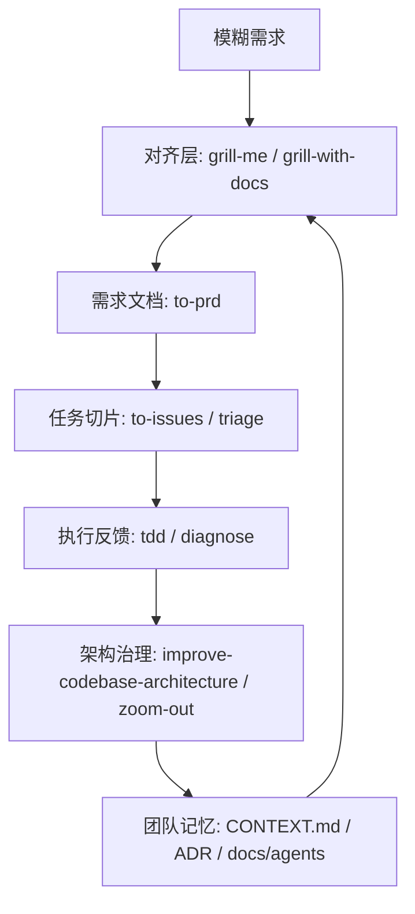

# Matt Pocock Skills 深度解析：把工程判断封装成可调用的 Agent 能力

> **系列背景**：本文是《AI 编程最佳实践》第八篇。第七篇横向比较了多个 Agent 框架如何处理意图理解与需求拆分，本篇转向一个更轻量的工程框架：[mattpocock/skills](https://github.com/mattpocock/skills)。它不试图接管整个研发流程，而是把工程师每天依赖的判断力拆成一组小型、可组合、可安装的 skill。分析基于 `README.md`、`.claude-plugin/plugin.json`、`CLAUDE.md`、`CONTEXT.md` 与各 `SKILL.md` 原文，资料读取于 2026-04-29。

---

## 一、它到底是什么

`mattpocock/skills` 的 README 开头把定位说得很直接：

> My agent skills that I use every day to do real engineering - not vibe coding.

这句话可以拆成三层含义。

第一，项目的对象不是某个单一 IDE，也不是某个全流程研发平台，而是 **agent skills**：一组可被 Claude Code、Codex、Cursor 等 Agent 读取的行为协议。每个 skill 通过 `SKILL.md` 描述触发条件、执行步骤、检查清单与附属资料。

第二，它强调的是 **real engineering**。这里的工程不是“生成代码”，而是需求澄清、Issue 流转、测试反馈、故障复现、架构治理、危险操作拦截这些真实软件开发中会决定质量的工作。

第三，它明确反对 **vibe coding**。README 把 GSD、BMAD、Spec-Kit 这类方案归为试图“owning the process”的框架，而 `mattpocock/skills` 选择另一条路线：skill 要小、易改、可组合，并且把控制权留给工程师。

这个项目因此更像一个 **AI 工程微内核**。它不提供统一大流程，而是提供一组可插拔的系统调用：

| 层级 | 代表 skill | 解决的问题 |
| --- | --- | --- |
| 仓库初始化 | `setup-matt-pocock-skills` | 告诉 Agent 本仓库的 Issue tracker、triage label、领域文档在哪里 |
| 意图对齐 | `grill-me`、`grill-with-docs`、`to-prd` | 在执行前把模糊需求转成共享理解 |
| 工作拆分 | `to-issues`、`triage` | 把计划拆成可领取、可追踪、可交给 Agent 的垂直切片 |
| 反馈闭环 | `tdd`、`diagnose` | 用测试、复现、假设、插桩给 Agent 提供可验证信号 |
| 架构治理 | `improve-codebase-architecture`、`zoom-out` | 防止代码库在 Agent 加速下变成难以修改的泥球 |
| 表达与自举 | `caveman`、`write-a-skill` | 压缩沟通成本，并让团队继续扩展自己的 skill |
| 工具护栏 | `git-guardrails-claude-code`、`setup-pre-commit` 等 | 把危险操作和质量检查下沉到工具层 |

项目的 `.claude-plugin/plugin.json` 也印证了这个边界。插件只注册了 9 个 engineering skills 和 3 个 productivity skills：

```json
{
  "name": "mattpocock-skills",
  "skills": [
    "./skills/engineering/diagnose",
    "./skills/engineering/grill-with-docs",
    "./skills/engineering/triage",
    "./skills/engineering/improve-codebase-architecture",
    "./skills/engineering/setup-matt-pocock-skills",
    "./skills/engineering/tdd",
    "./skills/engineering/to-issues",
    "./skills/engineering/to-prd",
    "./skills/engineering/zoom-out",
    "./skills/productivity/caveman",
    "./skills/productivity/grill-me",
    "./skills/productivity/write-a-skill"
  ]
}
```

`misc` 目录的四个 skill 在 README 中被标为“rarely used”，但没有进入插件默认清单。这是一个重要设计信号：框架把日常工作路径和偶发工具脚本分开，避免默认上下文被过多能力污染。

---

## 二、源码结构：Skill 不是提示词，而是行为协议

`CLAUDE.md` 给出了仓库组织规则：

- `engineering/`：日常代码工作
- `productivity/`：日常非代码工作流
- `misc/`：保留但不常用的工具
- `personal/`：作者个人环境相关，不对外推广
- `deprecated/`：废弃能力

同时它要求 `engineering/`、`productivity/`、`misc/` 中的每个 skill 都必须在顶层 README 中出现，且 README 中的 skill 名称必须链接到对应 `SKILL.md`。这个约束让仓库有两个入口：README 面向人类，`SKILL.md` 面向 Agent。

`write-a-skill/SKILL.md` 进一步定义了一个标准 skill 的形状：

```text
skill-name/
├── SKILL.md
├── REFERENCE.md
├── EXAMPLES.md
└── scripts/
    └── helper.js
```

`SKILL.md` 的 frontmatter 是触发器：

```md
---
name: skill-name
description: Brief description of capability. Use when [specific triggers].
---
```

这里最关键的是 `description`。原文明确指出：description 是 Agent 决定是否加载该 skill 时能看到的唯一信息。因此它必须说明两件事：

1. 这个 skill 提供什么能力。
2. 什么时候应该触发它。

这解释了为什么 `mattpocock/skills` 的每个 skill 都很像一个精简的操作规程，而不是一段泛泛的提示词。提示词通常描述“你应该怎样思考”；skill 描述“当场景 X 出现时，按步骤 A、B、C 执行，并在必要时读取这些附属文件”。

有些 skill 还带有 `disable-model-invocation: true`，例如 `grill-with-docs`、`setup-matt-pocock-skills`、`zoom-out`。这类 skill 的含义是：不要再启动额外模型调用，而是直接把当前 Agent 的行为切换到某个规程。它们更像模式切换器，不是外包任务的入口。

---

## 三、README 的四个失败模式

README 的核心不是 skill 列表，而是四个失败模式。它们构成了整个框架的设计坐标系。

### 3.1 Agent 没有理解需求

README 把第一个问题命名为：

> The Agent Didn't Do What I Want

传统开发中，人类工程师也会误解需求；AI Agent 的问题是误解成本更低、执行速度更快。输入越模糊，模型越容易“合理化”：沿着表面语义生成一个看似合理但偏离真实意图的实现。

框架给出的答案是 `grill-me` 和 `grill-with-docs`。它们强制 Agent 在执行前进行持续追问，直到设计树上的关键分支被逐一解析。

### 3.2 Agent 太啰嗦

第二个问题表面上是表达问题，本质上是领域语言问题。README 引用 DDD 的 ubiquitous language，指出 Agent 被丢进代码库后往往不知道团队内部词汇，只能用很多普通话描述一个项目内已有精确名称的概念。

`grill-with-docs` 的答案不是要求 Agent “少说点”，而是维护 `CONTEXT.md`。当一个术语被澄清，Agent 要立即把它写入领域词汇表；当一个术语与已有定义冲突，Agent 要当场指出。

这种设计把“少废话”转化为“拥有共享语言”。语言压缩不是风格优化，而是知识建模。

### 3.3 代码不能工作

第三个问题是反馈环缺失。README 的判断很硬：

> Without feedback on how the code it produces actually runs, the agent will be flying blind.

Agent 不怕写代码，怕的是没有可运行、可重复、可判定的反馈信号。`tdd` 和 `diagnose` 分别处理两个场景：

- 新功能或修 bug 时，用 red-green-refactor 与垂直切片建立测试反馈。
- 遇到复杂 bug 或性能回退时，先构造反馈环，再复现、假设、插桩、修复、回归。

这两个 skill 的共同点是：先把“感觉”变成“信号”。

### 3.4 代码库变成泥球

第四个问题是 Agent 加速带来的架构熵增。README 直接说：Agent 能极大加快编码，也会以前所未有的速度加速软件熵增。

`improve-codebase-architecture` 和 `zoom-out` 的职责就是抵消这种趋势。前者寻找 deepening opportunities，把浅模块重构成深模块；后者要求 Agent 升高抽象层级，解释某段代码在整体系统中的位置。

这里的设计立场非常明确：AI 编程不是只要更快地产生代码，还要更系统地保护代码库的长期可修改性。

---

## 四、完整工作闭环

`mattpocock/skills` 的能力不是线性的，而是一个围绕“共享理解”和“反馈信号”旋转的闭环。



这个闭环有三个关键状态文件。

第一类是 `docs/agents/*`。`setup-matt-pocock-skills` 会为仓库配置 Issue tracker、triage label 和 domain docs。它让 Agent 知道“工作在哪里流转”。

第二类是 `CONTEXT.md` 或 `CONTEXT-MAP.md`。它们定义项目领域语言，让后续 PRD、Issue、测试命名、架构建议使用同一套术语。

第三类是 `docs/adr/`。它记录那些难以逆转、没有上下文会显得奇怪、且确实来自真实权衡的架构决策。

这三类文件让 skill 不只是当次会话的临时提示，而能把一次交互沉淀成下一次交互的上下文。

---

## 五、核心 Skill 的设计思想

### 5.1 `setup-matt-pocock-skills`：先配置协作地形

`setup-matt-pocock-skills` 是工程类 skill 的入口。它不直接写业务代码，而是让仓库具备被其他 skill 正确理解的上下文。

源码要求它探索这些位置：

- `git remote -v` 与 `.git/config`，判断 Issue tracker 倾向于 GitHub、GitLab 还是本地 markdown。
- `AGENTS.md`、`CLAUDE.md`，判断是否已有 `## Agent skills` 区块。
- `CONTEXT.md`、`CONTEXT-MAP.md`、`docs/adr/`，判断领域语言与架构决策文档布局。
- `docs/agents/`，判断此前是否已经配置过。

它随后让用户逐项确认三件事：Issue tracker、triage label vocabulary、domain docs。

这个 skill 的深层价值是把“本仓库如何协作”显式化。没有这一步，`to-prd` 不知道 PRD 要发到哪里，`triage` 不知道应该使用哪些标签，`tdd` 与 `diagnose` 不知道该读哪份领域语言。

### 5.2 `grill-me` 与 `grill-with-docs`：把需求澄清变成门控

`grill-me` 极短，核心指令只有几句话：持续访谈用户，沿设计树逐个分支追问，每次只问一个问题；如果问题能通过探索代码库回答，就不要问用户，直接探索。

`grill-with-docs` 在此基础上加入了领域文档和 ADR。

它要求 Agent 在会话中执行四类动作：

- 当用户用词与 `CONTEXT.md` 冲突时，立即指出冲突。
- 当用户使用模糊或重载术语时，提出精确 canonical term。
- 用具体场景压力测试领域关系。
- 当用户描述与代码实际行为矛盾时，明确指出。

更关键的是，它要求当术语被解析时立即更新 `CONTEXT.md`，不要批处理。ADR 也不是随手写，只有同时满足三个条件才建议创建：难以逆转、没有上下文会让未来读者困惑、确实来自真实取舍。

这套设计把“问清楚”从交流技巧提升为工程门控。需求澄清不再是会议纪要，而是领域模型与架构记录的增量更新。

### 5.3 `to-prd` 与 `to-issues`：从需求到可领取工作

`to-prd` 的一句关键约束是：

> Do NOT interview the user — just synthesize what you already know.

这意味着它不是需求澄清工具，而是上下文沉淀工具。它假设前面的对齐已经完成，接下来要把现有会话和代码库理解综合成 PRD，并发布到项目 Issue tracker。

它要求 PRD 包含问题陈述、解决方案、用户故事、实现决策、测试决策、非目标与补充说明。特别值得注意的是，它明确要求不要在实现决策里写具体文件路径或代码片段，因为这些内容很快过期。PRD 应该记录相对稳定的模块、接口、契约与架构决策。

`to-issues` 则把 PRD 或计划拆成 independently-grabbable issues。它反对按层横切，例如“先做数据库、再做 API、最后做 UI”。它要求每个 issue 都是 tracer bullet：从 schema、API、UI 到测试的一条很窄但完整的垂直路径。

这对 Agent 协作很重要。一个水平切片完成后往往不可演示，也难以验证业务价值；一个垂直切片完成后，即使范围小，也能独立运行、独立验收、独立交给 Agent。

### 5.4 `triage`：把 Issue 流转设计成状态机

`triage` 把 Issue 管理压缩成两个 category roles 与五个 state roles。

两个类别：

- `bug`
- `enhancement`

五个状态：

- `needs-triage`
- `needs-info`
- `ready-for-agent`
- `ready-for-human`
- `wontfix`

每个 Issue 应该同时携带一个类别角色和一个状态角色。如果状态冲突，Agent 必须先提示维护者。

这个设计的核心不是标签本身，而是 **AFK-ready** 的概念。`ready-for-agent` 表示该 Issue 已经完全规格化，Agent 可以在没有额外人类上下文的情况下领取。为了达到这个状态，bug 需要先尝试复现，需求需要必要时进入 `grill-with-docs`，最终要写出 agent brief。

换句话说，`triage` 把“能不能交给 AI 做”从主观判断转成 Issue 状态机中的一个显式状态。

### 5.5 `tdd`：测试行为，不测试实现

`tdd` 的核心原则是：

> Tests should verify behavior through public interfaces, not implementation details.

它反对一次性写完所有测试再写所有实现，因为那会把 RED 阶段误解为“写一堆想象中的测试”。正确方式是 vertical slices via tracer bullets：

```text
RED -> GREEN: test1 -> impl1
RED -> GREEN: test2 -> impl2
RED -> GREEN: test3 -> impl3
```

每一轮只写一个验证一个行为的测试，再写刚好让这个测试通过的实现。所有测试通过后再重构，且永远不在 RED 状态下重构。

这对 Agent 特别关键。Agent 很容易提前抽象、提前补齐未来功能、提前生成看似完整的测试矩阵。`tdd` 用“一次一个行为”的规则压住这种过度生成冲动。

### 5.6 `diagnose`：调试的第一性原理是反馈环

`diagnose` 的第一阶段不是读代码，也不是猜原因，而是建立反馈环。原文说：

> This is the skill. Everything else is mechanical.

它列出了 10 种构造反馈环的方法：失败测试、curl 脚本、CLI fixture、headless browser、trace replay、throwaway harness、property/fuzz loop、bisect harness、differential loop、HITL bash script。

这个列表的价值在于给 Agent 一个明确优先级：先找到可重复、可运行、可判定的信号，再进入复现、假设、插桩、修复、回归测试。

`diagnose` 还要求先提出 3-5 个可证伪假设。每个假设必须说明预测：如果它是原因，那么某个操作会让 bug 消失或变严重。不能提出预测的假设就是 vibe，应当丢弃或重新表述。

这套规程把调试从“读代码找灵感”改造成“构造实验验证假设”。

### 5.7 `improve-codebase-architecture`：用深模块抵抗熵增

`improve-codebase-architecture` 的目标是寻找 deepening opportunities，也就是把浅模块变成深模块的机会。

它先定义一套架构词汇：

- **Module**：任何拥有 interface 与 implementation 的东西。
- **Interface**：调用者正确使用模块需要知道的一切，不只是类型签名。
- **Depth**：接口上的杠杆率；小接口背后承载大量行为就是深模块。
- **Seam**：可以不在原处编辑就改变行为的位置。
- **Adapter**：满足某个 seam 上 interface 的具体实现。
- **Leverage**：调用者从深度中获得的能力。
- **Locality**：维护者从深度中获得的集中性。

它还给出 deletion test：想象删除某个模块。如果复杂度消失，它只是传递层；如果复杂度重新分散到多个调用者，它就在发挥价值。

这套词汇对 Agent 架构建议很重要。没有共享词汇，Agent 很容易泛泛建议“提取 service”“增加抽象层”“解耦组件”。有了 `LANGUAGE.md`，它必须围绕 module、interface、depth、seam、adapter、leverage、locality 来陈述问题和收益。

### 5.8 `zoom-out`：当局部看不懂时升高抽象层

`zoom-out` 很短，但作用很实用。它要求 Agent 不熟悉某段代码时，不要继续钻局部细节，而是上升一层，给出相关模块与调用者地图，并使用项目领域词汇。

这对应一个常见失败模式：Agent 在局部文件里做“就地修补”，但没有理解该文件在系统中的角色。`zoom-out` 提供了一个低成本刹车。

### 5.9 `caveman`：压缩表达，而不是压缩语义

`caveman` 是一个持久化的极简表达模式。它要求删除冠词、寒暄、填充词和弱化表达，保留所有技术信息。原文声称可以减少约 75% token。

它不是装腔作势的风格技巧，而是对 Agent 沟通成本的控制。工程组织一旦把领域语言沉淀到 `CONTEXT.md`，再叠加 `caveman` 这类表达压缩，Agent 会话就能更接近“高密度工程日志”，而不是“礼貌但冗长的解释”。

### 5.10 `write-a-skill`：框架的自举能力

`write-a-skill` 让团队可以继续创建自己的 skill。它要求先收集任务领域、用例、是否需要脚本、是否需要参考资料，然后创建 `SKILL.md`、可选参考文件和可选脚本。

它还定义了 progressive disclosure 的原则：`SKILL.md` 应保持短小，超过 100 行或存在多个独立领域时，应拆出 `REFERENCE.md`、`EXAMPLES.md` 或脚本。

这让 `mattpocock/skills` 不只是作者的 skill 集合，而是一种可复制的 skill 写法。

### 5.11 `misc` 目录：偶发但具体的工具化能力

`misc` 中的 skill 没有进入插件默认清单，但它们展示了另一类设计：当操作具有确定性、重复性、风险边界清晰时，可以把它封装成专用工具 skill。

- `git-guardrails-claude-code`：设置 Claude Code hook，拦截 `git push`、`git reset --hard`、`git clean -f`、`git branch -D` 等危险命令。
- `setup-pre-commit`：安装 Husky、lint-staged、Prettier，并把 typecheck/test 放进 pre-commit。
- `migrate-to-shoehorn`：把测试中的 TypeScript `as` 断言迁移到 `@total-typescript/shoehorn`。
- `scaffold-exercises`：按课程目录规则生成 exercise 结构，并运行 lint。

这些 skill 的共同特征是任务边界窄、执行步骤明确，适合作为“工具按钮”，不适合作为 Agent 的常驻思维模式。

---

## 六、如何在团队中落地

对技术负责人而言，采用 `mattpocock/skills` 的最短路径不是“一次装完所有 skill”，而是按反馈环逐步接入。

第一步，安装并运行 setup：

```bash
npx skills@latest add mattpocock/skills
```

然后选择需要安装到哪些 coding agents，并运行 `/setup-matt-pocock-skills`。它会确认 Issue tracker、triage labels 和 domain docs。

第二步，建立领域语言。先不追求完整，只要让 `grill-with-docs` 在关键需求讨论中逐步写入 `CONTEXT.md`。一个稳定术语胜过十段临时解释。

第三步，把需求流转显式化。用 `to-prd` 将已澄清的上下文沉淀为 PRD，用 `to-issues` 拆成垂直切片，再用 `triage` 标记哪些 issue 已经 `ready-for-agent`。

第四步，把执行质量绑定到反馈。新功能优先使用 `tdd`，复杂 bug 使用 `diagnose`。没有反馈环的任务不要轻易交给 Agent 独立执行。

第五步，周期性做架构检查。每隔一段时间运行 `improve-codebase-architecture`，寻找 shallow module、错误 seam 和难测试区域。Agent 加速越明显，架构治理越不能滞后。

这条路径的目标不是让 AI 接管团队，而是让团队把已有工程纪律编码到 AI 可以遵循的工作协议里。

---

## 七、工程取舍

`mattpocock/skills` 的优势很清晰。

它足够轻。每个 skill 都围绕一个具体失败模式，不要求团队迁移到全新研发平台。

它足够可组合。需求澄清、PRD、Issue、TDD、诊断、架构治理之间没有强耦合，团队可以按痛点逐步接入。

它尊重工程师控制权。README 明确反对让框架 own the process；skill 提供的是可调用规程，而不是不可解释的自动化黑箱。

但它也有代价。

第一，它假设团队已有基本工程纪律。没有 Issue tracker、测试文化、领域语言意识的团队，单独安装 skill 不会自动变好。

第二，它依赖文档长期维护。`CONTEXT.md`、`docs/agents/*`、ADR 一旦过期，Agent 会把过期知识放大为错误决策。

第三，它的强度来自人类持续确认。`grill-with-docs`、`to-issues`、`triage` 都要求在关键节点向用户确认。它不是 AFK 自动流水线，而是 HITL 工程放大器。

第四，它不是企业治理平台。权限、安全审计、跨仓库标准、组织级质量指标仍需要外部系统承接。`git-guardrails-claude-code` 能拦截危险命令，但不能替代完整的 DevSecOps 体系。

---

## 八、结论：Skills 是工程判断的封装格式

`mattpocock/skills` 最值得学习的地方，不是某一个 skill 的具体措辞，而是它对 AI 编程问题的重新定义。

它认为 Agent 的主要风险不是不会写代码，而是：

- 在意图不清时过早执行
- 在没有共享语言时冗长解释
- 在没有反馈环时盲目修改
- 在没有架构治理时加速熵增

对应的解决方式也不是“写一个更强提示词”，而是把工程师原本依赖经验完成的动作固化为 skill：追问、澄清、记录、拆分、复现、测试、诊断、重构、拦截。

因此，`mattpocock/skills` 可以被理解为一种面向 Agent 的工程协议格式。它把团队的方法论切成小块，让模型在正确场景加载正确规程；同时又保留工程师对流程、边界和取舍的最终控制权。

这也是它与大型 AI 工程框架最大的差异：它不把研发变成一条不可见的自动化流水线，而是把每个关键工程动作显式化、文件化、可审查化。对技术负责人来说，这种设计更容易进入真实团队，因为它不是替代工程纪律，而是把工程纪律变成 Agent 能执行的接口。

---

## 附录：核心 Skill 原文中文译文

以下译文按执行语义整理，保留原 skill 的触发条件、关键规则和流程结构。为避免正文被长篇说明淹没，附录承担“中文使用手册”的作用。

### A. Engineering Skills

#### A.1 `setup-matt-pocock-skills`

**用途**：在 `AGENTS.md` 或 `CLAUDE.md` 中设置 `## Agent skills` 区块，并创建 `docs/agents/` 文档，使其他工程类 skill 知道本仓库的 Issue tracker、triage label 词汇和领域文档布局。

**触发条件**：首次使用 `to-issues`、`to-prd`、`triage`、`diagnose`、`tdd`、`improve-codebase-architecture`、`zoom-out` 前，或这些 skill 缺少仓库上下文时。

**流程译文**：

1. 探索仓库，不做假设。读取 git remote、`AGENTS.md`、`CLAUDE.md`、`CONTEXT.md`、`CONTEXT-MAP.md`、`docs/adr/`、`docs/agents/` 与 `.scratch/`。
2. 向用户逐项确认三类决策：Issue tracker、triage label vocabulary、domain docs。
3. 展示将要写入的 `## Agent skills` 区块和三个文档草稿，让用户修改后再写入。
4. 如果 `CLAUDE.md` 已存在就编辑它；否则编辑 `AGENTS.md`；两者都不存在时询问用户创建哪一个。不得重复追加已有区块。
5. 写入 `docs/agents/issue-tracker.md`、`docs/agents/triage-labels.md`、`docs/agents/domain.md`。

**设计思想**：先让 Agent 理解仓库协作地形，再让它执行 PRD、Issue、triage、测试与架构工作。

#### A.2 `grill-with-docs`

**用途**：针对用户计划进行持续追问，同时挑战计划是否符合现有领域模型，并在决策明确时更新 `CONTEXT.md` 和 ADR。

**触发条件**：用户希望压力测试计划，或希望把设计与项目语言、已有决策对齐。

**流程译文**：

持续访谈用户，直到双方达成共享理解。沿设计树逐个分支推进，逐项解析决策之间的依赖。每次只问一个问题，并为每个问题给出推荐答案。如果问题可以通过代码库探索回答，就直接探索代码库。

探索时还要寻找现有文档：单上下文仓库通常有根目录 `CONTEXT.md` 与 `docs/adr/`；多上下文仓库通过 `CONTEXT-MAP.md` 指向各上下文。

会话中必须执行：

- 当用户用词与 `CONTEXT.md` 冲突时，立即指出并要求澄清。
- 当用户使用模糊词时，提出精确标准术语。
- 用具体场景压力测试领域关系和边界。
- 当用户描述与代码不一致时，指出矛盾。
- 当术语被解析，立即更新 `CONTEXT.md`，不要集中到最后。
- 只有当决策难以逆转、没有上下文会显得奇怪、且来自真实取舍时，才建议创建 ADR。

**设计思想**：让需求澄清直接沉淀为团队语言和架构记忆。

#### A.3 `to-prd`

**用途**：把当前会话上下文和代码库理解综合成 PRD，并发布到项目 Issue tracker。

**触发条件**：用户希望基于当前上下文创建 PRD。

**流程译文**：

不要继续访谈用户，只综合已有信息。必要时先探索仓库，使用项目领域词汇，并尊重相关 ADR。然后识别实现中需要构建或修改的主要模块，主动寻找可测试的深模块机会。向用户确认模块划分和测试重点。

PRD 应包含：

- Problem Statement：从用户视角描述问题。
- Solution：从用户视角描述解决方案。
- User Stories：覆盖功能各方面的长编号列表。
- Implementation Decisions：记录模块、接口、技术澄清、架构决策、Schema、API 契约与交互，不包含易过期的具体文件路径或代码片段。
- Testing Decisions：说明好测试的标准、测试模块和已有测试先例。
- Out of Scope：明确非目标。
- Further Notes：补充说明。

**设计思想**：PRD 不是代码计划，而是稳定业务意图、接口契约和测试判断的沉淀物。

#### A.4 `to-issues`

**用途**：把计划、规格或 PRD 拆成可独立领取的 Issue。

**触发条件**：用户希望把计划转成 tickets/issues，或拆解实现工作。

**流程译文**：

从已有上下文开始。如果用户传入 Issue 引用，读取 Issue 正文与评论。必要时探索代码库，使用项目领域语言，并尊重 ADR。

将计划拆成 tracer bullet 式的垂直切片。每个切片都应穿过所有集成层，而不是只做某一层。切片可以是 HITL 或 AFK；能交给 Agent 独立完成时优先标记 AFK。

每个切片应满足：

- 交付一条窄但完整的端到端路径。
- 完成后可以独立演示或验证。
- 优先多个薄切片，而不是少数厚切片。

发布前向用户展示编号列表，包括标题、类型、依赖和覆盖的用户故事，确认粒度、依赖、HITL/AFK 标记是否正确。用户批准后按依赖顺序发布到 Issue tracker，并应用 `needs-triage` 标签。

**设计思想**：让 Agent 领取的不是“层任务”，而是可验证的端到端业务增量。

#### A.5 `triage`

**用途**：通过 triage role 状态机管理 Issue。

**触发条件**：用户希望创建 Issue、triage Issue、处理 bug 或 feature request、准备 AFK agent 可领取任务，或管理 Issue 工作流。

**流程译文**：

所有 triage 期间发布到 Issue tracker 的评论或 Issue 都必须以免责声明开头：

```md
> *This was generated by AI during triage.*
```

角色分为两类。类别角色包括 `bug` 与 `enhancement`。状态角色包括 `needs-triage`、`needs-info`、`ready-for-agent`、`ready-for-human`、`wontfix`。每个 Issue 应同时拥有一个类别角色和一个状态角色。若状态角色冲突，先提示维护者。

常规状态流转：未标记 Issue 先进入 `needs-triage`；随后转为 `needs-info`、`ready-for-agent`、`ready-for-human` 或 `wontfix`；当 reporter 回复后，`needs-info` 回到 `needs-triage`。

处理具体 Issue 时：

1. 读取完整正文、评论、标签、作者和时间。
2. 读取先前 triage notes，避免重复提问。
3. 探索代码库，读取 `.out-of-scope/` 中的历史拒绝理由。
4. 给出类别与状态建议。
5. 对 bug 先尝试复现。
6. 必要时进入 `grill-with-docs`。
7. 根据结果发布 agent brief、human brief、needs-info notes，或关闭 wontfix。

**设计思想**：把“是否可以交给 Agent”变成 Issue 状态机中的显式状态。

#### A.6 `tdd`

**用途**：用 red-green-refactor 循环构建功能或修复 bug。

**触发条件**：用户要求 TDD、red-green-refactor、integration tests 或 test-first development。

**流程译文**：

核心原则：测试应通过公共接口验证行为，而不是验证实现细节。好测试像规格说明，描述系统做什么；坏测试耦合内部实现，重构时行为没变却失败。

反模式：不要先写所有测试，再写所有实现。这叫水平切片，会产生想象中的测试，测试数据结构和函数形状，而不是用户可观察行为。

正确方法：垂直切片。一次写一个测试，写最少实现使其通过，再继续下一个测试。

工作流：

1. 规划阶段确认接口变化、关键行为、可测试深模块机会、测试接口设计和行为列表，并获得用户批准。
2. 写一个 tracer bullet 测试，验证一件事：RED 失败，GREEN 最小实现通过。
3. 对剩余行为重复：一个测试、一个最小实现。
4. 全部测试通过后再重构，提取重复、深化模块、自然应用 SOLID，并在每次重构后运行测试。

每轮检查：

- 测试描述行为，不描述实现。
- 测试只使用公共接口。
- 测试能承受内部重构。
- 实现只满足当前测试。
- 不增加投机功能。

**设计思想**：用最小可验证行为约束 Agent 的生成冲动。

#### A.7 `diagnose`

**用途**：处理困难 bug 和性能回退的纪律化诊断循环。

**触发条件**：用户说 diagnose/debug，报告 bug，描述 broken、throwing、failing，或性能回退。

**流程译文**：

阶段一：建立反馈环。这就是整个 skill。只要有快速、确定、Agent 可运行的通过/失败信号，后续二分、假设测试和插桩都只是消费这个信号。没有反馈环，看代码也救不了。

优先尝试：失败测试、curl/HTTP 脚本、CLI fixture、headless browser、trace replay、throwaway harness、property/fuzz loop、bisect harness、differential loop、HITL bash script。

阶段二：复现。确认反馈环复现的是用户描述的同一个 bug，且症状可捕获。

阶段三：提出 3-5 个排序假设。每个假设必须可证伪，并写出预测。如果无法写出预测，就是 vibe。

阶段四：插桩。每个探针对应一个假设预测，一次只改变一个变量。优先 debugger/REPL，其次定向日志，不要“全部打日志再 grep”。临时日志必须带唯一前缀，便于清理。

阶段五：修复与回归测试。若存在正确测试 seam，先把最小复现转成失败测试，再修复，再验证原始场景。

阶段六：清理与复盘。确认原始复现不再失败、回归测试通过、临时日志移除、原型删除，并在提交或 PR 中写明最终正确假设。

**设计思想**：调试不是猜测，而是构造可运行实验。

#### A.8 `improve-codebase-architecture`

**用途**：寻找代码库中的 deepening opportunities，让模块更可测试、更易被 AI 导航。

**触发条件**：用户希望改进架构、寻找重构机会、整合紧耦合模块，或提升可测试性与 AI 可导航性。

**流程译文**：

使用固定词汇：

- Module：拥有 interface 与 implementation 的任何东西。
- Interface：调用者正确使用模块需要知道的一切。
- Implementation：模块内部代码。
- Depth：接口上的杠杆率。
- Seam：无需在原地编辑即可改变行为的位置。
- Adapter：满足某 seam 上 interface 的具体对象。
- Leverage：调用者从深度获得的收益。
- Locality：维护者从深度获得的集中性。

先读取项目领域词汇和相关 ADR。然后探索代码库，记录理解过程中的摩擦：是否需要在多个小模块间跳转才能理解一个概念；是否存在浅模块；是否为了测试性提取纯函数但真正 bug 藏在调用关系中；是否 seam 泄漏；哪些区域难以通过当前 interface 测试。

使用 deletion test：想象删除模块。如果复杂度消失，它可能只是传递层；如果复杂度重新分散到多个调用者，它在发挥价值。

向用户呈现候选机会，每个候选包括文件、问题、方案和收益。收益必须用 locality 与 leverage 解释，并说明测试会如何改善。不要马上设计接口，先让用户选择要探索哪个候选。

**设计思想**：架构优化不是泛泛“解耦”，而是提高 interface 的行为承载能力。

#### A.9 `zoom-out`

**用途**：让 Agent 升高抽象层级，解释陌生代码区域如何嵌入整体系统。

**触发条件**：用户不熟悉某段代码，或需要理解它如何适配更大图景。

**译文**：

我不了解这片代码。请上升一层抽象，使用项目领域词汇，给出所有相关模块和调用者的地图。

**设计思想**：当局部上下文不足时，先建立系统地图，再决定修改点。

### B. Productivity Skills

#### B.1 `grill-me`

**用途**：持续访谈用户，直到对计划或设计形成共享理解。

**触发条件**：用户希望压力测试计划、接受设计追问，或提到 grill me。

**译文**：

持续追问我关于这个计划的每个方面，直到我们达成共享理解。沿设计树逐个分支推进，一次解析一个决策依赖。每个问题都给出你的推荐答案。一次只问一个问题。如果问题能通过探索代码库回答，就探索代码库。

**设计思想**：先把决策树走完，再允许执行。

#### B.2 `caveman`

**用途**：启用持久化的极简沟通模式，减少约 75% token，同时保留技术准确性。

**触发条件**：用户说 caveman mode、less tokens、be brief 或调用 `/caveman`。

**译文**：

像聪明穴居人一样简短回复。保留所有技术实质，删除废话。

一旦触发，每次回复都保持该模式，直到用户明确说停止。删除冠词、填充词、寒暄和弱化表达。允许使用片段句。使用短词、缩写和箭头表达因果。技术术语、代码块和错误原文保持精确。

模式：`[事物] [动作] [原因]。[下一步]。`

遇到安全警告、不可逆操作确认、多步顺序容易误解、用户要求澄清等情况，可以临时恢复完整表达，说明清楚后再回到 caveman。

**设计思想**：压缩表达冗余，不压缩技术语义。

#### B.3 `write-a-skill`

**用途**：创建结构正确、渐进披露、可带资源与脚本的新 Agent skill。

**触发条件**：用户希望创建、编写或构建新 skill。

**流程译文**：

先收集需求：skill 覆盖什么任务或领域、处理哪些具体用例、是否需要可执行脚本、是否需要附带参考资料。

再起草 skill：创建 `SKILL.md`，必要时创建参考文件，若存在确定性操作则添加工具脚本。

最后与用户评审：确认是否覆盖用例、是否缺少内容、哪些部分需要更详细或更简短。

`SKILL.md` 的 description 是 Agent 决定是否加载 skill 时能看到的唯一信息。它必须说明能力和触发条件，建议第一句说明做什么，第二句使用 `Use when...` 描述何时使用。

当操作确定、会重复生成同样代码、错误需要明确处理时，应添加脚本。脚本能减少 token，并提升可靠性。

当 `SKILL.md` 超过 100 行、内容跨多个领域或高级功能很少使用时，应拆分文件。

**设计思想**：skill 本身也应遵守小接口、渐进披露和可验证结构。

### C. Misc Skills

#### C.1 `git-guardrails-claude-code`

**用途**：设置 Claude Code hook，在危险 git 命令执行前拦截。

**触发条件**：用户希望阻止破坏性 git 操作，添加 git 安全 hook，或阻止 push/reset。

**流程译文**：

先询问安装范围：仅当前项目，还是所有项目。然后复制内置 hook 脚本到 `.claude/hooks/block-dangerous-git.sh` 或 `~/.claude/hooks/block-dangerous-git.sh`，并赋予执行权限。

将 hook 合并写入对应 settings 文件，不覆盖已有设置。默认拦截：

- `git push`
- `git reset --hard`
- `git clean -f` / `git clean -fd`
- `git branch -D`
- `git checkout .` / `git restore .`

随后询问用户是否要自定义拦截列表，并用模拟输入验证脚本会以 code 2 拒绝危险命令。

**设计思想**：把不可逆风险下沉到工具层，而不是依赖 Agent 自觉。

#### C.2 `setup-pre-commit`

**用途**：为当前仓库设置 Husky pre-commit hook、lint-staged、Prettier、typecheck 与 test。

**触发条件**：用户希望添加 pre-commit hooks、配置 Husky、lint-staged 或提交前格式化/类型检查/测试。

**流程译文**：

检测包管理器：根据 lockfile 判断 npm、pnpm、yarn 或 bun，不清楚时默认 npm。安装 `husky`、`lint-staged`、`prettier` 为 devDependencies。

运行 Husky 初始化，创建 `.husky/pre-commit`。hook 中先运行 lint-staged，再运行 typecheck 与 test；若项目没有对应脚本，就省略并告知用户。

创建 `.lintstagedrc`，对所有 staged 文件运行 `prettier --ignore-unknown --write`。若缺少 Prettier 配置，则创建默认 `.prettierrc`。

最后验证文件是否存在、prepare 脚本是否正确、lint-staged 能否运行，并提交变更。

**设计思想**：把格式化、类型检查和测试前移到提交边界。

#### C.3 `migrate-to-shoehorn`

**用途**：把测试文件中的 TypeScript `as` 类型断言迁移到 `@total-typescript/shoehorn`。

**触发条件**：用户提到 shoehorn、想替换测试中的 `as`，或需要构造部分测试数据。

**流程译文**：

`shoehorn` 允许在测试中传入部分数据，同时保持 TypeScript 友好。它只能用于测试代码，不得用于生产代码。

迁移规则：

- 大对象只关心少数字段时，用 `fromPartial()`。
- `as Type` 迁移为 `fromPartial()`。
- `as unknown as Type` 迁移为 `fromAny()`。
- `fromExact()` 用于强制完整对象。

流程：询问哪些测试文件有 `as` 问题、是否处理大对象、是否需要传入故意错误的数据；安装依赖；查找测试文件中的断言；替换为对应函数；添加 import；运行类型检查。

**设计思想**：在测试中减少类型断言，同时保留构造部分数据的便利性。

#### C.4 `scaffold-exercises`

**用途**：创建课程练习目录结构，并确保通过 lint。

**触发条件**：用户希望 scaffold exercises、创建练习 stub 或设置新课程章节。

**流程译文**：

章节目录使用 `XX-section-name/`，练习目录使用 `XX.YY-exercise-name/`，全部采用小写 dash-case。每个练习至少包含 `problem/`、`solution/`、`explainer/` 之一。默认 stub 使用 `explainer/`。

每个子目录必须有非空 `readme.md`，若包含代码则还需要超过一行的 `main.ts`。移动或重命名练习时使用 `git mv` 保留历史。

流程：解析计划、创建目录、生成最小 readme、运行 `pnpm ai-hero-cli internal lint`、修复错误直到通过。

**设计思想**：把课程结构规范转成可重复执行的 scaffold 协议。

---

*作者：[AI-Authored Tech Chronicles]*
*系列：《AI 编程最佳实践》第八篇*
*分析基于：mattpocock/skills（README.md、CLAUDE.md、CONTEXT.md、.claude-plugin/plugin.json、skills/engineering + skills/productivity + skills/misc 下核心 SKILL.md 与附属文档），资料读取于 2026-04-29*
