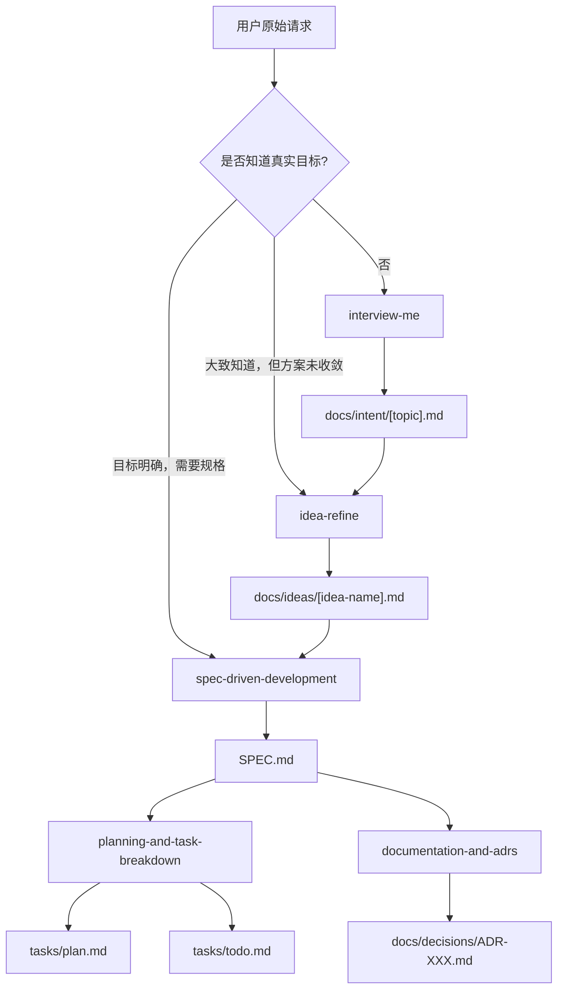

# 资料：agent-skills 的意图识别、意图整理与文档生成机制

> 资料用途：帮助理解 [addyosmani/agent-skills](https://github.com/addyosmani/agent-skills) 如何把“用户模糊意图”转成“可执行工程文档”。本文不是正式系列文章，而是面向后续写作、框架对比或团队落地的研究笔记。
>
> 资料读取于：2026-05-16  
> 主要来源：`README.md`、`skills/using-agent-skills/SKILL.md`、`skills/interview-me/SKILL.md`、`skills/idea-refine/SKILL.md`、`skills/spec-driven-development/SKILL.md`、`skills/planning-and-task-breakdown/SKILL.md`、`skills/documentation-and-adrs/SKILL.md`、`.claude/commands/spec.md`、`.claude/commands/plan.md`

---

## 1. 快速结论

`agent-skills` 的核心不是“提示词库”，而是一套面向 AI Coding Agent 的工程流程协议。它把软件开发拆成生命周期阶段：

```text
DEFINE -> PLAN -> BUILD -> VERIFY -> REVIEW -> SHIP
```

意图识别和意图整理主要落在前两个阶段：

| 阶段 | Skill | 作用 |
| --- | --- | --- |
| Meta | `using-agent-skills` | 判断当前任务处在哪个生命周期阶段，并选择对应 skill |
| Define | `interview-me` | 在需求不清时，逐轮抽取用户真正想要的结果 |
| Define | `idea-refine` | 将粗糙想法发散、收敛，形成可讨论的 one-pager |
| Define | `spec-driven-development` | 将已确认意图写成结构化规格说明 |
| Plan | `planning-and-task-breakdown` | 将规格拆成有验收标准的垂直任务切片 |
| Ship/Docs | `documentation-and-adrs` | 记录决策、上下文、ADR、README 与 Agent 规则文件 |

它的基本处理链路可以概括为：

```text
用户原始请求
  -> 判断任务阶段
  -> 若意图不清，先访谈
  -> 若只是粗糙想法，先发散/收敛
  -> 若目标足够明确，写 spec
  -> 基于 spec 写 plan 和 todo
  -> 实现过程中保持 spec / ADR / README / rules 文件更新
```

这套机制的价值在于：把 Agent 最容易“脑补”的部分提前暴露出来，并把每个阶段的产物文件化。

---

## 2. 框架意图：为什么需要 agent-skills

`agent-skills` 的 README 将自身定义为“production-grade engineering skills for AI coding agents”。它要解决的不是模型不会写代码，而是 Agent 在真实工程中常见的结构性失败：

| 失败模式 | 具体表现 | 对应机制 |
| --- | --- | --- |
| 没识别真实意图 | 用户说“做个 dashboard”，Agent 默认补齐受众、指标、交互、数据源 | `interview-me` |
| 过早进入实现 | 需求还没被确认，Agent 已经开始改代码 | `spec-driven-development` |
| 任务拆分不可验证 | 按数据库、API、UI 横向拆层，单个任务完成后无法独立验收 | `planning-and-task-breakdown` |
| 文档只记录结果 | 代码知道“做了什么”，但没有解释为什么这样做、拒绝了什么方案 | `documentation-and-adrs` |
| Agent 自我合理化 | 用“这个很简单”“稍后补测试”等理由跳过流程 | 每个 skill 的 `Common Rationalizations` 与 `Verification` |

因此，`agent-skills` 的设计重心不是知识灌输，而是行为约束。它要求 Agent 按阶段执行、显式暴露假设、在关键节点等待人类确认，并最终提供可验证证据。

---

## 3. 意图识别总入口：`using-agent-skills`

### 3.1 中文译解

`using-agent-skills` 是整个 skill 包的元 skill。它不直接完成业务任务，而是负责判断当前任务应该调用哪个流程。

它的核心路由逻辑可以翻译为：

| 用户状态 / 任务状态 | 推荐 skill |
| --- | --- |
| 还不知道真正想要什么 | `interview-me` |
| 有一个粗略概念，需要变体和压力测试 | `idea-refine` |
| 要开始新项目、新功能或重要变更 | `spec-driven-development` |
| 已有 spec，需要拆成可实现任务 | `planning-and-task-breakdown` |
| 正在实现代码 | `incremental-implementation` |
| 正在做 UI | `frontend-ui-engineering` |
| 正在设计 API 或模块边界 | `api-and-interface-design` |
| 需要更好的上下文 | `context-engineering` |
| 需要官方文档校验 | `source-driven-development` |
| 风险高或领域不熟 | `doubt-driven-development` |
| 写测试或跑测试 | `test-driven-development` |
| 出现失败或异常行为 | `debugging-and-error-recovery` |
| 做代码评审 | `code-review-and-quality` |
| 写文档或 ADR | `documentation-and-adrs` |
| 准备上线 | `shipping-and-launch` |

### 3.2 实现理念

`using-agent-skills` 的关键是把“用户说了什么”映射成“当前工程生命周期阶段”。这个映射比直接响应用户请求更重要。

例如，用户说“帮我做一个管理后台”，表面上是实现请求，但在 `agent-skills` 的视角中，这不是 Build 阶段，而是 Define 阶段。因为至少缺少：

- 目标用户是谁
- 管理哪些对象
- 成功标准是什么
- 数据源来自哪里
- 权限模型是什么
- 哪些功能明确不做

如果 Agent 跳过这个识别步骤，就会进入默认脑补状态。`using-agent-skills` 将这种脑补前移成显式流程判断。

### 3.3 关键操作规则

`using-agent-skills` 提供了一组所有 skill 共享的行为纪律：

| 规则 | 中文解释 |
| --- | --- |
| Surface Assumptions | 在非平凡实现前先列出假设，不要静默填空 |
| Manage Confusion Actively | 遇到冲突或不清楚时停止，不要猜 |
| Push Back When Warranted | 当方案有明显问题时直接指出，并给出替代方案 |
| Enforce Simplicity | 主动抵抗过度设计，优先简单方案 |
| Maintain Scope Discipline | 只触碰任务要求范围内的内容 |
| Verify, Don't Assume | 任务完成必须有证据，不能只说“看起来对” |

这几条规则解释了 `agent-skills` 的底层假设：Agent 的风险不是不会行动，而是太容易在信息不足时行动。

---

## 4. 意图抽取：`interview-me`

### 4.1 触发条件

`interview-me` 用于“用户请求还没有表达真实目标”的场景。典型信号包括：

- 用户只说了要构建什么，没有说明给谁用。
- 用户说“让它更快”，但没有给出目标数值。
- 用户给出的是行业惯用说法，而不是自己的真实场景。
- Agent 发现自己正在静默补齐需求。
- 用户显式要求“interview me”“grill me”“stress-test my thinking”。

不适合使用的场景：

- 拼写修复、变量重命名、单行修改。
- 用户明确要求速度优先，不需要验证。
- 纯信息查询。
- 机械性文件操作。
- 已经有足够高的信心，不需要继续访谈。

### 4.2 中文译解

`interview-me` 的工作流可以翻译为五步：

| 步骤 | 中文说明 |
| --- | --- |
| 1. 写出假设和信心值 | 先用一句话说明当前理解，并给出 0-100% 的置信度 |
| 2. 一次只问一个问题 | 每个问题都附带 Agent 的猜测，让用户更容易纠正 |
| 3. 识别“想要”和“应该想要”的差异 | 遇到“可扩展”“现代化”“最佳实践”等空泛词时继续追问 |
| 4. 用用户语言复述意图 | 按 Outcome / User / Why now / Success / Constraint / Out of scope 复述 |
| 5. 等待明确确认 | 需要用户显式 yes，不能把“随便你”当成确认 |

它的输出不是 spec，也不是 plan，而是“已确认的意图陈述”。如果需要跨会话保存，可以写入：

```text
docs/intent/[topic].md
```

但只有在用户确认后才保存。

### 4.3 实现理念

`interview-me` 的核心洞察是：用户最初说出口的需求，常常是“他们以为自己应该要的东西”，而不是“真正解决问题的东西”。

示例：

```text
用户原话：做一个指标 dashboard。
可能真实需求：我需要一个实验清单，因为我已经忘了哪些实验正在跑。
```

如果 Agent 直接执行“dashboard”，就会把错误问题做得很完整。`interview-me` 用三种方式降低这个风险：

1. **置信度数字化**：要求 Agent 承认当前理解程度，而不是直接表现得很确定。
2. **问题附带猜测**：让用户纠正 Agent 的具体假设，而不是从空白处组织答案。
3. **必须声明不做事项**：通过 `Out of scope` 暴露静默分歧。

这里的“95% confidence”不是统计意义上的概率，而是一个行为检查：Agent 是否已经能预测用户对后续三个问题的反应。如果不能，就说明共享理解还没建立。

### 4.4 适合沉淀的文档模板

用于保存意图的中文模板：

```markdown
# Intent: [主题]

## Outcome
[用户真正想达到的结果]

## User
[实际使用者或受影响者]

## Why Now
[为什么现在要解决]

## Success
[可验证成功标准，尽量包含数字或明确信号]

## Constraint
[时间、技术、资源、兼容性或组织约束]

## Out of Scope
- [明确不做事项 1]
- [明确不做事项 2]

## Confirmed By
[确认人 / 确认时间 / 会话来源]
```

---

## 5. 意图发散与收敛：`idea-refine`

### 5.1 触发条件

`idea-refine` 适用于用户已经有一个方向，但还不清楚如何定义、取舍或落地的情况。

典型触发：

- “帮我 refine 这个想法”
- “围绕这个概念发散一下”
- “帮我 stress-test 这个计划”
- 一个方案听起来有价值，但边界、目标用户、MVP 还不清楚

### 5.2 中文译解

`idea-refine` 将想法整理成三阶段：

| 阶段 | 目标 | 核心动作 |
| --- | --- | --- |
| Phase 1: Understand & Expand | 打开问题空间 | 复述为 How Might We 问题，问 3-5 个锐化问题，生成 5-8 个变体 |
| Phase 2: Evaluate & Converge | 收敛候选方向 | 聚类为 2-3 个方向，从用户价值、可行性、差异化进行压力测试 |
| Phase 3: Sharpen & Ship | 形成可推进产物 | 输出 markdown one-pager，包含问题、推荐方向、关键假设、MVP、不做清单、开放问题 |

它要求 Agent 在代码库中运行时读取真实上下文，例如架构、已有模式、历史约束和相似实现。也就是说，发散不是纯脑暴，而是要被现有工程事实约束。

### 5.3 输出文档模板

`idea-refine` 的产物是一个 one-pager，可保存到：

```text
docs/ideas/[idea-name].md
```

中文模板：

```markdown
# [Idea Name]

## Problem Statement
[一句话 How Might We 问题]

## Recommended Direction
[推荐方向，以及为什么选择它。最多 2-3 段。]

## Key Assumptions to Validate
- [ ] [假设 1：如何验证]
- [ ] [假设 2：如何验证]
- [ ] [假设 3：如何验证]

## MVP Scope
[用于验证核心假设的最小版本。说明包含什么、不包含什么。]

## Not Doing (and Why)
- [不做事项 1] - [原因]
- [不做事项 2] - [原因]
- [不做事项 3] - [原因]

## Open Questions
- [构建前必须回答的问题]
```

### 5.4 实现理念

`idea-refine` 的最有价值部分不是“生成更多点子”，而是显式写出：

- 关键假设
- 可能杀死方案的条件
- 当前选择忽略什么
- 为什么这些忽略暂时可以接受
- 哪些东西明确不做

这避免了 Agent 在后续 planning 或 coding 阶段自动扩大范围。`Not Doing` 是范围控制工具，不是附属说明。

---

## 6. 意图规格化：`spec-driven-development`

### 6.1 触发条件

`spec-driven-development` 用于开始新项目、新功能或重要变更时。只要需求还不完整、会触及多个模块、涉及架构决策，或预计实现超过约 30 分钟，就应该先写 spec。

不适用：

- 单行修复
- 拼写或文案修改
- 范围明确且自包含的小改动

### 6.2 中文译解

这个 skill 的核心判断是：没有 spec 的代码就是猜测。

它定义四阶段门控：

```text
SPECIFY -> PLAN -> TASKS -> IMPLEMENT
   |        |       |          |
   v        v       v          v
 Human    Human   Human      Human
 review   review  review     review
```

#### Phase 1: Specify

先列出假设，再写规格。假设示例：

```text
ASSUMPTIONS I'M MAKING:
1. 这是一个 Web 应用，而不是原生移动应用。
2. 认证使用 session cookie，而不是 JWT。
3. 数据库是 PostgreSQL，因为现有 schema 指向它。
4. 只支持现代浏览器。
-> 如果不对，现在纠正；否则我会按这些继续。
```

然后生成六个核心区域：

| 区域 | 内容 |
| --- | --- |
| Objective | 做什么、为什么做、用户是谁、成功是什么 |
| Commands | 构建、测试、lint、开发启动命令，必须是完整命令 |
| Project Structure | 源码、测试、文档、端到端测试等目录布局 |
| Code Style | 命名、格式、代码示例和输出风格 |
| Testing Strategy | 测试框架、测试位置、覆盖期望和测试层级 |
| Boundaries | Always / Ask first / Never 三层边界 |

#### Phase 2: Plan

基于已验证 spec 写技术实现计划，包括组件、依赖、顺序、风险、并行空间和验证 checkpoint。

#### Phase 3: Tasks

把计划拆成离散任务，每个任务必须包含：

- Acceptance
- Verify
- Files
- 依赖顺序

单个任务最好不要修改超过约 5 个文件。

#### Phase 4: Implement

按任务逐个实现，并连接到 `incremental-implementation`、`test-driven-development` 和 `context-engineering`。

### 6.3 Spec 文档模板

`/spec` 命令要求将规格保存为项目根目录：

```text
SPEC.md
```

中文模板：

````markdown
# Spec: [Project / Feature Name]

## Objective
[我们要构建什么，为什么构建。包含用户故事或验收标准。]

## Tech Stack
[框架、语言、关键依赖及版本。]

## Commands
| Command | Purpose |
| --- | --- |
| `npm run build` | 构建生产产物 |
| `npm test -- --coverage` | 执行测试并输出覆盖率 |
| `npm run lint --fix` | 执行 lint 并自动修复 |
| `npm run dev` | 启动开发服务 |

## Project Structure
```text
src/          应用源代码
src/components/  UI 组件
src/lib/      共享工具
tests/        单元与集成测试
e2e/          端到端测试
docs/         项目文档
```

## Code Style
[放一个真实代码片段，并说明命名、格式、错误处理风格。]

## Testing Strategy
[测试框架、测试目录、覆盖率要求、哪些行为用哪类测试验证。]

## Boundaries
### Always
- [总是执行的规则]

### Ask First
- [执行前必须确认的动作]

### Never
- [禁止动作]

## Success Criteria
- [具体、可测试的完成条件 1]
- [具体、可测试的完成条件 2]

## Open Questions
- [尚未解决的问题]
````

### 6.4 实现理念

`spec-driven-development` 的设计重点有三点：

1. **先暴露假设**：不允许 Agent 把隐含判断直接编码进实现。
2. **把模糊需求翻译成成功标准**：例如“更快”必须变成 LCP、数据加载时间、CLS 等可测指标。
3. **把边界写入文档**：Always / Ask first / Never 是权限边界，也是行为边界。

这让 spec 不只是需求说明，而是后续 Agent 行动的约束文件。

---

## 7. 意图拆分为任务：`planning-and-task-breakdown`

### 7.1 触发条件

当已经有 spec 或清晰需求，但还不知道如何执行时，使用该 skill。

典型场景：

- 任务太大，不适合直接开始。
- 需要跨多个文件或模块。
- 需要多个 Agent 或多个会话并行。
- 需要向人类说明范围和顺序。
- 实现依赖关系不明显。

### 7.2 中文译解

任务拆分流程：

| 步骤 | 中文说明 |
| --- | --- |
| Step 1: Enter Plan Mode | 进入只读规划模式，读取 spec 和相关代码，不写实现 |
| Step 2: Identify Dependency Graph | 绘制依赖图，按依赖自底向上排序 |
| Step 3: Slice Vertically | 用垂直切片拆任务，每个任务交付一条完整可验证路径 |
| Step 4: Write Tasks | 每个任务写描述、验收、验证、依赖、可能触达文件和规模估计 |
| Step 5: Order and Checkpoint | 调整顺序，在风险点和阶段边界放 checkpoint |

### 7.3 垂直切片原则

错误拆法：

```text
Task 1: 完整数据库 schema
Task 2: 所有 API endpoints
Task 3: 所有 UI components
Task 4: 联调所有部分
```

正确拆法：

```text
Task 1: 用户可以注册，包含 schema + API + UI + 测试
Task 2: 用户可以登录，包含认证 schema + API + UI + 测试
Task 3: 用户可以创建任务，包含 task schema + API + UI + 测试
Task 4: 用户可以查看任务列表，包含 query + API + UI + 测试
```

关键差异：每个垂直切片完成后都能独立运行、独立验证、独立交付。

### 7.4 输出文档模板

`/plan` 命令要求读取 `SPEC.md` 或等价 spec，然后生成：

```text
tasks/plan.md
tasks/todo.md
```

`tasks/plan.md` 可包含依赖图、阶段安排和风险说明。

任务模板：

```markdown
## Task [N]: [短标题]

**Description:**  
[一段话说明这个任务完成什么能力。]

**Acceptance criteria:**
- [ ] [具体、可测试条件 1]
- [ ] [具体、可测试条件 2]

**Verification:**
- [ ] Tests pass: `npm test -- --grep "[feature-name]"`
- [ ] Build succeeds: `npm run build`
- [ ] Manual check: [手动验证内容]

**Dependencies:**  
[依赖的任务编号，或 None]

**Files likely touched:**
- `src/path/to/file.ts`
- `tests/path/to/test.ts`

**Estimated scope:**  
[Small: 1-2 files | Medium: 3-5 files | Large: 5+ files]
```

`tasks/todo.md` 可写成适合执行的检查清单：

```markdown
# Todo: [Feature Name]

- [ ] Task 1: [标题]
- [ ] Task 2: [标题]
- [ ] Task 3: [标题]
```

### 7.5 实现理念

`planning-and-task-breakdown` 不是“把事情列出来”，而是把 spec 转成可验证的执行单位。它的核心约束是：

- 任务必须小到一个专注会话能完成。
- 任务必须有验收标准。
- 任务必须有验证方式。
- 任务必须按依赖排序。
- 任务不能只是某一技术层的半成品。

这解决了 Agent 编程中常见的“生成一大坨代码但无法判断进度”的问题。

---

## 8. 文档与 ADR：`documentation-and-adrs`

### 8.1 触发条件

该 skill 用于记录未来工程师和 Agent 必须知道的上下文。

典型场景：

- 做了重要架构决策。
- 在多个方案之间取舍。
- 新增或修改公共 API。
- 发布会改变用户行为的功能。
- 新成员或新 Agent 需要理解代码库。
- 同一个背景知识反复被解释。

不适合：

- 为显而易见的代码写说明。
- 重复代码已经表达的内容。
- 为一次性原型写重文档。

### 8.2 中文译解

该 skill 的中心原则是：文档记录“为什么”，代码记录“是什么”。

推荐文档类型：

| 类型 | 保存位置 / 形式 | 作用 |
| --- | --- | --- |
| ADR | `docs/decisions/ADR-XXX-*.md` | 记录重大技术决策、替代方案、后果 |
| README | 项目根目录 `README.md` | 说明快速开始、命令、架构概览和贡献方式 |
| API Docs | TypeScript 注释、OpenAPI/Swagger | 说明输入、输出、错误语义和示例 |
| Agent Rules | `CLAUDE.md`、`AGENTS.md`、rules 文件 | 让 Agent 理解项目约定 |
| Inline Gotchas | 代码中少量关键注释 | 标注非显然约束和历史陷阱 |
| Changelog | `CHANGELOG.md` | 记录发布变化 |

### 8.3 ADR 模板

```markdown
# ADR-001: [Decision Title]

## Status
Accepted | Superseded by ADR-XXX | Deprecated

## Date
YYYY-MM-DD

## Context
[背景、约束、必须满足的需求。]

## Decision
[最终选择的方案。]

## Alternatives Considered
### [方案 A]
- Pros: [...]
- Cons: [...]
- Rejected: [拒绝原因]

### [方案 B]
- Pros: [...]
- Cons: [...]
- Rejected: [拒绝原因]

## Consequences
- [正面影响]
- [负面影响]
- [团队需要承担的新成本]
```

### 8.4 实现理念

`documentation-and-adrs` 对 Agent 特别重要。因为 Agent 会读取项目文档并放大其中的默认假设：

- 如果 ADR 缺失，Agent 可能重新争论一个已经决策过的问题。
- 如果 rules 文件过期，Agent 会稳定地执行错误约定。
- 如果 known gotchas 没有被写出来，Agent 会在同一个陷阱上重复犯错。

所以文档不是附属产物，而是后续 Agent 行为的输入层。

---

## 9. 从意图到文档的完整生成流程

以下流程适合把 `agent-skills` 的理念迁移到任意 AI Coding 工作流。

### 9.1 原始请求分流



### 9.2 阶段产物表

| 阶段 | 输入 | 动作 | 输出文档 |
| --- | --- | --- | --- |
| Intent | 用户原始请求 | 访谈、假设、置信度、复述 | `docs/intent/[topic].md` |
| Idea | 已确认意图或粗略想法 | 发散、聚类、压力测试、收敛 | `docs/ideas/[idea-name].md` |
| Spec | 已收敛方向 | 写目标、命令、结构、风格、测试、边界 | `SPEC.md` |
| Plan | 已确认 spec | 依赖图、垂直切片、checkpoint | `tasks/plan.md` |
| Todo | 已确认 plan | 执行级 checklist | `tasks/todo.md` |
| Decision | 关键取舍 | 记录背景、方案、拒绝原因、后果 | `docs/decisions/ADR-XXX.md` |

### 9.3 推荐目录结构

```text
repo/
  SPEC.md
  tasks/
    plan.md
    todo.md
  docs/
    intent/
      feature-x.md
    ideas/
      feature-x-one-pager.md
    decisions/
      ADR-001-use-postgresql.md
  AGENTS.md
  CLAUDE.md
```

### 9.4 最小落地版本

如果团队不想一次引入完整流程，可以从最小版本开始：

1. 任何超过一个文件的需求，先写 5-8 行 intent。
2. 任何超过半小时的功能，先写 `SPEC.md`。
3. 任何会影响多个模块的功能，写 `tasks/plan.md`。
4. 任何不可逆或高成本决策，写一份 ADR。
5. 每个任务必须有可运行验证命令。

这已经覆盖 `agent-skills` 最核心的意图防错机制。

---

## 10. 中文化迁移建议

### 10.1 不要逐字翻译 skill，要翻译成团队协议

`agent-skills` 的价值在流程结构，不在英文措辞。迁移到中文团队时，建议按以下顺序处理：

1. 保留 skill 名称，避免跨工具识别失败。
2. 将 `description` 翻译成明确触发条件。
3. 将 `Process` 改写成团队实际执行步骤。
4. 将 `Verification` 改写成团队真实命令。
5. 将 `Common Rationalizations` 改写成本团队 Agent 常见借口。

### 10.2 中文版 description 示例

```yaml
---
name: interview-me
description: 用逐轮访谈抽取用户真实意图。适用于需求缺少目标用户、成功标准、约束或不做事项，或 Agent 发现自己正在静默补齐需求的场景。
---
```

```yaml
---
name: idea-refine
description: 将粗糙想法通过发散、聚类、压力测试和收敛整理成可推进方案。适用于概念还模糊、需要多个方向比较、或需要在写 spec 前明确 MVP 边界的场景。
---
```

```yaml
---
name: spec-driven-development
description: 在编码前生成结构化规格说明。适用于新项目、新功能、重要变更、跨模块修改或需求仍存在隐含假设的场景。
---
```

```yaml
---
name: planning-and-task-breakdown
description: 将已确认规格拆成按依赖排序、可验证、可执行的垂直任务切片。适用于任务过大、需要多 Agent 协作、或实现顺序不明显的场景。
---
```

### 10.3 中文团队常用边界模板

```markdown
## Boundaries

### Always
- 运行项目已有测试命令，并记录输出。
- 遵循现有目录结构和命名习惯。
- 对用户输入做边界校验。
- 修改公共接口时同步更新调用方和测试。

### Ask First
- 新增生产依赖。
- 修改数据库 schema。
- 调整 CI/CD 配置。
- 删除已有功能或数据迁移逻辑。

### Never
- 提交密钥、token、私有凭证。
- 删除失败测试来让构建通过。
- 未经确认重写历史或执行破坏性 git 命令。
- 在未确认 scope 时顺手重构无关模块。
```

---

## 11. 用于后续正式文章的素材提纲

如果后续要把这份资料扩成正式文章，可以按以下结构组织：

1. **问题背景**：Agent 最大风险不是不会写代码，而是会在意图不清时合理化。
2. **框架定位**：`agent-skills` 是工程流程协议，不是提示词集合。
3. **意图识别层**：`using-agent-skills` 如何做任务阶段路由。
4. **真实意图抽取**：`interview-me` 如何用假设、置信度、一问一答、out of scope 建立共享理解。
5. **想法整理层**：`idea-refine` 如何从发散到 one-pager。
6. **规格化层**：`spec-driven-development` 如何把意图变成 `SPEC.md`。
7. **计划层**：`planning-and-task-breakdown` 如何生成 `tasks/plan.md` 和 `tasks/todo.md`。
8. **文档记忆层**：`documentation-and-adrs` 如何让未来 Agent 不重复犯错。
9. **工程取舍**：流程增加前置成本，但降低错误实现、范围膨胀和上下文丢失。

---

## 12. 相关 Skill 完整中文翻译

本节保留“完整中文执行版”，用于弥补前文中文译解可能遗漏的细节。翻译策略不是逐句保留英文句式，而是逐节覆盖原 `SKILL.md` 的触发条件、流程、反模式、红旗、结束判断与验证条件。

### 12.1 `using-agent-skills` 完整中文翻译

#### 元信息

```yaml
---
name: using-agent-skills
description: 发现并调用 Agent Skills。适用于会话开始时，或需要判断当前任务应使用哪个 skill 时。这是管理所有其他 skill 如何被发现和调用的元 skill。
---
```

#### 概览

Agent Skills 是一组按开发阶段组织的工程工作流 skill。每个 skill 都编码了一种资深工程师会遵循的具体流程。`using-agent-skills` 作为元 skill，帮助 Agent 为当前任务发现并应用正确的 skill。

#### Skill 发现规则

当一个任务到来时，先识别它处于哪个开发阶段，再选择对应 skill：

```text
任务到来
│
├── 还不知道真正想要什么？ ─────────→ interview-me
├── 有粗略概念，需要多个变体？ ─────→ idea-refine
├── 新项目 / 新功能 / 重大变更？ ───→ spec-driven-development
├── 已有 spec，需要拆任务？ ───────→ planning-and-task-breakdown
├── 正在实现代码？ ─────────────────→ incremental-implementation
│   ├── UI 工作？ ─────────────────→ frontend-ui-engineering
│   ├── API 工作？ ────────────────→ api-and-interface-design
│   ├── 需要更好的上下文？ ─────────→ context-engineering
│   ├── 需要用文档校验代码？ ───────→ source-driven-development
│   └── 风险高 / 不熟悉代码？ ──────→ doubt-driven-development
├── 正在写测试或跑测试？ ───────────→ test-driven-development
│   └── 浏览器相关？ ───────────────→ browser-testing-with-devtools
├── 有东西坏了？ ───────────────────→ debugging-and-error-recovery
├── 正在做代码评审？ ───────────────→ code-review-and-quality
│   ├── 安全相关？ ────────────────→ security-and-hardening
│   └── 性能相关？ ────────────────→ performance-optimization
├── 提交 / 分支相关？ ──────────────→ git-workflow-and-versioning
├── CI/CD 流水线相关？ ────────────→ ci-cd-and-automation
├── 写文档 / ADR？ ───────────────→ documentation-and-adrs
└── 部署 / 发布？ ─────────────────→ shipping-and-launch
```

#### 核心操作行为

这些行为适用于所有 skill，并且不可跳过。

**1. 显式暴露假设**

在任何非平凡实现前，先写出当前假设：

```text
ASSUMPTIONS I'M MAKING:
1. [关于需求的假设]
2. [关于架构的假设]
3. [关于范围的假设]
-> 如果不对，现在纠正；否则我会按这些继续。
```

不要静默填补模糊需求。最常见失败模式是做出错误假设并一路执行。越早暴露不确定性，返工成本越低。

**2. 主动管理困惑**

当遇到不一致、需求冲突或规格不清时：

1. 停止，不要猜。
2. 指出具体困惑。
3. 说明取舍，或提出澄清问题。
4. 等待问题被解决后再继续。

坏做法：静默选择一种解释并希望它正确。  
好做法：指出“spec 中是 X，但现有代码是 Y；哪个优先？”

**3. 必要时反驳**

Agent 不是 yes-machine。当某个方案有明确问题时：

- 直接指出问题。
- 解释具体代价，能量化时尽量量化，例如“会增加约 200ms 延迟”，不要只说“可能更慢”。
- 提出替代方案。
- 如果人类在充分知情后仍然坚持，接受该决定。

迎合是一种失败模式。诚实的技术分歧比虚假的赞同更有价值。

**4. 强制保持简单**

Agent 的自然倾向是过度复杂化，所以必须主动抵抗。完成任何实现前，检查：

- 这能否用更少代码完成？
- 这些抽象是否真的值得它们带来的复杂度？
- 资深工程师看到后是否会问“为什么不直接……？”

如果 100 行能解决的问题写成 1000 行，就是失败。优先使用无聊、显然、可维护的方案。

**5. 保持范围纪律**

只触碰被要求触碰的内容。不要：

- 删除自己不理解的注释。
- 顺手清理与任务无关的代码。
- 把相邻系统重构成副作用。
- 未经明确批准删除看起来没被使用的代码。
- 因为“可能有用”而添加 spec 没有要求的功能。

目标是外科手术式精确修改，而不是主动翻修。

**6. 验证，不要假设**

每个 skill 都包含验证步骤。任务没有通过验证就不算完成。“看起来对”永远不够，必须有证据，例如测试通过、构建输出、运行时数据。

#### 需要避免的失败模式

1. 不检查就做出错误假设。
2. 迷失时继续推进，而不是管理自己的困惑。
3. 发现不一致却不指出。
4. 对非显然决策不说明取舍。
5. 对明显有问题的方案迎合式赞同。
6. 让代码和 API 过度复杂。
7. 修改与任务无关的代码或注释。
8. 删除自己没有完全理解的东西。
9. 因为“很明显”而不写 spec。
10. 因为“看起来对”而跳过验证。

#### Skill 规则

1. 开始工作前先检查是否有适用 skill。
2. Skill 是工作流，不是建议；按顺序执行，不要跳过验证步骤。
3. 多个 skill 可以连续适用。例如一个功能可能依次经过 `idea-refine`、`spec-driven-development`、`planning-and-task-breakdown`、`incremental-implementation`、`test-driven-development`、`code-review-and-quality`、`shipping-and-launch`。
4. 不确定时，从 spec 开始。非平凡任务如果没有 spec，就先使用 `spec-driven-development`。

#### 生命周期顺序

完整功能的典型 skill 顺序：

1. `interview-me`：抽取用户真正想要什么。
2. `idea-refine`：整理模糊想法。
3. `spec-driven-development`：定义要构建的东西。
4. `planning-and-task-breakdown`：拆成可验证块。
5. `context-engineering`：加载正确上下文。
6. `source-driven-development`：用官方文档校验。
7. `incremental-implementation`：逐切片构建。
8. `doubt-driven-development`：对非平凡决策做交叉审查。
9. `test-driven-development`：证明每个切片有效。
10. `code-review-and-quality`：合并前审查。
11. `git-workflow-and-versioning`：整理提交历史。
12. `documentation-and-adrs`：记录决策。
13. `shipping-and-launch`：安全发布。

不是所有任务都需要所有 skill。一个 bug fix 可能只需要 `debugging-and-error-recovery`、`test-driven-development`、`code-review-and-quality`。

#### 快速参考

| 阶段 | Skill | 一句话说明 |
| --- | --- | --- |
| Define | `interview-me` | 在任何 plan、spec 或代码出现前，明确用户真正想要什么 |
| Define | `idea-refine` | 通过结构化发散和收敛整理想法 |
| Define | `spec-driven-development` | 先写需求和验收标准，再写代码 |
| Plan | `planning-and-task-breakdown` | 拆成小型、可验证任务 |
| Build | `incremental-implementation` | 用薄垂直切片逐步实现 |
| Build | `source-driven-development` | 实现前先查官方文档 |
| Build | `doubt-driven-development` | 用对抗式新上下文审查非平凡决策 |
| Build | `context-engineering` | 在正确时间加载正确上下文 |
| Build | `frontend-ui-engineering` | 构建具备可访问性的生产级 UI |
| Build | `api-and-interface-design` | 构建契约清晰的稳定接口 |
| Verify | `test-driven-development` | 先写失败测试，再让它通过 |
| Verify | `browser-testing-with-devtools` | 用 Chrome DevTools MCP 做运行时验证 |
| Verify | `debugging-and-error-recovery` | 复现、定位、修复、加防护 |
| Review | `code-review-and-quality` | 五轴评审与质量门控 |
| Review | `security-and-hardening` | OWASP 防护、输入校验、最小权限 |
| Review | `performance-optimization` | 先测量，只优化真正重要的部分 |
| Ship | `git-workflow-and-versioning` | 原子提交、清晰历史 |
| Ship | `ci-cd-and-automation` | 每次变更都有自动质量门 |
| Ship | `documentation-and-adrs` | 记录为什么，而不只是记录是什么 |
| Ship | `shipping-and-launch` | 发布前检查、监控、回滚计划 |

#### 结束判断

`using-agent-skills` 本身是路由 skill。它结束于：当前任务阶段已经被识别，适用 skill 已经被选择，并且后续执行已进入对应 skill 的流程。若后续是完整工程任务，则最终仍必须回到各具体 skill 的验证条件，不能只停在“选了一个 skill”。

---

### 12.2 `interview-me` 完整中文翻译

#### 元信息

```yaml
---
name: interview-me
description: 抽取用户真正想要的东西，而不是用户以为自己应该要的东西。通过一次只问一个问题的访谈，直到对底层意图达到约 95% 置信度。
Use when: 请求信息不足，例如“build me X”但没有说明给谁、为什么现在要做；用户显式要求 interview me、grill me、are we sure、stress-test my thinking；或 Agent 发现自己在任何 plan、spec、code 出现前静默填补模糊需求。
---
```

#### 概览

人们提出的需求和他们实际想要的结果经常不同。他们说“做一个 dashboard”，可能只是因为 dashboard 是常见表达，并不一定因为 dashboard 能解决问题。他们说“让它更快”，却没有给出要达到的数字。

发现这种偏差的最低成本时刻，是任何 plan、spec 或代码出现之前。一旦开始构建，切换成本会真实存在，用户也可能把错误方向合理化成“也还行”。这个 skill 的作用，就是在错误被固化前关闭这种差距。

其他 Define 阶段 skill 假设已经大致知道自己要什么：`idea-refine` 从已有想法生成变体，`spec-driven-development` 把需求写下来，`doubt-driven-development` 在计划成形后做压力测试。`interview-me` 位于这些 skill 之前，通过一次一个问题，并附带 Agent 的最佳猜测，直到 Agent 能在用户回答前预测用户会怎么答。

#### 何时使用

在以下情况下使用：

- 请求缺少至少一个关键要素：谁是用户、为什么需要、成功长什么样、约束是什么。
- 请求是惯用表达而不是具体问题，例如“做一个 X”“让它更快”，且不猜测就无法解开这个惯用表达。
- Agent 想用尚未暴露的假设开始工作。
- 当两个合理价值发生冲突时，用户没有说明优化哪一个，例如简单性 vs. 灵活性、成本 vs. 速度。
- 用户显式要求“interview me”“grill me”“before we start, are we sure?”“stress-test my thinking”。

不要在以下情况下使用：

- 请求清晰且自包含，例如重命名变量、修复错别字。
- 用户明确要求速度优先于验证。
- 纯信息请求，例如“X 是怎么工作的？”“这段代码做什么？”
- 机械操作，例如重命名、格式化、移动文件。
- 已经达到 95% 或更高置信度；但在这么判断前，先重新阅读停止条件。

#### 加载约束

这个 skill 需要一个可实时响应的用户。不要在 CI、定时任务、`/loop`、autonomous-loop 这类非交互上下文中调用。如果处于这些上下文且请求信息不足，应把它标记为需要用户处理的 blocker，而不是继续猜。

#### 流程

**Step 1：写出假设和置信度数字**

在提任何问题之前，用一句话写出当前对用户意图的最佳理解，并给出诚实的 0-100% 置信度：

```text
HYPOTHESIS: 你想要一种能在 standup 中回答“我们进展如何”的方式，“dashboard”是当时想到的惯用解法。
CONFIDENCE: ~30%
```

这个数字迫使 Agent 保持诚实。如果写了很高的数字，却无法预测接下来三个问题的用户反应，那数字就是错的。置信度必须从 Agent 能辩护的水平开始。

**Step 2：一次只问一个问题，并附带猜测**

格式：

```text
Q: [问题]
GUESS: [Agent 当前猜测]
```

问完后等待用户反应，再问下一个。

为什么一次只问一个，而不是批量问题：

- 如果问题被埋在列表里，用户无法逐项反应 Agent 的假设。
- 批量问题鼓励扫读和表层回答。
- 第三个问题通常取决于第一个问题的答案；一次性问完会锁定错误框架。
- 用户认真思考的精力有限，应一次只消耗在一个问题上。

为什么问题要附带猜测：

- 用户纠正一个错误猜测，比从空白处生成答案更快。
- Agent 必须承诺一个可能被证明错误的假设，从而保持诚实。
- 访谈的目的就是暴露 Agent 自己的假设。

风险是礼貌型用户可能为了配合而同意 Agent 猜测。缓解方式是显式表现出愿意被纠正，并偶尔给出预期会被用户反驳的猜测方向。

**Step 3：识别“想要”与“应该想要”的差异**

最危险的回答，是用户说出了“听起来像深思熟虑的答案”，而不是他们实际想要的结果。

需要警惕：

- 模式化的最佳实践语言，例如“可扩展”“干净架构”，但没有具体含义。
- 诉诸惯例，例如“多数应用都这样做”“标准做法”。
- “我应该……”“我大概应该……”“好的工程实践说……”这类表达。
- 把 buzzword 当作目标，例如“现代化”“健壮”“可扩展”，而不是具体结果。

听到这些时，应该问：

> 如果不需要向任何人证明这个选择正确，你实际想要什么？

这个问题通常比前面五个问题都更有效。

**Step 4：用用户自己的语言复述意图**

当置信度足够高时，用用户自己的语言写回当前理解。保持紧凑，约 5-8 行，让用户可以逐行确认或纠正：

```text
我现在理解你想要的是：
- Outcome: [结果]
- User: [用户]
- Why now: [为什么现在]
- Success: [成功标准]
- Constraint: [约束]
- Out of scope: [明确不做]

Yes / no / refine?
```

`Out of scope` 不能省略。很多错位来自双方对“不做什么”的静默分歧。

**Step 5：确认，必须是明确 yes**

通过门槛是明确的 yes。以下都不算 yes：

- “Whatever you think is best.” 这是委托，不是确认，说明用户自己也没有 95% 置信度。应给出两个具体选项，让用户选择。
- “Sounds good.” 有歧义。应追问：“Anything you'd refine?”
- “Sure, let's go.” 经常只是礼貌地结束，不一定是认同。需要同样追问。
- 沉默后说“okay let's start.” 这表示用户放弃访谈，不是收敛。应停下并询问是否遗漏了什么。

如果用户纠正了复述，就把纠正合进去并重新复述。循环直到得到明确 yes。

#### 95% 置信度停止条件

结束条件是能回答 yes：

> 我能否预测用户对接下来三个问题的反应？

如果可以，就说明已有共享理解。停止访谈并输出复述。  
如果不可以，就还没有结束，继续问下一个问题。

这是可检查测试，不是感觉。同时也有下限：如果已经问了多轮仍然无法预测，那说明请求本身缺少基础信息，而不是应该无限追问。此时应告诉用户：

```text
我已经问了 X 个问题，但仍无法预测你的反应。这里缺少某个基础前提。要不要先退一步重新看问题？
```

#### 输出

该 skill 的输出是一个已确认的意图陈述：Step 4 的复述，加上 Step 5 的明确 yes。  
这是唯一交付物。Spec、plan、task list 都在下游，它们消费这个 skill 产出的意图。

如果用户希望该意图跨会话持久化，例如多会话项目或交接给其他协作者，可以提出保存到：

```text
docs/intent/[topic].md
```

但只有用户确认后才保存。

#### 示例

没有 `interview-me`：

```text
User: build me a dashboard for our metrics
Agent: [直接开始]
```

Agent 已经假设了：给谁用、哪些指标、“our team”是什么意思、成功标准是什么。每个假设都是后续用户可能说“这不是我想要的”的地方。

使用 `interview-me`：

```text
User: build me a dashboard for our metrics
Agent:
HYPOTHESIS: 你想要一种能在 standup 中回答“我们表现如何”的方式，“dashboard”是想到的惯用答案。
CONFIDENCE: ~30%

Q: 你说“我们表现如何”时，谁在问？是你自己、standup 里的工程团队，还是更上层的 manager / exec / board？
GUESS: 我猜是 standup 里的工程团队，因为 “we” 通常这样指代，而且 standup 常问这个问题。如果是给 exec，看指标和表达方式会完全不同。

User: 其实是给我自己。我老是忘记哪些实验正在跑，以及它们早期信号怎么样。

Agent:
Updated read: 这根本不是团队 dashboard，而是个人实验跟踪器。Confidence: ~60%.

Q: 缺口是你不知道有哪些实验存在，还是看不到它们的结果集中展示？
GUESS: 我猜是后者。你有某个实验列表，但结果分散在五个工具里，手动对齐很累。

User: 其实是前者。我真的没有一个列表，它们散在不同文档里。
```

两轮问题后，Agent 发现真实需求不是 dashboard，而是 list。产物、范围和工作量都完全不同。

#### 与其他 Skill 的关系

- `idea-refine`：下游。如果确认意图是“我想要 X，但不知道如何定范围”，交给 `idea-refine` 生成多个方向。
- `spec-driven-development`：下游。如果确认意图已经具体到“给 Y 用户，以 Z 为成功标准构建 X”，交给它写 spec。
- `planning-and-task-breakdown`：位于它之后两跳，先有 spec 再拆任务。
- `doubt-driven-development`：处在时间线另一端。`interview-me` 是决策前的意图抽取，`doubt-driven-development` 是决策后的产物审查。
- `source-driven-development`：正交关系。`interview-me` 澄清用户想要什么，SDD 校验框架事实。

#### 常见合理化与现实

| 合理化 | 现实 |
| --- | --- |
| “需求已经足够清楚。” | 如果现在不能用一句话写出用户想要的结果，就还不清楚。先执行 Step 1。 |
| “问太多问题浪费时间。” | 4-6 个聚焦问题的成本很小，构建错误东西的成本巨大，而且成本由用户承担。 |
| “我可以边做边搞清楚。” | 代码出现后的切换成本约是现在的 10 倍。实现中的发现通常意味着返工。 |
| “用户说随便我，所以我该直接决定。” | “随便你”是委托，不是决策。用两个具体选项让用户选。 |
| “我应该给几个选项让用户挑。” | 当用户知道自己想要什么、只是在取舍时，选项有用。现在他们还不知道，列选项会扩大搜索，提问才会缩小搜索。 |
| “附带猜测会引导用户。” | 引导本来就是目的。用户对猜测做反应更快。风险是迎合，而不是引导；通过愿意被纠正来缓解。 |
| “已经聊够了，我懂了。” | 测试一下：能预测用户对接下来三个问题的反应吗？不能就还没懂。 |
| “用户说 yes，所以结束。” | 如果 yes 跟在模糊复述或开放式 “sounds good” 后面，就是空心 yes。具体复述并重新确认。 |

#### 红旗

- 一条消息里问三个或更多问题，这是批量调查，不是访谈。
- 问题没有附带 Agent 的假设，这是调查问卷，不是承诺自己的理解。
- 把 “whatever you think is best” 当成终点。
- 用户明确确认复述前就产出 spec、plan 或 task list。
- 问题被框成“最佳实践是什么”，而不是“你实际想要什么”。
- 用户给出“可扩展”“干净”“现代化”这类展示成熟度的答案，Agent 不继续追问它是否是真实需求。
- 三轮或更多之后，置信度没有明显上升，说明问题问错了，应后退重构框架。
- 用户确认前保存 intent 文档，因为文档本身会暗示一个用户没给出的 yes。
- 复述里跳过 `Out of scope`。

#### 结束判断与验证

应用 `interview-me` 后必须满足：

- [ ] 第一轮明确写出 hypothesis 和 confidence。
- [ ] 一次只问一个问题，每个问题都附带 Agent 的 guess。
- [ ] 当用户给出展示成熟度或惯例导向答案时，至少运行一次“如果不用证明给任何人看，你实际想要什么？”这类探针。
- [ ] 向用户写回具体复述，包含 Outcome / User / Why now / Success / Constraint / Out of scope。
- [ ] 用户以明确 yes 确认复述，不是 “whatever you think”、不是 “sounds good”、不是沉默。
- [ ] 停止时，Agent 能预测用户对接下来三个问题的反应。
- [ ] 交给下游 skill 时，基于确认后的意图，而不是最初的模糊请求。

---

### 12.3 `idea-refine` 完整中文翻译

#### 元信息

```yaml
---
name: idea-refine
description: 通过结构化发散与收敛，把原始想法整理成清晰、可执行的概念。适用于想法仍然模糊、需要在投入计划前压力测试假设，或希望先展开选项再收敛到一个方向的场景。可由 “ideate”、“refine this idea”、“stress-test my plan” 触发。
---
```

#### 概览

`idea-refine` 用结构化发散和收敛，把原始想法打磨成值得构建的清晰、可执行概念。

#### 工作方式

1. **Understand & Expand（发散）**：复述想法，提出锐化问题，生成多个变体。
2. **Evaluate & Converge（收敛）**：聚类想法，压力测试，暴露隐藏假设。
3. **Sharpen & Ship（成稿）**：产出一页 markdown，推动后续工作。

#### 用法

这是一个以交互对话为主的 skill。用户给出一个想法后，Agent 引导用户经过完整流程。

可选初始化命令：

```bash
bash /mnt/skills/user/idea-refine/scripts/idea-refine.sh
```

触发短语：

- “Help me refine this idea”
- “Ideate on [concept]”
- “Stress-test my plan”

#### 输出

最终输出是一个 markdown one-pager。经用户确认后，可保存到：

```text
docs/ideas/[idea-name].md
```

内容包含：

- Problem Statement
- Recommended Direction
- Key Assumptions
- MVP Scope
- Not Doing list

#### 详细指令

Agent 是 ideation partner。职责是帮助用户把原始想法整理成清晰、可执行、值得构建的概念。

#### 哲学

- 简单是最终的成熟。推动方案走向仍能解决真实问题的最小版本。
- 从用户体验出发，倒推技术。
- 对 1000 件事说不。聚焦比宽度更重要。
- 挑战每个假设。“通常这样做”不是理由。
- 展示未来，而不仅是提供更快的旧方案。
- 看不见的部分，也应像看得见的部分一样精致。

#### 流程

当用户带着想法调用该 skill 时，引导用户通过三个阶段。根据用户反馈调整，不要机械套模板。

**Phase 1：Understand & Expand（发散）**

目标：打开原始想法的问题空间。

1. 将想法复述成清晰的 “How Might We” 问题陈述。这会迫使双方明确到底在解决什么问题。
2. 提出 3-5 个锐化问题，不能更多。重点包括：
   - 这具体是给谁用？
   - 成功长什么样？
   - 真实约束是什么，包括时间、技术、资源？
   - 之前尝试过什么？
   - 为什么现在要做？
3. 使用 `AskUserQuestion` 获取输入。在知道“给谁用”和“成功长什么样”之前，不要继续。
4. 生成 5-8 个想法变体，可使用这些视角：
   - 反转：如果做相反的事呢？
   - 移除约束：如果预算、时间、技术都不是问题呢？
   - 受众切换：如果给另一个用户群呢？
   - 组合：如果和相邻想法合并呢？
   - 简化：10 倍更简单的版本是什么？
   - 10 倍规模：大规模时会是什么样？
   - 专家视角：领域专家觉得显然、外行看不见的是什么？

要推动想法超出用户最初要求。创造人们还不知道自己需要的产品。

如果运行在代码库中，使用 `Glob`、`Grep`、`Read` 扫描相关上下文，包括现有架构、模式、约束和历史方案。变体必须扎根于真实存在的代码。相关时引用具体文件和模式。

读取该 skill 目录下的 `frameworks.md`，选择性使用其中的 ideation framework。选择适合当前想法的视角，不要机械运行所有框架。

**Phase 2：Evaluate & Converge（收敛）**

用户对 Phase 1 做出反应后，例如指出哪些想法有共鸣、反驳或补充上下文，就切换到收敛模式。

1. 将有共鸣的想法聚类成 2-3 个不同方向。每个方向都应该有实质差异，而不只是同一主题的轻微变体。
2. 针对三个标准压力测试每个方向：
   - 用户价值：谁受益，受益程度多大？这是止痛药还是维生素？
   - 可行性：技术和资源成本是什么？最难的部分是什么？
   - 差异化：它真正不同在哪里？用户会从当前方案切换过来吗？
3. 读取该 skill 目录下的 `refinement-criteria.md` 获取完整评估 rubric。
4. 显式暴露每个方向的隐藏假设：
   - 当前押注什么为真，但还没有验证？
   - 什么条件会杀死这个想法？
   - 当前选择忽略什么，为什么现在可以忽略？

大多数 ideation 失败都发生在这里，不要跳过。要诚实，而不是一味支持。如果想法弱，要温和但明确地指出。好的 ideation partner 不是 yes-machine。要反对复杂度、质疑真实价值，并指出明显不成立的地方。

**Phase 3：Sharpen & Ship（成稿）**

产出一个具体 artifact：能推动后续工作的 markdown one-pager。

```markdown
# [Idea Name]

## Problem Statement
[一句话 How Might We framing]

## Recommended Direction
[选择的方向和原因，最多 2-3 段]

## Key Assumptions to Validate
- [ ] [假设 1，以及如何测试]
- [ ] [假设 2，以及如何测试]
- [ ] [假设 3，以及如何测试]

## MVP Scope
[用于测试核心假设的最小版本。说明包含什么、排除什么。]

## Not Doing (and Why)
- [事项 1] - [原因]
- [事项 2] - [原因]
- [事项 3] - [原因]

## Open Questions
- [构建前需要回答的问题]
```

`Not Doing` list 可能是最有价值的部分。聚焦意味着拒绝好的想法，必须显式化这些取舍。

询问用户是否要把它保存到 `docs/ideas/[idea-name].md` 或用户选择的位置。只有用户确认后才保存。

#### 需要避免的反模式

- 不要生成 20+ 个想法。质量优先于数量。5-8 个深思熟虑的变体胜过 20 个浅层点子。
- 不要做 yes-machine。对弱想法要具体、温和地反驳。
- 不要跳过“给谁用”。每个好想法都从一个人和他的问题开始。
- 不要在暴露假设前产出计划。未验证假设是好想法的头号杀手。
- 不要过度工程化这个流程。三个阶段，每个阶段做好一件事。抵抗添加步骤。
- 不要只是列点子，要讲清每个变体为什么存在。
- 不要忽略代码库。如果在项目中，现有架构既是约束也是机会。

#### 语气

直接、思考充分、略带挑战性。Agent 是敏锐的思考伙伴，不是照稿念流程的主持人。始终推动用户多想一步，但不要让人疲惫。

读取该 skill 目录下的 `examples.md`，查看优秀 ideation 会话示例。

#### 红旗

- 生成 20+ 个浅层变体，而不是 5-8 个认真考虑的方向。
- 跳过“给谁用”。
- 在投入方向前没有暴露任何假设。
- 对弱想法只附和，不具体反驳。
- 产出 plan 却没有 `Not Doing` list。
- 在项目内部 ideation 时忽略现有代码库约束。
- 没有运行 Phase 1 和 Phase 2，直接跳到 Phase 3。

#### 结束判断与验证

完成 ideation session 后必须满足：

- [ ] 已有清晰的 “How Might We” 问题陈述。
- [ ] 已定义目标用户和成功标准。
- [ ] 探索了多个方向，而不是只抓住第一个想法。
- [ ] 显式列出隐藏假设和验证策略。
- [ ] `Not Doing` list 明确表达取舍。
- [ ] 输出是具体 artifact，即 markdown one-pager，而不只是对话。
- [ ] 用户在任何实现工作开始前确认了最终方向。

---

### 12.4 `spec-driven-development` 完整中文翻译

#### 元信息

```yaml
---
name: spec-driven-development
description: 编码前先创建 spec。适用于开始新项目、新功能或重大变更且还没有规格说明时。也适用于需求不清、模糊，或只停留在粗略想法阶段时。
---
```

#### 概览

写任何代码前，先写结构化规格。Spec 是 Agent 与人类工程师之间共享的事实来源，定义要构建什么、为什么构建，以及如何知道它完成了。

没有 spec 的代码就是猜测。

#### 何时使用

- 开始新项目或新功能。
- 需求模糊或不完整。
- 变更会触及多个文件或模块。
- 即将做架构决策。
- 实现任务预计超过约 30 分钟。

不要用于：单行修复、错别字修正，或需求明确且自包含的改动。

#### 门控工作流

Spec-driven development 有四个阶段。当前阶段未验证前，不得进入下一阶段。

```text
SPECIFY -> PLAN -> TASKS -> IMPLEMENT
   |        |       |          |
   v        v       v          v
 Human    Human   Human      Human
 review   review  review     review
```

#### Phase 1：Specify

从高层愿景开始。持续向人类提出澄清问题，直到需求具体。

**立即暴露假设。** 在写任何 spec 内容前，先列出当前假设：

```text
ASSUMPTIONS I'M MAKING:
1. 这是 Web 应用，而不是原生移动应用。
2. 认证使用 session cookie，而不是 JWT。
3. 数据库是 PostgreSQL，因为现有 Prisma schema 指向它。
4. 目标是现代浏览器，不支持 IE11。
-> 如果不对，现在纠正；否则我会按这些继续。
```

不要静默填补模糊需求。Spec 的目的就是在写代码前暴露误解，而假设是最危险的误解形式。

Spec 文档必须覆盖六个核心区域：

1. **Objective**：构建什么，为什么构建，用户是谁，成功长什么样。
2. **Commands**：完整可执行命令，带必要 flags，不只是工具名。

```text
Build: npm run build
Test: npm test -- --coverage
Lint: npm run lint --fix
Dev: npm run dev
```

3. **Project Structure**：源代码放在哪里、测试放在哪里、文档属于哪里。

```text
src/             应用源代码
src/components  React 组件
src/lib         共享工具
tests/          单元和集成测试
e2e/            端到端测试
docs/           文档
```

4. **Code Style**：一个真实代码片段胜过三段风格描述。包括命名约定、格式规则和优质输出示例。
5. **Testing Strategy**：使用什么框架、测试放哪里、覆盖率期望、哪些关注点用哪一层测试。
6. **Boundaries**：三层边界系统：
   - **Always do**：提交前运行测试、遵循命名约定、校验输入。
   - **Ask first**：数据库 schema 变更、添加依赖、修改 CI 配置。
   - **Never do**：提交密钥、编辑 vendor 目录、未经批准删除失败测试。

Spec 模板：

```markdown
# Spec: [Project/Feature Name]

## Objective
[构建什么，为什么构建。用户故事或验收标准。]

## Tech Stack
[框架、语言、关键依赖及版本]

## Commands
[Build、test、lint、dev 完整命令]

## Project Structure
[目录布局和描述]

## Code Style
[示例代码片段和关键约定]

## Testing Strategy
[框架、测试位置、覆盖率要求、测试层级]

## Boundaries
- Always: [...]
- Ask first: [...]
- Never: [...]

## Success Criteria
[如何知道完成，必须具体、可测试]

## Open Questions
[任何还需要人类输入的未决问题]
```

**把指令重写成成功标准。** 遇到模糊需求时，将它翻译成具体条件：

```text
REQUIREMENT: “让 dashboard 更快”

REFRAMED SUCCESS CRITERIA:
- 4G 网络下 dashboard LCP < 2.5s
- 初始数据加载 < 500ms
- 加载期间无布局偏移，CLS < 0.1
-> 这些目标是否正确？
```

这让 Agent 可以围绕清晰目标循环、重试和解决问题，而不是猜“更快”是什么意思。

#### Phase 2：Plan

基于已验证 spec，生成技术实现计划：

1. 识别主要组件及依赖。
2. 决定实现顺序，即什么必须先构建。
3. 记录风险和缓解策略。
4. 识别哪些可并行构建，哪些必须顺序执行。
5. 定义阶段间验证 checkpoint。

计划必须可审查：人类读完后应能说“是，这个方向对”或“不是，改 X”。

#### Phase 3：Tasks

把计划拆成离散、可实现任务：

- 每个任务可在一个专注会话中完成。
- 每个任务有显式验收标准。
- 每个任务包含验证步骤，例如测试、构建、人工检查。
- 任务按依赖排序，而不是按主观重要性排序。
- 单个任务不应需要修改超过约 5 个文件。

任务模板：

```markdown
- [ ] Task: [描述]
  - Acceptance: [完成时必须为真的条件]
  - Verify: [如何确认，测试命令 / 构建 / 人工检查]
  - Files: [将触达哪些文件]
```

#### Phase 4：Implement

一次执行一个任务。实现时遵循 `incremental-implementation` 与 `test-driven-development`。使用 `context-engineering` 在每步加载正确 spec 片段和源文件，而不是把整个 spec 都塞进上下文。

#### 保持 Spec 存活

Spec 是活文档，不是一次性产物：

- **决策改变时更新**：如果发现数据模型必须改变，先更新 spec，再实现。
- **范围改变时更新**：新增或裁剪功能都应反映在 spec 中。
- **提交 spec**：spec 应和代码一起进入版本控制。
- **在 PR 中引用 spec**：每个 PR 链接回它实现的 spec 部分。

#### 常见合理化与现实

| 合理化 | 现实 |
| --- | --- |
| “这很简单，不需要 spec。” | 简单任务不需要长 spec，但仍需要验收标准。两行 spec 也可以。 |
| “我写完代码再补 spec。” | 那是 documentation，不是 specification。Spec 的价值在于编码前强制清晰。 |
| “Spec 会拖慢速度。” | 15 分钟 spec 能避免数小时返工。15 分钟瀑布胜过 15 小时调试。 |
| “需求反正会变。” | 所以 spec 是活文档。过期 spec 也比没有 spec 好。 |
| “用户知道自己想要什么。” | 即使清晰请求也有隐性假设。Spec 会暴露这些假设。 |

#### 红旗

- 没有任何书面需求就开始写代码。
- 在澄清完成定义前问“要不要直接开始构建？”
- 实现 spec 或任务列表没有提到的功能。
- 做架构决策却不记录。
- 因为“很明显”跳过 spec。

#### 结束判断与验证

进入实现前必须确认：

- [ ] Spec 覆盖六个核心区域。
- [ ] 人类已经审查并批准 spec。
- [ ] 成功标准具体且可测试。
- [ ] 已定义 Always / Ask First / Never 边界。
- [ ] Spec 已保存为仓库中的文件。

---

### 12.5 `planning-and-task-breakdown` 完整中文翻译

#### 元信息

```yaml
---
name: planning-and-task-breakdown
description: 将工作拆成有序任务。适用于已有 spec 或清晰需求，并需要拆成可实现任务时。也适用于任务过大无法直接开始、需要估算范围，或存在并行工作可能时。
---
```

#### 概览

将工作拆解成小型、可验证、带明确验收标准的任务。好的任务拆分，是 Agent 能可靠完成工作和产出混乱代码之间的差别。每个任务都应小到可以在一个专注会话中实现、测试和验证。

#### 何时使用

- 已有 spec，需要拆成可实现单元。
- 任务过大或过模糊，无法开始。
- 工作需要跨多个 Agent 或会话并行。
- 需要向人类沟通范围。
- 实现顺序不明显。

不要用于：范围显然的单文件改动，或 spec 已经包含定义良好的任务。

#### 规划流程

**Step 1：进入 Plan Mode**

写任何代码前，以只读模式工作：

- 读取 spec 和相关代码库部分。
- 识别现有模式和约定。
- 映射组件依赖。
- 记录风险和未知项。

规划期间不要写代码。输出是 plan document，不是实现。

**Step 2：识别依赖图**

映射谁依赖谁：

```text
Database schema
│
├── API models/types
│   │
│   ├── API endpoints
│   │   │
│   │   └── Frontend API client
│   │       │
│   │       └── UI components
│   │
│   └── Validation logic
│
└── Seed data / migrations
```

实现顺序沿依赖图自底向上，先构建基础。

**Step 3：垂直切片**

不要先做完整数据库、再做完整 API、再做完整 UI。应一次构建一条完整功能路径。

坏拆法，水平切片：

```text
Task 1: 构建完整数据库 schema
Task 2: 构建所有 API endpoints
Task 3: 构建所有 UI components
Task 4: 把所有部分连接起来
```

好拆法，垂直切片：

```text
Task 1: 用户可以创建账户，包含注册所需 schema + API + UI
Task 2: 用户可以登录，包含登录所需 auth schema + API + UI
Task 3: 用户可以创建任务，包含 task schema + API + UI
Task 4: 用户可以查看任务列表，包含 query + API + list view UI
```

每个垂直切片都交付可工作、可测试的功能。

**Step 4：写任务**

每个任务使用以下结构：

```markdown
## Task [N]: [简短描述性标题]

**Description:**
一段话解释这个任务完成什么。

**Acceptance criteria:**
- [ ] [具体、可测试条件]
- [ ] [具体、可测试条件]

**Verification:**
- [ ] Tests pass: `npm test -- --grep "feature-name"`
- [ ] Build succeeds: `npm run build`
- [ ] Manual check: [要人工验证的内容]

**Dependencies:** [依赖的任务编号，或 None]

**Files likely touched:**
- `src/path/to/file.ts`
- `tests/path/to/test.ts`

**Estimated scope:** [Small: 1-2 files | Medium: 3-5 files | Large: 5+ files]
```

**Step 5：排序并设置 Checkpoint**

安排任务时应满足：

1. 依赖已被满足，即先构建基础。
2. 每个任务结束时系统仍处于可工作状态。
3. 每 2-3 个任务后有验证 checkpoint。
4. 高风险任务靠前，尽早失败。

显式添加 checkpoint：

```markdown
## Checkpoint: After Tasks 1-3
- [ ] All tests pass
- [ ] Application builds without errors
- [ ] Core user flow works end-to-end
- [ ] Review with human before proceeding
```

#### 任务尺寸指南

| 尺寸 | 文件数 | 范围 | 示例 |
| --- | --- | --- | --- |
| XS | 1 | 单个函数或配置改动 | 添加一个校验规则 |
| S | 1-2 | 一个组件或 endpoint | 添加一个新 API endpoint |
| M | 3-5 | 一个功能切片 | 用户注册流程 |
| L | 5-8 | 多组件功能 | 带过滤和分页的搜索 |
| XL | 8+ | 太大，需要继续拆分 | - |

如果任务达到 L 或更大，就应继续拆小。Agent 最适合处理 S 和 M 任务。

需要继续拆分任务的信号：

- 需要超过一个专注会话，约 2 小时以上 Agent 工作。
- 无法用 3 个或更少 bullet 描述验收标准。
- 触及两个或更多独立子系统，例如 auth 和 billing。
- 任务标题里开始出现“and”，通常说明这是两个任务。

#### Plan 文档模板

```markdown
# Implementation Plan: [Feature/Project Name]

## Overview
[一段话总结要构建什么]

## Architecture Decisions
- [关键决策 1 和理由]
- [关键决策 2 和理由]

## Task List

### Phase 1: Foundation
- [ ] Task 1: ...
- [ ] Task 2: ...

### Checkpoint: Foundation
- [ ] Tests pass, builds clean

### Phase 2: Core Features
- [ ] Task 3: ...
- [ ] Task 4: ...

### Checkpoint: Core Features
- [ ] End-to-end flow works

### Phase 3: Polish
- [ ] Task 5: ...
- [ ] Task 6: ...

### Checkpoint: Complete
- [ ] All acceptance criteria met
- [ ] Ready for review

## Risks and Mitigations
| Risk | Impact | Mitigation |
| --- | --- | --- |
| [Risk] | [High/Med/Low] | [Strategy] |

## Open Questions
- [需要人类输入的问题]
```

#### 并行化机会

当有多个 Agent 或多个会话可用时：

- **适合并行**：独立功能切片、已实现功能的测试、文档。
- **必须顺序执行**：数据库迁移、共享状态变更、依赖链。
- **需要协调**：共享 API contract 的功能。先定义 contract，再并行。

#### 常见合理化与现实

| 合理化 | 现实 |
| --- | --- |
| “我边做边想。” | 这会产生混乱和返工。10 分钟规划能节省数小时。 |
| “任务很明显。” | 仍然要写下来。显式任务会暴露隐藏依赖和遗忘边界。 |
| “规划是开销。” | 规划就是任务的一部分。没有计划的实现只是打字。 |
| “我脑子里记得住。” | 上下文窗口有限。书面计划能跨会话和压缩保留下来。 |

#### 红旗

- 没有书面任务列表就开始实现。
- 任务只写“实现该功能”，没有验收标准。
- 计划里没有验证步骤。
- 所有任务都是 XL。
- 任务之间没有 checkpoint。
- 没有考虑依赖顺序。

#### 结束判断与验证

开始实现前必须确认：

- [ ] 每个任务都有验收标准。
- [ ] 每个任务都有验证步骤。
- [ ] 任务依赖已经识别并正确排序。
- [ ] 没有任务需要修改超过约 5 个文件。
- [ ] 主要阶段之间有 checkpoint。
- [ ] 人类已经审查并批准 plan。

---

### 12.6 `documentation-and-adrs` 完整中文翻译

#### 元信息

```yaml
---
name: documentation-and-adrs
description: 记录决策和文档。适用于做架构决策、修改公共 API、发布功能，或需要记录未来工程师和 Agent 理解代码库所需上下文时。
---
```

#### 概览

文档应记录决策，而不只是记录代码。最有价值的文档捕捉“为什么”：上下文、约束、取舍，以及导致某个决策的原因。

代码展示构建了什么；文档解释为什么以这种方式构建，以及考虑过哪些替代方案。这个上下文对未来的人类和 Agent 都很重要。

#### 何时使用

- 做重要架构决策。
- 在多个竞争方案之间选择。
- 新增或修改公共 API。
- 发布会改变用户可见行为的功能。
- 帮助新团队成员或新 Agent 理解项目。
- 发现同一件事被反复解释。

不要用于：显而易见的代码说明、重复代码已经表达的内容、一次性原型的重文档。

#### Architecture Decision Records（ADR）

ADR 捕捉重大技术决策背后的理由，是最高价值的文档类型。

**何时写 ADR**

- 选择框架、库或重要依赖。
- 设计数据模型或数据库 schema。
- 选择认证策略。
- 决定 API 架构，例如 REST、GraphQL、tRPC。
- 在构建工具、托管平台或基础设施之间做选择。
- 任何反转成本很高的决策。

**ADR 模板**

ADR 存放在 `docs/decisions/`，用连续编号：

```markdown
# ADR-001: Use PostgreSQL for primary database

## Status
Accepted | Superseded by ADR-XXX | Deprecated

## Date
2025-01-15

## Context
我们需要为任务管理应用选择主数据库。

关键要求：
- 关系型数据模型，包含 users、tasks、teams 及其关系
- 任务状态变更需要 ACID transaction
- 支持任务内容全文搜索
- 有托管服务可用，因为团队小、运维能力有限

## Decision
使用 PostgreSQL 和 Prisma ORM。

## Alternatives Considered

### MongoDB
- Pros: schema 灵活，启动容易
- Cons: 数据本质上是关系型，必须手工管理关系
- Rejected: 文档数据库里的关系型数据会导致复杂 join 或数据重复

### SQLite
- Pros: 零配置，嵌入式，读性能好
- Cons: 并发写能力有限，没有适合生产的托管方案
- Rejected: 不适合生产环境的多人 Web 应用

### MySQL
- Pros: 成熟，广泛支持
- Cons: PostgreSQL 在 JSON、全文搜索、生态工具方面更适合
- Rejected: PostgreSQL 更贴合功能需求

## Consequences
- Prisma 提供类型安全数据库访问和迁移管理
- 可以使用 PostgreSQL 全文搜索，而不必引入 Elasticsearch
- 团队需要掌握 PostgreSQL，属于标准技能，风险低
- 托管在 Supabase、Neon 或 RDS 等 managed service 上
```

**ADR 生命周期**

```text
PROPOSED -> ACCEPTED -> (SUPERSEDED or DEPRECATED)
```

- 不要删除旧 ADR。它们保存历史上下文。
- 当决策变化时，写一个新 ADR，并引用和 supersede 旧 ADR。

#### 行内文档

**何时写注释**

注释解释 why，而不是 what：

```typescript
// BAD: 复述代码
// Increment counter by 1
counter += 1;

// GOOD: 解释非显然意图
// Rate limit 使用滑动窗口。在窗口边界重置计数器，
// 而不是按固定计划重置，以防攻击者在边界处突发请求。
if (now - windowStart > WINDOW_SIZE_MS) {
  counter = 0;
  windowStart = now;
}
```

**何时不要写注释**

```typescript
// 不要注释自解释代码
function calculateTotal(items: CartItem[]): number {
  return items.reduce((sum, item) => sum + item.price * item.quantity, 0);
}

// 不要留下本该现在完成的 TODO
// TODO: add error handling  <- 直接加错误处理

// 不要留下注释掉的旧代码
// const oldImplementation = () => { ... }  <- 删除，git 有历史
```

**记录已知陷阱**

```typescript
/**
 * IMPORTANT: 这个函数必须在第一次 render 前调用。
 * 如果 hydration 后调用，会因为 SSR 时 theme context 不可用
 * 而导致无样式内容闪烁。
 *
 * 完整设计理由见 ADR-003。
 */
export function initializeTheme(theme: Theme): void {
  // ...
}
```

#### API 文档

公共 API 包括 REST、GraphQL、library interface。

**TypeScript 中优先使用行内类型文档**

```typescript
/**
 * 创建一个新任务。
 *
 * @param input - 任务创建数据，title 必填，description 可选
 * @returns 带服务端生成 ID 和 timestamp 的任务
 * @throws {ValidationError} title 为空或超过 200 字符时抛出
 * @throws {AuthenticationError} 用户未认证时抛出
 *
 * @example
 * const task = await createTask({ title: 'Buy groceries' });
 * console.log(task.id); // "task_abc123"
 */
export async function createTask(input: CreateTaskInput): Promise<Task> {
  // ...
}
```

**REST API 使用 OpenAPI / Swagger**

```yaml
paths:
  /api/tasks:
    post:
      summary: Create a task
      requestBody:
        required: true
        content:
          application/json:
            schema:
              $ref: '#/components/schemas/CreateTaskInput'
      responses:
        '201':
          description: Task created
          content:
            application/json:
              schema:
                $ref: '#/components/schemas/Task'
        '422':
          description: Validation error
```

#### README 结构

每个项目都应有 README，并覆盖：

```markdown
# Project Name

一段话说明项目做什么。

## Quick Start

1. Clone the repo
2. Install dependencies: `npm install`
3. Set up environment: `cp .env.example .env`
4. Run the dev server: `npm run dev`

## Commands

| Command | Description |
| --- | --- |
| `npm run dev` | Start development server |
| `npm test` | Run tests |
| `npm run build` | Production build |
| `npm run lint` | Run linter |

## Architecture

简要说明项目结构和关键设计决策。详细内容链接到 ADR。

## Contributing

如何贡献、编码标准、PR 流程。
```

#### Changelog 维护

发布功能时维护 changelog：

```markdown
# Changelog

## [1.2.0] - 2025-01-20

### Added
- Task sharing: users can share tasks with team members (#123)
- Email notifications for task assignments (#124)

### Fixed
- Duplicate tasks appearing when rapidly clicking create button (#125)

### Changed
- Task list now loads 50 items per page (was 20) for better UX (#126)
```

#### 面向 Agent 的文档

AI Agent 上下文需要特别关注：

- `CLAUDE.md` / rules files：记录项目约定，让 Agent 遵守。
- Spec files：保持 spec 更新，让 Agent 构建正确的东西。
- ADRs：帮助 Agent 理解过去为什么这样决策，避免重新决策。
- Inline gotchas：防止 Agent 掉进已知陷阱。

#### 常见合理化与现实

| 合理化 | 现实 |
| --- | --- |
| “代码是自解释的。” | 代码说明 what，不说明 why、拒绝过什么替代方案、有哪些约束。 |
| “API 稳定后再写文档。” | 文档会让 API 更快稳定。文档是设计的第一道测试。 |
| “没人看文档。” | Agent 会看，未来工程师会看，三个月后的自己也会看。 |
| “ADR 是开销。” | 10 分钟 ADR 可以避免六个月后围绕同一决策争论 2 小时。 |
| “注释会过期。” | 解释 why 的注释相对稳定，解释 what 的注释才容易过期；所以只写前者。 |

#### 红旗

- 架构决策没有书面理由。
- 公共 API 没有文档或类型。
- README 没有说明如何运行项目。
- 用注释掉的代码代替删除。
- TODO 注释存在数周。
- 有重大架构选择的项目没有 ADR。
- 文档只是复述代码，而不解释意图。

#### 结束判断与验证

完成文档工作后必须满足：

- [ ] 所有重要架构决策都有 ADR。
- [ ] README 覆盖 quick start、commands 和 architecture overview。
- [ ] API function 有参数和返回类型文档。
- [ ] 已知陷阱在真正相关的位置有行内说明。
- [ ] 没有遗留注释掉的代码。
- [ ] Rules files，例如 `CLAUDE.md`，是当前且准确的。

---

## 13. 参考来源

- [addyosmani/agent-skills README](https://github.com/addyosmani/agent-skills)
- [`skills/using-agent-skills/SKILL.md`](https://github.com/addyosmani/agent-skills/blob/main/skills/using-agent-skills/SKILL.md)
- [`skills/interview-me/SKILL.md`](https://github.com/addyosmani/agent-skills/blob/main/skills/interview-me/SKILL.md)
- [`skills/idea-refine/SKILL.md`](https://github.com/addyosmani/agent-skills/blob/main/skills/idea-refine/SKILL.md)
- [`skills/spec-driven-development/SKILL.md`](https://github.com/addyosmani/agent-skills/blob/main/skills/spec-driven-development/SKILL.md)
- [`skills/planning-and-task-breakdown/SKILL.md`](https://github.com/addyosmani/agent-skills/blob/main/skills/planning-and-task-breakdown/SKILL.md)
- [`skills/documentation-and-adrs/SKILL.md`](https://github.com/addyosmani/agent-skills/blob/main/skills/documentation-and-adrs/SKILL.md)
- [`.claude/commands/spec.md`](https://github.com/addyosmani/agent-skills/blob/main/.claude/commands/spec.md)
- [`.claude/commands/plan.md`](https://github.com/addyosmani/agent-skills/blob/main/.claude/commands/plan.md)
