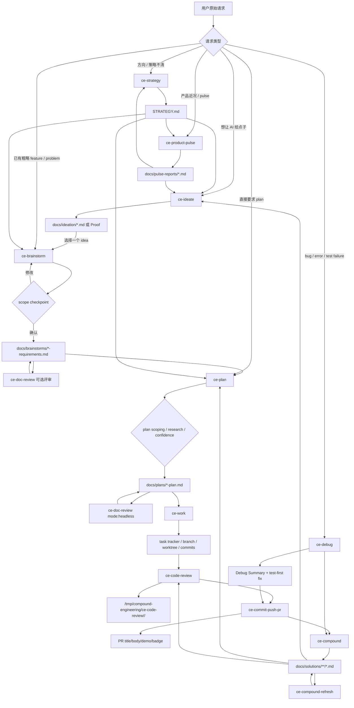

# 资料：Compound Engineering Plugin 的意图识别、意图整理与文档生成机制

> 资料用途：帮助理解 [EveryInc/compound-engineering-plugin](https://github.com/EveryInc/compound-engineering-plugin) 如何把自然语言请求路由到策略、发散、需求、计划、执行、评审、知识沉淀和产品反馈，并说明相关 skill 的触发条件、流程、结束条件、文档产物和完整中文执行规程。本文不是正式系列文章，而是用于理解、对比和后续复用的研究资料。
>
> 资料读取于：2026-05-17  
> 资料版本：`EveryInc/compound-engineering-plugin` main 分支，commit `82b8af415d9ca5577577fa80da0a6119fc8b661e`，插件版本 `3.8.2`  
> 主要来源：`README.md`、`plugins/compound-engineering/README.md`、`plugins/compound-engineering/.codex-plugin/plugin.json`、`ce-strategy/SKILL.md`、`ce-ideate/SKILL.md`、`ce-brainstorm/SKILL.md`、`ce-plan/SKILL.md`、`ce-work/SKILL.md`、`ce-code-review/SKILL.md`、`ce-doc-review/SKILL.md`、`ce-debug/SKILL.md`、`ce-compound/SKILL.md`、`ce-compound-refresh/SKILL.md`、`ce-product-pulse/SKILL.md`、`ce-commit-push-pr/SKILL.md` 及其引用文件。

---

## 1. 快速结论

Compound Engineering Plugin 的核心意图可以用它 README 中的原则概括：每一个工程单元都应该让下一个工程单元更容易，而不是更难。它不是单纯的 slash command 集合，而是一套把 AI 编程流程“物理化”的文档状态机：

```text
STRATEGY.md
  -> docs/ideation/*.md
  -> docs/brainstorms/*-requirements.md
  -> docs/plans/*-plan.md
  -> task tracker / branch / worktree / commits
  -> code review artifact
  -> PR description
  -> docs/solutions/*.md
  -> docs/pulse-reports/*.md
  -> 下一轮 strategy / ideate / brainstorm / plan 的上下文
```

它对“意图识别、意图整理、文档生成”最重要的主链路是：

| 阶段 | Skill | 核心产物 |
| --- | --- | --- |
| 战略锚点 | `ce-strategy` | `STRATEGY.md` |
| 点子生成 | `ce-ideate` | `docs/ideation/YYYY-MM-DD-<topic>-ideation.md` 或 Proof |
| 需求澄清 | `ce-brainstorm` | `docs/brainstorms/YYYY-MM-DD-<topic>-requirements.md` |
| 实施计划 | `ce-plan` | `docs/plans/YYYY-MM-DD-NNN-<type>-<name>-plan.md` |
| 文档评审 | `ce-doc-review` | 文档内联修复、结构化 findings、Open Questions |
| 执行 | `ce-work` | task tracker、分支/worktree、提交、最终 plan status |
| Debug 旁路 | `ce-debug` | Debug Summary、测试优先修复、PR，可交给 `ce-compound` |
| 代码评审 | `ce-code-review` | `/tmp/compound-engineering/ce-code-review/<run-id>/`、报告、自动修复 |
| PR 文档 | `ce-commit-push-pr` | value-first PR title/body、Demo、Compound badge |
| 知识沉淀 | `ce-compound` | `docs/solutions/<category>/<filename>.md` |
| 知识维护 | `ce-compound-refresh` | 更新、合并、替换、删除或标记 stale 的 solutions 文档 |
| 产品反馈 | `ce-product-pulse` | `docs/pulse-reports/YYYY-MM-DD_HH-MM.md` |

这套框架最有辨识度的地方有四点：

1. **先分清 WHAT 和 HOW**：`ce-brainstorm` 明确负责 WHAT，`ce-plan` 负责 HOW，`ce-work` 才执行。
2. **每个阶段都写成可复用文档**：需求、计划、评审、PR、解决方案、pulse report 都是持久化交付物。
3. **大量门控写进 skill 本体**：是否需要提问、什么时候必须停止、什么时候不能继续、什么时候要回退到上游 workflow，都有显式规则。
4. **知识闭环不是装饰**：`ce-compound` 把已解决问题写入 `docs/solutions/`，`ce-plan`、`ce-code-review`、`ce-ideate` 又会读取 learnings，让下一次工作少走弯路。

---

## 2. 框架意图：为什么需要 Compound Engineering

Compound Engineering 解决的是 AI 编程里的“执行很快，但上下文和判断不复利”问题。普通 Agent 可以快速写代码，但如果没有结构化机制，经常出现这些失败：

| 失败模式 | 表现 | CE 的处理方式 |
| --- | --- | --- |
| 战略缺失 | 单个 feature 看似合理，但和产品目标不一致 | `ce-strategy` 写 `STRATEGY.md`，下游 ideate/brainstorm/plan 自动读取 |
| 点子泛化 | Agent 给出一堆通用建议，和当前 repo 无关 | `ce-ideate` 先做 grounding，再多视角生成、批判过滤 |
| 需求被实现阶段补造 | plan 或 code 临时发明用户行为和成功标准 | `ce-brainstorm` 先写 requirements doc，`ce-plan` 必须携带来源决策 |
| 计划不可执行 | plan 缺文件、测试、依赖、风险、边界 | `ce-plan` 强制 Implementation Units、U-ID、测试场景、验证项 |
| 执行丢失计划意图 | 实现时把 plan 当建议，或者被局部代码带偏 | `ce-work` 把 plan 当决策 artifact，任务从 U-ID、Requirements、Verification 派生 |
| Review 噪音大 | 多个 reviewer 报告重复、低信心、不可操作 findings | `ce-code-review` 使用置信锚点、dedup、routing、validator、safe-auto fixer |
| 文档过时 | 旧经验还在，但代码已经变化 | `ce-compound-refresh` 对 `docs/solutions/` 做 keep/update/consolidate/replace/delete |
| 结果不可回看 | 产品到底运行得怎样只能问仪表盘 | `ce-product-pulse` 写单页 pulse timeline |

实现理念可以压缩成一句话：**把 Agent 的判断拆成一组可路由、可审计、可持久化、可复用的工程阶段。**

这也是它强调“80% planning and review，20% execution”的原因。CE 并不认为写代码不重要，而是认为 AI 写代码的边际成本下降后，真正昂贵的是错误目标、错误计划、错误假设、错误知识传递。

---

## 3. 相关 Skill / Command 总览

本文不完整覆盖 CE 的 38+ skills 和 50+ agents，只选择与“意图识别、意图整理、计划拆分、文档生成、执行门控、知识复利”直接相关的核心 skill。

| Role | Source file | Why it matters |
| --- | --- | --- |
| Strategy anchor | `ce-strategy/SKILL.md` | 生成 `STRATEGY.md`，为 ideate / brainstorm / plan 提供上游约束 |
| Idea generation | `ce-ideate/SKILL.md` | 从 repo、用户上下文、web、learnings 中生成和过滤候选想法 |
| Intent extraction | `ce-brainstorm/SKILL.md` | 把模糊需求澄清成 requirements doc |
| Spec / PRD | `ce-brainstorm/references/requirements-capture.md` | 定义 requirements doc 的结构、ID、验收例、完成检查 |
| Planning | `ce-plan/SKILL.md` | 把需求或任务拆成 implementation units 和测试/验证策略 |
| Document review | `ce-doc-review/SKILL.md` | 用文档 reviewer personas 检查需求/计划文档质量 |
| Execution | `ce-work/SKILL.md` | 读取 plan，生成任务，选择 inline/serial/parallel/worktree 策略并执行 |
| Debug route | `ce-debug/SKILL.md` | 对 bug 做复现、根因、测试优先修复和交接 |
| Code review | `ce-code-review/SKILL.md` | 多 persona code review、自动修复、残余工作路由 |
| PR documentation | `ce-commit-push-pr/SKILL.md` | 生成 value-first PR body，必要时插入 evidence/demo |
| Knowledge memory | `ce-compound/SKILL.md` | 把已解决问题写入 `docs/solutions/` |
| Knowledge maintenance | `ce-compound-refresh/SKILL.md` | 随代码演化维护旧 learnings 和 pattern docs |
| Product feedback | `ce-product-pulse/SKILL.md` | 把用户体验和系统表现写成 pulse timeline |

### 3.1 `ce-strategy` 介绍

**中文译解**：`ce-strategy` 是所有 feature workflow 上游的“产品战略锚点”。它故意保持短，因为它不是 roadmap、issue tracker 或 PRD，而是回答产品是什么、服务谁、怎样成功、当前投入哪些方向。

| 项目 | 内容 |
| --- | --- |
| 触发条件 | 新产品启动、方向调整、用户说“write our strategy”“update the roadmap”“what are we working on”“set up the strategy doc”；当 `ce-ideate`、`ce-brainstorm`、`ce-plan` 需要上游 grounding 但没有 `STRATEGY.md` 时也触发。 |
| 流程 | 先按 `STRATEGY.md` 是否存在路由；首次运行读取 `references/interview.md`，按 target problem、approach、persona、metrics、tracks、可选 milestones / not working on / marketing 逐节访谈并 pushback；更新运行只重访指定 section 或用户选择的 section；写入后交接给下游 skill。 |
| 结束条件 | 草稿已展示并经过一轮编辑机会；`STRATEGY.md` 已创建或更新；`last_updated` 更新；下游说明已给出。若用户未回答必要战略问题，不能伪造策略。 |
| 产生什么文档 / 相关文档 | 读取/写入 repo 根目录 `STRATEGY.md`；读取 `references/interview.md` 和 `references/strategy-template.md`。 |

### 3.2 `ce-ideate` 介绍

**中文译解**：`ce-ideate` 不直接写需求、计划或代码，它回答“哪些想法值得深入探索”。它先判断用户到底要 agent 主动生成想法，还是已经有想法需要澄清；然后做 grounding、多视角发散、批判过滤和可选持久化。

| 项目 | 内容 |
| --- | --- |
| 触发条件 | 用户说“what should I improve”“give me ideas”“ideate on X”“surprise me”“what would you change”；或者明确要求 AI 生成建议而不是细化用户已有想法。 |
| 流程 | 检查近 30 天 ideation doc；做 subject-identification gate；分类 repo-grounded / elsewhere-software / elsewhere-non-software；必要时收集上下文；提示 agent dispatch 成本；执行 codebase/user-context、learnings、web、issue/slack 可选 grounding；分解 topic axes；6 个 ideation frame 并行生成候选；合并、去重、覆盖检查；读取 post-ideation workflow 做 adversarial filtering；展示 survivors；按用户选择 refine、Proof、brainstorm 或 save。 |
| 结束条件 | 至少完成一次 survivor 展示；若用户选择保存或交接，写入 ideation artifact 或 Proof；若用户选择 brainstorm，必须先持久化并标记 selected idea 为 explored；不会直接跳到 plan 或 code。 |
| 产生什么文档 / 相关文档 | 默认 repo 模式写 `docs/ideation/YYYY-MM-DD-<topic>-ideation.md`；运行中写 `/tmp/compound-engineering/ce-ideate/<run-id>/raw-candidates.md` 和 `survivors.md`；elsewhere 模式默认保存到 Proof。 |

### 3.3 `ce-brainstorm` 介绍

**中文译解**：`ce-brainstorm` 是 CE 的需求澄清入口。它把“粗略想法”变成轻量 PRD/feature brief，并且明确禁止把实现细节提前写进需求文档。它的核心价值是把产品行为、范围边界、成功标准在 planning 前说清。

| 项目 | 内容 |
| --- | --- |
| 触发条件 | 用户说“let's brainstorm”“what should we build”“help me think through X”；提出模糊、野心大、方向不确定的 feature；或虽然没说 brainstorm 但明显缺 scope / behavior / success criteria。 |
| 流程 | 识别是否恢复已有 `*-requirements.md`；判断是否软件任务；评估是否需要 brainstorm 与 scope 深度；扫描 repo/strategy/相关文档；按 evidence、specificity、counterfactual、attachment、durability 等 gap 提问；探索 2-3 个 approach；读取 synthesis summary 做 scope checkpoint；确认后按 requirements template 写文档；最后 handoff 到 plan、doc review、Proof、work 或暂停。 |
| 结束条件 | idea 清楚且 integration-check 无待问问题，或用户明确继续；Path B 场景必须通过 scope confirmation；requirements doc 写入或明确无需持久化；若 `Resolve Before Planning` 仍有问题，不能提供 `ce-plan` / `ce-work` 作为可直接继续的选项。 |
| 产生什么文档 / 相关文档 | 写或更新 `docs/brainstorms/YYYY-MM-DD-<topic>-requirements.md`；读取 `STRATEGY.md`、`AGENTS.md`、相关 brainstorm/plan/spec；可交给 `ce-doc-review`、`ce-proof`、`ce-plan`、`ce-work`。 |

### 3.4 `ce-plan` 介绍

**中文译解**：`ce-plan` 把 WHAT 转成 HOW。它可以从 requirements doc、bug report、粗略描述直接进入，但如果产品问题还没澄清，会建议先回到 `ce-brainstorm`。计划文档不是执行脚本，而是决策 artifact。

| 项目 | 内容 |
| --- | --- |
| 触发条件 | 用户说“plan this”“create a plan”“how should we build”“break this down”；或 `ce-brainstorm` 已生成 requirements doc；用户说“deepen the plan”时进入 plan deepening fast path。 |
| 流程 | 恢复已有 plan 或寻找上游 requirements；无 requirements 时做 planning bootstrap；识别 blocking product questions；评估 plan depth；必要时 solo scoping synthesis；做 local research、learnings research、可选 external research、flow analysis；解决 planning questions；命名文件；拆 Implementation Units；写 plan；confidence check；必要时 deepening；强制 `ce-doc-review mode:headless`；最后给 start work、deep review、create issue、Proof、done 菜单并执行选择。 |
| 结束条件 | plan 文件必须先写入磁盘；confidence check 和 headless doc review 已完成；post-generation menu 已展示且用户选择的路由已执行。只展示菜单不执行选择不算完成。 |
| 产生什么文档 / 相关文档 | 写 `docs/plans/YYYY-MM-DD-NNN-<type>-<descriptive-name>-plan.md`；读取 `docs/brainstorms/*-requirements.md`、`STRATEGY.md`、`AGENTS.md`、`docs/solutions/`；引用 `references/plan-template.md`、`deepening-workflow.md`、`plan-handoff.md`。 |

### 3.5 `ce-doc-review` 介绍

**中文译解**：`ce-doc-review` 是需求/计划文档的质量闸。它先根据内容形态判断文档是 requirements 还是 plan，再派 coherence、feasibility 和条件 personas 检查矛盾、可行性、范围、产品、设计、安全、对抗性假设。

| 项目 | 内容 |
| --- | --- |
| 触发条件 | 已有 requirements doc 或 plan doc，用户想改进它；`ce-plan` 生成 plan 后必须以 headless 模式调用。 |
| 流程 | 解析 `mode:headless`；读取目标文档；按内容形态分类 requirements/plan；选择 always-on 与 conditional personas；并行 dispatch；读取 synthesis pipeline；按置信锚点 gate、dedup、promotion、premise chain linking、routing；自动应用 anchor 100 的 safe fixes；interactive 模式对剩余 findings 做 walkthrough / best judgment / append open questions / report only；headless 返回结构化结果。 |
| 结束条件 | safe fixes 已写入文档；剩余 findings 已按模式输出或交互处理；headless 以 `Review complete` 作为终止信号；interactive 完成 routing 和后续动作。 |
| 产生什么文档 / 相关文档 | 修改被 review 的 `.md` 文档；可追加 Open Questions；读取 `references/findings-schema.json`、`synthesis-and-presentation.md`、`walkthrough.md`、`bulk-preview.md`。 |

### 3.6 `ce-work` 介绍

**中文译解**：`ce-work` 是执行层。它读取 plan，但不把 plan 当 micro-step 脚本，而是从 Implementation Units、Files、Test scenarios、Verification、Scope Boundaries 中派生任务，并根据依赖和文件重叠选择 inline、串行 subagents、并行 subagents 或 worktree 隔离。

| 项目 | 内容 |
| --- | --- |
| 触发条件 | 用户要执行 plan；`ce-plan` 菜单选择 start work；或给出小型明确 bare prompt。 |
| 流程 | 判断输入是 plan file 还是 bare prompt；读 plan 并一次性澄清；设置分支/worktree；创建 task list，保留 U-ID；选择执行策略；逐任务读 patterns、测试、实现、测试、更新 task；并行时做 file-to-unit 安全检查、worktree merge、冲突后 serial redispatch；完成后读取 shipping workflow：测试、lint、simplify、review、residual gate、plan status、commit/PR。 |
| 结束条件 | 所有任务完成；质量检查和 code review 完成；plan frontmatter `status` 从 active 改为 completed；`ce-commit-push-pr` 或 `ce-commit` 完成；用户收到 PR 或提交状态。若测试失败、review residual 未决或 scope 过大，必须停在 gate。 |
| 产生什么文档 / 相关文档 | 读取 `docs/plans/*.md`；只在 shipping 时更新 plan status；使用 task tracker；最终触发 `ce-commit-push-pr` 生成 PR body；可能写 `docs/residual-review-findings/<branch-or-head-sha>.md`。 |

### 3.7 `ce-debug` 介绍

**中文译解**：`ce-debug` 是 bug-shaped 请求的旁路。它的关键不是“修 bug”，而是先确认完整 causal chain，并用 prediction 验证不确定链路，避免 symptom patch。

| 项目 | 内容 |
| --- | --- |
| 触发条件 | 用户说“debug this”“why is this failing”“fix this bug”“trace this error”；粘贴 stack trace、error、test failure、issue tracker reference；或 `ce-plan` bootstrap 发现任务本质是 bug investigation。 |
| 流程 | triage 输入，必要时拉 issue 全评论； trivial bug 可 fast-path 但仍要问 fix/diagnosis；复现 bug；检查环境 sanity；从 symptom 反向 trace；读取 anti-patterns；列 assumption audit；形成 hypothesis、supporting observation、causal chain、prediction；通过 causal chain gate 后展示 findings 和 fix choice；用户选择 fix 时做分支检查、test-first、最小修复、 broader tests、自审；失败则回 root cause。 |
| 结束条件 | diagnosis only 时输出 Debug Summary 后停止；fix 路径通过测试和总结后，根据 skill 是否创建 branch 进入 commit/PR；PR 打开后视学习价值决定是否建议 `ce-compound`。 |
| 产生什么文档 / 相关文档 | 无固定需求/计划文档；输出 Debug Summary；可能创建测试、代码提交、PR；可触发 `ce-compound` 写 `docs/solutions/`。 |

### 3.8 `ce-code-review` 介绍

**中文译解**：`ce-code-review` 是多 persona 代码评审流水线。它不是让多个 reviewer 各说各话，而是统一成 JSON schema、置信锚点、去重、路由、自动修复和残余工作 artifact。

| 项目 | 内容 |
| --- | --- |
| 触发条件 | 创建 PR 前；任务完成后需要 review；用户显式要 code review；`ce-work` shipping workflow 在 Tier 2 升级时调用。 |
| 流程 | 解析 mode/autofix/report-only/headless/base/plan；确定 diff scope；发现 intent 和 plan；选择 always-on、cross-cutting、stack-specific personas；bounded parallel dispatch；每个 persona 写 compact JSON 和 full artifact；merge findings、dedup、confidence gate、routing；externalizing modes 跑 per-finding validators；interactive 输出 table report 并问如何处理剩余 findings；autofix/headless 自动应用 safe_auto 并写 run artifact。 |
| 结束条件 | report-only 输出报告即结束；headless 输出结构化 envelope 并以 `Review complete` 结束；autofix 写 artifact 和 residual summary；interactive 的 safe fixes、用户 routing、可选 ticket/fixer/PR next step 都完成。 |
| 产生什么文档 / 相关文档 | 写 `/tmp/compound-engineering/ce-code-review/<run-id>/` 下 reviewer JSON、metadata、synthesized findings、applied fixes、residual work；可能修改代码；不会在 headless/autofix 自行 commit/push/PR。 |

### 3.9 `ce-commit-push-pr` 介绍

**中文译解**：`ce-commit-push-pr` 是 PR 文档生成和发布门。它把 diff 叙事从“列文件变化”改成“说明现在能做到什么、修好了什么、为什么这些变更属于同一个 PR”。

| 项目 | 内容 |
| --- | --- |
| 触发条件 | 用户说“commit and PR”“ship this”“create a PR”“open a pull request”；或只要求“write/rewrite/describe PR body”。`ce-work` 和 `ce-debug` shipping 阶段也会调用。 |
| 流程 | 判断 description-only / description update / full workflow；检查 branch、PR state；确定提交和 PR 标题风格；必要时创建 feature branch；按 logical groups 提交并 push；读取 PR description writing reference；决定是否捕获 evidence/demo；解析 diff 和 commit range；写 value-first title/body；new PR 用 `gh pr create`，existing PR 可预览后 `gh pr edit`。 |
| 结束条件 | description-only 模式输出 title/body；full 模式已提交、push 并创建或更新 PR；existing PR rewrite 经用户确认后应用；不支持直接推 default branch。 |
| 产生什么文档 / 相关文档 | PR title/body；可能插入 `## Demo`、测试说明、Mermaid/table、Compound Engineering badge；使用临时 body file 调用 `gh`，避免空 PR body。 |

### 3.10 `ce-compound` 介绍

**中文译解**：`ce-compound` 是 CE 的知识复利层。它只在问题已解决、方案已验证、且不是 trivial 的情况下，把经验写成可搜索、带 YAML frontmatter 的 solution doc。

| 项目 | 内容 |
| --- | --- |
| 触发条件 | 用户手动 `/ce-compound`；出现“that worked”“it's fixed”“working now”“problem solved”等 solved-problem 信号；`ce-debug` 在 PR 后发现有可复用教训。 |
| 流程 | interactive 先问 Full / Lightweight；Full 可询问是否搜索 session history；做 auto memory scan；并行 Context Analyzer、Solution Extractor、Related Docs Finder；可同步调用 `ce-sessions`；根据 overlap 决定更新旧文档还是创建新文档；读取 template 和 schema，写 `docs/solutions/`；运行 frontmatter validator；选择性建议 `ce-compound-refresh`；做 discoverability check；可选 specialized review；最后输出 next menu。 |
| 结束条件 | 主产物必须是一份 solution doc，或高重叠时更新一份已有 doc；frontmatter validation 通过；discoverability check 完成；headless 以 `Documentation complete` 或 `Documentation skipped` 结束。 |
| 产生什么文档 / 相关文档 | 写或更新 `docs/solutions/<category>/<filename>.md`；可能小幅更新 `AGENTS.md` / `CLAUDE.md` 提示 `docs/solutions/` 可发现；读取 `references/schema.yaml`、`yaml-schema.md`、`assets/resolution-template.md`。 |

### 3.11 `ce-compound-refresh` 介绍

**中文译解**：`ce-compound-refresh` 是 `docs/solutions/` 的维护器。它承认知识文档会漂移，所以用当前代码、旧文档、引用关系和 document-set 结构判断每份 learning 应 keep、update、consolidate、replace、delete 或 stale。

| 项目 | 内容 |
| --- | --- |
| 触发条件 | 用户说“refresh my learnings”“audit docs/solutions/”“clean up stale learnings”“consolidate overlapping docs”；或 `ce-compound` 指出旧文档可能被新学习 supersede。不能因普通 refactor/debug/code-review 自动触发，除非用户明确指向 `docs/solutions/`。 |
| 流程 | 解析 headless 和 scope hint；发现候选 docs；按 focused/batch/broad 路由；先查 individual learnings，再查 patterns；检测 references、solution、code examples、related docs、memory、overlap；做 document-set analysis；按五类 action 分类；interactive 只在真实歧义处提问；执行 per-action flows；输出完整 markdown report；必要时 commit；最后做 discoverability check。 |
| 结束条件 | 每个候选文件都有分类、证据、行动或建议；headless 报告分 Applied / Recommended；有修改时按 git context 提交或给出命令；无候选或 scope miss 时明确停止。 |
| 产生什么文档 / 相关文档 | 读取/更新/合并/删除 `docs/solutions/**/*.md`；可能更新 `AGENTS.md` / `CLAUDE.md` discoverability；输出 markdown report；可能创建分支、提交、PR。 |

### 3.12 `ce-product-pulse` 介绍

**中文译解**：`ce-product-pulse` 是产品反馈读取层。它不报告“我们 ship 了什么”，而是报告用户和系统在一个时间窗口里实际发生了什么，并把每次 pulse 存成 timeline。

| 项目 | 内容 |
| --- | --- |
| 触发条件 | 用户说“run a pulse”“show me the pulse”“how are we doing”“weekly recap”“launch-day check”，或传入 `24h`、`7d`、`1h` 等 lookback。 |
| 流程 | 读取 `.compound-engineering/config.local.yaml` 的 `pulse_*`；未配置则先访谈，优先从 `STRATEGY.md` seed 产品名和 key metrics；拒绝读写 DB 凭证，只接受只读；运行 analytics/tracing/payments 并行查询，DB 串行查询；可选 AI quality scoring；读取 report template；写单页报告；提示 scheduling 但不自动调度。 |
| 结束条件 | 配置完成并写入本地 config，或已有配置下成功写 pulse report；报告保存到 `docs/pulse-reports/`；聊天里展示 Headlines 和 top followup。不会改数据库或外部系统。 |
| 产生什么文档 / 相关文档 | 写 `.compound-engineering/config.local.yaml` 的 `pulse_*` key；写 `docs/pulse-reports/YYYY-MM-DD_HH-MM.md`；读取 `STRATEGY.md` 和 `references/report-template.md`。 |

---

## 4. 意图识别与路由机制

CE 的路由不是一个单独的 meta skill，而是每个 skill 的 `description` 和 `argument-hint` 都承担触发器角色。它通过“动词 + 工作状态 + 文档状态”识别用户意图：

| 用户意图 | 触发 skill | 判断依据 |
| --- | --- | --- |
| “我们到底在做什么” | `ce-strategy` | strategy、roadmap、direction、target problem、metrics、tracks |
| “给我一些想法” | `ce-ideate` | 用户要 AI 主动生成候选方向，而不是已有需求澄清 |
| “帮我想清楚这个功能” | `ce-brainstorm` | 模糊 feature、scope 不清、ambitious request、不确定方向 |
| “怎么实现 / 拆计划” | `ce-plan` | plan、break down、how should we build、requirements doc ready |
| “这份文档靠谱么” | `ce-doc-review` | requirements/plan 文档已存在，需要 persona review |
| “开始做” | `ce-work` | plan doc 或明确 bare prompt，可执行 |
| “为什么失败 / 修 bug” | `ce-debug` | stack trace、test failure、issue、debug/fix bug |
| “review changes” | `ce-code-review` | 当前 branch/PR/diff 需要评审 |
| “开 PR” | `ce-commit-push-pr` | commit、push、PR、rewrite PR body |
| “这个解决方案记下来” | `ce-compound` | solved problem、working now、可复用经验 |
| “维护旧经验” | `ce-compound-refresh` | refresh/audit/cleanup/consolidate `docs/solutions/` |
| “产品近况怎样” | `ce-product-pulse` | pulse、weekly recap、launch-day check、lookback window |

它的路由理念有三个工程取舍：

1. **意图与文档状态绑定**：如果 `STRATEGY.md` 缺失，strategy 层可能先触发；如果 requirements doc 已存在，plan 直接以它为 primary input。
2. **错误路由会显式回退**：`ce-plan` 遇到产品问题会建议 `ce-brainstorm`；bug-shaped prompt 会建议 `ce-debug`；large bare prompt 会建议先 plan。
3. **每个 skill 都有“不做什么”边界**：strategy 不写 roadmap，brainstorm 不写实现细节，plan 不编码，work 不修改 plan body 进度，pulse 不改数据库。

---

## 5. 意图抽取 / 澄清机制

CE 的意图抽取主要发生在 `ce-brainstorm`，但它依赖三层上游：

1. `ce-strategy` 提供产品目标、用户、指标、tracks。
2. `ce-ideate` 提供被筛选过的候选想法。
3. repo / docs / AGENTS / prior brainstorm / plan / learnings 提供现实约束。

`ce-brainstorm` 的澄清不是泛泛地问“你想要什么”，而是根据 scope 选择问题强度：

| Scope | 澄清重点 | 产物强度 |
| --- | --- | --- |
| Lightweight | 是否已足够明确、是否需要 durable handoff | 可短文档，甚至跳过文档 |
| Standard | evidence、specificity、counterfactual、attachment | 标准 requirements doc，R-ID |
| Deep-feature | 标准 lens + 系统级影响 | 更完整的 actors、flows、requirements、success criteria |
| Deep-product | 产品形态、durability、outside identity | 拆分 deferred 与 outside identity，防止后续发明产品路径 |

核心机制是“gap probe”：

| Gap | 它暴露的隐藏假设 | 典型问题 |
| --- | --- | --- |
| Evidence gap | 需求是否有可观察行为支撑 | 有没有人已经付费、绕路、放弃工具 |
| Specificity gap | beneficiary 是否具体 | 是哪个团队/角色、ship 后他们发生什么变化 |
| Counterfactual gap | 现状成本是否真实 | 今天怎么解决，不做会怎样 |
| Attachment gap | 是否过早爱上方案形状 | 最小仍能证明价值的版本是什么 |
| Durability gap | 产品 thesis 是否抗未来变化 | 近期世界变化后它还成立吗 |

这套机制的结束条件很关键：不是“问够了几轮”，而是 idea clear、integration-check 无 pending questions，或者用户明确要求继续。否则就不该进入 plan。

---

## 6. 意图发散与收敛机制

CE 有两个发散层：

### 6.1 `ce-ideate`：先生成候选想法

`ce-ideate` 的发散流程是：

```text
Subject gate
  -> Mode classification
  -> Context grounding
  -> Topic axes
  -> 6 个 ideation frames
  -> raw candidates
  -> dedupe / combinations / axis coverage
  -> adversarial filtering
  -> survivors
```

六个默认 frame 是：

| Frame | 用途 |
| --- | --- |
| Pain and friction | 找慢、痛、坏、烦 |
| Inversion / removal / automation | 反过来做、移除步骤、自动化 |
| Assumption-breaking / reframing | 挑战默认假设 |
| Leverage and compounding | 找能让未来工作更便宜的点 |
| Cross-domain analogy | 从其他领域找结构相似方案 |
| Constraint-flipping | 把约束翻转到极端，寻找非显然设计 |

关键不是“多生成”，而是“先生成，后批判”。survivors 必须有 `direct:`、`external:` 或 `reasoned:` basis，否则是通用 AI 建议。

### 6.2 `ce-brainstorm`：再把一个想法收敛为需求

Brainstorm 的收敛点是 Phase 2.5 synthesis。它先内部写 Stated / Inferred / Out of scope，再把用户真正需要确认的 scope 摘出来。用户确认后，才写 requirements doc。

这解决了一个常见问题：一问一答容易让用户不知道整体范围已经变成什么样。synthesis 是写文档前的最后纠偏点。

---

## 7. Spec / PRD / 需求文档生成机制

CE 的 requirements doc 是轻量 PRD。默认路径：

```text
docs/brainstorms/YYYY-MM-DD-<topic>-requirements.md
```

核心模板包含：

| Section | 作用 |
| --- | --- |
| Summary | 1-3 行说明 doc 提议什么 |
| Problem Frame | 为什么这个提议存在，不能重述解决方案 |
| Actors | 多个人/系统/agent 参与时写 A-ID |
| Key Flows | 多步骤交互或跨流程时写 F-ID |
| Requirements | Standard/Deep 使用 R-ID，分组但不滥用 |
| Acceptance Examples | 条件行为必须用 AE 固定 |
| Success Criteria | 人类结果 + 下游 agent 交接质量 |
| Scope Boundaries | 非目标；Deep-product 分 deferred 与 outside identity |
| Key Decisions | 关键取舍和理由 |
| Dependencies / Assumptions | 依赖和假设 |
| Outstanding Questions | 分 Resolve Before Planning 与 Deferred to Planning |

完成检查里最重要的一条是：

```text
如果 ce-plan 仍然需要发明产品行为、范围边界或成功标准，brainstorm 还没有完成。
```

因此 `ce-brainstorm` 的文档不是记录聊天，而是把后续 plan 不应再发明的产品事实固定下来。

---

## 8. Plan / Task / Issue 拆分机制

CE 的计划文档默认路径：

```text
docs/plans/YYYY-MM-DD-NNN-<type>-<descriptive-name>-plan.md
```

计划不是 todo list，而是 implementation decision artifact。它的最小可执行单元是 U-ID：

```markdown
### U1. [Name]

**Goal:** ...
**Requirements:** R1, R2
**Dependencies:** ...
**Files:** repo-relative paths only
**Approach:** ...
**Execution note:** optional
**Patterns to follow:** ...
**Test scenarios:** ...
**Verification:** ...
```

U-ID 的稳定性是关键规则：

- 已分配的 U-ID 不重编号。
- 重排保留原 ID。
- 拆分时旧概念保留旧 ID，新概念拿下一个未用 ID。
- 删除留下空洞。

这样 `ce-work`、review、deferred notes、final summary 都能稳定引用同一个实施单元。

`ce-plan` 还有两道质量门：

1. **Confidence check / deepening**：根据 plan depth、high-risk surface、thin local grounding 判断是否需要更强的二次研究。
2. **Mandatory doc review**：无论 confidence 是否通过，都要加载 `plan-handoff.md` 并运行 `ce-doc-review`，因为 confidence check 和 doc review 捕捉不同问题。

---

## 9. Documentation / ADR / Memory 机制

CE 没有独立叫 ADR 的主线 skill，但它把文档分成五类状态：

| 文档类型 | 默认路径 | 作用 |
| --- | --- | --- |
| Strategy | `STRATEGY.md` | 产品定位、用户、指标、tracks |
| Ideation | `docs/ideation/*.md` | 保存候选想法、basis、rejection summary |
| Requirements | `docs/brainstorms/*-requirements.md` | 保存 WHAT 和 scope |
| Plan | `docs/plans/*-plan.md` | 保存 HOW、U-ID、测试、验证 |
| Solutions | `docs/solutions/**/*.md` | 保存已解决问题和可复用经验 |
| Pulse | `docs/pulse-reports/*.md` | 保存用户体验和系统表现 timeline |
| Review artifact | `/tmp/compound-engineering/ce-code-review/<run-id>/` | 保存 reviewer findings、应用修复、残余工作 |
| PR body | GitHub PR | 面向 reviewer 的价值叙事、测试、demo、operational validation |

`docs/solutions/` 是最像 memory / ADR 的层，因为它保存的不只是“发生了什么”，而是：

- 何时适用。
- 问题症状。
- 根因或指导原则。
- 解决方案。
- 为什么有效。
- 防复发策略。
- category、module、tags、problem_type 等 frontmatter。

`ce-compound-refresh` 则负责防止 memory 腐烂：旧文档如果和当前代码不一致，要 update、replace、consolidate 或 delete。

---

## 10. 从意图到文档的完整流程



生成相关文档的原则：

- **策略文档**：由 `ce-strategy` 访谈生成，不放 backlog、不放实现细节。
- **点子文档**：由 `ce-ideate` 在用户选择保存/交接时生成，terminal review 本身也可作为完整 ideation cycle。
- **需求文档**：由 `ce-brainstorm` 在确认 scope 后生成，不能泄露默认实现细节。
- **计划文档**：由 `ce-plan` 研究和拆分后生成，必须写入文件后再做 confidence/doc review。
- **评审文档**：`ce-doc-review` 和 `ce-code-review` 都把 findings 结构化，并区分自动修复、需确认、需人工、FYI。
- **知识文档**：`ce-compound` 只在问题已解决且方案验证后写；`ce-compound-refresh` 负责维护。
- **PR 文档**：`ce-commit-push-pr` 根据 diff 写“价值优先”的描述，不枚举文件。
- **Pulse 文档**：`ce-product-pulse` 只读数据源，写单页报告，不设置阈值、不改系统。

---

## 11. 相关 Skill 完整中文执行版

以下不是逐句直译，而是按原文结构重建的中文执行规程。每节都保留触发、流程、交付物、停止条件和验证清单。

### 11.1 `ce-strategy` 完整中文执行版

#### 元信息

来源：`plugins/compound-engineering/skills/ce-strategy/SKILL.md`

名称：`ce-strategy`  
描述：创建或维护 `STRATEGY.md`，记录产品目标问题、方法、用户、关键指标和工作 tracks。

#### 概览

该 skill 产出 repo 根目录的 `STRATEGY.md`。它是下游 `ce-ideate`、`ce-brainstorm`、`ce-plan` 的 grounding，不是 roadmap、issue tracker、需求文档或计划文档。

#### 触发条件

- 启动新产品或调整方向。
- 用户要求写 strategy、update roadmap、what are we working on、set up strategy doc。
- 下游 skill 需要 strategy grounding，但 `STRATEGY.md` 不存在。
- 可用参数指定要重访的 section，例如 metrics、approach、tracks。

#### 流程

1. 读取 `STRATEGY.md`。
2. 如果不存在，进入首次访谈；如果存在且参数指定 section，做定向更新；如果存在但无参数，询问要重访哪一部分。
3. 首次访谈必须读取 `references/interview.md`，不能凭记忆 improvisation。
4. 按 target problem、approach、persona、metrics、tracks、可选 milestones、not working on、marketing 访谈。
5. 每一节必须 apply pushback rules；每节最多两轮 pushback，之后保留用户语言并标记下次值得重访。
6. 读取 `references/strategy-template.md`，填入草稿。
7. 写入前先在聊天展示完整 draft，提供一轮编辑。
8. 写入或更新 `STRATEGY.md`。
9. 输出下游 handoff：`ce-ideate`、`ce-brainstorm`、`ce-plan` 会读取它。

#### 输出 / 交付物

- `STRATEGY.md`
- 首次运行的完整 strategy draft。
- 更新运行的 3-5 行现状摘要。

#### 与其他 Skill 的关系

- 上游：无固定上游。
- 下游：`ce-ideate`、`ce-brainstorm`、`ce-plan`。
- 不负责：issue tracker、backlog prioritization、requirements、implementation plan、metric values。

#### 常见合理化与现实

- 合理化：“先把 features 写进去。”现实：features 属于 brainstorm 或 issue tracker，不属于 strategy。
- 合理化：“先长文解释清楚。”现实：短是该文档的特性，扩 section 会降低复用性。
- 合理化：“已有内容就不要挑战。”现实：update run 也必须 pushback weak content。

#### 红旗

- `STRATEGY.md` 变成 roadmap。
- 未读取 `references/interview.md` 就开始访谈。
- 为了显得完整添加额外大段内容。
- 未给用户看 draft 就写文件。

#### 结束判断与验证

- [ ] `STRATEGY.md` 已存在于 repo root。
- [ ] required sections 1-5 已回答。
- [ ] 用户看过 draft 并有一轮编辑机会。
- [ ] 更新运行保留未重访 sections，不误改。
- [ ] `last_updated` 使用当天 ISO 日期。
- [ ] 已提示下游 skill 会读取 strategy。

### 11.2 `ce-ideate` 完整中文执行版

#### 元信息

来源：`plugins/compound-engineering/skills/ce-ideate/SKILL.md`、`ce-ideate/references/post-ideation-workflow.md`

名称：`ce-ideate`  
描述：基于上下文生成、批判和排序想法；适用于用户想让 AI 主动提出候选方向的场景。

#### 概览

`ce-ideate` 在 `ce-brainstorm` 之前运行。它产出 ranked ideation artifact，不产出 requirements、plans 或 code。

#### 触发条件

- 用户要“给我一些想法”“what should I improve”“surprise me”。
- 用户要求 AI 生成建议，而不是细化一个已知想法。
- 不适用于已经明确要澄清的某个 feature，那应该用 `ce-brainstorm`。

#### 流程

1. 检查 `docs/ideation/` 近 30 天相关文档；询问继续还是新开。
2. 做 subject-identification gate：若主题不明确，询问“ideate about what”；保留 “Surprise me” 作为一级选项。
3. 分类模式：repo-grounded、elsewhere-software、elsewhere-non-software；不要把内部 taxonomy 暴露给用户，只用自然语言说明。
4. elsewhere 模式必须有足够 context substance，必要时问 URL、描述或 paste。
5. 解析 focus 和 volume override，如 `top 3`、`100 ideas`、`raise the bar`。
6. 告知预计 dispatch 的 agent 数量和可跳过项。
7. Phase 1 grounding：repo 模式做 codebase scan、learnings、web；issue tracker intent 加 issue intelligence；elsewhere 模式做 user-context synthesis、web、可选 learnings。
8. 生成 `/tmp/compound-engineering/ce-ideate/<run-id>` scratch dir。
9. 整合 grounding summary，加入 topic axes 或 skip reason。
10. Phase 2 并行派 6 个 ideation sub-agents；issue themes 可改为 4 个；每个想法必须含 title、summary、axis、basis、why_it_matters、meeting_test。
11. 合并、去重、cross-cutting combinations、axis coverage recovery。
12. 写 checkpoint A：`raw-candidates.md`。
13. 读取 `post-ideation-workflow.md`，执行 adversarial filtering，记录 rejection reason。
14. 写 checkpoint B：`survivors.md`。
15. 展示 survivors：title、description、axis、basis、rationale、downsides、confidence、complexity、rejection summary。
16. 询问下一步：refine、Proof、brainstorm selected idea、save and end。

#### 输出 / 交付物

- 终端展示的 survivor list。
- 可选 `docs/ideation/YYYY-MM-DD-<topic>-ideation.md`。
- 可选 Proof 文档。
- Scratch checkpoints：`raw-candidates.md`、`survivors.md`。

#### 与其他 Skill 的关系

- 下游推荐：`ce-brainstorm`，不能直接跳到 `ce-plan`。
- 读取：`STRATEGY.md`、`docs/solutions/`、web / issue / slack context。
- 非软件场景会读取 universal ideation reference。

#### 常见合理化与现实

- 合理化：“用户说 quick wins，就随便列几个。”现实：仍要有 basis；只是降低 meeting-test floor。
- 合理化：“repo 在当前目录，主题就等于整个 repo。”现实：vague prompt 仍要先问 subject。
- 合理化：“保存是默认。”现实：persistence 是 opt-in。

#### 红旗

- survivor 没有 direct/external/reasoned basis。
- 没有先生成完整候选就开始过滤。
- 主题轴为空但没有 skip reason。
- 选中 idea 后直接 plan，不经过 brainstorm。
- 删除 scratch dir，导致 checkpoint 不可复用。

#### 结束判断与验证

- [ ] 已完成 subject gate 和 mode classification。
- [ ] grounding summary 可解释 idea 来源。
- [ ] raw candidates 先生成，后过滤。
- [ ] 每个 survivor 有 basis、rationale、confidence、complexity。
- [ ] 每个 rejected idea 有 reason。
- [ ] 若用户选择保存，文档路径或 Proof URL 明确。
- [ ] 若用户选择 brainstorm，已先写持久记录并将 idea 标为 explored。

### 11.3 `ce-brainstorm` 完整中文执行版

#### 元信息

来源：`plugins/compound-engineering/skills/ce-brainstorm/SKILL.md`、`references/requirements-capture.md`、`references/synthesis-summary.md`、`references/handoff.md`

名称：`ce-brainstorm`  
描述：通过协作对话探索需求和方案，然后写 right-sized requirements document。

#### 概览

`ce-brainstorm` 回答 WHAT，不回答 HOW。它写的是轻量 PRD / feature brief，目的是让 planning 不再发明产品行为、范围边界或成功标准。

#### 触发条件

- 用户提出模糊或 ambitious feature。
- 用户不确定 scope 或方向。
- 用户说 brainstorm、what should we build、help me think through。
- 若需求已很清楚，可短路到简短确认和短文档，不强行长 brainstorm。

#### 流程

1. 如果用户引用已有 topic/doc，或 `docs/brainstorms/` 有明显匹配文档，询问继续还是新开。
2. 判断是否软件任务；非软件 route 到 universal brainstorming；快速问题直接回答。
3. 评估是否需要 brainstorm；清晰需求不强行完整流程。
4. 分类 Lightweight / Standard / Deep，并区分 Deep-feature / Deep-product。
5. 扫描上下文：AGENTS、STRATEGY、相关 docs、代码里可验证事实。
6. 做 product pressure test，内部识别 evidence、specificity、counterfactual、attachment、durability gaps。
7. 对话中一次只问一个问题；gap probe 用 open-ended，不能用菜单引导。
8. 在退出 Phase 1.3 前做 integration check，捕获多个用户回答组合后的非显然后果。
9. 若有多个方向，提出 2-3 个 concrete approaches，包含 pros/cons/risk/best suited，并给 recommendation。
10. Phase 2.5 必须读取 synthesis reference；内部写 Stated / Inferred / Out of scope；按 Path A / Path B 决定是否需要 confirmation。
11. Phase 3 读取 requirements template，按 scope 写 right-sized requirements doc。
12. Phase 4 读取 handoff reference，给下一步选项并执行选择。

#### 输出 / 交付物

- 可选 `docs/brainstorms/YYYY-MM-DD-<topic>-requirements.md`。
- 对轻量、无需持久化的场景，可只提供 brief alignment。
- Handoff menu：plan、doc-review、Proof、build now、more questions、done。

#### 与其他 Skill 的关系

- 上游：`ce-strategy`、`ce-ideate`。
- 下游：`ce-plan`、`ce-doc-review`、`ce-proof`、`ce-work`。
- 若 `Resolve Before Planning` 未清空，不可进入 plan 或 build now。

#### 常见合理化与现实

- 合理化：“用户已经说了方案，所以写方案。”现实：要确认它解决的价值和最小可行形态。
- 合理化：“implementation detail 能帮 plan。”现实：需求文档默认不写库、schema、endpoint、file layout。
- 合理化：“synthesis 就是 requirements preview。”现实：synthesis 是 scope checkpoint，不是文档草稿。

#### 红旗

- 多个问题一起问。
- 跳过 Phase 2.5 scope confirmation。
- requirements doc 中出现大量实现细节。
- 没有区分 product decision 和 planning question。
- downstream plan 仍要发明用户行为。

#### 结束判断与验证

- [ ] idea clear，且 integration-check 无 pending question，或用户明确继续。
- [ ] Path B 已得到用户确认。
- [ ] 若写文档，路径在 `docs/brainstorms/` 且 repo-relative links。
- [ ] Standard/Deep requirements 有 R-ID。
- [ ] 条件行为有 Acceptance Examples。
- [ ] Success Criteria 同时覆盖 human outcome 和 downstream-agent handoff。
- [ ] Scope Boundaries 不与 requirements 冲突。
- [ ] 未解决产品问题留在 `Resolve Before Planning`，并阻止 plan/build 选项。

### 11.4 `ce-plan` 完整中文执行版

#### 元信息

来源：`plugins/compound-engineering/skills/ce-plan/SKILL.md`、`references/plan-template.md`、`references/deepening-workflow.md`、`references/plan-handoff.md`

名称：`ce-plan`  
描述：为多步骤任务创建结构化计划；也可以 deepening 既有计划。

#### 概览

`ce-plan` 总是计划。直接调用时不能说“这不是 planning task”而退出；输入不清就 bootstrap 或提问。它产出 durable implementation plan，不编码、不跑测试。

#### 触发条件

- 用户说 plan、create a plan、how should we build、break this down。
- brainstorm doc 已准备好。
- 用户说 deepen the plan，目标是已有 `docs/plans/` 计划文件。
- 探索型请求优先 `ce-brainstorm`。

#### 流程

1. 恢复已有 plan 或识别 deepening fast path。
2. 判断软件 / 非软件；非软件读 universal planning。
3. 搜索相关 `docs/brainstorms/*-requirements.md`。
4. 若有 origin requirements，完整读取并携带 problem frame、actors、flows、acceptance examples、requirements、success criteria、scope boundaries、decisions、assumptions、questions。
5. 无 origin 时做 planning bootstrap：problem frame、behavior、scope、success criteria、blocking questions。
6. 对 bug-shaped prompt 提示 `ce-debug`；对 clear task ready to execute 提示 `ce-work`。
7. 处理 `Resolve Before Planning`：产品 blocker 不可继续；可转成 assumptions 的必须显式。
8. 判断 plan depth：Lightweight / Standard / Deep。
9. solo invocation 场景先做 scoping synthesis；Standard/Deep 或有 call-outs 必须确认。
10. Phase 1 local research：repo research + learnings；读取 `STRATEGY.md`。
11. 根据风险和本地 pattern 判断是否 external research；安全、支付、隐私、外部 API、migration 等倾向 research。
12. Standard/Deep 或 flow unclear 时跑 flow / edge-case analyzer。
13. 解决 planning questions，不跑 tests 或 runtime probes。
14. 命名文件：`docs/plans/YYYY-MM-DD-NNN-<type>-<descriptive-name>-plan.md`。
15. 拆 implementation units，分配稳定 U-ID。
16. 需要时写 high-level design、output structure、visuals。
17. 写 plan file 到磁盘。
18. 运行 confidence check；必要时读取 deepening workflow 并整合。
19. 无论 confidence 是否通过，读取 `plan-handoff.md`，执行 mandatory doc review。
20. 展示 post-generation menu，并执行用户选择。

#### 输出 / 交付物

- `docs/plans/YYYY-MM-DD-NNN-<type>-<descriptive-name>-plan.md`
- 可选 issue、Proof 文档、doc review fixes。
- U-ID Implementation Units。

#### 与其他 Skill 的关系

- 上游：`ce-brainstorm`、`ce-strategy`、`ce-debug` 的 issue/bug context。
- 下游：`ce-work`、`ce-doc-review`、`ce-proof`、issue tracker。
- 读取 `docs/solutions/`，把旧经验带入计划。

#### 常见合理化与现实

- 合理化：“计划越详细越好。”现实：不要写实现代码、exact shell choreography 或 RED/GREEN microsteps。
- 合理化：“没有 requirements 也能随便假设。”现实：必须 bootstrap，产品 blocker 不能静默穿过。
- 合理化：“confidence passed 就不用 doc review。”现实：doc review mandatory，二者检查不同问题。

#### 红旗

- plan 里出现绝对路径。
- feature-bearing unit 没有测试场景或测试文件。
- U-ID 因重排被重编号。
- 未写文件就展示后续菜单。
- origin requirements 的 section 被悄悄遗漏。

#### 结束判断与验证

- [ ] plan 文件已写入 `docs/plans/`。
- [ ] 每个 feature-bearing unit 有 `Files`、`Approach`、`Test scenarios`、`Verification`。
- [ ] 所有路径 repo-relative。
- [ ] 产品 blocker 已解决、明确假设或返回 brainstorm。
- [ ] origin R/F/AE 对 implementation 有影响的部分已引用、满足或显式 deferred。
- [ ] confidence check 已执行。
- [ ] `ce-doc-review mode:headless` 已执行。
- [ ] post-generation menu 的选择已经被执行，而不是只展示。

### 11.5 `ce-doc-review` 完整中文执行版

#### 元信息

来源：`plugins/compound-engineering/skills/ce-doc-review/SKILL.md`、`references/synthesis-and-presentation.md`、`findings-schema.json`

名称：`ce-doc-review`  
描述：用并行 persona agents 审查 requirements 或 plan 文档。

#### 概览

该 skill 对文档做结构化 review。它会根据内容形态而不是路径判断文档类型，并用不同 persona lens 生成 findings。

#### 触发条件

- 用户要求 improve/review requirements 或 plan doc。
- `ce-plan` 生成 plan 后 headless 调用。
- headless 需要传 document path；interactive 可自动找最近文档或询问。

#### 流程

1. 解析 `mode:headless` 和文档路径。
2. 读取文档；无路径时 interactive 找最近 brainstorm/plan 或询问。
3. 根据内容 signal 分类 requirements 或 plan。
4. 选 always-on personas：coherence、feasibility。
5. 根据内容触发 product-lens、design-lens、security-lens、scope-guardian、adversarial。
6. 告知 review team 和理由。
7. bounded parallel dispatch，每个 agent 收 full document、schema、document type、origin、decision primer。
8. 读取 synthesis reference，执行 validate、confidence gate、dedup、same-persona collapse、cross-persona promotion、contradiction resolution、premise-chain linking、auto promotion、routing。
9. 只自动应用 anchor 100 的 safe fixes。
10. 输出 findings：fixes、proposed fixes、decisions、FYI observations。
11. Interactive 模式读取 walkthrough / bulk-preview，根据用户选择逐项处理、best judgment、append open questions 或 report only。
12. Headless 模式跳过提问，返回结构化输出和 `Review complete`。

#### 输出 / 交付物

- 被 review 文档的内联修复。
- 结构化 findings。
- 可能追加 Open Questions。
- Headless structured envelope。

#### 与其他 Skill 的关系

- 上游：`ce-brainstorm`、`ce-plan`。
- 下游：修正后的 doc 可回到 `ce-plan` 或 `ce-work`。
- `ce-plan` 强制调用它作为 plan handoff 的一部分。

#### 常见合理化与现实

- 合理化：“这是 Markdown，不需要 review。”现实：requirements/plan 是后续 agent 的执行契约，文档缺陷会变成实现缺陷。
- 合理化：“路径在 plans 下就是 plan。”现实：必须读内容形态；路径只是 tie-breaker。
- 合理化：“所有 findings 都要处理。”现实：confidence anchor 50 是 FYI，不进 walkthrough。

#### 红旗

- persona output schema malformed 却照用。
- safe_auto anchor 75 被 silent apply。
- premise-level roots 没有 cascade，导致用户重复决策。
- headless 模式提问。
- interactive 模式跳过 question tool。

#### 结束判断与验证

- [ ] 文档已正确分类为 requirements 或 plan。
- [ ] review team 与 conditional reasons 明确。
- [ ] findings 经过 confidence gate 和 dedup。
- [ ] safe fixes 已应用并在输出中列出。
- [ ] remaining actionable findings 已按模式处理或输出。
- [ ] headless 输出以 `Review complete` 结束。
- [ ] 文档修改没有破坏原有有效 scope。

### 11.6 `ce-work` 完整中文执行版

#### 元信息

来源：`plugins/compound-engineering/skills/ce-work/SKILL.md`、`references/shipping-workflow.md`

名称：`ce-work`  
描述：高效执行 work document 或明确工作请求，同时保持质量并完成 feature。

#### 概览

`ce-work` 是从计划到代码的执行器。它强调完成 feature，不把计划进度写回 plan body；进度由 task tracker、git commits 和最终 status 表示。

#### 触发条件

- 用户传入 plan path 或要求执行工作。
- `ce-plan` 菜单选择 Start `ce-work`。
- bare prompt 明确、小型、可执行。

#### 流程

1. 判断输入是 plan doc 还是 bare prompt。
2. bare prompt 先扫描可能变更文件、测试、模式，再按 trivial / small-medium / large 路由。
3. plan doc 路径时完整读取 plan，把它当 decision artifact。
4. 读取 Implementation Units、Requirements、Files、Test Scenarios、Verification、Execution note、Scope Boundaries、Deferred to Implementation。
5. 一次性澄清；无澄清则不重新审批 plan。
6. 检查分支：feature branch 可继续或新建；default branch 需创建分支/worktree或用户明确确认继续。
7. 创建 task list，保留 U-ID，带入 dependency、patterns、verification、execution posture。
8. 选择执行策略：inline、serial subagents、parallel subagents。
9. 并行前做 file-to-unit mapping；无隔离时有重叠则降级 serial；有 worktree 隔离时允许并预测冲突。
10. 执行循环：标记 in-progress、读文件、判断是否已实现、找 patterns、找测试、实现、补测试、system-wide test check、运行测试、标记完成、评估 incremental commit。
11. 对 test-first / characterization-first unit 执行相应姿态。
12. 每 2-3 units 或自然边界做 simplification review。
13. 所有任务完成后读取 shipping workflow。
14. 运行 tests、lint、review；按敏感面和 diff 大小决定 Tier 1 / Tier 2 `ce-code-review`。
15. Tier 2 有 residual actionable work 时进入 residual gate。
16. 做 final validation 和 operational validation plan。
17. 更新 plan status。
18. 调用 `ce-commit-push-pr` 或 `ce-commit`。

#### 输出 / 交付物

- 已实现代码与测试。
- task tracker 状态。
- incremental commits。
- 更新后的 plan `status: completed`。
- PR 或本地 commit。
- PR body 中 Post-Deploy Monitoring & Validation。

#### 与其他 Skill 的关系

- 上游：`ce-plan`。
- 质量门：`ce-code-review`、可选 simplify。
- 发布门：`ce-commit-push-pr`。
- 后续可触发 `ce-compound`。

#### 常见合理化与现实

- 合理化：“plan 太大，分成人类时间阶段吧。”现实：AI 按 agent speed 执行；过大应回 `ce-plan` 降 scope，不发明 session phases。
- 合理化：“测试最后跑。”现实：每个 task 后持续测试。
- 合理化：“并行 subagents 共享目录也没事。”现实：会有 git index 和测试干扰，需 worktree 或 fallback constraints。

#### 红旗

- 在 plan body 写 `- [x]` 作为进度。
- 直接在 default branch commit。
- 并行 subagents 修改同一文件但未检测 collision。
- 使用 `git add .`。
- review residual 未记录就继续 ship。

#### 结束判断与验证

- [ ] 所有 task marked completed。
- [ ] 新/变更行为有测试，或有明确无需测试理由。
- [ ] lint 和项目测试通过。
- [ ] 代码符合 AGENTS/项目模式。
- [ ] 所有 plan requirements 已满足或显式处理。
- [ ] Tier 1 或 Tier 2 review 已完成。
- [ ] residual findings 已修复、提票、接受并持久化，或停止。
- [ ] PR description 包含 operational validation。
- [ ] plan status 已更新为 completed。

### 11.7 `ce-debug` 完整中文执行版

#### 元信息

来源：`plugins/compound-engineering/skills/ce-debug/SKILL.md`

名称：`ce-debug`  
描述：系统性找到根因并修复 bug。

#### 概览

`ce-debug` 的核心门槛是 causal chain gate：除非能从触发到症状解释完整因果链，否则不能进入修复。

#### 触发条件

- debug、why failing、fix bug、trace error。
- stack trace、test path、error message、issue reference。
- `ce-plan` 识别 bug-shaped prompt。

#### 流程

1. 解析输入。若是 issue tracker，拉取完整 issue body 和 comments。
2. 对 trivial bug 可 fast-path，但仍要展示原因和 proposed fix，并问 Fix now / Diagnosis only。
3. 复杂 bug 进入 full framework。
4. 复现 bug；不可复现时记录尝试与缺失条件。
5. 检查环境 sanity：branch、dirty worktree、deps、runtime、env vars、build artifacts、services。
6. 从 stack trace 或 symptom 反向 trace code path，用实际值验证，不靠代码外观猜。
7. 读取 anti-patterns，警惕 “quick fix for now”“this should work”“let me just try”。
8. 列 assumption audit：verified / assumed。
9. 形成 hypotheses：wrong where、supporting observation、causal chain、prediction。
10. uncertain link 必须有 prediction；prediction 错了但 fix worked 也说明是 symptom fix。
11. 通过 causal chain gate 后展示 findings。
12. 询问 Fix now / Diagnosis only / Rethink design。
13. Fix 路径：检查 workspace 和 branch；写 failing test；确认失败原因；最小修复；测试通过；broader test；自审；失败则回 Phase 2 并显式 invalidate hypothesis。
14. 输出 Debug Summary。
15. 根据 branch ownership 决定自动 commit+PR 或询问。
16. PR 后决定是否 offer learning capture。

#### 输出 / 交付物

- Debug Summary。
- failing test / fix / broader tests。
- 可选 PR。
- 可选 `ce-compound` solution doc。

#### 与其他 Skill 的关系

- 设计问题可转 `ce-brainstorm`。
- 修复后可进 `ce-commit-push-pr`。
- 有复用价值时进入 `ce-compound`。

#### 常见合理化与现实

- 合理化：“先改一下看看。”现实：每个改动必须测试一个 hypothesis。
- 合理化：“fix works 就是 root cause。”现实：prediction 错则只是 symptom patch。
- 合理化：“问用户更多信息更快。”现实：默认先读代码、跑测试、trace；只有真阻塞才问。

#### 红旗

- 未复现就修。
- causal chain 有 “somehow”。
- 一次改多个东西。
- 三次 fix failed 仍继续尝试同一方向。
- diagnosis-only 后继续 prompt 下一步。

#### 结束判断与验证

- [ ] bug 已复现，或不可复现条件已记录。
- [ ] 环境 sanity 已排查。
- [ ] root cause causal chain 无 gap。
- [ ] uncertain links 有 prediction，且已验证。
- [ ] Fix 路径有失败测试先行。
- [ ] 修复只覆盖 root cause，无 drive-by refactor。
- [ ] Debug Summary 包含 Problem、Root Cause、Recommended Tests、Fix、Prevention、Confidence。
- [ ] PR 后只在有泛化价值时建议 `ce-compound`。

### 11.8 `ce-code-review` 完整中文执行版

#### 元信息

来源：`plugins/compound-engineering/skills/ce-code-review/SKILL.md`、`references/findings-schema.json`、`references/review-output-template.md`

名称：`ce-code-review`  
描述：用 tiered persona agents、confidence-gated findings 和 merge/dedup pipeline 做结构化代码评审。

#### 概览

`ce-code-review` 支持 interactive、autofix、report-only、headless 四种模式。它把 reviewer 输出标准化为可自动修复、可交接、可忽略的结构化 findings。

#### 触发条件

- PR 前 review。
- 任务完成后迭代 review。
- 用户显式要求 code review。
- `ce-work` shipping workflow 需要 Tier 2 review。

#### 流程

1. 解析参数：mode、base、plan、PR/branch target。
2. Quick review intent 且非 programmatic 时优先 harness built-in review；无 built-in 则继续 full pipeline。
3. 确定模式行为：interactive 有提问；autofix 只 safe_auto；report-only 只读不写；headless 无提问、单 pass safe_auto、结构化输出。
4. Stage 1 确定 diff scope：base fast path、PR、branch 或 current branch；不能确定 base 则停止，不用 `git diff HEAD` 凑合。
5. 处理 untracked files：报告排除；headless/autofix 不停但记录。
6. Stage 2 intent discovery：从 PR、commits、branch、plan、conversation 写 2-3 行 intent summary。
7. Stage 2b plan discovery：`plan:`、PR body 或 auto-discover。
8. Stage 3 选择 reviewers：always-on 6 个 + cross-cutting + stack-specific + CE conditionals。
9. Stage 3b 找 AGENTS/CLAUDE standards paths 给 project-standards persona。
10. Stage 4 bounded parallel spawn；高风险 reviewers 继承 session model，其他用 mid-tier。
11. 每个 persona read-only，写 full JSON 到 run dir，返回 compact JSON。
12. Stage 5 validate、dedup、cross-reviewer promotion、pre-existing separation、routing normalization、demotion、confidence gate、partition、numbering。
13. Externalizing modes 执行 Stage 5b per-finding validator。
14. Stage 6 生成 report：findings table、requirements completeness、applied fixes、residual work、coverage、verdict。
15. After review：按模式自动修复、提问、file tickets、report-only、headless envelope。
16. Interactive 中所有 fix 由一个 fixer subagent 处理，不并行多个 fixer。
17. 写 run artifacts 和 metadata。

#### 输出 / 交付物

- Interactive markdown report。
- Headless structured envelope，以 `Review complete` 结束。
- `/tmp/compound-engineering/ce-code-review/<run-id>/`。
- 可选代码修复。
- 可选 tickets / residual work。

#### 与其他 Skill 的关系

- 上游：`ce-work`、用户手动 review、PR。
- 下游：fixer、tracker-defer、PR creation。
- 读取 `docs/plans/` 做 requirements completeness。
- 读取 `docs/solutions/` 通过 learnings reviewer。

#### 常见合理化与现实

- 合理化：“多 reviewer 越多越好。”现实：conditional selection 以 diff 语义选择，bounded parallel，控制成本。
- 合理化：“低信心也应该提示。”现实：confidence gate 和 FYI/demotion 防止噪音。
- 合理化：“多个 fixers 可以更快。”现实：同一 checkout 只能一个 fixer，除非有隔离和 mergeback。

#### 红旗

- 无 base 时回退 `git diff HEAD`。
- report-only 模式切换 shared checkout。
- headless 模式提问或创建 PR。
- findings 用 prose blocks 而不是 table。
- reviewer 建议删除 `docs/brainstorms/`、`docs/plans/`、`docs/solutions/` artifact 仍被采纳。

#### 结束判断与验证

- [ ] diff scope 明确，base 正确。
- [ ] intent summary 已传给所有 reviewers。
- [ ] reviewer team 与理由明确。
- [ ] compact JSON schema valid。
- [ ] findings 经过 dedup、confidence gate、routing。
- [ ] line numbers 和 evidence 已校验。
- [ ] protected artifacts respected。
- [ ] headless/autofix artifacts 写入 run dir。
- [ ] residual actionable work 已按模式处理或交给 caller。
- [ ] headless 最后一行含 `Review complete`。

### 11.9 `ce-commit-push-pr` 完整中文执行版

#### 元信息

来源：`plugins/compound-engineering/skills/ce-commit-push-pr/SKILL.md`、`references/pr-description-writing.md`

名称：`ce-commit-push-pr`  
描述：提交、push、打开 PR，并生成随变更大小自适应的 value-first PR description。

#### 概览

该 skill 既可做完整 commit/push/PR，也可只写 PR description 或更新已有 PR body。它的文档理念是“描述 end state 和 value，不枚举 diff”。

#### 触发条件

- commit and PR、ship this、create/open PR。
- write/rewrite/describe PR description。
- `ce-work` 或 `ce-debug` shipping 阶段。

#### 流程

1. 判断 mode：description-only、description update、full workflow。
2. 读取 git status、diff、branch、recent commits、remote default、existing PR。
3. Step 1 解析 branch 和 PR state；default branch 不能直接 push，需 feature branch 或停止。
4. Step 2 根据项目指令、近期 commits 或 conventional commits 确定提交/标题风格。
5. Step 3 按自然逻辑 concern 分 1-3 个 commit groups，避免 `git add .`。
6. push branch。
7. Step 4 必须读取 `pr-description-writing.md`。
8. evidence decision：明显无 observable behavior 则跳过；有 UI/CLI/API/generated artifact/workflow output 时询问是否 capture evidence；可调用 `ce-demo-reel`。
9. 解析 base range 和 diff；本地 git 失败时可 fallback 到 `gh pr diff/view`。
10. 写 narrative frame：After/value 优先，再 before，再 scope rationale。
11. 根据变更大小控制 description 长度。
12. 禁止枚举文件、函数、行数；只解释现在能做到什么、为何这样设计、测试/证据。
13. 生成 title：type(scope): description，命令式小写，72 字符内。
14. 组装 body：summary、必要 body sections、test plan、evidence、Compound Engineering badge。
15. compression pass。
16. 使用 temp body file 调用 `gh pr create` 或 `gh pr edit`。

#### 输出 / 交付物

- Git commits。
- Pushed branch。
- PR URL。
- PR title/body。
- 可选 Demo/Evidence section。

#### 与其他 Skill 的关系

- 上游：`ce-work`、`ce-debug`、用户手动。
- 可调用：`ce-demo-reel`。
- 与 `ce-code-review` 的 residual known work 可写入 PR Known Residuals。

#### 常见合理化与现实

- 合理化：“PR 描述要列文件，方便 reviewer。”现实：GitHub Files Changed 已有文件列表，PR body 写 diff 看不出的价值和判断。
- 合理化：“小 PR 也写完整模板。”现实：小而简单的 PR 用 1-2 句即可。
- 合理化：“body 用 heredoc 直接 pipe 给 gh。”现实：必须 temp file + `--body-file`，避免空 body。

#### 红旗

- 在 default branch 上直接 push。
- 使用 `git add .`。
- Summary 第一话是“moved/renamed/added X file”。
- 空 sections 或 `N/A`。
- Badge URL 中 model slug 未转义括号。

#### 结束判断与验证

- [ ] branch 状态合法，非 default direct push。
- [ ] commits 已按逻辑分组或明确单 commit。
- [ ] PR range 有 commits。
- [ ] title 符合 repo convention。
- [ ] body 以 value/end state 开头。
- [ ] 没有 diff enumeration。
- [ ] evidence decision 已处理。
- [ ] 使用 `--body-file <tempfile>`。
- [ ] 新 PR 或 PR edit 已成功，URL 已输出。

### 11.10 `ce-compound` 完整中文执行版

#### 元信息

来源：`plugins/compound-engineering/skills/ce-compound/SKILL.md`

名称：`ce-compound`  
描述：记录最近解决的问题，让团队知识复利。

#### 概览

`ce-compound` 只写一个最终 solution doc。Full mode 可以并行研究，但 subagents 只返回文本，不写文件。Lightweight mode 单 pass。Headless mode 无提问。

#### 触发条件

- 用户手动调用 `/ce-compound [context]`。
- solved-problem phrase：that worked、it's fixed、working now、problem solved。
- 问题已解决、方案已验证、不是 trivial。

#### 流程

1. 解析 `mode:headless`。
2. interactive 询问 Full vs Lightweight；Full 再问是否搜索 session history。
3. headless 跳过问题，运行 Full 且禁用 session history。
4. Full Phase 0.5 扫 auto-memory，相关内容标注为 supplementary。
5. Phase 1 并行启动 Context Analyzer、Solution Extractor、Related Docs Finder。
6. 用户同意时同步调用 `ce-sessions`，和后台 agents 并行等待。
7. Context Analyzer 读取 schema 和 yaml mapping，确定 bug/knowledge track、category、frontmatter、filename。
8. Solution Extractor 按 track 生成 bug sections 或 knowledge sections。
9. Related Docs Finder 搜索 `docs/solutions/`、相关 issue、overlap、refresh candidates。
10. Phase 2 等待所有 agents，先看 overlap。
11. High overlap 更新旧文档；Moderate/Low 新建文档。
12. 合并 session history findings，标记来源。
13. 读取 template，组装 markdown。
14. 校验 YAML frontmatter 和 safety quoting。
15. 创建目录并写文件。
16. 运行 `python3 scripts/validate-frontmatter.py <output-path>`，失败则修正重跑。
17. Phase 2.5 根据证据决定是否建议/调用 `ce-compound-refresh`。
18. 做 discoverability check，确保 AGENTS/CLAUDE 能让未来 agent 发现 `docs/solutions/`。
19. interactive full 可选 specialized agent review。
20. 输出 success report 和 “What's next?” 菜单；headless 输出 terminal report。

#### 输出 / 交付物

- `docs/solutions/<category>/<filename>.md` 或更新已有 doc。
- 可能更新 `AGENTS.md` / `CLAUDE.md` discoverability。
- Headless structured report。

#### 与其他 Skill 的关系

- 上游：`ce-debug`、`ce-work`、manual solved problem。
- 可选上游查询：`ce-sessions`。
- 下游：`ce-compound-refresh`。
- 后续 `ce-plan` / `ce-code-review` 可读取 solutions。

#### 常见合理化与现实

- 合理化：“先把 subagent 分析都写文件。”现实：主产物只有一个 solution doc，subagents 不写文件。
- 合理化：“有旧文档也新建一个。”现实：High overlap 更新旧文档，避免 drift。
- 合理化：“frontmatter 看着对就行。”现实：必须跑 validator 捕捉 silent YAML corruption。

#### 红旗

- 问题未解决就记录。
- trivial typo 也写 solution。
- 多个中间分析文件落盘。
- 旧文档 high overlap 仍新建 duplicate。
- discoverability gap 被忽略。

#### 结束判断与验证

- [ ] problem solved、solution verified、non-trivial。
- [ ] track 与 category 符合 schema。
- [ ] solution doc 已写或高重叠旧文档已更新。
- [ ] frontmatter validator exit 0。
- [ ] Related docs overlap 已处理。
- [ ] refresh recommendation 有明确 narrow scope 或 none。
- [ ] discoverability check 已完成。
- [ ] headless 以 `Documentation complete` 或 `Documentation skipped` 结束。

### 11.11 `ce-compound-refresh` 完整中文执行版

#### 元信息

来源：`plugins/compound-engineering/skills/ce-compound-refresh/SKILL.md`

名称：`ce-compound-refresh`  
描述：审查 `docs/solutions/` 下 stale learnings 和 pattern docs，并更新、合并、替换或删除。

#### 概览

该 skill 维护知识库质量。它的核心不是“改文档”，而是判断每份文档是否仍然是未来 agent 应该读取的可信事实。

#### 触发条件

- 用户要求 refresh/audit/cleanup/consolidate learnings。
- `ce-compound` 指出旧文档可能 superseded。
- 不因普通 refactor/debug/review 自动触发，除非用户指向 `docs/solutions/`。

#### 流程

1. 解析 `mode:headless` 和 scope hint。
2. 发现 `docs/solutions/**/*.md`，排除 README 和 `_archived/`。
3. 按 directory、frontmatter、filename、content search 缩小 scope；headless 有 hint 但匹配不到时停止，不扩大到全量。
4. 按 focused / batch / broad route。
5. Broad scope 先 inventory、impact clustering、spot-check drift、推荐起点；headless 按影响顺序处理。
6. Phase 1 调查 learnings：references、recommended solution、code examples、related docs、auto memory、overlap。
7. 区分 Update territory 和 Replace territory。
8. Phase 1.5 调查 pattern docs，看底层 learnings 是否支持 generalized rule。
9. Phase 1.75 document-set analysis：overlap、supersession、canonical doc、retrieval-value、cross-doc conflict。
10. 根据证据分类 Keep、Update、Consolidate、Replace、Delete。
11. Delete 前检查 problem domain 是否仍 active，检查 inbound links，区分 decorative / substantive citations。
12. Interactive 只在真正歧义、需要 successor、canonical 不明确或非 auto-delete 时提问。
13. Headless 不提问；明确 action 直接执行，歧义标记 stale。
14. Phase 4 读取 per-action flows，执行对应操作。
15. 输出完整 markdown report，列出每个文件、证据、分类、行动。
16. 有修改时按 git context commit/branch/PR 或询问。
17. 最后做 discoverability check；interactive 可编辑 instruction file，headless 只报告推荐。

#### 输出 / 交付物

- 更新、合并、替换、删除或 stale-mark 的 `docs/solutions/**/*.md`。
- Compound Refresh Summary markdown report。
- 可选 branch/commit/PR。
- 可选 discoverability edit。

#### 与其他 Skill 的关系

- 上游：`ce-compound`。
- 维护对象：`docs/solutions/`。
- 与 `ce-compound` 分工：compound 捕捉新解决方案；refresh 维护旧知识和文档集合设计。

#### 常见合理化与现实

- 合理化：“旧但没坏就更新 last_refreshed。”现实：Keep 默认不写，避免低价值 churn。
- 合理化：“代码变了就问用户是不是 intentional。”现实：本 skill 维护文档真实性，不 review 代码正确性。
- 合理化：“删除太危险，放 archive。”现实：不建 `_archived/`；git history 就是 archive。

#### 红旗

- 没证据就 Replace。
- problem domain 仍 active 却 Delete。
- inbound links 未检查。
- 两份高重叠文档都 Keep。
- headless 对歧义做破坏性操作，而不是 stale-mark。

#### 结束判断与验证

- [ ] scope 已明确，候选文件完整。
- [ ] 每份处理的文件都有 evidence。
- [ ] 分类属于 Keep/Update/Consolidate/Replace/Delete/Stale。
- [ ] Delete 前已检查 domain 和 inbound links。
- [ ] Consolidate 已确定 canonical doc。
- [ ] Replace 有足够 successor evidence，否则 stale。
- [ ] 完整 report 已输出。
- [ ] 修改只 stage 本 skill 改动，不卷入用户其他 dirty files。
- [ ] discoverability check 已完成。

### 11.12 `ce-product-pulse` 完整中文执行版

#### 元信息

来源：`plugins/compound-engineering/skills/ce-product-pulse/SKILL.md`

名称：`ce-product-pulse`  
描述：生成时间窗口内的产品 pulse report，覆盖 usage、quality、errors 和值得调查的信号。

#### 概览

该 skill 是 read-side companion。它不改产品、不设告警阈值、不存 PII，只把关键用户体验和系统表现写成单页报告。

#### 触发条件

- run/show pulse、how are we doing、weekly recap、launch-day check。
- 用户传 lookback window：`1h`、`24h`、`7d`、`30d` 等。
- 首次运行或 reconfigure/setup 时进入配置访谈。

#### 流程

1. 读取 `.compound-engineering/config.local.yaml` 的 `pulse_*` keys。
2. 解析 lookback；默认 `24h`；上界应用 15 分钟 trailing buffer。
3. 未配置或 setup/reconfigure 时进入 first-run interview。
4. 先读 `STRATEGY.md`，seed product name 和 key metrics。
5. 读取 `references/interview.md`，按 product name、primary engagement event、value event、completion events、quality scoring、data sources、system performance、default lookback 访谈。
6. 对指标按 SMART bar pushback。
7. 拒绝 read-write database access，只允许 read-only；DB 可选。
8. 写/合并 `.compound-engineering/config.local.yaml`，保留非 pulse keys。
9. 如果 config 文件未被 gitignore 覆盖，建议添加。
10. 展示 pulse block，提供一轮编辑。
11. 首次配置后可建议 scheduling，但不自动 schedule。
12. Phase 2 重读 config。
13. 并行运行 analytics、tracing、payments queries。
14. 串行运行 read-only DB queries，避免负载；昂贵查询跳过并记录。
15. 可选 quality scoring：最多 10 个 session，1-5 分，低分匿名说明。
16. 读取 report template，写 30-40 行单页报告。
17. 保存到 `docs/pulse-reports/YYYY-MM-DD_HH-MM.md`。
18. 聊天里展示 Headlines 和 top Followup。

#### 输出 / 交付物

- `.compound-engineering/config.local.yaml`。
- `docs/pulse-reports/YYYY-MM-DD_HH-MM.md`。
- 聊天里的 Headlines 和 top Followup。

#### 与其他 Skill 的关系

- 读取 `STRATEGY.md`。
- pulse timeline 可反向影响下一次 strategy、ideate、brainstorm。
- 不替代 analytics/tracing dashboard。

#### 常见合理化与现实

- 合理化：“给出好坏判断。”现实：读得像 founder，展示数字，不硬编码阈值。
- 合理化：“报告越全越好。”现实：单页，30-40 行，过长就剪。
- 合理化：“DB 最准，多查一点。”现实：只读、串行、紧 scoped，不做大表全扫。

#### 红旗

- 报告保存 PII、email、account ID、消息内容。
- 使用 read-write DB credentials。
- 自动 scheduling。
- 查询窗口直到 now，忽略 ingestion lag。
- pulse 变成 shipped work recap。

#### 结束判断与验证

- [ ] lookback window 解析正确，并应用 15 分钟 buffer。
- [ ] 首次配置写入 `pulse_*` keys。
- [ ] 数据源只读。
- [ ] analytics/tracing/payments 并行，DB 串行。
- [ ] quality scoring 不含 PII。
- [ ] 报告保存到 `docs/pulse-reports/`。
- [ ] 聊天输出 Headlines 和 top Followup。
- [ ] 没有改数据库或外部系统。

---

## 12. 参考来源

仓库与版本：

- [`EveryInc/compound-engineering-plugin`](https://github.com/EveryInc/compound-engineering-plugin)，main 分支 commit `82b8af415d9ca5577577fa80da0a6119fc8b661e`，资料读取于 2026-05-17。
- [`plugins/compound-engineering/.codex-plugin/plugin.json`](https://github.com/EveryInc/compound-engineering-plugin/blob/82b8af415d9ca5577577fa80da0a6119fc8b661e/plugins/compound-engineering/.codex-plugin/plugin.json)，插件版本 `3.8.2`。

核心入口：

- [`README.md`](https://github.com/EveryInc/compound-engineering-plugin/blob/82b8af415d9ca5577577fa80da0a6119fc8b661e/README.md)
- [`plugins/compound-engineering/README.md`](https://github.com/EveryInc/compound-engineering-plugin/blob/82b8af415d9ca5577577fa80da0a6119fc8b661e/plugins/compound-engineering/README.md)

本资料展开翻译和译解的 skill：

- [`ce-strategy/SKILL.md`](https://github.com/EveryInc/compound-engineering-plugin/blob/82b8af415d9ca5577577fa80da0a6119fc8b661e/plugins/compound-engineering/skills/ce-strategy/SKILL.md)
- [`ce-ideate/SKILL.md`](https://github.com/EveryInc/compound-engineering-plugin/blob/82b8af415d9ca5577577fa80da0a6119fc8b661e/plugins/compound-engineering/skills/ce-ideate/SKILL.md)
- [`ce-brainstorm/SKILL.md`](https://github.com/EveryInc/compound-engineering-plugin/blob/82b8af415d9ca5577577fa80da0a6119fc8b661e/plugins/compound-engineering/skills/ce-brainstorm/SKILL.md)
- [`ce-plan/SKILL.md`](https://github.com/EveryInc/compound-engineering-plugin/blob/82b8af415d9ca5577577fa80da0a6119fc8b661e/plugins/compound-engineering/skills/ce-plan/SKILL.md)
- [`ce-doc-review/SKILL.md`](https://github.com/EveryInc/compound-engineering-plugin/blob/82b8af415d9ca5577577fa80da0a6119fc8b661e/plugins/compound-engineering/skills/ce-doc-review/SKILL.md)
- [`ce-work/SKILL.md`](https://github.com/EveryInc/compound-engineering-plugin/blob/82b8af415d9ca5577577fa80da0a6119fc8b661e/plugins/compound-engineering/skills/ce-work/SKILL.md)
- [`ce-debug/SKILL.md`](https://github.com/EveryInc/compound-engineering-plugin/blob/82b8af415d9ca5577577fa80da0a6119fc8b661e/plugins/compound-engineering/skills/ce-debug/SKILL.md)
- [`ce-code-review/SKILL.md`](https://github.com/EveryInc/compound-engineering-plugin/blob/82b8af415d9ca5577577fa80da0a6119fc8b661e/plugins/compound-engineering/skills/ce-code-review/SKILL.md)
- [`ce-commit-push-pr/SKILL.md`](https://github.com/EveryInc/compound-engineering-plugin/blob/82b8af415d9ca5577577fa80da0a6119fc8b661e/plugins/compound-engineering/skills/ce-commit-push-pr/SKILL.md)
- [`ce-compound/SKILL.md`](https://github.com/EveryInc/compound-engineering-plugin/blob/82b8af415d9ca5577577fa80da0a6119fc8b661e/plugins/compound-engineering/skills/ce-compound/SKILL.md)
- [`ce-compound-refresh/SKILL.md`](https://github.com/EveryInc/compound-engineering-plugin/blob/82b8af415d9ca5577577fa80da0a6119fc8b661e/plugins/compound-engineering/skills/ce-compound-refresh/SKILL.md)
- [`ce-product-pulse/SKILL.md`](https://github.com/EveryInc/compound-engineering-plugin/blob/82b8af415d9ca5577577fa80da0a6119fc8b661e/plugins/compound-engineering/skills/ce-product-pulse/SKILL.md)

关键引用文件：

- [`ce-brainstorm/references/requirements-capture.md`](https://github.com/EveryInc/compound-engineering-plugin/blob/82b8af415d9ca5577577fa80da0a6119fc8b661e/plugins/compound-engineering/skills/ce-brainstorm/references/requirements-capture.md)
- [`ce-brainstorm/references/synthesis-summary.md`](https://github.com/EveryInc/compound-engineering-plugin/blob/82b8af415d9ca5577577fa80da0a6119fc8b661e/plugins/compound-engineering/skills/ce-brainstorm/references/synthesis-summary.md)
- [`ce-brainstorm/references/handoff.md`](https://github.com/EveryInc/compound-engineering-plugin/blob/82b8af415d9ca5577577fa80da0a6119fc8b661e/plugins/compound-engineering/skills/ce-brainstorm/references/handoff.md)
- [`ce-ideate/references/post-ideation-workflow.md`](https://github.com/EveryInc/compound-engineering-plugin/blob/82b8af415d9ca5577577fa80da0a6119fc8b661e/plugins/compound-engineering/skills/ce-ideate/references/post-ideation-workflow.md)
- [`ce-plan/references/plan-template.md`](https://github.com/EveryInc/compound-engineering-plugin/blob/82b8af415d9ca5577577fa80da0a6119fc8b661e/plugins/compound-engineering/skills/ce-plan/references/plan-template.md)
- [`ce-plan/references/deepening-workflow.md`](https://github.com/EveryInc/compound-engineering-plugin/blob/82b8af415d9ca5577577fa80da0a6119fc8b661e/plugins/compound-engineering/skills/ce-plan/references/deepening-workflow.md)
- [`ce-plan/references/plan-handoff.md`](https://github.com/EveryInc/compound-engineering-plugin/blob/82b8af415d9ca5577577fa80da0a6119fc8b661e/plugins/compound-engineering/skills/ce-plan/references/plan-handoff.md)
- [`ce-doc-review/references/synthesis-and-presentation.md`](https://github.com/EveryInc/compound-engineering-plugin/blob/82b8af415d9ca5577577fa80da0a6119fc8b661e/plugins/compound-engineering/skills/ce-doc-review/references/synthesis-and-presentation.md)
- [`ce-code-review/references/findings-schema.json`](https://github.com/EveryInc/compound-engineering-plugin/blob/82b8af415d9ca5577577fa80da0a6119fc8b661e/plugins/compound-engineering/skills/ce-code-review/references/findings-schema.json)
- [`ce-work/references/shipping-workflow.md`](https://github.com/EveryInc/compound-engineering-plugin/blob/82b8af415d9ca5577577fa80da0a6119fc8b661e/plugins/compound-engineering/skills/ce-work/references/shipping-workflow.md)
- [`ce-commit-push-pr/references/pr-description-writing.md`](https://github.com/EveryInc/compound-engineering-plugin/blob/82b8af415d9ca5577577fa80da0a6119fc8b661e/plugins/compound-engineering/skills/ce-commit-push-pr/references/pr-description-writing.md)
