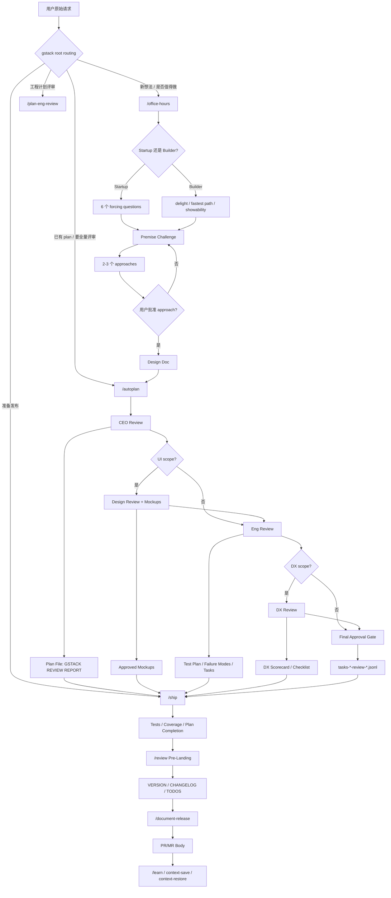

# 资料：gstack 的意图识别、意图整理与文档生成机制

> 资料用途：帮助理解 [garrytan/gstack](https://github.com/garrytan/gstack) 如何把“我想做一个东西”的自然语言请求，路由到产品诊断、设计文档、计划评审、任务拆分、发布门控、文档同步和长期记忆。本文不是正式系列文章，而是用于理解、对比和后续写作的研究笔记。
>
> 资料读取于：2026-05-17  
> 资料版本：`garrytan/gstack` main 分支，commit `33cb4715ef0bc9be31a29bdf1d9655482a617ee6`  
> 主要来源：`README.md`、`AGENTS.md`、`SKILL.md`、`office-hours/SKILL.md`、`autoplan/SKILL.md`、`plan-ceo-review/SKILL.md`、`plan-eng-review/SKILL.md`、`plan-design-review/SKILL.md`、`plan-devex-review/SKILL.md`、`review/SKILL.md`、`ship/SKILL.md`、`document-release/SKILL.md`、`document-generate/SKILL.md`、`learn/SKILL.md`、`context-save/SKILL.md`、`context-restore/SKILL.md`

---

## 1. 快速结论

`gstack` 的自我定位是一个“open source software factory”。它不是把 Agent 提示词拆成几个快捷命令，而是把一个软件团队的职责压缩成一组 slash command：CEO、工程经理、设计师、DX lead、Reviewer、QA、Release engineer、Technical writer、Memory manager。

对“意图识别、意图整理、文档生成”最相关的主链路是：

```text
gstack root routing
  -> /office-hours
  -> /plan-ceo-review 或 /autoplan
  -> /plan-eng-review
  -> /plan-design-review 和 /plan-devex-review
  -> implementation
  -> /review
  -> /ship
  -> /document-release
  -> /learn /context-save /context-restore
```

可以压缩成五个阶段：

| 阶段 | Skill / 文件 | 作用 |
| --- | --- | --- |
| Meta 路由 | `SKILL.md` | 根据用户自然语言主动调用合适 skill，而不是临场回答 |
| 意图抽取 | `office-hours` | 用 startup / builder 两种模式，把模糊想法压成 problem、premise、approach、success criteria |
| 文档沉淀 | `office-hours` | 写入 per-project design doc，供后续 review skill 自动读取 |
| 计划评审 | `plan-ceo-review`、`plan-eng-review`、`plan-design-review`、`plan-devex-review`、`autoplan` | 从战略、工程、设计、开发者体验四个角度把计划补到可执行状态 |
| 执行门控 | `review`、`ship`、`document-release` | shipping 前做 completion audit、pre-landing review、test gate、PR body、docs sync |
| 长期记忆 | `learn`、`context-save`、`context-restore` | 把项目经验、会话状态和剩余工作写入 `~/.gstack/` |

gstack 最有辨识度的地方有三点：

1. **主动路由**：`PROACTIVE=true` 时，只要用户请求匹配某个 skill，就应该调用 skill，不直接即兴回答。
2. **文档是状态机节点**：`/office-hours` 产出 design doc；计划 review 把 `## GSTACK REVIEW REPORT` 写到 plan 文件末尾；各 review 写 JSONL task artifact；`/ship` 读取这些状态决定能否推进。
3. **人类审批只留给真正需要判断的地方**：中间的大量机械选择可以自动做，但 premise、scope change、taste decision、user challenge、version bump、风险性文档变更等必须通过 AskUserQuestion。

---

## 2. 框架意图：为什么需要 gstack

gstack 瞄准的是 AI 编程中的“高速但无组织”问题：Agent 很会写代码，但常常不知道什么时候该停、该问、该写成文档、该请不同视角复审、该把信息保存到哪里。

它的解决方式不是让 Agent “更谨慎一点”，而是把软件生产流程物理化：

| 失败模式 | 典型表现 | gstack 的处理方式 |
| --- | --- | --- |
| 功能请求被误解 | 用户说“daily briefing app”，Agent 直接写日历摘要页面 | `/office-hours` 强制先追问痛点、状态 quo、最窄 wedge 和 future-fit |
| 计划缺少战略判断 | plan 只写实现步骤，没有判断是否值得做 | `/plan-ceo-review` 用四种 scope mode 挑战问题、范围和 6 个月后是否后悔 |
| 工程计划不可落地 | plan 没有 data flow、edge case、test plan、failure modes | `/plan-eng-review` 强制架构、测试、性能、并行 worktree、failure registry |
| UI 决策空泛 | plan 写“clean modern UI”，实现时变成模板感页面 | `/plan-design-review` 要求 mockup、7 个设计维度、AI slop 检测和 approved mockups |
| DX 被当作事后文档 | 开发者工具没有 hello world、错误信息和升级路径 | `/plan-devex-review` 先做 persona、TTHW、benchmark、magical moment，再评分 |
| Review 只看语法 | CI 过了但生产里有 race、scope creep、plan item 漏做 | `/review` 对 diff 做 scope drift、plan completion audit、adversarial review 和 fix-first |
| 发布没有证据 | 测试没跑、docs 没同步、PR body 用旧状态 | `/ship` 串起 merge base、test、coverage、plan audit、review、changelog、PR |
| 知识不沉淀 | 下一次会话又重新踩坑 | `/learn`、`/context-save`、`/context-restore` 把项目经验和会话状态落到 `~/.gstack/` |

gstack 的底层实现理念可以概括为：

- **角色拆分替代万能 Agent**：不同 skill 使用不同“职责视角”，例如 CEO 负责战略，Eng manager 负责执行结构，Designer 负责视觉和交互，DX lead 负责开发者采用路径。
- **文档替代聊天上下文**：design doc、plan file、review report、task JSONL、checkpoints、learnings 都是跨会话的状态承载。
- **门控替代自律**：不是建议模型“最好问一下”，而是在 STOP 点要求必须 AskUserQuestion，不能继续。
- **完整性优先**：gstack 多处强调 AI 让完整性的边际成本下降，所以倾向于“boil the lake”：覆盖 blast radius、edge case、test、docs，而不是用人类工时时代的捷径思维。

---

## 3. 相关 Skill / Command 总览

本文不完整覆盖 gstack 的所有 skill。gstack README 中列出 20 多个 specialist 和 power tool；本文只选择与“意图识别、意图整理、计划评审、文档生成、完成门控、记忆交接”直接相关的核心 skill。

| Role | Source file | Why it matters |
| --- | --- | --- |
| Meta/router | `SKILL.md` | 会话级路由、主动 skill suggestion、AskUserQuestion 格式、状态/遥测/记忆装载 |
| Intent extraction | `office-hours/SKILL.md` | 把原始想法拆成 startup / builder 模式下的真实目标 |
| Idea refinement | `office-hours/SKILL.md` | 强制 premise challenge、方案对比、可选 mockup 和 user approval |
| Spec/PRD | `office-hours/SKILL.md` | 写 per-project design doc，作为后续 plan review 的源材料 |
| Planning | `plan-ceo-review`、`plan-eng-review`、`plan-design-review`、`plan-devex-review` | 把 design / plan 补成可执行、可评审、可测试的工程计划 |
| Review pipeline | `autoplan/SKILL.md` | 自动串行执行 CEO -> Design -> Eng -> DX，并记录决策审计 |
| Verification/gates | `review/SKILL.md`、`ship/SKILL.md` | shipping 前检查 plan completion、scope drift、diff bug、test、coverage、PR body |
| Documentation | `document-release/SKILL.md`、`document-generate/SKILL.md` | 前者同步已发代码的文档，后者按 Diataxis 从零生成缺失文档 |
| Memory/handoff | `learn/SKILL.md`、`context-save/SKILL.md`、`context-restore/SKILL.md` | 管理项目 learnings 和跨会话工作上下文 |

### 3.1 `gstack` 根路由层介绍

**中文译解**：`SKILL.md` 是 gstack 的元层。它包含自动更新检查、session 状态、proactive 配置、telemetry、gbrain / artifact sync、AskUserQuestion 格式、skill routing，以及 `/browse` 的 browser command reference。本文只分析其中与意图路由和状态门控相关的部分。

| 项目 | 内容 |
| --- | --- |
| 触发条件 | 会话加载 gstack、用户请求匹配某个 gstack skill、需要决定是否主动路由时触发。若 `PROACTIVE=false`，只能响应显式调用，不主动建议。 |
| 流程 | 运行 preamble，读取配置与状态；根据自然语言路由表选择 skill；若首次启用，询问 telemetry、proactive、routing injection；加载 learnings、artifacts 和 gbrain 状态；后续 skill 完成后记录 timeline/analytics。 |
| 结束条件 | 已根据请求调用正确 skill，或在 `PROACTIVE=false` 下只提示用户是否需要；没有在存在专用 workflow 时直接 ad-hoc 回答。 |
| 相关文档 | 可能写入或更新 `CLAUDE.md` 的 `## Skill routing` 段；读取/写入 `~/.gstack/analytics/`、`~/.gstack/sessions/`、项目 learnings、artifact sync 配置。 |

### 3.2 `office-hours` 介绍

**中文译解**：这是 gstack 的意图抽取入口。它借用 YC Office Hours 的问法，把“我想做 X”改写成可验证的需求：到底是谁痛、现在怎么解决、最窄可付费 wedge 是什么、世界变化后它会更重要还是更不重要。

| 项目 | 内容 |
| --- | --- |
| 触发条件 | 用户说“brainstorm this”“I have an idea”“is this worth building”“help me think through this”，或任何还没写代码的新产品/功能想法。建议先于 `/plan-ceo-review` 和 `/plan-eng-review` 使用。 |
| 流程 | 读项目上下文和既有 design docs；询问用户目标并映射 startup / builder 模式；startup 模式按阶段问 6 个 forcing questions；builder 模式问 delight、showability、fastest path；随后做 related design discovery、landscape awareness、premise challenge、2-3 个 alternatives、approval gate、写 design doc、spec review loop、handoff。 |
| 结束条件 | 用户批准一个 approach；design doc 已保存；若 review loop 可用，文档已经过最多 3 轮 adversarial review；用户选择 Approve 后，状态可交给 `/plan-ceo-review`、`/plan-eng-review` 或 `/plan-design-review`。如果用户取消或无法批准，不能进入实现。 |
| 相关文档 | 写 `~/.gstack/projects/{SLUG}/{user}-{branch}-design-{YYYYMMDD-HHMMSS}.md`；可能写 `~/.gstack/builder-profile.jsonl`；可能写 `~/.gstack/analytics/spec-review.jsonl` 和 eureka / learnings。 |

### 3.3 `autoplan` 介绍

**中文译解**：这是 gstack 的自动评审流水线。它不是把四个 review 简化成总结，而是读取各 review skill 文件，并按 CEO -> Design -> Eng -> DX 顺序全深度执行，只把 premise、taste decision 和 user challenge 留给人类。

| 项目 | 内容 |
| --- | --- |
| 触发条件 | 用户要求“auto review”“autoplan”“run all reviews”“review this plan automatically”“make the decisions for me”，或已经有 plan file 且想减少中间 15-30 个问题。 |
| 流程 | 保存 restore point；读取上下文并检测 UI/DX scope；加载各 review skill；按 6 条决策原则 auto-decide 中间选择；CEO 阶段仍要求 premise gate；每个阶段写 plan outputs 和 task JSONL；最后聚合 implementation tasks，展示 final approval gate。 |
| 结束条件 | Final Approval Gate 展示完成；用户选择 approve / override / challenge response / interrogate / revise / reject；批准后写 review logs 并建议 `/ship`。User Challenge 不自动决定。 |
| 相关文档 | 写 `{branch}-autoplan-restore-{timestamp}.md`；向 plan file 追加 `Decision Audit Trail` 和各阶段内容；读取/写入 `tasks-*-review-*.jsonl`；写 `gstack-review-log`。 |

### 3.4 `plan-ceo-review` 介绍

**中文译解**：这是战略和范围评审。它把计划拿到“CEO / founder mode”下审视：问题是否值得做、scope 是否太小或太大、是否应该扩张到 10-star product，哪些东西必须写进 `NOT in scope`。

| 项目 | 内容 |
| --- | --- |
| 触发条件 | 用户要求“think bigger”“expand scope”“strategy review”“rethink this plan”“is this ambitious enough”，或 plan 看起来缺少 scope / ambition 判断。 |
| 流程 | 先跑 system audit、design doc / handoff note 检查；缺 design doc 时可先运行 `/office-hours`；执行 premise challenge、existing code leverage、dream state、implementation alternatives、mode selection；按 11 个 section 审查架构、错误、security、data/UX、quality、test、perf、observability、deploy、long-term、design；输出 diagrams、registries、TODOs、task JSONL、review report。 |
| 结束条件 | Scope mode 已确定；每个有 finding 的 section 都通过 AskUserQuestion 决策；plan file 末尾是新的 `## GSTACK REVIEW REPORT`；review log 已写；next-step review chain 已给出。 |
| 相关文档 | 可写 `~/.gstack/projects/{SLUG}/ceo-plans/*.md`；写 `tasks-ceo-review-*.jsonl`；更新 plan file 的 `## GSTACK REVIEW REPORT`；可能更新 `TODOS.md`；写 review log。 |

### 3.5 `plan-eng-review` 介绍

**中文译解**：这是工程执行计划评审。它的目标不是产品战略，而是确认架构、数据流、边界条件、测试和性能足够明确，工程师可以从 plan 直接开工。

| 项目 | 内容 |
| --- | --- |
| 触发条件 | 用户要求“review architecture”“engineering review”“lock in the plan”，或已有设计/计划，准备开始编码前。 |
| 流程 | 检查 design doc；无 design doc 时建议 `/office-hours`；Step 0 做 scope challenge、complexity check、distribution check 和 TODO cross-reference；然后依次做 architecture、code quality、test、performance review；生成 test plan artifact、failure modes、worktree parallelization strategy、implementation tasks、review dashboard 和 plan report。 |
| 结束条件 | 所有非平凡 finding 都经 AskUserQuestion 决策；test diagram 已产出；task JSONL 已写；review log 和 dashboard 已写；plan file 最后一个 `##` heading 是 `## GSTACK REVIEW REPORT`。 |
| 相关文档 | 写 `tasks-eng-review-*.jsonl`、test plan、plan file review report；可能更新 `TODOS.md`；写 `gstack-review-log`。 |

### 3.6 `plan-design-review` 介绍

**中文译解**：这是设计计划评审。它不审 live site，而是在实现前把 UI/UX 决策写进 plan，尤其避免“clean modern UI”这种无法实现的空话。

| 项目 | 内容 |
| --- | --- |
| 触发条件 | 用户要求“design plan review”“review ux plan”“check design decisions”，或 plan 有 UI/UX scope。若没有 UI scope，应退出。 |
| 流程 | 做 system audit、UI scope detection、DESIGN.md 检查；如果 design binary 可用，默认生成 mockups 并保存到 `~/.gstack/projects/{SLUG}/designs/`；再按 7 个 pass 评分并修 plan：信息架构、交互状态、用户旅程、AI slop、design system、responsive/accessibility、未决设计决策；最后写 approved mockups、task JSONL、review report。 |
| 结束条件 | 所有设计 decision 已解决或明确 deferred；必要 mockup 已批准并写入 plan；总体设计评分和每 pass 评分完成；plan report 是末尾 heading；低于 8/10 的项说明了未解决原因。 |
| 相关文档 | 写 `~/.gstack/projects/{SLUG}/designs/{screen}-{date}/` 下 PNG、HTML board、`approved.json`；写 plan 的 `Approved Mockups`；写 `tasks-design-review-*.jsonl` 和 review log。 |

### 3.7 `plan-devex-review` 介绍

**中文译解**：这是开发者体验计划评审。它把 DX 当成开发者产品的 UX：谁会来用、5 分钟内能否 hello world、错误时能不能自救、升级会不会害怕、文档能否在 2 分钟内找到。

| 项目 | 内容 |
| --- | --- |
| 触发条件 | 用户要求“DX review”“developer experience audit”“devex review”“API design review”，或 plan 涉及 API、CLI、SDK、library、platform、developer docs、Claude Code skill、MCP 等开发者-facing surface。 |
| 流程 | 自动识别 product type；询问或确认目标 developer persona；写 empathy narrative；做 competitive benchmark 和 TTHW target；设计 magical moment；trace developer journey；first-time roleplay；再按 8 个 pass 审：getting started、API/CLI/SDK、error/debug、docs、upgrade、tooling、community、measurement；输出 DX scorecard 和 checklist。 |
| 结束条件 | Persona、narrative、benchmark、magical moment、journey map、confusion report、scorecard、implementation checklist 已写；TTHW target 明确；每个低分项有决策或 TODO；plan report 在末尾。 |
| 相关文档 | 写 `tasks-devex-review-*.jsonl`；更新 plan 的 DX sections、scorecard、implementation checklist；可能更新 `TODOS.md`；写 review log。 |

### 3.8 `review` 介绍

**中文译解**：这是 shipping 前的 pre-landing diff review。它不是 plan review，而是看当前 branch 相对 base 的真实 diff，检查 scope drift、plan completion、结构性 bug、trust boundary、adversarial risk，并且优先自动修复机械问题。

| 项目 | 内容 |
| --- | --- |
| 触发条件 | 用户说“review this PR”“code review”“pre-landing review”“check my diff”，或准备 merge / land code。 |
| 流程 | 检查是否在 base branch；读取 diff；做 scope drift detection；发现 plan file 后抽取 actionable items 并按 DONE/PARTIAL/NOT DONE/CHANGED/UNVERIFIABLE 分类；读 checklist；做 critical pass；派 specialist 和 adversarial review；AUTO-FIX 直接改，ASK 批量询问；最后写 review result。 |
| 结束条件 | 没有 diff 时停止；有 diff 时，所有 AUTO-FIX 已完成，ASK 项经用户处理；critical / adversarial 结果已归并；review log 已持久化；不会 commit、push 或创建 PR。 |
| 相关文档 | 无固定文档；可能修改代码以修复 AUTO-FIX；写 `gstack-review-log`；可能写 learnings；输出 plan completion audit 和 adversarial synthesis。 |

### 3.9 `ship` 介绍

**中文译解**：这是 release engineer。它是非交互式为主的 shipping 管线，从 merge base、测试、coverage、plan audit、pre-landing review、version、changelog、TODO、commit、push、docs sync 到 PR/MR 创建。

| 项目 | 内容 |
| --- | --- |
| 触发条件 | 用户说“ship”“deploy”“push to main”“create a PR”“merge and push”“get it deployed”，或代码已准备好发布。 |
| 流程 | 检查 feature branch；读 review readiness；检查 distribution pipeline；merge base；必要时 bootstrap test framework；跑测试；coverage audit；plan completion audit；plan verification；scope drift；pre-landing review；version/changelog/TODOS；按 bisectable commits 提交；fresh verification gate；push；调用 `/document-release`；创建或更新 PR/MR；记录 ship metrics。 |
| 结束条件 | 如果在 base branch、merge conflict、in-branch test failure、ASK review item、coverage below threshold、plan item not done、verification failure 等 gate 触发则停止；正常结束时 PR/MR URL 已输出，metrics 已写。 |
| 相关文档 | 可能创建/更新 `TESTING.md`、`CLAUDE.md` testing section、CI workflow、`CHANGELOG.md`、`TODOS.md`、PR/MR body；写 `~/.gstack/projects/{SLUG}/{BRANCH}-reviews.jsonl`。 |

### 3.10 `document-release` 介绍

**中文译解**：这是 post-ship 文档同步。它读 diff 和现有文档，更新 README、ARCHITECTURE、CONTRIBUTING、CLAUDE.md、CHANGELOG、TODOS、VERSION 等，目标是让文档跟已经发出的代码一致。

| 项目 | 内容 |
| --- | --- |
| 触发条件 | 用户说“update docs”“sync documentation”“post-ship docs”，或 `/ship` Step 18 自动调用。 |
| 流程 | 检查 branch 和 diff；发现 docs；抽取 public surface；做 Diataxis coverage map；逐文件 audit；自动修事实性变更；风险性/叙事性变更询问用户；只 polish CHANGELOG，不重写；cross-doc consistency；TODO cleanup；VERSION bump 必须问；最后 commit/push 并更新 PR/MR body。 |
| 结束条件 | 没有文档变化时输出 up to date；有变化时按文件 staging、commit、push；PR/MR body 的 `## Documentation` section 已更新或失败已提示。 |
| 相关文档 | 修改 README、ARCHITECTURE、CONTRIBUTING、CLAUDE.md、其他 `.md`、CHANGELOG、TODOS、VERSION；PR/MR body 写 Documentation section 和 Documentation Debt。 |

### 3.11 `document-generate` 介绍

**中文译解**：这是从零生成缺失文档的 technical writer。它不根据 prompt 直接写，而是先做 codebase archaeology，再按 Diataxis 四象限决定需要 reference、how-to、tutorial、explanation 中哪些文档。

| 项目 | 内容 |
| --- | --- |
| 触发条件 | 用户说“write docs”“generate documentation”“document this feature”“create a tutorial”“write a how-to”“explain this module”，或 `/document-release` coverage map 发现文档缺口。 |
| 流程 | 确认文档范围和输出位置；读 README、架构文档、manifest、入口文件、实现、测试、相关模块；建立 concept map；决定 Diataxis quadrants；先写 reference，再写 explanation、how-to、tutorial；补 cross-links 和 sidebar；做质量自检；commit/push；更新 PR body。 |
| 结束条件 | 目标 public surface 被覆盖；示例可运行；reference 准确；how-to 有 verification；tutorial 在 3 步内有可见结果；新文档可从 README 或 docs index 访问。 |
| 相关文档 | 创建或更新 `docs/` 下 Markdown、README/CLAUDE/AGENTS/docs index/sidebar；PR body 增加 `## Documentation Generated`。 |

### 3.12 `learn` 介绍

**中文译解**：这是项目记忆管理器。gstack 的许多 workflow 在发现可复用 pattern、pitfall、preference、architecture insight 时会写 learnings；`/learn` 用于检索、导出和清理这些记忆。

| 项目 | 内容 |
| --- | --- |
| 触发条件 | 用户问“what have we learned”“show learnings”“prune stale learnings”“export learnings”，或想确认过去是否解决过类似问题。 |
| 流程 | 根据命令选择 show recent、search、prune、export、stats、manual add；读取 per-project learnings；prune 时检查文件是否还存在、是否有冲突；export 时格式化成 Markdown；manual add 时收集 type/key/insight/confidence/files。 |
| 结束条件 | 结果已展示、导出或更新；prune 的删除/保留/更新由用户选择；不会修改业务代码。 |
| 相关文档 | 读取/写入 `~/.gstack/projects/{SLUG}/learnings.jsonl`；可导出为 CLAUDE.md section 或独立 Markdown。 |

### 3.13 `context-save` 介绍

**中文译解**：这是会话快照。它把当前分支、git 状态、决策、剩余工作和注意事项写成 checkpoint，避免跨会话交接时丢失上下文。

| 项目 | 内容 |
| --- | --- |
| 触发条件 | 用户说“save progress”“save state”“save my work”“context save”，或需要暂停当前工作。 |
| 流程 | 解析 save / list；save 时采集 branch、status、diff stat、staged diff、recent log；用会话历史整理 summary、decisions、remaining work、notes；生成安全文件名；写 checkpoint；list 时按当前分支或 `--all` 展示。 |
| 结束条件 | checkpoint 文件已写入并输出 restore 指令；或 list 表已展示。该 skill 只读状态并写 checkpoint，不实现代码。 |
| 相关文档 | 写 `~/.gstack/projects/{SLUG}/checkpoints/{YYYYMMDD-HHMMSS}-{title}.md`，含 frontmatter、Summary、Decisions Made、Remaining Work、Notes。 |

### 3.14 `context-restore` 介绍

**中文译解**：这是会话恢复。它从所有 branch 的 checkpoint 中找最近或匹配的保存点，展示 summary 和 remaining work，帮助 Agent 接续上次工作。

| 项目 | 内容 |
| --- | --- |
| 触发条件 | 用户说“resume”“restore context”“where was I”“pick up where I left off”“context restore”。 |
| 流程 | 搜索 `checkpoints/` 下最近 20 个 `.md`，默认不按当前分支过滤；用户指定 fragment/number 时匹配指定文件；读取 frontmatter 和正文；展示 resume summary；若 branch 不同，提示切换；询问是否继续、显示全文或仅查看。 |
| 结束条件 | 用户已看到保存上下文和剩余工作；若选择继续，给出第一个 next item；不修改代码。 |
| 相关文档 | 读取 `~/.gstack/projects/{SLUG}/checkpoints/*.md`；不写业务文件。 |

---

## 4. 意图识别与路由机制

gstack 的路由机制不是“用户显式输入 slash command 才生效”。根 `SKILL.md` 在 `PROACTIVE=true` 时要求：

```text
如果用户请求匹配某个 skill 的目的，就调用该 skill。
不要在存在专用 workflow 时直接回答。
```

它的路由表直接把自然语言映射到 workflow：

| 用户意图 | 路由 |
| --- | --- |
| 新想法、是否值得做、brainstorm | `/office-hours` |
| 战略、范围、ambition | `/plan-ceo-review` |
| 架构、工程计划、lock in plan | `/plan-eng-review` |
| 设计系统、品牌、视觉身份 | `/design-consultation` 或 `/plan-design-review` |
| 全量自动评审 | `/autoplan` |
| bug / broken behavior | `/investigate` |
| QA / staging test | `/qa` 或 `/qa-only` |
| code review / diff check | `/review` |
| ship / deploy / PR | `/ship` |
| 更新文档 | `/document-release` 或 `/document-generate` |
| 保存/恢复上下文 | `/context-save` / `/context-restore` |
| 查看历史经验 | `/learn` |

这个路由层同时处理几个工程问题：

1. **防止 Agent 走捷径**：当任务有专用 workflow 时，直接回答被视为低质量路径。
2. **让 slash command 变成自然语言可触发**：用户可以说“review everything”而不必记住 `/autoplan`。
3. **把 session 状态带入每个 skill**：preamble 读取分支、session、telemetry、learnings、gbrain、artifact sync 状态，让每个 skill 不从零开始。
4. **允许用户关闭主动性**：`PROACTIVE=false` 时，gstack 不主动调用或建议 skill，只响应显式调用。

值得注意的是，gstack 的路由不是 LLM 自由判断，而是写在 root skill 的硬规则中。它甚至倾向于“false positive 比 false negative 便宜”：多调用一个结构化 workflow，比错过 workflow 后 ad-hoc 处理更可接受。

---

## 5. 意图抽取 / 澄清机制

`/office-hours` 是意图抽取的核心。它先不问“你要我写什么代码”，而是问“你到底为什么要做这个”。

它有两种模式：

| 模式 | 适用场景 | 提问目标 |
| --- | --- | --- |
| Startup mode | startup / intrapreneurship | 验证 demand、status quo、specific user、narrow wedge、observed surprise、future-fit |
| Builder mode | hackathon / open source / learning / fun | 找到最有趣、最快可展示、最能让人说“whoa”的版本 |

Startup mode 的 6 个 forcing questions 是意图抽取的骨架：

| 问题 | 目的 | 红旗 |
| --- | --- | --- |
| Demand Reality | 有没有真实行为证明需求，而不是兴趣 | waitlist、VC 兴奋、别人说 interesting |
| Status Quo | 用户现在怎么解决，代价是什么 | “没有现有解决方案，所以机会很大” |
| Desperate Specificity | 谁最需要，名字/角色/后果是什么 | 只说企业、SMB、开发者等类别 |
| Narrowest Wedge | 最小可付费版本是什么 | 必须先做完整平台 |
| Observation & Surprise | 有没有看真实用户使用，有没有意外 | 只做 survey / demo call |
| Future-Fit | 3 年后更必要还是更不必要 | 只说市场增长、AI 变强 |

这个机制的关键不是问得多，而是“每个问题都 push 到具体”。gstack 明确要求一问一答，不能批量问。第一轮答案通常是包装后的答案，真实意图往往在第二次追问后出现。

意图抽取结束后，`/office-hours` 不直接写实现计划，而是进入 premise challenge 和 alternatives：

```text
用户原始想法
  -> 目标模式和产品阶段
  -> forcing questions / builder questions
  -> landscape awareness
  -> premise challenge
  -> 2-3 个 approaches
  -> 用户批准 approach
  -> design doc
```

---

## 6. 意图发散与收敛机制

gstack 的发散不是开放式头脑风暴，而是受门控的结构化发散：

1. **先拆 premise**：问题是否正确？如果什么都不做会怎样？现有代码能复用什么？如果交付物是 CLI / package / binary，怎么分发？
2. **再给 alternatives**：至少 2 个方案，通常包括 minimal viable、ideal architecture、creative/lateral。
3. **用 recommendation 收敛**：Agent 可以推荐一个方案，但必须通过 AskUserQuestion 等用户批准。
4. **批准后才写文档**：推荐写在聊天里不算完成，必须进入 design doc。

这套机制防止两个极端：

- 只收敛不发散：Agent 过早锁定用户说出的第一个方案。
- 只发散不落地：想法越来越多，但没有设计文档和后续 review 接口。

在设计相关场景，gstack 还会把发散变成视觉产物：`/office-hours` 和 `/plan-design-review` 都可以生成 mockup variants 和 comparison board。这个设计理念是：UI 决策靠文字讨论很容易抽象化，mockup 会迫使“风格、布局、信息层级、状态”具体化。

---

## 7. Spec / PRD / 需求文档生成机制

gstack 的需求文档主要是 `/office-hours` 生成的 design doc。它不是传统 PRD，而是一个后续 skill 可读取的 per-feature 契约。

默认路径：

```text
~/.gstack/projects/{SLUG}/{user}-{branch}-design-{YYYYMMDD-HHMMSS}.md
```

Startup mode 模板包含：

| Section | 内容 |
| --- | --- |
| Problem Statement | 真正要解决的问题 |
| Demand Evidence | 具体行为、数字、付费或依赖证据 |
| Status Quo | 用户今天的替代流程和成本 |
| Target User & Narrowest Wedge | 具体用户和最小可付费版本 |
| Constraints | 约束 |
| Premises | 被用户确认过的前提 |
| Cross-Model Perspective | 可选二次意见 |
| Approaches Considered | 被比较过的方案 |
| Recommended Approach | 被批准的方案和理由 |
| Open Questions | 未决问题 |
| Success Criteria | 可衡量完成标准 |
| Distribution Plan | 如果交付物需要分发，写清渠道和 CI/CD |
| Dependencies | blockers 和相关 work |
| The Assignment | 下一步真实世界动作 |
| What I noticed about how you think | 对用户表达出的思考模式的观察 |

Builder mode 模板相近，但强调 `What Makes This Cool` 和 `Next Steps`。

gstack 对这个文档有一个重要的质量补丁：写完后可派独立 reviewer subagent 做 5 维审查：

1. Completeness
2. Consistency
3. Clarity
4. Scope
5. Feasibility

最多 3 轮修复。如果 reviewer 不可用，文档仍然可交付，但要明确说明“unreviewed doc”。这体现了 gstack 的工程取舍：adversarial review 是质量增强，不是阻止所有进展的绝对依赖。

---

## 8. Plan / Task / Issue 拆分机制

gstack 的计划拆分不是单独一个 `writing-plans` skill，而是由多个 review skill 对已有 plan 进行补全。

核心产物有三类：

### 8.1 Plan 文件中的结构化内容

各 plan review 都会把输出写回 plan file，尤其是末尾的：

```markdown
## GSTACK REVIEW REPORT

| Review | Trigger | Why | Runs | Status | Findings |
| --- | --- | --- | --- | --- | --- |
```

这是 gstack 的 plan 状态总览。多个 skill 都要求这个 section 必须是 plan file 的最后一个 `##` heading。这个规则解决一个非常现实的问题：review prose 写在正文里不代表计划处于可执行状态，只有结构化 report 才是后续 `/ship` 可消费的门控信号。

### 8.2 Implementation Tasks Markdown

`plan-ceo-review`、`plan-eng-review`、`plan-design-review`、`plan-devex-review` 都会在 review 末尾把 findings 转成可执行任务：

```markdown
## Implementation Tasks

- [ ] **T1 (P1, human: ~2h / CC: ~15min)** — <component> — <imperative title>
  - Surfaced by: <section name> — <specific finding>
  - Files: <paths>
  - Verify: <test command or manual check>
```

这类任务不是自由发挥，而是必须来源于 review finding。没有 finding 就不能硬凑任务。

### 8.3 JSONL 任务 artifact

每个 review 还会写一个 JSONL artifact，供 `/autoplan` 聚合：

```text
~/.gstack/projects/{SLUG}/tasks-ceo-review-{timestamp}.jsonl
~/.gstack/projects/{SLUG}/tasks-eng-review-{timestamp}.jsonl
~/.gstack/projects/{SLUG}/tasks-design-review-{timestamp}.jsonl
~/.gstack/projects/{SLUG}/tasks-devex-review-{timestamp}.jsonl
```

每行包含 phase、run_id、branch、commit、id、priority、component、files、effort、title、source_finding。

这就是 gstack 从“review 建议”变成“可执行任务”的接口层。

---

## 9. Documentation / ADR / Memory 机制

gstack 没有独立 ADR skill，但它有三层文档/记忆机制：

| 层级 | 机制 | 作用 |
| --- | --- | --- |
| Feature thinking | `/office-hours` design doc、CEO plan | 保存为什么做、做什么、不做什么、成功标准 |
| Plan/review state | `## GSTACK REVIEW REPORT`、task JSONL、review logs | 保存计划质量、风险、任务、是否可 ship |
| Project memory | `/learn`、`/context-save`、gbrain artifact sync | 保存跨会话经验、用户偏好、坑点和工作交接 |

文档生成方面，`/document-release` 和 `/document-generate` 分工非常清楚：

- `/document-release`：已经有代码 diff，负责同步和修正文档。
- `/document-generate`：发现缺文档或用户要求从零写文档，负责研究代码并按 Diataxis 生成完整文档。

`/document-release` 的 Diataxis coverage map 非常重要。它不直接生成所有缺失文档，而是把每个 public surface 标记为：

| Coverage | 问题 |
| --- | --- |
| Reference | 是什么、API、参数是否有记录 |
| How-to | 如何完成常见任务 |
| Tutorial | 新人能否从零走一遍 |
| Explanation | 为什么这样设计 |

它把文档债务写入 PR body，让“文档缺口”成为可见风险，而不是藏在口头提醒里。

---

## 10. 从意图到文档的完整流程



这张图里最关键的是：每个阶段都不是纯聊天状态。gstack 尽可能把状态写入文件或 JSONL：

- 真实意图写入 design doc。
- 计划质量写入 `GSTACK REVIEW REPORT`。
- 可执行任务写入 `tasks-*.jsonl`。
- 文档覆盖写入 PR body。
- 长期经验写入 learnings。
- 会话交接写入 checkpoints。

---

## 11. 相关 Skill 完整中文执行版

以下内容是按原文结构重建的中文执行规程，不是逐句直译。目标是保留影响正确使用的规则：触发、流程、停止点、交付物、红旗、验证清单。

### 11.1 `gstack` 根路由层完整中文执行版

#### 元信息

- 名称：`gstack`
- 定位：会话级 preamble、skill router、状态加载器、gstack browser reference。
- 本资料覆盖范围：只翻译路由、状态、AskUserQuestion、completion/status、artifact/memory 相关规则；完整 browser command reference 另见原仓库 `BROWSER.md` / root `SKILL.md`。

#### 概览

根层负责在每次 gstack 会话开始时建立运行环境：更新检查、session 标识、proactive 配置、分支、repo mode、telemetry、explain level、question tuning、learned patterns、gbrain/artifacts sync。随后根据用户请求选择合适 skill。

#### 触发条件

- 用户请求与 gstack 路由表中的 skill 匹配。
- 用户显式调用 `/office-hours`、`/review`、`/ship` 等 slash command。
- 项目 CLAUDE.md 中存在 gstack routing，要求加载 gstack。
- `PROACTIVE=true` 时，即使用户未写 slash command，也应主动调用匹配 skill。

不触发或受限：

- `PROACTIVE=false` 时，不主动建议或调用 skill。最多询问“是否要运行某 skill”。
- 如果当前为子 agent 且被父 agent 指定了任务，遵守子 agent 任务边界。

#### 流程

1. 运行 preamble：检查更新、记录 session、读取 branch、repo mode、telemetry、explain level、question tuning。
2. 读取或初始化本地状态：`~/.gstack/sessions/`、`~/.gstack/analytics/`、project learnings。
3. 处理首次配置门：telemetry、proactive suggestions、routing injection、artifact sync privacy。
4. 根据 routing rules 匹配用户意图。
5. 若存在专用 skill，调用该 skill，而不是直接 ad-hoc 答复。
6. 若没有专用 skill，按普通 Agent 能力完成用户请求。
7. skill 完成后按 `Completion Status Protocol` 报告 `DONE`、`DONE_WITH_CONCERNS`、`BLOCKED` 或 `ABORTED`，并记录 telemetry / timeline。

#### 输出 / 交付物

- 可能写入 `CLAUDE.md` 的 `## Skill routing`。
- 写入 `~/.gstack/sessions/` session marker。
- 写入 `~/.gstack/analytics/skill-usage.jsonl`。
- 读取/写入项目 learnings。
- 可能配置 artifact sync 或 gbrain 指引。

#### 与其他 Skill 的关系

根层是所有 skill 的上游。它决定是否调用 `/office-hours`、`/autoplan`、`/review`、`/ship` 等。每个子 skill 也会继承 preamble 中的 AskUserQuestion 格式、question tuning、telemetry、completion status 等约束。

#### 常见合理化与现实

- “用户只是问个简单问题”：若匹配专用 workflow，仍应调用 workflow。
- “先直接答一下”：这会跳过 gstack 的 checklists 和 gates。
- “我记得流程”：skill 文件是可执行指令，不是参考文档，应读取并按步骤执行。

#### 红旗

- 有专用 skill 却直接实现。
- 在 `PROACTIVE=true` 下不路由。
- 在 `PROACTIVE=false` 下主动跑 workflow。
- STOP 点之后继续执行。
- AskUserQuestion 工具不可用时仍用普通 prose 伪造决策。

#### 结束判断与验证

原文没有单独为 root router 列 completion checklist；以下是根据流程约束归纳的结束条件：

- [ ] 已读取当前配置和 branch / repo 状态。
- [ ] 若用户请求匹配 skill，已调用相应 skill。
- [ ] 若未调用，能说明没有匹配 workflow 或用户关闭 proactive。
- [ ] 没有绕过 STOP / AskUserQuestion gate。
- [ ] 若写入 routing、telemetry 或 artifact sync，状态已落盘。

### 11.2 `office-hours` 完整中文执行版

#### 元信息

- 名称：`office-hours`
- 译名：YC Office Hours / 产品意图诊断。
- 使用条件：brainstorm、idea、worth building、help me think through、office hours；新产品或新功能想法在写代码前优先使用。

#### 概览

`/office-hours` 把原始想法变成 design doc。它不写代码，不 scaffolding，不实现。它通过 startup / builder 两种模式，追问目标、用户、证据、替代方案、premise 和 alternatives，并在用户批准后写文档。

#### 触发条件

- 用户提出新产品、新功能、side project、hackathon idea、open-source idea。
- 用户问“这值得做吗”“帮我想清楚”“帮我 brainstorm”。
- 下游 review skill 发现缺 design doc，可建议先运行。

禁止使用或停止：

- 用户只是要求修一个明确 bug，通常应走 `/investigate` 或 `/review`。
- 用户已经有明确 plan，可以跳过部分提问，但仍要做 premise challenge 和 alternatives。
- 不得开始实现。

#### 流程

1. **Context Gathering**
   - 读取 `CLAUDE.md`、`TODOS.md`、最近 git log、diff stat、相关代码区域。
   - 列出已有 design docs。
   - 搜索 project learnings。
   - 询问用户目标：startup、intrapreneurship、hackathon/demo、open source/research、learning、fun。
   - Startup/intrapreneurship 还要判断阶段：pre-product、has users、has paying customers。

2. **Startup Mode**
   - 使用 6 个 forcing questions，并按产品阶段智能选择子集。
   - Q1 Demand Reality：真实需求证据。
   - Q2 Status Quo：现有替代流程和成本。
   - Q3 Desperate Specificity：具体人、title、后果。
   - Q4 Narrowest Wedge：本周可付费的最小版本。
   - Q5 Observation & Surprise：是否看过用户真实使用。
   - Q6 Future-Fit：3 年后更必要还是更不必要。
   - 每题一次只问一个问题，并 push 到具体、证据化、不舒服为止。

3. **Builder Mode**
   - 询问最 cool 的版本、会展示给谁、最快可分享路径、相近已有作品、无限时间的 10x 版本。
   - 目标是找到让人愿意展示的版本，而不是商业验证任务。

4. **Related Design Discovery / Landscape Awareness**
   - 查询相近设计、竞品、常见错误或当前 discourse。
   - 形成三层综合：已知常识、搜索结果、结合本次对话的特殊洞察。
   - 若出现真正洞察，记录 eureka。

5. **Premise Challenge**
   - 挑战问题 framing、do nothing、已有代码复用、分发渠道、startup mode 的需求证据。
   - 输出 PREMISES，让用户逐项同意或修改。

6. **Alternatives Generation**
   - 生成 2-3 个实现方案。
   - 至少包含 minimal viable 和 ideal architecture；可加 creative/lateral。
   - 给出 effort、risk、pros、cons、reuse。
   - 推荐一个方案，但必须 AskUserQuestion 获得批准。
   - STOP：用户未批准前不得写 design doc 或进入 handoff。

7. **可选视觉探索**
   - 如果 UI idea 且 designer 可用，生成 3 个 mockup variants。
   - 保存到 `~/.gstack/projects/{SLUG}/designs/mockup-{date}/`。
   - 通过 comparison board 收集反馈并保存 approved choice。

8. **Founder Signal Synthesis**
   - 统计 real problem、specific users、pushback、domain expertise、taste、agency 等信号。
   - 写入 builder profile。

9. **Design Doc**
   - 在 `~/.gstack/projects/{SLUG}/` 下写 design doc。
   - 如果有旧版本，写 `Supersedes:`。
   - Startup / Builder 使用不同模板。

10. **Spec Review Loop**
    - 派独立 reviewer subagent 审查 Completeness、Consistency、Clarity、Scope、Feasibility。
    - 最多 3 轮修复。
    - 如果 reviewer 不可用，标明 unreviewed。
    - 用户通过 AskUserQuestion 批准、要求修改或重来。

11. **Handoff**
    - 根据 builder profile 决定 closing path。
    - 推荐下一步：`/plan-ceo-review`、`/plan-eng-review`、`/plan-design-review`。
    - 记录 learnings。

#### 输出 / 交付物

- Design doc：`~/.gstack/projects/{SLUG}/{user}-{branch}-design-{timestamp}.md`
- 可选 mockups：`~/.gstack/projects/{SLUG}/designs/...`
- Builder profile：`~/.gstack/builder-profile.jsonl` 或 gstack state root 下 profile。
- Analytics：`~/.gstack/analytics/spec-review.jsonl`、eureka logs。
- Learnings：项目 `learnings.jsonl`。

#### 与其他 Skill 的关系

- 上游：gstack root routing。
- 下游：`/plan-ceo-review`、`/plan-eng-review`、`/plan-design-review`、`/autoplan`。
- 下游 skill 会自动发现并读取 design doc。

#### 常见合理化与现实

- “需求很明确”：仍要做 premise challenge，明确不等于正确。
- “先做 MVP 再说”：startup mode 会追问 wedge 是否真的有人本周付费。
- “用户说喜欢”：interest 不是 demand，行为和付费才是证据。
- “先写代码再补文档”：此 skill 的交付物就是文档，不能实现。

#### 红旗

- 一次问多个问题。
- 接受 category-level user，比如“SMB”“developers”。
- 没有用户批准 approach 就写 design doc。
- Design doc 没有 success criteria 或 distribution plan。
- Spec review 发现问题但没有修复或写 reviewer concerns。

#### 结束判断与验证

- [ ] 用户目标模式已确定。
- [ ] Startup / Builder 的关键问题已按需要完成。
- [ ] Premises 已经用户确认或修改。
- [ ] 至少 2 个 approaches 已提出并经用户选择。
- [ ] Design doc 已写入正确路径。
- [ ] 如 reviewer 可用，review loop 已完成或明确不可用。
- [ ] 用户已批准 design doc。
- [ ] 已给出下一步 skill 建议。
- [ ] 没有开始实现代码。

### 11.3 `autoplan` 完整中文执行版

#### 元信息

- 名称：`autoplan`
- 译名：自动计划评审流水线。
- 使用条件：自动运行全套 review、自动做中间决策、减少中间问题，但保留 final approval gate。

#### 概览

`/autoplan` 读取完整 CEO、Design、Eng、DX review skill，从磁盘加载后串行执行。它用 6 条原则替用户自动回答中间决策，但不自动决定 premise 和 user challenge。

#### 触发条件

- 用户说 auto review、autoplan、run all reviews、review this plan automatically、make the decisions for me。
- 已有 plan file，用户不想在每个 review 中回答大量中间问题。

#### 流程

1. **6 条自动决策原则**
   - 选择完整性。
   - Boil lakes：blast radius 内且小于 1 天 CC effort 的扩张可自动批准。
   - Pragmatic：同等效果选更干净方案。
   - DRY：重复功能拒绝，复用现有。
   - Explicit over clever。
   - Bias toward action。

2. **决策分类**
   - Mechanical：明显正确，静默自动决定。
   - Taste：合理人可不同意，自动推荐但 final gate 展示。
   - User Challenge：两个模型都建议改变用户原方向，不自动决定。

3. **Phase 0：Intake + Restore Point**
   - 保存 plan 原始状态到 restore file。
   - 在 plan file 前置 restore comment。
   - 读取 CLAUDE.md、TODOS.md、git log、diff stat、design docs。
   - 检测 UI scope 和 DX scope。
   - 加载各 review skill。
   - 跳过已由 autoplan 统一处理的通用 sections。

4. **Phase 1：CEO Review**
   - 按 `plan-ceo-review` 全深度执行。
   - Premise gate 是唯一不能 auto-decide 的中间门。
   - alternatives、scope expansion 等用原则自动决定；taste / user challenge 记录。
   - 运行 Claude subagent 和 Codex voice，生成 consensus table。

5. **Phase 2：Design Review**
   - 仅 UI scope 时运行。
   - 按 `plan-design-review` 全 7 维度执行。
   - 结构性问题自动修；审美/taste 记录为 taste decision。

6. **Phase 3：Eng Review**
   - 按 `plan-eng-review` 全深度执行。
   - 不能压缩 sections。
   - 运行 dual voices。

7. **Phase 3.5：DX Review**
   - 仅 developer-facing scope 时运行。
   - 按 `plan-devex-review` 全 8 维度执行。
   - 输出 persona、journey、scorecard、TTHW。

8. **Decision Audit Trail**
   - 每个自动决策都写入 plan file。
   - 不允许 silent auto-decision。

9. **Pre-Gate Verification**
   - 检查 required outputs 是否真的写入。
   - 聚合各 phase 的 `tasks-*.jsonl`。

10. **Final Approval Gate**
    - 展示 plan summary、decisions、user challenges、taste decisions、review scores、cross-phase themes、deferred items、implementation tasks。
    - 询问 approve / override / challenge response / interrogate / revise / reject。

11. **Completion**
    - 用户批准后写各 review log。
    - 建议 `/ship`。

#### 输出 / 交付物

- Restore file：`~/.gstack/projects/{SLUG}/{BRANCH}-autoplan-restore-{timestamp}.md`
- Plan file 中的 restore comment、Decision Audit Trail、各 phase output。
- `tasks-ceo-review-*.jsonl`、`tasks-design-review-*.jsonl`、`tasks-eng-review-*.jsonl`、`tasks-devex-review-*.jsonl`。
- Final Approval Gate 输出。
- Review logs。

#### 与其他 Skill 的关系

`/autoplan` 是 orchestrator。它调用 review skill 的方法论，但跳过通用 preamble、AskUserQuestion 格式、dashboard、outside voice 等重复部分。它不是替代 review skill，而是把它们串起来。

#### 常见合理化与现实

- “自动”不等于浅层总结。每个 section 都要 full depth。
- “Skipped” 只允许在 skip-listed 或无 scope 的条件下出现。
- User challenge 不是 taste decision，必须给用户决定。
- Artifact 没有写盘就不算完成。

#### 红旗

- 并行跑 CEO、Design、Eng、DX。原文要求严格串行。
- 把 review section 压缩成一行。
- 没有写 Decision Audit Trail。
- 未检查 plan file 输出就进入 final gate。
- 自动决定 premise 或 user challenge。

#### 结束判断与验证

- [ ] Restore point 已写。
- [ ] UI/DX scope 已检测。
- [ ] 需要运行的 review phases 已按顺序完成。
- [ ] 每个 phase 的 required outputs 已写入 plan。
- [ ] 每个 auto-decision 已有 audit row。
- [ ] Final Approval Gate 已展示。
- [ ] 用户已批准、覆盖、追问、修订或拒绝。
- [ ] 批准后 review logs 已写。

### 11.4 `plan-ceo-review` 完整中文执行版

#### 元信息

- 名称：`plan-ceo-review`
- 译名：CEO / Founder 模式计划评审。
- 使用条件：think bigger、expand scope、strategy review、rethink this plan、is this ambitious enough。

#### 概览

该 skill 审视计划是否解决了正确问题、scope 是否应该扩张或缩小、6 个月后会不会后悔。它不写代码，只修改/补充计划。

#### 触发条件

- 用户怀疑 scope、ambition、战略方向。
- plan 是重要产品变更、新 user-facing feature 或方向性选择。
- `/autoplan` Phase 1 自动调用。

#### 流程

1. **System Audit**
   - 运行 git log、diff stat、stash、TODO/FIXME、最近 touched files。
   - 读取 CLAUDE.md、TODOS.md、architecture docs。
   - 查找 design doc 和 handoff note。

2. **Prerequisite Offer**
   - 如果没有 design doc，询问是否先运行 `/office-hours`。
   - 用户拒绝时继续 standard review。
   - 如果 Step 0A 中发现用户仍在探索，也可再次建议 `/office-hours`。

3. **Step 0：Nuclear Scope Challenge + Mode Selection**
   - 0A Premise Challenge。
   - 0B Existing Code Leverage。
   - 0C Dream State Mapping。
   - 0C-bis Implementation Alternatives。
   - 0D Mode-specific analysis。
   - 0D-POST 在 Expansion / Selective Expansion 时写 CEO Plan。
   - 0E Temporal Interrogation。
   - 0F Mode Selection。

4. **四种 Mode**
   - SCOPE EXPANSION：推高 scope，寻找 10x。
   - SELECTIVE EXPANSION：保持 baseline，同时逐项展示扩张机会。
   - HOLD SCOPE：不扩不缩，做最严密的 review。
   - SCOPE REDUCTION：削到最小可行版本。

5. **Review Sections**
   - Architecture。
   - Error & Rescue Map。
   - Security & Threat Model。
   - Data Flow & Interaction Edge Cases。
   - Code Quality。
   - Tests。
   - Performance。
   - Observability & Debuggability。
   - Deployment & Rollout。
   - Long-Term Trajectory。
   - Design & UX，若有 UI scope。

6. **Outside Voice**
   - 可运行独立 Codex / Claude voice。
   - 整合时保留分歧。

7. **Required Outputs**
   - `NOT in scope`。
   - `What already exists`。
   - `Dream state delta`。
   - Error & Rescue Registry。
   - Failure Modes Registry。
   - TODOs。
   - Scope Expansion Decisions。
   - 多种 diagrams。
   - Stale Diagram Audit。

8. **Implementation Tasks**
   - 从 findings 生成 Markdown tasks。
   - 写 `tasks-ceo-review-*.jsonl`。

9. **Completion Summary / Review Report**
   - 填写 completion summary。
   - 清理 handoff note。
   - 生成并写入 plan file 末尾的 `## GSTACK REVIEW REPORT`。
   - 推荐下一步 review。

10. **docs/designs Promotion**
    - 在 Expansion / Selective Expansion 下，如果方向足够完整，可询问是否 promotion 到 repo docs。

#### 输出 / 交付物

- CEO plan：`~/.gstack/projects/{SLUG}/ceo-plans/*.md`。
- Plan file 中的 findings、registries、diagrams、completion summary、`GSTACK REVIEW REPORT`。
- `tasks-ceo-review-*.jsonl`。
- Review log。
- 可能更新 `TODOS.md`。

#### 与其他 Skill 的关系

- 上游可来自 `/office-hours` design doc。
- 下游通常是 `/plan-eng-review`，有 UI 则 `/plan-design-review`。
- `/autoplan` 会以 SELECTIVE EXPANSION 默认策略执行它。

#### 常见合理化与现实

- “这是工程计划，CEO review 不适用”：产品方向、scope 和未来债务仍然会影响工程。
- “发现明显扩张机会就直接加进 plan”：除 autoplan 自动原则覆盖的情况外，scope change 必须用户 opt-in。
- “body prose 已经写了 review”：不等于 `GSTACK REVIEW REPORT`。

#### 红旗

- 没有做 system audit。
- 没有读取 design doc。
- 没有根据 mode 执行。
- 跳过 Error/Rescue 或 Failure Modes。
- 没有写 diagrams。
- `GSTACK REVIEW REPORT` 不是 plan file 最后 heading。

#### 结束判断与验证

- [ ] Design doc / handoff note 检查完成。
- [ ] Mode 已由用户选择或 autoplan 明确指定。
- [ ] 11 个 sections 按适用范围完成。
- [ ] 每个 finding 都已被用户决策或记录为 unresolved。
- [ ] `NOT in scope`、`What already exists`、registries、diagrams、tasks 已写。
- [ ] `tasks-ceo-review-*.jsonl` 已写或空文件已 touch。
- [ ] Review log 已写。
- [ ] Plan file 最后 `##` heading 是 `## GSTACK REVIEW REPORT`。

### 11.5 `plan-eng-review` 完整中文执行版

#### 元信息

- 名称：`plan-eng-review`
- 译名：工程经理计划评审。
- 使用条件：review architecture、engineering review、lock in the plan。

#### 概览

该 skill 用工程视角把计划从“想法”压成“可实施工程设计”：组件边界、数据流、失败模式、测试、性能、并行实施路径。

#### 触发条件

- 有 plan 或 design doc，即将开始编码。
- 用户要求技术评审、架构评审、实现计划检查。
- `/autoplan` Phase 3 自动调用。

#### 流程

1. **Design Doc Check**
   - 查找 branch-specific 或项目级 design doc。
   - 有则读取，并把 problem/constraints/approach 当源信息。
   - 无则建议 `/office-hours`。

2. **Step 0：Scope Challenge**
   - 查已有代码是否能复用。
   - 找最小变更集。
   - 如果超过 8 个文件或 2 个新 class/service，作为 complexity smell。
   - 查新 artifact 是否有分发管线。
   - 查 TODOs 和 completeness。
   - 如果 complexity trigger，STOP 并 AskUserQuestion，不能继续。

3. **Review Sections**
   - Architecture review。
   - Code quality review。
   - Test review。
   - Performance review。
   - 每个 section 都不能跳过。没有问题也要说明检查了什么。

4. **Confidence Calibration**
   - 每个 finding 要有 1-10 confidence。
   - 3-4 分低置信通常放 appendix；1-2 分只有 P0 才报。

5. **Test Framework Detection / Test Plan Artifact**
   - 检测 runtime 和现有 test infrastructure。
   - 生成 affected pages/routes、key interactions、edge cases、critical paths。

6. **Outside Voice**
   - 可运行独立 challenge。

7. **Required outputs**
   - `NOT in scope`。
   - `What already exists`。
   - TODO updates。
   - Diagrams。
   - Failure modes。
   - Worktree parallelization strategy。

8. **Implementation Tasks**
   - 生成 Markdown tasks。
   - 写 `tasks-eng-review-*.jsonl`。

9. **Review Log / Dashboard / Plan Report**
   - 写 `gstack-review-log`。
   - 运行 `gstack-review-read`。
   - 生成 dashboard。
   - plan file 末尾写 `GSTACK REVIEW REPORT`。

#### 输出 / 交付物

- Plan file 中的 architecture/test/perf sections、test plan、diagrams、failure modes、parallelization strategy。
- `tasks-eng-review-*.jsonl`。
- Review log 和 Review Readiness Dashboard。
- 可选 `TODOS.md` 更新。

#### 与其他 Skill 的关系

- 上游：`/office-hours`、`/plan-ceo-review`、`/autoplan`。
- 下游：实现、`/review`、`/ship`。
- 与 `/plan-design-review` 和 `/plan-devex-review` 互补。

#### 常见合理化与现实

- “这是策略文档，不需要实现 section”：原文明确反对。实现细节是策略破裂处。
- “发现问题先写入 plan，之后再问”：有非平凡 finding 就必须 AskUserQuestion。
- “测试以后补”：test diagram 和 test plan 是 plan-stage 必需产物。

#### 红旗

- 跳过 Step 0。
- 没有 complexity gate。
- 没有 test diagram。
- 没有 confidence score。
- 没有写 task JSONL。
- 没有运行 review dashboard。

#### 结束判断与验证

- [ ] Design doc 检查完成或用户明确跳过。
- [ ] Step 0 结果已展示，复杂度 gate 已处理。
- [ ] 4 个 review sections 全部完成。
- [ ] 非平凡 finding 均经 AskUserQuestion。
- [ ] Test plan artifact 已写。
- [ ] Failure modes 和 diagrams 已写。
- [ ] `tasks-eng-review-*.jsonl` 已写。
- [ ] Review log 和 dashboard 已写。
- [ ] Plan file 末尾是 `## GSTACK REVIEW REPORT`。

### 11.6 `plan-design-review` 完整中文执行版

#### 元信息

- 名称：`plan-design-review`
- 译名：设计计划评审。
- 使用条件：design plan review、review ux plan、check design decisions。

#### 概览

该 skill 审查的是 plan，不是 live site。它要在代码实现前把视觉、交互、状态、响应式、可访问性、设计系统约束写进计划。

#### 触发条件

- plan 有 UI screen、component、interaction、frontend framework、design system。
- 用户要求设计 critique 或 plan-stage UX review。
- `/autoplan` 检测到 UI scope。

不触发：

- 纯 backend、API、infra plan。此时要退出，不强行 review。

#### 流程

1. **Pre-review System Audit**
   - 读取 git log、diff stat、plan file、CLAUDE.md、DESIGN.md、TODOS.md。
   - 检测 UI scope。
   - 查 prior design reviews。

2. **Design Setup**
   - 检查 gstack designer binary。
   - 检查 browse binary。
   - 如果 designer 可用，默认生成 mockups。
   - 设计 artifact 必须保存到 `~/.gstack/projects/{SLUG}/designs/`，不能放项目目录或 `/tmp`。

3. **Step 0：Design Scope Assessment**
   - 0A 给 plan 设计完整度 0-10。
   - 0B 检查 DESIGN.md。
   - 0C 找已有 UI patterns。
   - 0D 询问关注所有 7 维还是特定重点。STOP。

4. **Step 0.5：Visual Mockups**
   - UI scope + DESIGN_READY 时默认生成。
   - 每个 screen/section 生成 variants。
   - 通过 comparison board 获得反馈。
   - 保存 approved choice。

5. **Review Passes**
   - Pass 1 Information Architecture。
   - Pass 2 Interaction State Coverage。
   - Pass 3 User Journey & Emotional Arc。
   - Pass 4 AI Slop Risk。
   - Pass 5 Design System Alignment。
   - Pass 6 Responsive & Accessibility。
   - Pass 7 Unresolved Design Decisions。
   - 每个 issue 一次 AskUserQuestion，不批量。

6. **Post-Pass Mockup Update**
   - 如果 review 改动了重大设计决策，询问是否 regenerates mockup。

7. **Required Outputs**
   - `NOT in scope`。
   - `What already exists`。
   - TODO updates。
   - Implementation Tasks。
   - Approved Mockups。

8. **Review Log / Plan Report / Exit Gate**
   - 写 review log。
   - 写 plan file `GSTACK REVIEW REPORT`。
   - 确认 report 是最后 heading。

#### 输出 / 交付物

- Mockups、board、approved.json：`~/.gstack/projects/{SLUG}/designs/{screen}-{date}/`
- Plan file 的 design decisions、Approved Mockups、scorecard、tasks、report。
- `tasks-design-review-*.jsonl`。
- Review log。

#### 与其他 Skill 的关系

- 上游：`/office-hours`、`/autoplan`、已有 plan。
- 下游：实现、`/design-review` live audit、`/ship`。

#### 常见合理化与现实

- “文字描述够了”：设计 review 的原则是 mockups are the plan，能生成就生成。
- “clean modern UI”：不是设计决策，必须替换为字体、spacing、层级、状态等具体规范。
- “移动端就是堆叠”：响应式需要 intentional layout changes。

#### 红旗

- 有 UI scope 却不检查 DESIGN.md。
- Designer 可用却不生成 mockups，也未说明用户要求跳过。
- 使用 `/tmp` 或项目目录保存设计 artifact。
- 没有处理 empty/error/loading/mobile/a11y。
- Approved mockup 未写进 plan。

#### 结束判断与验证

- [ ] UI scope 已确认；无 UI scope 已优雅退出。
- [ ] DESIGN.md 状态和已有 UI pattern 已记录。
- [ ] 如 DESIGN_READY，mockups 已生成或有合法跳过理由。
- [ ] 7 个 pass 已评分并修正/决策。
- [ ] Approved Mockups 已写入 plan。
- [ ] Task Markdown 和 `tasks-design-review-*.jsonl` 已写。
- [ ] 总体设计 score 和 unresolved decisions 已列出。
- [ ] Plan report 是文件末尾 heading。

### 11.7 `plan-devex-review` 完整中文执行版

#### 元信息

- 名称：`plan-devex-review`
- 译名：开发者体验计划评审。
- 使用条件：DX review、developer experience audit、API design review、developer onboarding review。

#### 概览

该 skill 针对开发者-facing 产品。它不先评分，而是先调查 persona、真实 onboarding path、竞争 benchmark、magical moment、journey friction，再进入 8 个评分 pass。

#### 触发条件

- plan 涉及 API、CLI、SDK、library、platform、docs、Claude Code skill、MCP 或开发者工具。
- 用户要求 DX / DevEx / API design / onboarding review。
- `/autoplan` 检测 DX scope。

不触发：

- 没有开发者-facing surface。应建议 `/plan-eng-review` 或 `/plan-design-review`。

#### 流程

1. **Pre-review System Audit**
   - 读取 plan、CLAUDE.md、README、docs、package manifest、CHANGELOG。
   - 扫描 getting started、CLI help、error message、examples。
   - 查 design doc。

2. **Applicability Gate**
   - 自动识别 product type：API/Service、CLI、Library/SDK、Platform、Documentation、Claude Code Skill。
   - 若无匹配，退出。
   - 否则确认 primary type。

3. **Step 0：DX Investigation**
   - 0A Developer Persona Interrogation。STOP。
   - 0B Empathy Narrative。STOP。
   - 0C Competitive Benchmarking。STOP。
   - 0D Magical Moment Design。STOP。
   - 0E Mode Selection。
   - 0F Developer Journey Trace。
   - 0G First-Time Developer Roleplay。

4. **Review Passes**
   - Pass 1 Getting Started Experience。
   - Pass 2 API/CLI/SDK Design。
   - Pass 3 Error Messages & Debugging。
   - Pass 4 Documentation & Learning。
   - Pass 5 Upgrade & Migration Path。
   - Pass 6 Developer Environment & Tooling。
   - Pass 7 Community & Ecosystem。
   - Pass 8 DX Measurement & Feedback Loops。
   - Claude Code Skill 类型还要跑 Appendix checklist。

5. **Required Outputs**
   - Developer Persona Card。
   - Developer Empathy Narrative。
   - Competitive DX Benchmark。
   - Magical Moment Specification。
   - Developer Journey Map。
   - First-Time Developer Confusion Report。
   - `NOT in scope`、`What already exists`。
   - DX Scorecard。
   - DX Implementation Checklist。

6. **Implementation Tasks / Review Report**
   - 生成 tasks。
   - 写 `tasks-devex-review-*.jsonl`。
   - 写 review dashboard 和 plan report。

#### 输出 / 交付物

- Plan file 中的 DX persona、narrative、benchmark、journey、scorecard、checklist。
- `tasks-devex-review-*.jsonl`。
- Review log。
- 可选 TODO updates。

#### 与其他 Skill 的关系

- 上游：`/office-hours` design doc、`/autoplan`。
- 下游：实现、`/devex-review` live audit、`/document-generate`。

#### 常见合理化与现实

- “Docs 写完就算 DX”：DX 包含 hello world、错误、升级、工具链、community、measurement。
- “Persona 很明显”：不同 developer 对 setup 和 error tolerance 完全不同，必须确认。
- “Hello world 是 toy”：gstack 要求简单路径仍然 production-ready。

#### 红旗

- 无 developer-facing surface 还强行 review。
- 没有 persona 就评分。
- TTHW 不估算。
- Error message 只写“failed”没有 problem/cause/fix/docs link。
- 没有 DX Implementation Checklist。

#### 结束判断与验证

- [ ] Product type 已识别。
- [ ] Persona 已确认。
- [ ] Empathy narrative 已经用户确认或修正。
- [ ] Benchmark 和 TTHW target 已设定。
- [ ] Magical moment 已定义。
- [ ] Journey map 和 confusion report 已写。
- [ ] 8 个 pass 完成评分和决策。
- [ ] DX Scorecard 和 Checklist 已写。
- [ ] `tasks-devex-review-*.jsonl` 已写。
- [ ] Plan report 是文件末尾 heading。

### 11.8 `review` 完整中文执行版

#### 元信息

- 名称：`review`
- 译名：Pre-landing PR / diff review。
- 使用条件：review this PR、code review、pre-landing review、check my diff。

#### 概览

该 skill 审真实 diff，不审想象中的 plan。它找 tests 难以覆盖的结构性风险，并且 fix-first：能自动修的直接修，需要判断的再问用户。

#### 触发条件

- 用户准备 merge、land、PR 前。
- 用户要求 code review 或 diff check。
- `/ship` Step 9 内部运行。

#### 流程

1. **Check Branch**
   - 如果在 base branch 或没有 diff，输出 nothing to review 并停止。

2. **Scope Drift Detection**
   - 读取 TODOS、PR body、commit messages。
   - 确定 stated intent。
   - 比较 diff stat 和 intent。
   - 标记 CLEAN、DRIFT DETECTED、REQUIREMENTS MISSING。

3. **Plan Completion Audit**
   - 通过上下文或文件搜索找到 plan file。
   - 抽取 actionable items。
   - 分类 verification mode：diff-verifiable、cross-repo、external-state、content-shape。
   - 输出 DONE/PARTIAL/NOT DONE/CHANGED/UNVERIFIABLE。
   - 高影响 NOT DONE 触发 AskUserQuestion。

4. **Read Checklist**
   - 读取 review checklist。
   - 运行 critical categories：SQL/data safety、race/concurrency、LLM trust boundary、shell injection、enum/value completeness 等。

5. **Confidence Calibration**
   - 每个 finding 有 severity 和 confidence。

6. **Review Army**
   - 根据 stack 和 scope 选择 specialist。
   - 并行派发 specialists。
   - 合并 findings。

7. **Fix-First Review**
   - 与历史 skipped finding 去重。
   - 分类 AUTO-FIX / ASK。
   - AUTO-FIX 直接修改并输出一行说明。
   - ASK 批量或逐项 AskUserQuestion。
   - 用户批准后应用。

8. **Documentation Staleness / TODO Cross-reference**
   - 检查 README、ARCHITECTURE、CONTRIBUTING、CLAUDE 等是否过时。
   - 建议 `/document-release`。

9. **Adversarial Review**
   - Claude adversarial subagent always-on。
   - Codex adversarial 可用时运行。
   - 大 diff 运行 Codex structured review，发现 P1 时 gate fail。
   - 输出 cross-model synthesis。

10. **Persist**
    - 写 review result。
    - 捕获 learnings。

#### 输出 / 交付物

- Scope Check。
- Plan Completion Audit。
- Review findings 和 auto-fix summary。
- Adversarial synthesis。
- 可能的代码修改。
- `gstack-review-log`。
- 可选 learnings。

#### 与其他 Skill 的关系

- 上游：实现完成、`/ship`。
- 下游：`/ship` push/PR 或用户继续修复。
- 与 `/plan-eng-review` 区别：一个审 plan，一个审 diff。

#### 常见合理化与现实

- “CI 已过，不需要 review”：此 skill 专门找 CI 不抓的结构风险。
- “只看 diff 就够”：enum/value completeness 需要读 diff 外代码。
- “这应该没问题”：必须 cite line 或标 unknown。

#### 红旗

- 在 base branch 继续 review。
- 没有读 full diff。
- 把 plan item 相关代码视为 deliverable，而未验证 deliverable 自身。
- 自动修 ASK item。
- 提交、push 或创建 PR。该 skill 不负责这些。

#### 结束判断与验证

- [ ] 已确认有 diff。
- [ ] Scope drift 已检查。
- [ ] 若有 plan file，completion audit 已完成。
- [ ] Critical checklist 已跑。
- [ ] AUTO-FIX 已应用，ASK 已问用户。
- [ ] Adversarial review 已运行或明确不可用。
- [ ] Review log 已写。
- [ ] 没有执行 commit / push / PR。

### 11.9 `ship` 完整中文执行版

#### 元信息

- 名称：`ship`
- 译名：全自动发布 / PR 工作流。
- 使用条件：ship、deploy、push to main、create PR、merge and push、get it deployed。

#### 概览

`/ship` 是 release engineer。用户说 ship 就表示要跑完整 checklist。默认非交互，除硬 gate 外不问确认。

#### 触发条件

- 用户说代码准备好发布。
- 用户要求 push、deploy、PR/MR。

#### 流程

1. **Pre-flight**
   - 不允许在 base/default branch ship。
   - `git status`，包含未提交变更。
   - 读 diff stat 和 commits。
   - 读 Review Readiness Dashboard。

2. **Distribution Pipeline Check**
   - 如果 diff 引入 CLI binary、library、package 等 standalone artifact，检查 release workflow。
   - 无 pipeline 时 AskUserQuestion。

3. **Merge Base**
   - fetch + merge base branch。
   - 简单冲突可尝试自动解决，复杂冲突停止。

4. **Test Framework Bootstrap**
   - 检测 runtime 和测试框架。
   - 如果没有测试框架，询问是否设置。
   - 可安装框架、写示例测试、CI、TESTING.md、CLAUDE.md testing section、commit。

5. **Run Tests**
   - 在 merged code 上运行测试。
   - in-branch failures 阻塞；pre-existing failures triage。

6. **Eval / Coverage / Test Audit**
   - 条件运行 eval suites。
   - 检查测试覆盖，必要时生成测试。
   - coverage below minimum 触发 hard gate。

7. **Plan Completion Audit**
   - 查 plan file。
   - 抽 plan items 并验证 DONE/PARTIAL/NOT DONE/CHANGED/UNVERIFIABLE。
   - NOT DONE 无 override 时阻塞。

8. **Plan Verification**
   - 检查 plan 中 verification section。
   - 有 dev server 时运行 `/qa-only` inline。
   - verification failure 阻塞。

9. **Pre-Landing Review**
   - 运行 review logic、design lite、specialists、Greptile、adversarial review。

10. **Version / CHANGELOG / TODOS**
    - PATCH/MICRO 可自动选；MINOR/MAJOR 需要问。
    - CHANGELOG 自动从 diff 和 commits 生成。
    - TODOs 自动标记完成，缺失/重组才问。

11. **Commit**
    - 连续 checkpoint 模式下 squash WIP commits。
    - 按 bisectable chunks 分组 commit。
    - 最终 metadata commit 包含 VERSION + CHANGELOG + TODOS。

12. **Verification Gate**
    - 推送前重新验证测试/构建。
    - 代码改过后不能用旧测试输出。

13. **Push**
    - 如果已推且本地等于远端，跳过 push。
    - 否则 push with upstream。

14. **Documentation Sync**
    - 以 subagent 运行 `/document-release`。
    - 收集 JSON 输出，用于 PR body。

15. **Create PR/MR**
    - 如果已有 PR/MR，更新 body 和 title。
    - title 必须以 `v{VERSION}` 开头。
    - PR body 包含 Summary、Test Coverage、Review、Design、Eval、Greptile、Scope Drift、Plan Completion、Verification、TODOs、Documentation、Test plan。

16. **Persist Metrics**
    - 写 coverage、plan completion、verification、version、branch 到 review JSONL。

#### 输出 / 交付物

- Git commits。
- VERSION / CHANGELOG / TODOS 更新。
- 可选 TESTING.md、CI workflow、CLAUDE.md testing section。
- PR/MR URL 和完整 body。
- Documentation section。
- `~/.gstack/projects/{SLUG}/{BRANCH}-reviews.jsonl`。

#### 与其他 Skill 的关系

- 读取 review logs 和 plan reports。
- 内部运行 `/review` 逻辑。
- Step 18 调用 `/document-release`。
- 其后可接 `/land-and-deploy` 或 `/canary`。

#### 常见合理化与现实

- “用户说 ship，先问能不能 push”：不需要。ship 是授权。
- “上次跑过测试”：代码变过必须重新跑。
- “PR 已存在，不用更新”：每次重新生成 body 和 title。
- “docs 可以之后补”：Step 18 会自动尝试文档同步。

#### 红旗

- 在 base branch ship。
- 跳过测试或 pre-landing review。
- force push。
- Stale verification。
- VERSION bump 不符合规则。
- PR title 不以 version 开头。
- `/document-release` 失败但不告知。

#### 结束判断与验证

- [ ] 当前不是 base/default branch。
- [ ] Base 已 merge 或确认 up to date。
- [ ] Tests 和 build 有新鲜输出。
- [ ] Coverage / plan completion / verification gate 已处理。
- [ ] Pre-landing review 已处理。
- [ ] Version / CHANGELOG / TODOs 已处理。
- [ ] Commits 已按逻辑分组。
- [ ] Push 完成或确认已 up to date。
- [ ] `/document-release` 已运行或失败已提示。
- [ ] PR/MR 已创建或更新，并输出 URL。
- [ ] Ship metrics 已写。

### 11.10 `document-release` 完整中文执行版

#### 元信息

- 名称：`document-release`
- 译名：发布后文档同步。
- 使用条件：update docs、sync documentation、post-ship docs；也由 `/ship` 自动调用。

#### 概览

它根据真实 diff 审计所有项目文档，让 README、ARCHITECTURE、CONTRIBUTING、CLAUDE.md、CHANGELOG、TODOS、VERSION 与已发代码保持一致。

#### 触发条件

- 代码已 commit / pushed / PR 即将创建或已存在。
- 用户要求更新文档。
- `/ship` Step 18。

#### 流程

1. **Pre-flight & Diff Analysis**
   - 不在 base branch 运行。
   - 读取 diff stat、commits、name-only。
   - 找所有 `.md` 文档。
   - 分类变化：new feature、changed behavior、removed functionality、infra。

2. **Coverage Map**
   - 提取 public surface：export、commands、flags、API endpoints、skills、env vars。
   - 对每个 entity 标记 Reference / How-to / Tutorial / Explanation coverage。
   - 标记 zero coverage 为 critical gap。
   - 检查 architecture diagram drift。

3. **Per-File Audit**
   - README：功能、安装、示例、troubleshooting。
   - ARCHITECTURE：diagram、component、why。
   - CONTRIBUTING：新贡献者 setup。
   - CLAUDE.md：项目结构、命令、脚本。
   - 其他 Markdown：按用途审。

4. **Apply Auto-Updates**
   - 事实性、明确来自 diff 的更新直接改。
   - 每个修改输出具体说明。

5. **Ask Risky Changes**
   - 叙事、哲学、安全模型、删除、大重写等必须 AskUserQuestion。

6. **CHANGELOG Voice Polish**
   - 只 polish，不重写、不删除、不重排。
   - 不用 Write 覆盖 CHANGELOG。
   - 用 sell test 检查：what changed、why care、how use。

7. **Cross-Doc Consistency**
   - README vs CLAUDE vs ARCHITECTURE vs CHANGELOG vs VERSION。
   - 检查 discoverability。

8. **TODOS Cleanup**
   - 标记完成项。
   - 相关 TODO 过期时询问。
   - 新 TODO/FIXME/HACK 是否写入 TODOS 需问。

9. **VERSION Bump Question**
   - VERSION 不存在则跳过。
   - 未 bump 时必须问。
   - 已 bump 时检查是否覆盖全部 scope。

10. **Commit & Output**
    - 只 stage 文档文件名。
    - commit + push。
    - 更新 PR/MR body 的 `## Documentation` section。
    - 同步 PR title version。
    - 输出 documentation health 和 coverage。

#### 输出 / 交付物

- 更新的文档文件。
- Coverage map。
- Documentation Debt。
- Documentation health summary。
- Docs commit。
- PR/MR body `## Documentation`。

#### 与其他 Skill 的关系

- 由 `/ship` 调用，也可独立运行。
- coverage gap 可引导 `/document-generate`。

#### 常见合理化与现实

- “顺手重写 CHANGELOG”：禁止。CHANGELOG entry 是 `/ship` 根据真实 diff 生成的 source of truth。
- “docs-only 不需要 version”：仍要按规则检查并询问。
- “coverage map 发现缺口就直接生成”：该 skill 只 flag，完整生成交给 `/document-generate`。

#### 红旗

- 用 Write 覆盖 CHANGELOG。
- 静默 bump VERSION。
- 删除 narrative section。
- 没有读完整文件就编辑。
- 文档改了但 PR body 未更新。

#### 结束判断与验证

- [ ] 已读取 diff 和所有 docs。
- [ ] Coverage map 已生成。
- [ ] Auto-update 和 risky changes 区分清楚。
- [ ] CHANGELOG 只做 polish。
- [ ] VERSION 规则已处理。
- [ ] 如有 docs change，commit/push 已完成。
- [ ] PR/MR body Documentation section 已更新或失败已报告。
- [ ] 输出 documentation health。

### 11.11 `document-generate` 完整中文执行版

#### 元信息

- 名称：`document-generate`
- 译名：Diataxis 文档生成器。
- 使用条件：write docs、generate documentation、document this feature、create tutorial、explain module。

#### 概览

它从代码研究开始，按 Diataxis 四象限生成缺失文档。重点是先理解完整 code surface，再写可验证、可链接、可维护的文档。

#### 触发条件

- 用户要求写某个 feature/module/project 的文档。
- `/document-release` coverage map 发现缺失。

#### 流程

1. **Step 0：Scope & Intent**
   - 确定目标：specific target、whole project、coverage gaps。
   - 询问输出：existing files、standalone docs、both。
   - 默认推荐 both。
   - 检测 docs framework 和格式。

2. **Step 1：Codebase Archaeology**
   - 遍历项目结构。
   - 读取 README、ARCHITECTURE、CONTRIBUTING、CLAUDE/AGENTS、manifest、entry files、config、examples。
   - 读取目标实现、测试、依赖和被依赖模块。
   - 建立 concept map：purpose、concepts、public surface、dependencies、dependents、edge cases、design decisions。

3. **Step 2：Diataxis Partitioning**
   - 判断每个 entity 是否需要 tutorial、how-to、reference、explanation。
   - 超过 5 个文档时询问确认。

4. **Step 3：Reference First**
   - 先写 reference，包含 API/interface、options、examples、related。
   - 每个类型、默认值、约束必须来自代码。

5. **Step 4：Explanation**
   - 解释问题、方法、trade-offs、alternatives。
   - 使用 ASCII / Mermaid diagrams。

6. **Step 5：How-To**
   - task-oriented。
   - 包含 prerequisites、steps、verification、troubleshooting。

7. **Step 6：Tutorial**
   - newcomer 从零到 working example。
   - 前 3 步内必须有可见结果。

8. **Step 7：Cross-links & Discoverability**
   - quadrants 之间互链。
   - README / CLAUDE / docs index / sidebar 添加入口。
   - 验证 2 clicks reachable。
   - 检查 broken links。

9. **Step 8：Quality Self-Review**
   - Accuracy gate。
   - Completeness gate。
   - Voice gate。

10. **Step 9：Commit & Output**
    - stage 文档文件名。
    - commit/push。
    - 如 PR 存在，更新 `## Documentation Generated`。
    - 输出文件数量、quadrant coverage、质量结果。

#### 输出 / 交付物

- 新增/更新 Markdown 文档。
- README / docs index / sidebar links。
- PR body `## Documentation Generated`。
- 文档生成 commit。

#### 与其他 Skill 的关系

- 可被 `/document-release` gaps 引导。
- 输出文档会被未来 `/document-release` 和 `/plan-devex-review` 读取。

#### 常见合理化与现实

- “先按印象写”：禁止，必须读代码和测试。
- “Reference 里解释 why”：Diataxis 要分离 reader mode。
- “示例大概能跑”：必须可复制运行或明确验证。

#### 红旗

- 没读实现和测试。
- Public surface 覆盖不完整。
- How-to 没 verification。
- Tutorial 三步内没有可见结果。
- 新文档不可从 README 或 docs index 访问。

#### 结束判断与验证

- [ ] Scope 已确认。
- [ ] Codebase archaeology 已完成。
- [ ] Diataxis partition plan 已写。
- [ ] Reference 覆盖 public surface。
- [ ] How-to 有 verification 和 troubleshooting。
- [ ] Tutorial 三步内有 working output。
- [ ] Explanation 写明 trade-offs。
- [ ] Cross-links 和 discoverability 已验证。
- [ ] Broken links 已检查。
- [ ] Commit/push 和 PR body 更新已完成或失败已报告。

### 11.12 `learn` 完整中文执行版

#### 元信息

- 名称：`learn`
- 译名：项目经验管理器。
- 使用条件：what have we learned、show learnings、prune stale learnings、export learnings。

#### 概览

`/learn` 管理 gstack 在项目中积累的 pattern、pitfall、preference、architecture、tool、operational insight。

#### 触发条件

- 用户询问过去经验。
- 用户要搜索、清理、导出、添加 learning。
- 其他 skill 发现可复用 insight 时记录。

#### 流程

1. **Detect command**
   - 无参数：show recent。
   - `search <query>`：搜索。
   - `prune`：检查 stale/conflict。
   - `export`：导出 Markdown。
   - `stats`：统计。
   - `add`：手动添加。

2. **Show recent**
   - 搜索最近 20 条，按 type 展示。

3. **Search**
   - 用 query 搜索 learnings。

4. **Prune**
   - 检查 referenced files 是否仍存在。
   - 检查同 key 冲突。
   - 逐项 AskUserQuestion：remove / keep / update。

5. **Export**
   - 生成 `## Project Learnings` Markdown，分 Patterns、Pitfalls、Preferences、Architecture。
   - 询问是否追加到 CLAUDE.md 或另存。

6. **Stats**
   - 统计 total、unique、by type、by source、avg confidence。

7. **Manual Add**
   - 收集 type、key、insight、confidence、files。
   - 调用 `gstack-learnings-log`。

#### 输出 / 交付物

- Learnings 查询结果。
- 更新后的 learnings JSONL。
- 可导出的 Markdown section。
- Stats table。

#### 与其他 Skill 的关系

`/office-hours`、`/review`、`/ship`、`/investigate` 等都可能写 learnings。`/learn` 是查看和维护接口。

#### 常见合理化与现实

- “所有观察都记录”：不。只记录未来能省 5 分钟以上的真实 insight。
- “旧 learning 永远可信”：prune 必须检查文件是否删除和冲突。

#### 红旗

- 把显而易见的信息写入 memory。
- 不带 confidence。
- 不标 source。
- referenced files 已删仍保留高置信 learning。

#### 结束判断与验证

- [ ] 命令类型已识别。
- [ ] 结果已展示或更新。
- [ ] prune 修改经过用户选择。
- [ ] export 格式可直接粘进项目文档。
- [ ] 没有修改业务代码。

### 11.13 `context-save` 完整中文执行版

#### 元信息

- 名称：`context-save`
- 译名：保存工作上下文。
- 使用条件：save progress、save state、save my work、context save。

#### 概览

它把当前工作状态写成 checkpoint，让未来会话或其他 workspace 能恢复上下文。

#### 触发条件

- 用户要暂停、保存进度、交接。
- 长任务中需要切换上下文。

#### 流程

1. **Detect command**
   - `/context-save` 或 `/context-save <title>`：保存。
   - `/context-save list`：列出。
   - `/context-save resume/restore`：提示使用 `/context-restore`。

2. **Save Step 1：Gather State**
   - 获取 SLUG。
   - 采集 branch、git status、diff stat、staged diff stat、recent log。

3. **Save Step 2：Summarize Context**
   - 结合 git state 和 conversation history，写：
     - working on
     - decisions made
     - remaining work
     - notes
   - title 来自用户或自动推断。

4. **Save Step 3：Compute Session Duration**
   - 尝试用 telemetry start 或 PPID 计算。

5. **Save Step 4：Write File**
   - Bash 侧 sanitize title。
   - 只保留 allowlist 字符。
   - collision-safe，不覆盖。
   - 写 frontmatter 和正文。

6. **List Flow**
   - 默认 current branch。
   - `--all` 展示所有 branches。
   - 从 frontmatter 读 status、branch、timestamp。

#### 输出 / 交付物

Checkpoint：

```text
~/.gstack/projects/{SLUG}/checkpoints/{YYYYMMDD-HHMMSS}-{title}.md
```

文件包含：

- status
- branch
- timestamp
- session_duration_s
- files_modified
- Summary
- Decisions Made
- Remaining Work
- Notes

#### 与其他 Skill 的关系

- 下游由 `/context-restore` 读取。
- 连续 checkpoint mode 的 WIP commits 也会被 `/ship` 处理。

#### 常见合理化与现实

- “只存聊天摘要”：不够，必须包括 git state 和剩余工作。
- “覆盖旧 checkpoint”：禁止，append-only。
- “标题直接拼 shell”：禁止，必须 Bash-side sanitize。

#### 红旗

- 修改业务代码。
- 忘记 branch frontmatter。
- 不列 modified files。
- overwriting existing checkpoint。
- list 默认跨所有 branch，原文默认只列当前 branch，除非 `--all`。

#### 结束判断与验证

- [ ] Git state 已采集。
- [ ] Summary、Decisions、Remaining Work、Notes 已写。
- [ ] 文件名已安全生成。
- [ ] Checkpoint 已写入 `checkpoints/`。
- [ ] 输出 restore 指令。
- [ ] 没有修改业务代码。

### 11.14 `context-restore` 完整中文执行版

#### 元信息

- 名称：`context-restore`
- 译名：恢复工作上下文。
- 使用条件：resume、restore context、where was I、pick up where I left off。

#### 概览

它读取 `/context-save` 生成的 checkpoint，默认跨所有 branch 找最近的保存点，并把摘要和剩余工作展示给用户。

#### 触发条件

- 用户要恢复上次工作。
- Conductor workspace handoff 或换机器/换会话。

#### 流程

1. **Detect command**
   - `/context-restore`：加载最近 checkpoint。
   - `/context-restore <fragment-or-number>`：加载指定 checkpoint。
   - `/context-restore list`：提示去 `/context-save list`。

2. **Find saved contexts**
   - 读取 `~/.gstack/projects/{SLUG}/checkpoints/`。
   - 按 filename `YYYYMMDD-HHMMSS` 倒序。
   - 取最近 20 个。
   - 默认跨所有 branch，不按当前 branch 过滤。

3. **Load file**
   - 用户指定时匹配 fragment 或 number。
   - 否则读取第一个，也就是最新。
   - 展示 title、branch、saved timestamp、duration、status、summary、remaining work、notes。

4. **Branch mismatch notice**
   - 如果 checkpoint branch 与当前 branch 不同，提醒用户可能需要切换。

5. **Offer next steps**
   - A Continue working。
   - B Show full saved file。
   - C Just needed context。

#### 输出 / 交付物

- Resume summary。
- Remaining work。
- Branch mismatch warning。
- Next step recommendation。

#### 与其他 Skill 的关系

- 读取 `/context-save` checkpoint。
- 用户选择继续后，后续应根据 remaining work 调用相应 skill 或执行任务。

#### 常见合理化与现实

- “只找当前 branch”：原文明确默认跨所有 branch，这是 handoff 的核心。
- “mtime 最新就是最新”：以文件名 timestamp 为准。
- “恢复后直接改代码”：该 skill 本身只读取并呈现上下文。

#### 红旗

- 修改代码。
- 按当前 branch 过滤导致找不到 handoff。
- 用 `ls -t` mtime 排序。
- 不提示 branch mismatch。

#### 结束判断与验证

- [ ] 找到 checkpoint 或明确无 saved contexts。
- [ ] 默认按文件名 timestamp 选最新。
- [ ] Summary 和 Remaining Work 已展示。
- [ ] Branch mismatch 已提示。
- [ ] 用户已选择继续、查看全文或结束。
- [ ] 没有修改代码。

---

## 12. 参考来源

资料基于以下一手来源读取：

- [garrytan/gstack README.md](https://github.com/garrytan/gstack/blob/33cb4715ef0bc9be31a29bdf1d9655482a617ee6/README.md)
- [garrytan/gstack AGENTS.md](https://github.com/garrytan/gstack/blob/33cb4715ef0bc9be31a29bdf1d9655482a617ee6/AGENTS.md)
- [garrytan/gstack root SKILL.md](https://github.com/garrytan/gstack/blob/33cb4715ef0bc9be31a29bdf1d9655482a617ee6/SKILL.md)
- [office-hours/SKILL.md](https://github.com/garrytan/gstack/blob/33cb4715ef0bc9be31a29bdf1d9655482a617ee6/office-hours/SKILL.md)
- [autoplan/SKILL.md](https://github.com/garrytan/gstack/blob/33cb4715ef0bc9be31a29bdf1d9655482a617ee6/autoplan/SKILL.md)
- [plan-ceo-review/SKILL.md](https://github.com/garrytan/gstack/blob/33cb4715ef0bc9be31a29bdf1d9655482a617ee6/plan-ceo-review/SKILL.md)
- [plan-eng-review/SKILL.md](https://github.com/garrytan/gstack/blob/33cb4715ef0bc9be31a29bdf1d9655482a617ee6/plan-eng-review/SKILL.md)
- [plan-design-review/SKILL.md](https://github.com/garrytan/gstack/blob/33cb4715ef0bc9be31a29bdf1d9655482a617ee6/plan-design-review/SKILL.md)
- [plan-devex-review/SKILL.md](https://github.com/garrytan/gstack/blob/33cb4715ef0bc9be31a29bdf1d9655482a617ee6/plan-devex-review/SKILL.md)
- [review/SKILL.md](https://github.com/garrytan/gstack/blob/33cb4715ef0bc9be31a29bdf1d9655482a617ee6/review/SKILL.md)
- [ship/SKILL.md](https://github.com/garrytan/gstack/blob/33cb4715ef0bc9be31a29bdf1d9655482a617ee6/ship/SKILL.md)
- [document-release/SKILL.md](https://github.com/garrytan/gstack/blob/33cb4715ef0bc9be31a29bdf1d9655482a617ee6/document-release/SKILL.md)
- [document-generate/SKILL.md](https://github.com/garrytan/gstack/blob/33cb4715ef0bc9be31a29bdf1d9655482a617ee6/document-generate/SKILL.md)
- [learn/SKILL.md](https://github.com/garrytan/gstack/blob/33cb4715ef0bc9be31a29bdf1d9655482a617ee6/learn/SKILL.md)
- [context-save/SKILL.md](https://github.com/garrytan/gstack/blob/33cb4715ef0bc9be31a29bdf1d9655482a617ee6/context-save/SKILL.md)
- [context-restore/SKILL.md](https://github.com/garrytan/gstack/blob/33cb4715ef0bc9be31a29bdf1d9655482a617ee6/context-restore/SKILL.md)

远程 main 分支在资料读取时对应 commit：`33cb4715ef0bc9be31a29bdf1d9655482a617ee6`。
