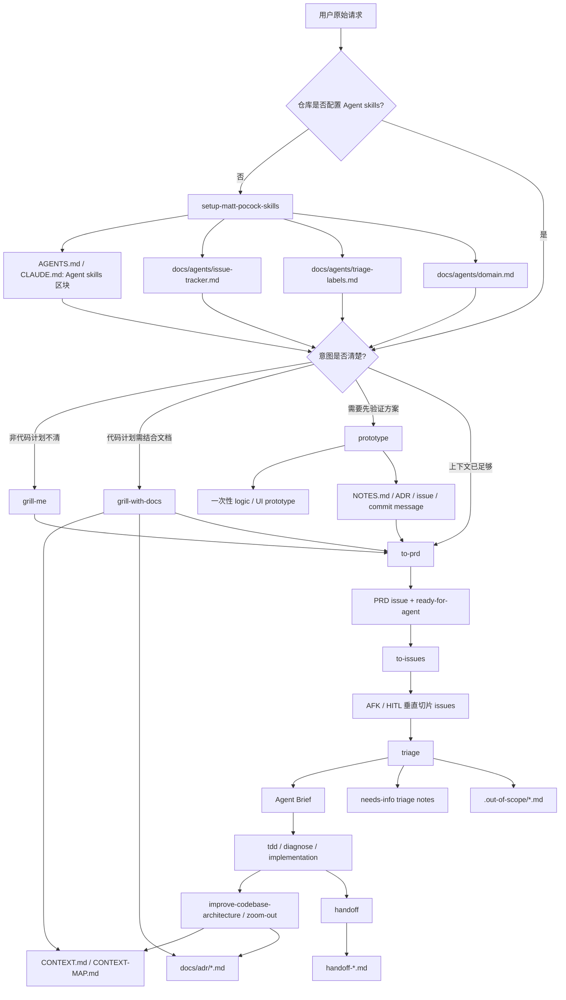

# 资料：mattpocock/skills 的意图识别、意图整理与文档生成机制

> 资料用途：帮助理解 [mattpocock/skills](https://github.com/mattpocock/skills) 如何把工程师的判断力封装成可调用的 Agent skill，并为后续系列文章、框架对比或团队落地提供一手资料型笔记。本文不是正式系列文章。
>
> 资料读取于：2026-05-18  
> 读取对象：`mattpocock/skills` main 分支，commit `67bce91c80cd1020a4f068ced32d0281656842ad`  
> 主要来源：`README.md`、`.claude-plugin/plugin.json`、`CLAUDE.md`、`CONTEXT.md`、`docs/adr/0001-explicit-setup-pointer-only-for-hard-dependencies.md`、`skills/engineering/*/SKILL.md`、`skills/productivity/*/SKILL.md`、`skills/misc/*/SKILL.md` 及其配套格式文档。

---

## 1. 快速结论

`mattpocock/skills` 不是一个接管研发全流程的 Agent 框架，而是一组小型、可组合、可改写的工程操作规程。它的 README 将自身定位为“real engineering”取向的 skill 集合，核心边界是：框架提供重复实践，工程师保留流程控制权。

当前插件清单注册了 14 个默认 skill：

| 类别 | Skill | 核心作用 |
| --- | --- | --- |
| Engineering | `setup-matt-pocock-skills` | 为仓库建立 issue tracker、triage labels、domain docs 三类配置 |
| Engineering | `grill-with-docs` | 在代码与领域文档约束下追问计划，更新 `CONTEXT.md` 和 ADR |
| Engineering | `to-prd` | 将当前会话上下文综合成 PRD，并发布到 issue tracker |
| Engineering | `to-issues` | 将计划、spec 或 PRD 拆成可独立领取的垂直切片 issue |
| Engineering | `triage` | 用 category role 与 state role 驱动 issue 状态机 |
| Engineering | `tdd` | 用 red-green-refactor 和垂直切片建立测试反馈 |
| Engineering | `diagnose` | 为复杂 bug 和性能回退建立可复现反馈环 |
| Engineering | `improve-codebase-architecture` | 寻找 shallow module 到 deep module 的重构机会 |
| Engineering | `zoom-out` | 要求 Agent 上升抽象层级，解释代码在系统中的位置 |
| Engineering | `prototype` | 用一次性原型验证状态模型、数据模型或 UI 方案 |
| Productivity | `grill-me` | 非代码场景下持续访谈，直到设计树分支被解析 |
| Productivity | `caveman` | 进入极简沟通模式，减少填充语和 token 消耗 |
| Productivity | `handoff` | 将当前会话压缩成交接文档，供下一个 Agent 接续 |
| Productivity | `write-a-skill` | 按标准结构创建新的 Agent skill |

`misc` 目录中的 4 个 skill 没有进入默认插件清单，但 README 仍将它们列为可用工具：`git-guardrails-claude-code`、`setup-pre-commit`、`migrate-to-shoehorn`、`scaffold-exercises`。它们更像偶发工具和环境护栏，不是主流程节点。

从意图到执行的主链路可以概括为：

```text
setup-matt-pocock-skills
  -> grill-me / grill-with-docs
  -> prototype 可选
  -> to-prd
  -> to-issues
  -> triage
  -> tdd / diagnose / improve-codebase-architecture
  -> handoff / write-a-skill 沉淀上下文或扩展能力
```

该框架的核心价值不是“让 Agent 更会写代码”，而是把真实工程中最容易被 Agent 跳过的环节变成显式门控：先确定词汇，先复现问题，先写可验证标准，先拆成可独立验收的工作单元，再让 Agent 执行。

---

## 2. 框架意图：为什么需要 mattpocock/skills

README 将框架的设计动机归结为 4 类 Agent 失败模式：

| 失败模式 | 工程本质 | 对应机制 |
| --- | --- | --- |
| Agent 没做出用户真正想要的东西 | 需求和设计决策树没有被展开，Agent 在信息不足时自行补全 | `grill-me`、`grill-with-docs` |
| Agent 表达过度冗长 | 项目没有共享领域语言，Agent 只能用通用词解释专有概念 | `CONTEXT.md`、`grill-with-docs` |
| 代码不能工作 | 缺少可运行、可重复、可判定的反馈信号 | `tdd`、`diagnose`、`setup-pre-commit` |
| 代码库变成泥球 | Agent 加速了软件熵增，模块边界和测试面被侵蚀 | `to-prd`、`zoom-out`、`improve-codebase-architecture` |

与 GSD、BMAD、Spec-Kit 这类试图拥有完整流程的方案相比，`mattpocock/skills` 的取舍更克制：每个 skill 只解决一个窄问题，使用者可以选择、改写、组合。它没有内置的统一 router，也没有单一生命周期状态机。路由主要依赖三个入口：

1. `README.md`：面向人类解释每个 skill 的使用场景。
2. `.claude-plugin/plugin.json`：面向插件系统声明默认安装哪些 skill。
3. `SKILL.md` frontmatter 的 `description`：面向 Agent 说明触发条件。

这意味着它的工程假设是：Agent 应该被一组清晰的小协议约束，而不是被一个庞大的流程黑箱接管。

---

## 3. 相关 Skill / Command 总览

### 3.1 角色映射表

| Role | Source file | Why it matters |
| --- | --- | --- |
| Meta/router | `README.md` + `.claude-plugin/plugin.json` | 该框架没有单独 router skill；README 解释人类如何选择，plugin manifest 定义默认可安装能力 |
| Context setup | `skills/engineering/setup-matt-pocock-skills/SKILL.md` | 先把 issue tracker、triage label、domain docs 写入仓库上下文，避免后续 skill 误操作 |
| Intent extraction | `skills/productivity/grill-me/SKILL.md` | 对非代码计划持续追问，直到设计树分支被解析 |
| Intent extraction with docs | `skills/engineering/grill-with-docs/SKILL.md` | 对代码变更计划进行追问，并用 `CONTEXT.md`、ADR、代码事实约束用户表述 |
| Prototype / idea validation | `skills/engineering/prototype/SKILL.md` | 在 PRD 前用一次性原型验证状态模型、数据模型或 UI 方案 |
| Spec / PRD | `skills/engineering/to-prd/SKILL.md` | 将已知上下文综合成 PRD，并发布为 `ready-for-agent` issue |
| Planning / task breakdown | `skills/engineering/to-issues/SKILL.md` | 将 PRD 或计划拆成端到端垂直切片 issue |
| Issue workflow | `skills/engineering/triage/SKILL.md` | 将 issue 流转建模为 category role + state role 状态机 |
| Feedback loop | `skills/engineering/tdd/SKILL.md` + `skills/engineering/diagnose/SKILL.md` | 用测试、复现、假设、插桩和回归验证降低 Agent 盲写风险 |
| Architecture governance | `skills/engineering/improve-codebase-architecture/SKILL.md` + `skills/engineering/zoom-out/SKILL.md` | 让 Agent 用 domain glossary 和 ADR 发现浅模块、耦合和测试面问题 |
| Documentation / memory | `CONTEXT.md`、`docs/adr/`、`skills/productivity/handoff/SKILL.md` | 将语言、决策和会话上下文保存成可交接资料 |
| Skill authoring | `skills/productivity/write-a-skill/SKILL.md` | 让团队把自己的工作规程继续沉淀成 skill |
| Safety / gates | `skills/misc/git-guardrails-claude-code/SKILL.md`、`skills/misc/setup-pre-commit/SKILL.md` | 将危险 git 命令和提交前检查下沉到工具层 |

### 3.2 默认插件 Skill 介绍卡片

#### `setup-matt-pocock-skills` 介绍

| 项目 | 内容 |
| --- | --- |
| 触发条件 | 首次在仓库使用 `to-issues`、`to-prd`、`triage` 等工程 skill 前；或后续 skill 缺少 issue tracker、label、domain docs 上下文时。带 `disable-model-invocation: true`。 |
| 流程 | 探索仓库现状；逐项询问 issue tracker、triage label vocabulary、domain docs 布局；展示草案并让用户确认；写入 `AGENTS.md` 或 `CLAUDE.md` 与 `docs/agents/*.md`。 |
| 结束条件 | `## Agent skills` 块和 `docs/agents/issue-tracker.md`、`docs/agents/triage-labels.md`、`docs/agents/domain.md` 写入完成，并告知后续 skill 会读取这些文件。 |
| 相关文档 | 读取或更新 `AGENTS.md` / `CLAUDE.md`；生成 `docs/agents/issue-tracker.md`、`triage-labels.md`、`domain.md`。 |

#### `grill-me` 介绍

| 项目 | 内容 |
| --- | --- |
| 触发条件 | 用户要求 stress-test 计划、让 Agent “grill me”，或需要在非代码场景下达成共享理解。 |
| 流程 | 沿设计树持续追问；每次只问一个问题；每个问题给出推荐答案；能通过探索代码库回答时先探索。 |
| 结束条件 | 用户与 Agent 对计划达到共享理解，关键设计分支被解析。原文没有固定文档产物。 |
| 相关文档 | 无持久化文档；等价交付物是当前会话中的已确认意图。 |

#### `grill-with-docs` 介绍

| 项目 | 内容 |
| --- | --- |
| 触发条件 | 用户想针对项目语言、代码事实、已记录决策压力测试变更计划。 |
| 流程 | 读取 `CONTEXT.md` / `CONTEXT-MAP.md` 与 ADR；逐问追问计划；冲突时指出；术语确认后立即更新 `CONTEXT.md`；必要时建议 ADR。 |
| 结束条件 | 设计分支被解析，领域术语和关键决策被同步到文档；ADR 只在不可轻易逆转、没有上下文会令人困惑、且存在真实取舍时创建。 |
| 相关文档 | 读取或创建 `CONTEXT.md`、`CONTEXT-MAP.md`、`docs/adr/*.md`。 |

#### `prototype` 介绍

| 项目 | 内容 |
| --- | --- |
| 触发条件 | 用户需要验证状态模型、数据模型、业务逻辑、UI 方案，或明确说 prototype、sanity-check、try designs。 |
| 流程 | 判断是 logic prototype 还是 UI prototype；显式写下原型要回答的问题；构建可一次命令运行的一次性代码；让用户操作或比较；保留结论并删除或吸收原型。 |
| 结束条件 | 原型回答了问题，结论被写入 commit message、ADR、issue 或 `NOTES.md`，原型被删除或合入真实实现。 |
| 相关文档 | 可产生 `NOTES.md`、ADR、issue 记录；原型代码本身应明确标注为 throwaway。 |

#### `to-prd` 介绍

| 项目 | 内容 |
| --- | --- |
| 触发条件 | 用户希望从当前上下文生成 PRD。它不负责访谈用户，只综合已知内容。 |
| 流程 | 探索仓库；识别要构建或修改的主要模块；寻找 deep module 机会；让用户确认模块与测试范围；写 PRD 并发布到 issue tracker。 |
| 结束条件 | PRD issue 发布完成，并应用 `ready-for-agent` triage label。 |
| 相关文档 | 发布到配置的 issue tracker；PRD 包含 problem statement、solution、user stories、implementation decisions、testing decisions、out of scope、further notes。 |

#### `to-issues` 介绍

| 项目 | 内容 |
| --- | --- |
| 触发条件 | 用户要把计划、spec 或 PRD 拆成 issue。 |
| 流程 | 收集上下文；必要时探索代码库；草拟 tracer-bullet 垂直切片；让用户确认粒度、依赖、HITL/AFK 标记；按依赖顺序发布 issue。 |
| 结束条件 | 用户批准拆分，所有切片 issue 发布到 issue tracker，父 issue 不被关闭或修改。 |
| 相关文档 | 发布子 issue；每个 issue 包含 parent、what to build、acceptance criteria、blocked by。 |

#### `triage` 介绍

| 项目 | 内容 |
| --- | --- |
| 触发条件 | 创建 issue、分类 issue、审查 bug 或需求、准备 AFK agent 可领取工作、管理 issue 流转。 |
| 流程 | 查询需要关注的 issue；读取 issue 全文、评论、标签、历史 triage notes；推荐 category 与 state；bug 先复现；必要时进入 `grill-with-docs`；按结果评论、贴 brief、加标签或关闭。 |
| 结束条件 | issue 同时拥有一个 category role 和一个 state role；若 `ready-for-agent`，发布 agent brief；若 `wontfix` enhancement，写入 `.out-of-scope/`。 |
| 相关文档 | 读取 `docs/agents/triage-labels.md`、`.out-of-scope/*.md`；生成 triage comment、agent brief 或 `.out-of-scope/<concept>.md`。 |

#### `tdd` 介绍

| 项目 | 内容 |
| --- | --- |
| 触发条件 | 用户要求 TDD、red-green-refactor、test-first、集成测试，或希望用测试驱动修 bug / 新功能。 |
| 流程 | 先确认公共接口和关键行为；只写一个行为测试；让它失败；写刚好通过的实现；逐个行为循环；全部 green 后再重构。 |
| 结束条件 | 每个行为都通过公共接口测试，所有测试 green，重构后仍 green。 |
| 相关文档 | 无固定文档；产生测试文件、实现代码和测试命令证据。 |

#### `diagnose` 介绍

| 项目 | 内容 |
| --- | --- |
| 触发条件 | 用户报告 bug、调试请求、失败、异常、性能回退。 |
| 流程 | 先建立快速确定性的反馈环；复现用户描述的症状；生成 3-5 个可证伪假设；按预测插桩；先写回归测试再修复；清理 debug 代码并复盘。 |
| 结束条件 | 原始复现不再失败，回归测试通过，所有 `[DEBUG-...]` 插桩移除，正确假设写入 commit 或 PR 信息。 |
| 相关文档 | 无固定文档；产生复现脚本、回归测试、调试记录和 PR / commit 解释。 |

#### `improve-codebase-architecture` 介绍

| 项目 | 内容 |
| --- | --- |
| 触发条件 | 用户要改善架构、寻找重构机会、提高可测试性、降低耦合、让代码更易被 Agent 导航。 |
| 流程 | 读取 domain glossary 与 ADR；探索代码中的浅模块、跳转摩擦、测试困难、泄漏 seam；提出 deepening candidates；用户选择后进入 grilling loop；必要时更新 `CONTEXT.md` 或 ADR。 |
| 结束条件 | 用户选择的候选被深入分析，形成明确接口设计方向或记录拒绝理由。原文未要求直接改代码。 |
| 相关文档 | 读取 `CONTEXT.md`、`docs/adr/`、`LANGUAGE.md`；可能更新 `CONTEXT.md` 或创建 ADR。 |

#### `zoom-out` 介绍

| 项目 | 内容 |
| --- | --- |
| 触发条件 | 用户不熟悉某段代码，需要更高层上下文或模块调用图。带 `disable-model-invocation: true`。 |
| 流程 | 要求 Agent 上升一层抽象，使用项目 domain glossary 解释相关模块和调用者。 |
| 结束条件 | 给出相关模块、调用关系和系统位置的地图。 |
| 相关文档 | 无固定文档；等价交付物是上下文地图说明。 |

#### `caveman` 介绍

| 项目 | 内容 |
| --- | --- |
| 触发条件 | 用户要求 caveman mode、少 token、极简表达或 `/caveman`。 |
| 流程 | 删除冠词、填充词、客套话和不必要连接词；保留技术准确性；代码块和错误原文不改；遇到安全警告或不可逆操作时临时恢复清晰表达。 |
| 结束条件 | 持续生效，直到用户明确要求停止。 |
| 相关文档 | 无持久化文档；改变的是后续回复风格。 |

#### `handoff` 介绍

| 项目 | 内容 |
| --- | --- |
| 触发条件 | 用户需要将当前会话压缩给另一个 Agent 继续。 |
| 流程 | 用 `mktemp -t handoff-XXXXXX.md` 生成路径；写入前先读取该文件；总结当前会话；引用已有 PRD、plan、ADR、issue、commit、diff，不重复它们内容；建议下一个会话应使用的 skill。 |
| 结束条件 | 临时 handoff 文档写入完成，内容能让 fresh agent 接续。 |
| 相关文档 | 生成临时 `handoff-*.md`。 |

#### `write-a-skill` 介绍

| 项目 | 内容 |
| --- | --- |
| 触发条件 | 用户要创建、编写、构建新的 Agent skill。 |
| 流程 | 先收集任务领域、用例、脚本需求、参考资料；创建 `SKILL.md`、必要的参考文件和脚本；让用户评审覆盖面、缺口、详细程度。 |
| 结束条件 | skill 结构完整，description 带明确触发条件，`SKILL.md` 足够短且引用一层以内的资料。 |
| 相关文档 | 生成 `skill-name/SKILL.md`，可选 `REFERENCE.md`、`EXAMPLES.md`、`scripts/helper.js`。 |

### 3.3 Misc Skill 介绍卡片

| Skill | 触发条件 | 流程 | 结束条件 | 相关文档 |
| --- | --- | --- | --- | --- |
| `git-guardrails-claude-code` | 用户要阻止危险 git 命令或为 Claude Code 增加 git safety hooks | 询问项目或全局安装范围；复制 hook 脚本；合并 settings；询问自定义阻断规则；运行模拟输入验证 | 测试命令返回 code 2 并输出 BLOCKED 信息 | `.claude/settings.json` 或 `~/.claude/settings.json`，`block-dangerous-git.sh` |
| `setup-pre-commit` | 用户要配置 Husky、lint-staged、Prettier、提交前 typecheck / test | 检测包管理器；安装依赖；初始化 Husky；写 pre-commit；写 lint-staged 与 Prettier 配置；验证并提交 | `npx lint-staged` 可运行，hook 文件存在且可执行，提交通过 hook | `.husky/pre-commit`、`.lintstagedrc`、`.prettierrc`、`package.json` |
| `migrate-to-shoehorn` | 用户要把测试里的 `as` 类型断言迁移到 `@total-typescript/shoehorn` | 询问测试文件范围和错误数据需求；安装依赖；查找 test/spec 文件中的 `as`；迁移为 `fromPartial` 或 `fromAny`；运行类型检查 | 类型检查通过，迁移只发生在测试代码 | 测试文件与 import |
| `scaffold-exercises` | 用户要创建课程 exercise 目录、section、problem、solution、explainer | 解析计划；创建目录；写每个 variant 的 `readme.md`；运行 `pnpm ai-hero-cli internal lint`；修复 lint | lint 通过并提交 | `exercises/<section>/<exercise>/{problem,solution,explainer}` |

---

## 4. 意图识别与路由机制

`mattpocock/skills` 没有 `using-agent-skills` 这种显式 router。它的路由机制是分散式的：

1. **人类入口**：README 把每个失败模式映射到对应 skill。例如，误解需求时用 `grill-me` / `grill-with-docs`，代码缺乏反馈时用 `tdd` / `diagnose`。
2. **插件入口**：`.claude-plugin/plugin.json` 只注册默认日常使用的 14 个 skill。`misc`、`personal`、`in-progress`、`deprecated` 都不进入默认插件清单。
3. **Agent 入口**：每个 `SKILL.md` 的 frontmatter `description` 都包含能力描述和触发条件。`write-a-skill` 明确指出 description 是 Agent 选择是否加载该 skill 时能看到的关键信息。
4. **仓库入口**：`setup-matt-pocock-skills` 将 issue tracker、triage label、domain docs 写入 `docs/agents/`，后续 skill 通过这些文件知道工作在哪里流转。

因此，它的“路由”不是一个中心化调度器，而是由安装清单、描述元数据和仓库配置共同决定。这个设计降低了框架复杂度，但也要求使用者理解各 skill 的边界。

一个关键工程取舍体现在 `docs/adr/0001`：该框架把 skill 依赖分为硬依赖和软依赖。

| 依赖类型 | Skill | 原因 |
| --- | --- | --- |
| 硬依赖 | `to-issues`、`to-prd`、`triage` | 没有 issue tracker 与 label 映射，会把内容发布到错误位置或应用错误标签 |
| 软依赖 | `diagnose`、`tdd`、`improve-codebase-architecture`、`zoom-out` | domain glossary 和 ADR 会提高输出质量，但缺失时仍可执行 |

这个取舍避免了把 `/setup-matt-pocock-skills` 指针复制到所有 skill 中，也减少了上下文污染。

---

## 5. 意图抽取 / 澄清机制

### 5.1 `grill-me`：纯会话澄清

`grill-me` 的原文极短，几乎只定义行为纪律：

- 持续访谈用户，直到形成共享理解。
- 沿设计树逐个分支解析决策依赖。
- 每次只问一个问题。
- 每个问题给出推荐答案。
- 如果问题可通过探索代码库回答，先探索代码库。

这不是传统意义上的 PRD 生成器，而是一个意图抽取门控。它的价值在于阻止 Agent 在用户计划尚未清楚时直接进入实现。

### 5.2 `grill-with-docs`：把澄清绑定到领域语言和代码事实

`grill-with-docs` 在 `grill-me` 基础上增加三类约束：

| 约束 | 具体动作 | 防止的问题 |
| --- | --- | --- |
| Domain glossary | 读取 `CONTEXT.md` 或 `CONTEXT-MAP.md`，发现术语冲突时立刻指出 | Agent 与用户使用同一个词指代不同概念 |
| Code cross-reference | 用户描述系统行为时，检查代码是否吻合 | 用户记忆与当前实现不一致，Agent 依据错误事实设计 |
| ADR discipline | 只有满足 3 个条件才建议 ADR | ADR 泛滥或关键决策没有记录 |

`CONTEXT.md` 的职责被限定得很窄：它是 glossary，不是 spec、scratch pad 或实现决策仓库。其格式要求包括：

- 一句话定义术语。
- 明确列出需要避免的同义词。
- 描述概念之间关系，必要时表达 cardinality。
- 写一个开发者与领域专家的短对话，展示术语如何互动。
- 把歧义词写入 `Flagged ambiguities` 并给出解决结果。

ADR 也保持极简：文件位于 `docs/adr/`，按 `0001-slug.md` 顺序编号；核心内容可以只有一个短标题和 1-3 句上下文、决策、原因。只有当决策难以逆转、没有上下文会让未来读者困惑、且来自真实取舍时才创建。

### 5.3 与普通需求访谈的差异

普通需求访谈往往结束于“我们讨论过”。`grill-with-docs` 的结束状态更硬：

1. 术语被解析后立即写入 `CONTEXT.md`，不批处理。
2. 代码事实与用户说法冲突时，当场暴露。
3. 架构决策只有满足门槛才写 ADR。

这让需求澄清从一次性对话变成可被后续 Agent 复用的上下文沉淀。

---

## 6. 意图发散与收敛机制

该框架没有独立的 idea refinement skill，但 `prototype` 承担了“在写 PRD 前验证想法”的角色。它的定义很克制：prototype 是为回答一个问题而写的一次性代码。

### 6.1 Logic prototype

当问题是状态机、业务规则、数据形状或 API 手感时，使用 logic prototype。它要求：

- 在 README 或文件顶部写明原型要回答的问题。
- 用项目已有语言和运行时，不为原型引入新包管理器。
- 将真正要验证的逻辑放在纯接口后面，例如 reducer、state machine、纯函数组或小模块。
- TUI 只是外壳，负责展示状态和接收按键。
- 每次操作后重新渲染完整状态。
- 提供一个命令即可运行。
- 原型完成后，将结论写入 durable location，再删除或吸收。

这个设计避免了“原型代码腐烂成生产代码”的常见失败。真正可保留的是被验证过的 reducer、state machine 或接口形状，不是手动操作 shell。

### 6.2 UI prototype

当问题是页面、布局、信息层级或交互方案时，使用 UI prototype。它要求：

- 默认做 3 个结构上明显不同的变体，最多不超过 5 个。
- 强烈优先在已有页面上通过 `?variant=` 切换，而不是创建孤立新路由。
- 只有没有合适宿主页面时，才创建带 prototype 标记的新路由。
- 变体必须在结构、信息层级、主操作上不同，不能只是颜色或文案不同。
- 使用浮动底部切换器支持左右箭头、URL 参数、键盘左右键。
- 切换器必须在生产构建中隐藏。
- 选中方案后，删除失败变体和 switcher，将胜出方案按生产质量重写或合入。

这里的关键洞察是：UI 原型只有靠近真实页面、真实数据、真实密度时才有判断价值。孤立 mockup 会掩盖真实约束。

---

## 7. Spec / PRD / 需求文档生成机制

`to-prd` 明确不是访谈工具。它要求 Agent 不再追问用户，而是综合当前会话和代码库理解，生成 PRD 并发布到 issue tracker。

### 7.1 生成前置

`to-prd` 有硬依赖：issue tracker 和 triage label vocabulary 应由 `/setup-matt-pocock-skills` 提供。没有这些配置时，发布位置和标签都不可靠。

生成 PRD 前，Agent 需要：

1. 探索仓库当前状态。
2. 使用项目 domain glossary 词汇。
3. 尊重相关 ADR。
4. 草拟将要构建或修改的主要模块。
5. 主动寻找 deep module 机会。
6. 让用户确认这些模块是否符合预期。
7. 让用户确认哪些模块需要测试。

### 7.2 PRD 内容边界

PRD 模板包含：

| 区块 | 作用 |
| --- | --- |
| Problem Statement | 从用户视角描述问题 |
| Solution | 从用户视角描述解决方案 |
| User Stories | 用长编号列表覆盖功能各方面 |
| Implementation Decisions | 记录模块、接口、技术澄清、架构决策、schema、API contract、交互 |
| Testing Decisions | 说明好测试的标准、哪些模块要测、已有类似测试 |
| Out of Scope | 明确不做事项 |
| Further Notes | 补充上下文 |

它明确避免写具体文件路径和代码片段，因为这些信息容易过期。例外是：如果 prototype 产生了比文字更准确的决策片段，例如状态机、reducer、schema 或类型形状，可以裁剪后内联，并说明来源是 prototype。

### 7.3 输出状态

PRD 不是本地 Markdown 文件，而是发布到配置好的 issue tracker，并直接应用 `ready-for-agent` triage label。这说明 `to-prd` 的产物被设计为执行入口，而不是仅供阅读的文档。

---

## 8. Plan / Task / Issue 拆分机制

`to-issues` 将计划、spec 或 PRD 拆成 independently-grabbable issues。它的核心原则是 tracer-bullet vertical slices。

### 8.1 垂直切片规则

每个 issue 应当是一条很窄但完整的端到端路径：

- 穿过 schema、API、UI、测试等全部相关层。
- 完成后可以独立 demo 或验证。
- 优先拆成多个薄切片，而不是少数厚切片。
- 避免按数据库、后端、前端这种水平层拆分。

`to-issues` 还区分两类切片：

| 类型 | 含义 |
| --- | --- |
| AFK | Agent 可以在没有额外人类交互的情况下实现和合并 |
| HITL | 需要人类参与，例如架构决策、设计评审、手工验证 |

默认应尽量把切片设计成 AFK，但不能把需要判断力的环节伪装成 AFK。

### 8.2 用户确认门

发布 issue 前，Agent 需要把拆分结果以编号列表展示给用户，并逐项说明：

- Title
- Type: HITL / AFK
- Blocked by
- User stories covered

随后询问：

- 粒度是否过粗或过细。
- 依赖关系是否正确。
- 是否需要合并或继续拆分。
- HITL / AFK 标记是否准确。

只有用户批准后才发布 issue。发布顺序按依赖从前到后，这样后续 issue 可以引用真实 blocker。

### 8.3 Issue 模板边界

子 issue 包含 parent、what to build、acceptance criteria、blocked by。它同样避免文件路径和代码片段，除非 prototype 片段能精准表达决策。

原文还有一个硬约束：不要关闭或修改 parent issue。`to-issues` 只负责拆分和发布，不负责改变上游状态。

---

## 9. Documentation / ADR / Memory 机制

`mattpocock/skills` 的记忆机制由四层组成：

| 层 | 文件 | 作用 |
| --- | --- | --- |
| Skill setup | `docs/agents/*.md` | 告诉 skill issue tracker、labels、domain docs 如何使用 |
| Domain language | `CONTEXT.md` / `CONTEXT-MAP.md` | 保存项目领域词汇和概念关系 |
| Architecture memory | `docs/adr/*.md` | 记录难以逆转、没有上下文会令人困惑、且来自真实取舍的决策 |
| Session handoff | `handoff-*.md` | 将当前会话压缩给另一个 Agent 继续 |

### 9.1 `docs/agents/*.md`

`setup-matt-pocock-skills` 会生成三类文件：

| 文件 | 内容 |
| --- | --- |
| `docs/agents/issue-tracker.md` | GitHub、GitLab、本地 Markdown 或其他 tracker 的操作约定 |
| `docs/agents/triage-labels.md` | 5 个 canonical triage role 到真实 label string 的映射 |
| `docs/agents/domain.md` | 后续 skill 如何读取 `CONTEXT.md`、`CONTEXT-MAP.md` 和 ADR |

这些文件让后续 skill 不需要猜工作流。例如，GitHub tracker 模板规定用 `gh issue create` 创建 issue，用 `gh issue view <number> --comments` 读取 issue，用 `gh issue edit` 加减 label。

### 9.2 `.out-of-scope/`

`triage` 会在 enhancement 被标记为 `wontfix` 时维护 `.out-of-scope/`。它不是每个 issue 一个文件，而是每个被拒绝概念一个文件，例如 `dark-mode.md`。

文件需要说明：

- 该概念为什么不在项目范围内。
- 技术、战略或产品约束是什么。
- 过去哪些 issue 请求过同一概念。

新 issue 进入 triage 时，Agent 要读取 `.out-of-scope/*.md`，用概念相似度而非关键词匹配历史拒绝。如果维护者确认匹配，新 issue 被添加到 prior requests 并关闭；如果维护者改变主意，删除或更新 out-of-scope 文件并继续常规 triage。

### 9.3 `handoff`

`handoff` 解决的是上下文交接，而不是文档生成。它要求：

- 使用 `mktemp -t handoff-XXXXXX.md` 生成路径。
- 写文件前先读取文件。
- 不重复已经在 PRD、plan、ADR、issue、commit、diff 中存在的内容，只引用路径或 URL。
- 如果用户给了参数，把参数视为下一会话重点。
- 建议下一个会话应使用哪些 skill。

这使交接文档保持短而准确，避免把同一事实复制到多个位置。

---

## 10. 从意图到文档的完整流程



这个流程图不是仓库内的强制 orchestrator，而是根据各 skill 的触发条件归纳出的推荐链路。它说明了一个重要事实：`mattpocock/skills` 的文档产物不是集中在一个 `docs/specs/` 目录，而是散布在 issue tracker、`docs/agents/`、`CONTEXT.md`、`docs/adr/`、`.out-of-scope/` 与临时 handoff 文件中。

---

## 11. 相关 Skill 完整中文执行版

### 11.1 `setup-matt-pocock-skills` 完整中文执行版

#### 元信息

来源：`skills/engineering/setup-matt-pocock-skills/SKILL.md`  
名称：`setup-matt-pocock-skills`  
触发：首次使用依赖 issue tracker、triage labels、domain docs 的工程 skill 前，或这些上下文缺失时。  
特殊标记：`disable-model-invocation: true`。

#### 概览

这个 skill 负责为当前仓库写入其他 engineering skills 所依赖的基础配置。它不是确定性脚本，而是一个提示驱动流程：探索、呈现发现、逐项确认、写文件。

#### 触发条件

- 首次运行 `to-issues`、`to-prd`、`triage`。
- `diagnose`、`tdd`、`improve-codebase-architecture`、`zoom-out` 等 skill 表现出缺少 issue tracker、triage labels 或 domain docs 上下文。
- 用户明确要求配置 Matt Pocock skills。

#### 流程

1. 探索仓库现状：读取 `git remote -v`、`.git/config`、根目录 `AGENTS.md` / `CLAUDE.md`、根目录 `CONTEXT.md` / `CONTEXT-MAP.md`、`docs/adr/`、`src/*/docs/adr/`、`docs/agents/`、`.scratch/`。
2. 呈现发现：说明哪些配置已经存在，哪些缺失。
3. 逐项询问用户，不能一次性倾倒全部问题：
   - Issue tracker：GitHub、GitLab、本地 Markdown、其他。
   - Triage label vocabulary：5 个 canonical roles 是否使用默认字符串，是否需要映射到已有 label。
   - Domain docs：single-context 还是 multi-context。
4. 草拟将要写入的内容：
   - `AGENTS.md` 或 `CLAUDE.md` 的 `## Agent skills` 块。
   - `docs/agents/issue-tracker.md`。
   - `docs/agents/triage-labels.md`。
   - `docs/agents/domain.md`。
5. 让用户确认和编辑草案。
6. 写入文件：
   - 如果 `CLAUDE.md` 已存在，编辑它。
   - 否则如果 `AGENTS.md` 已存在，编辑它。
   - 两者都不存在时，询问用户创建哪一个。
   - 已有 `## Agent skills` 块时原地更新，不追加重复块。
7. 告知配置完成，并说明后续哪些 skill 会读取这些文件。

#### 输出 / 交付物

- `AGENTS.md` 或 `CLAUDE.md` 中的 `## Agent skills` 块。
- `docs/agents/issue-tracker.md`。
- `docs/agents/triage-labels.md`。
- `docs/agents/domain.md`。

#### 与其他 Skill 的关系

- `to-prd`、`to-issues`、`triage` 是硬依赖使用者。
- `diagnose`、`tdd`、`improve-codebase-architecture`、`zoom-out` 是软依赖使用者。
- `grill-with-docs` 会生产或更新 domain docs，但 setup 先告诉其他 skill 去哪里读。

#### 常见合理化与现实

| 合理化 | 现实 |
| --- | --- |
| “直接用默认 GitHub issue 就行。” | 如果仓库实际用 GitLab、Linear、Jira 或本地 Markdown，后续发布和标签会错位。 |
| “label 名称不用映射。” | 真实 tracker 可能已有 `status:needs-info` 这类命名，不映射会制造重复标签。 |
| “等需要时再建文档。” | setup 不要求提前写领域词汇，只要求说明将来在哪里读和写。 |

#### 红旗

- 在已有 `CLAUDE.md` 时又创建 `AGENTS.md`。
- 追加第二个 `## Agent skills` 块。
- 没有用户确认就写入 tracker 或 label 决策。
- 把 `CONTEXT.md` 当 spec 或实现设计文档使用。

#### 结束判断与验证

原文没有单独列出 completion checklist；以下是根据流程约束归纳的结束条件：

- [ ] 已探索现有 repo 配置，而不是猜测。
- [ ] 用户逐项确认 issue tracker、label vocabulary、domain docs 布局。
- [ ] `AGENTS.md` 或 `CLAUDE.md` 中只有一个 `## Agent skills` 块。
- [ ] `docs/agents/issue-tracker.md`、`triage-labels.md`、`domain.md` 已写入。
- [ ] 告知用户后续 skill 会读取这些文件，且可直接编辑 `docs/agents/*.md`。

### 11.2 `grill-me` 完整中文执行版

#### 元信息

来源：`skills/productivity/grill-me/SKILL.md`  
名称：`grill-me`  
触发：用户要求 stress-test 计划、审问设计、或明确说 “grill me”。

#### 概览

`grill-me` 是最小化的意图澄清协议。它不写文档、不生成 PRD，只通过逐问追问把用户计划中的设计分支解析清楚。

#### 触发条件

- 用户有计划或设计，但尚未展开边界、取舍、依赖。
- 用户希望被追问以暴露隐藏假设。
- 非代码场景需要共享理解。

#### 流程

1. 读取用户计划。
2. 找到决策树上的下一个关键分支。
3. 一次只问一个问题。
4. 每个问题附带推荐答案，降低用户回答成本。
5. 如果问题可以通过探索代码库回答，先探索代码库，不把可查事实转嫁给用户。
6. 持续推进，直到关键设计分支被解析。

#### 输出 / 交付物

无固定持久化文档。输出是当前会话里的已确认意图、约束、边界和决策。

#### 与其他 Skill 的关系

- 可作为 `to-prd` 的上游。
- 代码场景下通常升级为 `grill-with-docs`，因为后者会读取 `CONTEXT.md`、ADR 和代码事实。

#### 常见合理化与现实

| 合理化 | 现实 |
| --- | --- |
| “用户已经说了大概方向。” | 大概方向不足以防止 Agent 补全关键取舍。 |
| “先做一个版本再看。” | 对设计树分支完全未知的情况，先实现会放大返工。 |

#### 红旗

- 连续问多个问题，让用户一次性回答。
- 没有推荐答案，问题过于抽象。
- 问本可通过代码探索得到答案的问题。

#### 结束判断与验证

原文没有单独列出 completion checklist；以下是根据流程约束归纳的结束条件：

- [ ] 每次只问一个问题。
- [ ] 每个问题都提供推荐答案。
- [ ] 关键设计分支和依赖关系已经被解析。
- [ ] 不再存在会导致实现方向分叉的未确认假设。

### 11.3 `grill-with-docs` 完整中文执行版

#### 元信息

来源：`skills/engineering/grill-with-docs/SKILL.md`、`CONTEXT-FORMAT.md`、`ADR-FORMAT.md`  
名称：`grill-with-docs`  
触发：用户要针对项目语言、代码事实、已记录架构决策压力测试计划。

#### 概览

`grill-with-docs` 是代码场景下的意图澄清门控。它把访谈、领域语言维护、代码事实核对、ADR 创建门槛组合成一个流程。

#### 触发条件

- 计划涉及现有代码库。
- 用户希望检查计划是否符合项目语言和已记录决策。
- 术语含糊、领域概念重载、用户描述与代码可能不一致。

#### 流程

1. 读取现有文档：
   - 单 context：根目录 `CONTEXT.md` 与 `docs/adr/`。
   - 多 context：根目录 `CONTEXT-MAP.md`，以及相关 context 下的 `CONTEXT.md` 和 ADR。
2. 对计划逐项追问，一次只问一个问题，并等待用户反馈。
3. 用户术语与 `CONTEXT.md` 冲突时，立即指出并要求确认。
4. 用户使用模糊或重载词时，提出更精确的 canonical term。
5. 用具体场景压力测试概念关系和边界条件。
6. 用户陈述系统行为时，检查代码是否吻合；不吻合时明确指出矛盾。
7. 术语被确认后，立即更新 `CONTEXT.md`，不批处理。
8. 只有满足 ADR 三条件时才建议创建 ADR：
   - 难以逆转。
   - 没有上下文会让未来读者困惑。
   - 来自真实取舍。

#### 输出 / 交付物

- 更新或创建 `CONTEXT.md`。
- 可选创建 `docs/adr/NNNN-slug.md`。
- 当前会话中的已确认设计决策。

#### 与其他 Skill 的关系

- 是 `to-prd` 的重要上游。
- `triage` 在 issue 需要 fleshing out 时会调用它。
- `improve-codebase-architecture` 在候选深入讨论阶段复用同样的 glossary / ADR 纪律。

#### 常见合理化与现实

| 合理化 | 现实 |
| --- | --- |
| “先把术语记在脑子里。” | 后续 Agent 看不到脑内上下文，必须写入 `CONTEXT.md`。 |
| “所有设计讨论都应该写 ADR。” | ADR 只记录高成本、非显然、真实取舍的决策。 |
| “代码应该服从用户描述。” | 当前代码事实也可能暴露用户记忆错误，必须显式比较。 |

#### 红旗

- 把 `CONTEXT.md` 写成实现计划、spec 或 scratch pad。
- ADR 记录轻易可逆或没有真实替代方案的决策。
- 术语确认后仍批量延后更新。
- 不检查代码事实就接受用户对现有行为的描述。

#### 结束判断与验证

原文没有单独列出 completion checklist；以下是根据流程约束归纳的结束条件：

- [ ] 已读取相关 `CONTEXT.md` / `CONTEXT-MAP.md` 和 ADR。
- [ ] 用户计划中的关键术语已与 glossary 对齐。
- [ ] 代码事实与用户描述的冲突已暴露或确认不存在。
- [ ] 新确认术语已写入 `CONTEXT.md`。
- [ ] ADR 只在满足三条件时创建或建议创建。
- [ ] 后续可进入 `to-prd` 或 issue triage。

### 11.4 `prototype` 完整中文执行版

#### 元信息

来源：`skills/engineering/prototype/SKILL.md`、`LOGIC.md`、`UI.md`  
名称：`prototype`  
触发：用户要做 throwaway prototype、验证状态模型、数据模型、UI 设计、或尝试多个设计方案。

#### 概览

`prototype` 将模糊设计问题转成一次性可运行实物。它不追求生产质量，而是用最小代码回答一个明确问题。

#### 触发条件

- 业务逻辑或状态转换很难仅凭文字判断。
- 用户想先“玩一下”数据模型或 API 手感。
- 用户需要比较多个 UI 方案。
- 用户说 prototype、sanity-check、mock up、try designs。

#### 流程

1. 判断原型分支：
   - Logic：验证状态模型、数据形状、业务规则。
   - UI：验证页面布局、信息层级、交互方案。
2. 写下原型要回答的问题。
3. Logic 分支：
   - 用项目已有运行时。
   - 将逻辑放在纯 reducer、state machine、纯函数组或小模块后面。
   - TUI 只负责按键、展示状态和循环。
   - 提供一个命令运行。
4. UI 分支：
   - 默认 3 个结构差异明显的变体，最多 5 个。
   - 优先嵌入已有页面，用 `?variant=` 切换。
   - 构建浮动底部 switcher，支持 URL、左右箭头、键盘左右键。
   - switcher 在生产构建中隐藏。
5. 用户操作或比较原型。
6. 捕获答案：commit message、ADR、issue、`NOTES.md` 或会话结论。
7. 删除原型或把被验证的决策吸收到真实代码。

#### 输出 / 交付物

- 一次性原型代码。
- 一个运行命令。
- 结论记录：`NOTES.md`、ADR、issue、commit message 或会话确认。

#### 与其他 Skill 的关系

- 可在 `to-prd` 之前验证设计。
- 产出的状态机、reducer、schema 或类型形状可被 `to-prd` 或 `to-issues` 作为决策片段引用。
- 完成后可能进入 `tdd` 将验证过的设计正规化。

#### 常见合理化与现实

| 合理化 | 现实 |
| --- | --- |
| “顺手把原型打磨一下。” | 原型越像生产代码，越容易腐烂在仓库里。 |
| “UI 变体换换颜色就够。” | UI prototype 必须比较结构和信息层级，不是视觉主题。 |
| “接真实数据库更真实。” | 除非问题就是持久化，否则真实 DB 会污染原型判断。 |

#### 红旗

- 原型没有写明要回答的问题。
- Logic prototype 把终端交互和核心逻辑混在一起。
- UI prototype 创建孤立空页面，而明明可以嵌入现有页面。
- 变体共享同一布局，仅修改颜色或文案。
- 原型完成后没有删除、吸收或记录结论。

#### 结束判断与验证

原文没有单独列出 completion checklist；以下是根据流程约束归纳的结束条件：

- [ ] 已明确选择 Logic 或 UI 分支。
- [ ] 原型问题写在文件顶部、README 或临近说明中。
- [ ] 用户可以用一个命令运行原型。
- [ ] 原型回答了原始问题。
- [ ] 答案被记录到 durable location。
- [ ] 原型已删除，或经验证的部分被有意识地吸收入真实实现。

### 11.5 `to-prd` 完整中文执行版

#### 元信息

来源：`skills/engineering/to-prd/SKILL.md`  
名称：`to-prd`  
触发：用户要从当前上下文创建 PRD。

#### 概览

`to-prd` 综合当前会话和代码库理解，写出 PRD 并发布到 issue tracker。它不负责继续访谈用户。

#### 触发条件

- 当前对话已经积累了足够需求和设计上下文。
- 用户明确要求创建 PRD。
- issue tracker 和 label vocabulary 已由 setup 提供。

#### 流程

1. 如果尚未探索仓库，先探索当前代码状态。
2. 使用项目 domain glossary 词汇，尊重相关 ADR。
3. 草拟实现需要构建或修改的主要模块。
4. 主动寻找 deep module 机会，即用小而稳定、可测试接口封装较多功能。
5. 向用户确认模块划分是否符合预期。
6. 向用户确认哪些模块需要测试。
7. 按模板写 PRD：
   - Problem Statement。
   - Solution。
   - User Stories。
   - Implementation Decisions。
   - Testing Decisions。
   - Out of Scope。
   - Further Notes。
8. 发布到 issue tracker。
9. 应用 `ready-for-agent` triage label。

#### 输出 / 交付物

PRD issue。它是后续 Agent 可以领取的规范，而不是本地草稿。

#### 与其他 Skill 的关系

- 上游通常是 `grill-me`、`grill-with-docs` 或 `prototype`。
- 下游通常是 `to-issues` 或 `triage`。
- 硬依赖 `setup-matt-pocock-skills` 提供 issue tracker 和 labels。

#### 常见合理化与现实

| 合理化 | 现实 |
| --- | --- |
| “PRD 里写文件路径更具体。” | 文件路径和行号很快过期，PRD 应记录稳定的接口、模块和行为契约。 |
| “边写 PRD 边继续访谈。” | 这个 skill 的职责是综合，不是澄清；澄清应提前完成。 |
| “测试范围之后再说。” | PRD 需要记录测试决策，尤其是哪些模块要通过行为测试覆盖。 |

#### 红旗

- 在意图未澄清时直接生成 PRD。
- PRD 中堆砌当前文件路径和代码片段。
- 没有确认模块划分和测试范围。
- 没有发布到 issue tracker 或没有标记 `ready-for-agent`。

#### 结束判断与验证

原文没有单独列出 completion checklist；以下是根据流程约束归纳的结束条件：

- [ ] 已探索代码库当前状态。
- [ ] 已使用 domain glossary 词汇并检查相关 ADR。
- [ ] 用户确认模块划分和测试范围。
- [ ] PRD 包含所有模板区块。
- [ ] PRD 已发布到配置的 issue tracker。
- [ ] PRD 已应用 `ready-for-agent` label。

### 11.6 `to-issues` 完整中文执行版

#### 元信息

来源：`skills/engineering/to-issues/SKILL.md`  
名称：`to-issues`  
触发：用户要将计划、spec、PRD 拆成 implementation tickets / issues。

#### 概览

`to-issues` 将上游计划拆成可独立领取、可验证、端到端完成的垂直切片 issue。

#### 触发条件

- 用户要求拆分工作。
- 有 PRD、plan、spec、issue URL、issue number 或本地 path。
- setup 已提供 issue tracker 与 label vocabulary。

#### 流程

1. 收集上下文：使用当前会话；如果用户传入 issue 引用，则从 tracker 读取完整 body 和 comments。
2. 必要时探索代码库，用 domain glossary 命名 issue 标题和描述，并尊重相关 ADR。
3. 草拟 tracer-bullet slices：
   - 每个 slice 穿过所有必要集成层。
   - 完成后能独立 demo 或验证。
   - 优先多个薄切片。
   - 标记 AFK 或 HITL。
4. 向用户展示编号列表：
   - Title。
   - Type: HITL / AFK。
   - Blocked by。
   - Covered user stories。
5. 询问并迭代：
   - 粒度是否合适。
   - 依赖是否正确。
   - 是否要合并或拆分。
   - HITL / AFK 标记是否正确。
6. 用户批准后，按依赖顺序发布 issues。
7. 每个 issue 使用模板：Parent、What to build、Acceptance criteria、Blocked by。
8. 不关闭、不修改 parent issue。

#### 输出 / 交付物

一组发布到 issue tracker 的子 issue。每个 issue 都应可单独领取并验证。

#### 与其他 Skill 的关系

- 上游通常是 `to-prd`。
- 下游是 `triage`、`tdd`、`diagnose` 或实现流程。
- 硬依赖 `setup-matt-pocock-skills`。

#### 常见合理化与现实

| 合理化 | 现实 |
| --- | --- |
| “按层拆更清楚。” | 水平切片完成后通常不可演示，也不具备端到端验收价值。 |
| “先创建 issue，后面再补验收标准。” | AFK agent 需要可判定完成条件，否则会自行脑补。 |
| “父 issue 可以顺手关掉。” | 原文明确禁止关闭或修改 parent issue。 |

#### 红旗

- 拆成 database、API、UI 三个水平 issue。
- 没有用户批准就发布 issue。
- 未区分 AFK 与 HITL。
- 子 issue 缺少验收标准。
- 发布顺序没有考虑依赖，导致无法引用 blocker。

#### 结束判断与验证

原文没有单独列出 completion checklist；以下是根据流程约束归纳的结束条件：

- [ ] 上游 plan / PRD / issue 已完整读取。
- [ ] 切片是端到端垂直路径。
- [ ] 用户确认粒度、依赖、AFK / HITL 标记。
- [ ] issues 按依赖顺序发布。
- [ ] 每个 issue 有 acceptance criteria。
- [ ] parent issue 未被关闭或修改。

### 11.7 `triage` 完整中文执行版

#### 元信息

来源：`skills/engineering/triage/SKILL.md`、`AGENT-BRIEF.md`、`OUT-OF-SCOPE.md`  
名称：`triage`  
触发：用户要创建 issue、triage issue、审查 bug 或 feature request、准备 AFK agent 可领取工作、管理 issue workflow。

#### 概览

`triage` 将 issue 管理建模为小状态机。所有 triage 期间发布到 issue tracker 的评论或 issue，都必须以 AI triage disclaimer 开头。

#### 触发条件

- 用户要求查看需要关注的 issue。
- 用户指定某个 issue 进行分类。
- 用户要将 issue 移到 `ready-for-agent`、`ready-for-human`、`needs-info` 或 `wontfix`。
- 用户要准备 AFK agent 可领取任务。

#### 流程

1. 读取 label mapping；没有时运行 setup。
2. 若用户没有指定 issue，查询并展示三类待处理项：
   - 未打标签。
   - `needs-triage`。
   - `needs-info` 且 reporter 最近有回复。
3. 如果处理具体 issue：
   - 读取 issue body、comments、labels、reporter、dates。
   - 解析既有 triage notes，避免重复问已解决问题。
   - 用 domain glossary 探索相关代码，并尊重 ADR。
   - 读取 `.out-of-scope/*.md`，检查相似的历史拒绝。
4. 推荐 category 与 state，并给出理由。
5. 如果是 bug，先尝试复现，再进入进一步访谈：
   - 成功复现：报告代码路径和现象。
   - 失败复现：说明尝试过程。
   - 信息不足：作为 `needs-info` 强信号。
6. 如果 issue 仍需澄清，运行 `grill-with-docs`。
7. 应用结果：
   - `ready-for-agent`：发布 agent brief。
   - `ready-for-human`：使用 agent brief 结构，但说明为什么不能委派。
   - `needs-info`：发布 triage notes。
   - `wontfix` bug：礼貌解释并关闭。
   - `wontfix` enhancement：写入 `.out-of-scope/`，评论链接，关闭。
   - `needs-triage`：应用状态，可选评论。
8. 如果维护者要求 quick state override，先确认要做的 role change、comment、close，然后按指令执行，跳过 grilling。

#### 输出 / 交付物

- Issue category role：`bug` 或 `enhancement`。
- Issue state role：`needs-triage`、`needs-info`、`ready-for-agent`、`ready-for-human`、`wontfix`。
- Triage notes。
- Agent brief。
- `.out-of-scope/<concept>.md`。

#### 与其他 Skill 的关系

- 需要 setup 提供 label mapping。
- issue 需要补充信息时调用 `grill-with-docs`。
- `ready-for-agent` 的输出是下游 AFK agent 的合同。
- `wontfix` enhancement 会更新长期记忆 `.out-of-scope/`。

#### 常见合理化与现实

| 合理化 | 现实 |
| --- | --- |
| “看起来是 bug，直接交给 Agent。” | bug 必须先尝试复现，未复现的 brief 很可能把 Agent 带偏。 |
| “ready-for-agent 只要有 issue 描述就够。” | Agent brief 才是 AFK agent 的权威合同。 |
| “拒绝需求关 issue 就行。” | enhancement 的拒绝理由需要写入 `.out-of-scope/`，否则会反复被重新讨论。 |

#### 红旗

- 同一个 issue 有多个 state role。
- 没有 AI triage disclaimer 就发布 triage 评论。
- 未读取 prior triage notes，重复追问 reporter。
- 未读 `.out-of-scope/` 就拒绝或处理相似 enhancement。
- Agent brief 使用文件路径、行号、具体过程指令而不是行为合同。

#### 结束判断与验证

原文没有单独列出 completion checklist；以下是根据流程约束归纳的结束条件：

- [ ] issue 同时只有一个 category role 和一个 state role。
- [ ] 状态冲突时已先询问 maintainer。
- [ ] 所有 triage comment / issue 以 AI triage disclaimer 开头。
- [ ] bug 已尝试复现并记录结果。
- [ ] `ready-for-agent` 有 agent brief，且 brief 有 current behavior、desired behavior、key interfaces、acceptance criteria、out of scope。
- [ ] `wontfix` enhancement 已更新或创建 `.out-of-scope/`。
- [ ] `needs-info` 问题具体、可操作，不是泛泛要求更多信息。

### 11.8 `tdd` 完整中文执行版

#### 元信息

来源：`skills/engineering/tdd/SKILL.md`、`tests.md`、`mocking.md`、`refactoring.md`  
名称：`tdd`  
触发：用户要用 TDD、red-green-refactor、test-first 或集成式测试构建功能 / 修复 bug。

#### 概览

`tdd` 的核心原则是测试公共接口上的行为，而不是内部实现。它用垂直切片替代“先写所有测试，再写所有实现”的水平切片。

#### 触发条件

- 用户明确要求 TDD。
- 用户要求 red-green-refactor。
- 用户希望先写测试再实现。
- 任务风险较高，需要反馈环约束。

#### 流程

1. 规划：
   - 使用 domain glossary。
   - 尊重相关 ADR。
   - 确认公共接口变更。
   - 确认最重要的行为和测试优先级。
   - 识别 deep module 机会。
   - 设计可测试接口。
   - 列出要测试的行为，而非实现步骤。
   - 获得用户批准。
2. Tracer bullet：
   - 写一个测试验证一个行为。
   - 看它失败。
   - 写刚好让它通过的代码。
3. Incremental loop：
   - 每轮只写一个测试。
   - 只写当前测试所需实现。
   - 不预判未来测试。
   - 测试聚焦可观察行为。
4. Refactor：
   - 所有测试 green 后再重构。
   - 提取重复。
   - 深化模块。
   - 自然应用 SOLID。
   - 每步重构后跑测试。

#### 输出 / 交付物

- 行为测试。
- 最小实现。
- 重构后的代码。
- 测试命令结果。

#### 与其他 Skill 的关系

- 可接收 `to-issues` 或 `triage` 输出的 AFK issue。
- bug 场景可与 `diagnose` 配合，先复现和最小化，再转为回归测试。
- 重构候选可交给 `improve-codebase-architecture`。

#### 常见合理化与现实

| 合理化 | 现实 |
| --- | --- |
| “先把所有测试写完效率更高。” | 批量测试往往验证想象中的行为和结构，而不是实际学到的行为。 |
| “mock 内部模块更快。” | 应只在系统边界 mock，内部协作者应通过公共接口验证。 |
| “RED 时顺手重构。” | RED 状态下重构会混淆失败来源，必须先 green。 |

#### 红旗

- 测试私有方法、内部函数、调用次数或内部调用顺序。
- 重命名内部函数导致测试失败，但外部行为未变。
- 通过直接查询数据库等外部手段验证，而不是通过系统接口验证。
- 为未来需求提前写实现。
- 一次写多个测试和多个实现。

#### 结束判断与验证

原文有 per-cycle checklist；结合流程后的完成条件为：

- [ ] 测试描述行为，不描述实现。
- [ ] 测试只使用公共接口。
- [ ] 测试能经受内部重构。
- [ ] 每轮代码只满足当前测试。
- [ ] 没有 speculative features。
- [ ] 所有行为测试通过。
- [ ] 重构发生在 green 之后，且重构后测试仍通过。

### 11.9 `diagnose` 完整中文执行版

#### 元信息

来源：`skills/engineering/diagnose/SKILL.md`  
名称：`diagnose`  
触发：用户报告 bug、debug 请求、失败、异常、性能回退。

#### 概览

`diagnose` 是复杂 bug 的纪律化排查循环。它把“看代码猜原因”替换为“先构造反馈环，再复现、假设、插桩、修复、回归测试”。

#### 触发条件

- 用户说 diagnose、debug。
- 用户报告某处 broken、throwing、failing。
- 用户描述性能回退。
- 普通实现方式不足以解释失败。

#### 流程

1. 构造反馈环。这是最重要阶段，优先级远高于读代码猜测。可尝试：
   - failing test。
   - curl / HTTP script。
   - CLI invocation + fixture + stdout diff。
   - Playwright / Puppeteer。
   - replay captured trace。
   - throwaway harness。
   - property / fuzz loop。
   - git bisect harness。
   - differential loop。
   - HITL bash script。
2. 优化反馈环：
   - 更快。
   - 信号更尖锐。
   - 更确定性。
3. 非确定性 bug：提高复现率，例如循环 100 次、并行、加 stress、调整 timing window。
4. 如果无法建立反馈环，停止并说明尝试过什么，向用户要环境、artifact 或临时生产插桩许可。不能无反馈环进入假设阶段。
5. 复现：
   - 运行反馈环。
   - 确认失败是用户描述的同一失败。
   - 捕获准确症状。
6. 假设：
   - 生成 3-5 个排序假设。
   - 每个假设必须可证伪，并写出预测。
   - 先把假设列表给用户看；用户 AFK 时可按自己的排序继续。
7. 插桩：
   - 每个 probe 对应一个预测。
   - 一次只改一个变量。
   - 优先 debugger / REPL，其次 targeted logs。
   - debug log 加唯一前缀，例如 `[DEBUG-a4f2]`。
   - 性能回退先建立 baseline，再 bisect。
8. 修复与回归：
   - 如果有正确 seam，先把最小复现变成失败测试。
   - 看测试失败。
   - 应用修复。
   - 看测试通过。
   - 重跑原始反馈环。
9. 清理与复盘：
   - 移除 debug instrumentation。
   - 删除或标记 throwaway prototypes。
   - 在 commit / PR message 中写出正确假设。
   - 思考什么架构变化本可防止 bug，必要时交给 `improve-codebase-architecture`。

#### 输出 / 交付物

- 可运行反馈环。
- 复现证据。
- 排序假设列表。
- 插桩结果。
- 回归测试或“无正确 seam”的说明。
- 修复代码。
- 清理后的代码状态。

#### 与其他 Skill 的关系

- 若 bug 暴露无正确测试 seam，后续交给 `improve-codebase-architecture`。
- 可与 `tdd` 共享“先失败测试再修复”的纪律。
- 使用 domain glossary 和 ADR 帮助建立正确 mental model。

#### 常见合理化与现实

| 合理化 | 现实 |
| --- | --- |
| “先看代码应该能猜出来。” | 没有反馈环，Agent 只是在生成 plausible explanation。 |
| “这个 bug 很偶发，没法复现。” | 目标不是 100% 复现，而是把复现率提高到可调试。 |
| “多打点日志再说。” | 日志必须映射到具体假设预测，不能无差别 log everything。 |

#### 红旗

- 未建立反馈环就进入假设。
- 复现的是旁边的失败，不是用户描述的失败。
- 只有一个假设。
- 假设不能被证伪。
- debug log 无唯一前缀。
- 修复后没有回归测试，也没有记录缺少正确 seam。

#### 结束判断与验证

原文列出的完成条件为：

- [ ] 原始复现不再复现。
- [ ] 回归测试通过，或缺少正确 seam 已记录。
- [ ] 所有 `[DEBUG-...]` instrumentation 已移除。
- [ ] Throwaway prototypes 已删除，或移动到明确标记的 debug location。
- [ ] 正确假设已写入 commit / PR message。
- [ ] 如发现架构问题，已建议交给 `improve-codebase-architecture`。

### 11.10 `improve-codebase-architecture` 完整中文执行版

#### 元信息

来源：`skills/engineering/improve-codebase-architecture/SKILL.md`、`LANGUAGE.md`、`DEEPENING.md`、`INTERFACE-DESIGN.md`  
名称：`improve-codebase-architecture`  
触发：用户要改善架构、寻找重构机会、整合紧耦合模块、提高可测试性和 AI 可导航性。

#### 概览

该 skill 寻找 deepening opportunities：把 shallow modules 改造成 deep modules，让复杂度被小而清晰的 interface 封装。

#### 触发条件

- 用户要求 architecture improvement。
- 代码库难以测试或难以被 Agent 导航。
- bug 暴露没有正确 test seam。
- 多个模块跳转和耦合导致理解成本高。

#### 流程

1. 使用固定 architecture vocabulary：
   - Module。
   - Interface。
   - Implementation。
   - Depth。
   - Seam。
   - Adapter。
   - Leverage。
   - Locality。
2. 读取 domain glossary 和相关 ADR。
3. 探索代码库，寻找摩擦：
   - 理解一个概念需要来回跳多个模块。
   - interface 几乎和 implementation 一样复杂。
   - 为测试抽出纯函数，但真实 bug 藏在调用方式中。
   - 紧耦合模块跨 seam 泄漏。
   - 当前 interface 难以测试。
4. 对疑似 shallow module 应用 deletion test：
   - 删除后复杂度消失，说明只是 pass-through。
   - 删除后复杂度散落到多个 caller，说明模块有价值。
5. 提出候选 deepening opportunities，每个包含：
   - Files / modules。
   - Problem。
   - Solution。
   - Benefits，以 locality、leverage、测试改善来解释。
6. 如果候选与 ADR 冲突，只在真实摩擦足以重开 ADR 时指出。
7. 不直接提出接口设计，先问用户要探索哪个候选。
8. 用户选中候选后进入 grilling loop：
   - 讨论约束、依赖、seam 后面是什么、测试如何保留。
   - 如果命名新 domain concept，更新 `CONTEXT.md`。
   - 如果用户拒绝候选且理由有长期价值，建议写 ADR。
   - 若需要多种接口方案，可使用 `INTERFACE-DESIGN.md` 的并行子代理模式。

#### 输出 / 交付物

- Deepening candidate 列表。
- 用户选中候选后的设计讨论结果。
- 可选 `CONTEXT.md` 更新。
- 可选 ADR。
- 可选多接口方案比较。

#### 与其他 Skill 的关系

- 可接收 `diagnose` 发现的架构阻碍。
- 与 `tdd` 的 deep modules / testability 目标一致。
- 通过 `grill-with-docs` 的文档规则维护 glossary 和 ADR。

#### 常见合理化与现实

| 合理化 | 现实 |
| --- | --- |
| “多抽一层 interface 就更好测。” | 一个 adapter 只是 hypothetical seam；至少两个 adapter 才说明 seam 真实存在。 |
| “实现行数多就说明模块深。” | depth 衡量的是 interface leverage，不是实现行数。 |
| “所有浅模块都该删。” | 删除测试用于判断复杂度是否被隐藏，不是机械删除小文件。 |

#### 红旗

- 使用 component、service、boundary 等替代框架规定的 vocabulary。
- 没读 `CONTEXT.md` 就用代码类名替代领域语言。
- 列出被 ADR 禁止的理论重构，但没有真实摩擦。
- 在用户选择候选前就给具体 interface proposal。
- 为单一 adapter 引入端口和抽象。

#### 结束判断与验证

原文没有单独列出 completion checklist；以下是根据流程约束归纳的结束条件：

- [ ] 已读取相关 domain glossary 与 ADR。
- [ ] 候选列表使用 Module / Interface / Seam / Adapter / Leverage / Locality vocabulary。
- [ ] 每个候选说明 files、problem、solution、benefits。
- [ ] 真实 ADR 冲突被明确标注。
- [ ] 用户选择候选前没有提前给接口方案。
- [ ] 用户选中候选后，相关术语或决策已更新到 `CONTEXT.md` / ADR 或形成下一步接口设计任务。

### 11.11 `zoom-out` 完整中文执行版

#### 元信息

来源：`skills/engineering/zoom-out/SKILL.md`  
名称：`zoom-out`  
触发：用户不熟悉某段代码，需要理解其更高层上下文。  
特殊标记：`disable-model-invocation: true`。

#### 概览

`zoom-out` 是一个极短的模式切换 skill。它要求 Agent 停止局部细节解释，转而给出相关模块、调用者和系统位置地图。

#### 触发条件

- 用户看不懂某段代码。
- 用户需要理解一个区域如何嵌入整体系统。
- 实现前需要更高层架构视角。

#### 流程

1. 读取目标代码区域。
2. 上升一层抽象。
3. 用项目 domain glossary vocabulary 命名相关模块和调用者。
4. 给出模块地图和调用关系。

#### 输出 / 交付物

无固定文档。输出是上下文地图和解释。

#### 与其他 Skill 的关系

- 是 `improve-codebase-architecture`、`tdd`、`diagnose` 前的理解辅助。
- 软依赖 domain docs。

#### 常见合理化与现实

| 合理化 | 现实 |
| --- | --- |
| “继续解释当前函数就够。” | 用户明确 unfamiliar 时，问题在系统位置，不在单行细节。 |

#### 红旗

- 只解释局部实现，不说明 callers 和相关 modules。
- 没有使用项目 domain glossary。

#### 结束判断与验证

原文没有单独列出 completion checklist；以下是根据流程约束归纳的结束条件：

- [ ] 已给出相关 modules。
- [ ] 已说明 callers 或调用路径。
- [ ] 已解释代码区域在整体系统中的作用。
- [ ] 术语与 domain glossary 保持一致。

### 11.12 `caveman` 完整中文执行版

#### 元信息

来源：`skills/productivity/caveman/SKILL.md`  
名称：`caveman`  
触发：用户要求 caveman mode、少 token、be brief、`/caveman`。

#### 概览

`caveman` 是持久极简表达模式。目标是删除填充语、客套话和冗余结构，同时保持技术准确性。

#### 触发条件

- 用户要求极简回复。
- 用户明确说 caveman mode。
- 用户关心 token 消耗或要求简短。

#### 流程

1. 一旦触发，每条后续回复都保持该模式。
2. 删除冠词、填充词、客套话、过度 hedging。
3. 使用短词、缩写和箭头表达因果。
4. 保留技术术语精确性。
5. 代码块和错误原文不改。
6. 遇到安全警告、不可逆操作确认、多步顺序可能被误读、用户要求澄清时，临时恢复清晰表达。
7. 用户明确说 stop caveman 或 normal mode 时退出。

#### 输出 / 交付物

无持久化文档。输出是持续变化后的回复风格。

#### 与其他 Skill 的关系

可叠加在其他 skill 的沟通层，但不可牺牲安全确认和技术准确性。

#### 常见合理化与现实

| 合理化 | 现实 |
| --- | --- |
| “越短越好。” | 技术细节、错误原文和安全警告不能因短而丢失。 |
| “几轮后可以恢复正常。” | 原文规定模式持久，除非用户明确关闭。 |

#### 红旗

- 省略关键前置条件。
- 改写错误信息。
- 在危险操作前仍用碎片表达导致误解。

#### 结束判断与验证

原文没有单独列出 completion checklist；以下是根据流程约束归纳的结束条件：

- [ ] 回复明显减少填充语。
- [ ] 技术准确性没有下降。
- [ ] 代码块和错误原文未被改写。
- [ ] 安全或不可逆操作仍清晰确认。
- [ ] 模式持续到用户明确关闭。

### 11.13 `handoff` 完整中文执行版

#### 元信息

来源：`skills/productivity/handoff/SKILL.md`  
名称：`handoff`  
触发：用户要把当前会话交给另一个 Agent 继续。

#### 概览

`handoff` 生成简洁交接文档，帮助 fresh agent 接续工作。它强调引用已有 artifact，而不是复制全部上下文。

#### 触发条件

- 当前会话需要中断。
- 用户要另一个 Agent 接手。
- 上下文较长，需要压缩成接续说明。

#### 流程

1. 用 `mktemp -t handoff-XXXXXX.md` 生成临时路径。
2. 写入前先读取该文件。
3. 总结当前会话：
   - 目标。
   - 已完成工作。
   - 关键决策。
   - 未完成事项。
   - 相关文件、issue、PRD、ADR、commit、diff。
4. 不重复已经在其他 artifact 中保存的内容，只引用路径或 URL。
5. 如果用户传入参数，将其视为下一个会话重点。
6. 建议下一会话可使用的 skills。

#### 输出 / 交付物

临时 `handoff-*.md` 文件。

#### 与其他 Skill 的关系

- 可引用 `to-prd`、`to-issues`、ADR、triage comments、commit 等产物。
- 可为下一会话建议 `diagnose`、`tdd`、`grill-with-docs` 等 skill。

#### 常见合理化与现实

| 合理化 | 现实 |
| --- | --- |
| “交接文档越完整越好。” | 已在 artifact 中存在的内容应引用，不应复制，避免分叉和过期。 |
| “直接写固定路径。” | 原文要求用 `mktemp` 生成路径。 |

#### 红旗

- 复制 PRD、ADR、diff 全文。
- 未引用关键文件路径或 issue URL。
- 没有说明下一步重点。
- 忽略用户传入的 handoff focus。

#### 结束判断与验证

原文没有单独列出 completion checklist；以下是根据流程约束归纳的结束条件：

- [ ] 已用 `mktemp -t handoff-XXXXXX.md` 生成路径。
- [ ] 写入前已读取该文件。
- [ ] 交接内容足以让 fresh agent 继续。
- [ ] 已引用而非复制现有 artifact。
- [ ] 已建议下一会话可用 skill。

### 11.14 `write-a-skill` 完整中文执行版

#### 元信息

来源：`skills/productivity/write-a-skill/SKILL.md`  
名称：`write-a-skill`  
触发：用户要创建、编写、构建新的 Agent skill。

#### 概览

`write-a-skill` 是框架的自举机制。它规定 skill 的结构、description 写法、何时拆分文件、何时增加脚本，以及评审清单。

#### 触发条件

- 用户要创建新 skill。
- 用户要把某个工作流沉淀为 Agent 能力。
- 用户需要包含脚本、参考资料或示例的 skill 目录。

#### 流程

1. 收集需求：
   - skill 覆盖什么任务或领域。
   - 应处理哪些具体用例。
   - 是否需要可执行脚本，还是只有说明。
   - 是否有参考资料需要包含。
2. 起草 skill：
   - 创建 `SKILL.md`。
   - 内容超过 500 行时增加参考文件。
   - 确定性操作、重复生成代码或需要明确错误处理时增加脚本。
3. 使用标准结构：
   - `SKILL.md` 必需。
   - `REFERENCE.md` 可选。
   - `EXAMPLES.md` 可选。
   - `scripts/helper.js` 可选。
4. 写 description：
   - 最多 1024 字符。
   - 第三人称。
   - 第一句说明能力。
   - 第二句以 Use when 开头说明触发条件。
5. 需要拆文件时：
   - `SKILL.md` 超过 100 行。
   - 内容分属不同领域。
   - 高级内容很少被用到。
6. 与用户评审：
   - 是否覆盖用例。
   - 是否缺失或不清楚。
   - 哪些部分需要更详细或更简短。

#### 输出 / 交付物

- `skill-name/SKILL.md`。
- 可选 `REFERENCE.md`。
- 可选 `EXAMPLES.md`。
- 可选 `scripts/`。

#### 与其他 Skill 的关系

- 可将团队从 `grill-with-docs`、`tdd`、`diagnose` 等流程中反复出现的本地规程沉淀为新 skill。
- 它维护了 `mattpocock/skills` 的小型、可组合设计风格。

#### 常见合理化与现实

| 合理化 | 现实 |
| --- | --- |
| “description 随便写，正文会解释。” | description 是 Agent 选择是否加载 skill 时的关键上下文。 |
| “所有内容都放 SKILL.md。” | 超过 100 行或高级内容少用时应拆文件，保证 progressive disclosure。 |
| “脚本可以让 Agent 每次生成。” | 确定性、重复性强、错误处理重要的操作应脚本化。 |

#### 红旗

- description 没有明确触发条件。
- `SKILL.md` 过长。
- 写入时间敏感信息。
- 术语不一致。
- 没有具体例子。
- 引用层级过深。

#### 结束判断与验证

原文提供的 review checklist 为：

- [ ] Description 包含触发条件。
- [ ] `SKILL.md` 少于 100 行。
- [ ] 无时间敏感信息。
- [ ] 术语一致。
- [ ] 包含具体示例。
- [ ] reference 只深入一层。

### 11.15 Misc 工具完整中文执行版

#### `git-guardrails-claude-code`

来源：`skills/misc/git-guardrails-claude-code/SKILL.md`、`scripts/block-dangerous-git.sh`

概览：为 Claude Code 配置 `PreToolUse` hook，在执行前阻断危险 git 命令。触发于用户要阻止 `git push`、`git reset --hard`、`git clean`、`git branch -D`、`git checkout .`、`git restore .` 等操作。

流程：

1. 询问安装范围：当前项目 `.claude/settings.json`，还是全局 `~/.claude/settings.json`。
2. 复制 bundled script 到对应 hooks 目录。
3. `chmod +x`。
4. 合并 settings 中的 `hooks.PreToolUse`，不能覆盖既有设置。
5. 询问用户是否增删阻断 pattern。
6. 用模拟 JSON 输入运行脚本验证。

结束判断与验证：

- [ ] hook script 已复制到目标位置。
- [ ] hook script 可执行。
- [ ] settings 中已有 `PreToolUse` Bash matcher。
- [ ] 既有 settings 未被覆盖。
- [ ] 模拟 `git push origin main` 输入返回 code 2 并输出 BLOCKED 信息。

#### `setup-pre-commit`

来源：`skills/misc/setup-pre-commit/SKILL.md`

概览：在当前 repo 配置 Husky、lint-staged、Prettier，以及提交前 typecheck / test。触发于用户要加 pre-commit hooks 或配置 commit-time checks。

流程：

1. 根据 lockfile 检测包管理器，无法判断时默认 npm。
2. 安装 `husky lint-staged prettier` 为 devDependencies。
3. 运行 `npx husky init`。
4. 写 `.husky/pre-commit`，依次运行 lint-staged、typecheck、test；若 repo 没有对应 script，则省略并告知用户。
5. 写 `.lintstagedrc`，默认对所有 staged 文件运行 `prettier --ignore-unknown --write`。
6. 没有 Prettier 配置时创建 `.prettierrc`。
7. 运行 `npx lint-staged` 验证。
8. stage 并提交，提交信息为 `Add pre-commit hooks (husky + lint-staged + prettier)`。

结束判断与验证：

- [ ] `.husky/pre-commit` 存在且可执行。
- [ ] `.lintstagedrc` 存在。
- [ ] `package.json` 的 `prepare` 为 `husky`。
- [ ] Prettier 配置存在。
- [ ] `npx lint-staged` 可运行。
- [ ] 新 hook 通过一次真实提交 smoke test。

#### `migrate-to-shoehorn`

来源：`skills/misc/migrate-to-shoehorn/SKILL.md`

概览：把测试文件中的 `as` 断言迁移到 `@total-typescript/shoehorn`。该工具只用于测试代码，不能用于生产代码。

流程：

1. 询问哪些测试文件有 `as` 断言问题。
2. 确认是否是大型对象只需部分字段。
3. 确认是否需要故意传入错误数据测试错误路径。
4. 安装 `@total-typescript/shoehorn`。
5. 查找 `.test.ts` / `.spec.ts` 中的 `as`。
6. 将 `as Type` 迁移为 `fromPartial()`。
7. 将 `as unknown as Type` 迁移为 `fromAny()`。
8. 添加 import。
9. 运行 type check。

结束判断与验证：

- [ ] 迁移仅发生在测试文件。
- [ ] `fromPartial()` 用于仍要 type-check 的部分数据。
- [ ] `fromAny()` 只用于故意错误数据。
- [ ] import 正确。
- [ ] type check 通过。

#### `scaffold-exercises`

来源：`skills/misc/scaffold-exercises/SKILL.md`

概览：创建课程 exercise 目录结构，包括 section、exercise、problem、solution、explainer，并通过 `pnpm ai-hero-cli internal lint`。

流程：

1. 从计划解析 section 名、exercise 名、variant 类型。
2. 用编号和 dash-case 创建目录。
3. 每个 exercise 至少包含 `problem/`、`solution/`、`explainer/` 中的一种，默认 `explainer/`。
4. 每个 variant 目录写非空 `readme.md`。
5. 如果 variant 有代码，写超过 1 行的 `main.ts`。
6. 运行 `pnpm ai-hero-cli internal lint`。
7. 修复 lint 错误。
8. 移动或重命名时使用 `git mv`。
9. lint 通过后提交。

结束判断与验证：

- [ ] section 与 exercise 目录命名符合编号和 dash-case 规则。
- [ ] 每个 exercise 至少有一个合法 variant。
- [ ] 每个 variant 有非空 `readme.md`。
- [ ] 没有 `.gitkeep`、`speaker-notes.md`、坏链接、`pnpm run exercise` 文案。
- [ ] `pnpm ai-hero-cli internal lint` 通过。
- [ ] 重命名时使用 `git mv`。

---

## 12. 参考来源

- [mattpocock/skills README](https://github.com/mattpocock/skills/blob/67bce91c80cd1020a4f068ced32d0281656842ad/README.md)
- [`.claude-plugin/plugin.json`](https://github.com/mattpocock/skills/blob/67bce91c80cd1020a4f068ced32d0281656842ad/.claude-plugin/plugin.json)
- [`CLAUDE.md`](https://github.com/mattpocock/skills/blob/67bce91c80cd1020a4f068ced32d0281656842ad/CLAUDE.md)
- [`CONTEXT.md`](https://github.com/mattpocock/skills/blob/67bce91c80cd1020a4f068ced32d0281656842ad/CONTEXT.md)
- [`docs/adr/0001-explicit-setup-pointer-only-for-hard-dependencies.md`](https://github.com/mattpocock/skills/blob/67bce91c80cd1020a4f068ced32d0281656842ad/docs/adr/0001-explicit-setup-pointer-only-for-hard-dependencies.md)
- [`skills/engineering/setup-matt-pocock-skills/SKILL.md`](https://github.com/mattpocock/skills/blob/67bce91c80cd1020a4f068ced32d0281656842ad/skills/engineering/setup-matt-pocock-skills/SKILL.md)
- [`skills/engineering/grill-with-docs/SKILL.md`](https://github.com/mattpocock/skills/blob/67bce91c80cd1020a4f068ced32d0281656842ad/skills/engineering/grill-with-docs/SKILL.md)
- [`skills/engineering/prototype/SKILL.md`](https://github.com/mattpocock/skills/blob/67bce91c80cd1020a4f068ced32d0281656842ad/skills/engineering/prototype/SKILL.md)
- [`skills/engineering/to-prd/SKILL.md`](https://github.com/mattpocock/skills/blob/67bce91c80cd1020a4f068ced32d0281656842ad/skills/engineering/to-prd/SKILL.md)
- [`skills/engineering/to-issues/SKILL.md`](https://github.com/mattpocock/skills/blob/67bce91c80cd1020a4f068ced32d0281656842ad/skills/engineering/to-issues/SKILL.md)
- [`skills/engineering/triage/SKILL.md`](https://github.com/mattpocock/skills/blob/67bce91c80cd1020a4f068ced32d0281656842ad/skills/engineering/triage/SKILL.md)
- [`skills/engineering/tdd/SKILL.md`](https://github.com/mattpocock/skills/blob/67bce91c80cd1020a4f068ced32d0281656842ad/skills/engineering/tdd/SKILL.md)
- [`skills/engineering/diagnose/SKILL.md`](https://github.com/mattpocock/skills/blob/67bce91c80cd1020a4f068ced32d0281656842ad/skills/engineering/diagnose/SKILL.md)
- [`skills/engineering/improve-codebase-architecture/SKILL.md`](https://github.com/mattpocock/skills/blob/67bce91c80cd1020a4f068ced32d0281656842ad/skills/engineering/improve-codebase-architecture/SKILL.md)
- [`skills/engineering/zoom-out/SKILL.md`](https://github.com/mattpocock/skills/blob/67bce91c80cd1020a4f068ced32d0281656842ad/skills/engineering/zoom-out/SKILL.md)
- [`skills/productivity/grill-me/SKILL.md`](https://github.com/mattpocock/skills/blob/67bce91c80cd1020a4f068ced32d0281656842ad/skills/productivity/grill-me/SKILL.md)
- [`skills/productivity/caveman/SKILL.md`](https://github.com/mattpocock/skills/blob/67bce91c80cd1020a4f068ced32d0281656842ad/skills/productivity/caveman/SKILL.md)
- [`skills/productivity/handoff/SKILL.md`](https://github.com/mattpocock/skills/blob/67bce91c80cd1020a4f068ced32d0281656842ad/skills/productivity/handoff/SKILL.md)
- [`skills/productivity/write-a-skill/SKILL.md`](https://github.com/mattpocock/skills/blob/67bce91c80cd1020a4f068ced32d0281656842ad/skills/productivity/write-a-skill/SKILL.md)
- [`skills/misc/git-guardrails-claude-code/SKILL.md`](https://github.com/mattpocock/skills/blob/67bce91c80cd1020a4f068ced32d0281656842ad/skills/misc/git-guardrails-claude-code/SKILL.md)
- [`skills/misc/setup-pre-commit/SKILL.md`](https://github.com/mattpocock/skills/blob/67bce91c80cd1020a4f068ced32d0281656842ad/skills/misc/setup-pre-commit/SKILL.md)
- [`skills/misc/migrate-to-shoehorn/SKILL.md`](https://github.com/mattpocock/skills/blob/67bce91c80cd1020a4f068ced32d0281656842ad/skills/misc/migrate-to-shoehorn/SKILL.md)
- [`skills/misc/scaffold-exercises/SKILL.md`](https://github.com/mattpocock/skills/blob/67bce91c80cd1020a4f068ced32d0281656842ad/skills/misc/scaffold-exercises/SKILL.md)
