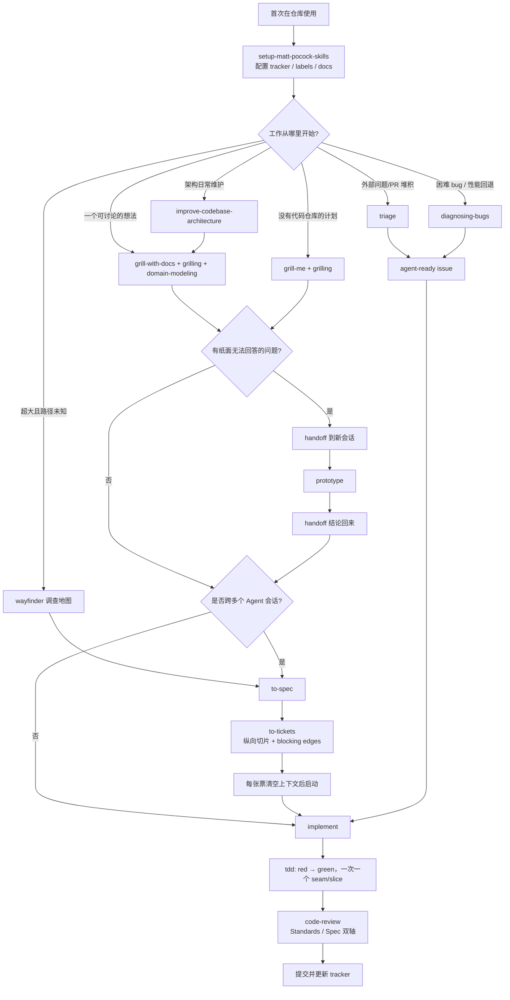

# 资料：`mattpocock/skills` 的工作流程与全部 Skills 设计目的

> 资料用途：理解该仓库如何把软件工程纪律封装成可组合的 Agent Skills，并作为选型、改造或自建 skills 系统的参考。
>
> 资料读取于：2026-07-11
>
> 仓库：[`mattpocock/skills`](https://github.com/mattpocock/skills)
>
> 分支与提交：`main` @ [`391a270`](https://github.com/mattpocock/skills/tree/391a2701dd948f94f56a39f7533f8eea9a859c87)
>
> 统计口径：源码中全部 39 个 `SKILL.md`，包括稳定、低频、个人、开发中和废弃目录；“当前正式产品面”另行标注。

---

## 1. 快速结论

这个项目不是一个替用户接管研发过程的“大型 Agent 框架”，而是一套小型、可替换、可组合的工程操作规程。作者明确把它与 GSD、BMAD、Spec-Kit 一类“拥有整个过程”的方案区分开：这里保留人的控制权，每个 skill 只解决一种可辨认的失败模式。

它的主干流程可以压缩成一句话：

> 先通过追问对齐意图并沉淀领域语言，再把已达成的理解写成 spec，按纵向 tracer bullet 拆票，以 TDD 小步实现，最后分别对照工程标准和原始需求做双轴审查。

五个最重要的设计判断是：

1. **编排与纪律分离。** 用户显式调用的 skill 负责编排流程；模型可调用的 skill 负责提供可复用纪律。前者降低自动误触发，后者让多个流程复用同一套做法。
2. **对话上下文不是可靠的长期记忆。** `CONTEXT.md` 保存领域词汇，ADR 保存难以逆转的取舍，issue/spec 保存工作契约，handoff 文件跨上下文窗口传递状态。
3. **先消除错误问题，再提高写代码速度。** `grilling` 解决意图错位；`prototype` 用可运行物回答纸面上无法回答的问题；`wayfinder` 用调查票驱散大型工作的“战争迷雾”。
4. **反馈速度是交付速度的上限。** `diagnosing-bugs` 没有可重复变红的命令就不允许提出假设；`tdd` 每次只做一个 red-green 纵向切片。
5. **代码结构也是 Agent 基础设施。** `codebase-design` 强调 deep module、seam、locality 和 leverage；良好模块既方便人理解，也减少 Agent 在文件间跳转和猜测的成本。

它不是“全自动流水线”。人在三个地方拥有明确决定权：设计树中的每个真实决策、测试 seam 的确认、以及架构候选/triage 结果的批准。Agent 负责查事实、生成候选、执行和验证，但不能把人的产品判断偷换成默认值。

## 2. 项目版图与正式产品面

仓库共有 39 个 skill，按成熟度和推广范围分成六个 bucket：

| Bucket | 数量 | 定位 | 是否进入正式插件/公开索引 |
| --- | ---: | --- | --- |
| `engineering/` | 17 | 日常软件工程流程与基础纪律 | 原则上应进入；当前存在清单不一致，见第 9 节 |
| `productivity/` | 5 | 非代码专属的通用工作流 | 是 |
| `misc/` | 4 | 保留但很少使用的专用工具 | 否 |
| `personal/` | 2 | 与作者个人环境绑定 | 否 |
| `in-progress/` | 7 | 尚未稳定、可能破坏性变化的实验 | 否 |
| `deprecated/` | 4 | 作者已不再使用的历史方案 | 否 |

正式插件清单位于 [`.claude-plugin/plugin.json`](https://github.com/mattpocock/skills/blob/391a2701dd948f94f56a39f7533f8eea9a859c87/.claude-plugin/plugin.json)。稳定 skill 还配有面向人的 docs 页面，目的不是复制 `SKILL.md`，而是帮助人记住“什么时候该调用它”；真正的执行规程仍在 `SKILL.md`。

### 2.1 双层调用模型

| 类型 | Frontmatter | 谁能触发 | 描述文本的职责 | 代价 |
| --- | --- | --- | --- | --- |
| 用户调用 | `disable-model-invocation: true` | 只有人显式输入 skill 名 | 给人看的简短索引 | 人要记住它，产生 cognitive load |
| 模型调用 | 不设置该字段 | 人或模型自动触发 | 给模型列出丰富、互异的触发分支 | 每轮都占 context load |

硬约束是：**用户调用 skill 可以在规程中要求运行模型调用 skill，但不能调用另一个用户调用 skill。** 因为后者不会暴露给模型。`ask-matt` 因此不是自动总控，而是一个由人主动调用的 router，用一个入口缓解“slash command 太多记不住”的认知负担。

### 2.2 Skill 内部的信息层级

项目自己的 `writing-great-skills` 把 skill 内容分成三层：

1. **Skill 内步骤**：当前就必须执行的有序动作，每一步应有可检查的完成条件。
2. **Skill 内参考**：运行时持续适用的词汇、原则和反模式。
3. **外部参考文件**：只有特定分支需要时才读取，通过 context pointer 渐进披露。

这套分层的目标不是写出内容最多的提示词，而是从随机系统中“榨出流程可预测性”。它特别防范三件事：完成标准模糊造成的过早结束、同一规则多处复制造成的漂移、历史文本沉积造成的无效上下文负担。

## 3. 角色映射

| Role | 当前对应 Skill | 作用 |
| --- | --- | --- |
| Meta / router | `ask-matt` | 根据当前处境选择主流程、入口或独立工具 |
| 环境初始化 | `setup-matt-pocock-skills` | 固化 issue tracker、triage 标签、领域文档布局 |
| 意图抽取 | `grilling`，入口为 `grill-me` / `grill-with-docs` | 一次一个问题遍历决策树，事实由 Agent 查，决定由用户做 |
| 意图/领域沉淀 | `domain-modeling` | 实时维护规范词汇和高价值 ADR |
| 可运行探索 | `prototype` | 用一次性代码回答状态模型或 UI 设计问题 |
| 大型未知探索 | `wayfinder` | 把未知拆为调查票，产出决定而不是交付物 |
| Spec / PRD | `to-spec` | 不重新访谈，把当前已知内容合成为工作契约 |
| 任务拆分 | `to-tickets` | 拆成可独立验证的纵向 tracer bullets，并显式声明 blocking edges |
| 执行 | `implement` + `tdd` | 在预先确认的 seams 上逐片 red-green 实现 |
| Bug 诊断 | `diagnosing-bugs` | 先建立 tight、red-capable loop，再最小化、假设、仪器化和修复 |
| 工程门控 | `code-review` | 标准符合度与 spec 符合度分开审查，避免互相遮蔽 |
| 文档/记忆 | `CONTEXT.md`、ADR、issue/spec、`handoff` | 按语义分别持久化语言、取舍、契约和会话状态 |

该框架**没有独立的自动发布、部署、上线监控层**。当前主流程止于实现、review 和 commit；issue tracker 是协调面，不是部署编排器。

## 4. 从意图到交付的完整工作流

### 4.1 主流程为何这样排序

- **`grill-with-docs` 在前**：先暴露隐藏决定，避免模型快速实现了错误目标。领域词汇和 ADR 在讨论中即时写入，不等会话结束后凭记忆补写。
- **`prototype` 是支线而非产线**：只有可运行物才能回答的问题才绕行；保留结论和原型分支，主分支只接收已验证的决定。
- **`to-spec` 不再访谈**：访谈和规格化是两个阶段。重新提问既浪费上下文，也可能把已经达成的共识改写。
- **`to-tickets` 按纵向能力切片**：每张票都能从入口走到可观察结果，而不是先建数据库、再写 API、最后补 UI 的水平切层。
- **每张票使用新上下文**：早期意图整理必须保持连续；进入实现后，ticket 成为新会话的完整契约，避免超出模型 smart zone。
- **review 分两轴**：好代码可能做错事，正确功能也可能破坏工程约束。两类问题不可合并打分。

### 4.2 三类门控

| 门控 | 必须满足的条件 | 不满足时 |
| --- | --- | --- |
| 决策门 | `grilling` 中每个产品/设计决定由用户逐项确认 | 不执行计划 |
| 测试 seam 门 | 写测试前明确公开 interface 与测试 seams，并获用户确认 | 不写测试 |
| 调试反馈门 | 已运行一个 tight、deterministic、agent-runnable、能捕捉精确症状的命令 | 不进入假设阶段 |

## 5. 全部 Skills 设计目的总览

下面的“文档”指持久化交付物；“无固定文档”表示主要交付物是代码、验证证据、状态变化或会话结果。

### 5.1 Engineering：稳定工程 Skills（17）

| Skill / 调用 | 设计目的与防止的失败 | 核心流程 | 结束条件 | 文档/交付物 |
| --- | --- | --- | --- | --- |
| `ask-matt` / 用户 | 给过多手动 skill 提供单一入口，防止选错流程或忘记工具 | 识别处境 → 匹配主线、on-ramp、健康维护或独立工具 → 说明上下游 | 用户知道下一步调用什么及原因 | 无固定文档；路由建议 |
| `setup-matt-pocock-skills` / 用户 | 消除 tracker、标签和领域文档位置的隐式假设 | 探索仓库 → 分段确认 → 展示草稿 → 写配置 | 用户确认且配置文件写入 | `docs/agents/*.md`，`CLAUDE.md` 或 `AGENTS.md` |
| `grill-with-docs` / 用户 | 在代码项目中对齐需求，同时避免知识只留在对话里 | 调用 `grilling`，并用 `domain-modeling` 即时维护词汇/ADR | 决策树无未决分支，用户确认理解一致 | `CONTEXT.md`、必要 ADR |
| `triage` / 用户 | 把外部原始 issue/PR 变成明确状态和 durable agent brief | 汇总待处理 → 读全量上下文 → 查重复/历史拒绝 → 推荐 → 验证 → 必要时追问 → 应用状态 | 恰好一个类别和一个状态；结论已写回 tracker | tracker 标签、评论、agent brief、可选 `.out-of-scope/` |
| `improve-codebase-architecture` / 用户 | 定期发现浅模块和坏 seam，防止 Agent 加速代码熵 | 读领域文档 → 探索摩擦 → HTML 候选报告 → 用户选项 → grilling 设计 | 候选已可视化；选中项的决定已澄清 | 临时 HTML；`CONTEXT.md`/可选 ADR |
| `to-spec` / 用户 | 把已讨论清楚的内容冻结成契约，避免再访谈造成漂移 | 探索现状 → 提议并确认测试 seams → 按模板写 spec → 发布并标 ready | spec 发布且 seams 获确认 | tracker 中的 spec/PRD |
| `to-tickets` / 用户 | 把大计划拆成可并行、可验证、依赖明确的纵向切片 | 读上下文 → 可选探索 → 起草 tracer bullets → 逐项 quiz → 按依赖顺序发布 | 每票有验收条件和 blockers；发布完成 | 本地 `.scratch/.../issues/*.md` 或真实 tracker tickets |
| `implement` / 用户 | 把 ticket/spec 变成受 TDD 和 review 约束的实现流程 | 读工作契约 → 约定 seams → 逐片调用 TDD → 双轴 review → 修复 → 提交/更新 tracker | 验收条件满足、检查通过、review 无阻塞项 | 代码、测试、commit、tracker 状态 |
| `wayfinder` / 用户 | 处理单会话装不下且路径未知的大型工作，防止假装已有完整计划 | 建共享 map → 建 investigation tickets → blockers-first 调查 → 把结果写回 map → 直到路径清楚 | 未知项被消除到可写 spec 或直接实现 | tracker map 与调查票、决定记录 |
| `prototype` / 模型 | 用一次性可运行物回答纸面无法可靠判断的状态/UI 问题 | 选 logic/UI 分支 → 最短可运行原型 → 暴露完整状态/多方案 → 记录 verdict | 一个明确问题已得到答案 | throwaway 分支、issue 中的问题与结论；主线不保留原型代码 |
| `diagnosing-bugs` / 模型 | 阻止先看代码编故事式调试 | tight loop → 复现与最小化 → 3–5 个可证伪假设 → 单变量仪器化 → 回归测试与修复 → 清理/复盘 | 原始复现变绿、回归测试通过、调试痕迹清零 | 反馈命令证据、回归测试、commit/PR 根因说明 |
| `research` / 模型 | 把资料查证委托给后台，同时只接受一手来源 | 后台 Agent → 追到官方/源码/spec → 逐项引用 → 写单个 Markdown | 每个关键主张可追溯，文件路径已告知 | 仓库中的带引用研究笔记 |
| `tdd` / 模型 | 保证测试描述外部行为并形成快速反馈，而非批量猜测实现 | 先确认 seams → 一个失败测试 → 最少实现变绿 → 重复纵向切片 | 每个 slice 先红后绿；无实现耦合/自证式测试 | 测试与最少实现代码 |
| `domain-modeling` / 模型 | 建立跨人和 Agent 的统一领域语言，记录少量真正必要的决定 | 对照 glossary → 澄清模糊词 → 用边界场景施压 → 对照代码 → 即时更新 → 谨慎提 ADR | 当前术语冲突解决；重要决定被适当记录 | `CONTEXT.md` / `CONTEXT-MAP.md`、ADR |
| `codebase-design` / 模型 | 提供 deep module 的统一架构词汇和设计判断 | 用 deletion test、interface/test surface、adapter 规则评估 seam 和 depth | 设计能以小 interface 隐藏复杂度，测试从同一 seam 进入 | 无固定文档；设计判断与共享词汇 |
| `code-review` / 模型 | 防止工程质量和需求忠实度互相掩盖 | 固定 merge-base → 找 spec → 找 standards → 两个子 Agent 并行 → 分栏汇总 | ref 有效、diff 非空；两轴分别完成并计数 | Standards/Spec 双栏审查报告 |
| `resolving-merge-conflicts` / 模型 | 根据双方原始意图解决冲突，避免机械选 ours/theirs 或夹带新行为 | 看状态 → 查 commit/PR/issue → 逐 hunk 保留意图 → 跑检查 → 完成 merge/rebase | 无未解决冲突、检查通过、merge/rebase 完成 | 合并后的代码和 commit |

### 5.2 Productivity：稳定通用 Skills（5）

| Skill / 调用 | 设计目的与防止的失败 | 核心流程 | 结束条件 | 文档/交付物 |
| --- | --- | --- | --- | --- |
| `grill-me` / 用户 | 为非代码计划提供无状态的深度追问入口 | 调用 `grilling` | 共享理解确认 | 无持久化文档 |
| `grilling` / 模型 | 逐分支暴露隐藏假设，防止一次问很多问题或替用户做决定 | 查事实 → 一次一个决策问题并给推荐 → 等回答 → 继续 | 用户确认已达成共享理解；在此之前不执行 | 对话中的决策记录 |
| `handoff` / 用户 | 跨上下文窗口传递最少但足够的信息，避免复制全部历史和泄密 | 总结 → 引用已有 artifacts → 建议 skills → 脱敏 → 写系统临时目录 | 新 Agent 可从文档继续且无需重复资料 | 临时目录中的 Markdown handoff |
| `teach` / 用户 | 把一次性问答变成多会话、可追踪的学习系统 | 明确 mission → 查高可信资源 → 估计最近发展区 → 生成短 HTML lesson → 练习反馈 → 记录学习 | 每课产生一个贴近 mission 的小胜利并更新学习状态 | `MISSION.md`、`RESOURCES.md`、`lessons/`、`reference/`、`learning-records/`、`assets/`、`NOTES.md` |
| `writing-great-skills` / 用户 | 以低上下文成本提高 skill 流程可预测性 | 选调用模式 → 写精准 description → 安排信息层级 → 必要时拆分 → 去重/剪枝 → 检查失败模式 | 每项规则单一来源、完成标准可检查、无沉积/重复 | 被编辑的 `SKILL.md` 及外部参考文件 |

### 5.3 Misc：低频专用 Skills（4）

| Skill | 设计目的 | 流程与结束条件 | 文档/交付物 |
| --- | --- | --- | --- |
| `git-guardrails-claude-code` | 在 Claude 执行前阻止 push、hard reset、clean 等危险 Git 命令 | 选择项目/全局范围 → 复制 hook → 合并 settings → 可选定制 → 用模拟输入验证 exit 2 | hook 脚本与 Claude settings |
| `migrate-to-shoehorn` | 仅在测试中用 `fromPartial` / `fromAny` 替代不安全 `as` | 确认测试场景 → 安装包 → 搜索断言 → 替换/加 import → typecheck | 测试代码与依赖变更 |
| `scaffold-exercises` | 为课程练习生成符合固定 lint 约定的目录骨架 | 解析计划 → 建 section/exercise/variant → 写最小 readme → lint 到通过 → commit | `exercises/` 目录和 commit |
| `setup-pre-commit` | 一次性安装 staged format、typecheck、test 提交门 | 探测包管理器 → 安装/初始化 → 写 hook/config → 验证 → 通过新 hook 自提交 | Husky、lint-staged、Prettier 配置和 commit |

### 5.4 Personal：作者个人 Skills（2）

| Skill | 设计目的 | 流程与结束条件 | 文档/交付物 |
| --- | --- | --- | --- |
| `edit-article` | 按信息依赖 DAG 重排文章，并把段落压短到 240 字符以内 | 分节/重排 → 用户确认 → 逐节改写 | 用户确认结构且每节完成改写 | 被编辑文章 |
| `obsidian-vault` | 操作作者固定路径下的扁平 Obsidian 知识库 | 搜索/创建/找 backlinks/找 index，使用 Title Case 和 wikilinks | 指定笔记操作完成 | 个人 vault 中的 Markdown 笔记 |

### 5.5 In Progress：开发中 Skills（7）

| Skill | 设计目的 | 流程与结束条件 | 文档/交付物 |
| --- | --- | --- | --- |
| `claude-handoff` | handoff 的自动启动版本，把摘要直接交给新的 Claude 后台 Agent | 生成脱敏摘要和建议 skills → `claude --bg --name ...` | 后台 agent 已命名并启动 | 后台任务；不写 handoff 文件 |
| `loop-me` | 把生活/工作中的重复 loop 追问成零歧义、可实现 workflow | 先记录用户世界 → 找 loop → 按 trigger/checkpoint/push-right/brief 追问 → 持续编辑 spec | 实现 Agent 无需再问问题 | `workflows/*.md`、`NOTES.md` |
| `setup-ts-deep-modules` | 用 dependency-cruiser 强制 TypeScript package 只能通过根 entry points 被外部访问 | 探测结构 → 安装/配置 → 接入 checks → 建示例包 → 正反用例证明规则生效 → 写约定 | 四条规则真实拦截且文档入口存在 | dependency-cruiser 配置、示例 package、README、Agent 指针 |
| `wizard` | 把需要人点网页/复制 secret 的手工流程做成一致、友好的交互脚本 | 盘点阶段和值 → 映射精确用户旅程 → 基于固定模板写 stages → 静态验证/交接 | 每个值来源和落点明确；语法检查通过 | 临时或仓库内 Bash wizard |
| `writing-fragments` | 写作 explore 阶段只扩大素材空间，不提前定结构 | 一次询问保存位置 → grilling 挖素材 → 从首句起持续追加异构 fragments | 用户停止探索；素材文件保留所有有价值片段 | 单个 Markdown 原料文件 |
| `writing-shape` | 写作 exploit 阶段从固定素材堆逐段塑造成文章 | 全量读素材 → 定读者先验 → 比较开头 → 每次只定一个 block 及格式 → 即时追加 | 用户判断文章完成 | 独立文章文件；原素材只读 |
| `writing-beats` | 以“beat + concept grounding”构造可选择路径的文章旅程 | 定先验 → 提供 2–3 个起始 beat → 用户选 → 只写一个 → 重新读盘 → 提供后续 beat | 文章旅程自然结束，不要求耗尽素材 | 独立文章文件 |

### 5.6 Deprecated：废弃 Skills（4）

| Skill | 原设计目的 | 被当前体系吸收/替代的方向 | 历史交付物 |
| --- | --- | --- | --- |
| `design-an-interface` | 并行生成 3+ 个激进不同的 interface，再比较和合成 | 能力已成为 `codebase-design` 的 design-it-twice 外部参考 | 多方案 interface 比较；不实现 |
| `qa` | 与用户对话式收集 bug，后台读代码后直接建 durable GitHub issues | 当前 `triage` 更完整：状态机、验证、brief、out-of-scope | GitHub issues |
| `request-refactor-plan` | 通过深访谈生成微小 commit 序列的 refactor RFC | 当前由 `grill-with-docs`、`to-spec`、`to-tickets`、`codebase-design` 组合承担 | GitHub refactor issue |
| `ubiquitous-language` | 从当前对话一次性抽取领域 glossary | 当前 `domain-modeling` 改为会话中主动、即时、可多 context 维护 | `UBIQUITOUS_LANGUAGE.md` |

## 6. 文档、记忆与状态如何分工

这个项目没有把所有知识塞进一个“大记忆文件”，而是按变化速度和语义拆开：

| Artifact | 保存什么 | 不保存什么 | 谁主要维护 |
| --- | --- | --- | --- |
| `CONTEXT.md` | 领域术语、精确定义、关系 | 实现细节、计划、临时笔记 | `domain-modeling` / `grill-with-docs` |
| `CONTEXT-MAP.md` | 多 bounded context 的位置映射 | 具体词条 | setup + domain modeling |
| `docs/adr/*.md` | 难逆转、令人意外、确有取舍的决定 | 普通或临时决定 | domain modeling |
| issue / spec | 用户问题、solution、stories、implementation/testing decisions、scope | 易过期的文件路径和代码片段 | `to-spec` / `triage` |
| tickets | 独立纵向能力、验收条件、blocking edges | 水平层任务堆 | `to-tickets` |
| handoff | 当前会话未被其他 artifact 捕获的增量状态 | 已存在文档的全文、秘密 | `handoff` |
| `.out-of-scope/*.md` | 被拒绝 enhancement 的持久理由 | 已经实现的功能、普通 bug | `triage` |

这是一种“按职责外部化上下文”的设计：词汇可长期复用，ADR 防止未来重新争论，spec/ticket 让新实现会话可以清空历史上下文，handoff 只补剩余差额。

## 7. 工程取舍与实现理念

### 7.1 为什么坚持小而可组合

小 skill 更容易局部修改，也更容易定位失效原因。例如，需求不对时检查 `grilling`；测试过度耦合时检查 `tdd` 和 seam 选择；功能正确但结构退化时检查 `code-review` 的 Standards 轴。大型总控提示词把这些原因混在一起，失败后很难知道哪条规则没有生效。

组合并不意味着任意互调。项目用调用类型限制依赖方向，用 router 解决发现问题，用单一来源原则避免多个 skill 各自定义“领域模型”或“deep module”。

### 7.2 为什么强调 leading words

`tight loop`、`red`、`tracer bullet`、`fog of war`、`deep module`、`seam`、`grounding` 都是刻意选择的“leading words”。它们利用模型预训练中已有的概念，把一组行为压缩到少量稳定词汇中。作用有两层：描述里提高触发可靠性，正文里提高执行一致性。

### 7.3 为什么测试 seam 必须先获确认

该体系不追求“所有东西都有测试”，而是要求在最高、最稳定的公开 interface 上测试关键行为。若 Agent 自己随意挑 seam，常会为了容易测试而抽出浅层纯函数，最后测到了内部计算，却漏掉真实 bug 所在的调用组合。先确认 seam 把测试预算放在真正的用户行为边界上。

### 7.4 为什么 refactor 被移出 red-green loop

`tdd` 明确把 refactor 放到 review 阶段，而不是经典名称中的第三步。其意图是压低单轮认知负担：实现阶段只用一个失败测试推动最少代码；结构改善由固定点 diff 和完整上下文的 review 处理。代价是若 review 不执行，结构债务可能累积，所以 `implement` 将 `code-review` 设为收尾步骤。

### 7.5 人类审批与自动执行的边界

Agent 应自己查代码库事实，不把可搜索的问题抛给用户；但需求优先级、设计取舍、测试 seam 和架构方向属于人。这个边界很实用：减少无意义问答，同时不让 Agent 用“合理默认值”悄悄决定产品。

## 8. 适用范围与局限

适合：希望保留工程师控制权、已有 issue tracker 和代码审查习惯、愿意把领域语言与决定写入仓库、需要多个 Agent 会话协作的团队。

不完全适合：只想输入一句话后全自动部署的个人原型；没有测试或可执行反馈渠道的遗留系统；不愿维护 issue/spec/ADR 的团队；严格禁止 Agent 写 tracker 或创建提交但又不调整 skill 的环境。

主要局限：

- 多个核心流程依赖用户主动记得调用；router 缓解但没有消除这一点。
- `setup`、tracker 文档和若干 skill 的前置契约需要团队按自己的工具改写。
- `code-review` 原始规程硬编码并行子 Agent；不支持该能力的宿主需要顺序执行或改写。
- 主流程缺少发布、部署、运行时观察和事故响应层。
- `prototype` 要求把原型提交到 throwaway branch，这比常见“直接删除”更可追溯，但增加 Git 操作成本。
- 部分开发中 skill 与作者具体工具或写作方式强绑定，不能视作稳定接口。

## 9. 仓库一致性观察

以下是基于提交 `391a270` 的源码核对，不是对 skill 理念的推断：

1. `skills/engineering/resolving-merge-conflicts/SKILL.md` 位于稳定 `engineering/`，并存在 `docs/engineering/resolving-merge-conflicts.md`，但没有出现在顶层 `README.md`、`skills/engineering/README.md` 或 `.claude-plugin/plugin.json`。这与 `CLAUDE.md` 所写“engineering/productivity 中每个 skill 必须进入顶层 README 和插件清单”的规则冲突。
2. `implement` 出现在顶层 README 和插件清单，但漏于 `skills/engineering/README.md`；同样违反 bucket README 应列出目录内所有 skill 的规则。
3. 因此，“源码共有 39 个”“正式插件列出 21 个”“公开顶层索引列出 21 个”不能简单当成同一个集合。本文用实际 `SKILL.md` 做全量分析，用 manifest 判断可安装产品面。

## 10. 采用这套方法时的建议

如果要借鉴，而不是原样照搬，建议保留四个骨架：

1. 保留“意图澄清 → spec → 纵向票 → 受反馈约束的实现 → 双轴 review”的阶段边界。
2. 为自己的组织建立 5–10 个稳定 leading words，并让代码、文档和 skill 使用同一语言。
3. 把 tracker、领域文档路径、标签映射做成一次性 setup 产物，不要散落在每个 skill 中。
4. 给每一步写可观察的完成标准，尤其是“不得继续”的条件；这是从提示词建议升级为工作流门控的关键。

不要直接复制作者个人路径、GitHub-only 命令或 Claude 特定 hook。真正值得复制的是职责分解、状态交接、反馈门和失败模式，而不是表面文件结构。

## 11. 全部 Skills 完整中文执行版

本节按原始 `SKILL.md` 重建中文执行规程。原文没有独立 completion checklist 的地方，结束判断均按流程保守归纳并明确写出。

### 11.1 `ask-matt` 完整中文执行版

来源：[engineering/ask-matt/SKILL.md](https://github.com/mattpocock/skills/blob/391a2701dd948f94f56a39f7533f8eea9a859c87/skills/engineering/ask-matt/SKILL.md)

- **元信息/触发**：用户调用。用户不知道该选哪一个 skill 或哪条 flow 时使用。
- **概览**：把工作分成主流程、三种 on-ramp、代码库维护、底层词汇、跨会话桥和独立工具；只路由，不代替目标 skill。
- **流程**：先识别是想法、外部 issue、困难 bug、超大未知工作还是架构维护；再判断是否需要 prototype、是否跨多会话；指出 setup 前置条件和下一步调用。
- **交付物**：无持久化文档；输出一条有理由的调用路径。
- **关系**：主链是 `grill-with-docs → [prototype] → to-spec → to-tickets → implement(TDD) → code-review`；`triage`、`diagnosing-bugs`、`wayfinder` 汇入主链。
- **常见合理化/红旗**：不要把 `/compact` 当跨会话分支；不要 triage 由 `to-tickets` 生成的 agent-ready tickets；不要让多票共享一个污染的实现上下文。
- **结束判断与验证**：原文无独立清单。确认已说明为什么选此路径、下一步具体 skill、是否需 setup、何时 handoff/清空上下文。

### 11.2 `setup-matt-pocock-skills` 完整中文执行版

来源：[engineering/setup-matt-pocock-skills/SKILL.md](https://github.com/mattpocock/skills/blob/391a2701dd948f94f56a39f7533f8eea9a859c87/skills/engineering/setup-matt-pocock-skills/SKILL.md)

- **元信息/触发**：用户调用；每个仓库首次使用工程 skills 前运行一次。
- **流程**：读取 remote、Agent 指令文件、领域文档、ADR、`docs/agents`、`.scratch`、triage 安装状态和 monorepo 信号；按 A tracker、B triage labels、C domain layout 一节一问；先展示推荐答案和所有草稿；用户确认后才写。
- **写入规则**：优先编辑已有 `CLAUDE.md`，否则已有 `AGENTS.md`；两者均无时必须询问，不能擅选。更新已有 `## Agent skills`，不可重复追加或覆盖周边用户内容。
- **交付物**：`docs/agents/issue-tracker.md`、`docs/agents/domain.md`、可选 `triage-labels.md`，以及 Agent 指令文件中的索引块。
- **关系**：`to-spec`、`to-tickets`、`triage` 是硬依赖；domain docs 对调试、TDD、架构 skill 是软增强。
- **红旗**：未探索就默认 GitHub；无 monorepo 信号却引入多 context；triage 未安装仍创建标签配置；未展示草稿即写入。
- **结束判断与验证**：用户已确认所有选择；文件内容与选择一致；只编辑正确的 Agent 指令文件；说明哪些 skills 会读取这些配置。

### 11.3 `grill-with-docs` 完整中文执行版

来源：[engineering/grill-with-docs/SKILL.md](https://github.com/mattpocock/skills/blob/391a2701dd948f94f56a39f7533f8eea9a859c87/skills/engineering/grill-with-docs/SKILL.md)

- **元信息/触发**：用户调用；有代码库的计划或设计需要深挖时使用。
- **流程**：完整运行 `grilling` 的一次一问决策树，同时运行 `domain-modeling`：术语确定即写 glossary，满足三条件的重大取舍才提 ADR。
- **交付物**：对话中的共享理解、`CONTEXT.md`/context-specific glossary、必要 ADR。
- **关系**：是主流程入口；无代码库用 `grill-me`；纸面无法回答的问题通过 handoff 转入 `prototype`。
- **红旗**：只问问题不维护文档；把实现细节写进 glossary；在未确认共享理解前开始编码。
- **结束判断与验证**：所有决策分支已解决；用户明确确认共享理解；新术语已即时写入；真正需要的 ADR 已处理。

### 11.4 `triage` 完整中文执行版

来源：[engineering/triage/SKILL.md](https://github.com/mattpocock/skills/blob/391a2701dd948f94f56a39f7533f8eea9a859c87/skills/engineering/triage/SKILL.md)

- **元信息/触发**：用户调用；仅处理外部进入的原始 issue/PR，不处理 `to-tickets` 生成的票。
- **状态模型**：每项恰好一个类别 `bug|enhancement`，一个状态 `needs-triage|needs-info|ready-for-agent|ready-for-human|wontfix`；冲突标签先问维护者。
- **流程**：读取完整 tracker 历史和 PR diff；查代码是否已实现、查 `.out-of-scope` 是否曾拒绝；先向维护者推荐；验证 bug/PR 主张；必要时 grilling + domain modeling；应用状态、brief、close 或 notes。
- **外部写入门**：所有 AI triage 评论必须以指定 AI disclaimer 开头。快速状态覆盖也要先确认将发生的状态变化、评论和关闭动作。
- **交付物**：标签、验证证据、agent/human brief、needs-info notes、可选 out-of-scope 记录。
- **红旗**：重复追问已回答内容；把已实现功能写入 out-of-scope；未验证就写 agent brief；issue 状态角色超过一个。
- **结束判断与验证**：类别/状态唯一；验证结论已记录；需要后续者可从 durable brief 直接行动；任何 tracker 评论带免责声明。

### 11.5 `improve-codebase-architecture` 完整中文执行版

来源：[engineering/improve-codebase-architecture/SKILL.md](https://github.com/mattpocock/skills/blob/391a2701dd948f94f56a39f7533f8eea9a859c87/skills/engineering/improve-codebase-architecture/SKILL.md)

- **元信息/触发**：用户调用；定期维护或代码难以测试/导航时使用。
- **流程**：先读 glossary/ADR 并载入 `codebase-design` 词汇；探索理解摩擦、浅模块、耦合泄漏和测试困难；对候选做 deletion test；生成临时 HTML before/after 报告；用户选中后才进入 grilling 设计。
- **门控**：报告阶段禁止提前设计 interface；与 ADR 冲突的候选只有在摩擦足够真实时才提出并显著标记。
- **交付物**：OS 临时目录中的 `architecture-review-<timestamp>.html`；后续可能更新 `CONTEXT.md` 和 ADR。
- **关系**：`codebase-design` 提供单一架构词汇；选中项经 `grilling` / `domain-modeling` 回到主流程。
- **红旗**：用 service/component/boundary 混淆约定词汇；列理论重构而无实际摩擦；报告未打开；用户未选即改代码。
- **结束判断与验证**：每候选含文件、问题、方案、收益、可视化和强度；有 top recommendation；选中候选的决策树已走完。

### 11.6 `to-spec` 完整中文执行版

来源：[engineering/to-spec/SKILL.md](https://github.com/mattpocock/skills/blob/391a2701dd948f94f56a39f7533f8eea9a859c87/skills/engineering/to-spec/SKILL.md)

- **元信息/触发**：用户调用；当前对话已形成共识，需要变成 spec/PRD 时使用。**禁止重新访谈。**
- **流程**：补足代码库现状；使用领域词汇并尊重 ADR；优先最高、已有、数量最少的测试 seams；向用户确认 seams；按固定模板合成并发布到配置的 tracker，标 `ready-for-agent`。
- **交付物**：含 Problem、Solution、详尽 User Stories、Implementation Decisions、Testing Decisions、Out of Scope、Notes 的 tracker spec。
- **关系**：承接 grilling/wayfinder/prototype 结论；大型工作下游是 `to-tickets`，小工作可进 `implement`。
- **红旗**：重新问已决定的问题；写易过期文件路径/代码；未确认 seams；把 prototype 工作代码整段塞入 spec。
- **结束判断与验证**：spec 已发布；stories 覆盖完整；seams 获确认；测试与实现决定可操作；标签正确。

### 11.7 `to-tickets` 完整中文执行版

来源：[engineering/to-tickets/SKILL.md](https://github.com/mattpocock/skills/blob/391a2701dd948f94f56a39f7533f8eea9a859c87/skills/engineering/to-tickets/SKILL.md)

- **元信息/触发**：用户调用；把 plan/spec/当前对话拆成多张执行票。
- **流程**：读取传入 spec/issue 全文和评论；必要时探索代码；设计端到端 tracer-bullet 纵向切片；每票明确可观察验收结果和 blockers；逐项 quiz 用户解决边界；按依赖顺序发布。
- **切片规则**：优先每张票交付一个可验证能力，不按数据库/API/UI 水平分层；阻塞边要真实，最大化并行。
- **交付物**：本地 tracker 为 `.scratch/<feature>/issues/<NN>-<name>.md` 等一票一文件并用文本 blockers；真实 tracker 使用原生 blocking links。
- **关系**：上游通常 `to-spec`；下游 blockers-first，每张票在新上下文中单独 `implement`。
- **红旗**：一张大票；“建立后端”这类无用户结果的水平任务；所有票互相串行；遗漏 acceptance criteria 或 parent。
- **结束判断与验证**：每票独立、纵向、可验证；blocking graph 完整且无伪依赖；用户疑问已解决；所有票已发布。

### 11.8 `implement` 完整中文执行版

来源：[engineering/implement/SKILL.md](https://github.com/mattpocock/skills/blob/391a2701dd948f94f56a39f7533f8eea9a859c87/skills/engineering/implement/SKILL.md)

- **元信息/触发**：用户调用；已有 spec 或 tickets，需要实现。
- **流程**：读取工作来源和相关领域文档；识别/确认测试 seams；按验收条件逐个纵向 slice 驱动 `tdd`；完成后以预先确定的 fixed point 运行 `code-review`；修复阻塞发现，运行仓库检查，提交并更新工作状态。
- **交付物**：生产代码、测试、review 证据、commit 和 tracker 更新。
- **关系**：主流程执行器，内部复用 `tdd` 和 `code-review`；困难 bug 可转 `diagnosing-bugs`。
- **红旗**：未读 spec 就实现；跨 ticket 偷做范围；一次写完所有测试/实现；review 前自行扩大 refactor。
- **结束判断与验证**：原文很短，本清单按主路由约束归纳：所有 acceptance criteria 有证据；检查通过；两轴 review 完成；无未处理阻塞项；提交只包含本工作范围。

### 11.9 `wayfinder` 完整中文执行版

来源：[engineering/wayfinder/SKILL.md](https://github.com/mattpocock/skills/blob/391a2701dd948f94f56a39f7533f8eea9a859c87/skills/engineering/wayfinder/SKILL.md)

- **元信息/触发**：用户调用；工作超过单会话承载能力，且从现状到 destination 的路径仍被未知项遮挡。
- **核心约束**：只规划和调查，不做最终交付；调查票产出 decisions，不产出 production deliverables。
- **流程**：在 tracker 建 map，写 destination、notes、decisions so far、not yet specified、out of scope 和 tickets；将未知项写成可回答的 question tickets；按 blockers-first 逐张调查；每个答案回写 map 并可能生成新问题；不断缩小 fog of war。
- **交付物**：一个共享 map issue 和相互关联的 investigation tickets。
- **关系**：比 `grill-with-docs` 更适合超大未知工作；路径清楚后进入 `to-spec`，若意外很小则直接 `implement`。
- **红旗**：把实现票伪装成调查票；提前承诺未知架构；调查结果只留在会话不回写 map；开始生产编码。
- **结束判断与验证**：所有阻挡路线的未知项已有决定；map 与票一致；destination 可被 spec 明确描述；未完成问题要么继续调查要么明确 out of scope。

### 11.10 `prototype` 完整中文执行版

来源：[engineering/prototype/SKILL.md](https://github.com/mattpocock/skills/blob/391a2701dd948f94f56a39f7533f8eea9a859c87/skills/engineering/prototype/SKILL.md)

- **元信息/触发**：模型或用户调用；状态/业务逻辑需要实际操作验证，或 UI 需要看多个方案。
- **流程**：先锁定一个问题；logic 分支建微型交互终端程序，UI 分支在同一路由提供激进不同且可切换的方案；遵循项目运行器，提供一个启动命令；每次操作/切换暴露完整相关状态。
- **约束**：从第一天标明 throwaway；默认无持久化；不写测试、健壮错误处理或生产抽象；代码靠近未来使用位置但命名显著。
- **交付物**：可运行原型；完成后原型保存到 main 之外的 throwaway branch，issue 留 branch pointer、问题和 verdict；主线只接收已验证决定。
- **关系**：主流程中的会话支线，通常由 `handoff` 进出；结论进入 `to-spec` 或真实代码。
- **红旗**：同时回答多个问题；把原型逐渐“加固”为生产代码；未显式展示状态；原型无结论。
- **结束判断与验证**：问题已获得明确答案；一个命令可运行；结论已记录；主分支不残留原型实现。

### 11.11 `diagnosing-bugs` 完整中文执行版

来源：[engineering/diagnosing-bugs/SKILL.md](https://github.com/mattpocock/skills/blob/391a2701dd948f94f56a39f7533f8eea9a859c87/skills/engineering/diagnosing-bugs/SKILL.md)

- **元信息/触发**：模型或用户调用；困难 bug、异常、失败、慢、间歇 flake 或性能回退。
- **Phase 1 硬门**：建立并实际运行一个命令，必须精确捕捉用户症状、deterministic、秒级、Agent 可独立运行。无法建立时停止，列出尝试并索取环境/捕获物/临时监控权限；禁止提出假设。
- **Phase 2–4**：多次复现并逐项删除输入/配置/步骤，直到每个剩余元素都 load-bearing；先列 3–5 个有预测的可证伪假设；展示给用户后可继续；每次 probe 只改变一个变量，优先 debugger，其次带唯一前缀的定向日志。性能分支先基线和 profiler/bisect。
- **Phase 5–6**：若有正确 seam，把最小复现变为先失败的回归测试，再修复并复跑原场景；若没有正确 seam，记录架构发现；清除所有调试痕迹，写明正确根因，必要时交给 architecture skill。
- **交付物**：tight loop 命令及输出、最小复现、回归测试、修复、根因说明。
- **红旗**：先读代码形成理论；测试附近但不同的错误；一次加大量日志；在错误 seam 写“回归测试”制造虚假信心。
- **结束判断与验证**：原始 loop 变绿；回归测试通过或 seam 缺失已记录；所有 `[DEBUG-*]` 删除；throwaway harness 清理；根因进入 commit/PR。

### 11.12 `research` 完整中文执行版

来源：[engineering/research/SKILL.md](https://github.com/mattpocock/skills/blob/391a2701dd948f94f56a39f7533f8eea9a859c87/skills/engineering/research/SKILL.md)

- **元信息/触发**：模型或用户调用；要查官方文档、源码、spec 或 API 事实，并希望后台完成阅读。
- **流程**：启动后台 Agent；每个主张追溯到拥有该事实的一手来源；写成一个逐项带引用的 Markdown；遵循仓库已有研究笔记路径，无约定时选合理位置并报告。
- **交付物**：单个 cited Markdown research note。
- **关系**：研究是主流程输入，不替代 `grilling` 的产品判断。
- **红旗**：用二手文章支撑可查的一手事实；结论无贴近主张的引用；只在聊天里总结不落盘。
- **结束判断与验证**：关键结论均有一手来源；文件完整写入；用户知道路径；后台任务已结束。

### 11.13 `tdd` 完整中文执行版

来源：[engineering/tdd/SKILL.md](https://github.com/mattpocock/skills/blob/391a2701dd948f94f56a39f7533f8eea9a859c87/skills/engineering/tdd/SKILL.md)

- **元信息/触发**：模型或用户调用；test-first 功能/修复、red-green-refactor、integration tests。
- **前置门**：先写下公开 interface 和拟测试 seams，并由用户确认；任何未确认 seam 不得写测试。
- **循环**：一次只选一个 seam 和一个行为；先写能基于独立事实得出预期值的失败测试；只写使其通过的最少实现；再从上一轮学到的事实决定下一 slice。
- **反模式**：不得 mock 内部、测 private 或从旁路查状态；不得用与实现同算法计算 expected；不得先批量写完测试再批量实现。
- **关系**：`implement` 的内部执行纪律；`codebase-design` 定义 seam；结构重构移到 `code-review` 阶段。
- **交付物**：以外部行为为规格的测试和最少实现。
- **结束判断与验证**：每轮有可观察 red→green 证据；测试从已确认 seam 进入；实现重构不破坏测试；无 speculative behavior。

### 11.14 `domain-modeling` 完整中文执行版

来源：[engineering/domain-modeling/SKILL.md](https://github.com/mattpocock/skills/blob/391a2701dd948f94f56a39f7533f8eea9a859c87/skills/engineering/domain-modeling/SKILL.md)

- **元信息/触发**：模型或用户调用；主动建立/修改领域模型、解决术语冲突或记录架构取舍。仅仅读 glossary 不算调用该 skill。
- **流程**：判断单 context 或读取 `CONTEXT-MAP.md`；发现与 glossary 冲突立即指出；为模糊/重载词提规范名；用具体边界场景施压；对照代码验证口述模型；每确定一个词立即更新相应 `CONTEXT.md`。
- **ADR 门**：只有 hard to reverse、without context surprising、来自真实 trade-off 三项同时成立才提出 ADR；文件按需延迟创建。
- **交付物**：纯 glossary 的 `CONTEXT.md`，可选 map 和 context/system ADR。
- **关系**：为 grilling、triage、architecture、TDD 提供共享语言。
- **红旗**：把 implementation decision、spec 或 scratch notes 写入 `CONTEXT.md`；批量延迟更新；每个决定都写 ADR。
- **结束判断与验证**：本轮术语冲突已解决；定义简洁无实现细节；代码与口述矛盾已处理；ADR 满足三条件。

### 11.15 `codebase-design` 完整中文执行版

来源：[engineering/codebase-design/SKILL.md](https://github.com/mattpocock/skills/blob/391a2701dd948f94f56a39f7533f8eea9a859c87/skills/engineering/codebase-design/SKILL.md)

- **元信息/触发**：模型或用户调用；设计/改善 module interface、选择 seam、提高可测性与导航性。
- **词汇约束**：使用 module、interface、implementation、depth、seam、adapter、leverage、locality，不用容易混义的 component/service/API/boundary。
- **评估流程**：问能否减少方法和参数、隐藏更多复杂度；做 deletion test；让 caller 与 test 穿过同一 interface；只有出现两个真实 adapters 才把 seam 当真实变化点。
- **可测性规则**：dependencies 从外部传入；优先返回结果而非隐藏副作用；保持小 surface。
- **交付物**：无固定文档；输出可辩护的 module/interface/seam 设计，必要时按 design-it-twice 探索多方案。
- **红旗**：用实现行数/interface 行数计算深度；为未来假设引入只有一个 adapter 的 seam；测试绕过 interface。
- **结束判断与验证**：interface 让 caller 获得高 leverage；变化和 bug 有 locality；删除 module 会把复杂度重新散回 callers；测试能从同一 seam 覆盖行为。

### 11.16 `code-review` 完整中文执行版

来源：[engineering/code-review/SKILL.md](https://github.com/mattpocock/skills/blob/391a2701dd948f94f56a39f7533f8eea9a859c87/skills/engineering/code-review/SKILL.md)

- **元信息/触发**：模型或用户调用；审查 branch、PR、WIP 或“从 X 以来的变化”。
- **前置门**：用户必须提供 fixed point，否则询问；解析 ref 并确认三点 diff 非空；失败就在此停止。
- **上下文收集**：从 commit 引用、用户路径、匹配 branch 的 docs/spec 依次找 spec；找仓库 coding standards，并始终加入 Fowler smell baseline。仓库标准覆盖 baseline；工具已强制的规则不重复报。
- **执行**：两个独立并行 sub-agents 分别审 Standards 和 Spec；前者区分硬违反与 smell 判断，后者找缺失/部分、scope creep、看似实现但错误；各自限长。
- **交付物**：`## Standards` 与 `## Spec` 两栏原样或轻度整理报告，末尾各自计数和最严重项。
- **红旗**：把两轴合并重排；没有 spec 却假造要求；把 smell 当硬规则；diff 空仍启动两个 Agent。
- **结束判断与验证**：fixed point 和 commit list 明确；两个轴独立完成或明确 Spec skipped；发现数分别统计；不跨轴选“总冠军”。

### 11.17 `resolving-merge-conflicts` 完整中文执行版

来源：[engineering/resolving-merge-conflicts/SKILL.md](https://github.com/mattpocock/skills/blob/391a2701dd948f94f56a39f7533f8eea9a859c87/skills/engineering/resolving-merge-conflicts/SKILL.md)

- **元信息/触发**：模型或用户调用；已经处于 merge/rebase conflict 中。
- **流程**：查看 Git 状态、历史和冲突文件；为每一侧查 commit、PR、issue 的原始意图；逐 hunk 尽量同时保留，若不兼容按本次合并目标选择并说明代价；发现并依次运行 typecheck、tests、format；修复合并破坏；stage 并完成 merge/rebase。
- **硬约束**：不能 `--abort`；不能借冲突发明新行为。
- **交付物**：解决后的工作树、检查证据、完成的 merge commit 或全部 rebased commits。
- **红旗**：机械选 ours/theirs；只看最终文本不查意图；留冲突标记；检查失败仍继续。
- **结束判断与验证**：Git 无 unresolved paths；所有 checks 通过；merge/rebase 不再进行中；任何不可兼容取舍已说明。

### 11.18 `grill-me` 完整中文执行版

来源：[productivity/grill-me/SKILL.md](https://github.com/mattpocock/skills/blob/391a2701dd948f94f56a39f7533f8eea9a859c87/skills/productivity/grill-me/SKILL.md)

- **元信息/触发**：用户调用；无代码库的计划/设计需要深挖。
- **流程**：完整调用 `grilling`，不增加仓库文档副作用。
- **交付物**：共享理解；无持久化文档。
- **关系**：是 `grill-with-docs` 的无状态版本。
- **红旗**：擅自开始执行；假装会保存 glossary/ADR。
- **结束判断与验证**：用户确认共享理解，决策树无未解决分支。

### 11.19 `grilling` 完整中文执行版

来源：[productivity/grilling/SKILL.md](https://github.com/mattpocock/skills/blob/391a2701dd948f94f56a39f7533f8eea9a859c87/skills/productivity/grilling/SKILL.md)

- **元信息/触发**：模型或用户调用；stress-test 计划或任何 grill 触发语。
- **流程**：遍历设计树及决定依赖；事实能从代码查就自己查；真实决定每次只问一个，并附推荐答案；等待反馈后再继续。
- **硬门控**：用户明确确认共享理解前，不执行计划。
- **交付物**：对话中的逐项决定；本 skill 本身无持久化文档。
- **红旗**：一次问多个问题；把可查事实当决定问用户；用默认推荐代替用户回答。
- **结束判断与验证**：每个分支已解决，依赖顺序正确，用户明确确认。

### 11.20 `handoff` 完整中文执行版

来源：[productivity/handoff/SKILL.md](https://github.com/mattpocock/skills/blob/391a2701dd948f94f56a39f7533f8eea9a859c87/skills/productivity/handoff/SKILL.md)

- **元信息/触发**：用户调用；上下文接近 smart-zone 上限、需要分支会话或换 Agent。
- **流程**：按下一会话用途总结当前会话；已有 spec/ADR/issue/commit/diff 只引用不复制；列 suggested skills；脱敏 API keys、密码、PII；写 OS 临时目录而非 workspace。
- **交付物**：一个临时 Markdown handoff。
- **关系**：用于 prototype 支线双向桥接或长流程换窗口；不同于同会话 `/compact`。
- **红旗**：复制整个对话；把 secret 写入；写到仓库污染版本控制；生成后继续在原会话假装已切换。
- **结束判断与验证**：新 Agent 能仅凭文档和引用继续；敏感信息已清除；路径已告知；重点贴合传入参数。

### 11.21 `teach` 完整中文执行版

来源：[productivity/teach/SKILL.md](https://github.com/mattpocock/skills/blob/391a2701dd948f94f56a39f7533f8eea9a859c87/skills/productivity/teach/SKILL.md)

- **元信息/触发**：用户调用；希望在当前目录跨多会话学习概念或技能。
- **初始化**：若 mission 不清，先问学习原因并写 `MISSION.md`；从高可信来源建立 `RESOURCES.md`，不得信任模型参数记忆作为知识依据。
- **教学循环**：读取 learning records 估计最近发展区；每次生成一个很短、可快速完成、与 mission 直接相关的 HTML lesson；先给完成技能所需知识，再用紧反馈、retrieval、spacing、interleaving 建 storage strength；推荐一个一手主资源。
- **资产纪律**：课程先读/复用 `assets/`；可复用样式、quiz、simulator 必须提为组件，不在每课复制；同时维护快速参考文档和学习记录。
- **智慧边界**：需要真实经验的问题先尽力回答，再引导到高信誉 community；尊重用户不加入社区的选择。
- **交付物**：完整教学 workspace；lesson/reference 为 HTML，learning records 编号递增。
- **红旗**：没有 mission 就连续生成课程；只制造流畅感而无提取练习；没有引用；答案长度暴露 quiz 正确项；每课重复内联资产。
- **结束判断与验证**：本课产生一个可描述的小胜利；难度处于最近发展区；反馈可用；状态文件更新；lesson 可打开并链接相关资源。

### 11.22 `writing-great-skills` 完整中文执行版

来源：[productivity/writing-great-skills/SKILL.md](https://github.com/mattpocock/skills/blob/391a2701dd948f94f56a39f7533f8eea9a859c87/skills/productivity/writing-great-skills/SKILL.md)

- **元信息/触发**：用户调用；写或重构 Agent skill。
- **目标**：从 stochastic system 中获得过程 predictability，而非固定输出。
- **流程**：判断用户/模型调用及对应 load；description 只写互异触发分支并前置 leading word；把内容放到 step/reference/external reference 正确层级；只有独立触发或隐藏后续步骤确能防过早结束时才拆分；为每步写 checkable/exhaustive completion criterion；逐句做 no-op test，去重并清除 sediment。
- **单一来源**：一个概念只由一个 skill/参考文件拥有；跨 skill 用 prose invocation，不复制定义。
- **交付物**：精简后的 `SKILL.md`、必要的渐进披露参考和 router/docs 更新。
- **红旗**：同一触发写多个同义词；为了“模块化”随意拆 skill；模糊“做完”条件；历史规则从不删除。
- **结束判断与验证**：调用边界明确；描述低负担；每一步能判断完成；无 duplication/no-op/sediment；leading words 一致；外部 pointer 的触发措辞可靠。

### 11.23 `git-guardrails-claude-code` 完整中文执行版

来源：[misc/git-guardrails-claude-code/SKILL.md](https://github.com/mattpocock/skills/blob/391a2701dd948f94f56a39f7533f8eea9a859c87/skills/misc/git-guardrails-claude-code/SKILL.md)

- **元信息/触发**：模型或用户调用；希望 Claude Code 在执行前阻止危险 Git 操作。
- **流程**：询问 project/global scope；复制 bundled hook 到对应 `.claude/hooks` 并赋执行权限；把 PreToolUse Bash matcher 合并进对应 settings，不能覆盖已有设置；询问 blocked patterns 定制；用 JSON 模拟 `git push`。
- **交付物**：hook 脚本与 settings 配置。
- **红旗**：未问 scope；覆盖 settings；只依赖 prompt 警告而不验证 hook。
- **结束判断与验证**：测试进程 exit code 为 2，stderr 含 BLOCKED；push、hard reset、clean、branch -D、checkout/restore dot 按预期拦截。

### 11.24 `migrate-to-shoehorn` 完整中文执行版

来源：[misc/migrate-to-shoehorn/SKILL.md](https://github.com/mattpocock/skills/blob/391a2701dd948f94f56a39f7533f8eea9a859c87/skills/misc/migrate-to-shoehorn/SKILL.md)

- **元信息/触发**：模型或用户调用；测试中有 `as`、double-as 或大对象假数据。
- **边界**：只能用于 test code，禁止 production。
- **流程**：确认 partial 还是故意 wrong type；安装包；搜索 test/spec；`as Type` 换 `fromPartial`，`as unknown as Type` 换 `fromAny`，完整对象可用 `fromExact`；加 imports；typecheck。
- **交付物**：依赖和测试迁移。
- **红旗**：生产代码引入 shoehorn；所有断言机械替换而不区分语义；未跑类型检查。
- **结束判断与验证**：目标 test files 无相关 assertions；imports 正确；typecheck 通过；行为测试仍通过。

### 11.25 `scaffold-exercises` 完整中文执行版

来源：[misc/scaffold-exercises/SKILL.md](https://github.com/mattpocock/skills/blob/391a2701dd948f94f56a39f7533f8eea9a859c87/skills/misc/scaffold-exercises/SKILL.md)

- **元信息/触发**：模型或用户调用；创建课程 section/exercise stubs。
- **流程**：从 plan 提取编号、dash-case 名和 variants；默认 stub 为 `explainer/`；每个 variant 写非空 `readme.md`，有代码则 `main.ts` 多于一行；运行专用 lint 并修到通过；移动/重编号用 `git mv`；最后提交。
- **交付物**：规范 `exercises/` 树与 commit。
- **红旗**：空 readme、`.gitkeep`、speaker notes、坏链接、非法命令；普通 `mv` 丢历史；lint 未过即提交。
- **结束判断与验证**：目录编号正确；至少有允许的 primary variant；专用 lint 通过；commit 成功。

### 11.26 `setup-pre-commit` 完整中文执行版

来源：[misc/setup-pre-commit/SKILL.md](https://github.com/mattpocock/skills/blob/391a2701dd948f94f56a39f7533f8eea9a859c87/skills/misc/setup-pre-commit/SKILL.md)

- **元信息/触发**：模型或用户调用；仓库需要 Husky + lint-staged + Prettier + type/test 提交门。
- **流程**：从 lockfile 探测 package manager；安装 dev deps；初始化 Husky；生成 pre-commit，存在 typecheck/test script 才加入；写 lint-staged；仅在无任何 Prettier config 时创建默认配置；运行 lint-staged；提交全部变更，让新 hook 自我 smoke-test。
- **交付物**：`.husky/pre-commit`、`.lintstagedrc`、可选 `.prettierrc`、package metadata 和 commit。
- **红旗**：覆盖已有 Prettier 偏好；调用不存在 script；硬编码 npm；hook 不可执行。
- **结束判断与验证**：prepare 为 husky；文件存在；lint-staged 成功；最终 commit 通过 hook。

### 11.27 `edit-article` 完整中文执行版

来源：[personal/edit-article/SKILL.md](https://github.com/mattpocock/skills/blob/391a2701dd948f94f56a39f7533f8eea9a859c87/skills/personal/edit-article/SKILL.md)

- **元信息/触发**：用户调用；编辑文章草稿。
- **流程**：按 headings 分节；把信息视作 DAG，先安置依赖再安置依赖者；向用户确认 section 顺序和主旨；之后逐节改写清晰度、连贯性和流动性，每段最多 240 characters。
- **交付物**：重构后的文章。
- **红旗**：用户未确认结构就全文重写；把后置概念放在其前置解释之前；段落超限。
- **结束判断与验证**：所有 sections 已确认并改写；依赖顺序成立；段落长度符合约束。

### 11.28 `obsidian-vault` 完整中文执行版

来源：[personal/obsidian-vault/SKILL.md](https://github.com/mattpocock/skills/blob/391a2701dd948f94f56a39f7533f8eea9a859c87/skills/personal/obsidian-vault/SKILL.md)

- **元信息/触发**：模型或用户调用；在作者固定 vault 中搜索、创建、组织笔记。
- **环境约束**：固定路径 `/mnt/d/Obsidian Vault/AI Research/`，扁平根目录、Title Case 文件名、以 index notes 和 `[[wikilinks]]` 组织。
- **流程**：可按文件名或内容搜索；创建笔记时写成一个 learning unit，在底部连相关笔记；按 wikilink 反查 backlinks；用 `*Index*` 找索引。
- **交付物**：vault 中的 Markdown 笔记或搜索结果。
- **红旗**：在别人的环境原样使用硬编码路径；用文件夹替代约定的 links/index；创建孤立笔记。
- **结束判断与验证**：目标笔记找到/创建/组织完成；命名和 links 符合个人约定。

### 11.29 `claude-handoff` 完整中文执行版

来源：[in-progress/claude-handoff/SKILL.md](https://github.com/mattpocock/skills/blob/391a2701dd948f94f56a39f7533f8eea9a859c87/skills/in-progress/claude-handoff/SKILL.md)

- **元信息/触发**：用户调用、开发中；希望新 Claude 后台 Agent 立即接手。
- **流程**：生成贴合下一会话用途的脱敏摘要；引用而不复制既有 artifacts；列 suggested skills；以描述性 `--name` 调用 `claude --bg`，当前目录继承，命令立即返回。
- **交付物**：已启动的后台 Agent；摘要成为其 prompt，不保存文件。
- **关系**：是稳定 `handoff` 的自动执行实验版。
- **红旗**：不命名 Agent；把秘密带入 prompt；重复粘贴 diff/spec；假设所有宿主都有 Claude background agents。
- **结束判断与验证**：命令成功返回；job list 有正确名称；摘要足以继续；用户知道用 `claude agents` 管理。

### 11.30 `loop-me` 完整中文执行版

来源：[in-progress/loop-me/SKILL.md](https://github.com/mattpocock/skills/blob/391a2701dd948f94f56a39f7533f8eea9a859c87/skills/in-progress/loop-me/SKILL.md)

- **元信息/触发**：用户调用、开发中；把个人或工作中的重复 loop 设计成 workflow。
- **流程**：先读/丰富 `NOTES.md` 中的工具、渠道和用户术语；主动发现值得委托的 loop；用 `grilling` 一次一问；仅在需要时讨论 event/schedule trigger、human checkpoint、push right 和 decision-ready brief；边决定边创建、修改或删除 spec。
- **结构原则**：不强制 AI、checkpoint 或 schedule；event trigger 通常优先；checkpoint 尽量推迟并一次给齐 brief，而非原始草稿。
- **交付物**：`workflows/*.md` 一流程一 source of truth，及 `NOTES.md`。
- **红旗**：把词汇当必填模板；薄 NOTES 下凭空设计；checkpoint 太早且频繁；brief 只是 raw output。
- **结束判断与验证**：实现 Agent 读 spec 后无需问任何问题；trigger、动作、状态、人工决定和输出均无歧义。

### 11.31 `setup-ts-deep-modules` 完整中文执行版

来源：[in-progress/setup-ts-deep-modules/SKILL.md](https://github.com/mattpocock/skills/blob/391a2701dd948f94f56a39f7533f8eea9a859c87/skills/in-progress/setup-ts-deep-modules/SKILL.md)

- **元信息/触发**：用户调用、开发中；TypeScript repo 需要以 package root entry points 强制 deep modules。
- **目标规则**：外部只能 import package 根文件；包内实现可自由互引；tests 只能通过 entry points（及自身 tests fixtures）进入；禁止 cycles。任何 subfolder 都私有，多个 root files 都可作为 entry points，不强制单一 barrel。
- **流程**：探测 package root、module type、package manager 和现有检查；安装 dependency-cruiser；写 `.cjs` 配置并保留 `$1` group back-references；接入 lint/CI；搭一个标准 `lib/` + `tests/` 示例包；用允许和禁止 imports 正反证明规则会 bite；写 package README 并从 `CLAUDE.md`/`AGENTS.md` 链接。
- **交付物**：依赖、配置、check scripts、示例 package、packages README、Agent 指针。
- **关系**：用 `codebase-design` 的词汇；这是架构理念的机械 enforcement。
- **红旗**：硬编码每个 folder；允许 test deep-import internals；用一个大 barrel 暴露全部；只写配置不做负例验证；在 flat package root 内嵌 package。
- **结束判断与验证**：四规则均有通过/失败证据；合法 imports 通过；非法 deep import/cycle 被拦；文档明确 entry-point 约定并可被 Agent 发现。

### 11.32 `wizard` 完整中文执行版

来源：[in-progress/wizard/SKILL.md](https://github.com/mattpocock/skills/blob/391a2701dd948f94f56a39f7533f8eea9a859c87/skills/in-progress/wizard/SKILL.md)

- **元信息/触发**：用户调用、开发中；第三方 setup、一次性 migration 或 A→B 手工状态转换。
- **流程**：先读 env、README、compose、framework 和全部 CI secrets/vars，或调查当前/目标状态与不可逆动作；展示有序 stages 和每个值的来源、落点、secret 属性并确认；为每 stage 写精确网页/点击/复制旅程，不知道就查官方 docs 或问；复制固定 `template.sh`，只编辑 STAGES 以下并用 helper；估算总阶段和分钟。
- **安全/UX 门**：URL 先打开再索值；secret 隐藏输入；`.env` 幂等 upsert；只有 CI 真需要才写 GitHub secret；不可逆动作前 confirm；不要修改模板 library。
- **验证**：只做 `bash -n`、可用时 shellcheck、chmod 和静态数据流追踪；不得自行端到端运行阻塞人类输入的脚本。
- **交付物**：默认 ephemeral wizard；若用户要可重复流程则 commit 并从 README 链接。
- **红旗**：发明已变化的 UI 步骤；遗漏 CI 中某个 secret；把 secret 当普通输入；一个 stage 太长导致说明滚走。
- **结束判断与验证**：每个值可追溯到来源和落点；变量名与 CI 精确一致；语法/静态检查通过；用户获得运行方式。

### 11.33 `writing-beats` 完整中文执行版

来源：[in-progress/writing-beats/SKILL.md](https://github.com/mattpocock/skills/blob/391a2701dd948f94f56a39f7533f8eea9a859c87/skills/in-progress/writing-beats/SKILL.md)

- **元信息/触发**：用户调用、开发中；已有固定素材堆，要以可选择 beats 组织文章。
- **流程**：读完整素材并确认输出路径；和用户确定读者 prerequisites；维护 grounded concepts 集；给 2–3 个可达起始 beats，标出各自新 grounding 和解锁方向；用户选后只写该 beat；每次重读磁盘再给 2–3 个可达 next beats；循环到自然结束。
- **beat 规则**：一个 beat 只做一个 move，可为一句或多段；需要多小节的应拆开。后续 beat 不得依赖未 grounded 概念。
- **交付物**：逐 beat 增长的独立文章；素材只被开采，不要求用尽。
- **红旗**：一次写完整文章；候选只是假同义版本；依赖未介绍概念；覆盖用户盘上编辑；为了耗尽素材拖长结尾。
- **结束判断与验证**：每个 beat 可达且职责单一；grounded set 更新；用户修改被保留；旅程自然完成。

### 11.34 `writing-fragments` 完整中文执行版

来源：[in-progress/writing-fragments/SKILL.md](https://github.com/mattpocock/skills/blob/391a2701dd948f94f56a39f7533f8eea9a859c87/skills/in-progress/writing-fragments/SKILL.md)

- **元信息/触发**：用户调用、开发中；写作 explore 阶段挖原料，尚不定结构。
- **流程**：没有路径只问一次；从用户最初 prompt 起捕捉 fragments；以 grilling 持续扩大观察空间；首次只写一个工作标题 H1；后续每次重读文件后用水平线追加；用户可随时 cut/rewrite/merge 指定 fragment。
- **fragment 标准**：只需作者可辨认且可能进入成文，可是句子、claim、vignette、半想法、quote、list、complaint 或 leading word；最有价值的是能支撑全文的 leading word。
- **交付物**：单个无内部 headings/tags/强制顺序的 Markdown 原料文件。
- **红旗**：加 outline、阶段或文章结构；每条都问保存许可；覆盖/重排用户编辑；要求冷读者立即理解每个 fragment。
- **结束判断与验证**：探索停止时所有有价值新材料已追加；文件格式一致；没有提前 exploit。

### 11.35 `writing-shape` 完整中文执行版

来源：[in-progress/writing-shape/SKILL.md](https://github.com/mattpocock/skills/blob/391a2701dd948f94f56a39f7533f8eea9a859c87/skills/in-progress/writing-shape/SKILL.md)

- **元信息/触发**：用户调用、开发中；从固定 raw material 塑造一篇文章。
- **流程**：完整读取输入且只读；确认独立输出路径；确定 reader prerequisites/grounding；起草 2–3 个代表不同 thesis 的 openings 并强制选择/合成；之后每次只回答“读者下一步需要什么”，从素材重写成一个 block，并与用户公开争论 prose/list/table/callout/quote/code 格式；每次议定即追加并重读磁盘。
- **边界**：素材缺内容时明确指出，让用户补例子或删 section；不能自行挖新 fragment；不发布、不加平台 frontmatter。
- **交付物**：逐 block 生长的文章；原料文件保持不变。
- **红旗**：把素材顺序当大纲；弱 transition 不挑战；批量写多段；格式选择无理由；覆盖用户改动。
- **结束判断与验证**：用户判断完成；opening 与后文承诺一致；每个概念先 grounded；每个 block 对读者有新增作用。

### 11.36 `design-an-interface` 完整中文执行版（废弃）

来源：[deprecated/design-an-interface/SKILL.md](https://github.com/mattpocock/skills/blob/391a2701dd948f94f56a39f7533f8eea9a859c87/skills/deprecated/design-an-interface/SKILL.md)

- **元信息/触发**：历史模型调用；需要 design-it-twice 比较 interface。
- **流程**：确认问题、callers、operations、constraints 和隐藏内容；并行启动至少 3 个 Agent，分别受最少方法、最大灵活、常见用例等不同约束；逐个展示 signature、usage、hidden complexity；以 simplicity、generality、implementation efficiency、depth、正确使用难度比较；让用户选或合成。
- **硬边界**：只设计 interface，不实现；方案必须激进不同；不能按实现成本决定。
- **交付物**：多套 interface 与 prose trade-off 比较。
- **红旗**：Agent 产出近似方案；跳过 caller usage；用表格压扁权衡；选第一个方案。
- **结束判断与验证**：至少三套实质不同方案；每套均说明隐藏内容和误用风险；用户选定或合成方向。

### 11.37 `qa` 完整中文执行版（废弃）

来源：[deprecated/qa/SKILL.md](https://github.com/mattpocock/skills/blob/391a2701dd948f94f56a39f7533f8eea9a859c87/skills/deprecated/qa/SKILL.md)

- **元信息/触发**：历史模型调用；用户进行对话式 QA 并希望直接建 GitHub issues。
- **流程**：每个问题最多问 2–3 个关于 expected/actual、repro、稳定性的短问题；后台探索领域语言和用户行为边界，不找 fix；判断单票或可并行拆分；依赖顺序创建，直接给 URL；一票处理完再问下一票。
- **issue 规则**：从用户行为写，必须有 repro；不写文件路径/行号；使用领域语言；30 秒可读；breakdown 票写 parent 和 blockers。
- **交付物**：GitHub issues 与依赖摘要。
- **红旗**：过度访谈；issue 暴露易过期内部实现；没有重现步骤；批量积压后一次创建。
- **结束判断与验证**：每项 issue durable、可复现、scope 单一；依赖诚实；所有 URLs 返回用户；用户说 session done。

### 11.38 `request-refactor-plan` 完整中文执行版（废弃）

来源：[deprecated/request-refactor-plan/SKILL.md](https://github.com/mattpocock/skills/blob/391a2701dd948f94f56a39f7533f8eea9a859c87/skills/deprecated/request-refactor-plan/SKILL.md)

- **元信息/触发**：历史模型调用；用户要详细 refactor RFC 和微小 commits。
- **流程**：收长问题描述和候选方案；探索验证现状；提出替代方案；深访实现和 scope；查现有测试，不足时确认测试策略；按“每一步后程序都工作”拆最小 commits；创建 GitHub issue。
- **交付物**：含 Problem、Solution、Commits、Decision Document、Testing Decisions、Out of Scope、Notes 的 refactor issue。
- **红旗**：文件路径和代码片段写入长期 plan；某个 commit 留仓库坏状态；没有测试决策；替代方案未讨论。
- **结束判断与验证**：scope 正反两面明确；每个 commit 独立保持工作；测试 prior art 清楚；issue 成功发布。

### 11.39 `ubiquitous-language` 完整中文执行版（废弃）

来源：[deprecated/ubiquitous-language/SKILL.md](https://github.com/mattpocock/skills/blob/391a2701dd948f94f56a39f7533f8eea9a859c87/skills/deprecated/ubiquitous-language/SKILL.md)

- **元信息/触发**：历史用户调用；从对话一次性提取 DDD glossary。
- **流程**：扫描领域 nouns/verbs/concepts；识别一词多义、同义多词、模糊/重载；有主见地选择 canonical terms 和 aliases to avoid；按自然 subdomain/lifecycle 分表；写关系、cardinality、3–5 轮示例 dialogue 和 flagged ambiguities；写入当前目录。
- **重跑**：先读已有文件，合并新术语，更新演化定义和歧义，重写 dialogue。
- **交付物**：`UBIQUITOUS_LANGUAGE.md` 和聊天摘要。
- **红旗**：加入 programming generic 或 class/module 名；定义超过一句或写“做什么”而非“是什么”；不明确选择 canonical term；没有关系和示例对话。
- **结束判断与验证**：所有对话中的核心领域概念已覆盖；冲突有明确建议；分组自然；示例展示边界；文件已写/更新。

## 12. 参考来源

本资料只使用仓库作者维护的一手资料：

- [仓库 README](https://github.com/mattpocock/skills/blob/391a2701dd948f94f56a39f7533f8eea9a859c87/README.md)：项目哲学、主失败模式、推广 skill 清单。
- [仓库维护约定 `CLAUDE.md`](https://github.com/mattpocock/skills/blob/391a2701dd948f94f56a39f7533f8eea9a859c87/CLAUDE.md)：bucket、插件、docs、router 同步规则。
- [调用模型](https://github.com/mattpocock/skills/blob/391a2701dd948f94f56a39f7533f8eea9a859c87/.agents/invocation.md)：用户调用与模型调用的边界和依赖方向。
- [Docs 页面规范](https://github.com/mattpocock/skills/blob/391a2701dd948f94f56a39f7533f8eea9a859c87/.agents/writing-docs.md)：面向人的 docs 如何充当分布式 router。
- [插件 manifest](https://github.com/mattpocock/skills/blob/391a2701dd948f94f56a39f7533f8eea9a859c87/.claude-plugin/plugin.json)：当前插件实际打包集合。
- [显式 setup 依赖 ADR](https://github.com/mattpocock/skills/blob/391a2701dd948f94f56a39f7533f8eea9a859c87/.agents/adr/0001-explicit-setup-pointer-only-for-hard-dependencies.md)：硬依赖与软依赖取舍。
- [全部 39 个 `SKILL.md` 源码目录](https://github.com/mattpocock/skills/tree/391a2701dd948f94f56a39f7533f8eea9a859c87/skills)：每个中文执行版的直接来源。

## 13. 最终核对清单

- [x] 覆盖实际源码中的全部 39 个 skill。
- [x] 区分正式、低频、个人、开发中和废弃状态。
- [x] 每个 skill 都说明触发、流程、结束条件和文档/等价交付物。
- [x] 每个完整中文执行版都有结束判断与验证。
- [x] 明确人类审批门、不得继续条件、红旗与失败模式。
- [x] 明确意图到 spec、tickets、实现和 review 的完整流转。
- [x] 对仓库清单不一致只报告事实，不脑补维护者意图。
- [x] 所有分析可追溯到固定 commit 的一手源码。
