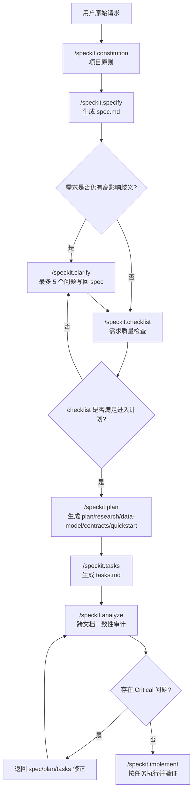
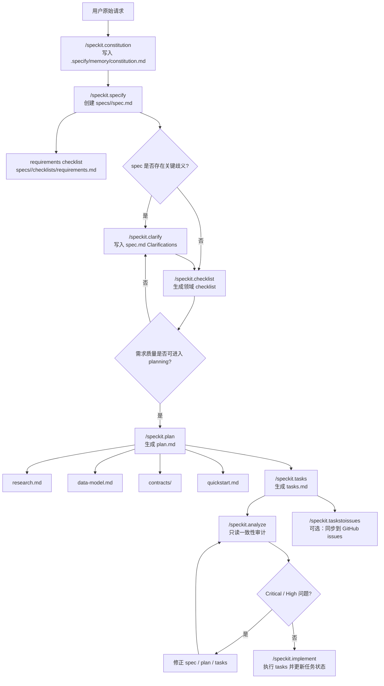

# 资料：Spec Kit 的意图识别、意图整理与文档生成机制

> 资料用途：帮助理解 [github/spec-kit](https://github.com/github/spec-kit) 如何把“用户想做什么”的自然语言输入，转成可版本化的 `spec.md`、`plan.md`、`tasks.md`、checklists、constitution、workflow gate 与实现执行链。本文不是正式系列文章，而是面向后续写作、框架对比或团队落地的研究笔记。
>
> 资料读取于：2026-05-21  
> 资料版本：`github/spec-kit` main 分支，commit `0964f113b74b454b90177da252f14f94690a3d2e`；最新 release 为 `v0.8.12`，发布于 2026-05-20；main 分支 `pyproject.toml` 标记版本为 `0.8.13.dev0`。  
> 主要来源：`README.md`、`spec-driven.md`、`docs/quickstart.md`、`docs/concepts/sdd.md`、`docs/reference/core.md`、`docs/reference/integrations.md`、`docs/reference/presets.md`、`docs/reference/workflows.md`、`templates/commands/*.md`、`templates/*-template.md`、`scripts/bash/*.sh`、`workflows/speckit/workflow.yml`、`extensions/git/extension.yml`、`src/specify_cli/integrations/*`

---

## 1. 快速结论

`Spec Kit` 的核心不是“帮 Agent 写一份需求文档”，而是把 AI 编程流程拆成一条可审计的契约链：

```text
constitution
  -> specify
  -> clarify
  -> checklist
  -> plan
  -> tasks
  -> analyze
  -> implement
```

这条链路把“用户自然语言”逐层压成不同粒度的工程事实：

| 阶段 | 核心命令 / 文件 | 产物 | 作用 |
| --- | --- | --- | --- |
| 项目原则 | `/speckit.constitution` | `.specify/memory/constitution.md` | 把团队原则、质量门槛、治理规则写成后续阶段的最高约束 |
| 功能规格 | `/speckit.specify` | `specs/<feature>/spec.md`、`checklists/requirements.md` | 将用户描述转成用户故事、需求、成功标准和假设 |
| 需求澄清 | `/speckit.clarify` | `spec.md` 的 `Clarifications` 段 | 用最多 5 个高影响问题降低歧义 |
| 需求质量校验 | `/speckit.checklist` | `specs/<feature>/checklists/*.md` | 检查“需求写得是否足够清楚”，不是检查代码是否工作 |
| 技术计划 | `/speckit.plan` | `plan.md`、`research.md`、`data-model.md`、`contracts/`、`quickstart.md` | 将业务需求翻译为架构、技术选择、数据模型和接口契约 |
| 任务拆分 | `/speckit.tasks` | `tasks.md` | 按用户故事生成可执行、依赖有序、可并行的任务列表 |
| 跨文档分析 | `/speckit.analyze` | 分析报告 | 只读检查 `spec.md`、`plan.md`、`tasks.md` 的一致性和覆盖率 |
| 实现执行 | `/speckit.implement` | 代码变更、任务勾选、验证输出 | 按 `tasks.md` 执行，遇到未完成 checklist 时必须询问是否继续 |

它的设计重点有三点：

1. **规格是源头，不是注释**：SDD 把 specification 定位为主要资产，代码是从规格和计划生成出来的表达。
2. **自然语言被结构化模板约束**：`spec-template.md`、`plan-template.md`、`tasks-template.md` 迫使 Agent 分离 what / why / how，并显式记录假设、成功标准、依赖和任务路径。
3. **门控分散在多个层级**：clarification、checklist、constitution check、workflow gate、analyze、implementation checklist status 都在不同阶段阻止 Agent 直接“vibe coding”。

与 `agent-skills`、`superpowers`、`gstack` 这类 skill 仓库不同，Spec Kit 的“skill”并不主要表现为 `SKILL.md` 文件。它通过 `specify init` 将命令模板、脚本、上下文文件和 agent integration 写入目标项目；在 Codex / Claude 等 skills-based agent 下，这些命令会被渲染成 `speckit-<command>/SKILL.md`。

---

## 2. 框架意图：为什么需要 Spec Kit

Spec Kit 要解决的不是模型不会写代码，而是 AI 编程流程里意图、计划、任务和实现之间缺少稳定契约的问题。

`spec-driven.md` 的根本立场可以概括为：传统开发里代码是事实源，规格只是辅助材料；Spec-Driven Development 反过来让规格成为事实源，代码成为规格在某个技术栈里的实现表达。

这种设计针对的失败模式如下：

| 失败模式 | 典型表现 | Spec Kit 的处理方式 |
| --- | --- | --- |
| 用户意图被过早技术化 | 用户说“照片相册”，Agent 直接选前端框架、数据库和上传方案 | `/speckit.specify` 明确要求先写 what / why，不写 how |
| 模糊需求被默认补齐 | “安全”“快速”“直观”等词没有指标 | `/speckit.clarify` 按影响度提出最多 5 个澄清问题；`checklist` 要求量化模糊词 |
| 需求文档不可测试 | 只有功能描述，没有独立验收路径 | `spec-template.md` 要求每个用户故事都有优先级、独立测试和 Given/When/Then 场景 |
| 技术计划脱离需求 | 架构选择无法追溯到具体需求 | `/speckit.plan` 要生成 research、data model、contracts 和 quickstart，并进行 constitution check |
| 任务拆分横向割裂 | 数据库、API、UI 分别做完后才知道功能不可用 | `/speckit.tasks` 按用户故事组织 phase，每个故事必须能独立测试 |
| 实现前缺少一致性审计 | `tasks.md` 漏掉 FR，或任务引用了不存在的组件 | `/speckit.analyze` 只读扫描 spec/plan/tasks 的覆盖、冲突、重复、歧义 |
| Agent 忽略质量门槛 | checklist 未完成仍开始写代码 | `/speckit.implement` 遇到未完成 checklist 必须停下询问是否继续 |
| 团队规则无法注入 Agent | 不同 Agent、不同会话各自发挥 | `constitution.md`、context file、integration 和 templates 让规则文件化、可版本化 |

因此，Spec Kit 的工程价值不是多生成几份 Markdown，而是将 AI 开发中的隐性认知状态外化为文件：

```text
用户意图 -> 需求契约 -> 技术契约 -> 任务契约 -> 一致性审计 -> 实现证据
```

这使得后续讨论可以围绕文件、diff、checklist 和 gate 展开，而不是围绕一次聊天上下文里的临时理解展开。

---

## 3. 相关 Skill / Command 总览

本文不完整覆盖 Spec Kit 的所有 CLI、preset、extension 和 workflow 能力。本文只选择与“意图识别、意图整理、计划拆分、文档生成、执行门控”直接相关的核心命令和支撑机制。

| Role | Source file | Why it matters |
| --- | --- | --- |
| Meta/router | `specify init`、`src/specify_cli/integrations/*`、`templates/commands/*.md`、`workflows/speckit/workflow.yml` | 将同一组 Spec Kit 命令安装到不同 Agent，并通过 handoffs / workflow gate 编排阶段 |
| Project principles | `templates/commands/constitution.md`、`templates/constitution-template.md` | 将团队不可妥协原则写入 `.specify/memory/constitution.md`，成为计划和分析的上位约束 |
| Intent extraction | `templates/commands/specify.md`、`templates/spec-template.md` | 从用户自然语言抽取 actors、actions、data、constraints，生成功能规格 |
| Clarification | `templates/commands/clarify.md` | 对 spec 做歧义扫描，以最多 5 个高影响问题减少需求重工风险 |
| Requirements checklist | `templates/commands/checklist.md`、`templates/checklist-template.md` | 生成需求质量 checklist，检查需求文本本身是否完整、清晰、一致、可测 |
| Spec / PRD | `templates/spec-template.md` | 固定用户故事、FR、SC、假设和实体结构，是后续计划输入 |
| Planning | `templates/commands/plan.md`、`templates/plan-template.md` | 从 spec 和 constitution 生成技术计划、研究、数据模型、接口契约和 quickstart |
| Task breakdown | `templates/commands/tasks.md`、`templates/tasks-template.md` | 将计划拆成按用户故事组织、依赖有序、可并行的任务列表 |
| Verification / gates | `templates/commands/analyze.md`、`templates/commands/implement.md`、`workflows/speckit/workflow.yml` | 在实现前做跨文档一致性审计，并在 workflow 和 checklist 层增加审批门 |
| Issue handoff | `templates/commands/taskstoissues.md` | 将 `tasks.md` 转成 GitHub issues，但要求远程仓库必须匹配 |
| Customization | `docs/reference/presets.md`、`extensions/git/extension.yml`、`scripts/bash/common.sh` | 通过 override / preset / extension / hook 改写流程，而不是改核心代码 |

### 3.1 `specify init` / Integration 层介绍

**中文译解**：这是 Spec Kit 的入口层。它把 `.specify/scripts/`、`.specify/templates/`、agent 命令或 skill、context file、constitution 初始文件和 workflow 安装到目标项目里。

| 项目 | 内容 |
| --- | --- |
| 触发条件 | 用户初始化新项目或在既有目录启用 Spec Kit，例如 `specify init --here --integration codex --integration-options="--skills"`。 |
| 流程 | 选择或指定 integration；安装 agent 命令/skills；安装共享脚本和模板；初始化 `.specify/memory/constitution.md`；写 `.specify/integration.json`、`.specify/init-options.json`；安装默认 workflow。 |
| 结束条件 | 目标项目有 `.specify/` 基础设施、对应 agent 能看到 `/speckit.*` 或 `$speckit-*` 命令，constitution 模板已就绪。 |
| 相关文档 | `.specify/templates/`、`.specify/scripts/`、`.specify/memory/constitution.md`、`.specify/integration.json`、agent context file，例如 `AGENTS.md`、`CLAUDE.md`。 |

### 3.2 `/speckit.constitution` 介绍

**中文译解**：这是项目原则层。它把代码质量、测试、架构、治理、版本规则等团队约束写成后续命令必须读取的上位文档。

| 项目 | 内容 |
| --- | --- |
| 触发条件 | 新项目初始化后，或团队原则发生变化，需要创建或更新 `.specify/memory/constitution.md`。 |
| 流程 | 读取 constitution；填充或推导占位符；按语义版本规则决定版本 bump；同步检查 plan/spec/tasks/commands 等依赖模板；写 Sync Impact Report。 |
| 结束条件 | constitution 无未解释占位符；版本、日期和治理规则明确；依赖模板是否需要更新已记录。 |
| 相关文档 | `.specify/memory/constitution.md`、`.specify/templates/plan-template.md`、`spec-template.md`、`tasks-template.md`、`commands/*.md`。 |

### 3.3 `/speckit.specify` 介绍

**中文译解**：这是意图转规格的核心命令。它把自然语言 feature description 写成 `spec.md`，同时生成 requirements checklist。

| 项目 | 内容 |
| --- | --- |
| 触发条件 | 用户要开始一个新 feature，已经能描述 what / why，但还不应该进入技术实现。 |
| 流程 | 生成 2-4 个词的短名；确定 feature directory；复制 spec template；抽取 actor/action/data/constraint；写用户故事、FR、SC、实体、假设；生成并运行 spec quality checklist。 |
| 结束条件 | `spec.md` 已创建；checklist 已验证；最多 3 个关键 `[NEEDS CLARIFICATION]` 已被用户回答或显式保留；命令报告是否可进入 clarify/plan。 |
| 相关文档 | `specs/<feature>/spec.md`、`specs/<feature>/checklists/requirements.md`、`.specify/feature.json`。 |

### 3.4 `/speckit.clarify` 介绍

**中文译解**：这是需求歧义收敛命令。它不重新写 spec，而是扫描现有 spec，提出少量高影响问题，并把答案增量写回 spec。

| 项目 | 内容 |
| --- | --- |
| 触发条件 | `spec.md` 已存在，但需求仍有高影响不确定性；推荐在 `/speckit.plan` 前运行。 |
| 流程 | 运行 prerequisite 脚本定位 feature；扫描功能范围、数据模型、UX、非功能、外部依赖、边界情况、术语等 taxonomy；最多问 5 个问题；每个答案立即写入 `Clarifications` 并更新相关段落。 |
| 结束条件 | 达到 5 问上限、关键歧义已解决、用户要求停止，或没有值得正式澄清的问题；输出 touched sections 和 coverage summary。 |
| 相关文档 | 更新 `specs/<feature>/spec.md`，新增或追加 `## Clarifications` / `### Session YYYY-MM-DD`。 |

### 3.5 `/speckit.checklist` 介绍

**中文译解**：这是需求质量检查命令。它的检查对象是“需求文本”，不是“实现行为”。它相当于给英文需求写单元测试。

| 项目 | 内容 |
| --- | --- |
| 触发条件 | 需要从某个质量维度审查 spec，例如 UX、API、安全、性能、可访问性；推荐在 plan 前运行。 |
| 流程 | 读取 spec/plan/tasks 的必要片段；最多问 3 个初始问题和 2 个追问；生成领域 checklist；每项检查 completeness、clarity、consistency、measurability、coverage。 |
| 结束条件 | `checklists/<domain>.md` 创建或追加完成；输出项目数量、关注领域、深度和使用者场景。 |
| 相关文档 | `specs/<feature>/checklists/*.md`，例如 `ux.md`、`api.md`、`security.md`、`performance.md`。 |

### 3.6 `/speckit.plan` 介绍

**中文译解**：这是业务规格到技术计划的翻译命令。它读 `spec.md` 和 constitution，把需求转成技术上下文、架构决策、研究结论、数据模型、接口契约和 quickstart。

| 项目 | 内容 |
| --- | --- |
| 触发条件 | `spec.md` 已经足够清晰，用户开始提供技术栈、架构、依赖、平台和约束。 |
| 流程 | 运行 setup script；加载 spec 和 constitution；复制 plan template；填技术上下文；执行 constitution check；Phase 0 生成 research；Phase 1 生成 data-model、contracts、quickstart；更新 agent context。 |
| 结束条件 | Phase 2 planning 结束；所有 unresolved clarification 已解决；constitution gate 通过或例外已记录；报告 plan 和附属产物路径。 |
| 相关文档 | `plan.md`、`research.md`、`data-model.md`、`contracts/`、`quickstart.md`、agent context file。 |

### 3.7 `/speckit.tasks` 介绍

**中文译解**：这是计划到任务的拆分命令。它按用户故事组织任务，而不是按技术层横切，目标是让每个故事都能独立实现、独立测试、独立演示。

| 项目 | 内容 |
| --- | --- |
| 触发条件 | `plan.md` 和 `spec.md` 已存在，准备进入实现前需要生成任务清单。 |
| 流程 | 运行 setup-tasks；读取 plan、spec、data-model、contracts、research、quickstart；抽取用户故事优先级；生成 setup、foundational、每个用户故事、polish 阶段；标记 `[P]` 并写依赖图。 |
| 结束条件 | `tasks.md` 生成；所有任务符合 `- [ ] T001 [P] [US1] Description with file path` 规则；报告任务数、并行机会和 MVP 范围。 |
| 相关文档 | `specs/<feature>/tasks.md`。 |

### 3.8 `/speckit.analyze` 介绍

**中文译解**：这是实现前的一致性审计。它只读，不修文件，用来发现 spec、plan、tasks 之间的冲突、重复、歧义、覆盖缺口和 constitution 违规。

| 项目 | 内容 |
| --- | --- |
| 触发条件 | `/speckit.tasks` 已生成 `tasks.md` 后、`/speckit.implement` 前；也可在实现后作为额外审查。 |
| 流程 | 读取必要的 spec/plan/tasks/constitution 片段；建立 requirements、stories、tasks、constitution 语义模型；做 duplication、ambiguity、underspecification、coverage、constitution alignment、inconsistency 检测；输出分析报告。 |
| 结束条件 | 输出 structured report；若有 CRITICAL，建议实现前修复；不自动修改任何文件。 |
| 相关文档 | 无固定持久化文档；产出是会话中的分析报告。 |

### 3.9 `/speckit.implement` 介绍

**中文译解**：这是执行层命令。它按 `tasks.md` 逐项实现，并把 task checkbox 从未完成改成完成；如果 checklist 未完成，则必须停下问用户是否继续。

| 项目 | 内容 |
| --- | --- |
| 触发条件 | `spec.md`、`plan.md`、`tasks.md` 已存在，且用户明确要执行实现。 |
| 流程 | 检查 feature prerequisites；扫描 checklists；读取 tasks/plan/data-model/contracts/research/constitution/quickstart；验证 ignore files；按 phase、依赖、TDD 顺序执行任务；记录进度和错误。 |
| 结束条件 | 所有 required tasks 完成，测试通过，功能匹配 spec，计划约束被遵守；或遇到失败、未完成 checklist 且用户拒绝继续时停止。 |
| 相关文档 | 修改代码、配置和 `tasks.md`；可能创建或更新 `.gitignore`、`.dockerignore`、`.eslintignore` 等 ignore 文件。 |

### 3.10 `/speckit.taskstoissues` 介绍

**中文译解**：这是任务到 issue 的交接命令。它不是本地实现门控，而是将 `tasks.md` 转成 GitHub issues，便于外部协作追踪。

| 项目 | 内容 |
| --- | --- |
| 触发条件 | `tasks.md` 已存在，且项目 git remote 是 GitHub 仓库。 |
| 流程 | 运行 prerequisite script；解析 tasks 路径；读取 `git config --get remote.origin.url`；只有 remote 是 GitHub URL 且与目标仓库匹配时才创建 issues。 |
| 结束条件 | 所有代表性 tasks 已创建为 GitHub issues；若 remote 非 GitHub 或不匹配，必须停止。 |
| 相关文档 | 不生成本地固定文档；外部产物是 GitHub issues。 |

---

## 4. 意图识别与路由机制

Spec Kit 的路由机制由三层共同构成：

1. **初始化安装层**：`specify init` 根据 integration 将命令渲染到不同 Agent 的目录。例如 Codex 默认安装到 `.agents/skills/speckit-<name>/SKILL.md`，Claude 安装到 `.claude/skills`，GitHub Copilot 可安装成 `.agent.md` 或 skills mode。
2. **命令 handoff 层**：core command frontmatter 里包含下一步建议。例如 `/speckit.specify` 可以 handoff 到 `/speckit.clarify` 或 `/speckit.plan`；`/speckit.tasks` 可以 handoff 到 `/speckit.analyze` 或 `/speckit.implement`。
3. **workflow 层**：`workflows/speckit/workflow.yml` 将 specify、review-spec gate、plan、review-plan gate、tasks、implement 串成 Full SDD Cycle。

默认路径可以表示为：



需要注意：Spec Kit 没有像 `gstack office-hours` 那样的强产品诊断层，也没有像 `superpowers brainstorming` 那样的苏格拉底式单问门控。它的意图处理更偏工程规约：

- `/speckit.specify` 把输入收敛为 spec。
- `/speckit.clarify` 在 spec 上减少歧义。
- `/speckit.checklist` 检查 spec 文本质量。
- `/speckit.plan` 再开始进入技术选择。

换言之，Spec Kit 的路由中心不是“用户真实动机访谈”，而是“文件状态机”：当前是否已有 constitution、spec、clarifications、checklist、plan、tasks、analysis。

---

## 5. 意图抽取 / 澄清机制

Spec Kit 的意图抽取发生在两个命令里：

| 命令 | 处理对象 | 机制 | 输出 |
| --- | --- | --- | --- |
| `/speckit.specify` | 用户 feature description | 抽取 actor、action、data、constraint；按模板写 spec；最多保留 3 个关键 clarification marker | `spec.md`、requirements checklist |
| `/speckit.clarify` | 已存在的 `spec.md` | 按 taxonomy 扫描模糊点；最多问 5 个问题；每个答案立即写回 spec | 更新后的 `spec.md` |

### 5.1 `/speckit.specify` 的抽取纪律

`specify.md` 要求 Agent 从用户描述中识别：

- actor：谁在使用或受影响
- action：他们要完成哪些动作
- data：哪些数据对象被创建、读取、修改或关联
- constraints：范围、安全、隐私、体验、性能等约束

它不会把所有不确定点都抛回用户，而是使用两级策略：

1. **能合理默认的地方，写入 Assumptions**  
   例如普通 Web 应用的错误处理、常见认证方式、通用数据保留策略等，不应该为了形式而问。

2. **只有高影响歧义才标 `[NEEDS CLARIFICATION]`**  
   最多 3 个，优先级是 scope、security/privacy、UX、technical details。这样避免 Agent 把需求阶段拖成无穷问答。

这个设计的工程取舍是：Spec Kit 不追求在第一步完全消灭歧义，而是要求歧义有限、显式、可追踪，并交给后续 `/speckit.clarify` 继续收敛。

### 5.2 `/speckit.clarify` 的 coverage taxonomy

`clarify.md` 的扫描维度比 `specify.md` 更系统。它会把 spec 的状态标成 Clear / Partial / Missing，并从以下维度选择最多 5 个高影响问题：

| 维度 | 典型检查内容 |
| --- | --- |
| Functional Scope & Behavior | 核心目标、成功标准、范围外声明、用户角色 |
| Domain & Data Model | 实体、属性、关系、唯一性、生命周期 |
| Interaction & UX Flow | 关键旅程、错误/空/加载状态、可访问性、本地化 |
| Non-Functional Quality | 性能、扩展性、可靠性、可观测性、安全、合规 |
| Integration & Dependencies | 外部服务、导入导出、协议和版本 |
| Edge Cases & Failure Handling | 负向场景、限流、并发冲突 |
| Constraints & Tradeoffs | 技术约束、取舍、拒绝的替代方案 |
| Terminology & Consistency | 规范术语、同义词漂移 |
| Completion Signals | 验收标准是否可测试、Definition of Done 是否可量化 |

它的关键纪律：

- 一次只问一个问题。
- 问题必须能用 2-5 个互斥选项，或 5 个词以内的短答案回答。
- 每个多选问题要给推荐选项，并说明推荐理由。
- 每个已接受答案都立即写入 spec，减少上下文丢失。
- 不能超过 5 个问题，重试澄清同一个问题不计入新问题。

这使得 clarification 不只是聊天补充，而是对 `spec.md` 的增量 patch。

---

## 6. 意图发散与收敛机制

Spec Kit 没有独立的“idea refinement / brainstorming”命令。它的收敛机制主要来自四个约束：

| 收敛约束 | 所在位置 | 作用 |
| --- | --- | --- |
| what / why 与 how 分离 | `/speckit.specify`、`spec-template.md` | 阻止 Agent 在需求阶段提前写技术栈、API、代码结构 |
| clarification marker 上限 | `/speckit.specify` | 避免把全部不确定性推给用户，只暴露高影响歧义 |
| coverage taxonomy | `/speckit.clarify` | 用固定维度扫描需求遗漏，而不是随意追问 |
| checklist as requirement tests | `/speckit.checklist` | 用 checklist 检查需求文本质量，逼迫“直观/快速/安全”等词变成可验证表达 |

因此，Spec Kit 的收敛不是发散多个方向后择优，而是围绕一个 feature spec 连续降低歧义：

```text
feature description
  -> spec draft with assumptions / clarification markers
  -> targeted clarifications
  -> quality checklist
  -> plan
```

这也意味着它的薄弱点很明确：如果用户最初的问题本身不值得做，Spec Kit 不会像 gstack 那样主动进行价值诊断；它更擅长把“已经决定要做的 feature”推进为清晰、可实现、可审计的工程契约。

---

## 7. Spec / PRD / 需求文档生成机制

`spec-template.md` 是 Spec Kit 的需求文档核心。它强制每个 feature spec 至少具备：

| Section | 工程含义 |
| --- | --- |
| Feature Specification metadata | feature name、branch、created date、status、原始输入 |
| User Scenarios & Testing | 按优先级排列的用户故事，每个故事必须能独立测试 |
| Acceptance Scenarios | 用 Given / When / Then 描述可验证行为 |
| Edge Cases | 边界条件和错误场景 |
| Functional Requirements | `FR-001` 形式的可测试需求 |
| Key Entities | 与数据相关的核心实体和关系 |
| Success Criteria | `SC-001` 形式的可量化、技术无关成功标准 |
| Assumptions | 对未指定内容采用的合理默认值 |

最重要的是两个分离：

1. **用户故事和功能需求分离**  
   用户故事描述价值路径，FR 描述系统必须具备的能力。后续 `/speckit.tasks` 会用用户故事组织任务，用 FR/SC 检查覆盖。

2. **成功标准与技术方案分离**  
   成功标准必须可衡量且技术无关。例如“用户能在 3 分钟内完成结账”比“使用 Redis 优化结账流程”更适合作为 spec 层目标。

`/speckit.specify` 还会生成 `checklists/requirements.md`，用于在进入 planning 前验证：

- 没有实现细节泄漏到 spec。
- 所有必填 section 完成。
- 没有未解决的 `[NEEDS CLARIFICATION]`。
- 需求可测试且无歧义。
- 成功标准可衡量且技术无关。
- 用户场景、edge case、scope、dependencies、assumptions 都明确。

这一点是 Spec Kit 与普通 PRD 写作的区别：spec 生成时就附带质量检查，而不是等实现失败后再补文档。

---

## 8. Plan / Task / Issue 拆分机制

### 8.1 `/speckit.plan`：从需求到技术契约

`plan-template.md` 将计划拆成四类事实：

| 区域 | 内容 |
| --- | --- |
| Summary | 从 spec 抽取主要需求，并结合研究给出技术路径 |
| Technical Context | 语言、依赖、存储、测试、平台、性能、约束、规模 |
| Constitution Check | 根据 constitution 进行前置 gate，并在 Phase 1 后复查 |
| Project Structure | feature 文档目录和实际源码目录 |
| Complexity Tracking | 只有 constitution gate 违反时才填写，记录为什么必须复杂化 |

`/speckit.plan` 的产物不只有 `plan.md`：

```text
specs/<feature>/
├── plan.md
├── research.md
├── data-model.md
├── quickstart.md
└── contracts/
```

其中：

- `research.md` 解决技术上下文里的 unknowns，记录 decision、rationale、alternatives。
- `data-model.md` 将 spec 的实体转成字段、关系、验证规则、状态转换。
- `contracts/` 保存外部接口契约，例如 API、CLI schema、grammar、UI contract。
- `quickstart.md` 保存关键验证场景，供后续实现验收。

### 8.2 `/speckit.tasks`：按用户故事拆成可执行任务

`tasks-template.md` 的核心原则是：任务必须按用户故事组织，每个用户故事都是一个独立可测试的增量。

任务格式必须满足：

```text
- [ ] T001 [P] [US1] Description with file path
```

字段含义：

| 字段 | 作用 |
| --- | --- |
| checkbox | 供 `/speckit.implement` 标记执行进度 |
| Task ID | 稳定引用，例如 T001 |
| `[P]` | 表示任务可并行，前提是不同文件且无未完成依赖 |
| `[US1]` | 表示任务属于哪个用户故事 |
| file path | 避免任务过于抽象，便于 Agent 直接执行 |

阶段顺序通常是：

```text
Phase 1: Setup
Phase 2: Foundational
Phase 3+: User Story phases
Final Phase: Polish & Cross-Cutting
```

Foundational 阶段是硬约束：它完成前，任何用户故事都不应开工。每个用户故事内部如果包含测试任务，测试必须先写并先失败，再写实现。

### 8.3 `/speckit.taskstoissues`：把任务交给 GitHub issue 系统

`taskstoissues.md` 是协作扩展点。它读取 `tasks.md` 并创建 GitHub issues，但有两个强约束：

1. 必须读取当前 git remote。
2. 只有 remote 是 GitHub URL 且目标仓库匹配时，才能创建 issue。

这是一个典型的安全边界设计：任务可以被自动外发，但不能在仓库身份不清时写入外部系统。

---

## 9. Documentation / ADR / Memory 机制

Spec Kit 的“记忆”不是独立 memory store，而是分散在项目文件里：

| 记忆载体 | 内容 |
| --- | --- |
| `.specify/memory/constitution.md` | 项目原则、治理规则、版本、ratification 和 amendment 日期 |
| `specs/<feature>/spec.md` | 用户故事、FR、SC、实体、假设、clarifications |
| `specs/<feature>/plan.md` | 技术上下文、架构选择、constitution gate、复杂度例外 |
| `specs/<feature>/research.md` | 技术决策、理由、替代方案 |
| `specs/<feature>/data-model.md` | 实体、字段、关系、状态转换 |
| `specs/<feature>/contracts/` | 外部接口契约 |
| `specs/<feature>/quickstart.md` | 验证场景 |
| `specs/<feature>/tasks.md` | 任务状态和实现进度 |
| `specs/<feature>/checklists/*.md` | 需求质量门控状态 |
| agent context file | 当前默认 integration 的 Spec Kit 引用，例如 `AGENTS.md`、`CLAUDE.md`、`GEMINI.md` |
| workflow runs | `.specify/workflows/runs/<run_id>/state.json`、`inputs.json`、`log.jsonl` |

这里的工程取舍是：Spec Kit 不试图让 Agent 记住一切，而是让每个阶段的关键决策有一个文件落点。跨会话恢复不是依赖聊天记录，而是重新读取 `.specify/`、`specs/` 和 agent context。

---

## 10. 从意图到文档的完整流程



`workflows/speckit/workflow.yml` 内置的 Full SDD Cycle 是一个较轻的版本：

```text
specify -> review-spec gate -> plan -> review-plan gate -> tasks -> implement
```

它没有把 `clarify`、`checklist`、`analyze` 纳入默认 workflow，但 `docs/quickstart.md` 明确建议生产特性或有明显歧义的工作使用完整路径：

```text
/speckit.constitution -> /speckit.specify -> /speckit.clarify -> /speckit.checklist -> /speckit.plan -> /speckit.tasks -> /speckit.analyze -> /speckit.implement
```

---

## 11. Preset / Extension / Hook：如何定制流程

Spec Kit 的定制层分三类：

| 机制 | 作用 | 典型使用场景 |
| --- | --- | --- |
| Project-local overrides | 单项目覆写模板 | 一个项目临时调整 `spec-template.md` 或 `tasks-template.md` |
| Presets | 改写现有 workflow 的格式、术语、标准 | 合规、行业术语、DDD、敏捷、瀑布、中文化 |
| Extensions | 增加新命令、新 hook、新能力 | Jira 同步、安全评审、V-Model traceability、发布诊断 |

模板解析优先级从高到低是：

```text
.specify/templates/overrides/
  -> .specify/presets/<id>/templates/
  -> .specify/extensions/<id>/templates/
  -> .specify/templates/
```

`scripts/bash/common.sh` 的 `resolve_template` 也实现了同样的解析思路。这意味着团队可以不 fork Spec Kit，而是在项目层、preset 层或 extension 层改变 spec/plan/tasks 的结构。

### 11.1 Git extension 的特殊地位

`extensions/git/extension.yml` 定义了一个默认启用的 Git Branching Workflow。它提供：

- `speckit.git.feature`：在 specify 前创建 feature branch。
- `speckit.git.initialize`：在 constitution 前初始化 git repo。
- `speckit.git.commit`：在 clarify / plan / tasks / implement / checklist / analyze 前后可选提交。
- `speckit.git.validate`、`speckit.git.remote`：验证分支和远程仓库。

它还注册 hook：

| Hook | Command | 是否强制 |
| --- | --- | --- |
| `before_constitution` | `speckit.git.initialize` | mandatory |
| `before_specify` | `speckit.git.feature` | mandatory |
| `before_clarify` / `before_plan` / `before_tasks` 等 | `speckit.git.commit` | optional |
| `after_specify` / `after_plan` / `after_tasks` 等 | `speckit.git.commit` | optional |

这解释了 Spec Kit 的 branch 与 feature directory 关系：

- `before_specify` hook 可以创建或切换 git branch。
- `/speckit.specify` 本身负责创建 `specs/<feature>/spec.md` 和 `.specify/feature.json`。
- 新版本强调 branch name 与 spec directory name 独立；`.specify/feature.json` 是下游命令定位 feature directory 的稳定入口。

### 11.2 Lean preset 的差异

`presets/lean/commands/*.md` 是极简预设，不等同于默认 core commands。它的命令只保留骨架：

| Command | Lean preset 做什么 | 与 core 默认命令相比少了什么 |
| --- | --- | --- |
| `speckit.specify` | 要求用户提供 feature directory，写 `.specify/feature.json` 和 `spec.md` | 没有完整 quality checklist、3 个 clarification marker 规则、自动目录命名细节 |
| `speckit.plan` | 读取 constitution 和 spec，写 `plan.md` | 没有完整 Phase 0/1 产物生成细则 |
| `speckit.tasks` | 读取 constitution/spec/plan，写 dependency-ordered tasks | 没有完整 user-story phase、parallel examples、format validation 细则 |
| `speckit.implement` | 读取 constitution/spec/plan/tasks，按顺序执行 | 没有 checklist status gate、ignore file 生成、详细错误处理 |
| `speckit.constitution` | 创建或更新 constitution | 没有完整同步影响报告和版本 bump 规则 |

因此分析 Spec Kit 时应以 `templates/commands/` 为默认核心协议，以 `presets/lean` 作为可替换的轻量工作流例子。

---

## 12. 相关 Skill / Command 完整中文执行版

### 12.1 `specify init` / Integration 完整中文执行版

来源文件：`README.md`、`docs/reference/core.md`、`docs/reference/integrations.md`、`src/specify_cli/__init__.py`、`src/specify_cli/integrations/codex/__init__.py`、`src/specify_cli/integrations/claude/__init__.py`

#### 元信息

`specify init`：初始化一个 Spec Kit 项目，安装 `.specify` 基础设施、agent integration、命令/skills、上下文文件、constitution 模板和 workflow。

#### 概览

这是 Spec Kit 的部署入口。它不直接生成 feature spec，而是让目标仓库具备执行 SDD 流程的能力。

#### 触发条件

- 新建项目时：`specify init my-project --integration <agent>`。
- 在当前目录启用时：`specify init --here --integration <agent>`。
- 在已有文件目录强制合并时：使用 `--force`。
- 需要指定 Codex skills mode 时：`--integration codex --integration-options="--skills"`。
- 不希望检测本地 agent 工具时：`--ignore-agent-tools`。

#### 流程

1. 解析 integration，支持 Copilot、Claude、Codex、Gemini、Cursor、Windsurf、Goose 等 30+ agent。
2. 根据 integration 安装命令文件或 skill 文件。
3. 安装 `.specify/scripts/<bash|powershell>/` 和 `.specify/templates/`。
4. 初始化 `.specify/memory/constitution.md`，如果已存在则保留。
5. 写入 `.specify/integration.json`，记录默认 integration、已安装 integration、per-integration 设置。
6. 写入 `.specify/init-options.json`，记录 script 类型、integration、branch numbering 等初始化选项。
7. 安装默认 `speckit` workflow。
8. 确保脚本可执行。

#### 输出 / 交付物

- `.specify/scripts/`
- `.specify/templates/`
- `.specify/memory/constitution.md`
- `.specify/integration.json`
- `.specify/init-options.json`
- `.specify/workflows/speckit/workflow.yml`
- agent 命令或 skills，例如 `.agents/skills/speckit-specify/SKILL.md`
- agent context file，例如 `AGENTS.md`、`CLAUDE.md`

#### 与其他 Skill 的关系

这是所有 `/speckit.*` 命令的前置条件。没有初始化，后续命令无法找到 templates、scripts、constitution 和 integration context。

#### 常见合理化与现实

| 合理化 | 现实 |
| --- | --- |
| “只要把 prompt 粘给 Agent 就行。” | Spec Kit 的价值在于项目内持久化模板、脚本和文件状态，不是一次性 prompt。 |
| “不同 Agent 文件格式不重要。” | integration 层会处理不同 agent 的命令目录、参数占位符、技能格式和 context file。 |
| “可以先不写 constitution。” | 后续 plan/analyze 需要 constitution 作为治理约束；跳过会降低门控强度。 |

#### 红旗

- 项目没有 `.specify/`，却尝试运行 `/speckit.plan`。
- 多个 integration 混装但未确认 multi-install safe。
- 修改了 shared templates，却不知道默认 integration 切换会刷新托管模板。
- Codex/Claude skills mode 下仍尝试使用点号 hook 命令名而非 hyphenated skill 名。

#### 结束判断与验证

- [ ] `.specify/templates/` 和 `.specify/scripts/` 已存在。
- [ ] `.specify/memory/constitution.md` 已存在。
- [ ] 目标 agent 可以看到 core commands 或 skills。
- [ ] `.specify/integration.json` 记录了默认 integration。
- [ ] `specify version --features` 能展示本地 CLI 能力。

### 12.2 `/speckit.constitution` 完整中文执行版

来源文件：`templates/commands/constitution.md`、`templates/constitution-template.md`

#### 元信息

`/speckit.constitution`：创建或更新项目 constitution，并保证依赖模板与治理原则保持一致。

#### 概览

Constitution 是 Spec Kit 的项目治理文档。它将质量原则、技术约束、测试纪律、版本规则、审查要求写成后续 spec/plan/tasks/analyze 都要服从的约束。

#### 触发条件

- 新项目首次建立原则。
- 团队调整开发原则、测试策略、架构边界、合规要求。
- 发现 plan template、tasks template 或 command 文件与当前原则不一致。

#### 流程

1. 读取 `.specify/memory/constitution.md`；如果不存在，从 `.specify/templates/constitution-template.md` 复制。
2. 识别所有 `[ALL_CAPS_IDENTIFIER]` 占位符。
3. 从用户输入、README、docs、已有 constitution 推导具体值。
4. 决定 `RATIFICATION_DATE`、`LAST_AMENDED_DATE` 和 `CONSTITUTION_VERSION`。
5. 使用语义版本规则：破坏性原则变更为 MAJOR，新增或重大扩展为 MINOR，非语义修订为 PATCH。
6. 填充原则和治理内容，保证每条原则可声明、可测试、少用模糊语言。
7. 检查并同步依赖文档：plan template、spec template、tasks template、commands、runtime docs。
8. 在 constitution 顶部写 Sync Impact Report。
9. 覆盖写回 `.specify/memory/constitution.md`。

#### 输出 / 交付物

- `.specify/memory/constitution.md`
- Sync Impact Report
- 可能需要同步更新的模板或 docs 列表
- 建议 commit message

#### 与其他 Skill 的关系

- `/speckit.plan` 在 Constitution Check 阶段读取它。
- `/speckit.analyze` 将 constitution 冲突视为 CRITICAL。
- `/speckit.implement` 读取它作为实现约束。

#### 常见合理化与现实

| 合理化 | 现实 |
| --- | --- |
| “原则以后再补。” | 没有 constitution，计划阶段无法判断复杂度和质量门槛是否被违反。 |
| “写成价值观就够了。” | Constitution 需要能被检查，抽象口号不能形成 gate。 |
| “只改 constitution，不改模板。” | 命令明确要求检查依赖模板，否则后续文档仍会按旧规则生成。 |

#### 红旗

- constitution 中仍有未解释的 `[PLACEHOLDER]`。
- 版本号与 Sync Impact Report 不一致。
- 日期不是 ISO `YYYY-MM-DD`。
- 原则只有 “should be good / robust / clean” 等不可测试描述。
- plan template 里的 Constitution Check 与新原则不一致。

#### 结束判断与验证

- [ ] `.specify/memory/constitution.md` 已写入具体原则。
- [ ] 没有未解释的占位符。
- [ ] 版本 bump 逻辑明确。
- [ ] `LAST_AMENDED_DATE` 使用当前变更日期。
- [ ] Sync Impact Report 列出修改、增加、删除和待办。
- [ ] 依赖模板是否需要更新已经检查并记录。

### 12.3 `/speckit.specify` 完整中文执行版

来源文件：`templates/commands/specify.md`、`templates/spec-template.md`

#### 元信息

`/speckit.specify`：从自然语言 feature description 创建或更新功能规格，输出 `spec.md` 和 requirements checklist。

#### 概览

它是 Spec Kit 的意图抽取命令。核心边界是：写 what / why，不写 how。需求可以带合理默认值，但高影响歧义必须显式标记并询问。

#### 触发条件

- 用户要启动一个新 feature。
- 用户能描述要解决的问题或要构建的能力。
- 尚未进入技术栈、代码结构、API 设计阶段。
- 如果用户没有提供 feature description，必须报错，不能要求用户重复非空输入。

#### 流程

1. 执行 `before_specify` extension hook；Git extension 通常会创建 feature branch。
2. 从输入生成 2-4 个词的 feature short name。
3. 解析 feature directory：
   - 用户显式提供 `SPECIFY_FEATURE_DIRECTORY` 时使用它。
   - 否则根据 `.specify/init-options.json` 的 branch numbering 生成 `specs/<prefix>-<short-name>`。
4. 创建 feature directory。
5. 复制 `templates/spec-template.md` 到 `specs/<feature>/spec.md`。
6. 写 `.specify/feature.json`，保存 `feature_directory`。
7. 从用户描述中抽取 actor、action、data、constraint。
8. 写 User Scenarios、Functional Requirements、Success Criteria、Key Entities、Assumptions。
9. 对关键歧义最多保留 3 个 `[NEEDS CLARIFICATION]`，按 scope、security/privacy、UX、technical details 排序。
10. 创建 `checklists/requirements.md`。
11. 按 checklist 验证 spec；失败项最多迭代修复 3 次。
12. 如仍有 clarification marker，一次性向用户列出最多 3 个问题，等待用户回答后写回 spec。
13. 输出 feature directory、spec file、checklist summary 和下一步建议。
14. 执行 `after_specify` extension hook。

#### 输出 / 交付物

- `specs/<feature>/spec.md`
- `specs/<feature>/checklists/requirements.md`
- `.specify/feature.json`
- 可能的 git feature branch

#### 与其他 Skill 的关系

- 上游：`/speckit.constitution`。
- 下游：`/speckit.clarify`、`/speckit.checklist`、`/speckit.plan`。
- `/speckit.plan` 通过 `.specify/feature.json` 定位 active feature。

#### 常见合理化与现实

| 合理化 | 现实 |
| --- | --- |
| “我先把技术栈写进去，方便后面实现。” | spec 阶段必须保持 technology-agnostic，技术栈属于 plan。 |
| “不清楚的都问用户。” | 只问高影响、无合理默认的歧义，最多 3 个 marker。 |
| “成功标准可以写成体验更好。” | Success Criteria 必须可衡量、可验证。 |
| “Checklist 可以嵌在 spec 里。” | 命令明确要求 checklist 是单独文件。 |

#### 红旗

- spec 包含框架、数据库、API、代码结构等 how 细节。
- 用户故事没有独立测试方式。
- FR 没有编号或不可测试。
- Success Criteria 不可量化。
- 仍有超过 3 个 `[NEEDS CLARIFICATION]`。
- 只有功能列表，没有 assumptions 和 scope boundary。

#### 结束判断与验证

- [ ] `spec.md` 已创建在正确 feature directory。
- [ ] `.specify/feature.json` 指向该 feature directory。
- [ ] 用户故事按 P1/P2/P3 排列并可独立测试。
- [ ] FR 和 SC 可测试、可衡量、技术无关。
- [ ] `checklists/requirements.md` 已生成并更新状态。
- [ ] 未解决 clarification 已显式暴露或已回答。

### 12.4 `/speckit.clarify` 完整中文执行版

来源文件：`templates/commands/clarify.md`

#### 元信息

`/speckit.clarify`：识别当前 feature spec 中的欠定义区域，最多问 5 个高价值问题，并将答案写回 spec。

#### 概览

这是 spec 之后、plan 之前的正式澄清阶段。它不创建新 spec，也不进入技术实现，而是减少 downstream rework。

#### 触发条件

- `spec.md` 已存在。
- spec 有 Partial / Missing 的高影响类别。
- 用户显式要求 clarify，或生产功能存在明显歧义。
- 如果用户明确声明跳过 clarification，可以继续，但必须提示后续返工风险。

#### 流程

1. 运行 prerequisite script，以 JSON 读取 `FEATURE_DIR`、`FEATURE_SPEC` 等路径。
2. 读取当前 spec。
3. 按 taxonomy 扫描功能范围、数据模型、UX、非功能、依赖、边界、取舍、术语、完成信号等类别。
4. 生成最多 5 个 candidate questions，但不要一次性展示。
5. 每次只问一个问题：
   - 多选题给 2-5 个互斥选项。
   - 给出推荐选项和 1-2 句理由。
   - 支持用户回复 `yes` / `recommended` 接受推荐。
   - 短答题限制在 5 个词以内。
6. 用户回答后，验证答案是否明确。
7. 第一次写回时创建 `## Clarifications` 和 `### Session YYYY-MM-DD`。
8. 追加 `Q -> A` bullet。
9. 同步更新最相关 section，例如 Functional Requirements、User Stories、Data Model、Success Criteria、Edge Cases、Terminology。
10. 每次答案接受后立即保存 spec。
11. 每次写入后验证无重复、无冲突、无无效占位符、Markdown 结构有效。
12. 结束时输出 questions count、spec path、touched sections、coverage summary 和下一步建议。

#### 输出 / 交付物

- 更新后的 `specs/<feature>/spec.md`
- `Clarifications` session
- 被同步修订的需求、用户故事、数据模型、成功标准或边界情况
- coverage summary

#### 与其他 Skill 的关系

- 上游：`/speckit.specify`。
- 下游：`/speckit.checklist` 或 `/speckit.plan`。
- 它解决的是 plan 之前的需求歧义，不替代 plan 阶段的技术研究。

#### 常见合理化与现实

| 合理化 | 现实 |
| --- | --- |
| “问题多问几个更保险。” | 命令上限是 5 个，优先 Impact * Uncertainty 最高的问题。 |
| “可以把未来问题一起展示。” | 命令要求一次只展示一个问题，不提前泄露 future queue。 |
| “答案记在聊天里就行。” | 每个答案必须立即写回 spec，防止上下文丢失。 |
| “顺便问技术栈。” | 技术栈问题通常属于 planning，除非缺失会阻塞功能正确性。 |

#### 红旗

- 问题不影响架构、数据模型、任务拆分、测试、UX 或合规。
- 问题需要长篇自由回答，无法用短选项收敛。
- Clarifications 记录了答案，但 spec 正文仍保留旧矛盾。
- 超过 5 个问题仍继续追问。
- 未运行 prerequisite script 就猜 feature path。

#### 结束判断与验证

- [ ] 问题数不超过 5。
- [ ] 每个 accepted answer 都写入 `Clarifications`。
- [ ] 相关 section 已同步更新，不只是追加问答。
- [ ] 没有因新答案产生的旧矛盾。
- [ ] Coverage summary 标明 Clear / Resolved / Deferred / Outstanding。
- [ ] 明确建议是否进入 `/speckit.plan`。

### 12.5 `/speckit.checklist` 完整中文执行版

来源文件：`templates/commands/checklist.md`、`templates/checklist-template.md`

#### 元信息

`/speckit.checklist`：根据 feature 上下文生成自定义 checklist，用于验证需求文本的质量、清晰度、完整性和一致性。

#### 概览

这个命令的关键概念是：checklist 检查的是“需求是否写好”，不是“系统是否实现正确”。它不应该包含点击按钮、API 返回 200、组件渲染等实现验证项。

#### 触发条件

- 用户要求生成 UX、API、安全、性能、可访问性、发布等领域的需求质量检查表。
- spec 已经存在，需要在 planning 前检查需求质量。
- plan/tasks 已存在时，也可读取相关上下文增强 checklist。

#### 流程

1. 运行 prerequisite script，获得 `FEATURE_DIR` 和 available docs。
2. 根据用户输入和现有文档，最多提出 3 个初始澄清问题。
3. 如果仍有关键场景类别不清楚，可最多追加 2 个追问。
4. 读取 spec、plan、tasks 的必要片段，避免全量上下文倾倒。
5. 生成 checklist domain，例如 `ux.md`、`api.md`、`security.md`。
6. 如果文件不存在，从 `CHK001` 开始；如果存在，追加新项并延续编号。
7. 每个 checklist item 必须测试需求文本质量：
   - completeness
   - clarity
   - consistency
   - measurability
   - coverage
   - edge cases
   - dependencies / assumptions
8. 至少 80% 项目应带 traceability reference，例如 spec section、`[Gap]`、`[Ambiguity]`、`[Conflict]`。
9. 输出 checklist 文件路径、项目数、关注领域、深度、使用场景。

#### 输出 / 交付物

- `specs/<feature>/checklists/<domain>.md`
- 可能追加到既有 checklist 文件
- 检查项编号 `CHK001`、`CHK002` 等

#### 与其他 Skill 的关系

- 推荐在 `/speckit.plan` 前使用。
- `/speckit.implement` 会扫描 `FEATURE_DIR/checklists/`，若有未完成项则停下询问是否继续。
- 与 `/speckit.analyze` 不同，checklist 关注需求文本质量，analyze 关注 spec/plan/tasks 之间的一致性。

#### 常见合理化与现实

| 合理化 | 现实 |
| --- | --- |
| “写几个测试步骤就行。” | 这是需求质量 checklist，不是 QA 测试用例。 |
| “Verify button works.” | 应改成“按钮行为需求是否明确说明”。 |
| “已有 checklist 直接覆盖。” | 命令要求保留已有内容并追加编号。 |
| “没有 section 引用也可以。” | 至少大部分项目应带 traceability，无法引用时使用 Gap/Ambiguity 等标记。 |

#### 红旗

- checklist item 以测试实现行为为目标。
- 使用 “works properly / displays correctly / functions as expected” 这类不可判定表达。
- 没有区分 completeness、clarity、consistency、measurability。
- 删除或替换了已有 checklist 内容。
- 忽略了用户要求的领域重点。

#### 结束判断与验证

- [ ] checklist 文件创建或追加完成。
- [ ] 每项都是需求文本质量检查，而不是实现测试。
- [ ] 编号连续且无重复。
- [ ] 大部分项目有 spec section 或 gap/ambiguity/conflict traceability。
- [ ] 输出说明 focus areas、depth、actor/timing。
- [ ] checklist 可被 `/speckit.implement` 扫描 checkbox 状态。

### 12.6 `/speckit.plan` 完整中文执行版

来源文件：`templates/commands/plan.md`、`templates/plan-template.md`、`scripts/bash/setup-plan.sh`

#### 元信息

`/speckit.plan`：执行实现规划工作流，基于 spec 和 constitution 生成技术计划与设计产物。

#### 概览

它是 what / why 到 how 的正式转换点。只有在 spec 足够清楚后，才应进入此阶段。

#### 触发条件

- `spec.md` 已存在。
- 用户开始提供技术栈、平台、架构约束、依赖、存储、测试策略。
- specification clarification 已完成，或用户明确接受跳过 clarification 的返工风险。

#### 流程

1. 执行 `before_plan` hook。
2. 运行 `scripts/bash/setup-plan.sh --json`，解析 `FEATURE_SPEC`、`IMPL_PLAN`、`SPECS_DIR`、`BRANCH`。
3. 加载 feature spec 和 `.specify/memory/constitution.md`。
4. 复制并填充 `plan-template.md`。
5. 填写 Technical Context，包括语言、依赖、存储、测试、平台、性能、约束、规模。
6. 根据 constitution 填写 Constitution Check。
7. 若 gate 失败且无正当记录，必须 ERROR。
8. Phase 0：为 unknown、dependency、integration 生成 research tasks，写 `research.md`，解决所有 `NEEDS CLARIFICATION`。
9. Phase 1：从 spec 抽取实体，写 `data-model.md`。
10. Phase 1：如果有外部接口，写 `contracts/`。
11. Phase 1：写 `quickstart.md`，记录关键验证场景。
12. 更新 agent context file 中 Spec Kit managed section，让它指向当前 plan。
13. Phase 1 后重新执行 Constitution Check。
14. 报告 branch、plan path 和生成产物。
15. 执行 `after_plan` hook。

#### 输出 / 交付物

- `specs/<feature>/plan.md`
- `specs/<feature>/research.md`
- `specs/<feature>/data-model.md`
- `specs/<feature>/contracts/`
- `specs/<feature>/quickstart.md`
- 更新后的 agent context file

#### 与其他 Skill 的关系

- 上游：`/speckit.specify`、`/speckit.clarify`、`/speckit.checklist`。
- 下游：`/speckit.tasks`、`/speckit.analyze`。
- `/speckit.tasks` 必须读取 `plan.md`。

#### 常见合理化与现实

| 合理化 | 现实 |
| --- | --- |
| “spec 不完整也可以先写 plan。” | 命令要求 unresolved clarifications 不能留到 plan 里。 |
| “研究结论可以写在 plan 里。” | Phase 0 的决策、理由、替代方案应进入 `research.md`。 |
| “constitution gate 只是建议。” | 未解释的 gate violation 必须 ERROR。 |
| “contracts 可以后面补。” | 对外接口存在时，应在 plan 阶段定义契约。 |

#### 红旗

- plan 仍有 unresolved `NEEDS CLARIFICATION`。
- Technical Context 只有框架名，没有测试、平台、约束、规模。
- Constitution Check 失败但未写 Complexity Tracking。
- 架构选择没有 rationale 或 alternatives。
- 数据实体只出现在代码设想里，没有 `data-model.md`。

#### 结束判断与验证

- [ ] `plan.md` 已生成并引用正确 spec。
- [ ] Technical Context 完整或明确 N/A。
- [ ] Constitution Check 通过，或例外被记录在 Complexity Tracking。
- [ ] `research.md` 解决 unknowns。
- [ ] `data-model.md`、`contracts/`、`quickstart.md` 已按需生成。
- [ ] agent context file 指向当前 plan。

### 12.7 `/speckit.tasks` 完整中文执行版

来源文件：`templates/commands/tasks.md`、`templates/tasks-template.md`、`scripts/bash/setup-tasks.sh`

#### 元信息

`/speckit.tasks`：根据 spec、plan 和设计产物生成可执行、依赖有序、按用户故事组织的 `tasks.md`。

#### 概览

它把技术计划拆成 LLM 可以直接执行的任务清单。每个任务必须有 checkbox、ID、可选并行标记、用户故事标记和具体文件路径。

#### 触发条件

- `spec.md` 和 `plan.md` 已存在。
- 计划已经通过 review 或至少可执行。
- 准备进入实现前，需要形成任务分解和依赖顺序。

#### 流程

1. 执行 `before_tasks` hook。
2. 运行 `scripts/bash/setup-tasks.sh --json`，读取 `FEATURE_DIR`、`TASKS_TEMPLATE` 和 `AVAILABLE_DOCS`。
3. 读取必需文档：`plan.md`、`spec.md`。
4. 按存在情况读取：`data-model.md`、`contracts/`、`research.md`、`quickstart.md`。
5. 从 plan 提取技术栈、库、结构。
6. 从 spec 提取用户故事和优先级。
7. 从 data model 映射实体到用户故事。
8. 从 contracts 映射接口到用户故事。
9. 从 research 提取 setup tasks。
10. 生成 Phase 1 Setup。
11. 生成 Phase 2 Foundational，作为所有用户故事的 blocker。
12. 按 P1/P2/P3 生成每个用户故事 phase。
13. 若用户要求测试或 spec 要求 TDD，测试任务应位于实现任务前。
14. 标记 `[P]` 只用于不同文件、无未完成依赖的任务。
15. 生成 dependency graph、parallel execution examples、MVP first strategy。
16. 校验所有任务符合 checklist format。
17. 输出任务数、每个用户故事任务数、并行机会、独立测试标准和 MVP scope。
18. 执行 `after_tasks` hook。

#### 输出 / 交付物

- `specs/<feature>/tasks.md`

#### 与其他 Skill 的关系

- 上游：`/speckit.plan`。
- 下游：`/speckit.analyze`、`/speckit.implement`、`/speckit.taskstoissues`。
- `tasks.md` 是 implement 和 taskstoissues 的共同输入。

#### 常见合理化与现实

| 合理化 | 现实 |
| --- | --- |
| “按数据库/API/UI 分任务更清楚。” | Spec Kit 要按用户故事组织，让每个故事可独立交付。 |
| “任务可以写抽象一点。” | 每个任务应包含具体文件路径。 |
| “所有测试最后补。” | 若包含测试任务，应在对应实现前写，并先失败。 |
| “只要顺序大概对就行。” | Foundational 阶段完成前不得进入用户故事实现。 |

#### 红旗

- 任务缺少 `T001` 形式 ID。
- 用户故事任务缺少 `[US1]` 标记。
- 描述没有文件路径。
- `[P]` 任务会修改同一文件或依赖未完成任务。
- 所有任务按技术层横向拆分，无法形成 MVP。
- 没有 independent test criteria。

#### 结束判断与验证

- [ ] `tasks.md` 已生成。
- [ ] 所有任务符合 `- [ ] T001 [P] [US1] Description with file path` 格式。
- [ ] 每个用户故事有独立目标和独立测试方式。
- [ ] Foundational 阶段明确阻塞所有用户故事。
- [ ] 依赖顺序和并行机会已写清。
- [ ] MVP scope 通常指向 User Story 1。

### 12.8 `/speckit.analyze` 完整中文执行版

来源文件：`templates/commands/analyze.md`

#### 元信息

`/speckit.analyze`：在实现前对 `spec.md`、`plan.md`、`tasks.md` 执行只读一致性与质量分析。

#### 概览

这是实现前的审计层。它不修文件，只输出结构化报告和建议，避免 Agent 在文档互相矛盾或任务漏覆盖时开始写代码。

#### 触发条件

- `/speckit.tasks` 已成功生成 `tasks.md`。
- 准备执行 `/speckit.implement` 前。
- 也可以在实现后重复运行，作为额外 review。

#### 流程

1. 执行 `before_analyze` hook。
2. 运行 prerequisite script，要求 tasks 存在。
3. 加载最小必要内容：
   - spec：overview、FR、SC、user stories、edge cases。
   - plan：architecture、stack、phases、technical constraints。
   - tasks：task IDs、descriptions、phase、parallel markers、file paths。
   - constitution：principle names 和 MUST/SHOULD statements。
4. 建立 requirements inventory、user story/action inventory、task coverage mapping、constitution rule set。
5. 检测重复需求。
6. 检测模糊词、TODO、placeholder。
7. 检测欠定义项，例如 requirement 缺 object、task 引用未定义组件。
8. 检测 constitution alignment，任何 MUST 冲突都是 CRITICAL。
9. 检测 coverage gaps：无任务覆盖的 requirement、有 buildable work 的 SC 未入任务。
10. 检测不一致：术语漂移、实体缺失、任务顺序矛盾、需求冲突。
11. 按 CRITICAL/HIGH/MEDIUM/LOW 分级。
12. 输出分析报告、coverage summary、metrics、next actions。
13. 询问是否需要针对 Top N issue 提出具体修复建议，但不能自动应用。
14. 执行 `after_analyze` hook。

#### 输出 / 交付物

- 会话中的 `Specification Analysis Report`
- Findings table
- Coverage Summary Table
- Constitution Alignment Issues
- Metrics
- Next Actions
- 可选 remediation suggestion

#### 与其他 Skill 的关系

- 上游：`/speckit.tasks`。
- 下游：修正 spec/plan/tasks，或进入 `/speckit.implement`。
- 与 `/speckit.checklist` 不同，analyze 检查跨 artifact 一致性，而不是单一需求文本质量。

#### 常见合理化与现实

| 合理化 | 现实 |
| --- | --- |
| “只是分析，顺手修一下。” | 命令严格只读，不允许修改文件。 |
| “低风险可以跳过。” | 对生产功能，analyze 是实现前发现漏覆盖的低成本 gate。 |
| “constitution 可以解释宽一点。” | Constitution MUST 冲突不能在 analyze 内稀释，只能调整 spec/plan/tasks 或单独修 constitution。 |
| “发现很多问题就全部列出来。” | 输出最多 50 个 findings，聚合低信号项。 |

#### 红旗

- 分析报告没有 location 或 recommendation。
- 自动编辑了文件。
- 没有 coverage percentage。
- 将业务 KPI 一律视为 buildable work。
- 忽略 constitution 违规。
- 使用不存在的 section 或 hallucinated artifact。

#### 结束判断与验证

- [ ] `spec.md`、`plan.md`、`tasks.md` 均已存在并被读取。
- [ ] 报告包含 findings table 和 coverage summary。
- [ ] CRITICAL/HIGH/MEDIUM/LOW 分级明确。
- [ ] Constitution conflict 被标为 CRITICAL。
- [ ] 未修改任何文件。
- [ ] 明确建议修复还是可以进入 implement。

### 12.9 `/speckit.implement` 完整中文执行版

来源文件：`templates/commands/implement.md`

#### 元信息

`/speckit.implement`：按照 `tasks.md` 逐项执行实现计划，并验证实现与 spec / plan 一致。

#### 概览

这是 Spec Kit 从文档契约进入代码执行的阶段。它的行为依赖 `tasks.md`，而不是临场重新规划。

#### 触发条件

- `tasks.md` 已存在。
- `spec.md` 和 `plan.md` 已存在。
- 用户明确要开始实现。
- 如果 tasks 缺失，必须建议先运行 `/speckit.tasks`。

#### 流程

1. 执行 `before_implement` hook。
2. 运行 prerequisite script，要求 tasks 存在并纳入 available docs。
3. 扫描 `FEATURE_DIR/checklists/`：
   - 统计每个 checklist 的总项、完成项、未完成项。
   - 如果全部完成，自动继续。
   - 如果存在未完成项，显示状态表并询问用户是否仍继续。
   - 用户拒绝时停止。
4. 读取 tasks、plan、data-model、contracts、research、constitution、quickstart。
5. 检查并创建/补全 ignore files：
   - `.gitignore`
   - `.dockerignore`
   - `.eslintignore` 或 eslint config ignores
   - `.prettierignore`
   - `.npmignore`
   - `.terraformignore`
   - `.helmignore`
6. 解析 tasks phases、dependencies、parallel markers、file paths。
7. 按 phase 顺序执行：
   - Setup
   - Tests
   - Core
   - Integration
   - Polish
8. 遵守依赖：
   - sequential tasks 顺序执行。
   - `[P]` 任务可并行，但同文件任务必须串行。
   - 测试任务在对应实现前。
9. 每完成一个任务，在 `tasks.md` 中将 `- [ ]` 改为完成状态。
10. 失败时停止或按 parallel failure 规则报告。
11. 完成后验证：
   - required tasks 完成。
   - 功能符合 spec。
   - 测试通过并满足 coverage。
   - 实现符合 technical plan。
12. 执行 `after_implement` hook。

#### 输出 / 交付物

- 代码和配置变更
- 更新后的 `tasks.md`
- 可能创建或更新的 ignore files
- 测试和验证输出
- 最终实现摘要

#### 与其他 Skill 的关系

- 上游：`/speckit.tasks`、建议先 `/speckit.analyze`。
- 它读取前面所有文档，不应该绕过 spec/plan/tasks 直接发挥。

#### 常见合理化与现实

| 合理化 | 现实 |
| --- | --- |
| “Checklist 还没勾完也先写。” | 命令要求停下询问用户是否继续。 |
| “实现中发现计划不对，直接改方向。” | 应停止并回到 spec/plan/tasks 修正，而不是静默偏离。 |
| “任务完成不用改 tasks.md。” | 命令明确要求完成任务后更新 checkbox。 |
| “忽略文件可以以后补。” | 实现前应根据实际技术栈创建或补齐 ignore files。 |

#### 红旗

- 没有读取 `tasks.md` 就开始写代码。
- 未完成 checklist 时没有询问用户。
- 任务完成但 checkbox 未更新。
- 跳过测试或没有验证 spec/plan 对齐。
- `[P]` 任务修改同一文件导致冲突。
- 实现新增功能超出 spec 范围。

#### 结束判断与验证

- [ ] 所有 required tasks 被标记完成。
- [ ] 测试通过，或失败原因和 blocker 明确。
- [ ] 实现与 spec 的用户故事和 FR 对齐。
- [ ] 实现与 plan 的技术结构和约束对齐。
- [ ] ignore files 与实际技术栈匹配。
- [ ] 没有未处理的 checklist gate。

### 12.10 `/speckit.taskstoissues` 完整中文执行版

来源文件：`templates/commands/taskstoissues.md`

#### 元信息

`/speckit.taskstoissues`：将已有 `tasks.md` 转换成 GitHub issues，用于跟踪和协作执行。

#### 概览

这是任务交接命令，不是实现命令。它写入外部 GitHub 仓库，因此有严格 remote 校验。

#### 触发条件

- `tasks.md` 已存在。
- 当前 git remote 是 GitHub 仓库。
- 用户希望把任务同步到 issue tracker。

#### 流程

1. 执行 `before_taskstoissues` hook。
2. 运行 prerequisite script，要求 tasks 存在并读取 available docs。
3. 提取 tasks path。
4. 运行 `git config --get remote.origin.url`。
5. 只有 remote 是 GitHub URL 时才继续。
6. 使用 GitHub MCP issue_write 工具，在与 remote 匹配的仓库中创建 issue。
7. 禁止在不匹配的仓库中创建 issues。
8. 执行 `after_taskstoissues` hook。

#### 输出 / 交付物

- GitHub issues
- 无固定本地文档

#### 与其他 Skill 的关系

- 上游：`/speckit.tasks`。
- 可与 `/speckit.implement` 并行作为团队协作交接，但不是必须阶段。

#### 常见合理化与现实

| 合理化 | 现实 |
| --- | --- |
| “仓库名差不多就行。” | 命令明确禁止向不匹配 remote 的仓库创建 issues。 |
| “没有 GitHub remote 也可以手动指定。” | 当前命令要求 remote 是 GitHub URL。 |
| “创建 issue 后就等于执行了任务。” | issue 只是协作追踪，不代表实现完成。 |

#### 红旗

- 当前 remote 不是 GitHub URL。
- MCP 目标仓库与 git remote 不一致。
- `tasks.md` 不存在。
- 将非任务说明误创建为 issue。

#### 结束判断与验证

- [ ] `tasks.md` 已解析。
- [ ] `remote.origin.url` 是 GitHub URL。
- [ ] issue 创建目标与 remote 匹配。
- [ ] 所有创建的 issue 能追溯到 tasks。
- [ ] 未向错误仓库写入任何 issue。

---

## 13. 工程取舍与局限性

Spec Kit 的优势和代价都来自同一个设计：它把 AI 编程变成文件状态机。

| 优势 | 代价 |
| --- | --- |
| 规格、计划、任务可版本化 | 小功能会显得流程偏重 |
| 不同 Agent 共用同一套流程 | integration 复杂度高，需要维护多种命令格式 |
| 模板约束降低 LLM 随意发挥 | 模板质量直接决定输出质量 |
| checklist/analyze 在实现前暴露问题 | 仍需要用户或团队愿意认真 review 文件 |
| preset/extension 可定制组织流程 | 多层 override 可能让实际生效文件不直观，需要 `preset resolve` 辅助排查 |
| workflow gate 支持暂停和恢复 | 默认 Full SDD Cycle 不包含 clarify/checklist/analyze，需要团队主动纳入 |

与其他框架相比：

- 它比 `agent-skills` 更强调 CLI 安装、模板解析、agent integration 和项目目录结构。
- 它比 `superpowers` 的硬门控更温和，允许用户跳过 clarification，但会提示风险。
- 它不像 `gstack` 那样做强产品价值诊断。
- 它的门控更偏文档一致性和需求质量，而不是角色化多专家评审。
- 它非常适合团队统一 AI 编程流程，但对“是否值得做”这类产品判断覆盖较弱。

---

## 14. 参考来源

- [github/spec-kit README](https://github.com/github/spec-kit/blob/0964f113b74b454b90177da252f14f94690a3d2e/README.md)
- [`spec-driven.md`](https://github.com/github/spec-kit/blob/0964f113b74b454b90177da252f14f94690a3d2e/spec-driven.md)
- [`docs/quickstart.md`](https://github.com/github/spec-kit/blob/0964f113b74b454b90177da252f14f94690a3d2e/docs/quickstart.md)
- [`docs/concepts/sdd.md`](https://github.com/github/spec-kit/blob/0964f113b74b454b90177da252f14f94690a3d2e/docs/concepts/sdd.md)
- [`docs/reference/core.md`](https://github.com/github/spec-kit/blob/0964f113b74b454b90177da252f14f94690a3d2e/docs/reference/core.md)
- [`docs/reference/integrations.md`](https://github.com/github/spec-kit/blob/0964f113b74b454b90177da252f14f94690a3d2e/docs/reference/integrations.md)
- [`docs/reference/presets.md`](https://github.com/github/spec-kit/blob/0964f113b74b454b90177da252f14f94690a3d2e/docs/reference/presets.md)
- [`docs/reference/workflows.md`](https://github.com/github/spec-kit/blob/0964f113b74b454b90177da252f14f94690a3d2e/docs/reference/workflows.md)
- [`templates/commands/specify.md`](https://github.com/github/spec-kit/blob/0964f113b74b454b90177da252f14f94690a3d2e/templates/commands/specify.md)
- [`templates/commands/clarify.md`](https://github.com/github/spec-kit/blob/0964f113b74b454b90177da252f14f94690a3d2e/templates/commands/clarify.md)
- [`templates/commands/checklist.md`](https://github.com/github/spec-kit/blob/0964f113b74b454b90177da252f14f94690a3d2e/templates/commands/checklist.md)
- [`templates/commands/plan.md`](https://github.com/github/spec-kit/blob/0964f113b74b454b90177da252f14f94690a3d2e/templates/commands/plan.md)
- [`templates/commands/tasks.md`](https://github.com/github/spec-kit/blob/0964f113b74b454b90177da252f14f94690a3d2e/templates/commands/tasks.md)
- [`templates/commands/analyze.md`](https://github.com/github/spec-kit/blob/0964f113b74b454b90177da252f14f94690a3d2e/templates/commands/analyze.md)
- [`templates/commands/implement.md`](https://github.com/github/spec-kit/blob/0964f113b74b454b90177da252f14f94690a3d2e/templates/commands/implement.md)
- [`templates/commands/constitution.md`](https://github.com/github/spec-kit/blob/0964f113b74b454b90177da252f14f94690a3d2e/templates/commands/constitution.md)
- [`templates/commands/taskstoissues.md`](https://github.com/github/spec-kit/blob/0964f113b74b454b90177da252f14f94690a3d2e/templates/commands/taskstoissues.md)
- [`templates/spec-template.md`](https://github.com/github/spec-kit/blob/0964f113b74b454b90177da252f14f94690a3d2e/templates/spec-template.md)
- [`templates/plan-template.md`](https://github.com/github/spec-kit/blob/0964f113b74b454b90177da252f14f94690a3d2e/templates/plan-template.md)
- [`templates/tasks-template.md`](https://github.com/github/spec-kit/blob/0964f113b74b454b90177da252f14f94690a3d2e/templates/tasks-template.md)
- [`templates/checklist-template.md`](https://github.com/github/spec-kit/blob/0964f113b74b454b90177da252f14f94690a3d2e/templates/checklist-template.md)
- [`templates/constitution-template.md`](https://github.com/github/spec-kit/blob/0964f113b74b454b90177da252f14f94690a3d2e/templates/constitution-template.md)
- [`scripts/bash/common.sh`](https://github.com/github/spec-kit/blob/0964f113b74b454b90177da252f14f94690a3d2e/scripts/bash/common.sh)
- [`scripts/bash/setup-plan.sh`](https://github.com/github/spec-kit/blob/0964f113b74b454b90177da252f14f94690a3d2e/scripts/bash/setup-plan.sh)
- [`scripts/bash/setup-tasks.sh`](https://github.com/github/spec-kit/blob/0964f113b74b454b90177da252f14f94690a3d2e/scripts/bash/setup-tasks.sh)
- [`scripts/bash/check-prerequisites.sh`](https://github.com/github/spec-kit/blob/0964f113b74b454b90177da252f14f94690a3d2e/scripts/bash/check-prerequisites.sh)
- [`workflows/speckit/workflow.yml`](https://github.com/github/spec-kit/blob/0964f113b74b454b90177da252f14f94690a3d2e/workflows/speckit/workflow.yml)
- [`extensions/git/extension.yml`](https://github.com/github/spec-kit/blob/0964f113b74b454b90177da252f14f94690a3d2e/extensions/git/extension.yml)
- [`src/specify_cli/integrations/codex/__init__.py`](https://github.com/github/spec-kit/blob/0964f113b74b454b90177da252f14f94690a3d2e/src/specify_cli/integrations/codex/__init__.py)
- [`src/specify_cli/integrations/claude/__init__.py`](https://github.com/github/spec-kit/blob/0964f113b74b454b90177da252f14f94690a3d2e/src/specify_cli/integrations/claude/__init__.py)
