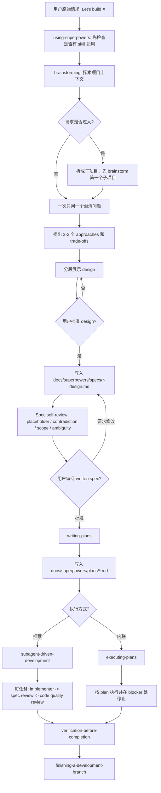

# 资料：Superpowers 的意图识别、意图整理与文档生成机制

> 资料用途：帮助理解 [obra/superpowers](https://github.com/obra/superpowers) 如何通过一组强约束 skill，把“用户想构建某物”的模糊请求转成 design spec、implementation plan、TDD 执行任务与 review/verification 门控。本文不是正式系列文章，而是面向后续写作、框架对比或团队落地的研究笔记。
>
> 资料读取于：2026-05-17  
> 资料版本：`obra/superpowers` main 分支，commit `f2cbfbefebbfef77321e4c9abc9e949826bea9d7`  
> 主要来源：`README.md`、`.codex-plugin/plugin.json`、`.claude-plugin/plugin.json`、`CLAUDE.md`、`skills/using-superpowers/SKILL.md`、`skills/brainstorming/SKILL.md`、`skills/writing-plans/SKILL.md`、`skills/subagent-driven-development/SKILL.md`、`skills/executing-plans/SKILL.md`、`skills/test-driven-development/SKILL.md`、`skills/requesting-code-review/SKILL.md`、`skills/verification-before-completion/SKILL.md`、`skills/finishing-a-development-branch/SKILL.md`、`skills/using-git-worktrees/SKILL.md`

---

## 1. 快速结论

`superpowers` 不是一个“提示词技巧集合”，而是一套强门控的软件开发方法论。它的 README 将自己定义为“complete software development methodology for your coding agents”，核心流程是：

```text
using-superpowers
  -> brainstorming
  -> using-git-worktrees
  -> writing-plans
  -> subagent-driven-development 或 executing-plans
  -> test-driven-development
  -> requesting-code-review
  -> verification-before-completion
  -> finishing-a-development-branch
```

对“意图识别、意图整理、计划拆分、文档生成”而言，主链路可以压缩成四个阶段：

| 阶段 | Skill / 文件 | 作用 |
| --- | --- | --- |
| Meta 路由 | `using-superpowers` | 会话开始即要求先检查 skill，不允许先澄清、先读代码、先动手 |
| 意图澄清 | `brainstorming` | 在任何实现前，通过一问一答和方案对比，把想法变成 design |
| 文档沉淀 | `brainstorming` | 将获批 design 写入 `docs/superpowers/specs/YYYY-MM-DD-<topic>-design.md` |
| 计划拆分 | `writing-plans` | 将 design/spec 拆成 2-5 分钟级别的 TDD 任务，并保存到 `docs/superpowers/plans/YYYY-MM-DD-<feature>.md` |
| 执行门控 | `subagent-driven-development` / `executing-plans` | 逐任务执行，不允许跳过 review、verification 或 blocker |
| 完成门控 | `verification-before-completion` / `finishing-a-development-branch` | 没有新鲜验证证据，不允许声称完成、合并或发 PR |

`superpowers` 最有辨识度的设计，是把“不要过早写代码”做成强制门禁：

```text
没有 design approval -> 不能调用实现 skill
没有 written spec review -> 不能写 implementation plan
没有 implementation plan -> 不能执行开发
没有 failing test -> 不能写 production code
没有 review + verification -> 不能说完成
```

这是一种“物理门控”风格。它不是建议 Agent 更谨慎，而是明确禁止 Agent 使用“这太简单了”“我先看一下”“我先改一点”这类合理化路径绕过流程。

---

## 2. 框架意图：为什么需要 Superpowers

`superpowers` 直接瞄准 AI Coding Agent 的几个高频失败模式：

| 失败模式 | 表现 | Superpowers 的处理方式 |
| --- | --- | --- |
| 过早实现 | 用户说“做一个 todo list”，Agent 直接 scaffold 项目 | `brainstorming` 的 HARD-GATE 阻止任何实现动作 |
| 澄清问题太散 | Agent 一次问 5 个问题，用户随便回答 | `brainstorming` 要求 one question at a time |
| 计划不可执行 | plan 只有“实现 API / 添加 UI / 写测试” | `writing-plans` 要求每步 2-5 分钟、包含具体代码和命令 |
| TDD 变成事后补测 | 先写实现，再写测试证明它工作 | `test-driven-development` 要求没看见测试先失败，就删除实现重来 |
| Review 太晚 | 做完整个功能才发现方向偏了 | `subagent-driven-development` 每个任务后做 spec review 和 code quality review |
| 完成声明不可信 | Agent 说“应该好了”，但没有运行测试 | `verification-before-completion` 要求新鲜命令输出先于成功声明 |
| 分支收尾混乱 | 测试没跑就 merge，或误删 worktree | `finishing-a-development-branch` 用固定菜单和验证顺序收尾 |

它的核心假设是：Agent 的主要问题不是“不会写代码”，而是“会把未验证的想法高速变成代码”。所以它不依赖模型自觉，而是把每个阶段的进入条件和退出条件写死。

---

## 3. 相关 Skill / Command 总览

| Role | Source file | Why it matters |
| --- | --- | --- |
| Meta/router | `skills/using-superpowers/SKILL.md` | 会话级 bootstrap，要求任何响应或动作前先检查 skill |
| Intent extraction | `skills/brainstorming/SKILL.md` | 通过项目上下文探索、单问澄清、方案对比来提炼真实意图 |
| Idea refinement | `skills/brainstorming/SKILL.md` + `skills/brainstorming/visual-companion.md` | 用 2-3 个方案和可选视觉伴侣帮助用户收敛设计 |
| Spec/PRD | `skills/brainstorming/SKILL.md` | 将获批 design 保存为 `docs/superpowers/specs/*-design.md` |
| Planning | `skills/writing-plans/SKILL.md` | 将 spec 拆成极细任务，每步包含代码、命令、预期输出和 commit |
| Documentation/memory | `docs/superpowers/specs/` + `docs/superpowers/plans/` | Superpowers 没有独立 ADR skill，主要通过 spec/plan 文件沉淀上下文 |
| Verification/gates | `test-driven-development`、`requesting-code-review`、`verification-before-completion`、`finishing-a-development-branch` | 用 TDD、review、fresh verification、merge/PR menu 控制执行质量 |
| Execution orchestration | `subagent-driven-development` / `executing-plans` | 前者每任务 fresh subagent + 双 review，后者在当前/独立会话中按 plan 顺序执行 |
| Workspace isolation | `using-git-worktrees` | 在执行实现计划前创建或确认隔离 workspace，避免污染当前分支 |

需要特别说明：`superpowers` 没有专门的“ADR / documentation”核心 skill。它的文档生成重心是 design spec 与 implementation plan，而不是架构决策档案。因此本文的“Documentation / ADR / Memory 机制”会按“spec/plan 型记忆”分析，不为它补一个不存在的 ADR 流程。

### 3.1 `using-superpowers` 介绍

**中文译解**：这是 Superpowers 的会话级路由器。它解决的不是某个具体工程问题，而是 Agent 在任何任务开始前都会出现的“我先做一点”“我先看一下”“我先问个问题”的绕流程冲动。它把 skill check 放在所有动作之前，包括澄清问题之前。

| 项目 | 内容 |
| --- | --- |
| 触发条件 | 任意会话开始、任意用户请求到来、准备执行任何动作前。若当前 Agent 是被派发执行具体任务的 subagent，则跳过。 |
| 流程 | 先判断是否有 skill 适用；只要有 1% 可能适用就调用；若多个 skill 适用，先 process skill，再 implementation skill；如果准备进入 plan mode 且未 brainstorming，则先调用 `brainstorming`。 |
| 怎么结束 | 当前请求已完成 skill 路由；适用 skill 已加载并开始执行；没有用“简单”“先看看”“我记得”等理由绕过流程。 |
| 产生什么文档 | 无固定持久化文档；产生的是会话级路由决策和后续 skill 调用链。 |

### 3.2 `brainstorming` 介绍

**中文译解**：这是 Superpowers 的意图抽取和 design gate。它把“用户想做 X”的入口请求，转成经过澄清、方案对比、分段审批和 written spec review 的设计文档。它最重要的工程价值是阻止 Agent 在没有 design approval 前写代码。

| 项目 | 内容 |
| --- | --- |
| 触发条件 | 任何创造性工作前必须使用，包括创建功能、构建组件、添加功能或修改行为。即使任务看起来很小，也不能跳过。 |
| 流程 | 先探索项目上下文；必要时提供 visual companion；一次只问一个澄清问题；提出 2-3 个 approaches；分段展示 design 并获得用户批准；写入 spec；自检 spec；让用户审阅 written spec；最后转入 `writing-plans`。 |
| 怎么结束 | 用户已批准 design；design spec 已写入并 commit；spec self-review 已修复 placeholder、矛盾、scope 和歧义；用户已审阅 written spec 并批准；下一步只能调用 `writing-plans`。 |
| 产生什么文档 | 默认生成 `docs/superpowers/specs/YYYY-MM-DD-<topic>-design.md`。若用户指定路径，则使用用户路径。 |

### 3.3 `writing-plans` 介绍

**中文译解**：这是 Superpowers 的计划生成器。它不写“高层计划”，而是写给 Agent worker 执行的操作手册：每步 2-5 分钟，包含文件路径、完整代码、测试命令、预期输出和 commit。它防止 plan 变成“实现 API / 添加 UI / 写测试”这种无法执行的空泛清单。

| 项目 | 内容 |
| --- | --- |
| 触发条件 | 已有获批 spec 或明确多步骤需求，且尚未触碰代码时使用。若 spec 覆盖多个独立子系统，应先建议拆成多个 plan。 |
| 流程 | 先检查 scope；锁定文件结构和责任；按 2-5 分钟粒度写 TDD 步骤；禁止 placeholder；写完后对照 spec 做 coverage、placeholder、type consistency 自检；保存 plan；询问用户选择 subagent-driven 还是 inline execution。 |
| 怎么结束 | Plan 已保存；每个 task 都有精确路径、完整代码、测试命令、预期输出和 commit 步骤；自检无缺口；用户已看到两种执行选项。 |
| 产生什么文档 | 默认生成 `docs/superpowers/plans/YYYY-MM-DD-<feature-name>.md`。 |

### 3.4 `subagent-driven-development` 介绍

**中文译解**：这是 Superpowers 推荐的执行编排器。它把 plan 的每个 task 派给 fresh subagent，并在每个 task 后做两阶段 review：先审是否符合 spec，再审代码质量。它防止一个长会话里上下文污染、任务偏航和 review 太晚。

| 项目 | 内容 |
| --- | --- |
| 触发条件 | 已有 implementation plan，任务大多独立，当前平台支持 subagent，并且用户选择在当前会话中连续执行。 |
| 流程 | 读取 plan 并提取所有 task；为每个 task 派发 implementer subagent；处理 DONE / DONE_WITH_CONCERNS / NEEDS_CONTEXT / BLOCKED；派发 spec reviewer；通过后派发 code quality reviewer；review 有问题则修复并复审；全部 task 完成后做 final review；调用 `finishing-a-development-branch`。 |
| 怎么结束 | 所有 task 已完成；每个 task 都通过 spec compliance review 和 code quality review；所有 review 问题已修复并复审；final reviewer 通过；进入 branch finishing。 |
| 产生什么文档 | 无固定新文档；产生的是 commits、task 状态、implementer 报告、spec review 结果、code quality review 结果。 |

### 3.5 `executing-plans` 介绍

**中文译解**：这是没有使用 subagent-driven path 时的计划执行方式。它强调先批判性 review plan，再逐任务严格执行。它不像 subagent-driven 那样每任务派 fresh agent，但仍保留 blocker 停止和 verification 门控。

| 项目 | 内容 |
| --- | --- |
| 触发条件 | 已有书面 implementation plan，需要在当前或独立会话中按 checkpoint 执行；如果平台支持 subagent，应优先推荐 `subagent-driven-development`。 |
| 流程 | 读取 plan；批判性 review；有疑问先问用户；无疑问则建立 TodoWrite；逐 task 执行 plan steps；运行指定 verification；全部完成后调用 `finishing-a-development-branch`。 |
| 怎么结束 | Plan 所有任务执行完成并验证；没有未处理 blocker；完成后进入 branch finishing。遇到缺依赖、测试失败、指令不清或 verification 反复失败时必须停下。 |
| 产生什么文档 | 无固定新文档；使用已有 plan，产生 TodoWrite 状态、命令输出、验证证据和 commits。 |

### 3.6 `test-driven-development` 介绍

**中文译解**：这是 Superpowers 的实现纪律核心。它把“测试先行”写成铁律：没有先失败的测试，就不能写 production code。它防止 Agent 先写实现再补测，把测试变成证明已有实现的装饰。

| 项目 | 内容 |
| --- | --- |
| 触发条件 | 实现新功能、bugfix、重构或行为变更前使用。例外包括一次性原型、生成代码或配置文件，但需要询问用户。 |
| 流程 | 写一个最小 failing test；运行并确认按预期失败；写最小实现；运行并确认通过；绿灯后重构；重复下一行为。若先写了实现，必须删除并从测试重来。 |
| 怎么结束 | 每个新行为都有先失败后通过的测试；所有测试通过；输出无 error/warning；edge cases 和错误路径覆盖；不能满足则回到 RED。 |
| 产生什么文档 | 无固定文档；产生测试文件、测试输出、TDD 红绿验证证据和实现 commit。 |

### 3.7 `requesting-code-review` 介绍

**中文译解**：这是 Superpowers 的 review gate。它要求通过独立 reviewer subagent 检查代码，而不是相信实现者报告。它把 review 前移到每个 task 后，避免缺陷级联到后续任务。

| 项目 | 内容 |
| --- | --- |
| 触发条件 | subagent-driven development 每个 task 后、完成重要功能后、merge 前必须使用；卡住、重构前或复杂 bug 修复后也建议使用。 |
| 流程 | 获取 base/head SHA；用 `code-reviewer.md` 模板派发 reviewer；reviewer 检查 plan alignment、code quality、architecture、testing、production readiness；按 Critical / Important / Minor 处理反馈。 |
| 怎么结束 | Critical 全部修复；Important 在继续前修复或有证据说明 reviewer 错误；Minor 已记录或处理；最终 verdict 明确为 Yes / No / With fixes。 |
| 产生什么文档 | 无固定持久化文档；产生 review 报告，包含 strengths、issues、recommendations、assessment。 |

### 3.8 `verification-before-completion` 介绍

**中文译解**：这是 Superpowers 的完成声明门控。它要求任何“完成 / 修好 / 通过”的声明都必须先有新鲜验证证据。它防止 Agent 用“应该好了”“看起来对”“subagent 说成功”替代真实验证。

| 项目 | 内容 |
| --- | --- |
| 触发条件 | 准备声称完成、已修复、测试通过、构建成功，或准备 commit / PR / 进入下一任务前使用。 |
| 流程 | 识别能证明声明的命令；完整运行最新命令；读取完整输出、exit code 和失败数量；判断输出是否支持声明；只有支持时才带证据陈述结果。 |
| 怎么结束 | 验证命令已运行并读完；输出支持或不支持声明都已如实报告；没有使用过去结果、推测、信心或 agent 报告代替证据。 |
| 产生什么文档 | 无固定文档；产生命令输出、exit code、测试/构建/检查结果等证据。 |

### 3.9 `finishing-a-development-branch` 介绍

**中文译解**：这是 Superpowers 的分支收尾流程。它把“完成后怎么办”固定成验证测试、检测环境、展示选项、执行选择、按 provenance 清理。它防止测试失败还 merge、PR 迭代 worktree 被删、或者误删非自己创建的 workspace。

| 项目 | 内容 |
| --- | --- |
| 触发条件 | 实现完成、测试通过，并需要决定 merge、创建 PR、保留分支或丢弃工作时使用。 |
| 流程 | 先运行项目测试；检测普通 repo / worktree / detached HEAD；确定 base branch；展示 4 个标准选项或 detached HEAD 下 3 个选项；按用户选择执行 merge、PR、keep 或 discard；仅在特定选项和可确认 provenance 时清理 worktree。 |
| 怎么结束 | 用户已选择明确选项；若 merge，merge 后测试通过并安全清理；若 PR，branch 已 push 且 worktree 保留；若 keep，不清理；若 discard，用户输入 `discard` 并只删除可安全删除的工作。 |
| 产生什么文档 | 可能生成 PR body；否则无固定文档。产生测试输出、merge/PR/branch 状态、清理记录。 |

### 3.10 `using-git-worktrees` 介绍

**中文译解**：这是 Superpowers 的执行前隔离机制。它在实现计划前确认是否已有隔离 workspace，优先使用平台原生 worktree 工具，最后才 fallback 到 `git worktree`。它防止污染当前分支，也防止和 harness 的 workspace 管理打架。

| 项目 | 内容 |
| --- | --- |
| 触发条件 | 开始需要隔离的功能开发，或执行 implementation plan 前使用。若已经在 linked worktree 且不是 submodule，不再创建新 worktree。 |
| 流程 | 检测 `GIT_DIR` / `GIT_COMMON` 和 submodule；必要时询问是否创建隔离 worktree；优先用原生工具；fallback 时选择目录并确认 ignore；运行项目 setup；运行 baseline tests。 |
| 怎么结束 | 已确认隔离 workspace 或用户明确选择在当前目录工作；依赖 setup 已完成；baseline tests 已运行；测试失败时已报告并等待用户决定。 |
| 产生什么文档 | 通常不生成文档；可能更新 `.gitignore` 并 commit。产生 worktree 路径、baseline 测试输出和准备就绪报告。 |

---

## 4. 意图识别与路由机制

`using-superpowers` 是 Superpowers 的元 skill。它的作用不是解释某个具体工作怎么做，而是强制 Agent 在任何响应、澄清问题、文件读取或实现动作之前，先判断是否有 skill 适用。

它的关键规则可以概括为：

```text
如果有 1% 可能某个 skill 适用，就必须调用 skill。
如果 skill 适用于当前任务，就没有选择，必须使用。
```

这条规则针对的是 Agent 常见的自我合理化：

- “这是个简单问题，不需要 skill。”
- “我先问个澄清问题。”
- “我先读一下代码。”
- “我记得这个 skill 怎么用。”
- “我只做这一小步。”

在 Superpowers 里，这些都被视为 red flags。它要求 skill check 在澄清问题之前发生，因为 skill 决定的是“应该如何澄清、如何探索、如何执行”。

### 路由优先级

当多个 skill 可能适用时，Superpowers 要求先使用 process skills，再使用 implementation skills：

| 用户请求 | 首先触发 | 后续可能触发 |
| --- | --- | --- |
| “Let's build X” | `brainstorming` | `writing-plans`、`using-git-worktrees`、`subagent-driven-development` |
| “Fix this bug” | `systematic-debugging` | `test-driven-development`、`verification-before-completion` |
| “Implement this plan” | `executing-plans` 或 `subagent-driven-development` | `requesting-code-review`、`finishing-a-development-branch` |
| “Complete / merge / PR this branch” | `finishing-a-development-branch` | `verification-before-completion` |

这个路由层的设计重点是：用户指令说明“做什么”，skill 规定“怎么做”。除非用户显式覆盖流程，否则不能把“帮我实现 X”理解成“跳过 brainstorming 和 planning”。

---

## 5. 意图抽取 / 澄清机制

Superpowers 的意图抽取集中在 `brainstorming`。

### 5.1 HARD-GATE

`brainstorming` 明确写着：在 design 被展示并且用户批准之前，不允许调用任何实现 skill，不允许写代码，不允许 scaffold 项目，不允许采取任何实现动作。这个门控适用于每个项目，不管 Agent 认为它多简单。

这和普通“建议先问清楚”不同。普通建议容易被 Agent 用“这次很简单”绕过；Superpowers 把它写成硬门禁。

### 5.2 一次只问一个问题

它要求：

- 先探索项目上下文：文件、文档、近期提交。
- 如果请求太大，先提示拆成子项目。
- 对合适范围的项目，一次只问一个问题。
- 优先多选题，但开放问题也可以。
- 关注 purpose、constraints、success criteria。

这里的一次一问并不是风格偏好，而是降低用户认知负担。Agent 如果一次抛出 6 个问题，用户往往只回答最容易的两个；关键约束会被遗漏。

### 5.3 方案对比

`brainstorming` 要求在定稿前提出 2-3 个 approaches，并说明 trade-offs 和推荐方案。它不是只追问需求，还要把可选实现路径摆出来，让用户在可比较的方案中做决定。

### 5.4 分段设计审批

当 Agent 认为已经理解要构建什么后，不能一次抛出完整长文档，而要按复杂度分段展示 design，并在每段之后询问是否正确。必须覆盖：

- architecture
- components
- data flow
- error handling
- testing

这让用户在设计进入文档前逐段纠偏。

---

## 6. 意图发散与收敛机制

Superpowers 没有单独的 `idea-refine` skill，发散与收敛由 `brainstorming` 承担。

它的发散机制不是“生成很多创意”，而是“生成少量可评估方案”：

```text
用户想法
  -> 单问澄清
  -> 判断范围是否过大
  -> 提出 2-3 个 approaches
  -> 对比取舍
  -> 推荐一个方向
  -> 分段展示 design
  -> 用户逐段批准
```

其中最重要的收敛机制是 YAGNI。`brainstorming` 要求 ruthlessly 移除不必要功能。也就是说，它并不鼓励 Agent 把用户想法扩写成更大的产品，而是把想法压缩到一个可实现、可验证、可计划的 design。

如果主题涉及视觉问题，它还提供 `visual-companion.md`：在用户同意后，Agent 可以启动浏览器视觉伴侣，用 HTML mockup、diagram、layout comparison 支持决策。但它明确规定：视觉伴侣是工具，不是模式。每个问题都要判断“用户看到它是否比阅读文字更容易理解”。概念问题仍然用终端文本处理。

---

## 7. Spec / PRD / 需求文档生成机制

Superpowers 的需求文档叫 design spec，默认保存到：

```text
docs/superpowers/specs/YYYY-MM-DD-<topic>-design.md
```

它由 `brainstorming` 在 design 获批后生成。生成之后还有两个门：

1. **Spec self-review**：Agent 自己检查 placeholder、内部矛盾、scope、ambiguity。
2. **User review gate**：Agent 要求用户打开并审阅 spec 文件，用户批准前不能继续写 plan。

Spec 自检包含四个维度：

| 检查项 | 目的 |
| --- | --- |
| Placeholder scan | 清除 `TBD`、`TODO`、不完整章节、模糊需求 |
| Internal consistency | 确认架构、功能描述、数据流之间不互相矛盾 |
| Scope check | 判断是否适合一个 implementation plan，过大则拆子项目 |
| Ambiguity check | 找出可能有两种解释的需求，并明确选择一种 |

这个机制的核心是：design 文档不是会话记录，而是 implementation plan 的输入合约。它必须经过用户审阅，才能进入下一阶段。

---

## 8. Plan / Task / Issue 拆分机制

Superpowers 的 `writing-plans` 非常激进。它要求 implementation plan 假设执行者是：

```text
有开发能力，但几乎不了解代码库和问题域；
判断力一般；
测试设计能力不强。
```

因此 plan 不能只写“做什么”，必须写到“怎么做”：

- 精确文件路径。
- 每个任务的完整代码片段。
- 具体测试命令。
- 预期输出。
- 每步 2-5 分钟。
- 每步都可以打勾。
- 每个任务都按 RED-GREEN-REFACTOR 组织。
- 经常 commit。

默认保存路径：

```text
docs/superpowers/plans/YYYY-MM-DD-<feature-name>.md
```

Plan 的 header 必须包含 agentic worker 提示：

```markdown
> **For agentic workers:** REQUIRED SUB-SKILL: Use superpowers:subagent-driven-development (recommended) or superpowers:executing-plans to implement this plan task-by-task. Steps use checkbox (`- [ ]`) syntax for tracking.
```

这说明 Superpowers 的 plan 不是给人类“理解方向”的文档，而是给 Agent “逐步执行”的操作手册。

---

## 9. Documentation / ADR / Memory 机制

Superpowers 的持久化文档主要有两类：

| 类型 | 生成者 | 默认路径 | 用途 |
| --- | --- | --- | --- |
| Design spec | `brainstorming` | `docs/superpowers/specs/YYYY-MM-DD-<topic>-design.md` | 保存获批设计，作为 plan 输入 |
| Implementation plan | `writing-plans` | `docs/superpowers/plans/YYYY-MM-DD-<feature>.md` | 保存可执行任务，作为执行输入 |

它没有独立 ADR skill，也没有长期 knowledge base 或 memory skill。相比 `agent-skills` 或 `compound-engineering`，Superpowers 的知识沉淀更短链路、更面向当次开发：

```text
Design spec 约束本次要构建什么
Implementation plan 约束本次怎么构建
Review / verification 约束本次是否完成
```

这种选择有优点：流程简单，门控清楚，强制执行成本低。代价是跨项目知识复利较弱；如果团队希望沉淀架构决策或长期上下文，需要额外接入 ADR 或 knowledge base 机制。

---

## 10. 从意图到文档的完整流程



### 阶段产物表

| 阶段 | 输入 | 动作 | 输出 |
| --- | --- | --- | --- |
| Bootstrap | 用户请求 | skill 检查和流程路由 | 选择 `brainstorming` / debugging / executing 等 |
| Brainstorm | 原始想法 + 项目上下文 | 澄清、方案对比、分段设计审批 | 获批 design |
| Spec | 获批 design | 写文档、自检、用户审阅 | `docs/superpowers/specs/*-design.md` |
| Plan | 获批 spec | 文件结构锁定、2-5 分钟任务拆分、TDD 步骤 | `docs/superpowers/plans/*.md` |
| Execution | plan | subagent 或 inline 按任务执行 | commits、task completion |
| Review | 每个任务 diff | spec compliance + code quality | issues fixed / approved |
| Completion | 已完成实现 | fresh verification + branch finish menu | merge / PR / keep / discard |

---

## 11. 相关 Skill 完整中文执行版

本节保留“完整中文执行版”，用于弥补前文中文译解可能遗漏的细节。翻译策略不是逐句照搬英文，而是逐节覆盖原 `SKILL.md` 的触发条件、流程、反模式、红旗、结束判断与验证条件。

### 11.1 `using-superpowers` 完整中文执行版

来源：`skills/using-superpowers/SKILL.md`

#### 元信息

```yaml
---
name: using-superpowers
description: 任意会话开始时使用。它建立如何发现和使用 skills 的规则，要求在任何响应之前，包括澄清问题之前，先调用 Skill 工具。
---
```

#### 概览

`using-superpowers` 是 Superpowers 的启动规则。它要求 Agent 在任何任务、任何澄清、任何探索动作之前，先判断是否有相关 skill。只要有极低概率某个 skill 适用，就必须加载它再决定是否执行。

如果当前 Agent 是被派发的 subagent，且只负责执行一个具体任务，则跳过该 skill，避免子任务被会话级 bootstrap 干扰。

#### 优先级规则

执行优先级：

1. 用户显式指令最高，包括 `CLAUDE.md`、`GEMINI.md`、`AGENTS.md` 或直接请求。
2. Superpowers skills 其次；它们可以覆盖默认系统行为。
3. 默认系统提示优先级最低。

如果用户项目文件要求“不使用 TDD”，而 Superpowers 的 TDD skill 说总是使用 TDD，应服从用户项目指令。用户始终控制最终流程。

#### 如何访问 Skill

不同平台加载 skill 的方式不同：

| 平台 | 调用方式 |
| --- | --- |
| Claude Code | 使用 `Skill` 工具，不要直接用 Read 读 skill 文件 |
| Copilot CLI | 使用 `skill` 工具 |
| Gemini CLI | 使用 `activate_skill` 工具 |
| 其他平台 | 按平台文档加载 |

Skill 文本中可能使用 Claude Code 的工具名。非 Claude Code 平台需要按参考文件映射工具：Copilot 读 `references/copilot-tools.md`，Codex 读 `references/codex-tools.md`，Gemini 通过 `GEMINI.md` 自动加载映射。

#### 核心规则

在任何响应或行动前，先调用相关或被请求的 skill。哪怕只有很小概率适用，也要调用 skill 检查。

执行顺序：

1. 收到用户消息。
2. 判断是否可能有 skill 适用。
3. 如果可能，调用 skill。
4. 宣告正在使用哪个 skill 以及目的。
5. 如果 skill 有 checklist，为 checklist 建立任务。
6. 按 skill 执行。
7. 再响应用户或继续操作。

如果完全确定没有任何 skill 适用，才可以不调用。

#### 进入 Plan Mode 前的特殊规则

如果准备进入 plan mode，但还没有经过 brainstorming，就先调用 `brainstorming`。这保证任何 implementation planning 前都已经经历 design refinement。

#### 红旗

以下想法都说明 Agent 正在合理化绕过流程：

| 想法 | 实际含义 |
| --- | --- |
| “这只是个简单问题。” | 问题也是任务，应检查 skill。 |
| “我先要更多上下文。” | skill check 先于澄清问题。 |
| “我先探索代码库。” | skill 告诉 Agent 应如何探索。 |
| “我先快速看下 git / 文件。” | 文件没有会话上下文，仍要先检查 skill。 |
| “这不需要正式 skill。” | 如果 skill 存在，就使用它。 |
| “我记得这个 skill。” | skill 会变化，必须加载当前版本。 |
| “这不算任务。” | 只要要行动，就是任务。 |
| “skill 太重了。” | 简单任务也会变复杂，流程用于防错。 |
| “我先做这一件小事。” | 任何动作之前先检查 skill。 |
| “我知道这个概念。” | 知道概念不等于使用 skill。 |

#### Skill 优先级

多个 skill 可能适用时：

1. 先使用 process skills，例如 `brainstorming`、`systematic-debugging`。它们决定如何处理任务。
2. 再使用 implementation skills，例如前端、MCP 或其他领域实现 skill。

示例：

- “Let's build X” 先触发 `brainstorming`，再触发具体实现 skill。
- “Fix this bug” 先触发 `systematic-debugging`，再触发相关实现或测试 skill。

#### Skill 类型

- **Rigid skills**：例如 TDD、debugging。必须严格遵守，不允许用“适应场景”为由削弱纪律。
- **Flexible skills**：例如模式类 skill。可以按上下文调整原则。

具体以 skill 自身说明为准。

#### 用户指令与流程关系

用户指令说明“做什么”，不自动说明“跳过什么流程”。“添加 X”或“修复 Y”不代表可以跳过 brainstorming、debugging、TDD 或 verification。

#### 结束判断与验证

`using-superpowers` 是路由与流程启动 skill。它结束于：

- [ ] 已判断当前任务是否有任何 Superpowers skill 适用。
- [ ] 如有适用 skill，已调用并开始遵循该 skill。
- [ ] 如果多个 skill 适用，已优先选择 process skill。
- [ ] 如果准备规划实现，且此前没有 brainstorming，已先调用 `brainstorming`。
- [ ] 没有用“简单”“先看看”“我记得”等理由绕过 skill 调用。

---

### 11.2 `brainstorming` 完整中文执行版

来源：`skills/brainstorming/SKILL.md`，并参考 `skills/brainstorming/visual-companion.md`

#### 元信息

```yaml
---
name: brainstorming
description: 任何创造性工作前必须使用，包括创建功能、构建组件、添加功能或修改行为。它在实现前探索用户意图、需求和设计。
---
```

#### 概览

`brainstorming` 用自然协作对话，把粗略想法变成完整 design/spec。它先理解当前项目上下文，再一次只问一个问题来细化想法；当 Agent 理解要构建什么后，分段展示设计并获得用户批准。

#### HARD-GATE

在已经展示 design 且用户批准之前，禁止：

- 调用任何 implementation skill。
- 写任何代码。
- scaffold 项目。
- 执行任何实现动作。

这个规则适用于所有项目。即使是 todo list、单函数工具或配置改动，也必须先展示设计并获得批准。设计可以很短，但不能没有。

#### Checklist

必须按顺序为每一项建立任务并完成：

1. **探索项目上下文**：检查文件、文档、近期 commits。
2. **提供视觉伴侣**：如果后续问题涉及视觉判断，单独发一条消息询问是否使用 visual companion。
3. **提澄清问题**：一次只问一个，理解目的、约束、成功标准。
4. **提出 2-3 个 approaches**：说明取舍和推荐方案。
5. **展示 design**：按复杂度分段，逐段获取用户批准。
6. **写 design doc**：保存到 `docs/superpowers/specs/YYYY-MM-DD-<topic>-design.md` 并 commit。
7. **Spec self-review**：检查 placeholder、矛盾、歧义、scope。
8. **用户审阅 written spec**：要求用户审阅 spec 文件后再继续。
9. **转向实现**：调用 `writing-plans` 创建 implementation plan。

终态是调用 `writing-plans`。Brainstorming 结束后不允许直接调用前端、MCP 或其他实现 skill。

#### 流程

**理解想法**

- 先查看当前项目状态，包括文件、文档、近期 commits。
- 如果用户请求包含多个独立子系统，例如 chat、file storage、billing、analytics，立即提示范围过大。
- 对过大的项目，先拆成子项目：独立部分是什么、关系是什么、构建顺序是什么。
- 每个子项目单独经历 spec -> plan -> implementation cycle。
- 对合适范围的项目，一次只问一个问题。
- 优先使用多选题，开放题也可以。
- 聚焦 purpose、constraints、success criteria。

**探索 approaches**

- 提出 2-3 个不同 approaches。
- 用对话方式说明 trade-offs。
- 先给推荐方案，并解释为什么推荐。

**展示 design**

- Agent 自认为理解后，展示设计。
- 每个 section 按复杂度调整长度：简单场景几句话，复杂场景可到 200-300 words。
- 每段后询问用户“到目前为止是否正确”。
- 覆盖 architecture、components、data flow、error handling、testing。
- 如果用户指出不清楚或不正确，回到澄清。

**设计隔离与清晰边界**

- 系统应拆成目的明确、接口清晰、可独立理解和测试的小单元。
- 对每个单元，能回答：它做什么、怎么使用、依赖什么。
- 如果调用者必须读内部实现才能使用，说明边界不够好。
- 如果文件过大，通常说明职责过多。

**在既有代码库中工作**

- 先探索当前结构，再提出变更。
- 遵循已有模式。
- 如果当前工作相关代码存在明显问题，例如文件过大、边界不清、职责纠缠，可以把有针对性的改善纳入设计。
- 不做无关重构。

#### 写入 Design Spec

设计经过用户批准后：

- 将 validated design 写入 `docs/superpowers/specs/YYYY-MM-DD-<topic>-design.md`。
- 用户偏好的 spec 路径可以覆盖默认路径。
- 如果有 `elements-of-style:writing-clearly-and-concisely`，可用它改善表达。
- 将 design document commit 到 git。

#### Spec Self-Review

写完 spec 后，Agent 必须像重新审查陌生文档一样检查：

1. **Placeholder scan**：是否有 `TBD`、`TODO`、不完整章节或模糊需求。
2. **Internal consistency**：各 section 是否互相矛盾；architecture 是否匹配 feature 描述。
3. **Scope check**：是否适合一个 implementation plan；若太大，应拆解。
4. **Ambiguity check**：是否有需求可被解释为两种含义；如有，选定一种并写明。

发现问题后直接在 spec 中修复，不需要额外 review 才能修。

#### User Review Gate

Spec self-review 通过后，向用户请求审阅 written spec：

```text
Spec written and committed to `<path>`. Please review it and let me know if you want to make any changes before we start writing out the implementation plan.
```

等待用户响应。如果用户要求修改，修改并重新执行 spec self-review。只有用户批准后，才能继续。

#### Visual Companion

当即将讨论视觉内容，例如 mockup、layout、diagram、visual comparison 时，可以提供浏览器视觉伴侣。提供邀请时必须单独成一条消息，不得混入澄清问题、上下文摘要或其他内容。

用户同意后也不是所有问题都用浏览器。每个问题都要判断：用户看到它是否比读文字更容易理解。

使用浏览器的情况：

- UI mockup、wireframe、layout comparison。
- 架构图、数据流、关系图。
- 视觉设计方向、间距、层级、观感比较。
- 状态机、流程图、实体关系等空间关系。

使用终端文本的情况：

- 需求和范围问题。
- 概念性 A/B/C 选择。
- pros/cons 表。
- API、数据模型、架构取舍。
- 纯澄清问题。

接受 visual companion 只代表该工具可用，不代表后续每个问题都必须走浏览器。

#### 关键原则

- 一次只问一个问题。
- 能用多选题就优先多选题。
- 严格执行 YAGNI，移除不必要功能。
- 总是探索替代方案。
- 分段展示设计，逐段获取批准。
- 当不理解或方向不对时，回到澄清。

#### 常见合理化与现实

| 合理化 | 现实 |
| --- | --- |
| “这个太简单，不需要 design。” | 简单项目最容易藏未检查假设。设计可以短，但不能跳过。 |
| “我先写一点代码看看。” | 任何实现动作都会绕过 HARD-GATE。 |
| “用户已经说要做什么了。” | 用户说的是入口，不等于目的、约束和成功标准都已明确。 |
| “我一次问几个问题更高效。” | 批量问题会让用户扫读，关键约束容易被漏掉。 |
| “我可以直接写 plan。” | Plan 必须基于用户批准的 written spec。 |

#### 红旗

- 在用户批准 design 前写代码、创建文件、安装依赖或 scaffold。
- 一条消息里问多个澄清问题。
- 没有提出 2-3 个 approaches 就定方案。
- 展示 design 后没有逐段确认。
- 写完 spec 后没有做 placeholder / contradiction / ambiguity / scope 检查。
- 没有要求用户审阅 spec 文件就进入 planning。
- Brainstorming 结束后直接调用 implementation skill，而不是 `writing-plans`。

#### 结束判断与验证

`brainstorming` 完成前必须满足：

- [ ] 已探索当前项目上下文。
- [ ] 如果主题涉及视觉判断，已单独询问是否使用 visual companion，或明确不需要。
- [ ] 澄清问题一次只问一个。
- [ ] 已提出 2-3 个 approaches、trade-offs 和推荐方案。
- [ ] Design 已按复杂度分段展示并获得用户批准。
- [ ] Design spec 已写入 `docs/superpowers/specs/YYYY-MM-DD-<topic>-design.md` 或用户指定路径。
- [ ] Spec 已 commit。
- [ ] Spec self-review 已完成并修复 placeholder、矛盾、scope 和歧义问题。
- [ ] 用户已审阅 written spec 并批准。
- [ ] 下一步只调用 `writing-plans`。

---

### 11.3 `writing-plans` 完整中文执行版

来源：`skills/writing-plans/SKILL.md`，并参考 `skills/writing-plans/plan-document-reviewer-prompt.md`

#### 元信息

```yaml
---
name: writing-plans
description: 已有 spec 或多步骤任务需求、且尚未触碰代码时使用。
---
```

#### 概览

`writing-plans` 用于写一份足够完整的 implementation plan，让一个不了解代码库、品味一般、判断力有限、测试设计能力不强但具备开发能力的人也能逐步执行。

Plan 必须包含：

- 每个任务应触达哪些文件。
- 每步要写什么代码。
- 如何测试。
- 要查哪些文档。
- 何时 commit。
- 具体命令和预期输出。

开头必须宣告：

```text
I'm using the writing-plans skill to create the implementation plan.
```

默认保存路径：

```text
docs/superpowers/plans/YYYY-MM-DD-<feature-name>.md
```

用户偏好可以覆盖该路径。

#### Scope Check

如果 spec 覆盖多个独立子系统，理论上应在 brainstorming 阶段被拆成多个子项目 spec。如果没有拆，应建议拆成多个 plan，每个 plan 对应一个可独立工作、可独立测试的软件增量。

#### 文件结构锁定

定义任务前，先列出将创建或修改哪些文件，以及每个文件的责任。这里会锁定分解决策。

要求：

- 单元边界清晰，接口明确。
- 每个文件一个清晰责任。
- 文件按职责拆分，不按技术层机械拆分。
- 经常一起变化的文件应靠近。
- 既有代码库中遵循已有模式。
- 如果正在修改的文件已经臃肿，可以在 plan 中包含有针对性的拆分。

#### 任务粒度

每一步是一个 2-5 分钟动作，例如：

- 写 failing test。
- 运行测试确认失败。
- 写最小实现。
- 运行测试确认通过。
- Commit。

这意味着 task 不是“实现登录功能”，而是一组可逐步打勾的极小步骤。

#### Plan Header

每份 plan 必须以类似结构开始：

```markdown
# [Feature Name] Implementation Plan

> **For agentic workers:** REQUIRED SUB-SKILL: Use superpowers:subagent-driven-development (recommended) or superpowers:executing-plans to implement this plan task-by-task. Steps use checkbox (`- [ ]`) syntax for tracking.

**Goal:** [一句话说明构建目标]

**Architecture:** [2-3 句说明技术路径]

**Tech Stack:** [关键技术和库]

---
```

#### Task Structure

每个 task 必须包含：

- 精确文件路径。
- 创建 / 修改 / 测试文件分类。
- 逐步 checkbox。
- 失败测试代码。
- 运行命令。
- 预期失败。
- 最小实现代码。
- 预期通过。
- commit 命令。

代码步骤必须包含完整代码。不能只写“实现该函数”。

#### No Placeholders

Plan 中禁止出现：

- `TBD`、`TODO`、`implement later`、`fill in details`。
- “添加适当错误处理”。
- “添加 validation”。
- “处理边界情况”。
- “为上面写测试”但不提供测试代码。
- “类似 Task N”。
- 只描述做什么、不展示怎么做的步骤。
- 引用前面没有定义过的类型、函数或方法。

#### Self-Review

写完整 plan 后，Agent 要重新对照 spec 自检：

1. **Spec coverage**：spec 每个 section / requirement 是否能对应到 plan 中的任务。
2. **Placeholder scan**：搜索并修复所有 forbidden placeholder。
3. **Type consistency**：后续任务里的类型、函数名、属性名是否与早期任务一致。

如果发现缺任务、错命名、placeholder，直接修复。发现 spec requirement 没有 task 时，新增 task。

#### Execution Handoff

Plan 保存后，给用户两个执行选项：

```text
Plan complete and saved to `docs/superpowers/plans/<filename>.md`. Two execution options:

1. Subagent-Driven (recommended) - I dispatch a fresh subagent per task, review between tasks, fast iteration

2. Inline Execution - Execute tasks in this session using executing-plans, batch execution with checkpoints

Which approach?
```

如果用户选择 Subagent-Driven：

- 必须使用 `superpowers:subagent-driven-development`。
- 每个任务 fresh subagent。
- 每个任务后两阶段 review。

如果用户选择 Inline Execution：

- 必须使用 `superpowers:executing-plans`。
- 批量执行并保留 review checkpoints。

#### Plan Document Review Prompt

Superpowers 附带 plan reviewer prompt，用于 review plan 是否完整、是否匹配 spec、任务是否可执行。

Reviewer 检查：

| 类别 | 检查内容 |
| --- | --- |
| Completeness | TODO、placeholder、不完整 task、缺失步骤 |
| Spec Alignment | 是否覆盖 spec，是否 scope creep |
| Task Decomposition | task 边界是否清楚，步骤是否可行动 |
| Buildability | 工程师是否能不被卡住地执行 plan |

Reviewer 只应阻断会导致真实实现问题的缺陷，不应因风格建议阻断。

#### 常见合理化与现实

| 合理化 | 现实 |
| --- | --- |
| “我边做边想。” | 这会产生混乱和返工。Plan 是实现的一部分。 |
| “任务很明显。” | 明显任务也需要写出验收、代码和命令。 |
| “Plan 写这么细太慢。” | 执行者上下文很少，细 plan 能减少卡顿和偏航。 |
| “可以写伪代码。” | 这份 plan 是执行手册，代码步骤需要完整代码。 |

#### 红旗

- Plan 没有固定 header。
- 任务没有精确文件路径。
- 步骤不是 2-5 分钟级别。
- 代码步骤没有完整代码块。
- 测试步骤没有命令和预期输出。
- 出现 `TBD`、`TODO` 或“类似上一任务”。
- 没有 self-review。
- 保存 plan 后没有提供执行方式选择。

#### 结束判断与验证

`writing-plans` 完成前必须满足：

- [ ] Spec scope 已检查，必要时建议拆分子项目。
- [ ] 文件结构和责任已经先于任务定义。
- [ ] Plan 保存到 `docs/superpowers/plans/YYYY-MM-DD-<feature-name>.md` 或用户指定路径。
- [ ] Plan header 包含 agentic worker 必需提示。
- [ ] 每个 task 包含精确文件路径、完整代码、测试命令、预期输出和 commit 步骤。
- [ ] 每步粒度约 2-5 分钟。
- [ ] Plan 无 placeholder、无 undefined type/function/method。
- [ ] 已对照 spec 做 coverage / placeholder / type consistency self-review。
- [ ] 已向用户提供 Subagent-Driven 与 Inline Execution 两种执行选项。

---

### 11.4 `subagent-driven-development` 完整中文执行版

来源：`skills/subagent-driven-development/SKILL.md`，并参考 `implementer-prompt.md`、`spec-reviewer-prompt.md`、`code-quality-reviewer-prompt.md`

#### 元信息

```yaml
---
name: subagent-driven-development
description: 在当前会话中执行 implementation plan，且任务相对独立时使用。
---
```

#### 概览

`subagent-driven-development` 通过每个任务派发 fresh subagent 来执行 plan。每个任务完成后做两阶段 review：

1. Spec compliance review：确认实现了要求的内容，没有少做也没有多做。
2. Code quality review：确认代码干净、可维护、测试充分。

核心原则：

```text
每个任务一个 fresh subagent
每个任务后先 spec review，再 code quality review
```

#### 何时使用

适用条件：

- 已有 implementation plan。
- 任务大多相互独立。
- 希望留在当前会话中协调执行。
- 平台支持 subagents。

不适用：

- 没有 plan，应回到 brainstorming 或 manual planning。
- 任务高度耦合，难以分派。
- 不在当前会话中执行，应考虑 `executing-plans`。

#### 连续执行原则

一旦用户选择执行 plan，不要在任务之间询问“是否继续”。必须连续执行所有任务。只有三种停下理由：

- BLOCKED 且 Agent 无法自行解决。
- 存在真正阻止继续的歧义。
- 所有任务完成。

进度汇报和“要不要继续”会浪费用户时间，因为用户已经要求执行 plan。

#### 流程

1. 读取 plan。
2. 提取所有 task 的完整文本和相关上下文。
3. 创建 TodoWrite。
4. 对每个 task：
   - 使用 `implementer-prompt.md` 派发 implementer subagent。
   - 如果 implementer 有问题，回答问题并提供上下文，再重新派发。
   - Implementer 实现、测试、commit、自检并报告状态。
   - 使用 `spec-reviewer-prompt.md` 派发 spec compliance reviewer。
   - 如果 spec reviewer 发现问题，让 implementer 修复，再复审。
   - spec 通过后，使用 `code-quality-reviewer-prompt.md` 派发 code quality reviewer。
   - 如果 code reviewer 发现问题，让 implementer 修复，再复审。
   - 两项 review 全部通过后，标记 task complete。
5. 所有任务完成后，派发最终 code reviewer 检查完整实现。
6. 调用 `finishing-a-development-branch` 完成分支。

#### 模型选择

用能胜任任务的最低成本模型：

| 任务类型 | 推荐模型 |
| --- | --- |
| 机械实现，1-2 文件，规格完整 | 快速低成本模型 |
| 多文件集成、模式匹配、debugging | 标准模型 |
| 架构、设计、review | 最强可用模型 |

#### Implementer 状态处理

Implementer 只能返回以下状态之一：

| 状态 | 处理方式 |
| --- | --- |
| DONE | 进入 spec compliance review |
| DONE_WITH_CONCERNS | 先阅读 concerns；若涉及正确性或 scope，先处理；若只是观察，可记录后进入 review |
| NEEDS_CONTEXT | 提供缺失上下文并重新派发 |
| BLOCKED | 判断 blocker 是上下文、模型能力、任务过大还是 plan 错误；必要时升级给用户 |

不能忽略 escalation，也不能让同一模型在没有任何变化的情况下反复重试。

#### Implementer Prompt 规则

派发 implementer 时，controller 要把任务全文粘贴进去，不让 subagent 自己读 plan 文件。Prompt 必须包含：

- Task description 的完整文本。
- Scene-setting context：该任务在整体中的位置、依赖、架构背景。
- 开始前可提问的机会。
- 精确工作目录。
- 代码组织要求：遵守 plan 中的文件结构，每个文件职责清晰。
- 如果超出能力或不确定，应返回 BLOCKED 或 NEEDS_CONTEXT。
- 报告格式：Status、实现内容、测试结果、改动文件、自检发现、问题或担忧。

#### Spec Reviewer Prompt 规则

Spec reviewer 不能相信 implementer 报告，必须读实际代码并逐行对照需求。检查：

- 是否少做需求。
- 是否多做未要求内容。
- 是否误解需求。
- 是否声称实现但代码没有。

输出：

- `✅ Spec compliant`，或
- `❌ Issues found`，并列出具体缺失 / 多余内容和文件行号。

#### Code Quality Reviewer Prompt 规则

Code quality review 只能在 spec compliance 通过后开始。Reviewer 使用 `requesting-code-review/code-reviewer.md` 模板，同时额外检查：

- 每个文件是否职责单一、接口清晰。
- 单元是否能独立理解和测试。
- 是否遵循 plan 中的文件结构。
- 本次改动是否创建了过大的新文件，或显著扩大了既有文件。

#### 质量门控

任何一个 review 发现问题，都必须：

1. 让 implementer 修复。
2. 重新派发对应 reviewer。
3. 直到 reviewer approve。

不能用 implementer 自检替代实际 review。

#### 红旗

禁止：

- 未经用户明确同意，在 main/master 上开始实现。
- 跳过 spec compliance 或 code quality review。
- review 有 open issues 时继续下一个 task。
- 并行派发多个 implementation subagent。
- 让 subagent 自己读 plan 文件。
- 不提供任务所在场景上下文。
- 忽略 subagent 问题。
- 接受“差不多符合 spec”。
- review 发现问题后不重新 review。
- 用 implementer 自检替代真正 review。
- spec compliance 未通过前启动 code quality review。
- 任一 review 有问题时进入下一任务。

如果 subagent 失败，不应由 controller 手动修，而应派发带具体指令的 fix subagent，避免上下文污染。

#### 结束判断与验证

`subagent-driven-development` 完成前必须满足：

- [ ] 已读取 plan 并提取所有 task 的完整文本。
- [ ] 每个 task 都有 TodoWrite 跟踪。
- [ ] 每个 task 都派发 fresh implementer subagent。
- [ ] Subagent 没有被要求自行读取 plan 文件，而是获得完整 task text 和上下文。
- [ ] 每个 implementer 的状态都被正确处理。
- [ ] 每个 task 都通过 spec compliance review。
- [ ] 每个 task 都通过 code quality review。
- [ ] Review 发现的问题都已修复并重新 review。
- [ ] 没有在 review 未通过时进入下一个 task。
- [ ] 所有 task 完成后已派发 final code reviewer。
- [ ] 最终调用 `finishing-a-development-branch`。

---

### 11.5 `executing-plans` 完整中文执行版

来源：`skills/executing-plans/SKILL.md`

#### 元信息

```yaml
---
name: executing-plans
description: 已有书面 implementation plan，并需要在独立会话或当前会话中按 review checkpoint 执行时使用。
---
```

#### 概览

`executing-plans` 是没有使用 subagent-driven path 时的执行方式。它要求先加载并批判性 review plan，再按任务执行，遇到 blocker 停下询问，全部任务完成后调用 `finishing-a-development-branch`。

开头必须宣告：

```text
I'm using the executing-plans skill to implement this plan.
```

如果平台支持 subagents，应告诉用户 Superpowers 在有 subagent 支持的平台上效果更好，并优先使用 `subagent-driven-development`。

#### 流程

**Step 1：加载并 review plan**

1. 读取 plan 文件。
2. 批判性审查 plan，识别问题或担忧。
3. 如果有担忧，先向用户提出，不开始执行。
4. 如果无担忧，创建 TodoWrite 并继续。

**Step 2：执行任务**

对每个 task：

1. 标记为 `in_progress`。
2. 严格按 plan 中每个 step 执行。
3. 执行 plan 指定的 verification。
4. 标记为 completed。

**Step 3：完成开发**

所有任务完成并验证后：

- 宣告将使用 `finishing-a-development-branch`。
- 调用 `superpowers:finishing-a-development-branch`。
- 由该 skill 处理测试验证、merge / PR / keep / discard 选择。

#### 何时停下询问

遇到以下情况必须立即停止执行：

- blocker，例如缺依赖、测试失败、instruction 不清。
- plan 存在 critical gaps，无法开始。
- 不理解某条指令。
- verification 反复失败。

不要猜。先澄清。

#### 何时回到 Review

回到 Step 1 的情况：

- 用户根据反馈更新了 plan。
- 基本实现路径需要重新思考。

#### 关键纪律

- 先批判性 review plan。
- 严格按 plan step 执行。
- 不跳过 verification。
- plan 里要求调用其他 skill 时，必须调用。
- blocker 出现就停，不硬推。
- 未经用户明确同意，不在 main/master 上开始实现。

#### 相关工作流

`executing-plans` 依赖：

- `using-git-worktrees`：确认或创建隔离 workspace。
- `writing-plans`：生成要执行的 plan。
- `finishing-a-development-branch`：任务完成后收尾。

#### 常见合理化与现实

| 合理化 | 现实 |
| --- | --- |
| “Plan 已经写好了，直接做。” | 仍需先 review plan，避免执行一个有洞的计划。 |
| “这步看起来不需要验证。” | Plan 指定的 verification 不能跳过。 |
| “测试失败但应该没关系。” | Verification 失败就是 blocker。 |
| “我不太懂这步，但可以猜。” | 不理解就停下询问。 |

#### 结束判断与验证

`executing-plans` 完成前必须满足：

- [ ] 已读取 plan 文件。
- [ ] 已批判性 review plan。
- [ ] 如存在疑问，已先向用户提出。
- [ ] 每个任务都按 plan step 执行。
- [ ] 每个任务的 verification 都已运行。
- [ ] blocker 没有被猜测绕过。
- [ ] 所有任务完成并验证后，已调用 `finishing-a-development-branch`。

---

### 11.6 `test-driven-development` 完整中文执行版

来源：`skills/test-driven-development/SKILL.md`

#### 元信息

```yaml
---
name: test-driven-development
description: 实现任何功能或 bugfix、且尚未写 production code 前使用。
---
```

#### 概览

TDD 的核心是：先写测试，看它失败，再写最小代码让它通过。

它的铁律：

```text
没有先失败的测试，就不能写生产代码。
```

如果先写了 production code，再想到要补测试，就删除实现，从测试重新开始。不能把已写实现留作“参考”。

#### 何时使用

总是用于：

- 新功能。
- Bug 修复。
- 重构。
- 行为变更。

例外需要询问用户：

- 一次性原型。
- 生成代码。
- 配置文件。

当 Agent 想“这次就跳过 TDD”时，应视为 rationalization。

#### RED-GREEN-REFACTOR

**RED：写失败测试**

写一个最小测试，验证一个行为。测试应：

- 只验证一个行为。
- 名称清楚。
- 使用真实代码；除非无法避免，不使用 mock。

**Verify RED：看它正确失败**

运行具体测试命令。确认：

- 测试失败，而不是报错。
- 失败信息符合预期。
- 失败原因是功能不存在，而不是 typo 或测试写错。

如果测试通过，说明它测的是已有行为，需要重写测试。  
如果测试报错，先修测试，直到它以预期方式失败。

**GREEN：写最小实现**

只写让测试通过的最少代码。不要：

- 添加额外功能。
- 重构无关代码。
- 预先加入未来选项。
- “顺手改善”超出测试要求的内容。

**Verify GREEN：看它通过**

运行测试确认：

- 当前测试通过。
- 其他相关测试仍通过。
- 输出干净，没有 error 或 warning。

如果测试失败，修实现，不改测试来迎合实现。

**REFACTOR：绿灯后清理**

只有全部 green 后才能重构：

- 去重。
- 改名。
- 抽 helper。

重构必须保持测试一直 green，不新增行为。

#### 为什么顺序重要

事后补测试回答的是“这段代码做了什么”。TDD 回答的是“这段代码应该做什么”。

事后测试会被已有实现污染：你会测试自己记得写过的路径，而不是需求真正需要的路径。先失败的测试证明测试确实能捕获缺失行为。

#### 常见合理化与现实

| 借口 | 现实 |
| --- | --- |
| “太简单，不用测。” | 简单代码也会坏，测试可能只要几十秒。 |
| “我之后再测。” | 立刻通过的测试证明不了它能抓 bug。 |
| “我已经手动测过。” | 手动测试不可重复、无记录、容易漏。 |
| “删掉几小时代码太浪费。” | 已经花掉的时间是沉没成本；保留不可信代码才是债务。 |
| “我可以留作参考。” | 看着旧实现写测试就是测试后置。 |
| “我要先探索。” | 可以探索，但探索代码要丢弃，再从 TDD 开始。 |
| “测试很难写。” | 测试难写通常说明设计难用。 |
| “现有代码没测试。” | 正在改善它，为触碰行为添加测试。 |

#### 红旗

出现以下情况，停止并从 TDD 重来：

- 先写代码后写测试。
- 测试在实现前立即通过。
- 不能解释测试为什么失败。
- 说“之后补测试”。
- 用手动测试替代自动测试。
- 认为“精神上符合 TDD 就行”。
- 想保留旧实现作参考。
- 因为已经投入时间而拒绝删除。

#### Debugging 集成

发现 bug 时，先写复现 bug 的失败测试。然后按 TDD 修复。不要无测试修 bug。

#### Testing Anti-Patterns

添加 mock 或测试工具时，应读取 `testing-anti-patterns.md`，避免：

- 测 mock 行为而不是实际行为。
- 给 production class 加 test-only method。
- 不理解依赖就 mock。

#### 结束判断与验证

标记工作完成前必须满足：

- [ ] 每个新函数 / 方法都有测试。
- [ ] 每个测试都在实现前被看见失败。
- [ ] 每个测试都以预期原因失败，而不是 typo 或 setup 错误。
- [ ] 每个行为只写最小实现让测试通过。
- [ ] 所有测试通过。
- [ ] 输出干净，没有 error 或 warning。
- [ ] 测试使用真实代码，mock 只在无法避免时使用。
- [ ] 覆盖边界情况和错误情况。
- [ ] 若上述任一项不能确认，说明没有完成 TDD，需要回到 RED。

---

### 11.7 `requesting-code-review` 完整中文执行版

来源：`skills/requesting-code-review/SKILL.md` 与 `skills/requesting-code-review/code-reviewer.md`

#### 元信息

```yaml
---
name: requesting-code-review
description: 完成任务、实现重要功能、或 merge 前使用，用于验证工作是否满足要求。
---
```

#### 概览

`requesting-code-review` 用于派发 code reviewer subagent，在问题级联之前发现问题。Reviewer 不继承当前会话历史，而是接收精确上下文：实现描述、需求或 plan、git diff 范围。

核心原则：

```text
早 review，经常 review。
```

#### 何时必须 review

必须 review：

- subagent-driven development 的每个任务之后。
- 完成重要功能后。
- merge 到 main 前。

可选但有价值：

- 卡住时，用 fresh perspective。
- 重构前做 baseline check。
- 修复杂 bug 后。

#### 请求方式

**1. 获取 git SHAs**

```bash
BASE_SHA=$(git rev-parse HEAD~1)
HEAD_SHA=$(git rev-parse HEAD)
```

实际项目中可用 `origin/main` 或任务开始前的 commit 作为 base。

**2. 派发 reviewer subagent**

使用通用 Task/subagent，填入 `code-reviewer.md` 模板：

- `{DESCRIPTION}`：简短描述刚构建了什么。
- `{PLAN_OR_REQUIREMENTS}`：它应该满足什么。
- `{BASE_SHA}`：起始 commit。
- `{HEAD_SHA}`：结束 commit。

**3. 处理反馈**

- Critical：立即修复。
- Important：继续前修复。
- Minor：可记录到后续处理。
- 如果 reviewer 错误，用技术理由反驳，并提供代码或测试证据。

#### Reviewer 检查内容

Reviewer 应检查：

| 类别 | 内容 |
| --- | --- |
| Plan alignment | 是否符合 plan / requirements，是否遗漏功能，偏离是否合理 |
| Code quality | 关注点分离、错误处理、类型安全、DRY、边界情况 |
| Architecture | 设计是否合理、性能和扩展性、安全性、集成是否干净 |
| Testing | 测试是否验证真实行为，边界是否覆盖，关键处是否有集成测试，测试是否通过 |
| Production readiness | migration、兼容性、文档、明显 bug |

#### Reviewer 输出格式

输出应包含：

- Strengths：具体说明做得好的地方。
- Issues：
  - Critical：必须修的 bug、安全、数据丢失、功能破坏。
  - Important：架构问题、缺功能、错误处理差、测试缺口。
  - Minor：风格、优化、文档润色。
- Recommendations：改进建议。
- Assessment：
  - Ready to merge? Yes / No / With fixes。
  - 1-2 句技术理由。

每个 issue 必须给：

- file:line。
- 问题是什么。
- 为什么重要。
- 如何修复，如果不明显。

#### 集成方式

**Subagent-Driven Development**

- 每个 task 后 review。
- 问题在累积前修复。
- 修复后再进入下一 task。

**Executing Plans**

- 每个 task 或自然 checkpoint 后 review。

**Ad-Hoc Development**

- merge 前 review。
- 卡住时 review。

#### 红旗

禁止：

- 因为“很简单”跳过 review。
- 忽略 Critical issue。
- Important issue 未修复就继续。
- 对有效技术反馈争辩。
- 让 reviewer 给没读过的代码下结论。
- 用“looks good”替代实际 diff 检查。

如果 reviewer 错：

- 用技术理由反驳。
- 指出代码和测试如何证明实现正确。
- 请求进一步澄清。

#### 结束判断与验证

`requesting-code-review` 完成前必须满足：

- [ ] 已确定正确的 `BASE_SHA` 和 `HEAD_SHA`。
- [ ] Reviewer 获得实现描述、requirements / plan 和 git range。
- [ ] Reviewer 基于实际 diff 和代码检查，而非实现者报告。
- [ ] Critical issue 全部修复。
- [ ] Important issue 在继续前修复，或有明确技术理由说明 reviewer 错误。
- [ ] Minor issue 已记录或处理。
- [ ] 最终 assessment 明确：Yes / No / With fixes。

---

### 11.8 `verification-before-completion` 完整中文执行版

来源：`skills/verification-before-completion/SKILL.md`

#### 元信息

```yaml
---
name: verification-before-completion
description: 准备声称工作完成、已修复、通过，或提交 / 创建 PR 前使用。要求先运行验证命令并确认输出，再做任何成功声明。
---
```

#### 概览

`verification-before-completion` 的核心是：

```text
没有新鲜验证证据，就不能声称完成。
```

如果本条消息中没有运行验证命令，就不能说“通过”“完成”“修好了”。

#### Gate Function

在任何成功状态声明之前，按顺序执行：

1. **Identify**：什么命令能证明这个声明。
2. **Run**：完整、最新地运行该命令。
3. **Read**：读完整输出、检查 exit code、统计失败。
4. **Verify**：输出是否真的支持该声明。
   - 如果不支持，就按证据说明真实状态。
   - 如果支持，带证据陈述结果。
5. **Only then**：才允许做成功声明。

跳过任何一步都不是验证。

#### 常见声明需要的证据

| 声明 | 需要 | 不足以证明 |
| --- | --- | --- |
| Tests pass | 测试命令输出 0 failures | 上次运行、应该会过 |
| Linter clean | lint 输出 0 errors | 部分检查、推断 |
| Build succeeds | build 命令 exit 0 | lint 通过、日志看起来好 |
| Bug fixed | 原始症状测试通过 | 代码改了所以假设好了 |
| Regression test works | 红绿循环验证 | 测试只通过一次 |
| Agent completed | VCS diff 显示真实改动 | subagent 说成功 |
| Requirements met | 逐条 checklist | 只靠测试通过 |

#### 红旗

以下表达或状态出现时必须停下：

- 使用 “should / probably / seems to”。
- 先说 “Great / Perfect / Done” 再验证。
- 准备 commit / push / PR 但没有验证。
- 相信 agent 的成功报告。
- 用部分验证推断整体。
- 想“就这一次”。
- 太累想结束。
- 任何暗示成功但没有新鲜验证证据的措辞。

#### 常见合理化与现实

| 借口 | 现实 |
| --- | --- |
| “现在应该能工作。” | 运行验证。 |
| “我很有信心。” | 信心不是证据。 |
| “就这一次。” | 没有例外。 |
| “Linter 过了。” | Linter 不是 compiler。 |
| “Agent 说成功。” | 独立验证。 |
| “部分检查足够了。” | 部分检查证明不了整体。 |
| “换个说法就不算完成声明。” | 看精神，不看措辞。 |

#### 关键模式

测试通过：

```text
正确：运行测试命令，看到 34/34 pass，再说 tests pass。
错误：“应该会过”“看起来正确”。
```

回归测试：

```text
正确：写测试 -> 运行通过 -> 撤销修复 -> 测试必须失败 -> 恢复修复 -> 测试通过。
错误：只说“我写了回归测试”。
```

构建：

```text
正确：运行 build，看到 exit 0。
错误：lint 通过就说 build 通过。
```

需求：

```text
正确：重读 plan，建立 checklist，逐条验证，报告缺口或完成。
错误：只因 tests pass 就说 phase complete。
```

Agent 委派：

```text
正确：agent 报告成功后，检查 VCS diff，独立验证改动。
错误：相信 agent 报告。
```

#### 适用时机

总是在以下之前使用：

- 任何成功 / 完成声明。
- 任何满意表达。
- 对工作状态的正面判断。
- commit、PR 创建、task completion。
- 进入下一个 task。
- 委派给 agent 后验收。

#### 结束判断与验证

该 skill 完成前必须满足：

- [ ] 已识别能证明声明的具体命令或检查。
- [ ] 已新鲜运行完整验证命令。
- [ ] 已读完整输出和 exit code。
- [ ] 已确认输出支持或不支持声明。
- [ ] 如果不支持，已如实说明实际状态。
- [ ] 如果支持，成功声明附带证据。
- [ ] 没有用过去输出、推测、信心或 subagent 报告替代验证。

---

### 11.9 `finishing-a-development-branch` 完整中文执行版

来源：`skills/finishing-a-development-branch/SKILL.md`

#### 元信息

```yaml
---
name: finishing-a-development-branch
description: 实现完成、所有测试通过，并需要决定如何集成工作时使用。它通过 merge、PR、保留或清理选项完成开发分支。
---
```

#### 概览

`finishing-a-development-branch` 用固定流程完成开发工作：

```text
验证测试 -> 检测环境 -> 展示选项 -> 执行选择 -> 清理
```

开头必须宣告：

```text
I'm using the finishing-a-development-branch skill to complete this work.
```

#### Step 1：验证测试

展示选项前必须运行项目测试：

```bash
npm test / cargo test / pytest / go test ./...
```

如果测试失败：

- 显示失败数量和失败内容。
- 说明测试未通过前不能 merge / PR。
- 停止，不进入下一步。

只有测试通过才能继续。

#### Step 2：检测环境

先判断当前是普通 repo、linked worktree 还是 detached HEAD：

```bash
GIT_DIR=$(cd "$(git rev-parse --git-dir)" 2>/dev/null && pwd -P)
GIT_COMMON=$(cd "$(git rev-parse --git-common-dir)" 2>/dev/null && pwd -P)
```

菜单与清理策略取决于状态：

| 状态 | 菜单 | 清理 |
| --- | --- | --- |
| `GIT_DIR == GIT_COMMON` 普通 repo | 4 个标准选项 | 无 worktree 清理 |
| `GIT_DIR != GIT_COMMON` 且命名 branch | 4 个标准选项 | provenance-based cleanup |
| `GIT_DIR != GIT_COMMON` 且 detached HEAD | 3 个 reduced 选项，无本地 merge | 不清理，外部环境管理 |

#### Step 3：确定 base branch

尝试常见 base branch：

```bash
git merge-base HEAD main 2>/dev/null || git merge-base HEAD master 2>/dev/null
```

不确定时询问用户当前 branch 是否从 main 分出。

#### Step 4：展示选项

普通 repo 或 named-branch worktree，展示 4 个选项：

```text
Implementation complete. What would you like to do?

1. Merge back to <base-branch> locally
2. Push and create a Pull Request
3. Keep the branch as-is (I'll handle it later)
4. Discard this work

Which option?
```

Detached HEAD，展示 3 个选项：

```text
Implementation complete. You're on a detached HEAD (externally managed workspace).

1. Push as new branch and create a Pull Request
2. Keep as-is (I'll handle it later)
3. Discard this work

Which option?
```

不要添加额外解释，保持选项简洁。

#### Step 5：执行选择

**Option 1：本地 merge**

流程：

1. 切回 main repo root。
2. checkout base branch。
3. pull。
4. merge feature branch。
5. 在 merge 后结果上重新运行测试。
6. merge 成功后清理 worktree，再删除 branch。

**Option 2：Push 并创建 PR**

流程：

1. push branch。
2. 用 `gh pr create` 创建 PR。
3. PR body 包含 summary 和 test plan。

不要清理 worktree，因为用户还需要它处理 PR feedback。

**Option 3：保留**

报告保留 branch 名称和 worktree path。不做清理。

**Option 4：丢弃**

必须先确认：

```text
This will permanently delete:
- Branch <name>
- All commits: <commit-list>
- Worktree at <path>

Type 'discard' to confirm.
```

只有用户准确输入 `discard` 后，才能清理 worktree 并 force delete branch。

#### Step 6：清理 workspace

仅 Option 1 和 Option 4 执行清理。Option 2 和 3 保留 worktree。

清理前判断：

- 普通 repo：无 worktree 可清理。
- worktree path 在 `.worktrees/`、`worktrees/` 或 `~/.config/superpowers/worktrees/` 下：Superpowers 拥有该 worktree，可以清理。
- 其他路径：host / harness 拥有该 workspace，不要删除。

删除 worktree 前，必须切到 main repo root，不能在要删除的 worktree 目录里执行 remove。删除后运行 `git worktree prune`。

#### 常见错误

| 错误 | 正确做法 |
| --- | --- |
| 跳过测试验证 | 先跑测试再展示选项 |
| 问开放问题“接下来怎么做” | 展示固定 4 选项或 detached HEAD 下 3 选项 |
| Option 2 后清理 worktree | PR 迭代需要 worktree，不能清理 |
| 先删 branch 再删 worktree | 先 merge / remove worktree，再删 branch |
| 在 worktree 内运行 remove | 先 cd main repo root |
| 清理 harness-owned worktree | 只清理 Superpowers 创建的路径 |
| 丢弃前不确认 | 必须要求用户输入 `discard` |

#### 红旗

禁止：

- 测试失败时继续。
- merge 后不重新验证测试。
- 未确认就删除工作。
- 未明确请求就 force-push。
- 确认 merge 成功前删除 worktree。
- 清理非自己创建的 worktree。
- 在 worktree 内运行 `git worktree remove`。

必须：

- 展示选项前验证测试。
- 展示菜单前检测环境。
- named branch 展示 4 选项，detached HEAD 展示 3 选项。
- Option 4 要求 typed confirmation。
- 只在 Option 1 和 4 清理 worktree。
- 清理前切到 main repo root。
- 删除后运行 `git worktree prune`。

#### 结束判断与验证

`finishing-a-development-branch` 完成前必须满足：

- [ ] 已运行项目测试，且测试通过；若失败，已停止。
- [ ] 已检测普通 repo / worktree / detached HEAD。
- [ ] 已识别 base branch 或向用户确认。
- [ ] 已按环境展示正确菜单。
- [ ] 用户选择已明确。
- [ ] 若选择 merge，本地 merge 后再次运行测试。
- [ ] 若选择 PR，worktree 保留。
- [ ] 若选择 keep，未清理 worktree。
- [ ] 若选择 discard，用户输入了准确的 `discard`。
- [ ] 只清理 Superpowers 拥有的 worktree，且从 main repo root 执行。

---

### 11.10 `using-git-worktrees` 完整中文执行版

来源：`skills/using-git-worktrees/SKILL.md`

#### 元信息

```yaml
---
name: using-git-worktrees
description: 开始需要隔离的功能开发，或执行 implementation plan 前使用。它确保存在隔离 workspace，优先使用平台原生工具，否则 fallback 到 git worktree。
---
```

#### 概览

该 skill 确保开发在隔离 workspace 中进行，避免污染当前分支。它优先使用平台原生 worktree 工具；只有没有原生工具时，才手动使用 `git worktree`。

核心原则：

```text
先检测现有隔离，再使用原生工具，再 fallback 到 git。
不要和 harness 对抗。
```

开头必须宣告：

```text
I'm using the using-git-worktrees skill to set up an isolated workspace.
```

#### Step 0：检测现有隔离

创建任何东西前，先检查当前是否已经在隔离 workspace：

```bash
GIT_DIR=$(cd "$(git rev-parse --git-dir)" 2>/dev/null && pwd -P)
GIT_COMMON=$(cd "$(git rev-parse --git-common-dir)" 2>/dev/null && pwd -P)
BRANCH=$(git branch --show-current)
```

`GIT_DIR != GIT_COMMON` 在 submodule 中也可能成立，所以要先检查是否在 submodule：

```bash
git rev-parse --show-superproject-working-tree 2>/dev/null
```

如果已经在 linked worktree 且不是 submodule，跳到 project setup，不要创建嵌套 worktree。

如果是普通 checkout 且用户没有提前说明 worktree 偏好，询问：

```text
Would you like me to set up an isolated worktree? It protects your current branch from changes.
```

如果用户拒绝，就在当前目录工作并跳到 project setup。

#### Step 1：创建隔离 workspace

优先顺序：

1. **原生 worktree 工具**：如果平台有 `EnterWorktree`、`WorktreeCreate`、`/worktree`、`--worktree` 等，使用它们。
2. **Git worktree fallback**：只有没有原生工具时，才手动执行 `git worktree add`。

原生工具负责目录、branch 和 cleanup。已有原生工具时手动 `git worktree add` 会制造 harness 不知道的 phantom state。

#### Directory Selection

手动 fallback 时按优先级选目录：

1. 用户显式偏好最高。
2. 项目内 `.worktrees/`，优先隐藏目录。
3. 项目内 `worktrees/`。
4. 旧版全局目录 `~/.config/superpowers/worktrees/<project>`。
5. 都没有时，默认项目根目录下 `.worktrees/`。

项目内目录必须先确认被 git ignore：

```bash
git check-ignore -q .worktrees 2>/dev/null || git check-ignore -q worktrees 2>/dev/null
```

如果未被 ignore，先加入 `.gitignore` 并 commit，再创建 worktree。全局目录不需要该检查。

#### Step 3：Project Setup

进入 workspace 后自动检测并运行 setup：

```bash
if [ -f package.json ]; then npm install; fi
if [ -f Cargo.toml ]; then cargo build; fi
if [ -f requirements.txt ]; then pip install -r requirements.txt; fi
if [ -f pyproject.toml ]; then poetry install; fi
if [ -f go.mod ]; then go mod download; fi
```

#### Step 4：验证 clean baseline

运行项目测试，确认 workspace 初始状态干净：

```bash
npm test / cargo test / pytest / go test ./...
```

如果测试失败，报告失败并询问是否继续或先调查。  
如果测试通过，报告 workspace ready。

报告格式：

```text
Worktree ready at <full-path>
Tests passing (<N> tests, 0 failures)
Ready to implement <feature-name>
```

#### 常见错误

| 错误 | 正确做法 |
| --- | --- |
| 和 harness 对抗 | 先检测，优先原生工具 |
| 跳过检测 | 总是先 Step 0 |
| 不检查 ignore | 项目内 worktree 目录必须被 ignore |
| 自行猜目录 | 按 existing / global / instruction / default 优先级 |
| baseline 测试失败仍继续 | 报告失败，获得明确许可 |

#### 红旗

禁止：

- Step 0 已检测到 linked worktree 时继续创建。
- 有原生 worktree 工具却手动 `git worktree add`。
- 跳过 Step 1a 直接执行 git fallback。
- 项目内目录未确认 ignore 就创建 worktree。
- 跳过 baseline tests。
- baseline tests 失败还未经确认继续。

必须：

- 先检测现有隔离。
- 原生工具优先。
- 按目录优先级选路径。
- 对项目内目录验证 ignore。
- 自动执行项目 setup。
- 验证 clean baseline。

#### 结束判断与验证

`using-git-worktrees` 完成前必须满足：

- [ ] 已检测当前是否已在 worktree，且排除 submodule 误判。
- [ ] 如已隔离，没有创建嵌套 worktree。
- [ ] 如需创建，优先使用平台原生 worktree 工具。
- [ ] Git fallback 时按优先级选择目录。
- [ ] 项目内 worktree 目录已被 git ignore；若没有，已加入并 commit。
- [ ] 已运行项目 setup。
- [ ] 已运行 baseline tests。
- [ ] 若 baseline tests 失败，已报告并等待用户决定。
- [ ] 若通过，已报告 workspace 路径和测试结果。

---

## 12. 参考来源

- [obra/superpowers README](https://github.com/obra/superpowers)
- [`.codex-plugin/plugin.json`](https://github.com/obra/superpowers/blob/main/.codex-plugin/plugin.json)
- [`.claude-plugin/plugin.json`](https://github.com/obra/superpowers/blob/main/.claude-plugin/plugin.json)
- [`CLAUDE.md`](https://github.com/obra/superpowers/blob/main/CLAUDE.md)
- [`skills/using-superpowers/SKILL.md`](https://github.com/obra/superpowers/blob/main/skills/using-superpowers/SKILL.md)
- [`skills/brainstorming/SKILL.md`](https://github.com/obra/superpowers/blob/main/skills/brainstorming/SKILL.md)
- [`skills/brainstorming/visual-companion.md`](https://github.com/obra/superpowers/blob/main/skills/brainstorming/visual-companion.md)
- [`skills/writing-plans/SKILL.md`](https://github.com/obra/superpowers/blob/main/skills/writing-plans/SKILL.md)
- [`skills/writing-plans/plan-document-reviewer-prompt.md`](https://github.com/obra/superpowers/blob/main/skills/writing-plans/plan-document-reviewer-prompt.md)
- [`skills/subagent-driven-development/SKILL.md`](https://github.com/obra/superpowers/blob/main/skills/subagent-driven-development/SKILL.md)
- [`skills/subagent-driven-development/implementer-prompt.md`](https://github.com/obra/superpowers/blob/main/skills/subagent-driven-development/implementer-prompt.md)
- [`skills/subagent-driven-development/spec-reviewer-prompt.md`](https://github.com/obra/superpowers/blob/main/skills/subagent-driven-development/spec-reviewer-prompt.md)
- [`skills/subagent-driven-development/code-quality-reviewer-prompt.md`](https://github.com/obra/superpowers/blob/main/skills/subagent-driven-development/code-quality-reviewer-prompt.md)
- [`skills/executing-plans/SKILL.md`](https://github.com/obra/superpowers/blob/main/skills/executing-plans/SKILL.md)
- [`skills/test-driven-development/SKILL.md`](https://github.com/obra/superpowers/blob/main/skills/test-driven-development/SKILL.md)
- [`skills/requesting-code-review/SKILL.md`](https://github.com/obra/superpowers/blob/main/skills/requesting-code-review/SKILL.md)
- [`skills/requesting-code-review/code-reviewer.md`](https://github.com/obra/superpowers/blob/main/skills/requesting-code-review/code-reviewer.md)
- [`skills/verification-before-completion/SKILL.md`](https://github.com/obra/superpowers/blob/main/skills/verification-before-completion/SKILL.md)
- [`skills/finishing-a-development-branch/SKILL.md`](https://github.com/obra/superpowers/blob/main/skills/finishing-a-development-branch/SKILL.md)
- [`skills/using-git-worktrees/SKILL.md`](https://github.com/obra/superpowers/blob/main/skills/using-git-worktrees/SKILL.md)
