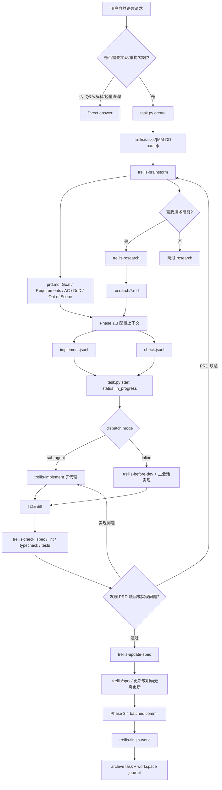

# 资料：Trellis 的意图识别、任务上下文与文档生成机制

> 资料用途：帮助理解 [mindfold-ai/Trellis](https://github.com/mindfold-ai/Trellis) 如何把“自然语言开发请求”转成任务目录、`prd.md`、上下文 JSONL、子代理执行、质量检查、spec 回写和 workspace journal。本文不是正式系列文章，而是用于框架理解、横向对比和后续写作的研究笔记。
>
> 资料读取于：2026-05-23  
> 资料版本：`mindfold-ai/Trellis` main 分支，GitHub 页面显示最新 commit `7a469cb`，版本变更为 `0.5.19`  
> 主要来源：`README.md`、`AGENTS.md`、`.trellis/workflow.md`、`.trellis/config.yaml`、`.trellis/agents/*`、`.codex/agents/*`、`.agents/skills/trellis-*`、`.trellis/spec/guides/*`

---

## 1. 快速结论

`Trellis` 的定位是“team AI coding harness”。它不是给某个 Agent 增加一组孤立提示词，而是在项目目录里生成一套可版本化的工程运行层：

```text
.trellis/
  workflow.md          # 阶段状态机和路由规则
  spec/                # 团队共享、按包/层组织的代码规范与思考指南
  tasks/               # 每个任务的 PRD、research、implement/check JSONL 上下文
  workspace/           # 每个开发者的 session journal
  scripts/             # task/context/session 运行脚本

.agents/skills/        # 通用 Trellis skills
.codex/agents/         # Codex 子代理定义
.claude/commands/      # Claude command wrapper
```

对“意图识别、意图整理、计划拆分、文档生成”而言，主链路可以压缩为：

```text
trellis-start / workflow-state
  -> task.py create
  -> trellis-brainstorm 写 prd.md
  -> trellis-research 写 research/*.md
  -> curate implement.jsonl / check.jsonl
  -> task.py start
  -> trellis-implement 或 trellis-before-dev
  -> trellis-check
  -> trellis-update-spec
  -> Phase 3.4 batched commit
  -> trellis-finish-work 归档 task + 记录 journal
```

Trellis 最有辨识度的设计有四点：

| 机制 | 作用 |
| --- | --- |
| 任务目录先行 | 任何需要实现的工作先落到 `.trellis/tasks/{MM-DD-name}/`，避免需求只存在聊天上下文里 |
| `prd.md` 是意图契约 | `trellis-brainstorm` 要求一问一答、持续更新 PRD，并在实现前确认需求 |
| JSONL 精准注入上下文 | `implement.jsonl` / `check.jsonl` 明确列出子代理必须读的 spec / research，降低上下文遗漏 |
| Spec 回写闭环 | 完成任务后用 `trellis-update-spec` 把新模式、坑点、契约写回 `.trellis/spec/` |

它的核心工程判断是：AI 编程失败往往不是缺少代码能力，而是“需求、规范、研究结论、验证证据和经验教训没有进入可持久化、可注入、可复用的文件系统”。Trellis 用目录结构和状态机把这些信息固定下来。

---

## 2. 框架意图：为什么需要 Trellis

传统 `AGENTS.md`、`CLAUDE.md`、`.cursorrules` 可以给 Agent 提供入口指令，但在团队规模下会遇到几个结构性问题：

| 失败模式 | 表现 | Trellis 的处理方式 |
| --- | --- | --- |
| 规则单体化 | 所有规范塞进一个长文件，Agent 很难只加载相关部分 | `.trellis/spec/<package>/<layer>/index.md` 做分层入口，按任务选择具体规范 |
| 需求只在聊天里 | 上下文压缩或切换会话后，目标和边界丢失 | `task.py create` 生成任务目录，`prd.md` 持久化目标、需求、验收标准 |
| 子代理看不到父会话思考 | plan mode 或主会话里的分析无法自动传给 implement/check agent | `implement.jsonl` / `check.jsonl` 明确列出要注入的 spec 和 research 文件 |
| 验证靠口头承诺 | Agent 说“应该好了”，但没有按项目规范跑 lint/type-check/test | `trellis-check` 强制读取 spec、检查 diff、运行项目检查并自修复 |
| 经验无法累积 | 修过的坑下一次仍然重复 | `trellis-update-spec` / `trellis-break-loop` 把 bug 类别、契约和预防机制回写到 spec |
| 多平台流程漂移 | Claude、Codex、Cursor、OpenCode 等工具各有自己的 hook/agent 格式 | Trellis 生成平台目录，但共享 `.trellis/workflow.md`、`.trellis/spec/` 和任务系统 |

Trellis 的取舍也很清楚：它引入了更多文件、脚本和阶段门控，换取需求和执行上下文的可追踪性。对于“一行 typo 修复”这类极小工作，workflow 提供 inline escape hatch；但对任何 implementation / code change / build / refactor，默认会走任务化流程。

---

## 3. 相关 Skill / Command 总览

本文不覆盖 Trellis 仓库里所有非核心 skill，例如 `contribute`、`python-design`、`first-principles-thinking`。它们更像局部工程风格或贡献指南，不是 Trellis 意图识别与任务文档链路的主干。

| Role | Source file | Why it matters |
| --- | --- | --- |
| Meta/router | `.trellis/workflow.md`、`.agents/skills/trellis-start/SKILL.md` | 会话启动、读取当前任务、决定直接回答 / 创建任务 / 继续执行 |
| Local customization | `.agents/skills/trellis-meta/SKILL.md` | 解释 `.trellis/`、平台目录、skills、commands、hooks 的本地架构 |
| Intent extraction | `.agents/skills/trellis-brainstorm/SKILL.md` | 任务先行、单问澄清、研究优先、PRD 持续更新 |
| Idea refinement | `.agents/skills/trellis-brainstorm/SKILL.md` | 发散到未来演进、相关场景、失败边界，再收敛 MVP |
| Spec/PRD | `.trellis/tasks/{id}/prd.md` | 记录目标、需求、验收、DoD、技术方案、ADR-lite 和 out-of-scope |
| Planning/context | `.trellis/workflow.md` Phase 1.3 | 将 spec / research 选择性写入 `implement.jsonl` 和 `check.jsonl` |
| Research | `.trellis/agents/research.md`、`.codex/agents/trellis-research.toml` | 将内部/外部研究写入 `{TASK_DIR}/research/`，必要时补 JSONL |
| Implementation | `.trellis/agents/implement.md`、`.codex/agents/trellis-implement.toml`、`trellis-before-dev` | 按 PRD 和注入 spec 执行实现；Codex inline 模式则主会话先读 spec |
| Verification/gates | `.agents/skills/trellis-check/SKILL.md`、`.trellis/agents/check.md`、`.codex/agents/trellis-check.toml` | 对 diff 做 spec compliance、lint、type-check、tests、自修复 |
| Debug retrospective | `.agents/skills/trellis-break-loop/SKILL.md` | 对重复 bug 做根因分类和预防机制沉淀 |
| Documentation/memory | `.agents/skills/trellis-update-spec/SKILL.md`、`.trellis/workspace/` | 将新契约写入 `.trellis/spec/`，将 session 记录到 journal |
| Finish/archive | `.agents/skills/trellis-finish-work/SKILL.md`、`.claude/commands/trellis/finish-work.md` | 检查未提交变更、归档 task、记录 session journal |

需要特别说明：Trellis 没有独立的“PRD skill / ADR skill / issue breakdown skill”。它把这些职责合并在任务目录中：`prd.md` 承担 PRD 和 ADR-lite，`research/*.md` 承担外部事实沉淀，`implement.jsonl` / `check.jsonl` 承担执行计划上下文，`.trellis/spec/` 承担长期规范记忆。

### 3.1 `trellis-start` 介绍

**中文译解**：这是没有自动 session-start hook 时的手动入口。它先读取当前开发者身份、git 状态、active task、workflow phase 和 spec index，再根据任务状态路由到 brainstorm、实现、检查或直接回答。

| 项目 | 内容 |
| --- | --- |
| 触发条件 | 新会话开始、恢复上下文、开始新任务、需要重新建立 Trellis 项目上下文。 |
| 流程 | 运行 `get_context.py` 读取状态；运行 `get_context.py --mode phase` 读取 Phase Index；读取 packages/spec index；根据 active task 和 `prd.md` 是否存在决定下一步。 |
| 怎么结束 | 已确定当前请求属于 direct answer、Phase 1 brainstorm、Phase 2 implement、Phase 3 check/update/finish 中的哪一类。 |
| 产生什么文档 | 本身不生成文档；读取 `.trellis/workflow.md`、`.trellis/spec/`、`.trellis/tasks/`、`.trellis/workspace/`。 |

### 3.2 `trellis-brainstorm` 介绍

**中文译解**：这是 Trellis 的意图抽取和 PRD 生成核心。它要求先创建 task，再把用户初始描述、代码库事实、假设、开放问题、需求、验收标准写入 `prd.md`。它不是“聊天式头脑风暴”，而是一个持续修改 PRD 的需求发现流程。

| 项目 | 内容 |
| --- | --- |
| 触发条件 | 新功能、复杂任务、需求不清、多种实现路径、存在 UX/reliability/maintainability/cost/performance 取舍。 |
| 流程 | 确保 task 存在并 seed `prd.md`；先查 repo/docs/config；只问阻塞或偏好问题；技术选择先 research；发散未来演进/相关场景/失败边界；收敛 MVP；最终给结构化确认。 |
| 怎么结束 | `prd.md` 已包含目标、需求、验收标准、DoD、技术方案、ADR-lite、out-of-scope；用户确认后进入 context 配置和 `task.py start`。 |
| 产生什么文档 | `.trellis/tasks/{MM-DD-name}/prd.md`；复杂任务还会引用 `research/*.md`。 |

### 3.3 `trellis-research` 介绍

**中文译解**：这是研究子代理，不是主会话临时搜索。它把内部代码模式或外部 SDK/API 事实写入 `{TASK_DIR}/research/<topic>.md`，必要时将文件路径加入 `implement.jsonl` / `check.jsonl`，让实现代理读到真实材料。

| 项目 | 内容 |
| --- | --- |
| 触发条件 | 技术选择、外部库/API/协议、类似工具实践、用户无法合理枚举选项，或需要发现项目内部模式。 |
| 流程 | 判断 internal/external/mixed；读 spec index 和代码；外部研究必须获取真实源码/文档；每个 claim 需要证据片段；写 research 文件；补 JSONL；返回文件路径和摘要。 |
| 怎么结束 | 研究文件已落盘；关键 API/执行路径/模式/坑点有引用；implement/check 所需上下文已进入 JSONL 或明确不需要。 |
| 产生什么文档 | `.trellis/tasks/{id}/research/*.md` 或 `.trellis/tasks/{id}/context/*.md`；可能更新 `implement.jsonl` / `check.jsonl`。 |

### 3.4 `trellis-before-dev` 介绍

**中文译解**：这是主会话 inline 实现前的 spec 加载器。子代理模式下 spec 通过 JSONL 注入；inline 模式下主会话必须自己运行它，避免不读项目规范就写代码。

| 项目 | 内容 |
| --- | --- |
| 触发条件 | 开始写代码、切换 package/layer、需要刷新项目约定，尤其是 Codex inline / Kilo / Antigravity / Windsurf 等主会话实现路径。 |
| 流程 | `get_context.py --mode packages` 发现包和层；选择相关 spec index；读取 Pre-Development Checklist 指向的具体规范；读取 shared thinking guides；再开始实现。 |
| 怎么结束 | 已读 relevant package/layer spec 和 shared guides；实现计划可按这些规范执行。 |
| 产生什么文档 | 无固定文档；产生的是已加载的规范上下文。 |

### 3.5 `trellis-implement` 介绍

**中文译解**：这是执行子代理。它只负责按 PRD 和 spec 写代码，不允许 commit/push/merge。Codex 版本显式加入 recursion guard，避免子代理再次派生 implement/check 造成等待死锁。

| 项目 | 内容 |
| --- | --- |
| 触发条件 | Phase 2.1，实现已进入 `in_progress`；主会话默认派发实现子代理。 |
| 流程 | 解析 active task；读 `prd.md` / `info.md`；读 `implement.jsonl` 指向的 spec；若 JSONL 未配置则回退到 packages/spec 判断；实现代码；运行 lint/type-check。 |
| 怎么结束 | 代码按 PRD 实现；lint/type-check 尽量通过；报告变更文件、检查命令和剩余风险；不提交代码。 |
| 产生什么文档 | 通常不生成文档；产生代码 diff 和验证输出。 |

### 3.6 `trellis-check` 介绍

**中文译解**：这是检查子代理/skill。它不是只报告问题，而是要读取 diff 和 spec 后直接修复可修问题，再运行 lint/type-check/tests。Trellis 把它放在 Phase 2 和 Phase 3，形成实现后和完成前的双重质量门。

| 项目 | 内容 |
| --- | --- |
| 触发条件 | 代码已经写完、准备提交前、长会话中可能出现 context drift、或 Phase 3 final verification。 |
| 流程 | `git diff` / `git status` 定位变更；读取相关 spec；运行项目检查；检查测试覆盖、spec sync、跨层数据流、代码复用、依赖/导入一致性；发现问题直接修复并复跑。 |
| 怎么结束 | lint/type-check/tests 已运行并报告；可修问题已修；不可修问题明确列出；是否需要 spec 更新已判断。 |
| 产生什么文档 | 无固定文档；产生验证结果、修复 diff、可能触发后续 `.trellis/spec/` 更新。 |

### 3.7 `trellis-continue` 介绍

**中文译解**：这是恢复入口。它用 active task 的 `status` 和文件存在性判断应从哪个 phase/step 继续，而不是让 Agent 凭记忆续做。

| 项目 | 内容 |
| --- | --- |
| 触发条件 | 回到一个 in-progress task、上下文压缩后继续、需要确认下一步。 |
| 流程 | 运行 `get_context.py`；读取 Phase Index；根据 `status=planning/in_progress/completed`、`prd.md`、`implement.jsonl` 是否 curated 路由到 1.1/1.3/1.4/2.1/2.2/3.1；加载具体 step。 |
| 怎么结束 | 已加载下一步的 `get_context.py --mode phase --step <X.X>` 指令；required steps 按顺序继续。 |
| 产生什么文档 | 本身不生成文档；读取 task 状态和 workflow。 |

### 3.8 `trellis-update-spec` 介绍

**中文译解**：这是 Trellis 的长期记忆写入器。它把任务中学到的新契约、签名、payload、错误矩阵、测试断言、禁用模式和 gotcha 写进 `.trellis/spec/`，让后续任务通过 spec 注入继承这些经验。

| 项目 | 内容 |
| --- | --- |
| 触发条件 | 完成任务、修复 bug、做出设计决策、发现新模式/坑点/约定，尤其是命令/API/DB/跨层/infra 契约变化。 |
| 流程 | 明确学到了什么；判断属于 code-spec 还是 guides；读取目标 spec；按类型写 design decision / convention / pattern / forbidden pattern / gotcha；必要时补 index；跑质量 checklist。 |
| 怎么结束 | 相关 `.trellis/spec/` 文件已更新，或明确判断没有值得记录的新知识；内容具体、可执行、可测试。 |
| 产生什么文档 | 更新 `.trellis/spec/<package>/<layer>/*.md` 或 `.trellis/spec/guides/*.md`。 |

### 3.9 `trellis-break-loop` 介绍

**中文译解**：这是重复 bug 的事后分析器。它把一次调试拆成根因类别、失败修复原因、预防机制、系统性扩展和知识捕获，并要求立即更新 spec，而不是只在聊天里总结。

| 项目 | 内容 |
| --- | --- |
| 触发条件 | 同一类 bug 被反复修、debug 结束后需要防止复发。 |
| 流程 | 分类 root cause；分析之前修复为什么失败；选择 documentation/architecture/compile-time/runtime/test/review 预防机制；扩展类似问题；更新 spec/guides 并提交。 |
| 怎么结束 | Bug analysis 输出完成；相关 `.trellis/spec/` 或 guides 已更新；需要的 follow-up issue/ticket 已识别。 |
| 产生什么文档 | Bug analysis 文本；更新 `.trellis/spec/guides/` 或相关 layer spec。 |

### 3.10 `trellis-finish-work` 介绍

**中文译解**：这是收尾命令。它不负责提交业务代码；业务代码必须在 Phase 3.4 先由 AI 驱动 batched commit。`finish-work` 只在工作树干净或脏文件明确无关时，归档 task 并记录 session journal。

| 项目 | 内容 |
| --- | --- |
| 触发条件 | 编码和质量验证完成，准备结束会话或上下文快满。 |
| 流程 | `get_context.py --mode record` 查看 active tasks / git status / recent commits；分类 dirty paths；归档当前 task；用 `add_session.py` 写 journal。 |
| 怎么结束 | 当前 task 已 archive；session journal 已记录；git log 顺序保持 work commits → archive commit → journal commit。 |
| 产生什么文档 | `.trellis/tasks/archive/{year-month}/...`；`.trellis/workspace/<developer>/journal-N.md` 和 `index.md`。 |

### 3.11 `trellis-meta` 介绍

**中文译解**：这是本地 Trellis 架构修改入口。它用于用户已经在项目里运行 `trellis init` 后，需要调整 workflow、hooks、平台文件、skills、commands、agents 或 spec 结构的场景。

| 项目 | 内容 |
| --- | --- |
| 触发条件 | 修改 `.trellis/`、平台目录、hooks/settings、agents、skills、commands、prompts、workflow，或解释本地 Trellis 架构。 |
| 流程 | 先读 local architecture overview；涉及具体平台则读 platform map；改行为则读 customization overview；编辑前以用户项目本地文件为准。 |
| 怎么结束 | 已识别正确的本地定制入口；没有改全局 npm 安装目录或覆盖用户改过的模板。 |
| 产生什么文档 | 可能修改 `.trellis/workflow.md`、`.trellis/config.yaml`、`.trellis/spec/`、平台目录、`.agents/skills/`。 |

---

## 4. 意图识别与路由机制

Trellis 的路由不只在 skill description 里，而是集中写在 `.trellis/workflow.md` 的 workflow-state block 中。这些 block 是每轮 prompt breadcrumb 的单一来源。脚本只解析 workflow 文件，不维护另一份硬编码 fallback。

### 4.1 三类入口：A / B / C

当没有 active task 时，Trellis 把用户请求分成三类：

| 类型 | 条件 | 行为 |
| --- | --- | --- |
| A Direct answer | 纯 Q&A / 解释 / 查询 / 聊天；无文件写入；仓库读取不超过 2 个文件 | 直接回答，不创建 task |
| B Create a task | implementation / code change / build / refactor | 运行 `task.py create`，进入 planning，加载 `trellis-brainstorm` |
| C Inline change | 用户当前消息显式包含 `skip trellis`、`no task`、`just do it`、`别走流程`、`直接改` 等 | 承认本轮跳过 Trellis flow，直接 inline |

这个设计避免 Agent 用“看起来很小”作为绕过任务流的理由。workflow 明确写道，“it looks small” 不是把 B 降级成 A/C 的依据。

### 4.2 状态机：planning / in_progress / completed

Trellis 的 task lifecycle 使用 `task.json.status` 和 runtime session pointer 共同决定当前 phase：

| 状态 | 典型文件 | 下一步 |
| --- | --- | --- |
| `planning` + 无 `prd.md` | task 刚创建 | 进入 1.1，加载 `trellis-brainstorm` |
| `planning` + 有 `prd.md` + JSONL 未 curated | requirements 已有 | Phase 1.3，填 `implement.jsonl` / `check.jsonl` |
| `planning` + 有 `prd.md` + JSONL 已 curated | context 已准备 | Phase 1.4，运行 `task.py start` |
| `in_progress` | 实现阶段 | implement → check → update-spec → commit |
| `completed` | 通常已 archive | 进入归档/记录流程；源码说明该状态在正常 archive 流里基本不可达 |

`task.py create` 只创建任务并进入 planning；`task.py start` 只能在 PRD 和上下文完成后执行。过早 start 会让 breadcrumb 切到 implementation phase，从而跳过 brainstorm 和 JSONL 配置，这是 Trellis 明确防止的状态转移错误。

---

## 5. 意图抽取 / 澄清机制

`trellis-brainstorm` 的第一个强规则是 task-first。它不等需求完全明确再建任务，而是在任何 Q&A 前先创建任务目录并 seed `prd.md`：

```markdown
# brainstorm: <short goal>

## Goal
## What I already know
## Assumptions (temporary)
## Open Questions
## Requirements (evolving)
## Acceptance Criteria (evolving)
## Definition of Done (team quality bar)
## Out of Scope (explicit)
## Technical Notes
```

然后它按三个门来决定是否提问：

| Gate | 判断 | 结果 |
| --- | --- | --- |
| Gate A | 能否从代码、文档、配置、规范、快速研究中得到答案 | 能推导就不问用户，先查再写入 PRD |
| Gate B | 是否是 meta/lazy question | 不问“要不要搜索”“能不能贴代码”，直接行动 |
| Gate C | 问题类型是 Blocking / Preference / Derivable | 只问阻塞问题和偏好问题 |

问题策略要求“一次只问一个问题”，偏好决策尽量给 2-3 个具体方案和 trade-off。每次用户回答后，立即更新 `prd.md`：把答案从 Open Questions 移到 Requirements，补 Acceptance Criteria 和 Out of Scope。

---

## 6. 意图发散与收敛机制

Trellis 的 brainstorm 不是只围绕用户初始需求收窄。它强制在初步理解后做一次 Expansion Sweep：

| 发散维度 | 需要考虑的问题 |
| --- | --- |
| Future evolution | 1-3 个月后这个功能会变成什么；哪些 extension point 值得现在保留 |
| Related scenarios | 相邻命令/流程是否需要一致；create/update/import/export 是否有 parity |
| Failure & edge cases | 冲突、离线、网络失败、重试、幂等、兼容、回滚、权限、输入校验 |

发散之后再收敛 MVP：哪些进入 Requirements，哪些进入 Out of Scope。复杂任务还会记录 ADR-lite：

```markdown
## Decision (ADR-lite)

**Context**: Why this decision was needed
**Decision**: Which approach was chosen
**Consequences**: Trade-offs, risks, potential future improvements
```

这等价于把“当时为什么这样做”写进任务本体，降低后续实现和 review 时的意图丢失。

---

## 7. Spec / PRD / 需求文档生成机制

Trellis 的 PRD 是任务级文档，不是长期规范。它负责让 implement/check 知道“这一次要做什么”。长期规范由 `.trellis/spec/` 承担。

### 7.1 `prd.md` 的最终结构

`trellis-brainstorm` 要求最终 PRD 收敛为：

```markdown
# <Task Title>

## Goal

<why + what>

## Requirements

* ...

## Acceptance Criteria

* [ ] ...

## Definition of Done

* ...

## Technical Approach

<key design + decisions>

## Decision (ADR-lite)

Context / Decision / Consequences

## Out of Scope

* ...

## Technical Notes

<constraints, references, files, research notes>
```

### 7.2 Research 不塞进 PRD

Trellis 的研究结果要求持久化到 `research/*.md`，PRD 只引用这些文件。这样做的原因是：主会话可读性、子代理上下文和长期证据各自分离。

| 文件 | 内容边界 |
| --- | --- |
| `prd.md` | 用户目标、需求、验收、DoD、技术方案、范围边界 |
| `research/*.md` | 外部库/API/类似项目/内部代码模式的证据与结论 |
| `implement.jsonl` | 实现代理必须读的 spec 和 research |
| `check.jsonl` | 检查代理必须读的质量规范和 research |
| `.trellis/spec/` | 任务结束后沉淀为团队长期执行规则的知识 |

---

## 8. Plan / Task / Issue 拆分机制

Trellis 没有单独的“写 implementation plan skill”，而是用 task system 承担拆分和状态管理。

### 8.1 Task 目录结构

`.trellis/workflow.md` 定义每个任务目录包含：

```text
.trellis/tasks/{MM-DD-name}/
  prd.md
  implement.jsonl
  check.jsonl
  task.json
  research/        # optional
  info.md          # optional technical design
```

复杂任务可以创建 child tasks：

```bash
python3 ./.trellis/scripts/task.py create "Child task 1" --slug child1 --parent "$TASK_DIR"
python3 ./.trellis/scripts/task.py add-subtask "$TASK_DIR" "$CHILD_DIR"
```

### 8.2 JSONL 是“执行计划上下文”

`implement.jsonl` 和 `check.jsonl` 的格式是 repo-root relative path 加 reason：

```jsonl
{"file": ".trellis/spec/cli/backend/index.md", "reason": "CLI backend coding guidelines"}
{"file": ".trellis/tasks/05-23-add-foo/research/sdk.md", "reason": "SDK API reference"}
```

workflow 明确要求：

| JSONL | 放什么 | 不放什么 |
| --- | --- | --- |
| `implement.jsonl` | 实现所需 spec、specific guideline、research | 即将修改的源码文件；这些应由实现代理自己读取 |
| `check.jsonl` | 质量规范、check conventions、cross-layer guides、必要 research | 同样不预注册被改代码 |

这个设计把“计划”从自由文本步骤变成“下游代理必须装载哪些事实”。它牺牲了传统 plan 的叙事完整性，换取了子代理上下文注入的确定性。

---

## 9. Documentation / ADR / Memory 机制

Trellis 的 documentation/memory 分三层。

### 9.1 `.trellis/spec/`：团队共享长期规范

`.trellis/spec/` 按 package/layer 组织。每个 `index.md` 只是入口，具体规范在它指向的文件里。`trellis-before-dev` 和 `trellis-check` 都强调：index 不是目标，必须继续读 Pre-Development Checklist / Quality Check 指向的具体 guideline 文件。

`trellis-update-spec` 进一步规定，implementation work 的 “spec” 应当是 code-spec，而不是原则性文字。跨层或 infra 变更触发时，要求写满 7 个 section：

| Section | 目的 |
| --- | --- |
| Scope / Trigger | 为什么需要 code-spec depth |
| Signatures | 命令/API/DB 签名 |
| Contracts | request/response/env 契约 |
| Validation & Error Matrix | 条件与错误行为 |
| Good/Base/Bad Cases | 基准和反例 |
| Tests Required | 测试和断言点 |
| Wrong vs Correct | 至少一组错误/正确例子 |

### 9.2 `.trellis/spec/guides/`：思考触发器

Guides 不是代码规范，而是提醒 Agent “应该想哪些问题”。当前 Trellis 提供：

| Guide | 作用 |
| --- | --- |
| `code-reuse-thinking-guide.md` | 修改常量、创建 utility、发现重复模式前先搜索 |
| `cross-layer-thinking-guide.md` | 处理跨 API / service / storage / UI 的数据流和错误传播 |
| `cross-platform-thinking-guide.md` | 处理脚本、路径、命令、多平台差异 |

### 9.3 `.trellis/workspace/`：个人 session journal

workspace journal 记录每次 AI session，默认每个 `journal-N.md` 最多 `2000` 行，超过后轮转。`trellis-finish-work` 最后调用：

```bash
python3 ./.trellis/scripts/add_session.py \
  --title "Session Title" \
  --commit "hash1,hash2" \
  --summary "Brief summary"
```

这让后续 session 能从真实文件恢复上下文，而不是依赖模型记忆。

---

## 10. 从意图到文档的完整流程



这条链路里，文档不是“最后写总结”，而是在每个阶段都承担状态转换：

| 阶段 | 文件状态 | 作用 |
| --- | --- | --- |
| 计划开始 | task directory + seed `prd.md` | 防止需求遗失 |
| 计划完成 | `prd.md` + optional `research/*.md` | 锁定需求与外部事实 |
| 执行前 | `implement.jsonl` / `check.jsonl` | 下游代理上下文注入清单 |
| 执行后 | code diff + check output | 验证证据 |
| 完成前 | `.trellis/spec/` update | 长期规范回写 |
| 收尾后 | archived task + journal | 跨会话记忆 |

---

## 11. 相关 Skill / Command 完整中文执行版

### 11.1 `trellis-start` 完整中文执行版

来源文件：`.agents/skills/trellis-start/SKILL.md`

#### 元信息

- name: `trellis-start`
- description: 初始化 AI 开发会话，读取 workflow、开发者身份、git 状态、active task 和项目 guideline；对输入任务分类并路由到 brainstorm、直接编辑或任务工作流。

#### 概览

在没有 session-start hook 的平台上，手动执行 Trellis 上下文装载。它的结果是确定“现在处在哪个 task、哪个 phase、下一步应该调用哪个 skill”。

#### 触发条件

- 开始新的 coding session。
- 恢复已有工作。
- 启动一个新任务。
- 需要重新建立项目上下文。

#### 流程

1. 运行 `python3 ./.trellis/scripts/get_context.py`，读取身份、git 状态、当前任务、active tasks 和 journal 位置。
2. 运行 `python3 ./.trellis/scripts/get_context.py --mode phase`，读取 Phase Index、skill routing 和 do-not-skip rules。
3. 运行 `python3 ./.trellis/scripts/get_context.py --mode packages`，再读 `.trellis/spec/guides/index.md` 和相关 package/layer 的 spec index。
4. 根据 active task 判断：
   - active task + `prd.md` 存在：进入 Phase 2.1。
   - active task + 无 `prd.md`：加载 `trellis-brainstorm`。
   - 无 active task + 用户描述多步骤工作：加载 `trellis-brainstorm` 并创建 task。
   - 简单问答或 trivial edit：直接回答或 inline。

#### 输出 / 交付物

- 下一步路由决策。
- 已加载 workflow/spec 上下文。
- 无固定持久化文档。

#### 与其他 Skill 的关系

- 上游：会话入口。
- 下游：`trellis-brainstorm`、`trellis-before-dev`、`trellis-check`、`trellis-break-loop`、`trellis-update-spec`。

#### 常见合理化与现实

- “先凭记忆继续”：错误；必须读取 `get_context.py` 当前状态。
- “active task 看起来明确，不用读 phase”：错误；workflow-state 可能已经改变。
- “index 看过就够”：错误；spec index 指向具体 guideline 文件。

#### 红旗

- 未读 `get_context.py` 就开始改代码。
- 未读 Phase Index 就判断下一步。
- 有 active task 但忽略 `prd.md` / JSONL 状态。

#### 结束判断与验证

原文没有单独列出 completion checklist；以下是根据流程约束归纳的结束条件：

- [ ] 已运行 `get_context.py`。
- [ ] 已读取 Phase Index。
- [ ] 已识别相关 spec index。
- [ ] 已根据 active task 和文件状态选择下一步。
- [ ] 没有在需要 task 的实现工作中直接跳过 Trellis。

### 11.2 `trellis-brainstorm` 完整中文执行版

来源文件：`.agents/skills/trellis-brainstorm/SKILL.md`

#### 元信息

- name: `trellis-brainstorm`
- description: 在实现前引导协作式需求发现；创建 task directory，初始化 PRD，一次问一个高价值问题，研究技术选择并收敛 MVP。

#### 概览

这是需求发现和 PRD 生成流程。它强调 task-first、action-before-asking、research-first、diverge-to-converge。

#### 触发条件

- 需求不清或正在演化。
- 有多个可行实现路径。
- 存在 UX、可靠性、可维护性、成本或性能取舍。
- 用户描述新功能或复杂任务。

#### 流程

1. 确保 task 存在。若无，基于用户消息生成短标题和 slug，运行 `task.py create`。
2. 立即 seed `prd.md`，包括 Goal、What I already know、Assumptions、Open Questions、Requirements、Acceptance Criteria、DoD、Out of Scope、Technical Notes。
3. 在提问前做 repo/docs/config/spec inspection，将发现写入 PRD。
4. 通过 Question Gate 判断问题类型：能推导的不问；meta/lazy questions 不问；只问 Blocking 或 Preference。
5. 技术选择必须 research-first，优先派 `trellis-research` 子代理，并把结果写到 `{TASK_DIR}/research/`。
6. 做 Expansion Sweep：未来演进、相关场景、失败与边界。
7. 进入 Q&A loop：一次一个问题，每次回答后立即更新 PRD。
8. 复杂任务提出 2-3 个 approach，并把选择写成 ADR-lite。
9. 最终用 Goal / Requirements / AC / DoD / Out of Scope / Technical Approach / small PR plan 做确认。
10. 用户确认后进入 context 配置和实现阶段。

#### 输出 / 交付物

- `.trellis/tasks/{MM-DD-name}/prd.md`
- 可选 `{TASK_DIR}/research/*.md`
- 复杂任务可创建 child tasks
- PRD 中的 ADR-lite 决策记录

#### 与其他 Skill 的关系

- 上游：`trellis-start` 或 workflow-state planning。
- 下游：`trellis-research`、Phase 1.3 JSONL curation、`task.py start`、`trellis-implement` / `trellis-before-dev`。

#### 常见合理化与现实

- “先问用户代码长什么样”：错误；repo 可见时必须自己查。
- “先让用户选方案”：错误；先研究并给具体方案。
- “聊完再写 PRD”：错误；每次回答后立即更新 PRD。
- “初始需求很窄，不用考虑 edge cases”：错误；Expansion Sweep 是必需步骤。

#### 红旗

- 没创建 task 就开始 brainstorm。
- 一次抛出多个问题。
- research 结果只留在聊天里，没有写文件。
- 没有 out-of-scope。
- 没有用户最终确认就进入实现。

#### 结束判断与验证

- [ ] task directory 已存在。
- [ ] `prd.md` 已包含目标、需求、验收标准、DoD、技术方案、out-of-scope。
- [ ] repo/docs/config/spec inspection 已写入 Technical Notes。
- [ ] 只问过 Blocking / Preference 问题。
- [ ] 技术选择已做 research-first 或明确不需要。
- [ ] 已完成发散和 MVP 收敛。
- [ ] 用户已确认完整需求。

### 11.3 `trellis-research` 完整中文执行版

来源文件：`.trellis/agents/research.md`、`.codex/agents/trellis-research.toml`

#### 元信息

- name: `trellis-research`
- description: 代码和技术搜索专家；发现模式、spec 和技术方案；把发现写入 task research 文件，并补充 JSONL 上下文。

#### 概览

研究子代理只做一件事：找到、解释并记录信息。它不修改业务代码、不改 spec、不执行 git 操作。

#### 触发条件

- 内部研究：现有功能、重构、bug 区域。
- 外部研究：新 SDK、library、API、protocol。
- 混合研究：已有功能结合新依赖。
- brainstorm 中出现技术选择或最佳实践问题。

#### 流程

1. 解析研究类型：internal / external / mixed。
2. 找到 active task，确保 `{TASK_DIR}/research/` 存在。
3. 内部研究先读 `.trellis/spec/` index，再搜索项目代码。
4. 外部研究必须拉取真实来源：GitHub repo、raw file、docs page、npm/PyPI package、OpenAPI/proto/types 等。
5. 对每个 technical claim 提供真实代码/文档证据；不能只写搜索摘要。
6. 每个 topic 写一个 research/context 文件，包含 source、summary、key APIs、execution paths、reusable patterns、gotchas 和 unresolved questions。
7. 在 active task 下填充 `implement.jsonl` 和 `check.jsonl`。
8. 返回文件路径、一行摘要和关键 caveat，不把完整 research 粘回主会话。

#### 输出 / 交付物

- `{TASK_DIR}/research/<topic>.md`
- 或 `.trellis/tasks/{id}/context/<topic>.md`
- `implement.jsonl` / `check.jsonl` entries
- research report summary

#### 与其他 Skill 的关系

- 上游：`trellis-brainstorm`、Phase 1.2、实现中发现需要更多 research。
- 下游：`trellis-implement`、`trellis-check` 读取 JSONL 指向的 research。

#### 常见合理化与现实

- “搜索结果摘要够了”：错误；必须获取真实材料。
- “链接加总结就是 research”：错误；实现代理应能只读 context 文件就开始编码。
- “研究顺手修代码”：禁止；research agent 只写 task research/context。
- “结论没有证据也可先写”：错误；找不到证据就删掉 claim。

#### 红旗

- research 文件没有 source / fetched path / claim evidence。
- 只返回聊天摘要，没有写文件。
- 修改 source code。
- 执行 git 操作。
- 没有标出仍未回答的问题。

#### 结束判断与验证

- [ ] active task 已解析，或无法解析时已向用户询问输出位置。
- [ ] 每个 topic 都写入 `{TASK_DIR}/research/`。
- [ ] 外部来源已实际拉取或明确报告网络限制。
- [ ] 技术 claim 有真实文件路径和证据。
- [ ] JSONL 已补充需要的 spec/research 路径。
- [ ] 没有修改业务代码或 spec。

### 11.4 `trellis-before-dev` 完整中文执行版

来源文件：`.agents/skills/trellis-before-dev/SKILL.md`

#### 元信息

- name: `trellis-before-dev`
- description: 在实现开始前发现并注入 `.trellis/spec/` 中的项目级编码规范。

#### 概览

这是 inline 实现前的强制读规范步骤。它确保主会话不是凭经验写代码，而是先读相关 package/layer 的 spec 和 shared guides。

#### 触发条件

- 开始新的 coding task。
- 写任何代码前。
- 切换到不同 package。
- 需要刷新项目约定和标准。

#### 流程

1. 运行 `get_context.py --mode packages` 发现 packages 和 spec layers。
2. 根据修改 package 和工作类型识别适用 specs。
3. 读取相关 `.trellis/spec/<package>/<layer>/index.md`。
4. 按 index 的 Pre-Development Checklist 读取具体 guideline 文件。
5. 读取 `.trellis/spec/guides/index.md`。
6. 理解规范后再进入实现。

#### 输出 / 交付物

- 无固定文档。
- 交付物是实现前已加载的 spec/guides 上下文。

#### 与其他 Skill 的关系

- inline 模式中位于 `trellis-brainstorm` / `task.py start` 之后、实际写代码之前。
- 子代理模式下通常由 `implement.jsonl` 注入替代。

#### 常见合理化与现实

- “读 index 就够了”：错误；index 指向具体 guideline。
- “只改一点，不用读 spec”：错误；写代码前 mandatory。
- “之前读过”：spec 可能更新，应重新加载相关部分。

#### 红旗

- 未运行 packages discovery。
- 只读 shared guides，不读 package/layer spec。
- 未读 Pre-Development Checklist 指向的文件就写代码。

#### 结束判断与验证

原文没有单独列出 completion checklist；以下是根据流程约束归纳的结束条件：

- [ ] 已列出 packages/spec layers。
- [ ] 已识别本任务相关 package/layer。
- [ ] 已读取相关 index。
- [ ] 已读取 index 指向的具体 guideline。
- [ ] 已读取 shared guides。
- [ ] 尚未在完成上述步骤前写代码。

### 11.5 `trellis-implement` 完整中文执行版

来源文件：`.trellis/agents/implement.md`、`.codex/agents/trellis-implement.toml`

#### 元信息

- name: `trellis-implement`
- description: 工作区可写的 Trellis 实现子代理，遵循 specs 和 requirements，不允许 git commit。

#### 概览

实现代理负责把 PRD 转成代码。它应该直接实现，不再派发另一个 implement/check 子代理。

#### 触发条件

- Phase 2.1 Implement。
- task 已 `in_progress`。
- 主会话按 workflow 默认派发实现子代理。

#### 流程

1. 遵守 recursion guard：不得 spawn `trellis-implement` 或 `trellis-check`。
2. 解析 active task：优先读取 dispatch prompt 第一行 `Active task: <path>`；否则运行 `task.py current --source`；都失败则问用户。
3. 读取 `prd.md` 和可选 `info.md`。
4. 读取 `<task-path>/implement.jsonl`。
5. 对 JSONL 每个有效 entry 读取对应 spec 文件；跳过 `_example` seed row。
6. 若 JSONL 未 curated，则读取 PRD，运行 packages discovery，自行判断相关 spec，不阻塞。
7. 按 specs 和现有模式实现。
8. 运行 lint 和 type-check。
9. 汇报 changed files、checks run、remaining risks/follow-ups。

#### 输出 / 交付物

- 代码改动。
- lint/type-check 输出。
- 实现报告。
- 不提交、不推送、不合并。

#### 与其他 Skill 的关系

- 上游：`trellis-brainstorm`、Phase 1.3 JSONL、`task.py start`。
- 下游：`trellis-check`。

#### 常见合理化与现实

- “没有 JSONL 就停下”：Codex agent 指令要求 fallback，不要阻塞。
- “实现后顺手 commit”：禁止；commit 由主会话 Phase 3.4 驱动。
- “需要更多并行工作就自己 spawn”：禁止；只能报告建议给主会话。

#### 红旗

- 没读 `prd.md` 就写代码。
- 没读 `implement.jsonl` 或相关 spec。
- 子代理再次派生子代理。
- 执行 `git commit` / `git push` / `git merge`。

#### 结束判断与验证

原文没有独立 checklist；以下是根据 agent contract 归纳：

- [ ] active task 已解析。
- [ ] `prd.md` 已读取。
- [ ] `implement.jsonl` 或 fallback specs 已读取。
- [ ] 实现范围聚焦 PRD。
- [ ] 已运行 lint/type-check，或说明无法运行原因。
- [ ] 未执行 git commit/push/merge。
- [ ] 已报告变更和风险。

### 11.6 `trellis-check` 完整中文执行版

来源文件：`.agents/skills/trellis-check/SKILL.md`、`.trellis/agents/check.md`、`.codex/agents/trellis-check.toml`

#### 元信息

- name: `trellis-check`
- description: 综合质量验证：spec compliance、lint、type-check、tests、跨层数据流、代码复用和一致性检查。

#### 概览

检查代理/skill 负责读取 diff、spec 和 PRD，对代码做质量验证并自修复。它不是只给建议。

#### 触发条件

- 代码已经写完，需要质量验证。
- 提交前。
- 长会话中担心 context drift。
- Phase 2.2 或 Phase 3.1。

#### 流程

1. `git diff --name-only HEAD` 和 `git status` 识别变更。
2. 读取 packages/spec layers。
3. 对每个 changed package/layer 读取 spec index 和 Quality Check 指向的具体 guideline。
4. 运行项目 lint、type-check、test。
5. 检查代码质量：linter、type checker、tests、debug logging、suppressed warnings、type-safety bypass。
6. 检查测试覆盖：新函数单测、bugfix 回归测、行为变更更新测试。
7. 判断 `.trellis/spec/` 是否需要更新。
8. 如果变更跨层，检查 data flow、code reuse、import/dependency、same-layer consistency。
9. 发现问题直接修复，再复跑检查。

#### 输出 / 交付物

- 修复后的代码 diff。
- Findings fixed / not fixed。
- lint/type-check/tests 状态。
- 是否需要 spec update 的判断。

#### 与其他 Skill 的关系

- 上游：`trellis-implement` 或 inline implementation。
- 下游：`trellis-break-loop`、`trellis-update-spec`、Phase 3.4 commit。

#### 常见合理化与现实

- “只报告不修”：Codex check agent 要求自修复。
- “没有测试命令就跳过说明”：需要明确项目检查运行情况或不可运行原因。
- “跨层变化只看当前文件”：错误；需要 trace data flow 和 type/schema。

#### 红旗

- 未读 spec 就 review。
- 未看真实 diff。
- 未运行 lint/type-check/tests。
- 删除或弱化 workflow enforcement directive。
- 修改 workflow state machine，除非用户明确要求。

#### 结束判断与验证

- [ ] 已识别 changed files。
- [ ] 已读取相关 spec 和 Quality Check。
- [ ] 已运行 lint/type-check/tests，或说明不能运行原因。
- [ ] 可修问题已直接修复。
- [ ] 不可修问题列出并解释原因。
- [ ] 已判断是否需要 `.trellis/spec/` 更新。
- [ ] 没有弱化 workflow gate。

### 11.7 `trellis-continue` 完整中文执行版

来源文件：`.agents/skills/trellis-continue/SKILL.md`、`.claude/commands/trellis/continue.md`

#### 元信息

- name: `trellis-continue`
- description: 恢复当前任务，加载 Phase Index，判断应从哪个 phase/step 继续，并读取对应 step detail。

#### 概览

这是恢复工作用的状态定位器。它不靠会话记忆，而靠 `task.json.status` 和文件状态。

#### 触发条件

- 回到 in-progress task。
- 上下文压缩或中断后继续。
- 需要知道下一步该做什么。

#### 流程

1. 运行 `get_context.py` 读取 current task、git state、recent commits。
2. 运行 `get_context.py --mode phase` 读取 Phase Index。
3. 根据 status + artifacts 路由：
   - `planning` + no `prd.md` → 1.1。
   - `planning` + `prd.md` + JSONL 未 curated → 1.3。
   - `planning` + `prd.md` + curated JSONL → 1.4。
   - `in_progress` + implementation not started → 2.1。
   - `in_progress` + implementation done, not checked → 2.2。
   - `in_progress` + check passed → 3.1。
4. 运行 `get_context.py --mode phase --step <X.X> --platform <platform>`。
5. 按 required steps 顺序继续；必要时回滚到更早 phase。

#### 输出 / 交付物

- 下一步 step detail。
- 无固定持久化文档。

#### 与其他 Skill 的关系

- 根据状态转到 `trellis-brainstorm`、context curation、`trellis-before-dev` / `trellis-implement`、`trellis-check`、`trellis-update-spec`。

#### 常见合理化与现实

- “凭上次对话继续”：错误；必须读当前 task 状态。
- “`prd.md` 有了就可以实现”：错误；sub-agent 模式还要求 JSONL curated。
- “check passed 就 finish-work”：错误；还要 Phase 3.3 spec update 和 Phase 3.4 commit。

#### 红旗

- 跳过 required once step。
- 把 seed `_example` row 当成 curated JSONL。
- 状态是 planning 却直接实现。

#### 结束判断与验证

- [ ] 已读取 current context。
- [ ] 已读取 Phase Index。
- [ ] 已根据 status + artifacts 判断 step。
- [ ] 已加载具体 step detail。
- [ ] 没有跳过 required step。

### 11.8 `trellis-update-spec` 完整中文执行版

来源文件：`.agents/skills/trellis-update-spec/SKILL.md`

#### 元信息

- name: `trellis-update-spec`
- description: 将可执行契约和编码约定捕获到 `.trellis/spec/` 文档中。

#### 概览

这是从一次任务学习到团队长期规范的桥。它要求 spec 内容具体、可执行、可测试，而不是原则宣言。

#### 触发条件

- 完成一个任务。
- 修复一个 bug。
- 发现新模式或坑点。
- 做出设计决策。
- 变更命令/API 签名、跨层 request/response、DB schema、infra integration。

#### 流程

1. 明确学到了什么、为什么重要、应该写到哪个 spec。
2. 分类 update type：design decision、project convention、new pattern、forbidden pattern、common mistake、gotcha 等。
3. 判断 code-spec vs guide：
   - 如何写代码 → layer spec。
   - 写代码前应考虑什么 → guides。
4. 读取目标 spec，避免重复。
5. 写入具体规则，包含 why、contracts、code example、validation/error behavior。
6. 如果新增 section 或状态变化，更新 index。
7. 对 infra/cross-layer 工作写满 7 sections。
8. 用 quality checklist 检查是否具体、是否有示例、是否有签名/契约/错误矩阵/测试点、是否放在正确文件。

#### 输出 / 交付物

- 更新 `.trellis/spec/<layer>/*.md`。
- 或更新 `.trellis/spec/guides/*.md`。
- 可能更新相关 `index.md`。

#### 与其他 Skill 的关系

- 上游：`trellis-check`、`trellis-break-loop`、任务完成。
- 下游：未来 `trellis-before-dev`、`trellis-implement`、`trellis-check` 会读取更新后的 spec。

#### 常见合理化与现实

- “这只是一个实现细节，不用写”：若未来开发者维护/扩展/避坑需要知道，就应该写。
- “写到 guides 更醒目”：如果是具体实现契约，应写 code-spec，不应塞进 guides。
- “只写原则，不写签名/错误矩阵”：对 infra/cross-layer 变更不够。

#### 红旗

- 把具体 API 规则写到 guides。
- 没读现有 spec 就追加。
- 没解释 why。
- 没有 good/bad case。
- 没有测试断言点。

#### 结束判断与验证

- [ ] 已明确 learning 和目标 spec。
- [ ] 已判断 code-spec vs guide。
- [ ] 已读取目标文件。
- [ ] 内容具体、可执行、可测试。
- [ ] 触发 code-spec depth 时 7 sections 齐全。
- [ ] 无重复内容。
- [ ] 未来 Agent 能根据该 spec 执行或检查。

### 11.9 `trellis-break-loop` 完整中文执行版

来源文件：`.agents/skills/trellis-break-loop/SKILL.md`

#### 元信息

- name: `trellis-break-loop`
- description: 深度 bug 分析，用于打破“修复 bug -> 忘记 -> 重复”的循环。

#### 概览

这是调试后的根因复盘流程。它关注“如何让这类 bug 不再发生”，而不只是解释这次怎么修。

#### 触发条件

- bug 已修复。
- 同类问题重复出现。
- 多次修复尝试失败后终于定位。
- 需要将调试经验沉淀到规范。

#### 流程

1. 从 5 类 root cause 中分类：Missing Spec、Cross-Layer Contract、Change Propagation Failure、Test Coverage Gap、Implicit Assumption。
2. 如果有多次失败修复，分析每次为什么失败：Surface Fix、Incomplete Scope、Tool Limitation、Mental Model。
3. 设计预防机制：Documentation、Architecture、Compile-time、Runtime、Test Coverage、Code Review。
4. 系统性扩展：类似问题、设计缺陷、流程缺陷、知识缺口。
5. 知识捕获：更新 guides/spec、创建 issue、更新 check guidelines。
6. 立即更新相关文件，不只列 TODO。
7. 如果更新 `.trellis/spec/`，还要同步模板并提交 spec updates。

#### 输出 / 交付物

- Bug Analysis markdown。
- 更新 `.trellis/spec/guides/` 或相关 layer spec。
- 可能产生 issue/ticket。
- spec update commit。

#### 与其他 Skill 的关系

- 上游：`trellis-check` 或 debugging。
- 下游：`trellis-update-spec` 或直接更新 spec/guides。

#### 常见合理化与现实

- “分析写在聊天里就够”：错误；价值在更新 specs。
- “只修当前 bug”：不够；要找同类问题和预防机制。
- “没有 repeated fixes 就不用”：它主要用于 repeated debugging，但 bugfix 后也可用来防复发。

#### 红旗

- 没有 root cause 分类。
- 没有说明之前修复为何失败。
- 只写 TODO，不更新文件。
- 更新了错误的 guide/spec。

#### 结束判断与验证

- [ ] Root cause category 已明确。
- [ ] 失败修复原因已分析。
- [ ] 预防机制有 priority 和 action。
- [ ] 类似问题和系统缺陷已扫描。
- [ ] 知识已写入 spec/guides 或明确不适用。
- [ ] 不是只停留在聊天总结。

### 11.10 `trellis-finish-work` 完整中文执行版

来源文件：`.agents/skills/trellis-finish-work/SKILL.md`、`.claude/commands/trellis/finish-work.md`

#### 元信息

- name: `trellis-finish-work`
- description: 收尾当前 session：确认质量门已通过，归档完成 task，记录 session journal。

#### 概览

这是 task 生命周期和 journal 的收尾器。它明确不做业务代码提交；业务代码提交属于 Phase 3.4。

#### 触发条件

- 编码完成并通过质量检查。
- 准备结束 session。
- 上下文快满，需要归档任务并记录进度。

#### 流程

1. 运行 `get_context.py --mode record`，查看 active tasks、git status、recent commits。
2. 如果发现其他完成但未归档 tasks，向用户一次性确认是否一起 archive，默认 no。
3. 运行 `git status --porcelain`，过滤 `.trellis/workspace/` 和 `.trellis/tasks/` 管理路径。
4. 对剩余 dirty paths 分类：
   - 属于当前任务：停止，要求回到 Phase 3.4 commit。
   - 明确属于其他窗口：报告并继续。
   - 不确定：问用户 commit / ignore。
5. 至少 archive 当前 active task：`task.py archive <task-name>`。
6. 用 work commit hashes 调用 `add_session.py` 写 journal；不要把 archive commit hash 算进去。
7. 保持 git log 顺序：work commits → archive commit → journal commit。

#### 输出 / 交付物

- archived task directory。
- `.trellis/workspace/<developer>/journal-N.md` 更新。
- `chore(task): archive ...` commit。
- `chore: record journal` commit。

#### 与其他 Skill 的关系

- 上游：Phase 3.4 commit。
- 下游：下一 session 的 `trellis-start` / `trellis-continue` 可读取 workspace memory。

#### 常见合理化与现实

- “finish-work 可以帮我提交代码”：错误；它会拒绝当前任务未提交代码。
- “archive commit hash 也写进 session”：错误；journal 使用 work commits。
- “脏文件一律阻塞”：不完全；`.trellis/workspace/` 和 `.trellis/tasks/` 是该命令管理路径，其他窗口工作可报告后保留。

#### 红旗

- 工作树有当前任务未提交代码还继续 archive。
- 在 finish-work 里运行业务代码 commit。
- 把 unrelated dirty files 偷偷加入当前 task。
- journal 记录 archive commit 而不是 work commit。

#### 结束判断与验证

- [ ] 已运行 record mode。
- [ ] 当前任务代码变更已在 Phase 3.4 提交，或无业务 dirty paths。
- [ ] 当前 active task 已 archive。
- [ ] session journal 已写入。
- [ ] commit 顺序正确。
- [ ] 未处理 unrelated dirty files。

### 11.11 `trellis-meta` 完整中文执行版

来源文件：`.agents/skills/trellis-meta/SKILL.md`

#### 元信息

- name: `trellis-meta`
- description: 理解和定制用户项目中的本地 Trellis 架构，包括 `.trellis`、平台 hooks/settings/agents/skills/commands/prompts/workflows。

#### 概览

这是修改 Trellis 本地生成层时的入口。它强调用户项目文件是权威，不要默认去改 upstream source、global npm install 或 `node_modules`。

#### 触发条件

- 修改 `.trellis/`。
- 修改 `.claude/`、`.codex/`、`.cursor/`、`.opencode/` 等平台文件。
- 修改 shared `.agents/skills/`。
- 解释本地 Trellis architecture。
- 调整 workflow、hooks、agents、skills、commands、prompts、spec structure。

#### 流程

1. 先读 `references/local-architecture/overview.md`，建立本地三层架构模型。
2. 涉及某个 AI tool 时读 `references/platform-files/platform-map.md` 和对应平台说明。
3. 修改行为时读 `references/customize-local/overview.md` 和具体 customization topic。
4. 编辑前读取用户项目中的实际文件，以本地内容为权威。
5. 根据请求修改 `.trellis/`、平台目录或 `.agents/skills/`。

#### 输出 / 交付物

- 可能修改本地 workflow/config/spec/tasks/workspace/scripts/runtime。
- 可能修改平台 hooks/settings/agents/skills/commands。
- 可能修改 shared skill layer。

#### 与其他 Skill 的关系

- 它是“改 Trellis 本身”的 meta 层，不是日常写代码任务流。
- 修改 workflow 后会影响 `trellis-start`、`trellis-continue`、`trellis-before-dev` 等所有路由。

#### 常见合理化与现实

- “直接改 npm 全局模板”：错误；本地项目文件才是目标。
- “把团队私有规则放进 public trellis-meta”：错误；项目规则应放 `.trellis/spec/` 或项目本地 skill。
- “覆盖生成文件即可”：错误；不要覆盖用户修改。

#### 红旗

- 修改 `node_modules/@mindfoldhq/trellis`。
- 覆盖用户改过的本地文件。
- 把历史机制当成当前行为。
- 未读本地文件就套默认模板。

#### 结束判断与验证

原文没有单独 completion checklist；以下是保守归纳：

- [ ] 已确认用户项目已运行 `trellis init`。
- [ ] 已读取对应 architecture/platform/customization reference。
- [ ] 已读取本地实际文件。
- [ ] 修改范围局限在本地 Trellis/project files。
- [ ] 没有覆盖用户自定义。
- [ ] 修改后的 workflow/hook/agent/skill 与本地架构一致。

---

## 12. 工程取舍与局限性

| 设计选择 | 收益 | 代价 |
| --- | --- | --- |
| 任务目录先行 | 意图、研究、上下文、状态都可追踪 | 小任务会觉得流程重 |
| JSONL 上下文注入 | 子代理拿到精确 spec/research | 需要 Phase 1.3 手动 curate；漏填会影响实现质量 |
| 子代理默认实现/检查 | 主会话保持协调者角色，减少 context 污染 | 平台能力差异大；Codex 需要 `Active task:` prompt guard 和 recursion guard |
| Spec 回写 | 经验转成后续可注入规则 | 要求团队持续维护 spec，否则会过期 |
| 多平台生成 | 同一工作流跨 Claude/Codex/Cursor/OpenCode 等工具复用 | 平台目录和 hook 复杂度上升 |
| workflow-state block 作为单一来源 | 修改 workflow.md 即可改变提示行为 | 修改 required step 时必须同步 tag block，否则 Agent 会跳步 |

Trellis 更适合“团队希望 AI 工作可审计、可传递、可长期积累”的场景。对于短平快个人脚本，它的目录和状态管理可能显得过重；但一旦存在多人、多工具、多 session 或多层架构，文件化状态的收益会迅速超过流程成本。

---

## 13. 参考来源

资料基于以下一手来源读取：

- [mindfold-ai/Trellis README.md](https://github.com/mindfold-ai/Trellis/blob/7a469cb/README.md)
- [mindfold-ai/Trellis AGENTS.md](https://github.com/mindfold-ai/Trellis/blob/7a469cb/AGENTS.md)
- [.trellis/workflow.md](https://github.com/mindfold-ai/Trellis/blob/7a469cb/.trellis/workflow.md)
- [.trellis/config.yaml](https://github.com/mindfold-ai/Trellis/blob/7a469cb/.trellis/config.yaml)
- [.trellis/agents/research.md](https://github.com/mindfold-ai/Trellis/blob/7a469cb/.trellis/agents/research.md)
- [.trellis/agents/implement.md](https://github.com/mindfold-ai/Trellis/blob/7a469cb/.trellis/agents/implement.md)
- [.trellis/agents/check.md](https://github.com/mindfold-ai/Trellis/blob/7a469cb/.trellis/agents/check.md)
- [.codex/agents/trellis-research.toml](https://github.com/mindfold-ai/Trellis/blob/7a469cb/.codex/agents/trellis-research.toml)
- [.codex/agents/trellis-implement.toml](https://github.com/mindfold-ai/Trellis/blob/7a469cb/.codex/agents/trellis-implement.toml)
- [.codex/agents/trellis-check.toml](https://github.com/mindfold-ai/Trellis/blob/7a469cb/.codex/agents/trellis-check.toml)
- [.agents/skills/trellis-start/SKILL.md](https://github.com/mindfold-ai/Trellis/blob/7a469cb/.agents/skills/trellis-start/SKILL.md)
- [.agents/skills/trellis-brainstorm/SKILL.md](https://github.com/mindfold-ai/Trellis/blob/7a469cb/.agents/skills/trellis-brainstorm/SKILL.md)
- [.agents/skills/trellis-before-dev/SKILL.md](https://github.com/mindfold-ai/Trellis/blob/7a469cb/.agents/skills/trellis-before-dev/SKILL.md)
- [.agents/skills/trellis-check/SKILL.md](https://github.com/mindfold-ai/Trellis/blob/7a469cb/.agents/skills/trellis-check/SKILL.md)
- [.agents/skills/trellis-continue/SKILL.md](https://github.com/mindfold-ai/Trellis/blob/7a469cb/.agents/skills/trellis-continue/SKILL.md)
- [.agents/skills/trellis-update-spec/SKILL.md](https://github.com/mindfold-ai/Trellis/blob/7a469cb/.agents/skills/trellis-update-spec/SKILL.md)
- [.agents/skills/trellis-break-loop/SKILL.md](https://github.com/mindfold-ai/Trellis/blob/7a469cb/.agents/skills/trellis-break-loop/SKILL.md)
- [.agents/skills/trellis-finish-work/SKILL.md](https://github.com/mindfold-ai/Trellis/blob/7a469cb/.agents/skills/trellis-finish-work/SKILL.md)
- [.agents/skills/trellis-meta/SKILL.md](https://github.com/mindfold-ai/Trellis/blob/7a469cb/.agents/skills/trellis-meta/SKILL.md)
- [.trellis/spec/guides/index.md](https://github.com/mindfold-ai/Trellis/blob/7a469cb/.trellis/spec/guides/index.md)
- [.trellis/spec/guides/code-reuse-thinking-guide.md](https://github.com/mindfold-ai/Trellis/blob/7a469cb/.trellis/spec/guides/code-reuse-thinking-guide.md)
- [.trellis/spec/guides/cross-layer-thinking-guide.md](https://github.com/mindfold-ai/Trellis/blob/7a469cb/.trellis/spec/guides/cross-layer-thinking-guide.md)
- [.trellis/spec/guides/cross-platform-thinking-guide.md](https://github.com/mindfold-ai/Trellis/blob/7a469cb/.trellis/spec/guides/cross-platform-thinking-guide.md)
- [.claude/commands/trellis/continue.md](https://github.com/mindfold-ai/Trellis/blob/7a469cb/.claude/commands/trellis/continue.md)
- [.claude/commands/trellis/finish-work.md](https://github.com/mindfold-ai/Trellis/blob/7a469cb/.claude/commands/trellis/finish-work.md)

远程 main 分支在资料读取时对应 GitHub commit 页面：[`7a469cb`](https://github.com/mindfold-ai/Trellis/commit/7a469cb)，该 commit 将 `@mindfoldhq/trellis` 版本更新为 `0.5.19`。
