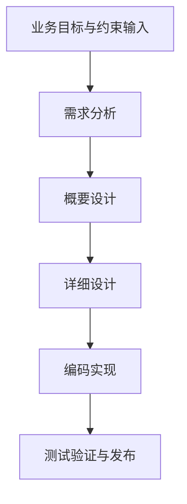

# AI 时代的软件工程：从需求分析到详细设计，哪些变了，哪些没变

## 一、历史背景：软件工程最初是为了解决什么问题

软件工程并不是一个先验存在的“标准答案”，它是在软件规模、协作复杂度和失败成本持续上升之后，被行业逐步固化出来的一套方法论。

在早期软件开发中，系统规模较小、交付周期较短、参与人数有限，很多项目可以依赖个体开发者的经验完成。随着业务系统从单机程序演化为多模块、多角色、长生命周期的软件产品，问题开始集中出现：

- 需求描述无法稳定映射到实现结果
- 模块边界缺乏约束，局部修改引发系统级连锁反应
- 项目知识沉淀在少数核心工程师脑中，人员流动后维护成本激增
- 线上故障暴露出的根因，往往源自更早阶段未显式识别的设计缺陷

因此，软件工程的本质并不是“增加流程”，而是**把原本隐含在个体经验中的约束、决策和验证动作显式化、结构化和可审查化**。它试图解决的核心问题始终没有变：在系统规模扩大、参与方增多、交付周期拉长的条件下，如何让软件仍然保持可理解、可实现、可验证和可演进。

## 二、传统软件开发流程：为什么会形成分阶段方法

传统软件开发之所以逐步形成“需求分析 -> 概要设计 -> 详细设计 -> 编码实现 -> 测试验证”的分阶段流程，原因并不神秘。不同类型的问题，应当在成本最低、信息最充分的阶段被处理，而不是一律推迟到编码或上线之后。

一个简化后的标准开发漏斗如下：

这套分层方法的核心价值在于两点：

1. **控制决策粒度**：先处理问题定义和系统边界，再处理模块交互与实现细节。
2. **前移缺陷发现**：越早识别问题，修复成本越低，影响范围越小。

如果直接跳过上游阶段，把模糊需求直接投射到代码层，系统通常会很快进入一种典型失控状态：边界先天模糊、接口约定后补、异常策略不统一、测试范围滞后于实现复杂度。

## 三、传统软件工程中的五个核心阶段

为了避免空泛叙述，下面以一个高并发 API Gateway 为锚点，说明传统软件工程中每一层分别在处理什么问题、产出什么结果。

假设业务输入只有一句话：

> 构建一个支持鉴权、限流、路由转发和基础监控能力的高并发 API Gateway。

这句话本身不能直接进入编码阶段，因为它没有明确回答系统边界、非功能目标、交互协议和异常行为。

### 1. 需求分析：定义范围、目标和约束

需求分析的职责不是扩写业务故事，而是把目标转换为可审查的需求集合。对专业项目而言，这一层至少要明确三类信息：

- **功能范围**：系统负责什么，不负责什么
- **非功能指标**：性能、容量、可用性、可观测性、安全要求
- **约束条件**：依赖边界、部署条件、合规要求、兼容性要求

以 API Gateway 为例，这一层通常需要明确：

- 峰值 QPS、平均 QPS、流量峰谷比
- P95 / P99 延迟目标
- 是否允许引入状态存储
- 是否支持匿名流量、灰度路由、熔断降级
- 哪些能力属于网关职责，哪些必须保留在后端业务服务

这一阶段的典型产物包括：

- 需求规格说明（Requirement Specification）
- 业务流程图
- 用例列表
- 非功能指标清单
- 约束与假设列表

需求分析结束后，团队应当能够回答的问题不是“系统听起来像什么”，而是“系统必须满足什么、不能越过什么”。

### 2. 概要设计：确定系统边界和总体结构

概要设计处理的是系统级决策，而不是实现细节。它关注模块职责、部署拓扑、调用关系和关键技术选型。

在 API Gateway 场景下，概要设计通常会涉及：

- 网关是否只负责协议接入与转发，还是承担部分业务编排
- 鉴权能力以内置插件形式实现，还是调用独立 Auth 服务
- 限流能力采用本地内存、集中式 Redis，还是混合策略
- 上下游通信协议是 `HTTP`、`gRPC` 还是混合接入
- 监控、日志、链路追踪如何接入整体可观测体系

这一阶段的典型产物通常包括：

- 系统上下文图（Context Diagram）
- 模块视图 / 架构图
- 部署视图 / 部署拓扑图
- 核心业务流程图
- 数据流图
- 技术选型与权衡记录

概要设计的职责，是明确系统边界、模块职责、部署关系以及关键技术决策。它回答的是结构问题，而不是代码实现问题。

### 3. 详细设计：把模块级行为、接口与时序说清楚

详细设计开始进入模块和接口层面。它不是重复概要设计，而是把概要设计中已经确定的结构进一步展开成可实现的局部设计。

对专业团队来说，详细设计至少应覆盖：

- 模块内部职责划分
- 接口定义、参数约束、返回值与错误码
- 状态机与生命周期转换
- 时序依赖与超时行为
- 并发控制、幂等性和异常处理策略

以鉴权过滤器为例，详细设计需要明确的问题包括：

- `Authorization` Header 的解析规则是什么
- Token 校验失败时返回 `401` 还是 `403`
- 远端鉴权服务超时时返回 `503` 还是进入降级路径
- 异常日志是否脱敏，监控指标如何打点
- 同一请求链路中的身份信息如何透传到后续模块

这一阶段的典型产物通常包括：

- UML 类图 / 组件图
- 时序图（Sequence Diagram）
- 状态机图
- 接口文档与参数表
- 数据结构定义
- 数据库表结构、缓存 Key 设计或数据字典
- 错误码表
- 异常处理规范

详细设计的职责，是明确模块内部行为、接口契约、状态转换、时序依赖以及异常路径，使实现阶段具备可直接落地的局部设计输入。

### 4. 编码实现：将设计约束翻译成可执行系统

编码实现阶段的职责是把上游设计落到具体代码、工程目录和构建产物中。它当然包含工程师的判断，但其首要前提应当是：上游已经形成足够稳定的约束。

这一阶段的典型工作包括：

- 工程目录与模块初始化
- 接口实现与业务逻辑编码
- 配置管理
- 日志、监控、链路信息接入
- 代码评审与静态检查

如果需求分析、概要设计和详细设计都不完整，编码阶段就会被迫承担大量本不属于它的决策工作，结果通常是：实现细节倒逼架构、局部修补替代整体设计、代码风格掩盖结构问题。

### 5. 测试与验证：证明系统行为符合设计预期

测试验证阶段的职责不是补充性确认，而是对前面所有设计假设进行证据化验证。

在专业工程语境下，测试至少包含以下层级：

- 单元测试：验证局部逻辑与边界条件
- 集成测试：验证模块间契约与依赖交互
- 回归测试：验证修改未破坏既有行为
- 性能测试：验证吞吐、延迟和资源占用
- 稳定性测试：验证高压、超时、熔断、重试等异常路径
- 安全验证：验证输入校验、鉴权、权限与敏感信息处理

对于 API Gateway，这一层真正要回答的是：

- 高并发条件下延迟是否符合预算
- 上游鉴权服务抖动时调用链是否按预期降级
- 限流策略是否存在误杀与漏杀
- 配置热更新是否破坏正在处理中的请求

测试验证的输出物，不应停留在“测试通过”的口头结论，而应当是可复现、可度量、可归档的验证记录。

## 四、为什么互联网时代很多团队弱化了这套流程

传统软件工程流程在真实组织中经常被诟病，并不是因为它要解决的问题不存在，而是因为它在很多团队里被执行成了低效的形式主义。

常见问题包括：

- 文档产物服务于汇报而非设计决策
- 图表数量增加，但边界和约束没有更清晰
- 评审会议延长，但风险识别深度不足
- 流程成为责任切分工具，而不是复杂度控制工具

与此同时，互联网业务环境又强化了另一个现实：交付速度本身就是竞争力。于是很多团队转向更轻量的方法，把一部分显式流程压缩掉，用资深工程师的隐性经验来补偿流程收缩带来的风险。

这也是敏捷实践能够在大量场景中成功落地的重要原因。它并不是“不需要工程约束”，而是在时间压力下，把部分约束从文档和图表中迁移到了核心开发者的心智模型中。

这种方法在纯人类协作时代尚可成立，因为资深工程师能够在编码和评审过程中不断纠偏：识别职责越界、修正接口设计、统一异常策略、提前发现性能风险。

## 五、AI 时代的变革：软件工程的执行形态被重构了

AI 编程带来的真正变化，不是让软件工程消失，而是让软件工程的各层职责重新分配。

模型可以高速生成代码、测试骨架、接口实现和重复性改动，但它并不天然拥有长期工程实践中形成的系统判断。它可以很好地完成局部任务，但不会自动保证全局边界、自顶向下的一致性以及跨阶段决策的延续性。

因此，AI 改变的不是“是否需要需求分析、概要设计和详细设计”，而是这些阶段的输出对象从单纯面向人类协作，扩展成了同时面向**人类团队 + 机器生成系统**。

### 1. 需求分析：从业务描述升级为生成约束

过去需求文档的主要目标，是让产品、研发、测试对目标形成一致理解。  
在 AI 时代，这一层还必须承担另一项职责：为后续自动化生成提供边界条件。

因此，需求分析的表达方式会更强调：

- 明确的容量指标
- 清晰的职责边界
- 可验证的非功能要求
- 禁止事项和依赖限制

对模型而言，模糊形容词几乎没有约束力，真正有效的是可执行、可验证的规格边界。

### 2. 概要设计：仍然是最核心的人类决策层

AI 可以帮助生成架构图、整理方案对比、列出候选选型，但概要设计本身依然高度依赖人类判断。原因在于，系统级 trade-off 通常绑定着团队能力、历史包袱、业务阶段和未来演进方向，这些上下文不可能被一次代码生成自动推导完整。

AI 可以参与分析，但不能替代系统边界决策。

### 3. 详细设计：从长文档走向高密度约束表达

详细设计没有消失，但它的表达形式正在变化。

过去大量详细设计文档承担的是实现前的对齐职责；现在其中一部分内容可以被模型自动展开，因此更有价值的详细设计，开始聚焦于那些最容易被误生成、误解或越界的部分：

- 接口契约
- 参数与字段约束
- 时序依赖
- 并发语义
- 错误码与异常路径
- 降级、重试、幂等和补偿策略

也就是说，详细设计正在从“尽量写全”转向“优先写清最关键的局部约束”。

### 4. 编码实现：最先被大规模自动化的阶段

编码实现是 AI 改造最明显的阶段。只要上游约束足够清楚，模型在以下工作上通常都能提供高产出：

- 样板代码生成
- 控制流展开
- 类型补全
- 接口骨架实现
- 重复性重构
- 初始测试生成

这意味着编码阶段的单位产出成本显著下降，但也意味着上游设计质量会以前所未有的速度被放大到代码层。

### 5. 测试与验证：从质量保障层升级为控制层

在 AI 时代，测试验证不只是确认代码正确，更承担着约束模型幻觉、发现越界实现和阻断回归风险的职责。

过去测试更多是“验证实现是否符合需求”；现在它还要验证“模型是否在未被授权的情况下引入了额外决策”。这使得测试与验证从传统意义上的质量保障层，进一步上升为生成系统的控制层。

## 六、对专业团队而言，哪些没有变，哪些已经变了

用一张表总结传统流程与 AI 时代的对应关系：

| 阶段 | 传统软件工程的核心职责 | AI 时代的变化 | 当前主要责任主体 |
| :--- | :--- | :--- | :--- |
| 需求分析 | 定义范围、目标、约束和非功能指标 | 从面向团队沟通，扩展为面向生成系统的规格约束 | 人 |
| 概要设计 | 决定边界、分层、部署和关键选型 | 仍然是系统级决策中心，重要性上升 | 人 |
| 详细设计 | 明确模块行为、接口、时序和异常处理 | 从长篇描述转向高密度契约表达 | 人主导，AI 可辅助展开 |
| 编码实现 | 把设计翻译成可执行系统 | 自动化程度显著提高 | AI 为主，人负责审查 |
| 测试验证 | 证明系统行为满足需求与质量标准 | 从验证层升级为生成控制层 | 人定义标准，AI 可辅助生成 |

## 七、结论

如果从专业工程视角来看，AI 并没有改变软件工程存在的根本原因。系统仍然需要范围控制、边界设计、接口约束、实现规范和验证机制。

真正发生变化的是两点：

1. **编码与部分详细设计工作被大规模自动化。**
2. **上游规格与下游验证的重要性进一步上升。**

因此，AI 时代的软件工程不是传统流程的终结，而是一次职责重排：机器接管了更多实现性劳动，人类则必须把更多精力放在问题定义、系统级设计、关键约束表达和验证闭环上。

从这个意义上说，AI 改变的是软件工程的执行形态，而不是它控制复杂度的基本职能。

*作者：[AI-Authored Tech Chronicles]*
*系列：《AI 编程思想》第一篇*
*写于 2026-04-22*
