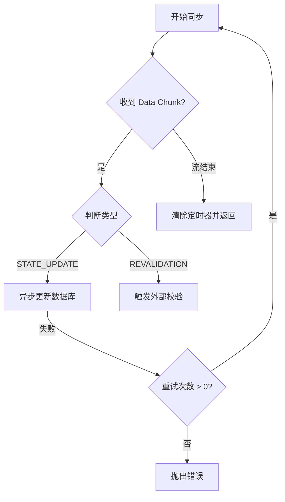

# 02. AI 协作中的“理解力债务”

> 在 AI 编程把产出速度推到前所未有高度之后，很多团队开始碰到一种新的维护成本: 代码能跑，但人并不真正理解它。本文尝试把这种新型债务拆开来看，解释它从哪里来，又该怎样控制。

---

## 一、Why：AI 把“写代码”这件事变快了，也把“理解代码”这件事变慢了

在传统开发里，代码通常是开发者心智模型的外部化过程。

你一边思考，一边落笔。变量为什么这样命名，状态为什么这样流转，异常为什么这样兜底，很多逻辑并不是写完之后才理解，而是在书写过程中逐步被确认的。代码写出来的同时，人对代码的心理地图也一起长出来了。

AI 编程把这个顺序反了过来。

现在更常见的过程是：先由模型在几十秒内生成一大段完整实现，再由人回过头去阅读、验证、补洞和维护。代码的生命周期从过去的 `思考 -> 编写 -> 运行 -> 维护`，变成了 `生成 -> 阅读 -> 理解 -> 维护`。

这看起来只是顺序变化，实际却改变了整个维护难度的来源。

因为机器生成速度几乎可以近似看成 `O(1)`，而人类理解复杂逻辑的速度，始终受限于注意力、上下文容量和经验背景，往往更接近 `O(n)`。一旦生成速度远高于理解速度，团队就很容易进入一种危险状态：代码在数量上不断膨胀，但对代码的真实掌控力并没有同步增长。

这就是“理解力债务”出现的土壤。

---

## 二、What：什么叫“理解力债务”？

所谓**理解力债务 (Understanding Debt)**，并不是指代码一定写得烂，也不是指系统已经不能运行。它更像是一种认知上的透支：

> 项目中存在大量“运行正确，但开发者无法对其内部逻辑进行稳定心理模拟”的代码。

它和传统技术债并不是一回事。

- **技术债**：你知道这里实现得不够好，也知道为什么不好，只是暂时没时间修。
- **理解力债务**：你可能觉得这段代码写得挺漂亮，测试也过了，但你其实并不真正拥有它。一旦要改、要扩展、要排障，你会发现自己对它的内部机制只有碎片化印象。

这类债务在纯人类开发时代当然也存在，但增长速度通常是可控的。因为代码大多是团队自己一行一行写出来的，生成速度没有那么离谱，理解速度虽然慢，但至少能跟得上。

AI 把这个比例打破之后，理解力债务开始变成一种结构性问题。

---

## 三、How：理解力债务是怎么积累起来的

### 1. 从“导出”模式切到了“导入”模式

传统编程更像一种 **Export（导出）**：

`大脑 -> 逻辑 -> 代码`

AI 编程则更像一种 **Import（导入）**：

`AI -> 代码 -> 大脑`

当代码不再主要由你亲手推演出来，而是先作为成品落在你面前时，你和代码之间就天然少了一层“生成过程中的逻辑锚点”。

### 2. AI 更擅长局部成立，不擅长自动维持全局一致

模型非常擅长把一个局部任务写得像模像样。单看一个函数、一个 Controller、一个 Hook、一个异步处理器，它常常都说得过去。

真正的问题出在系统层级：多个局部模块拼在一起之后，状态转换是否一致，失败路径是否闭合，职责边界是否越界，长期维护是否可控。这些东西并不是看几眼 I/O 就能确认的。

### 3. 人类会不自觉退化成“黑盒驱动”

当 AI 一次性产出大量代码时，开发者最容易采取的自保方式，就是只验证输入输出是否符合预期，而不再去跟踪内部状态到底如何变化。

短期看，这样做非常高效。长期看，这恰恰是在把理解力债务滚大。因为你验证的是“这次能不能跑”，而不是“以后我还能不能改”。

---

## 四、具象工程锚点：一段异步流代码里，债务是怎么长出来的

我们来看一段典型的 JavaScript 异步流处理逻辑。AI 很容易一次性生成类似下面的代码：

```javascript
async function syncProjectState(projectId, retryCount = 3) {
  const stream = getProjectEventStream(projectId);

  return new Promise((resolve, reject) => {
    let completed = false;
    const timeout = setTimeout(() => {
      if (!completed) reject(new Error('Sync Timeout'));
    }, 10000);

    stream.on('data', async (chunk) => {
      try {
        if (chunk.type === 'STATE_UPDATE' && !chunk.isStale) {
          await db.projects.update({ id: projectId }, { $set: chunk.data });
        } else if (chunk.requiresRevalidation) {
          await triggerExternalRecheck(projectId);
        }
      } catch (e) {
        if (retryCount > 0) {
          resolve(syncProjectState(projectId, retryCount - 1));
        } else {
          reject(e);
        }
      }
    });

    stream.on('end', () => {
      completed = true;
      clearTimeout(timeout);
      resolve({ status: 'success' });
    });
  });
}
```

乍看之下，这段代码并不离谱。它有超时控制、有事件流、有异常处理、还有递归重试，看上去甚至像一个“考虑得很周到”的实现。

但理解力债务通常就藏在这种代码里，因为它的问题不是语法错误，而是**阅读者很难快速建立稳定的状态模型**。

例如：

1. `stream.on('data')` 里的 `await` 并不会阻塞下一次事件到达，多个更新之间可能存在隐式竞态。
2. `resolve(syncProjectState(...))` 这种递归重试写法，会让 Promise 链路变得不直观，调试时很难判断到底处在第几层重试。
3. `end` 事件和超时回调之间有没有竞态窗口，阅读时并不能一眼确认。

也就是说，这类代码的危险，不在于它不能运行，而在于它会让维护者在“好像理解了”和“真正能改动它”之间反复摇摆。

---

## 五、怎么降低理解力债务：核心不是完全拒绝 AI，而是强制建立同步锚点

理解力债务不可能彻底消失。只要团队在用 AI，它就一定会存在。真正有意义的问题不是“如何消灭它”，而是“如何把它控制在可维护范围内”。

### 1. 先让 AI 解释逻辑，再让它生成代码

不要一上来就让模型“把功能写完”，而应该先要求它输出：

- 核心状态流转
- 关键分支判断
- 异常路径与失败处理
- 哪些部分最可能存在不确定性

这样做的目的不是拖慢效率，而是先为人建立逻辑锚点。

### 2. 测试先行，把边界变成显式资产

在 AI 时代，测试的一个额外作用，是帮助人类把“我认为这个逻辑应该怎样工作”表达成可执行契约。

如果关键模块在生成代码前就已经有测试样例，那么后续无论模型怎样改写实现，团队至少还掌握着对边界条件的主动解释权。

### 3. 让状态流转可视化

对于异步逻辑、状态机、补偿流程、事件驱动链路，要求 AI 额外输出 Mermaid 图、调用图或步骤分解，往往比单纯多看几遍代码更有效。

例如，上面那段逻辑如果配一张状态图，人至少能先搞清楚自己在追什么：



### 4. 把高风险代码分层对待

并不是所有 AI 生成代码都要被完全理解。

一些边缘工具层、接口适配层、稳定的基础组件，可以容忍存在一定程度的“二类理解力债务”。只要接口清晰、行为稳定，它们可以被当成黑盒使用。

但一旦进入以下区域，就必须强制降低生成速度：

- 核心业务规则
- 权限与鉴权链路
- 资金、结算、库存这类高后果系统
- 跨服务事务与补偿逻辑

这些地方的代码，不能只要求“跑通”，还必须要求团队能解释、能推演、能重构。

---

## 六、如何度量这类债务

“理解力债务”听起来很抽象，但团队仍然可以用一些近似指标去观察它是否正在恶化：

| 指标名称 | 观察方式 | 警示信号 |
| :--- | :--- | :--- |
| **AI 代码占比 (ARC)** | `AI 生成代码行数 / 总代码行数` | 持续升高但评审机制没同步加强 |
| **CR 认知偏差 (CRD)** | Review 中发现的隐性逻辑问题数量 | 每 100 行持续偏高 |
| **重构失败率 (RFR)** | 修改 AI 代码后引入非预期 Bug 的频率 | 同类模块反复返工 |
| **心智模型同步度 (MMS)** | 团队成员能否说清核心逻辑分支 | 关键模块只能“看个大概” |

这些指标不需要追求精确到小数点，它们的意义更像是健康检查：提醒团队，不要把“代码生成得很快”误当成“系统掌控力在提升”。

---

## 七、Trade-offs：效率和掌控力，本来就不可能同时拉满

理解力债务之所以难处理，是因为它不是一个纯技术问题，而是一个效率与掌控力之间的动态平衡问题。

如果你要求团队对所有 AI 生成代码都逐行彻底理解，那速度优势会几乎被抵消。  
如果你放任团队只看 I/O、不管内部逻辑，那系统迟早会积累出一个没人敢碰的黑盒地带。

所以更现实的做法，是承认三件事：

1. **人类理解速度就是比生成速度慢。** 这不是态度问题，是生理限制。
2. **并非所有代码都值得同等强度的理解。** 关键路径和边缘代码必须分层治理。
3. **文档、测试、图示、Review 不再只是附属物。** 它们开始承担“同步人类心智模型”的作用。

从这个角度看，AI 并没有让维护变简单，它只是把维护成本从“写代码”一部分转移到了“理解代码”。

---

## 八、结论

理解力债务是 AI 时代非常典型的一类新型工程债务。

它最危险的地方在于，系统在表面上可能运行正常，团队甚至会因为开发效率显著提升而产生错觉，误以为一切都在变好。真正的风险往往要等到需求变更、线上故障、跨模块重构时才集中爆发。

所以，对今天的高级工程师和 Tech Lead 来说，新的任务已经不只是写出正确代码，而是确保团队对关键代码始终保有解释权和修改权。

这意味着，你要学会主动降低某些环节的生成速度，主动增加同步锚点，主动把“理解”这件事重新设计回工作流里。

因为在 AI 时代，系统真正稀缺的，未必是代码产能，而是**人类对系统的持续掌控力**。

---

*作者：[AI-Authored Tech Chronicles]*
*系列：《AI 编程思想》第二篇*
*写于 2026-04-22*
