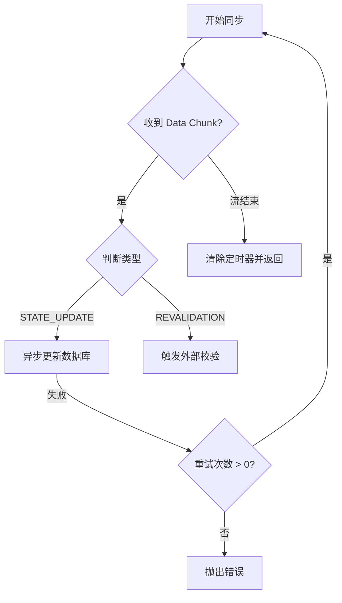

# AI 协作新范式（一）：攻克“理解力债务”

> 在 AI 编程使产出效率提升 10 倍的表象下，开发者正面临前所未有的“理解力债务”。本文解析心智模型失效的底层逻辑，并为高级工程师提供一套可落地的同步方案。

---

## 一、 Why：设计背景与速度失衡的物理本质

在传统软件工程中，编写代码是开发者**心智模型（Mental Model）的外部化过程**。每一行代码的产生都伴随着逻辑的推演与验证。然而，在 AI 驱动的开发范式下，这一过程发生了根本性逆转。

### 1.1 速度的不对称性
代码的生命周期可以简化为：`生成 (Generate) -> 阅读 (Read) -> 理解 (Understand) -> 维护 (Maintain)`。
- **AI 生成 (O(1))**：大语言模型可以在数秒内生成数百行复杂的逻辑。
- **人类理解 (O(n))**：人类大脑处理代码信息的带宽受限于生理结构，理解速度与代码复杂度成线性（甚至指数级）相关。

当 $V_{generate} \gg V_{understand}$ 时，开发者被迫进入“黑盒驱动”模式：只验证输入输出（I/O），而不追踪内部状态转换。

### 1.2 “理解力债务”的定义
**理解力债务 (Understanding Debt)** 是指：项目中存在大量“运行正确但开发者无法对其内部逻辑进行实时心理模拟”的代码。

这种债务与传统技术债的区别在于：
- **技术债**：你知道这里写得烂，但你理解它为什么烂。
- **理解力债务**：你可能觉得代码写得很好，但你并不真正“拥有”它。

---

## 二、 What & How：心智模型失效与同步破局

### 2.1 从“导出”到“导入”的适配错误
传统编程是 **Export（导出）** 模式：大脑 -> 逻辑 -> 代码。
AI 编程是 **Import（导入）** 模式：AI -> 代码 -> 大脑。

由于缺乏“亲自编写”时的逻辑锚点，开发者在维护 AI 生成的代码时，其心智模型往往是碎片化的。

### 2.2 具象工程锚点：复杂异步逻辑的“理解力断层”

以一段标准的 JavaScript 异步流处理为例。AI 可能会一次性生成如下代码：

```javascript
/**
 * 具象锚点：高度抽象的异步重试与状态同步逻辑
 * 由 AI 一次性生成，常导致开发者在后续调试时产生认知盲区
 */
async function syncProjectState(projectId, retryCount = 3) {
  const stream = getProjectEventStream(projectId);
  
  return new Promise((resolve, reject) => {
    let completed = false;
    const timeout = setTimeout(() => {
      if (!completed) reject(new Error('Sync Timeout'));
    }, 10000);

    stream.on('data', async (chunk) => {
      try {
        // AI 倾向于在此处组合复杂的条件逻辑
        if (chunk.type === 'STATE_UPDATE' && !chunk.isStale) {
          await db.projects.update({ id: projectId }, { $set: chunk.data });
        } else if (chunk.requiresRevalidation) {
          await triggerExternalRecheck(projectId);
        }
      } catch (e) {
        if (retryCount > 0) {
          console.warn(`Retrying... ${retryCount}`);
          resolve(syncProjectState(projectId, retryCount - 1));
        } else {
          reject(e);
        }
      }
    });

    stream.on('end', () => {
      completed = true;
      clearTimeout(timeout);
      resolve({ status: 'success' });
    });
  });
}
```

**理解力债务分析：**
1. **隐式竞态**：`stream.on('data')` 中的 `await` 并没有阻塞流的下一次触发。AI 极少主动处理这种情况，而人类在快速浏览时极易忽略。
2. **递归重试与 Promise 嵌套**：`resolve(syncProjectState(...))` 可能导致内存中的 Promise 链过长。

### 2.3 同步策略：AI-Driven TDD 与逻辑显式化

为了消除债务，必须将“导入”过程主动降速，并强制建立同步锚点。

#### 1. 意图先行 (Intent-First Prompts)
不要让 AI “写一个函数”，而是让 AI “描述这个函数的逻辑链路”，确认后方可生成代码。

#### 2. AI 驱动的测试先行 (TDD-AI)
在生成核心业务逻辑前，要求 AI 先生成测试用例。测试用例是人类心智模型中“边界条件”的具体映射。

#### 3. 实时状态流转图
利用 Mermaid 等工具要求 AI 实时输出逻辑的状态转换图。



---

## 三、 定量度量指标：如何评估理解力债务？

工程师应定期通过以下指标评估项目的健康度：

| 指标名称 | 计算公式/衡量方式 | 警示阈值 |
| :--- | :--- | :--- |
| **AI 代码占比 (ARC)** | `AI生成的代码行数 / 总行数` | > 60% (需加强评审) |
| **CR 认知偏差 (CRD)** | `代码审查者发现的隐性逻辑错误数` | 每 100 行 > 2 个 |
| **重构失败率 (RFR)** | `修改 AI 代码导致非预期 Bug 的频率` | > 20% |
| **心智模型同步度 (MMS)** | `开发者能闭眼描述出的逻辑分支占比` | < 80% (极度危险) |

---

## 四、 Trade-offs：效率与掌控力的博弈

追求零理解力债务在 AI 时代是不现实的，我们需要在两者间取得动态平衡：

1. **承认认知上限**：承认某些高度抽象的底层框架代码可以作为“二类债务”存在（即只要接口稳定，不追求完全理解实现）。
2. **强制“降速”**：在涉及核心业务、金融结算、权限模型等关键路径时，强制关闭“一键生成”，改为交互式对话式编程。
3. **文档即同步**：代码不再是最终产物，代码 + 生成逻辑的解释 + 验证记录才是。

---

## 五、 结论

理解力债务是 AI 时代对高级工程师的全新考验。我们需要从“代码编写者”转型为“逻辑审计师”与“系统架构守护者”。唯有主动降低导入速度，建立高频同步锚点，才能避免在 AI 速度的洪流中失去对复杂系统的掌控。

---
> **下一篇预告**：*《人机协同新范式（二）：Prompt Engineering 中的“第一性原理”解构》*

---

*作者：[AI-Authored Tech Chronicles]*
*系列：《AI 编程思想》第一篇*
*写于 2026-04-22*
