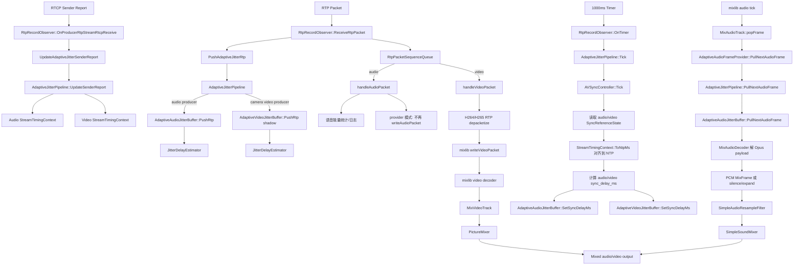
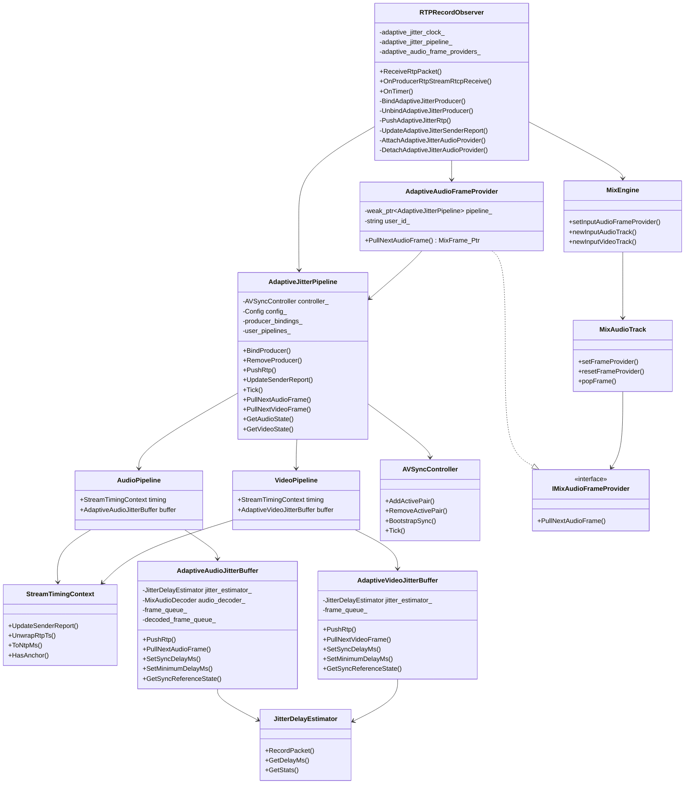

# mixed 录制自适应抖动缓冲与音视频同步设计

配套执行计划：

- [mixed 录制自适应抖动缓冲与音视频同步 Implementation Plan](../plans/2026-05-06-adaptive-jitter-av-sync-mixed-implementation.md)

## 背景

当前 mixed 录制路径在 worker 侧仍依赖固定 `500ms` RTP 抖动等待，核心逻辑集中在：

- `worker/src/RTC/RTP2H264.cpp`
- `worker/src/RTC/RtpRecordObserver.cpp`
- `mixlib` 当前的 `MixAVTimeSync`

现状有 4 个同时成立的问题：

1. 网络好时固定 `500ms` 延迟浪费严重。
2. 网络差时固定值又不够，导致花屏、断音、关键帧恢复慢。
3. 声画同步职责分散在 worker 和 mixlib 两边，边界不清楚。
4. RTP -> NTP 时间基目前基本只吃首次 RTCP SR，长时间录制存在累计漂移风险。

本次改造不是“把 500ms 改小”，而是把 mixed 录制补成一套新的**单用户 A/V 同步时间基系统**。

## 目标

第一版必须同时满足：

1. mixed 录制稳定，不花屏不断音。
2. 单用户音频和视频保持同步。
3. 网络好时显著降低当前固定 `500ms` 延迟。
4. 长时间录制不因只使用首次 SR 而持续漂移。

## 第一版范围

### 包含

1. 只改 mixed 录制路径。
2. 同步单位是“单个用户的一路音频 + 一路视频”。
3. 支持 4 种输入形态：
   - 只有视频
   - 只有音频
   - 音视频同时存在
   - 运行中从单流切到双流，或从双流退回单流
4. 新建 worker 侧自适应抖动缓冲组件：
   - `AdaptiveVideoJitterBuffer`
   - `AdaptiveAudioJitterBuffer`
5. 新建慢控制器：
   - `AVSyncController`
6. 每次 RTCP SR 到来都更新 RTP -> NTP 映射。
7. 音频在 PCM 层支持：
   - PLC
   - 轻量平滑变速
8. mixed 路径中：
   - 视频继续走编码帧输入 mixlib
   - 音频改为 PCM 输入 mixlib

### 不包含

1. single record 路径。
2. 跨用户全局统一时间线。
3. whiteboard 同步。
4. screen 作为第一版主验收路径。
5. 更高级的音频时伸算法，如 WSOLA。
6. 通用 `SharedTimeBaseManager` 全局实现。
7. 在旧 `RtpPacketSequenceQueue` 上增量打补丁。

## 命名与文件组织规范

本方案新增的 C++ 类型和文件，必须遵循仓库 [AGENTS.md](/mnt/d/devel/workspace/feature-codex/feature-record-jitter-codex/AGENTS.md:53) 中约束的 Google C++ 风格，与 WebRTC 源码风格保持一致。

关键要求：

1. 文件名使用 `snake_case`
2. 类名/结构体名使用 `CamelCase`
3. 方法名使用 `CamelCase`
4. 变量名/参数名使用 `snake_case`
5. 成员变量使用 `snake_case_`
6. 结构体字段使用 `snake_case`
7. 枚举值使用 `kCamelCase`
8. 禁止使用 `m_` 前缀成员变量命名

针对本方案，新增内部模块建议命名示例：

```text
worker/src/RTC/AdaptiveJitterBuffer/
  adaptive_audio_jitter_buffer.hpp
  adaptive_audio_jitter_buffer.cpp
  adaptive_video_jitter_buffer.hpp
  adaptive_video_jitter_buffer.cpp
  jitter_delay_estimator.hpp
  jitter_delay_estimator.cpp
  av_sync_controller.hpp
  av_sync_controller.cpp
  stream_timing_context.hpp
  sync_tuning_config.hpp
```

示例：

```cpp
class AdaptiveAudioJitterBuffer {
public:
    void PushRtp(const RTC::RtpPacket& packet, int64_t recv_wallclock_ms);
    SyncReferenceState GetSyncReferenceState() const;

private:
    int64_t reference_rtp_ts_unwrapped_;
    int64_t current_delay_ms_;
};

struct SyncReferenceState {
    bool active;
    bool has_reference;
    int64_t reference_rtp_ts_unwrapped;
    int64_t current_delay_ms;
    int64_t last_packet_wallclock_ms;
};
```

补充约束：

1. `worker/src/RTC/AdaptiveJitterBuffer/` 视为**内部实现目录**
2. `worker/include/RTC/*.hpp` 不允许直接 include 该目录下的私有头
3. 私有头的 include 只允许出现在 `.cpp` 或对应私有测试中

## What already exists

现有代码已经部分解决了子问题，本设计优先复用这些能力，不重造轮子：

1. `RTP2H264.cpp` / `RTP2H265.cpp`
   - 现有 H264/H265 RTP 拆包和组帧能力可继续参考。
   - 但第一版不复用其固定 jitter queue 结构。
2. `RtpRecordObserver.cpp`
   - 已有 mixed 路径总入口、按 user 维护 producer 关系、写入 mixlib 的主链路。
   - 第一版继续以它作为 mixed 总入口。
3. `RtpStreamRecv.cpp`
   - 已有 RTCP SR 解析与 `GetSenderReportNtpMs()/GetSenderReportTs()` 能力。
   - 第一版直接复用该能力，但改为每次 SR 都参与更新时间基。
4. `mixlib-jitter-codex`
   - 是 `klmixer` 的实现源码仓。
   - 最终产物需要构建并同步到 `worker/internal_libs/klmixer` 的 headers 和 `libKlMixer.a`。
5. `mixlib`
   - 继续承担视频解码、混画、混音、编码和输出。
   - 不再承担复杂 A/V 同步策略。

## 实施阶段

### 阶段 1

先落 mixed `camera + mic` 主路径：

1. 引入 `AdaptiveAudioJitterBuffer`
2. 引入 `AdaptiveVideoJitterBuffer`
3. 引入 `AVSyncController`
4. 引入 `StreamTimingContext`
5. 接通 mixlib provider pull 接口
6. 保证 mixed 主链路可跑通并通过测试矩阵

### 阶段 2

在阶段 1 稳定后，再清理和收敛：

1. 清理旧 `MixAudioBaseTimeSync` 路径
2. 收口旧固定 jitter 逻辑的遗留调用点
3. 根据实现结果决定是否进一步统一内部状态结构

## 关键设计决策

### D1. 只保留 3 个核心角色

第一版收敛为 3 个角色：

1. `AdaptiveAudioJitterBuffer`
2. `AdaptiveVideoJitterBuffer`
3. `AVSyncController`

不再引入额外的重型 `MediaSyncUnit` 大类。

### D2. 三条路径分离

系统分成 3 条路径：

1. **arrival path**
   - RTP / RTCP 到达时更新 jitter、时间基、组帧、解码
2. **slow sync loop**
   - `AVSyncController` 慢速计算同步延迟
3. **pull path**
   - mixlib 只按自己的节拍拉取音频和视频
4. **timing context**
   - RTP / SR 形成的统一媒体时间基由上层 timing context 维护

### D3. `AVSyncController` 只做慢变量

`AVSyncController` 只负责：

1. 计算平滑后的 A/V 相对偏差
2. 计算并下发同步延迟：
   - `audio_sync_delay`
   - `video_sync_delay`
3. 做长期 drift 修正

它不负责：

1. 当前这帧视频要不要 drop
2. 当前音频要不要 PLC
3. 当前是否要等关键帧恢复

这些都留在数据面的 jitter buffer pull 逻辑里。

### D4. 视频 buffer 不知道“模式”，只知道 delay

`AdaptiveVideoJitterBuffer` 不需要知道：

- `VIDEO_ONLY`
- `AUDIO_ONLY`
- `AV_WARMUP`
- `AV_SYNC`

它只需要知道：

1. 自己的基础 `minimum_delay`
2. `AVSyncController` 下发的额外 `video_sync_delay`

然后在被 mixlib pull 时根据内部 playout timeline 决定：

1. 正常出帧
2. hold
3. 丢过期非关键帧
4. 等关键帧恢复

### D5. `AVSyncController` 对齐 WebRTC 的层级

`AVSyncController` 的职责对标 WebRTC `RtpStreamsSynchronizer`：

1. 它是控制面，不是数据面。
2. 它只调整 delay bias，不直接出帧。
3. 默认用 mediasoup worker 的 libuv timer 驱动，周期先按 `1000ms` 设计。

但第一版和 WebRTC 的区别是：

1. **慢速 drift 修正** 用 `1000ms` 周期。
2. **首次双流 join / 单双流切换** 不等 `1000ms`，改为事件触发立即 bootstrap。
3. **音频不是永远不动**，当视频长期追不上时，允许逐步增加 `audio_sync_delay`。

这样既保留 WebRTC 的慢环思想，又避免 mixed 录制 join 太钝。

## 当前实现总览

本节用于快速理解当前代码形态。当前状态是：

1. **音频 provider 已接管 mixed 输入音频**：mixlib audio tick 从 worker adaptive audio buffer pull PCM frame。
2. **视频 provider 尚未启用**：adaptive video buffer 目前只作为 shadow buffer 参与 timing / jitter / sync 状态，真实 mixed 视频仍走旧 mixlib video packet 路径。
3. **A/V sync 是控制面**：`AVSyncController` 只计算 audio / video 需要增加的 `sync_delay_ms`，不直接决定出帧。
4. **出帧策略在 buffer 内完成**：audio / video buffer 在被 mixlib pull 时，结合 jitter delay、minimum delay、sync delay 决定输出、expand、hold 或 drop。

### 当前流程图



阅读要点：

1. RTP arrival path 只负责收包、排序、估计 jitter、更新 buffer。
2. RTCP SR path 只负责更新时间基，供后续 RTP -> NTP 对齐。
3. 1000ms timer 只驱动 `AVSyncController` 慢环，算同步延迟。
4. mixlib audio tick 是音频真正出帧的驱动源。
5. 视频现在仍在旧路径输出，adaptive video provider 要等真实视频 decode 后再启用。

### 当前类图



类关系理解：

1. `RtpRecordObserver` 是集成入口，负责把 producer、RTP、SR、timer 和 mixlib provider 串起来。
2. `AdaptiveJitterPipeline` 是 per-user 聚合层，内部持有 audio / camera video pipeline。
3. `StreamTimingContext` 只处理 RTP unwrap 和 SR anchor，不处理 jitter buffer 策略。
4. `AVSyncController` 通过 `SyncReferenceState` 读取双方当前播放参考，再通过 `SetSyncDelayMs()` 写回 delay bias。
5. `AdaptiveAudioFrameProvider` 是 mixlib 与 worker adaptive audio buffer 之间的薄适配层。

## 整体架构

```text
Arrival path
============
Producer RTP / RTCP
    |
    v
RTPRecordObserver
    |
    +-- per user AdaptiveAudioJitterBuffer
    |      |
    |      +-- RTP 排序 / jitter 统计 / Opus decode / PCM queue
    |
    +-- per user AdaptiveVideoJitterBuffer
           |
           +-- RTP 排序 / jitter 统计 / H264/H265 组帧 / video frame queue

Slow sync loop
==============
mediasoup worker libuv timer
    |
    v
AVSyncController
    |
    +-- read audio SyncReferenceState
    +-- read video SyncReferenceState
    +-- compute smoothed relative delay
    +-- set sync delay
          |
          +-- audio_sync_delay -> AdaptiveAudioJitterBuffer
          +-- video_sync_delay -> AdaptiveVideoJitterBuffer

Pull path
=========
mixlib audio tick  --> PullNextAudioFrame()
mixlib video tick  --> PullNextVideoFrame()
```

## 双阶段 + 一慢环模型

### 第一阶段：arrival path

RTP / RTCP 到达时立即完成：

1. RTP -> NTP 映射更新
2. jitter 统计更新
3. RTP 排序、去重、乱序恢复
4. 视频组帧
5. 音频解码到 PCM
6. 候选 media unit 入各自 buffer

注意：

1. 这一阶段只产出“已经准备好的候选帧/候选 PCM”。
2. 这一阶段不决定“现在是否应该播放”。

### 第二阶段：slow sync loop

由 `AVSyncController` 周期性执行：

1. 从 audio buffer 读取“音频当前同步参考游标”
2. 从 video buffer 读取“视频当前同步参考游标”
3. 计算平滑后的相对偏差
4. 更新同步延迟：
   - `audio_sync_delay`
   - `video_sync_delay`

注意：

1. 它只调慢变量。
2. 默认周期 `1000ms`。
3. 双流首次建立或恢复时，由事件触发立刻做一次 bootstrap，不等下一个周期。

### 第三阶段：pull path

由 mixlib 的音频 / 视频消费节拍触发：

1. `AdaptiveAudioJitterBuffer::PullNextAudioFrame()`
   - 返回真实 PCM 或 PLC
   - 推进 `reference_rtp_ts_unwrapped`
2. `AdaptiveVideoJitterBuffer::PullNextVideoFrame()`
   - 根据自身 `minimum_delay + video_sync_delay`
   - 决定正常出帧、hold、drop 过期非关键帧或等待关键帧恢复

## 统一 NTP 时间域

音频和视频在进入同步控制逻辑后，都要被换算到统一的 NTP 时间轴（ms）。

```text
audio RTP/SR -> audio mapped ntp ms
video RTP/SR -> video mapped ntp ms
```

后续同步判断都基于这个统一 NTP 时间域，而不是 wall clock。

## Stream Timing Context

### 设计原则

buffer 对外只接受 RTP。

它们不直接处理原始 RTCP SR 包，也不在 public API 中暴露 `UpdateSenderReport()`。

SR 解析继续复用 mediasoup worker 现有链路：

1. `RtpStreamRecv` 解析 SR
2. `Producer` 把解析结果上抛
3. `RTPRecordObserver` 更新每路流的 timing context

### 共享时间基状态

每条流维护一个轻量 timing context，例如：

```cpp
struct StreamTimingContext {
    bool has_anchor = false;
    uint32_t clock_rate = 0;
    int64_t sr_ntp_ms = 0;
    int64_t sr_rtp_ts_unwrapped = 0;
    Unwrapper<uint32_t> ts_unwrapper;
};
```

职责：

1. 保存 RTP -> 公共 NTP 时间轴的 anchor
2. 在处理 RTP 时，把 RTP timestamp 换算为统一 NTP 时间轴上的 ms
3. 支持长时间录制下每次 SR 到来后的时间基刷新

### 边界

1. `AdaptiveAudioJitterBuffer` / `AdaptiveVideoJitterBuffer`
   - 只收 RTP
   - 通过对应的 `StreamTimingContext` 获取 unwrapped RTP 时间游标
   - 不在 buffer 内做跨媒体 NTP 比较
2. `AVSyncController`
   - 读取 buffer 暴露的 `SyncReferenceState`
   - 读取 timing 层整理好的 measurement
   - 计算双边同步延迟

这和 WebRTC 的分层一致：

1. buffer 不直接处理 SR 包
2. 上层同步器拿整理好的 timing information 做跨媒体同步

## Sync Reference State

audio 和 video 对外统一暴露同一个同步参考状态结构：

```cpp
struct SyncReferenceState {
    bool active;
    bool has_reference;
    int64_t reference_rtp_ts_unwrapped;
    int64_t current_delay_ms;
    int64_t last_packet_wallclock_ms;
};
```

这里最关键的是：

- `reference_rtp_ts_unwrapped`

它表示该流当前用于同步比较的 RTP 时间游标。

语义按流类型解释：

1. audio:
   - `reference_rtp_ts_unwrapped` 表示音频实际已经播放到的 RTP 时间游标
2. video:
   - `reference_rtp_ts_unwrapped` 表示视频当前下一帧候选输出的 RTP 时间游标

同步参考必须来自这里，而不是“最新收到的 RTP 时间”。

controller 不直接比较裸 RTP 时间，而是先通过各自的 timing context 换算到统一 NTP 时间轴。

### 同步参与资格表

| `active` | 有时间基 anchor | 有可同步参考游标 | 允许参与 sync loop | 允许 bootstrap |
|---|---|---|---|---|
| false | 任意 | 任意 | 否 | 否 |
| true | 否 | 否 | 否 | 否 |
| true | 是 | 否 | 否 | 否 |
| true | 是 | 是 | 是 | 是 |

说明：

1. audio 侧“有可同步参考游标”表示至少已经产出过一段真实 PCM 或 PLC，并更新了 `reference_rtp_ts_unwrapped`
2. video 侧“有可同步参考游标”表示至少已有一帧可作为下一候选输出帧
3. `AVSyncController` 只能对“允许参与 sync loop”的双边流计算同步延迟

## `AVSyncController`

### 职责

1. 读取 audio `SyncReferenceState`
2. 读取 video `SyncReferenceState`
3. 计算平滑后的 `relative_delay_ms`
4. 计算新的同步延迟：
   - `audio_sync_delay_ms`
   - `video_sync_delay_ms`
5. 分别下发给 audio / video buffer

### 周期

第一版默认：

- `sync_tick_interval_ms = 1000`

理由：

1. 这层只做慢速 drift 修正，对标 WebRTC `RtpStreamsSynchronizer`
2. 不让它承担当前帧级别的快速决策

### bootstrap

虽然慢环默认 1 秒，但下面这些场景不等定时器：

1. 音频从无到有
2. 视频从无到有
3. 单流切到双流
4. 双流中的一侧恢复

这些场景由 `RTPRecordObserver` 或 buffer 活跃状态变化事件触发一次：

- `AVSyncController::BootstrapSync()`

职责：

1. 立即读取最新 `SyncReferenceState`
2. 立即给 audio / video buffer 设一个初始 sync delay
3. 让首次双流 join 不要等 1 秒

### 伪代码

```cpp
void AVSyncController::Tick() {
    auto audio_state = audio_buffer.GetSyncReferenceState();
    auto video_state = video_buffer.GetSyncReferenceState();

    if (!audio_state.active || !audio_state.has_reference ||
        !video_state.active || !video_state.has_reference) {
        audio_buffer.SetSyncDelayMs(0);
        video_buffer.SetSyncDelayMs(0);
        return;
    }

    int64_t audio_ref_ntp_ms =
        audio_timing.ToNtpMs(audio_state.reference_rtp_ts_unwrapped);
    int64_t video_ref_ntp_ms =
        video_timing.ToNtpMs(video_state.reference_rtp_ts_unwrapped);
    int64_t relative_delay_ms = video_ref_ntp_ms - audio_ref_ntp_ms;
    SyncAdjustment adjustment = ComputeSyncAdjustment(relative_delay_ms);
    audio_buffer.SetSyncDelayMs(adjustment.audio_sync_delay_ms);
    video_buffer.SetSyncDelayMs(adjustment.video_sync_delay_ms);
}
```

### 同步策略表

#### 基础定义

```text
audio_target_delay = max(audio_jitter_delay, audio_min_delay, audio_sync_delay)
video_target_delay = max(video_jitter_delay, video_min_delay, video_sync_delay)

audio_delay_error = audio_current_delay - audio_target_delay
video_delay_error = video_current_delay - video_target_delay

av_offset = video_reference_ts - audio_reference_ts
```

说明：

1. `audio_sync_delay` / `video_sync_delay` 是同步层额外下发的同步延迟。
2. `audio_current_delay` / `video_current_delay` 是各自 buffer 当前实际缓冲深度。
3. `audio_jitter_delay` / `video_jitter_delay` 来自 `JitterDelayEstimator` 的实时估计，不是固定配置值。
4. `av_offset > 0` 表示视频领先音频。
5. `av_offset < 0` 表示视频落后音频。

#### 总原则

| 原则 | 说明 |
|---|---|
| 默认优先调视频 | 先通过 `video_sync_delay`、视频 hold、视频追赶解决偏差 |
| 音频连续性优先 | 不轻易牺牲音频连续性 |
| 只有视频长期追不上时，才调音频 | 允许逐步增加 `audio_sync_delay` |
| 加延迟可以快，减延迟要平滑 | 防止 target delay 抖动 |
| 当前帧级别动作由 buffer 自己做 | 同步层只算目标延迟，不直接替 buffer 决定当前帧 |

#### 单流 / 双流总策略

| 场景 | `audio_sync_delay` | `video_sync_delay` | 谁负责修正 |
|---|---:|---:|---|
| 只有音频 | 0 | 0 | AudioJitterBuffer 自己 |
| 只有视频 | 0 | 0 | VideoJitterBuffer 自己 |
| 双流，视频领先 | 0 | 增加 | 视频侧 hold |
| 双流，视频轻微落后 | 0 | 归零或减小 | 视频侧追赶 |
| 双流，视频严重且持续落后 | 逐步增加 | 归零 | 音频多缓冲，视频恢复 |
| 双流恢复正常 | 平滑回落到 0 | 平滑回落到 0 | 双方回归 jitter 主导 |

#### A/V 偏差策略

##### 视频领先音频

```text
av_offset > +threshold
```

| 偏差区间 | 同步层动作 | 视频 buffer 动作 | 音频 buffer 动作 |
|---|---|---|---|
| `0 ~ +50ms` | 不动或轻微增加 `video_sync_delay` | 正常或轻微 hold | 正常 |
| `+50 ~ +200ms` | 明显增加 `video_sync_delay` | hold，增加视频缓冲 | 正常 |
| `> +200ms` | 快速提高 `video_sync_delay` | 持续 hold，直到接近目标 | 正常 |

##### 视频落后音频

```text
av_offset < -threshold
```

| 偏差区间 | 同步层动作 | 视频 buffer 动作 | 音频 buffer 动作 |
|---|---|---|---|
| `0 ~ -50ms` | 不动 | 正常 | 正常 |
| `-50 ~ -150ms` | `video_sync_delay -> 0` | drop 过期非关键帧追赶 | 正常 |
| `< -150ms` 且短时 | `video_sync_delay = 0` | 更激进追赶，必要时等关键帧 | 正常 |
| `< -150ms` 且持续多周期 | `video_sync_delay = 0`，逐步增加 `audio_sync_delay` | 恢复/追赶 | 音频增加目标延迟，减速积累缓冲 |

#### 音频同步延迟策略

| 条件 | `audio_sync_delay` 策略 | 原因 |
|---|---|---|
| 单流 | 固定 0 | 不需要 A/V 同步 |
| 双流正常 | 固定 0 | 默认不动音频 |
| 视频短时落后 | 固定 0 | 先让视频自己追 |
| 视频长期落后 | 每周期增加 `10~20ms` | 给视频恢复空间 |
| 视频恢复稳定 | 每周期缓慢减小 `5~10ms`，直到回 0 | 回归低延迟 |

#### 视频同步延迟策略

| 条件 | `video_sync_delay` 策略 | 原因 |
|---|---|---|
| 单流 | 固定 0 | 不需要 A/V 同步 |
| 视频领先 | 增加 | 让视频等音频 |
| 视频轻微落后 | 归零或减小 | 让视频更积极追赶 |
| 视频严重落后 | 固定 0 | 视频不该再额外等待 |

### WebRTC 对标

第一版同步策略直接借鉴 WebRTC 的三层结构，但按 mixed 录制场景做了本地化收敛。

#### WebRTC 三层结构

| WebRTC 层级 | 作用 | 当前方案对应 |
|---|---|---|
| `RtpStreamsSynchronizer` | 跨媒体同步控制面，周期性计算 audio/video 目标延迟 | `AVSyncController` |
| `NetEq::GetAudio()` | 音频数据面，按目标延迟做 accelerate / decelerate / PLC | `AdaptiveAudioJitterBuffer::PullNextAudioFrame()` |
| video timing + receive stream | 视频数据面，按目标延迟做 hold / release / 跳过晚帧 / keyframe recovery | `AdaptiveVideoJitterBuffer::PullNextVideoFrame()` |

#### WebRTC 的关键同步/追赶思想

1. 控制面只改目标延迟，不直接决定当前帧。
2. 音频追赶靠时间伸缩：
   - acceleration
   - preemptive expand
   - expand / PLC
3. 视频追赶靠：
   - playout delay
   - hold
   - 跳过过晚帧
   - 关键帧恢复
4. 跨媒体同步不是永远只调视频，也不是同时粗暴调两边：
   - 优先回收已经加过的额外延迟
   - 再决定把额外延迟加到音频还是视频

#### 当前方案对 WebRTC 的采用

| WebRTC 做法 | 当前方案 |
|---|---|
| 同步层周期性读取 audio/video measurement | `AVSyncController` 周期读取 audio/video `SyncReferenceState` |
| 同步层拿整理好的 timing information，而不是直接吃 SR 包 | `AVSyncController` 读取上层 timing context 提供的 measurement |
| 同步层同时产出 audio/video target delay | `AVSyncController` 产出 `audio_sync_delay` / `video_sync_delay` |
| 音频在 pull 时根据当前 delay vs target delay 做 stretch / PLC | `AdaptiveAudioJitterBuffer` 在 pull 时根据 `audio_target_delay` 做加速 / 减速 / expand / PLC |
| 视频在 pull / timing 时根据 delay 决定 hold / skip / keyframe recovery | `AdaptiveVideoJitterBuffer` 在 pull 时根据 `video_target_delay` 做 hold / drop / keyframe recovery |

#### 当前方案与 WebRTC 的差异

| 差异点 | 原因 |
|---|---|
| WebRTC 同步慢环默认 `1000ms`，当前方案也保留该量级 | 这层只做 drift 修正，不做当前帧级别快速决策 |
| 当前方案额外引入 bootstrap | mixed 录制里的首次双流 join 不能等 1 秒 |
| 当前方案只处理单用户 A/V，同步单位更小 | 第一版明确不做跨用户全局时间线 |
| 当前方案的 video buffer 直接对接 mixlib pull | 现有 mixed 架构以 mixlib 为最终节拍源 |

## `JitterDelayEstimator`

`audio_jitter_delay` / `video_jitter_delay` 不能是长期固定配置，必须由 RTP 到达抖动实时估计。固定配置只作为初始值或下限，避免网络恢复后仍保持旧的高延迟，也避免网络突发时无法抬高目标缓冲。

### 输入

每次 `PushRtp(packet, recv_wallclock_ms)` 更新估计器：

1. `rtp_ts_unwrapped`
2. `media_ts_ms`
3. `recv_wallclock_ms`
4. RTP sequence number / duplicate 状态

重复包、明显乱序旧包、不可形成有效媒体间隔的样本不应污染估计。

### 估计口径

```text
arrival_delta_ms = recv_wallclock_ms - last_recv_wallclock_ms
media_delta_ms = media_ts_ms - last_media_ts_ms
jitter_sample_ms = max(0, arrival_delta_ms - media_delta_ms)
jitter_delay_ms = base_delay_ms + jitter_factor * sqrt(jitter_variance_ms)
```

要求：

1. 网络抖动增大时，`jitter_delay_ms` 快速升高。
2. 网络恢复时，`jitter_delay_ms` 平滑下降。
3. 输出必须 clamp 到 `[min_delay_ms, max_delay_ms]`。
4. 估计状态必须在 RTP 到达路径增量更新，pull / `GetSyncReferenceState()` 不允许扫描队列重算。

## `AdaptiveAudioJitterBuffer`

### 职责

1. RTP 排序
2. Opus depacketize / decode
3. 调用 `JitterDelayEstimator` 更新实时 jitter delay
4. PLC
5. PCM 层轻量变速
6. mixlib pull 时返回下一段音频

### 接口

```cpp
class AdaptiveAudioJitterBuffer {
public:
    void PushRtp(const RTC::RtpPacket& packet, int64_t recv_wallclock_ms);
    void SetMinimumDelayMs(int64_t delay_ms);
    void SetSyncDelayMs(int64_t delay_ms);

    kl_mixer::MixFrame_Ptr PullNextAudioFrame();
    SyncReferenceState GetSyncReferenceState() const;
};
```

### 关键行为

1. `PullNextAudioFrame()` 成功返回真实 PCM 或 PLC 后，更新：
   - `reference_rtp_ts_unwrapped`
2. 它不关心视频当前在做什么。
3. 它不关心 `AV_SYNC` 还是 `VIDEO_ONLY`。
4. 它只根据：
   - 实时 `jitter_delay`
   - `minimum_delay`
   - `sync_delay`
   - 当前 `delay_error`
   来决定正常播放、加速、减速、expand 或 PLC。
5. 它只输出 `reference_rtp_ts_unwrapped`，跨媒体 NTP 对齐由 `AVSyncController` 完成。

### 对标 WebRTC 音频追赶

第一版语义直接对应 NetEq：

| WebRTC NetEq 操作 | 当前方案 |
|---|---|
| `Normal` | 正常返回真实 PCM |
| `Acceleration` | 当 `audio_current_delay > audio_target_delay` 时，加速消费 |
| `Preemptive expand` | 当 `audio_current_delay < audio_target_delay` 时，减速或 expand |
| `Expand` | 无可用包时做 PLC / expand |
| `Merge` | 丢包恢复后平滑衔接，可作为后续增强项 |

结论：

1. 音频的“加速/减速”不是 A/V 同步动作本身。
2. 它只是 buffer 为了贴近 `audio_target_delay` 的控制手段。

## `AdaptiveVideoJitterBuffer`

### 职责

1. RTP 排序
2. H264/H265 组帧
3. 调用 `JitterDelayEstimator` 更新实时 jitter delay
4. 关键帧等待恢复
5. 接收 `video_sync_delay`
6. mixlib pull 时决定视频当前该给什么

### 接口

```cpp
class AdaptiveVideoJitterBuffer {
public:
    void PushRtp(const RTC::RtpPacket& packet, int64_t recv_wallclock_ms);
    void SetMinimumDelayMs(int64_t delay_ms);
    void SetSyncDelayMs(int64_t delay_ms);

    kl_mixer::MixFrame_Ptr PullNextVideoFrame();
    SyncReferenceState GetSyncReferenceState() const;
};
```

### 关键行为

`PullNextVideoFrame()` 内部维护自己的视频 playout timeline。

每次被 mixlib 拉取时，根据：

1. 自己的基础 `minimum_delay`
2. 当前额外 `video_sync_delay`
3. 当前候选视频帧的 RTP 时间游标

来决定：

1. 正常出帧
2. hold
3. 丢过期非关键帧
4. 等关键帧恢复
5. 它只输出 `reference_rtp_ts_unwrapped`，跨媒体 NTP 对齐由 `AVSyncController` 完成。

### 对标 WebRTC 视频追赶

视频不做连续时间伸缩，而是做离散的 playout 控制：

| WebRTC 视频侧做法 | 当前方案 |
|---|---|
| 增加最小 playout delay | 增加 `video_sync_delay` 或保留更高 `video_target_delay` |
| 当前帧太早时等待 | `hold` |
| 当前帧太晚时跳过 | `drop expired non-key frames` |
| 长时间无可解码帧时恢复 | `wait keyframe recovery` |

结论：

1. 视频追赶不是 `1.05x / 0.95x` 这种连续速度控制。
2. 视频追赶本质上是：
   - hold
   - skip
   - keyframe recovery

### 伪代码

```cpp
MixFrame_Ptr AdaptiveVideoJitterBuffer::PullNextVideoFrame() {
    auto candidate = PeekCandidateFrame();
    if (!candidate) {
        return nullptr;
    }

    int64_t target_delay_ms = std::max(video_jitter_delay_ms_,
        std::max(video_min_delay_ms_, video_sync_delay_ms_));
    int64_t delay_error_ms = current_delay_ms_ - target_delay_ms;

    if (delay_error_ms < -kVideoHoldThresholdMs) {
        return nullptr;  // hold
    }

    if (delay_error_ms > kVideoDropThresholdMs) {
        DropExpiredNonKeyFrames();
        return PopNearestDecodableFrame();
    }

    return PopCandidateFrame();
}
```

## 单流 / 双流行为

第一版不把复杂 mode 下沉到 buffer。

系统行为由 `SyncReferenceState` 是否有效决定：

### 只有视频

1. audio `SyncReferenceState` 无效
2. `AVSyncController` 下发：
   - `audio_sync_delay = 0`
   - `video_sync_delay = 0`
3. video buffer 完全按自己的 delay 独立工作

### 只有音频

1. video `SyncReferenceState` 无效
2. controller 下发：
   - `audio_sync_delay = 0`
   - `video_sync_delay = 0`
3. audio buffer 完全按自己的 delay 独立工作

### 双流稳定存在

1. controller 周期性算：
   - `audio_sync_delay`
   - `video_sync_delay`
2. video buffer 带着这个 delay 工作
3. audio buffer 继续独立输出，只负责把真实播放位置反馈出来

### 双流首次 join 或恢复

1. 事件触发 `BootstrapSync()`
2. 先给 audio / video buffer 一个初始 sync delay
3. 后续再由 1 秒慢环做 drift 修正

## mixlib 改造边界

### 设计原则

mixlib 保留最基本的混画混音能力，不承担 RTP / SR / jitter / A/V sync 策略。

### 对外接口

mixlib 只需要“按自己的时间线拉音频、拉视频”：

```cpp
class IMixAudioFrameProvider {
public:
    virtual ~IMixAudioFrameProvider() = default;
    virtual kl_mixer::MixFrame_Ptr PullNextAudioFrame() = 0;
};

class IMixVideoFrameProvider {
public:
    virtual ~IMixVideoFrameProvider() = default;
    virtual kl_mixer::MixFrame_Ptr PullNextVideoFrame() = 0;
};
```

### mixlib 需要的改动

1. 删除当前 `MixAudioBaseTimeSync` 这套固定步长同步实现。
2. 保留 mixlib 自己的音频 / 视频 tick。
3. `MixAudioTrack` / `MixVideoTrack` 改为从 provider 拉数据。
4. 新增 PCM 音频输入路径，例如 `writePCMFrame()` 对应的 provider 流程。

## 与现有 mixed 链路的集成

```text
ReceiveRtpPacket()
  -> route by user
  -> push to AdaptiveAudioJitterBuffer / AdaptiveVideoJitterBuffer

OnProducerRtpStreamRtcpReceive()
  -> update RTP -> NTP mapping on every SR

Worker libuv sync timer (1000ms)
  -> AVSyncController::Tick()
  -> update audio_sync_delay / video_sync_delay

Audio pull by mixlib
  -> audioBuffer.PullNextAudioFrame()

Video pull by mixlib
  -> videoBuffer.PullNextVideoFrame()
```

`RTPRecordObserver` 继续作为 mixed 总入口，不更换房间级控制模型。

## 交付链

本设计必须显式包含 `klmixer` 交付链：

1. 在外部源码仓 `mixlib-jitter-codex` 完成实现修改。
2. 构建新的 headers 和 `libKlMixer.a`。
3. 同步产物到：
   - `worker/internal_libs/klmixer/include`
   - `worker/internal_libs/klmixer/lib/libKlMixer.a`
4. 在当前仓 worker 上完成 mixed 集成验证。

不允许只改设计或只改源码仓，而不更新 worker 最终实际链接的 vendor 产物。

## 失败模式

### 1. 音频已开始播放，但 controller 仍拿收包时间当参考

风险：

1. 计算出来的同步延迟会偏离真实播放位置。

要求：

1. controller 只能使用经 `StreamTimingContext` 换算后的同步参考时间，不能使用“最新收到 RTP 时间”。

### 2. 双流首次 join 等慢环触发

风险：

1. 最坏会等接近 1 秒才开始同步。

要求：

1. 首次 join / 恢复必须事件触发 bootstrap。

### 3. 视频长期落后，但 controller 只会改 delay 不会追赶

风险：

1. 最终 mixed 文件口型持续落后。

要求：

1. `PullNextVideoFrame()` 必须支持 drop 过期非关键帧和关键帧恢复。

### 4. 单流场景被错误套用双流同步

风险：

1. 只有视频时平白 hold。
2. 只有音频时平白引入额外延迟。

要求：

1. controller 在单流场景下必须把 `audio_sync_delay` / `video_sync_delay` 都归零。

## 测试建议

### 时间测试约束

1. `AVSyncController`
2. `AdaptiveAudioJitterBuffer`
3. `AdaptiveVideoJitterBuffer`
4. `StreamTimingContext`

以上组件都必须支持可注入 clock。

生产环境走真实时钟，测试走 fake clock。禁止通过 `sleep` 驱动关键时序测试。

### worker 测试目录

新增测试文件放在：

```text
worker/src/RTC/AdaptiveJitterBuffer/test/
```

但继续复用现有 worker 测试二进制，通过 `worker/meson.build` 手工加入 `test_sources`。

### RTP/SR 测试夹具

先在私有测试目录提供统一夹具，至少支持构造：

1. audio RTP sequence
2. video RTP sequence
3. SR anchor
4. jitter / reorder / wraparound
5. 长时间 drift 场景

### 必测矩阵

#### worker 单测

1. `worker/src/RTC/AdaptiveJitterBuffer/test/test_stream_timing_context.cpp`
   - 首次 SR 建锚
   - 后续 SR 刷新锚点
   - `ToNtpMs()` 换算正确
   - 回绕前后一致性

2. `worker/src/RTC/AdaptiveJitterBuffer/test/test_adaptive_audio_jitter_buffer.cpp`
   - RTP 排序 / 去重 / 乱序恢复
   - `current_delay_ms` 口径
   - `reference_rtp_ts_unwrapped` 推进
   - PLC / expand
   - 加速 / 减速

3. `worker/src/RTC/AdaptiveJitterBuffer/test/test_adaptive_video_jitter_buffer.cpp`
   - RTP 排序 / 去重 / 乱序恢复
   - H264/H265 组帧
   - `current_delay_ms` 口径
   - hold
   - drop expired non-key frames
   - keyframe recovery
   - sync delay 生效

4. `worker/src/RTC/AdaptiveJitterBuffer/test/test_av_sync_controller.cpp`
   - 单流时双边 sync delay 归零
   - 视频领先时增加 `video_sync_delay`
   - 视频短时落后时仅归零 `video_sync_delay`
   - 视频长期落后时增加 `audio_sync_delay`
   - 死区 / 限速 / 平滑回落
   - bootstrap 接管逻辑

#### worker 集成测试

5. `worker/test/src/RTC/TestRtpRecordObserverAdaptiveSync.cpp`
   - RTP 到包 -> route 到 per-user buffers
   - 每次 SR 刷新 timing context
   - join / 恢复触发 bootstrap
   - controller / pull path 协同工作

#### mixlib 测试

6. `mixlib-jitter-codex` 侧最小接口测试
   - provider pull 被正确调用
   - PCM 音频进入混音链
   - 移除旧 `MixAudioBaseTimeSync` 后基础 pull/mix/output 不回归

#### mixed 联调场景

7. 必跑集成场景
   - `camera + mic`
   - `camera only`
   - `mic only`
   - 运行中音频加入
   - 运行中音频退出
   - 长时间录制 + 多次 SR 刷新

### 强制回归测试

现有实现 `RTPRecordObserver::OnProducerRtpStreamRtcpReceive()` 基本只在 `first` 时建立时间基。新方案要求“每次 SR 都刷新时间基”。因此必须有一条回归测试覆盖：

1. 首次 SR 建锚
2. 后续 SR 刷新锚点
3. controller 使用刷新后的时间基，而不是旧值

## 性能约束

### O(1) 状态维护

以下状态必须增量维护为 O(1)，禁止在 pull / `GetSyncReferenceState()` 路径扫描队列重算：

1. `current_delay_ms`
2. `latest_playable_*`
3. `reference_rtp_ts_unwrapped`
4. `next_candidate_*`
5. `jitter_delay_ms` / `jitter_variance_ms`

### sync loop 工作集

`AVSyncController` 只维护和遍历 **sync-eligible active pairs**。

要求：

1. 不扫描房间历史用户全集
2. 不扫描离线占位流全集
3. 由 `RTPRecordObserver` 在 active/inactive 变化时增量更新工作集

### pull 工作预算

1. `PullNextAudioFrame()` 每次最多处理固定一段媒体进度
2. `PullNextVideoFrame()` 每次最多 drop `N` 帧或最多扫描 `M` 个 candidate
3. 超出预算后，返回当前最佳结果或等待下一个 tick

## NOT in scope

1. single record
   - 先把 mixed 路径打透，避免两条链路同时重构。
2. 跨用户全局同步
   - 第一版只解单用户 A/V，对多人全局时间线不做承诺。
3. screen 作为主验收路径
   - 接口可兼容，但不把它纳入第一版验收主线。
4. 高级音频时伸算法
   - 先用轻量平滑变速闭环，避免把同步项目做成音频算法项目。

## 结论

第一版最终收敛为：

1. `AdaptiveAudioJitterBuffer`
   - arrival path + audio pull
   - 根据 `audio_target_delay` 做加速 / 减速 / expand / PLC
2. `AdaptiveVideoJitterBuffer`
   - arrival path + video pull + 当前帧级别视频追赶
   - 根据 `video_target_delay` 做 hold / drop / keyframe recovery
3. `AVSyncController`
   - 运行在 mediasoup worker libuv timer 上
   - 默认 `1000ms` 慢环
   - 负责计算并下发：
     - `audio_sync_delay`
     - `video_sync_delay`
   - join / 恢复用事件触发 bootstrap

这套边界最清楚：

1. mixlib 只负责按自己的节拍拉数据、混画混音、编码输出。
2. worker 负责 jitter、时间基、同步控制和当前帧级别恢复策略。
3. 不引入多余的大类，也不把复杂同步逻辑塞回 mixlib。
