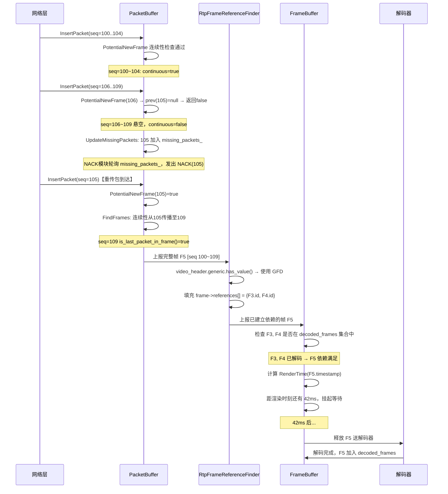
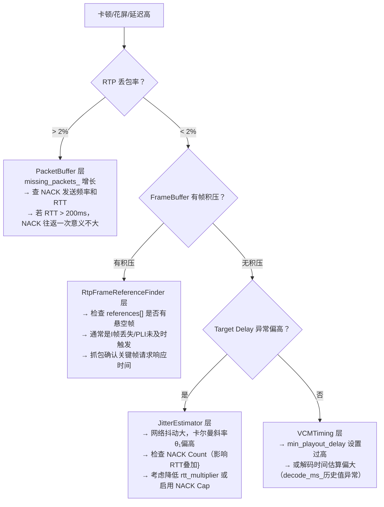

# 第七章：解剖 WebRTC 视频接收流水线——从 RTP 包到可解码帧的三级引擎

> 本文立足 WebRTC 主线源码（`modules/video_coding`），以实际工程代码为锚点，完整追踪一个视频 RTP 包从 UDP 套接字抵达，到最终被解码器消费的全链路。目标读者：已熟悉 RTP/RTCP 协议栈、正在调试卡顿/延迟问题的音视频基础设施工程师。

---

## 问题陈述：打破"JitterBuffer = 环形队列"的错觉

绝大多数关于视频 JitterBuffer 的基础描述，会给工程师留下一个错误的心智模型：

> 接收到 RTP 包 → 按序号排进一个环形缓冲区 → 等到帧的所有包到齐 → 送给解码器

这个模型在**三个关键维度**上是错的：
1. **组帧不是等"包到齐"**：判断一组包是否构成完整帧，依赖 `is_first_packet_in_frame` / `is_last_packet_in_frame` 标记位以及seq连续性检查，而非"等待某个包数"。
2. **帧组装完整 ≠ 帧可解码**：P 帧的依赖关系（references）必须由`RtpFrameReferenceFinder`单独建立，未满足依赖的完整帧仍不能放行。
3. **缓冲时间不是固定值**：目标延迟（Target Delay）由 `JitterEstimator` 通过卡尔曼滤波实时估算，随网络抖动动态调整，最小 `1ms`，上界 `10s`，不是你在配置文件里写一个常量。

真实的视频接收侧是一条**三级流水线**：


| 级别 | 模块 | 解决的核心问题 |
|:---:|---|---|
| ① | `PacketBuffer` | RTP 包乱序到达，判断"一帧的所有包都到齐且连续" |
| ② | `RtpFrameReferenceFinder` | 已组帧的帧，确定其在 I/P/B 依赖图中的位置 |
| ③ | `FrameBuffer` | 依赖满足的帧，以正确的时间窗口出队送解码器 |

---

## 第一级：PacketBuffer — 以 seq 连续性为基础的组帧引擎

### 1.1 数据结构与核心设计决策

`PacketBuffer` 的实现文件为 `modules/video_coding/packet_buffer.cc`。

它是一个**动态扩容的环形数组**，初始容量 512，最大容量 2048（均为 2 的幂次），以 `seq_num % buffer_.size()` 作为哈希索引：

```cpp
// packet_buffer.cc — 构造函数
PacketBuffer::PacketBuffer(size_t start_buffer_size, size_t max_buffer_size)
    : max_size_(max_buffer_size),
      first_seq_num_(0),
      first_packet_received_(false),
      is_cleared_to_first_seq_num_(false),
      buffer_(start_buffer_size),  // std::vector<unique_ptr<Packet>>
      sps_pps_idr_is_h264_keyframe_(false) {
  // 容量必须是 2 的幂次，以支持位运算取模
  RTC_DCHECK((start_buffer_size & (start_buffer_size - 1)) == 0);
  RTC_DCHECK((max_buffer_size & (max_buffer_size - 1)) == 0);
}
```

> **设计决策**：使用 2 的幂次容量的动态扩容数组，而非固定大小环形队列。当缓冲区冲突（哈希碰撞）时，先尝试扩容至 2 倍；若已达 `max_size_` 且仍冲突，执行 `Clear()` 并向上层发出 `buffer_cleared = true` 信号，触发关键帧请求（PLI/FIR）。这是一种**以 PLI 换内存上界**的工程取舍。

### 1.2 核心算法：`FindFrames` 的连续性传播

`InsertPacket` 的核心动作是调用 `FindFrames(seq_num)` ——从新插入的包开始，向后扫描尝试找出所有完整的帧。

**连续性（`continuous`）**是贯穿整个算法的核心状态：

```cpp
// packet_buffer.cc — PotentialNewFrame（连续性判断）
bool PacketBuffer::PotentialNewFrame(uint16_t seq_num) const {
  size_t index = seq_num % buffer_.size();
  int prev_index = index > 0 ? index - 1 : buffer_.size() - 1;
  const auto& entry = buffer_[index];
  const auto& prev_entry = buffer_[prev_index];

  if (entry == nullptr) return false;
  if (entry->seq_num() != seq_num) return false;

  // 情况一：此包是帧的第一个包（is_first_packet_in_frame 为 true）
  // 则无需前驱包，自身即构成连续链的起点
  if (entry->is_first_packet_in_frame()) return true;

  if (prev_entry == nullptr) return false;

  // 情况二：前驱包的 seq_num 必须恰好等于 seq_num - 1（无洞）
  if (prev_entry->seq_num() != static_cast<uint16_t>(entry->seq_num() - 1))
    return false;

  // 情况三：前驱包必须具有相同的 RTP timestamp（同属一帧）
  if (prev_entry->timestamp != entry->timestamp) return false;

  // 情况四：前驱包自身必须已标记为 continuous（连续性传播）
  if (prev_entry->continuous) return true;

  return false;
}
```

`FindFrames` 从新插入的包 `seq_num` 开始向后迭代，对每个 `seq_num` 调用 `PotentialNewFrame`：
- 若满足连续性：将该包打上 `continuous = true` 标记
- 若当前包是帧的最后一个包（`is_last_packet_in_frame()`）：从此包向前回溯，收集该帧所有包，打包成完整帧上报

```cpp
// packet_buffer.cc — FindFrames（简化展示核心逻辑）
std::vector<std::unique_ptr<Packet>> PacketBuffer::FindFrames(uint16_t seq_num) {
  std::vector<std::unique_ptr<Packet>> found_frames;

  for (size_t i = 0; i < buffer_.size(); ++i) {
    if (!PotentialNewFrame(seq_num)) break;

    buffer_[seq_num % buffer_.size()]->continuous = true;

    // 找到帧尾（marker bit 置位的包）
    if (buffer_[seq_num % buffer_.size()]->is_last_packet_in_frame()) {
      // 向前回溯收集帧头，将 [start_seq_num, seq_num] 所有包取出上报
      // ... 同时处理 H.264 IDR/SPS/PPS 关键帧识别逻辑
      uint16_t start_seq_num = FindFrameStart(seq_num);
      CollectAndEmitFrame(start_seq_num, seq_num, found_frames);
    }
    ++seq_num;
  }
  return found_frames;
}
```

### 1.3 丢包追踪与 NACK 触发

`PacketBuffer` 内维护一个 `std::set<uint16_t> missing_packets_`，每次 `InsertPacket` 都会调用 `UpdateMissingPackets`：

```cpp
void PacketBuffer::UpdateMissingPackets(uint16_t seq_num) {
  // 如果收到的包比当前最新的包更新，则把中间的空洞全部加入 missing_packets_
  if (AheadOf(seq_num, *newest_inserted_seq_num_)) {
    // 防止 seq 号跳变过大（> 1000）时暴力填充集合，有保护上界
    uint16_t old_seq_num = seq_num - kMaxPaddingAge; // kMaxPaddingAge = 1000
    // 清除太旧的缺失记录
    missing_packets_.erase(missing_packets_.begin(),
                           missing_packets_.lower_bound(old_seq_num));
    // 将 (newest+1, seq_num-1] 的空洞全部加入
    ++*newest_inserted_seq_num_;
    while (AheadOf(seq_num, *newest_inserted_seq_num_)) {
      missing_packets_.insert(*newest_inserted_seq_num_);
      ++*newest_inserted_seq_num_;
    }
  } else {
    // 收到了之前空洞里的包，从 missing 集合中移除
    missing_packets_.erase(seq_num);
  }
}
```

`missing_packets_` 集合是上层 NACK 模块（`NackRequester`）发送重传请求的数据来源。`PacketBuffer` 自身不直接发送 NACK，它只是维护这张"缺失名单"，由 `RtpStreamReceiverController` 定期检查并触发 NACK 发送。

> **一个实际 Bug 场景**：如果你观察到 `missing_packets_` 持续增长且不回收，通常意味着两件事之一：丢包率持续走高超过 NACK 重传能力，或者 `oldest_seq_num` 的回收逻辑未被正常触发（发送端的 `ClearTo` 没有被消费）。

---

## 第二级：RtpFrameReferenceFinder — 帧依赖关系的动态推断

### 2.1 架构：策略模式下的多编解码器适配

`RtpFrameReferenceFinder`（`modules/video_coding/rtp_frame_reference_finder.cc`）并不直接处理帧依赖解析，而是作为一个**策略调度器**，根据帧携带的 RTP 扩展头信息，选择对应的具体解析器：

```cpp
// rtp_frame_reference_finder.cc — 内部实现的策略分发
using RefFinder = std::variant<
    std::monostate,              // 初始未选择状态
    RtpGenericFrameRefFinder,    // Generic Frame Descriptor (新标准，M112+推荐)
    RtpFrameIdOnlyRefFinder,     // 仅有 PictureId，无 temporal 层信息
    RtpSeqNumOnlyRefFinder,      // 无任何帧 ID，降级到 seq_num 推断
    RtpVp8RefFinder,             // VP8 的 TL0PicIdx / PictureId 依赖
    RtpVp9RefFinder>;            // VP9 的 PDiff / SpatialLayer 依赖
```

分发逻辑优先级：**`generic.has_value()` → VP8 → VP9 → Generic(Legacy) → SeqNumOnly**

```cpp
// ManageFrame 分发逻辑（精简）
RtpFrameReferenceFinder::ReturnVector ManageFrame(
    std::unique_ptr<RtpFrameObject> frame) {

  if (video_header.generic.has_value()) {
    // 最高优先级：使用 Generic Frame Descriptor 扩展头
    // 依赖关系已由发送端在扩展头中完整声明
    return GetRefFinderAs<RtpGenericFrameRefFinder>().ManageFrame(
        std::move(frame), *video_header.generic);
  }

  switch (frame->codec_type()) {
    case kVideoCodecVP8: {
      // 检查是否有 TemporalId 和 TL0PicIdx（时域分层关键元数据）
      if (vp8_header.temporalIdx == kNoTemporalIdx ||
          vp8_header.tl0PicIdx == kNoTl0PicIdx) {
        // 降级：无时域分层信息，只能用 PictureId 或纯 seq_num 推断
        if (vp8_header.pictureId == kNoPictureId)
          return GetRefFinderAs<RtpSeqNumOnlyRefFinder>().ManageFrame(...);
        return GetRefFinderAs<RtpFrameIdOnlyRefFinder>().ManageFrame(...);
      }
      return GetRefFinderAs<RtpVp8RefFinder>().ManageFrame(std::move(frame));
    }
    // ... VP9 类似处理
  }
}
```

### 2.2 Generic Frame Descriptor：依赖关系的显式声明

WebRTC M112+ 之后，新的发送端会为每帧附加 **Generic Frame Descriptor（GFD）** RTP 扩展头，将依赖关系**显式编码**在帧的第一个 RTP 包中。

`RtpGenericFrameRefFinder` 负责解析这些信息，核心是 `video_header.generic` 中的数据结构：

```cpp
// api/video/video_frame_metadata.h
struct GenericFrameInfo {
  int64_t frame_id;          // 全局帧 ID（单调递增）
  int temporal_index;        // 时域层 (0 = base layer, 1 = enhance layer...)
  int spatial_index;         // 空域层 (SVC 场景)
  // 关键字段：该帧直接依赖的帧 ID 列表
  // 接收端无需任何推断，直接使用此列表构建依赖图
  std::vector<int64_t> dependencies;
  // 帧类型：关键帧 (kVideoFrameKey) 或差分帧 (kVideoFrameDelta)
  VideoFrameType frame_type;
};
```

`RtpGenericFrameRefFinder::ManageFrame` 将 `dependencies` 字段直接映射到 `RtpFrameObject::references[]` 数组，逻辑异常简洁：

```cpp
// rtp_generic_ref_finder.cc
RtpFrameReferenceFinder::ReturnVector RtpGenericFrameRefFinder::ManageFrame(
    std::unique_ptr<RtpFrameObject> frame,
    const RtpGenericFrameDescriptor& descriptor) {

  frame->SetId(descriptor.FrameId());

  // 依赖关系由发送端在 descriptor 里完整声明，接收端直接填入
  if (descriptor.FrameDependenciesDiffs().empty()) {
    // 关键帧：无依赖，可独立解码
    frame->num_references = 0;
  } else {
    frame->num_references = descriptor.FrameDependenciesDiffs().size();
    for (size_t i = 0; i < frame->num_references; ++i) {
      // FrameDependenciesDiffs()[i] 是相对于当前帧 ID 的"回溯差值"
      frame->references[i] = frame->Id() - descriptor.FrameDependenciesDiffs()[i];
    }
  }

  return {std::move(frame)};
}
```

### 2.3 VP8 的历史包袱：TL0PicIdx 推断

当发送端是旧版 VP8 编码器时，没有 GFD 扩展头，`RtpVp8RefFinder` 需要从 `tl0PicIdx`（TL0 帧的图像索引，每发一个 TL0 帧 +1）和 `temporalIdx` (时域层号) 这两个字段**在接收端重新推断依赖关系**：

```
时域分层示例 (3层):
  TL=0:  [F0]          [F4]          [F8]        ← 基础层，所有帧依赖它
  TL=1:     [F1]  [F3]     [F5]  [F7]            ← 依赖最近的TL0帧
  TL=2:        [F2]  [F2']    [F6]  [F6']        ← 依赖最近的TL0或TL1帧
```

`RtpVp8RefFinder` 内部维护一个 `last_picture_id_with_tl0_idx_` 映射表，记录每个 `tl0PicIdx` 对应的最新 `PictureId`，用于在收到 TL1/TL2 帧时反推其应该引用的是哪个 TL0 帧。这套逻辑不在本文展开，但当你调试 VP8 时域分层（Simulcast + 时域过滤）出现画面冻结时，这里是首要排查点。

---

## 第三级：FrameBuffer — 时序调度与动态目标延迟

### 3.1 FrameBuffer 的职责边界

经过前两级处理，帧已拥有完整的依赖图（`references[]` 已填充）。`FrameBuffer` 接管之后的问题是：

1. **依赖就绪检查**：某帧依赖的所有前驱帧是否已被解码？
2. **时序决策**：就绪的帧，现在是立刻送出，还是再等一等？

第二个问题的答案，就是**动态目标延迟（Target Delay）**。

### 3.2 JitterEstimator：抖动量的卡尔曼滤波建模

`JitterEstimator`（`modules/video_coding/timing/jitter_estimator.cc`）是 Target Delay 计算的核心。它并非简单地用滑动窗口平均帧间延迟，而是建立了一个**线性模型**：

$$\text{frame\_delay} = \theta_0 + \theta_1 \times \Delta\text{frame\_size} + \text{noise}$$

其含义是：单帧传输延迟的变化，由两部分导致——固定抖动（$\theta_0$，与帧大小无关，主要来自路由排队）以及与帧大小变化量（$\Delta\text{frame\_size}$）正相关的带宽相关延迟（$\theta_1$，单位: ms/byte）。

参数 $ \theta_0, \theta_1 $ 由 `FrameDelayVariationKalmanFilter`（卡尔曼滤波器）实时估计。

```cpp
// jitter_estimator.cc — UpdateEstimate 核心片段
void JitterEstimator::UpdateEstimate(TimeDelta frame_delay, DataSize frame_size) {
  // delta_frame_bytes = 当前帧大小 - 上一帧大小
  double delta_frame_bytes =
      frame_size.bytes() - prev_frame_size_.value_or(DataSize::Zero()).bytes();

  // ① 异常值过滤：极端延迟偏差先裁剪（±3.5σ 范围内才更新卡尔曼）
  double max_time_deviation_ms = kNumStdDevDelayClamp * sqrt(var_noise_ms2_);
  frame_delay = std::clamp(frame_delay,
      TimeDelta::Millis(-max_time_deviation_ms),
      TimeDelta::Millis(max_time_deviation_ms));

  // ② 计算当前帧相对于模型预测值的残差（delay_deviation）
  double delay_deviation_ms =
      frame_delay.ms() -
      kalman_filter_.GetFrameDelayVariationEstimateTotal(delta_frame_bytes);

  // ③ 离群点拒绝：delay > 15σ 且 frame_size 不是异常大帧 → 拒绝更新卡尔曼
  bool abs_delay_is_not_outlier =
      fabs(delay_deviation_ms) < kNumStdDevDelayOutlier * sqrt(var_noise_ms2_);
  bool size_is_positive_outlier =
      frame_size.bytes() > avg_frame_size_bytes_ +
          kNumStdDevSizeOutlier * sqrt(var_frame_size_bytes2_);

  if (abs_delay_is_not_outlier || size_is_positive_outlier) {
    // ④ 拒绝"拥塞后遗症"样本：大关键帧之后的小帧往往提前到达，
    //    delta_frame_bytes << 0，这会错误地拉低模型斜率
    bool is_not_congested =
        delta_frame_bytes > kCongestionRejectionFactor * max_frame_size_bytes_;

    if (is_not_congested) {
      // ⑤ 正常样本：更新卡尔曼滤波器（θ₀, θ₁）
      kalman_filter_.PredictAndUpdate(frame_delay.ms(), delta_frame_bytes,
                                      max_frame_size_bytes_, var_noise_ms2_);
    }
    // ⑥ 更新噪声方差估计（用于动态阈值计算）
    EstimateRandomJitter(delay_deviation_ms);
  }
}
```

**关键常量（来自源码）**：

| 常量 | 值 | 语义 |
|---|---|---|
| `kNumStdDevDelayClamp` | 3.5 | 输入帧延迟的裁剪阈值（σ 倍数） |
| `kNumStdDevDelayOutlier` | 15.0 | 离群点拒绝阈值（σ 倍数） |
| `kNumStdDevSizeOutlier` | 3.0 | 帧大小离群点阈值（σ 倍数）|
| `kCongestionRejectionFactor` | -0.25 | 拥塞后遗症样本过滤因子 |
| `kMinJitterEstimate` | 1ms | 抖动估算下界 |
| `kMaxJitterEstimate` | 10s | 抖动估算上界 |
| `OPERATING_SYSTEM_JITTER` | 10ms | 系统调度抖动补偿（固定偏置量） |
| `kFrameProcessingStartupCount` | 30 | 冷启动帧数（30帧后才开始后处理） |

### 3.3 GetJitterEstimate：最终对外暴露的目标延迟

```cpp
// jitter_estimator.cc — GetJitterEstimate（最终输出）
TimeDelta JitterEstimator::GetJitterEstimate(
    double rtt_multiplier,
    std::optional<TimeDelta> rtt_mult_add_cap) {

  // 基础抖动估算 + 10ms 操作系统调度抖动补偿
  TimeDelta jitter = CalculateEstimate() + OPERATING_SYSTEM_JITTER;

  // NACK 激活逻辑：如果近期 NACK 次数 ≥ 3，
  // 则在基础抖动之上额外叠加 rtt_multiplier * RTT 作为缓冲余量
  // 这是因为重传包需要一个完整的 RTT 才能回来
  if (nack_count_ >= config_.nack_limit.value_or(kNackLimit)) {
    if (rtt_mult_add_cap.has_value()) {
      jitter += std::min(rtt_filter_.Rtt() * rtt_multiplier,
                         rtt_mult_add_cap.value());
    } else {
      jitter += rtt_filter_.Rtt() * rtt_multiplier;  // 典型值：0.5 * RTT
    }
  }

  // 低帧率保护：< 5fps 的流，抖动估无意义，返回 0
  // 5~10fps 线性插值过渡
  if (fps < kJitterScaleLowThreshold) { // kJitterScaleLowThreshold = 5Hz
    return fps.IsZero() ? std::max(TimeDelta::Zero(), jitter) : TimeDelta::Zero();
  }

  return std::max(TimeDelta::Zero(), jitter);
}
```

**NACK 激活 RTT 叠加**是一个非常重要的工程细节：当网络丢包率升高，导致 NACK 频繁触发时，系统自动将目标延迟扩大至 `基础抖动 + 0.5 * RTT`，为重传包预留时间窗口——否则重传包到达 FrameBuffer 时，帧已经因超时被丢弃，重传等于白费。

### 3.4 VCMTiming：渲染时间的计算基准与帧过期判断

`JitterEstimator` 输出的是抖动量 $J$（毫秒），最终的"帧什么时候该渲染"由 `VCMTiming`（`modules/video_coding/timing/timing.cc`）决定。

**一个关键的认知纠正**：Target Delay 的时间轴起点**不是 RTP 包的到达时刻**，而是帧的 RTP 时间戳所对应的"发送端发帧时刻"（通过 RTCP SR 映射到接收端挂钟）：

```cpp
// timing.cc — RenderTimeInternal（真实源码）
Timestamp VCMTiming::RenderTimeInternal(uint32_t frame_timestamp,
                                        Timestamp now) const {
  // ① TimestampExtrapolator：通过 RTCP SR 建立 RTP timestamp → 挂钟时间映射
  //    ExtrapolateLocalTime 返回"发送端发出这帧"的本地估算时刻
  std::optional<Timestamp> local_time =
      ts_extrapolator_->ExtrapolateLocalTime(frame_timestamp);

  if (!local_time.has_value()) {
    return now;  // 映射未建立时 fallback 到"现在"（尽快送出）
  }

  // ② estimated_complete_time ≈ 发送端发出此帧的时刻（接收端挂钟估算值）
  Timestamp estimated_complete_time = *local_time;

  // ③ RenderTime = estimated_complete_time + current_delay
  //    current_delay 收敛于 TargetDelay，被 clamp 在 [min_playout, max_playout]
  TimeDelta actual_delay =
      std::clamp(timings_.current_delay,
                 timings_.min_playout_delay,
                 timings_.max_playout_delay);
  return estimated_complete_time + actual_delay;
}
```

时间窗口的语义：

```
时间轴：
  [发送端发帧估算时刻]──────[期望渲染时刻]
         │                       │
         │←── Target Delay(≈80ms)─→│
         │
  [RTP包实际到达]（可能晚于发帧 20~60ms）
         │
  [FrameBuffer 中等待...]
         │
  送解码时刻 = RenderTime - decode_time - render_delay
```

哪怕某帧因 NACK 重传迟到了 40ms，只要 RenderTime 尚未到达，它仍可被正常使用，不会被标记过期。

**帧过期判断：`MaxWaitingTime`**

FrameBuffer 每次调度时通过 `MaxWaitingTime` 决定等待还是出队：

```cpp
// timing.cc — MaxWaitingTime（真实源码）
TimeDelta VCMTiming::MaxWaitingTime(Timestamp render_time,
                                    Timestamp now,
                                    bool too_many_frames_queued) const {
  // 正常路径（非 ZeroPlayoutDelay 低延迟模式）：
  return render_time - now - EstimatedMaxDecodeTime() - timings_.render_delay;
}
```

```cpp
// FrameBuffer 调度逻辑（伪代码）
TimeDelta wait = timing_->MaxWaitingTime(
    timing_->RenderTime(frame->rtp_timestamp, now),
    now,
    too_many_frames_queued);

if (wait <= TimeDelta::Zero()) {
  SendToDecoder(frame);   // 已到时间（或逾期）→ 立刻送出
} else {
  ScheduleWakeup(wait);   // 还有余量 → 挂起，等 wait ms 后重新检查
}
```

| `MaxWaitingTime` 返回值 | 含义 |
|---|---|
| `> 0` | 距渲染时刻尚有余量，帧继续等待 |
| `= 0` | 刚好到达，立刻出队 |
| `< 0`（负值）| **已超时**，渲染时刻已过，强制送出（非丢弃） |

> `MaxWaitingTime < 0` 不等于丢帧，而是"逾期仍送出"。真正的丢弃发生在渲染层：若帧被依赖阻塞导致解码后渲染时刻已严重过去，渲染器会跳过不显示，但解码器仍会消费它（更新解码依赖状态）。

### 3.5 终极执行器：音画同步如何篡改 Render Time

在理解了 Render Time 的基准后，这就引出了 WebRTC 音画同步（AV Sync）设计的绝妙之处：**音画同步并不是一个独立去卡着帧不让走的物理关卡，它是寄生在 Target Delay 计算公式里的修改器**。

在源码的设计哲学里：**音频是老大（Master），视频是小弟（Slave）**。

1. **同步大脑计算偏差**：独立的 `StreamSynchronization` 模块会依赖 RTCP SR，不断将音频的实际播放 NTP 进度，和视频预测的 NTP 进度作对比。
2. **偷偷下达指令**：如果算出视频比音频快了 50ms（画面超前，必须等声音）。同步大脑**绝对不会**去截胡拦截视频的 FrameBuffer，它的唯一动作是去调用视频接收流的接口，强行把视频的 `min_playout_delay_` （最小播放延迟）**加大 50ms**。
3. **推子连锁反应**：结合上一节的公式：
   - `min_playout_delay_` 变大 → `TargetDelay` 变大 50ms。
   - `TargetDelay` 变大 → 推算出来的帧理论 `RenderTime` 被往后推迟了 50ms。
4. **无情的执行手脚**：FrameBuffer 在算 `MaxWaitingTime` 时，发现距渲染时刻多了 50ms，就会乖乖地把帧挂起多睡 50ms。画面自然就停在这里，耐心等声音追上来。

**Render Time 是各种延迟策略的最终混音台（Mixer）**。FrameBuffer 根本不知道自己等待是为了防网络抖动（Jitter）还是为了音画同步，它就是一个无情的执行机器：“既然你们算出 RenderTime 是 50ms 后，那我就死捂在手里 50ms。”

---

## 延展：工程提取（Extraction）——打造纯净的服务端流水线

基于以上对三级流水线的深度解构，如果你要在服务端提取 WebRTC 核心逻辑（例如做 MCU 混流器、录播服务器、AI 旁路分析），你**完全不需要端到端的播放延迟平滑和音画同步**。

剥离组装极简架构的秘诀就是：**阉割时序调度引擎，只保留依赖推断引擎**。

**实现路径：Zero Playout Delay (ZPD) 模式的极致退化**

与其移植整个巨大的 `VCMTiming` 和卡尔曼滤波，在纯后端的工程剥离中，直接让时序判断函数（如 `MaxWaitingTime`）永远返回 `<= 0` 的负数。

此时，第三级引擎 `FrameBuffer` 会发生**质变**：它退化成了一个**纯粹的 DAG（有向无环图）状态机**。
- 它收到一帧（第一/二级引擎帮它组装好了包，并填好了 `references[]` 依赖关系）。
- 它去查表，探测 `decoded_frames` 集合里是否已经包含了它的所有前驱节点（依赖就绪）。
- 一旦依赖就绪，因为 `MaxWait` 是负数，它会**立刻把这个帧弹射出队送去解码，一毫秒不多等**。

通过这种方式，你可以放心地**砍掉** `JitterEstimator`（无需防抖）、**砍掉** RTCP SR 处理（除非你要做 NTP 画布混流）、**砍掉**整个 `StreamSynchronization` 模块。只要维持前两级流水线的边界判断和依赖补全，你就得到了一台极其高效、高吞吐的**“可解码视频帧吐出机”**。

---

## 第一级补充：残帧清理机制——永远差一个包的帧如何消失

上文描述了 NACK 正常追回丢包的路径。现在考虑极端情况：某帧的某个 RTP 包**永久丢失**，NACK 无论重传多少次都追不回来，那这个帧的包（以及占用的 `buffer_[]` 槽位）什么时候被清理？

**结论先给**：PacketBuffer **没有单帧级的定时器超时**，残帧清理通过四重链式机制间接触发，最终归结为 `ClearTo()` 这一刀。

### 第一重：NACK 最大重传 100 次后放弃追踪

```cpp
// nack_requester.cc — 真实常量（注意不是 10 次）
constexpr int kMaxNackRetries = 100;   // 最多重传 100 次，每次间隔约 1 RTT
constexpr int kMaxNackPackets = 1000;  // nack_list_ 最多容纳 1000 条记录
constexpr int kMaxPacketAge = 10'000;  // seq 号差超 10000 时直接驱逐出列表

// GetNackBatch — 超过重传上限时移出 nack_list_
if (it->second.retries >= kMaxNackRetries) {
  RTC_LOG(LS_WARNING) << "Sequence number " << it->second.seq_num
                      << " removed from NACK list due to max retries.";
  it = nack_list_.erase(it);  // 停止重传追踪，但 PacketBuffer 里的残帧包仍在内存
}
```

RTT = 100ms 时，一个包最长被追踪 **≈ 10 秒**后放弃。之后从 `nack_list_` 移除，但 PacketBuffer 的 `buffer_[]` 槽位和 `missing_packets_` 条目依然存在，占用内存。

### 第二重：NACK 列表满 1000 条，直接请求关键帧

```cpp
// nack_requester.cc — AddPacketsToNack
if (nack_list_.size() + num_new_nacks > kMaxNackPackets) {
  nack_list_.clear();
  RTC_LOG(LS_WARNING) << "NACK list full, clearing NACK"
                         " list and requesting keyframe.";
  keyframe_request_sender_->RequestKeyFrame();  // ← 直接触发 PLI/FIR
  return;
}
```

当持续丢包导致 `nack_list_` 积累超过 **1000 条**未恢复记录，NACK 模块清空列表并立即发出关键帧请求。这是防止在极差网络下 NACK 模块资源失控的快速失效机制。

### 第三重：PacketBuffer 写满，核弹式全清

后续正常包持续写入，当 `buffer_[]` 的哈希槽被残帧包长期占用，且写入新包发生槽位冲突、扩容至 2048 上限仍无法解决时：

```cpp
// packet_buffer.cc — InsertPacket（缓冲区彻底满时）
if (buffer_[index] != nullptr) {
  // ExpandBufferSize 失败（已达 max_size_ = 2048），槽位仍被占用
  RTC_LOG(LS_WARNING) << "Clear PacketBuffer and request key frame.";
  ClearInternal();              // 清空所有包，包括所有残帧
  result.buffer_cleared = true; // 通知上层请求关键帧
  return result;
}
```

> **实际排查意义**：在 WebRTC 日志中看到连续出现 `"Clear PacketBuffer and request key frame"` 这条 WARNING，是判断**"丢包率已经超过 NACK 恢复能力上限"**的直接信号，此时应优先排查网络侧（丢包率、RTT），而非调整 WebRTC 缓冲参数。

### 第四重（根本机制）：PLI → 关键帧到达 → `ClearTo()` 清空一切

所有路径（第二、三重）最终都通过 PLI → 新关键帧 → 调用 `ClearTo()`：

```cpp
// packet_buffer.cc — ClearTo（新关键帧第一个包到达时由上层调用）
void PacketBuffer::ClearTo(uint16_t seq_num) {
  size_t diff = ForwardDiff<uint16_t>(first_seq_num_, seq_num);
  size_t iterations = std::min(diff, buffer_.size());
  for (size_t i = 0; i < iterations; ++i) {
    auto& stored = buffer_[first_seq_num_ % buffer_.size()];
    if (stored != nullptr && AheadOf<uint16_t>(seq_num, stored->seq_num())) {
      stored = nullptr;  // ← 包括残帧的所有包，全部释放
    }
    ++first_seq_num_;
  }
  first_seq_num_ = seq_num;
  // 同步清理 missing_packets_（不再追踪已清除范围内的缺失记录）
  missing_packets_.erase(missing_packets_.begin(),
                         missing_packets_.lower_bound(seq_num));
}
```

**完整的残帧生命周期**（RTT=100ms，30fps 场景）：

```
T+0ms      seq=105 永久丢失，其余 100~104, 106~109 在 PacketBuffer 占据 9 个槽位
T+50ms     NACK #1 发出（等 0.5 RTT 后首发）
T+100ms    重传未到，NACK #2
   ↓
T+10s      NACK 已重传 100 次 → 从 nack_list_ 移除，停止追踪
           PacketBuffer 里 9 个包的槽位仍占用内存
   ↓
T+10s~     [方案A] 后续帧持续写入，buffer_ 槽位冲突且无法扩容
             → ClearInternal() + buffer_cleared=true → PLI
           [方案B] FrameBuffer 内无可解码帧达 ~3s → 主动发 PLI
   ↓
PLI 触发   → 发送端发送新关键帧（SPS/IDR）
   ↓
新关键帧首包到达 → 上层调用 ClearTo(keyframe_first_seq)
             → buffer_[i] = nullptr（残帧 9 个包槽位释放）
             → missing_packets_ 清理 seq=105 条目
                                              ↑
                                    残帧在此刻真正消失
```

---

## 流水线联动：一个丢包场景的完整链路追踪

以下场景完整展示了三级流水线的协同：

**场景设定**：VP9 时域分层流，seq=100~109 共 10 个包，属于帧 F5（P 帧），依赖 F3（已解码）和 F4（已解码）。其中 seq=105 在网络中丢失。



---

## 音频侧对照：NetEQ 的动态目标延迟

视频侧通过卡尔曼滤波估算帧延迟，音频侧的 NetEQ 采用不同但同样精密的方案。

NetEQ 的 **目标缓冲水位（Target Level）** 以"包的数量"（而非毫秒）为单位，其计算基于**包到达速率的统计分布**：

$$\text{TargetLevel} = \text{IAT\_histogram的高百分位数} + \text{峰值检测偏置}$$

其中 `IAT`（Inter-Arrival Time）为包间隔时间的直方图估计。当存在周期性网络抖动（如 Wi-Fi 信标导致的规律包堆积）时，NetEQ 的峰值检测逻辑会额外拉高 Target Level，为突发抖动预留缓冲空间。

**两侧的根本差异**：

| 维度 | 视频：JitterEstimator | 音频：NetEQ |
|---|---|---|
| 建模单位 | 帧延迟（ms）的线性模型 | 包到达间隔（IAT）的直方图 |
| 核心算法 | 卡尔曼滤波 | 直方图百分位数估计 |
| 丢帧应对 | 超时丢帧，向发送端请求 PLI | WSOLA 拉伸/压缩，无感补偿 |
| 核心约束 | 不能造假（解码依赖完整性） | 可以造假（WSOLA 合成音频） |

---

## 排查路由：基于三级流水线的卡顿定位

当你需要调试 WebRTC 视频卡顿问题时，以下排查路由基于上述三级流水线：



---

## 关键结论

WebRTC 视频接收侧的核心工程哲学是：**以多级解耦、各司其职的方式，在不确定的网络环境中构建确定性的媒体消费**。

- **PacketBuffer** 用连续性传播算法，将乱序的 UDP 包还原为有完整边界的编码帧，代价是内存（最大 2048 包）和可能触发的 PLI。
- **RtpFrameReferenceFinder** 通过 GFD 扩展头（新版）或编解码器特定推断（旧版），为每帧建立可查询的依赖图，这套机制是 SVC/Simulcast 时域过滤能工作的底层保障。
- **JitterEstimator** 用卡尔曼滤波建立帧延迟的线性模型，持续估算网络的"结构性抖动"，而非简单地用移动平均，从而对 I 帧后的拥堵后遗症、异常大帧等干扰样本具备过滤能力。
- **Target Delay** 不是一个配置参数，而是一条实时运行的控制环路，NACK 触发会直接拉高它，低帧率会使其缩为零——任何将其视为静态常量的调试思路都是错的。

---

*作者：[AI-Authored Tech Chronicles]*
*系列：《RTC 拥塞控制群侠传》第七篇*
*写于 2026-04-22*
