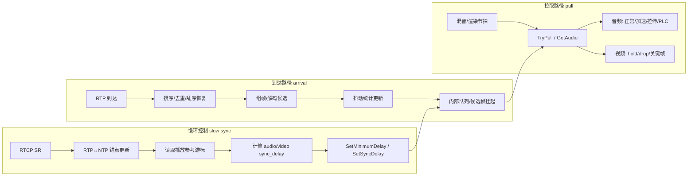

# 第八章：从 WebRTC 到自研工程——RTP 到达后的自适应缓冲与音视频同步

> **目标读者**：已理解 RTP/RTCP 与基本播放概念、正在实现 SFU/录制/播放侧缓冲的 C++ 工程师。  
> **前置假设**：读者知道 RTP 时间戳、RTCP SR 的 NTP↔RTP 锚点作用，以及 Jitter 的直观含义。  
> **与前几章关系**：第五、六章讲“是什么”，第七章讲视频接收**组帧/依赖/FrameBuffer** 数据面；本章讲**收包之后**如何用**控制面 + 数据面**把网络抖动与声画同步同时解决，并给出可落地的工程折中。

---

## 1. Why：为什么“固定等 500ms”与“两路各管各的”会同时失败

工程里常见两类方案，各自只解决一半问题。

**固定等待（例如死等 500ms）**  
- 网络好时：纯浪费延迟，录制/连麦体验变差。  
- 网络差时：仍可能花屏、断音，因为突发抖动分布的尾部远非一个常数能覆盖。  

**两路媒体各做 JitterBuffer、但不做统一时间基与统一目标**  
- 音频与视频的“播放游标”不在同一根时间轴上比较，同步策略只能拍脑袋加延迟或丢包。  
- 更隐蔽的问题：若 **RTP→NTP 只在第一次 RTCP SR 建锚**，长时间运行下发送端时钟漂移、SR 四舍五入与重传等会引入**慢漂移**，声画会越差越远。  

因此，**“自适应”**不是把 500 改成 300，而是引入一组明确的反馈量：**抖动导致的排队延迟目标**、**跨媒体对齐所需的额外延迟**、以及在消费者节拍上执行的**追赶 / 等待 / 填补**策略。

---

## 2. WebRTC 在做什么：先把名词对齐

WebRTC 音频 NetEq 一侧与视频接收流水线一侧都围绕同一个概念：**目标排队延迟 `target_delay`**（实现里常以 packet 数或毫秒等价表示）。先牢牢记住一条工程级公式心智（与“相加”完全不同）：

$$
\text{target\_delay} = \max(\text{base\_from\_jitter},\ \text{minimum\_delay},\ \text{preferred\_delay}) \quad [\text{再与 maximum\_delay 做 clamp}]
$$

**为什么必须是 max？**  
- **抖动缓冲需求**：要把绝大多数包的随机迟到吸收在队内，表现为一定的基准排队深度 `base_from_jitter`。  
- **音视频同步需求**：若某一侧必须“再多等一会儿”才能与另一侧对齐，这层诉求通过 **`minimum_delay`（以及上层注入的 sync 语义）**进来；它不是与抖动叠加的第二桶水倒进同一个桶，而是同一桶水位至少要涨到“更高的那一道刻度”。把两边相加会**系统性地过缓冲**，延迟虚高。  

在 WebRTC 的实践中，**同步侧想拉高的那部分额外排队时间，会作为 `minimum_delay`（或等价接口）送入 NetEq**，从而进入上面的 max 组合（可与 NetEq 的网络统计模块输出的基准延迟共同决策）。

音频 NetEq（典型调用：`modules/audio_coding/neteq`，文档可见仓库内 `docs/neteq.md`）的数据面特征：

| 维度 | 要点 |
|------|------|
| 驱动方式 | 音频设备/ADM **周期性拉取**（例如 10ms 一帧） |
| 能否“暂无输出” | **不行**。若无包，必须 PLC / 拉伸填补，否则就有间断噪声或爆音风险 |
| 追赶/等待 | **变速**：Accelerate（压缩波形片段）、Expand（拉伸）、以及融合类操作；PLC 与 codec 能力结合 |

视频侧（`modules/video_coding` 等路径）的数据面特征：

| 维度 | 要点 |
|------|------|
| 驱动方式 | 解码/渲染流水线拉取；可有“还不到时间”的等待 |
| 能否返回空 | **可以**（黑屏、重复上一帧由上层策略决定） |
| 追赶/等待 | **离散决策**：hold、丢非关键帧追赶、等关键帧恢复；不做连续时间伸缩 |

跨媒体的**控制面**（概念上对应 `stream_synchronization` / `RtpStreamsSynchronizer` 一类职责）：周期或事件触发，读取测量，向音频侧下发最小延迟、向视频侧调整渲染/释放时机等——**只改“目标”，不替代各 buffer 内部的逐帧判断**。

---

## 3. 设计框架：三条路径（WebRTC 思想的抽象）

把系统拆成三条解耦路径，职责就不会搅成一团浆糊。



**到达路径**只做：完整性、统计量、**绝不**在此刻决定“现在该不该播”。  
**慢环**只做：相对漂移、同步附加延迟、平滑与限速。  
**拉取路径**才结合：`target_delay`、当前缓冲深度、帧可解码性，决定本次输出。

这与“混流录制”场景下的边界一致：**混流引擎只负责按自己的节拍拉音频/视频**，复杂 RTP 策略应留在 worker 侧（参见你们设计文档中对 mixlib 的职责裁剪）。

---

## 4. 关键要点（检查清单）

### 4.1 时间基：谁在统一两根 RTP 时间轴

- 用 **RTCP SR** 提供的 `(ntp_timestamp, rtp_timestamp)` 建锚点；**每次 SR 刷新锚点**，长录制下可减少只靠首次 SR 的漂移风险。  
- 任意 RTP 时间戳先 **unwrap**（32 位回绕），再映射到同一 NTP 轴：  
  $$\text{ntp\_ms} \approx \text{sr\_ntp\_ms} + (\text{rtp\_unwrapped} - \text{sr\_rtp\_unwrapped}) \times 1000 / \text{clock\_rate}$$

### 4.2 缓冲深度：必须用媒体时钟，而不是“到达时刻差”

队列覆盖的**媒体时长**应近似为：

$$\text{depth\_ms} \approx \frac{\text{rtp\_newest} - \text{rtp\_oldest}}{\text{clock\_rate}} \times 1000$$

用“最新到达 wallclock − 最早到达 wallclock”当深度，会在网络延迟波动时**严重误判**（资料里把这点列为已踩坑项）。

### 4.3 抖动样本：到达间隔减去媒体间隔

对相邻合法包：

$$\text{jitter\_sample} = \max\left(0,\ \Delta t_{\text{arrival}} - \Delta t_{\text{media}}\right)$$

再对样本做滑动统计（均值、方差、分位数等），用于估计 `jitter_delay`。这与 RFC 3550 对抖动的精神一致，也与工程上“吸收迟到需要多大排队”的目标一致。

### 4.4 同步测量：比较的是“播放游标”，不是“最新收包”

控制面应读取：

- 音频：已经输出到播放链路上的 **RTP 时间游标**（含 PLC 推进）。  
- 视频：下一帧可输出的候选 **RTP 时间游标**（或等价的 playout 参考）。

否则同步延迟会被短期突发到达扰动，产生错误干预。

### 4.5 音频连续性优先、视频离散追赶

- **音频**：少做跳采样式“跳帧”，优先 **加速消耗**（压缩）或 **扩展**（拉伸）与 PLC；WebRTC 走向是通过 DSP 类操作维持连贯。  
- **视频**：允许 **丢非关键帧**、**等待关键帧**；这是与音频完全不同的纠错语法。

---

## 5. 算法谱系（从“可用”到“接近 WebRTC”）

| 层级 | 简化实现（录制/工程友好） | WebRTC 级实现 |
|------|-----------------------------|----------------|
| 抖动估计 | 滑动窗口 + 方差/分位数 + `base + k·√Var` | DelayManager 等与 NetEq 深度耦合的统计与滤波 |
| 目标延迟平滑 | 每次调整上限 ±5~10ms，避免跳变 | 与 packet 时钟对齐的更细致策略 |
| 音频追赶 | 重复最后一帧 PLC、轻量 resample 变速 | WSOLA、Accelerate/Expand、Merge 等 |
| 视频追赶 | 缓冲比 + hold/drop 决策 | 明确 render_time、参考 FrameBuffer 调度 |
| A/V 同步 | 慢环 500ms~1000ms + join 事件 bootstrap | RtpStreamsSynchronizer + 与 NetEq/VideoReceiveStream 协作 |

**“最好”不是一味照搬 WebRTC 的全部 DSP**，而是：**控制面公式与分层与 WebRTC 对齐**；数据面按你的延迟预算、CPU 预算与质量底线选型。

---

## 6. C++ 伪代码：端到端骨架

下列代码只表达**控制流与职责边界**，省略线程安全与细枝末节。

### 6.1 收包与抖动样本（到达路径）

```cpp
struct PacketSample {
  int64_t rtp_ts_unwrapped{};
  int64_t recv_wallclock_ms{};
};

class JitterDelayEstimator {
 public:
  void OnPacket(const PacketSample& cur, const PacketSample& prev) {
    if (!prev_valid_) { prev_ = cur; prev_valid_ = true; return; }
    const double arrival_delta_ms = cur.recv_wallclock_ms - prev.recv_wallclock_ms;
    const double media_delta_ms =
        (cur.rtp_ts_unwrapped - prev.rtp_ts_unwrapped) * 1000.0 / clock_rate_hz_;
    const double jitter_sample_ms = std::max(0.0, arrival_delta_ms - media_delta_ms);
    variance_tracker_.Push(jitter_sample_ms);  // 例如 Welford 或滑动窗口方差
    prev_ = cur;
  }

  int EstimatedDelayMs() const {
    const double v = variance_tracker_.Variance();
    const double sqrt_v = std::sqrt(std::max(0.0, v));
    int delay_ms = static_cast<int>(base_delay_ms_ + jitter_factor_ * sqrt_v);
    return std::clamp(delay_ms, min_delay_ms_, max_delay_ms_);
  }

 private:
  int clock_rate_hz_{90000};
  int base_delay_ms_{30};
  double jitter_factor_{3.0};
  int min_delay_ms_{20};
  int max_delay_ms_{400};
  PacketSample prev_{};
  bool prev_valid_{false};
  // VarianceTracker variance_tracker_;
};
```

### 6.2 目标延迟：抖动 vs 同步（核心公式）

```cpp
int TargetDelayMs(int jitter_delay_ms,
                  int minimum_delay_ms_from_user,
                  int sync_delay_ms,
                  int maximum_delay_ms) {
  // WebRTC 常见语义：sync 通过 minimum_delay 路径叠加进来
  const int minimum_delay_ms = std::max(minimum_delay_ms_from_user, sync_delay_ms);
  int target_ms = std::max(jitter_delay_ms, minimum_delay_ms);
  return std::min(target_ms, maximum_delay_ms);
}
```

### 6.3 慢环：从统一到 NTP 的偏差到双侧延迟（控制面）

```cpp
struct SyncReferenceState {
  bool active{false};
  bool has_reference{false};
  int64_t reference_rtp_ts_unwrapped{0};
  int64_t current_delay_ms{0};
};

struct StreamTimingContext {
  bool has_anchor{false};
  int64_t sr_ntp_ms{0};
  int64_t sr_rtp_unwrapped{0};
  int clock_rate_hz{48000};

  int64_t ToNtpMs(int64_t rtp_unwrapped) const {
    return sr_ntp_ms + (rtp_unwrapped - sr_rtp_unwrapped) * 1000 / clock_rate_hz;
  }
};

struct SyncAdjustment {
  int audio_sync_delay_ms{0};
  int video_sync_delay_ms{0};
};

class AvSyncControllerSlowLoop {
 public:
  void Tick(const SyncReferenceState& audio,
            const SyncReferenceState& video,
            const StreamTimingContext& audio_timing,
            const StreamTimingContext& video_timing) {
    if (!audio.active || !video.active || !audio.has_reference || !video.has_reference) {
      audio_sink_.SetSyncDelayMs(0);
      video_sink_.SetSyncDelayMs(0);
      return;
    }

    const int64_t audio_ntp = audio_timing.ToNtpMs(audio.reference_rtp_ts_unwrapped);
    const int64_t video_ntp = video_timing.ToNtpMs(video.reference_rtp_ts_unwrapped);
    const int64_t relative_delay_ms = video_ntp - audio_ntp;  // >0 表示视频偏“前”

    SyncAdjustment adj = ComputePolicy(relative_delay_ms);  // 阈值 + 限速 + 平滑
    audio_sink_.SetSyncDelayMs(adj.audio_sync_delay_ms);
    video_sink_.SetSyncDelayMs(adj.video_sync_delay_ms);
  }

 private:
  SyncAdjustment ComputePolicy(int64_t relative_delay_ms) {
    SyncAdjustment o;
    // 示例策略（需按产品容忍度调参）：
    // - 视频领先：增大 video_sync_delay（视频侧多等）
    // - 视频落后少量：让视频追赶（video_sync_delay -> 0，配合丢帧）
    // - 视频长期落后：逐步增加 audio_sync_delay（给视频恢复空间），避免无限丢帧
    (void)relative_delay_ms;
    return o;
  }

  struct {
    void SetSyncDelayMs(int) {}
  } audio_sink_, video_sink_;
};
```

### 6.4 音频拉取：以 target 为参考的闭环（数据面）

```cpp
class AdaptiveAudioJitterBufferPull {
 public:
  bool PullPcmFrame(/*out*/ PcmFrame& out) {
    const int jitter_delay_ms = estimator_.EstimatedDelayMs();
    const int target_ms =
        TargetDelayMs(jitter_delay_ms, minimum_delay_ms_, sync_delay_ms_, max_delay_ms_);
    const int current_ms = CurrentBufferDepthMs();  // 口径：RTP 覆盖的媒体时长优先

    const int error_ms = current_ms - target_ms;

    if (current_ms == 0 && HasPlcReference()) {
      out = RepeatLastPcm();  // PLC：极简可用方案
      AdvancePlayCursor();
      return true;
    }

    if (error_ms > drop_threshold_ms_) {
      return AccelerateConsume(out);  // 简化：合并更多采样到更短时间窗；WebRTC 用 WSOLA 等
    }
    if (error_ms < -hold_threshold_ms_) {
      return PreemptiveExpand(out);   // 简化：重复/插入过渡帧；WebRTC 用 Expand
    }

    return NormalPop(out);
  }

 private:
  JitterDelayEstimator estimator_;
  int minimum_delay_ms_{0};
  int sync_delay_ms_{0};
  int max_delay_ms_{400};
  int drop_threshold_ms_{20};
  int hold_threshold_ms_{20};
};
```

### 6.5 视频拉取：离散决策（数据面）

```cpp
class AdaptiveVideoJitterBufferPull {
 public:
  const VideoFrame* PullNextFrameOrHold() {
    const int jitter_delay_ms = estimator_.EstimatedDelayMs();
    const int target_ms =
        TargetDelayMs(jitter_delay_ms, minimum_delay_ms_, sync_delay_ms_, max_delay_ms_);
    const int current_ms = CurrentBufferDepthMs();

    const int error_ms = current_ms - target_ms;

    if (!HasDecodableFrame()) {
      return nullptr;  // 等关键帧/等组装，不是 PLC 伪造画面
    }

    if (error_ms < -hold_threshold_ms_) {
      return nullptr;  // hold：先不放行
    }

    if (error_ms > drop_threshold_ms_) {
      DropExpiredNonKeyFrames();
    }

    return PopNextDecodableFrame();
  }

 private:
  JitterDelayEstimator estimator_;
  int minimum_delay_ms_{0};
  int sync_delay_ms_{0};
  int max_delay_ms_{400};
  int drop_threshold_ms_{30};
  int hold_threshold_ms_{30};
};
```

---

## 7. Trade-offs：如何为你的工程“刻意简化”而不翻车

| 决策 | 何时值得做 | 代价与坑 |
|------|------------|----------|
| `target_delay = max(jitter, sync)` | **几乎总是** | 若误用相加，延迟不可控地膨胀 |
| 缓冲深度用 RTP 时长 | 任何严肃实现 | 用 wallclock 会误判“队列有多满” |
| 音频 PLC 用重复最后一帧 | CPU 紧、先求稳 | 音色机械；长时间丢包会露馅 |
| 音频追赶不上 WSOLA | 质量优先 | CPU 与复杂度显著上升 |
| 视频用缓冲状态机而非 render_time | 录制时间轴不强绑 wallclock | 与实时预览的时序模型不一致时要分流 |
| 慢环 1000ms + 事件 bootstrap | 大规模录制/混流 | 纯 1000ms 会让首帧对齐偏钝 |

**一句话**：WebRTC 的“最好”是**分层清晰 + 目标延迟合并语义正确 + 音/视频用各自语法纠错**；你的“最好”是在这三件事不打折扣的前提下，替换表格里每一行的具体算法档位。

---

## 8. 结论

1. **网络抖动**与**声画同步**共同决定播放侧排队目标；WebRTC 用 **`target_delay` 的 max 语义**把两类诉求折叠进同一套目标水位，而不是简单相加。  
2. **控制面**只同步慢变量并下发 `sync_delay` / `minimum_delay`；**数据面**在拉取节拍上完成音频变速与 PLC、视频 hold/drop/关键帧恢复。  
3. 工程落地时，优先保证：**RTP 深度口径正确、时间基可刷新、播放游标测量正确**；再按需替换音频 DSP 与视频调度强度。

更深入的**视频组帧与 FrameBuffer 调度**请继续读第七章；**声画生理容忍与 NTP 对齐基础**请回看第六章。

---

*作者：[AI-Authored Tech Chronicles]*  
*系列：《RTC 拥塞控制群侠传》第八篇*  
*分析基于：WebRTC（NetEq / StreamSynchronization 等公开设计与源码树）、项目内设计笔记 `docs/tmp/1.md`、`docs/tmp/2.md`、`docs/tmp/3.md`，资料整理于 2026-05-07*
