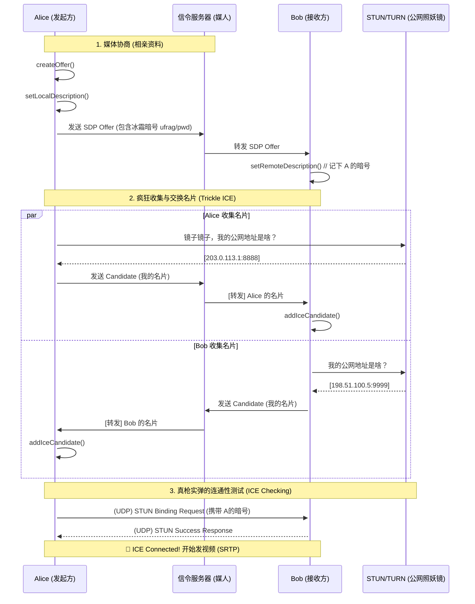

# 🛣️ 【硬核爆破】WebRTC ICE 完整建联协议大剖析：从信令交换到死磕测试

> **题记**
> 上一篇文章里，我们用“小区保安”的视角理解了内网穿透的物理困境。但在真实的开发排错中，当我们打开 Chrome 的 `webrtc-internals` 或者看底层日志时，满屏的 `a=candidate` 和天书一样的字符串往往让人两眼一黑。
> 
> 要想真正掌握排错灵感，我们必须扒开它的衣服，看透它在**信令层**和**网络层**到底干了什么。

在标准的面渣中，“ICE 收集 -> 交换 SDP -> 打洞” 往往被一笔带过。但今天，我们要把这套极致复杂的流程，映射成你能一眼看懂的**“双边相亲与核对暗号”**的物理直觉。

---

## 一、 宏观战场：一张图看懂 ICE 连通的真面目

ICE 的建联其实分为两个完全不同的位面：**信令层（传纸条）** 与 **媒体层（真刀真枪干）**。

请看下面这张时序图映射：



从这张图你可以看到一个**极其反直觉**的事实：
很多人认为 `SDP` 里就包含了地址。其实在现代 WebRTC (Trickle ICE) 里，SDP 往往只负责交换**“媒体能力（我能解H264）”**和**“暗号（ufrag/pwd）”**。而真正的地址名片（Candidate），是像滴水一样，找到一个就通过信令服传一个的。

---

## 二、 破解天书：Candidate 里的参数到底在说什么？

当你查阅抓包或者日志，你一定会看到类似这样一行天书般的信息：

`a=candidate:12345678 1 udp 2113929471 203.0.113.1 8888 typ srflx raddr 192.168.1.5 rport 5555`

不要慌！我们这就把它大卸八块，用物理直觉翻译出来：

| 参数碎片 | 真实面孔 | 物理学隐喻翻译 |
| :--- | :--- | :--- |
| `candidate:` | **前缀声明** | “喂！这是一张我的新名片！” |
| `12345678` | **Foundation (基础标识)** | **名片归属码**。同一个 IP+端口不管试几次，这个号是一样的。 |
| `1` | **Component ID (组件ID)** | **左耳还是右眼**。早期 RTP 管视频（1），RTCP 管控制（2）。现在开了 Multiplex，大家全用 `1`。 |
| `udp` | **协议组** | **交通工具**。走 UDP（汽车）还是 TCP（高铁）。 |
| `2113929471` | **Priority (优先级)** | **VIP 排序号码**。数字越大越优先（一般 `Host > Srflx > Relay`）。ICE 在排列组合打洞时，会先挑数字大的试。 |
| `203.0.113.1`<br/>`8888` | **外网 IP 与端口** | **快递最终投递地**。别人按这个地址发包，就能砸到你。 |
| `typ srflx` | **Type (名片类型)** | **名片的成色**。<br/>`host`：内网本机直连；<br/>`srflx`：STUN 反射的公网地址；<br/>`relay`：TURN 中转站代收地址。 |
| `raddr 192...`<br/>`rport 5555` | **反射真实内网地** | **发件人真实底细**。这个包其实是从你内网 192 这个主机上出来的。 |

### 🔑 最核心的防伪暗号：`ufrag` 与 `pwd`
在 SDP 交换时，除了交换上面的地址，你们还会交换 `ice-ufrag` 和 `ice-pwd`。
**物理比喻**：网络是不安全的，我怎么知道向我发 UDP 洞洞包的人真的是你，而不是黑客伪造的攻击流？
**解法**：你在给我发 STUN Ping（连通性测试）时，不仅要往我这里砸，还得在包头里贴上我的 `ufrag`，并用我的 `pwd` 对包做哈希签名！我对过了暗号没错，才相信这真的是你在尝试连我。

---

## 三、 骨架映射：WebRTC 极简 C++ / JS 伪代码

我们来看真实的 API 调用逻辑，是如何一步步驱动上面那个业务流程的。这次我们贴近真实的编程直觉：

```javascript
// 伪代码：一段标准且最健壮的 WebRTC 连线逻辑
const pc = new RTCPeerConnection({
    iceServers: [ { urls: "stun:stun.l.google.com:19302" } ] // 给你一面照妖镜
});

// ================== [左半区：我在收集名片，准备发给别人] ==================
// 💡 物理触发点：只要执行了 setLocalDescription，底层就会疯狂向 STUN/TURN 要地址
pc.setLocalDescription(offer);

// 每当底层找到一个新门牌号（Candidate），就会高呼回调
pc.onicecandidate = (event) => {
    if (event.candidate) {
        // 🚨 Trickle ICE 精髓：捡到一个就立马发给信令服务器！绝不攒着！
        SignalingChannel.send({ type: 'candidate', data: event.candidate });
    } else {
        // 当返回 null，说明底下老底都被掏干了（Gathering Complete）
        console.log("所有能找到的名片都找完了！");
    }
};

// ================== [右半区：别人发来他的名片，我赶紧存进通讯录] ==================
// 💡 物理动作：从信令服务器（如 WebSocket）收到对方正在滴答扔过来的名片
SignalingChannel.onReceive((message) => {
    if (message.type === 'candidate') {
        // 💥 关键点：把刚拿到的传单塞进底层状态机
        // 底层一旦发现有一对 (local, remote) 地址就绪，就会立刻暗中发射 STUN Ping！
        pc.addIceCandidate(new RTCIceCandidate(message.data));
    }
});

// ================== [监工区：监控打洞战局状态] ==================
pc.oniceconnectionstatechange = () => {
    // checking -> 正在疯狂拿冲锋枪互扫（Ping/Pong 测试）
    // connected -> 打穿了！第一条高架桥造好了！
    // failed -> 绝望，所有的排列组合都试过了，保安太严！
    console.log("当前物理架桥进度: ", pc.iceConnectionState);
};
```

---

## 四、 现实的妥协区 (Tradeoff) 与灵感破局

在标准流程中，新手开发者最容易陷入的一个致命陷阱就是：**传统收集（Vanilla ICE） vs 滴水试联（Trickle ICE）**。这也是导致大量应用“建联极慢”的根本原因。

### 🚨 反面教材：那些非要等“收集完成”才干活的人
很多从老旧 SIP 协议转过来的开发者，往往会写出这样的垃圾逻辑：
> “我要等 `pc.onicegatheringstatechange` 变成 `complete`，再把包含完全体 Candidate 的 SDP 一次性发给对方。”

**这种“一次到位”的执念，在公网上是毁灭性的。**
- 获取 `host`（内网）只需要 `1ms`。
- 去公网查 `srflx`（STUN）需要 `50ms`。
- 去请求分配一个 `relay`（TURN）可能需要等待 `几百甚至上千毫秒` 的握手与校验。

如果你非要等，就等于所有人都在“列车停靠点”干等着，硬生生把用户的首帧画面延迟推高了 `1~2` 秒。

**👉 治本策略**：
严格遵守上面的 `Trickle ICE` 伪代码！信令（SDP）只传基本骨架和秘钥。后续一旦 `onicecandidate` 冒出一个极速的 `host`，就立刻抢发过去；往往第一个内网/STUN地址刚一到，底层就已经打通了。**让“网络打洞”和“后续的信令交换”在时间线上彻底并行！**

## 五、 本章总结与下回伏笔

看完这一通硬核拆解，你就会明白：ICE 绝不是什么神秘的魔法，它只是一台不知疲倦的**排列组合穷举机器**。
信令服务器（WebSocket）只是负责交换那些冰冷的“名片”（Candidate）与防伪验证码（ufrag/pwd）；而真正的火并，是你的电脑照着名片地址，拿带有秘钥哈希的探路石（STUN Packet）死磕防火墙。

🎯 **钩子 (Next)**：
好，到现在为止，你终于成功把 ICE 的状态变为了惹人喜爱的 `connected`。底层网络隧道算是贯通了！但这条泥泞的管道里，到底该怎么塞视频呢？这就引出了另一个协议簇：**RTP (实时传输协议)** 与它的保镖 **RTCP**。在下一章，我们将看看你的画面究竟是被切成了什么样子的碎肉，才在这条隧道中疾驰的！
